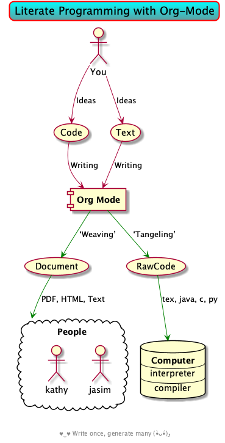
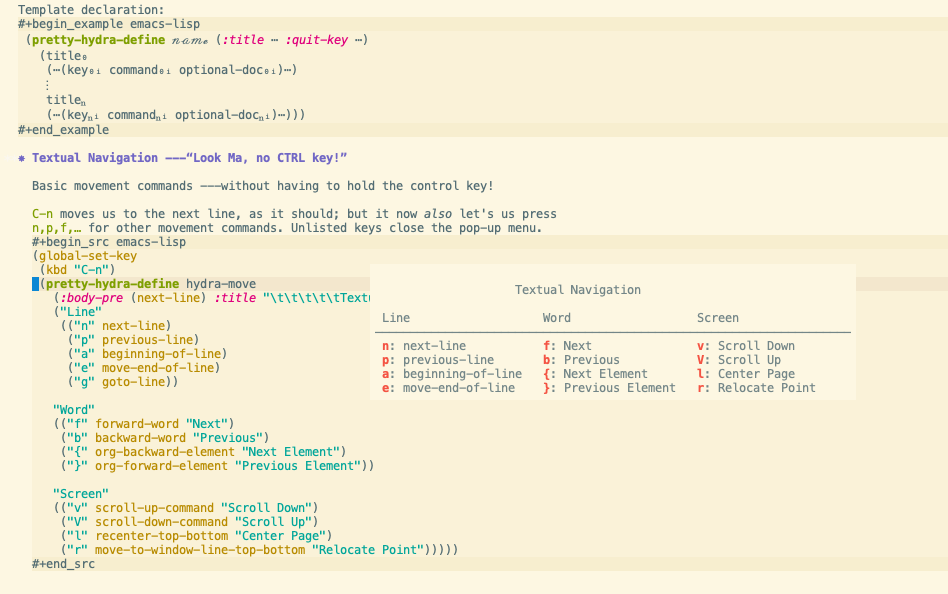
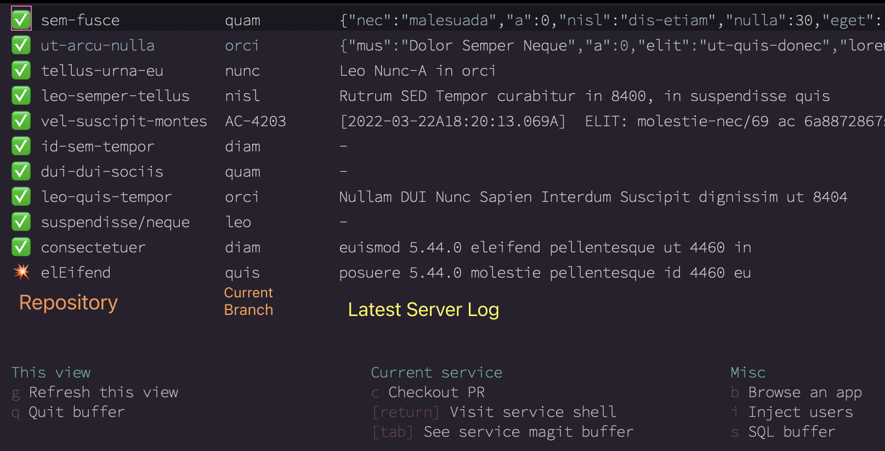
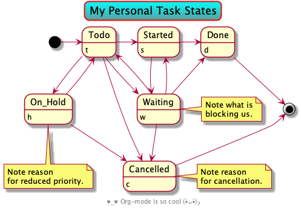
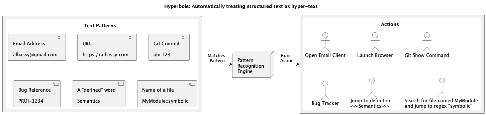

# -*- org-export-use-babel: nil -*-

# السّلام عليكم ≈ “Hello, and welcome” in Arabic (العربيّة)
# ⟨Literally “Peace be upon you”⟩

#+title: A Life Configuring Emacs
#+author: Musa Al-hassy
#+email: alhassy@gmail.com
#+date: 2018-07-25
#+description: My Emacs Initialisation File, Written in Org-mode.
#+startup: indent
#+options: html-postamble:nil toc:2 d:nil num:t broken-links:auto
#+property: header-args :tangle init.el :comments link :results none :cache yes
#+property: HEADER-ARGS+ :eval no-export
#+export_file_name: index

In Emacs, I am only constrained by the limits of my imagination.  With
extensibility hooks and Lisp, I am allowed to think and realise any thoughts. In
contrast, dedicated apps may have constrained forms of extensibility out of
which I am not allowed to think further. /The tools delimits the kinds of
thoughts one can have./ For example, I am able to start doing a Weekly Review
with a simple textual template but, with Lisp in-hand, I can move to an involved
data-driven review that aggregates daily review data, compares it, and presents
me with interactive prompts.

* TODO Pomodoro: Staying on track 🤔

I love pomodoro, I've been using it for couple of years and I think it
is my biggest productivity improvement. Some people might say that it is
an overkill but for me is a huge success because of two main reasons:

1. I get up, move around, stretch and relax my eyes every 30 minutes
2. it forces me to focus a lot better, get into the zone faster and time
   box every task
3. 🔥 Ask myself: /Is what I'm doing important work? Or should I change gears?/


* Abstract                                                           :ignore:
:PROPERTIES:
:CUSTOM_ID: Abstract
:END:

#+begin_center
badge:A_Life|Configuring_Emacs|success|https://github.com/alhassy/emacs.d|gnu-emacs

badge:A_Life_Configuring|Emacs|success|https://alhassy.github.io/emacs.d/|gnu
#+end_center

#+html: <p align="center">
#+begin_center text
*Abstract*
#+end_center
#+html: </p>

[[doc:hello][Hello!]] Herein I document the configurations I utilise with [[https://gnu.org/s/emacs][Emacs]].
# After cloning the file, many packages are automatically installed; usually with
# little or no trouble.

# As a [[https://www.offerzen.com/blog/literate-programming-empower-your-writing-with-emacs-org-mode][literate program]] file with [[http://orgmode.org/][Org-mode]], I am ensured optimal navigation
# through my ever growing configuration files, ease of usability and reference
# for peers, and, most importantly, better maintainability for myself!

#+begin_center
# badge:Emacs|27|green|https://www.gnu.org/software/emacs|gnu-emacs
# badge:Org|9.4|blue|https://orgmode.org|gnu

[[badge:license|GNU_3|informational|https://www.gnu.org/licenses/gpl-3.0.en.html|read-the-docs][gnu 3 license badge]]
tweet:https://alhassy.com/emacs.d/

badge:author|musa_al-hassy|purple|https://alhassy.github.io/|nintendo-3ds
badge:|buy_me_a coffee|gray|https://www.buymeacoffee.com/alhassy|buy-me-a-coffee

# badge:Hire|me|success|https://alhassy.github.io/about
#+end_center

This article is about /how I like/ to do things
---/I'm not insisting others should/ do things this way.

#+begin_box "Quick Help"
Dear reader, when encountering a foregin command ~X~ I encourage you to execute
~(describe-symbol 'X)~, or press kbd:C-h_o with the cursor on ~X~.  An elementary
Elisp Cheat Sheet can be found at [[badge:Elisp|CheatSheet|success|https://alhassy.github.io/ElispCheatSheet/CheatSheet.pdf|Gnu-Emacs][Elisp cheat sheet]] and
badge:Lifemacs|CheatSheet|informational|https://alhassy.github.io/emacs.d/CheatSheet.pdf|Gnu-Emacs
is a 2-page 3-column PDF of the bindings in /this/ configuration.
+ kbd:C-h_e ⇒ *What'd /Emacs/ do?*
+ kbd:C-h_o ⇒ *What's this thing?*
+ kbd:C-h_l ⇒ *What'd /I/ do?*
+ [[kbd:C-h_?]] ⇒ *What're the help topics?* ---gives possible completions to “C-h ⋯”.

“I accidentally hit a key, which one and what did it do!?” ⇒ kbd:C-h_e and kbd:C-h_l,
  then use kbd:C-h_o to get more details on the action. 😁
#+end_box


# TODO: Copy/paste this to my blog welcome page.
#+begin_quote
                     When people say “What are you doing?”,
                        You say ⟪Things that please me.⟫
                          They say “Toward what end?”,
                            and you say ⟪Pleasure.⟫
                They say “But really, what are you working on?”
                         You say ⟪Having a good time!⟫
#+end_quote


* Meta-setup                                                         :ignore:
:PROPERTIES:
:CUSTOM_ID: Meta-setup
:END:
** Blog/HTML Setup                                                   :ignore:
:PROPERTIES:
:CUSTOM_ID: Blog-HTML-Setup
:END:
# ─AlBasmala keywords─
# DRAFT: yes
#+SOURCEFILE: https://github.com/alhassy/emacs.d/blob/master/init.org
#+IMAGE: ../assets/img/emacs_logo.png
#+CATEGORIES: Emacs Lisp

#+html_head: <link href="https://alhassy.github.io/org-notes-style.css" rel="stylesheet" type="text/css" />
#+html_head: <link href="https://alhassy.github.io/floating-toc.css" rel="stylesheet" type="text/css" />
#+html_head: <link href="https://alhassy.github.io/blog-banner.css" rel="stylesheet" type="text/css" />
# The last one has the styling for lists.

** Github Actions                                                  :noexport:
:PROPERTIES:
:CUSTOM_ID: Github-Actions
:END:

The following creates the “Github Actions Workflow” file;
this way, Github will run your tests every time you commit ^_^

Below I'm using =main= as the /name/ of the main branch; if you use =master= as the
name, then change that or otherwise the tests will not trigger automatically
after push!

#+begin_src shell :tangle .github/workflows/main.yml :mkdirp yes
# This workflow will do a clean install of dependencies and run tests
# For more information see: https://help.github.com/actions/language-and-framework-guides/

name: Lifemacs Loads Successfully

# Controls when the action will run.
on:
  # Triggers the workflow on push or pull request events but only for the main branch
  push:
    branches: [ master ]
  pull_request:
    branches: [ master ]

  # Allows you to run this workflow manually from the Actions tab
  workflow_dispatch:

# A workflow run is made up of one or more jobs that can run sequentially or in parallel
jobs:
  # This workflow contains a single job called "build"
  build:
    # The type of runner that the job will run on
    runs-on: ubuntu-latest

    # Steps represent a sequence of tasks that will be executed as part of the job
    steps:
      # Checks-out your repository under $GITHUB_WORKSPACE, so your job can access it
      - uses: actions/checkout@v6

      - name: Set up Emacs
        uses: purcell/setup-emacs@v8.0
        with:
          version: 29.4

      # Runs a single command using the runners shell
      # - name: Run a one-line script
      #  run: echo Hello, world!

      # Runs a set of commands using the runners shell
      # - name: Run a multi-line script
      #  run: |
      #    echo Add other actions to build,
      #    echo test, and deploy your project.

      - name: where am I and what is here
        run: |
          pwd
          ls

      - name: Install Org from GNU ELPA
        run: emacs -nw --batch --eval='(progn
                              (require (quote package))
                              (add-to-list (quote package-archives)
                                           (quote ("gnu" . "https://elpa.gnu.org/packages/")))
                              (package-initialize)
                              (package-refresh-contents)
                              (package-install (quote org))
                              (message "Installed Org %s" (org-version)))'

      - name: Startup smoke test
        run: time emacs -nw --batch --eval='(let
                                (
                                 (user-emacs-directory default-directory))
                              (message "Default directory" )
                              (message default-directory)
                              (setq url-show-status nil)
                              (package-initialize)
                              (load-file "init.el")
                              (message "\n 🤤 Startup Successful! 🤩"))'

      - name: Run ERT tests
        run: time emacs -nw --batch --eval='(let
                                ((user-emacs-directory default-directory))
                              (setq url-show-status nil)
                              (package-initialize)
                              (load-file "init.el")
                              (load-file "init-test.el")
                              (ert-run-tests-batch-and-exit))'
#+end_src

TODO: Build HTML export as a minimal test that things work as expected.

                              (find-file "init.org")
                              (org-html-export-to-html)
                              (message "\n 🤤 HTML Export Successful! 🤩")

(unless running-tests ...) ;; Use this to omit stuff from the Github Actions test

*** Testing with ERT

The Github Actions workflow above verifies that =init.el= loads
without error — a smoke test.  But a literate config accumulates
real logic over time: agenda work-item rendering, archive merging,
hideshow defaults, LSP integration.  When that logic breaks, a
successful load tells us nothing.

We use Emacs' built-in ERT (Emacs Regression Testing) framework,
with tests tangled to =init-test.el=.  CI runs them automatically
via ~ert-run-tests-batch-and-exit~ (see the workflow step above).
Locally, load =init-test.el= and run a specific family with
~M-: (ert '(tag work-item))~, or all tests with ~M-: (ert t)~.

Alternatively, just run this shell command
#+begin_src shell :tangle no
cd ~/.emacs.d/; clear; emacs -nw --batch --eval='(let ((user-emacs-directory default-directory))
    (setq url-show-status nil)
    (package-initialize)
    (load-file "init.el")
    (load-file "init-test.el")
    (ert-run-tests-batch-and-exit))'
#+end_src

**** =deftestfixture=: Test macros with baked-in fixtures

When many ~ert-deftest~ forms share the same setup/teardown — by way
of example, creating a temp file and deleting it afterwards — you end
up repeating that wrapping in every single test:

#+begin_example emacs-lisp
(ert-deftest my-test-1 ()
  (let ((tmp (make-temp-file "test")))
    (unwind-protect
        (progn (should (file-exists-p tmp)))
      (delete-file tmp))))

(ert-deftest my-test-2 ()
  (let ((tmp (make-temp-file "test")))
    (unwind-protect
        (progn (should (equal "" (f-read tmp))))
      (delete-file tmp))))

;; ...and so on, for every test that needs a temp file.
#+end_example

=deftestfixture= axes that repetition.  It generates a new macro that
bakes the shared setup/teardown into every test automatically:

#+begin_example emacs-lisp
(deftestfixture deftempfiletest
  (let ((tmp (make-temp-file "test")))
    (unwind-protect
        (progn &body)           ; ← test body goes here
      (delete-file tmp))))

(deftempfiletest "tmp file exists on disk"
  (should (file-exists-p tmp)))

(deftempfiletest "tmp file is initially empty"
  (should (equal "" (f-read tmp))))
#+end_example

Each =deftempfiletest= expands to an ~ert-deftest~ wrapped in the
fixture — with string-based test names and auto-derived tags as a
bonus.  The identity case ~(deftestfixture deftest)~ produces a macro
with no fixture, which is still an improvement over raw ~ert-deftest~:
test descriptions are natural-language strings, not hand-mangled
symbols.

***** Eval-and-run: ~C-x C-e~ on test forms

With vanilla ~ert-deftest~, writing a test is a two-step dance:
~C-x C-e~ to define it, then ~M-x ert~ and type a selector to run
it.  Every macro generated by =deftestfixture= is registered, and
~eval-last-sexp~ is advised to detect these forms: when you press
~C-x C-e~ at the end of a =deftest=, =defworkitemtest=, or any other
fixture-generated test, it is both defined /and/ run in one
keystroke.  Normal ~C-x C-e~ behaviour is unchanged for all other
forms.

The registry, =eval-last-sexp= advice, and =deftestfixture= all live
in =init-test.el=.  Loading that file gives you the macro /and/ the
eval-and-run behaviour together.

#+begin_src emacs-lisp :tangle init-test.el
(defvar deftestfixture--registry (make-hash-table :test 'eq)
  "Set of macro names generated by `deftestfixture'.
Used by `my/eval-last-sexp--run-test' to detect when `C-x C-e'
is invoked on a test form, so it can eval-and-run in one step.")

(defun my/eval-last-sexp--run-test (&rest _)
  "After `eval-last-sexp', if the form was a `deftestfixture'-generated
test, run it immediately.  This turns `C-x C-e' into eval-and-run
for test forms — zero extra keystrokes."
  (save-excursion
    (backward-sexp)
    (when-let* ((form (sexp-at-point))
                (_    (consp form))
                (head (car form))
                (_    (gethash head deftestfixture--registry)))
      ;; Macroexpand to find the ert-deftest name.
      (let ((expanded (macroexpand-1 form)))
        (when (and (consp expanded)
                   (eq (car expanded) 'ert-deftest))
          (let ((test-name (cadr expanded)))
            (message "Running test: %s" test-name)
            (ert test-name)))))))

(advice-add 'eval-last-sexp :after #'my/eval-last-sexp--run-test)

(defvar deftest-space "·"
  "The symbol used in place of whitespace in test names.
The default is interpunct style (middle dot).  Alternatives:
  - Hyphens:     OSBE-org-source-exports
  - Snakecase:   OSBE_org_source_exports
  - Underbracket: OSBE␣org␣source␣exports")

(cl-defmacro deftestfixture (name &optional docstring-or-form fixture-form)
  "Define a new test macro NAME that wraps each test body in FIXTURE-FORM.
A test fixture is the fixed baseline state that tests run against —
the setup that must be in place before the test logic executes.  By
way of example: a temp directory, a database connection, or config
variable bindings.  The name reads as \"define a test-with-fixture
macro\", which is precisely what it does.

ERT (§6.2) deliberately omits fixture syntax, noting that
`with-my-fixture' macros are the idiomatic Lisp approach and that
\"special syntax for them could be added but would provide only a
minor simplification.\"  This macro is that minor simplification:
it defines the `with-my-fixture' wrapper and wires it into
`ert-deftest' — with string-based naming and auto-derived tags —
in one step.

Each generated macro is also registered so that `C-x C-e'
(`eval-last-sexp') both defines and runs the test in one
keystroke — no separate `M-x ert' invocation needed.

NAME is the symbol for the generated macro.  DOCSTRING-OR-FORM is
either a documentation string (when FIXTURE-FORM is also provided)
or the fixture form itself (when no docstring is needed).  When
both are omitted, the generated macro has no fixture — its body is
spliced directly into `ert-deftest'.

FIXTURE-FORM is an expression with a hole for the body — represented
by the symbol `&body'.  When nil, the body is spliced directly
\(no wrapping).

The generated macro has the signature:
  (NAME DESCRIPTION &optional TAGS &rest BODY)
where DESCRIPTION is a string and TAGS is an optional vector.

Example — define `deftest' (the identity, no fixture):
  (deftestfixture deftest)

Even this trivial case is already an improvement over raw
`ert-deftest': test names are natural-language strings (not
hand-mangled symbols), tags are auto-derived from the first
word, and the boilerplate docstring + :tags declaration
disappears entirely.

Example — define `defworkitemtest' with a docstring and fixture:
  (deftestfixture defworkitemtest
    \"Bind Gerrit/Jira config vars to safe test defaults.\"
    (let ((my\\\\jira-ticket-regex ...)
          (my\\\\gerrit-base-url ...))
      &body))

Then:
  (defworkitemtest \"work-item shows Jira ticket\" [work-item]
    (should ...))

expands to an `ert-deftest' wrapped in the fixture bindings.

Example — define `deforgtest' for config-smoke tests that need an
org-mode buffer:
  (deftestfixture deforgtest
    \"Temp org-mode buffer with auto-cleanup.\"
    (let ((*original-test-buffer* (generate-new-buffer \"*test-org*\")))
      (switch-to-buffer *original-test-buffer*)
      (org-mode)
      (unwind-protect (progn &body)
        (ignore-errors (org-clock-out))
        (when (get-buffer *original-test-buffer*)
          (kill-buffer *original-test-buffer*)))))

Then:
  (deforgtest \"C-RET creates heading with CREATED\" [config-smoke]
    (execute-kbd-macro (kbd \"C-<return>\"))
    (insert \"My neato notes\")
    (should (org-entry-get (point) \"CREATED\")))

The body can reference `*original-test-buffer*' after switching
away (e.g., to verify C-c SPC jumps back).  The cleanup phase
clocks out any dangling clock, then kills the buffer — no
switch-to-buffer, unwind-protect, or kill-buffer needed in tests."
  (declare (indent 1))
  ;; Disambiguate: if DOCSTRING-OR-FORM is a string, it's a docstring
  ;; and FIXTURE-FORM is the fixture.  Otherwise DOCSTRING-OR-FORM is
  ;; the fixture and there is no docstring.
  (let* ((user-docstring (when (stringp docstring-or-form)
                           docstring-or-form))
         (fixture-form   (if (stringp docstring-or-form)
                             fixture-form
                           docstring-or-form))
         (ert-usage "\n\n\
BODY is evaluated as a `progn' when the test is run.  It should
signal a condition on failure or just return if the test passes.

`should', `should-not', `should-error', `skip-when', and
`skip-unless' are useful for assertions in BODY.

Use `ert' to run tests interactively.  Even easier: `C-x C-e'
at the end of a test form both defines and runs it in one
keystroke, courtesy of `deftestfixture--registry'.

Tests that are expected to fail can be marked as such
using :expected-result.  See `ert-test-result-type-p' for a
description of valid values for RESULT-TYPE.

Macros in BODY are expanded when the test is defined, not when it
is run.  If a macro (possibly with side effects) is to be tested,
it has to be wrapped in `(eval (quote ...))'.")
         (docstring
          (concat
           (or user-docstring
               (format "Test macro generated by `deftestfixture'.%s"
                       (if fixture-form
                           (format "\nFixture: %S" fixture-form)
                         "")))
           ert-usage))
         (assert-msg
          (format "\"%s\" expects its first argument to be a string literal"
                  name))
         (wrap-expr
          (if fixture-form
              `(list
                (cl-subst (cons 'progn actual-body) '&body
                          ',fixture-form))
            'actual-body)))
    `(progn
       (puthash ',name t deftestfixture--registry)
       (cl-defmacro ,name (description &optional tags &rest body)
         ,docstring
         (declare (indent defun))
         (cl-assert (stringp description) nil ,assert-msg)
         (let*
             ((replacements
               `((" " . ,deftest-space)
                 ("`" . "") ("'" . "")
                 ("," . "︐") ("`" . "‵")
                 (";" . "︔") ("[" . "⁅") ("]" . "⁆")))
              (provided-tags (seq--into-list (and (vectorp tags) tags)))
              (test-name
               (concat
                (if provided-tags
                    (format "%s··⇨··"
                            (s-join "︐" (mapcar #'prin1-to-string
                                                provided-tags)))
                  "")
                (thread-last description s-trim s-collapse-whitespace
                             (s-replace-all replacements))))
              (method-being-tested
               (thread-last description s-trim (s-split " ") car
                            (s-replace-all replacements)))
              (actual-body (if (vectorp tags) body (cons tags body)))
              (wrapped-body ,wrap-expr))
           `(ert-deftest ,(intern test-name) ()
              :tags ',(cons method-being-tested provided-tags)
              ,@wrapped-body))))))

(deftestfixture deftest)

;;  Switches to a temp org-mode buffer, runs the body, kills the buffer even on failure.
(deftestfixture deforgtest
  "Switch to a temporary org-mode buffer, run BODY, then kill the buffer.
Most config-smoke tests need an org buffer with mode hooks fired —
this fixture axes that boilerplate.  The buffer object is bound to
`*original-test-buffer*' so tests can reference it after switching away."
  (let ((*original-test-buffer* (generate-new-buffer "*test-org*")))
    (switch-to-buffer *original-test-buffer*)
    (org-mode)
    (unwind-protect
        (progn &body)
      ;; Even if some assertion fails, we should clock-out! No dangling clocks!
      (ignore-errors (org-clock-out))
      ;; Kill the buffer even when a `should' signals failure —
      ;; without unwind-protect, a failing assertion would leak it.
      (when (get-buffer *original-test-buffer*)
        (kill-buffer *original-test-buffer*)))))
#+end_src

#+begin_src emacs-lisp :tangle init-test.el
;; The 😴 macro defers code via `run-with-idle-timer'.  In batch mode
;; those timers never fire, so hooks, mode setups, etc. are absent.
;; Force every pending timer to fire now, making the deferred init eager.
(mapc (lambda (timer) (ignore-errors (timer-event-handler timer))) timer-idle-list)

;; Several use-package declarations register global modes via
;; :hook (after-init . global-*-mode).  In CI, after-init-hook fires
;; before load-file "init.el", so these registrations miss the boat.
;; Re-run the hook so they activate.
(run-hooks 'after-init-hook)

(advice-add 'org-resolve-clocks :override #'ignore)
#+end_src

** Personal instructions for a new machine                           :ignore:
:PROPERTIES:
:CUSTOM_ID: Personal-instructions-for-a-new-machine
:END:
#+begin_details "“Personal instructions for a new machine”"
These steps must be performed at the terminal /since/ they are
required to get /my/ Emacs, which then installs everything else /when
it's first opened/.

1. Install a package manager: https://brew.sh/ :

  #+begin_src shell :tangle no
/bin/bash -c "$(curl -fsSL https://raw.githubusercontent.com/Homebrew/install/HEAD/install.sh)"
  #+end_src

   Also: Change to the conventional scrolling direction:
   /If I pull my scroll down, I want to go down./
   - Apple menu → System Preferences → Mouse → Tick the scroll direction option.

2. [[https://www.emacswiki.org/emacs/EmacsForMacOS#h5o-14][Use brew to get Emacs]]:
   #    #+begin_src shell :tangle no
   # brew install --cask emacs
   #    #+end_src
   #
   #+begin_src shell :tangle no
# https://github.com/d12frosted/homebrew-emacs-plus
$ brew tap d12frosted/emacs-plus
$ brew reinstall emacs-plus@30  --with-xwidgets --with-imagemagick --with-dbus --with-debug --with-no-frame-refocus --with-native-comp --with-savchenkovaleriy-big-sur-3d-icon --with-poll
#+end_src
  # --with-EmacsIcon3-icon
  # --with-spacemacs-icon

   # $ /usr/local/Cellar/emacs-plus@29/29.0.50/bin/emacs-29.0.50 &
   #
   # In ~/.bashrc, or ~/.zshrc, put the following at the end:
   # alias emacs="/opt/homebrew/Cellar/emacs-plus@29/29.0.90/bin/emacs-29.0.90"
   #

   #
   #    If that fails, try this to [[https://github.com/daviderestivo/homebrew-emacs-head#gnu-emacs-27-bottle-or-head][install Emacs:]]
   #    #+BEGIN_SRC shell :tangle no
   # brew tap daviderestivo/emacs-head
   # brew install emacs-head
   # #+END_SRC
   #
3. [[https://emacs.stackexchange.com/a/50405/10352][Then]]    [[https://www.emacswiki.org/emacs/EmacsForMacOS#h5o-14][make]]   the command ~emacs~ available via the terminal ---required if
   doing any melpa development.
   #+begin_src shell :tangle no
ln -s /opt/homebrew/opt/emacs-plus@30/Emacs.app /Applications
   #+end_src
   # sudo ln -s /usr/local/opt/emacs-head@27/Emacs.app/Contents/MacOS/Emacs /usr/local/bin/emacs

4. Why ~--with-imagemagick~?

    ;; This lets us change the size of images when shown in Org-mode.
    #+begin_src emacs-lisp
    (setq org-image-actual-width nil)
    #+end_src

    #+begin_org-demo
    #+ATTR_HTML: :alt musa in a pink shirt :title The author of this article :align center
    #+ATTR_HTML: :width 50% :height 50%
    [[~/blog/images/musa_pink.jpg]]
    #+end_org-demo

    Note that only the =:width= option is used for in-Org image preview.

5. [@5]  Why =--with-xwidgets=?

    We get a full-fledged Internet browser /within/ Emacs.
    #+begin_src emacs-lisp
    ;; Day-to-day, open URLs in the system browser (Arc, Chrome, etc.).
    ;; When blogging, we can temporarily switch to xwidget-webkit-browse-url.
    (setq browse-url-browser-function 'browse-url-default-browser)

    ;; (use-package xwwp) ;; Enhance the Emacs xwidget-webkit browser
    #+end_src

    Related: doc:goto-address-mode is useful whenever you have a buffer full of "http..." URLs (e.g.., a JSON file):
    It makes them into clickable buttons or via =C-c RET=.

   + How about EAF or nyxt?

      An alternative to xwidget-webkit is EAF, sadly this does not work well with MacOS.

      EAF essentially makes Emacs a window manager that runs other GUI apps ---as such, EAF buffers are not classic Emacs
      buffers (and so your favourite text commands are useless).

      There is also:
      | nyxt  ≅  the web running common lisp instead of JS  ≅  an Emacs backed-by common lisp |

   + Tell me more about xwidget-webkit

      I’ve found that the only two applications I regularly have open are Emacs and a browser ---and Emacs has a modern
      browser, so might as well use that in Emacs.
     - Downsides of Emacs as a browser: Some webpages, such as Slack, try to be an editor and so I'm using a Slack editor
       insider a web browser inside an text editor (Emacs). As such, sometimes the lines between editor and browser need to
       be  explicitly demarcated; e.g., via ~xwidget-webkit-edit-mode~.
     - *“xwidget ≈ eXternal widget”* lets us embed GTK widgets inside an Emacs window; e.g., we can insert fancy buttons via
       ~xwidget-insert~, and a browser using doc:xwidget-webkit-browse-url.
     - For history and info on xwidget, see [[https://github.com/jave/xwidget-emacs][the original patch]];
       See also: https://webkitgtk.org/

6. Install git: =brew install git=

7. Get my Emacs setup: =rm -rf ~/.emacs.d; git clone
   https://github.com/alhassy/emacs.d.git ~/.emacs.d=

   Open Emacs and watch download and set up many other things ... ^_^

   *This may take ~15 minutes ---we install a massive LaTeX setup.*

We get: Spell checker, dictionary, LaTeX + pygements, Dropbox, AG (for fast system-wide searching
of a string with doc:helm-do-grep-ag, useful for finding definitions).
# Amethyst window manager.
#
# Amethyst requires some more setup: Open its preferences, then...
#     - Then select: =Mouse: Focus follows mouse=.
#     - Also: =Shortcuts=, then disable ‘increase/decrease main pane count’ bindings
      since they override the beloved Emacs =M-<,>= keys.

For convenience, on a Mac, add the home (=~/=) directory to the default file
navigator: Finder → Preferences → Sidebar, then select home 🏠.

If you notice any “file system access” concerns, give Emacs permissions to read
your files: General Settings → Security & Privacy → Full Disk Access → ~⌘-M-g~ (to
search) then enter =/usr/bin/ruby= ---Emacs is launched via a Ruby script in
MacOS.

Finally, see the Prose/Unicode section, we need to manually install the Symbol font for subscripts.

#+end_details
* Why Emacs?
:PROPERTIES:
:CUSTOM_ID: Why-Emacs
:header-args: :tangle init.el
:END:

A raw code file is difficult to maintain, especially for a /large/ system such as
Emacs. Instead, we're going with a ‘literate programming’ approach: The
intialisation configuration is presented in an essay format, along with headings
and subheadings, intended for consumption by humans such as myself, that,
incidentally, can be ‘tangled’ into a raw code file that is comprehensible by a
machine. We achieve this goal using [[#Life-within-Org-mode][org-mode]] ---which is /Emacs' killer app/.

** Mini-tutorial on Org-mode                                         :ignore:
:PROPERTIES:
:CUSTOM_ID: Mini-tutorial-on-Org-mode
:header-args: :tangle no
:END:

# To include this mini-tutorial elsewhere:
#    #+include: ~/.emacs.d/init.org::#Mini-tutorial-on-Org-mode

#+begin_details Super Simple Intro to Emacs’ Org-mode
link-here:Super-Simple-Intro-to-Emacs-Org-mode
Emacs’ Org-mode is an outliner, a rich markup language, spreadsheet tool,
literate programming system, and so much more. It is an impressive reason to
use Emacs (•̀ᴗ•́)و

# badge:Emacs|27|green|https://www.gnu.org/software/emacs|gnu-emacs
# badge:Org|9.4|blue|https://orgmode.org|gnu

Org-mode syntax is very /natural/; e.g., the following is Org-mode!
( [[https://karl-voit.at/2017/09/23/orgmode-as-markup-only/][Org Mode Is One of the Most Reasonable Markup Languages to Use for Text]] )

#+begin_src org :noeval t
+ Numbered and bulleted lists are as expected.
  - Do the things:
    1.  This first
    2.  This second
    44. [@44] This forty-fourth
  - =[@𝓃]= at the beginning of an iterm forces
    list numbering to start at 𝓃
  - =[ ]= or =[X]= at the beginning for checkbox lists
  - Use =Alt ↑, ↓= to move items up and down lists;
    renumbering happens automatically.

+ Definitions lists:
   ~- term :: def~
+ Use a comment, such as =# separator=, between two lists
  to communicate that these are two lists that /happen/ to be
  one after the other. Or use any /non-indented/ text to split
  a list into two.

,* My top heading, section
  words
,** Child heading, subsection
  more words
,*** Grandchild heading, subsubsection
    even more!
#+END_SRC


*Export* In Emacs, press kbd:C-c_C-e_h_o to obtain an HTML webpage ---/like this
one!/--- of the Org-mode markup; use kbd:C-c_C-e_l_o to obtain a PDF rendition.

You can try Org-mode notation and see how it renders live at:
http://mooz.github.io/org-js/

--------------------------------------------------------------------------------

You make a heading by writing =* heading= at the start of a line, then you can
kbd:TAB to fold/unfold its contents. A table of contents, figures, tables can be
requested as follows:
#+BEGIN_SRC org
# figures not implemented in the HTML backend
# The 𝓃 is optional and denotes headline depth
,#+toc: headlines 𝓃
,#+toc: figures
,#+toc: tables
#+END_SRC

--------------------------------------------------------------------------------

+ *Markup* elements can be nested.

  | Syntax                             | Result           |
  |------------------------------------+------------------|
  | ~/Emphasise/~, italics               | /Emphasise/        |
  | ~*Strong*~, bold                     | *Strong*           |
  | ~*/very strongly/*~, bold italics    | */very strongly/*  |
  | ~=verbatim=~, monospaced typewriter  | =verbatim=         |
  | ~+deleted+~                          | +deleted+          |
  | ~_inserted_~                         | _inserted_         |
  | ~super^{script}ed~                   | super^{script}ed |
  | ~sub_{scripted}ed~                   | sub_{scripted}ed |

  * Markup can span across multiple lines, by default no more than 2.
  * In general, markup cannot be ‘in the middle’ of a word.
+ New lines demarcate paragraphs
+ Use =\\= to force line breaks without starting a new paragraph
+ Use /at least/ 5 dashes, =-----=, to form a horizontal rule

badge:org-special-block-extras|2.0|informational|https://github.com/alhassy/org-special-block-extras|Gnu-Emacs
provides support for numerous other kinds of markup elements, such as ~red:hello~
which becomes “ red:hello ”.

--------------------------------------------------------------------------------

*Working with tables*
#+BEGIN_SRC org
#+ATTR_HTML: :width 100%
#+name: my-tbl
#+caption: Example table
| Who? | What? |
|------+-------|
| me   | Emacs |
| you  | Org   |
#+END_SRC

Note the horizontal rule makes a header row and is formed by typing [[kbd:doit][| -]] then
pressing kbd:TAB. You can kbd:TAB between cells.
+ You can make an empty table with ~C-c |~, which is just
  doc:org-table-create-or-convert-from-region, then give it row×column
  dimensions.
+ Any lines with comma-separated-values (CSV) can be turned into an Org table by
   selecting the region and pressing ~C-u C-c |~.
   (Any CSV file can thus be visualised nicely as an Org table).
+ Use ~C-u C-u C-u C-c |~ to make a table from values that are speared by a certain regular expression.

--------------------------------------------------------------------------------

*Working with links*

Link syntax is =[[source url][description]]=; e.g., we can refer to the above
table with =[[my-tbl][woah]]=.
Likewise for images: =file:path-to-image.=

# The HTML has Up/Home on the right now ;-)
# +HTML_LINK_HOME: http://www.google.com
# +HTML_LINK_UP: http://www.bing.com

--------------------------------------------------------------------------------

*Mathematics*

#+BEGIN_org-demo
\[ \sin^2 x + \cos^2 x = \int_\pi^{\pi + 1} 1 dx = {3 \over 3} \]
#+END_org-demo

- Instead of ~\[...\]~, which displays a formula on its own line, centred, use
  ~$...$~ to show a formula inline.
- Captioned equations are numbered and can be referenced via links,
  as shown below.

#+BEGIN_org-demo :source-color green :result-color green
#+name: euler
\begin{equation}
e ^ {i \pi} + 1 = 0
\end{equation}

See equation [[euler]].
#+END_org-demo

--------------------------------------------------------------------------------

*Source code*
#+begin_org-demo :source-color custard :result-color custard
#+begin_src C -n
int tot = 1;                    (ref:start)
for (int i = 0; i != 10; i++)   (ref:loop)
   tot *= i;                    (ref:next)
printf("The factorial of 10 is %d", tot);
#+end_src
#+end_org-demo

The labels =(ref:name)= refer to the lines in the source code and can be
referenced with link syntax: ~[[(name)]]~. Hovering over the link, in the HTML
export, will dynamically highlight the corresponding line of code.  To strip-out
the labels from the displayed block, use ~-r -n~ in the header so it becomes
=#+begin_src C -r -n=, now the references become line numbers.

--------------------------------------------------------------------------------

Another reason to use Org:
If you use =:results raw=, you obtain *dynamic templates* that may use Org-markup:
#+begin_org-demo :source-color brown :result-color brown
#+BEGIN_SRC C :results raw replace
printf("*bold* +%d+ (strikethrough) /slanted/", 12345);
#+END_SRC

♯+RESULTS:
*bold* +12345+ (strikethrough) /slanted/
#+end_org-demo

The ~#+RESULTS:~ is obtained by pressing kbd:C-c_C-c on the ~src~ block, to execute
it and obtain its result.

Also: Notice that a C program can be run without a =main= ;-)

That is, we can write code /in between/ prose that is intended to be read like an
essay:

# This should be a URL, so that any includes will show the PNG.
# It does work locally too; but just in case...
# 
 [[file:https://alhassy.github.io/emacs.d/images/literate-programming.png]]

--------------------------------------------------------------------------------

+ badge:Lifemacs|CheatSheet|informational|https://alhassy.github.io/emacs.d/CheatSheet.pdf|Gnu-Emacs
  ⇒ A brief reference of Emacs keybindings; 2 pages
+ [[badge:Elisp|CheatSheet|success|https://alhassy.github.io/ElispCheatSheet/CheatSheet.pdf|Gnu-Emacs][Elisp cheat sheet]] ⇒ A /compact/ Emacs Lisp Reference; 7 pages

--------------------------------------------------------------------------------

*Single source of truth:* This mini-tutorial can be included into other Org files
by declaring
| ~#+include: ~/.emacs.d/init.org::#Mini-tutorial-on-Org-mode~ |

--------------------------------------------------------------------------------

For more, see https://orgmode.org/features.html.
#+end_details

** Intro to why Emacs                                                :ignore:
:PROPERTIES:
:CUSTOM_ID: Intro-to-why-Emacs
:END:

/Emacs is a flexible platform for developing end-user applications/
---unfortunately it is generally perceived as merely a text editor. Some people
use it specifically for one or two applications.

For example, [[https://www.youtube.com/watch?v=FtieBc3KptU][writers]] use it as an interface for Org-mode and others use it as an
interface for version control with Magit. [[https://orgmode.org/index.html#sec-4][Org]] is an organisation tool that can
be used for typesetting which subsumes LaTeX, generating many different formats
--html, latex, pdf, etc-- from a single source, keeping track of [[https://orgmode.org/worg/org-tutorials/index.html#orgff7b885][schedules]] &
task management, blogging, habit tracking, personal information management tool,
and [[http://orgmode.org/worg/org-contrib/][much more]].  Moreover, its syntax is so [[https://karl-voit.at/2017/09/23/orgmode-as-markup-only/][natural]] that most people use it
without even knowing!  For me, Org allows me to do literate programming: I can
program and document at the same time, with no need to seperate the two tasks
and with the ability to generate multiple formats and files from a single file.

#+begin_details A list of programs that can be replaced by Emacs
/Pieces of (disparate) software can generally be replaced by (applications
written on the) Emacs (text processing Lisp platform)./

From the table below, of non-editing things you can do with Emacs, it's
reasonable to think of Emacs as an operating system ---and Vim/Evil is one of
its text editors.

# Examples:
|----------------------------------------------+---+--------------------------------------------------------------------|
| Application                                  | ≈ | Emacs Package                                                      |
|----------------------------------------------+---+--------------------------------------------------------------------|
| Habit Tracker / TODO-list                    |   | Org mode                                                           |
| Agenda / Calendar / Time Tracker             |   | Org mode                                                           |
| Literate Programming (like Jupyter)          |   | Org mode                                                           |
| Blogging Software                            |   | Org mode                                                           |
| Reference Information Platform               |   | Org mode with [[https://orgmode.org/manual/Refile-and-Copy.html][refile]] and my/reference                          |
|----------------------------------------------+---+--------------------------------------------------------------------|
| Word Processing / PDFs / Slidedeck tool      |   | Org mode                                                           |
| Spell checker & dictionary & grammar checker |   | doc:ispell & langtool                                              |
| Reference and citation manager               |   | org-ref                                                            |
| PDF Viewer                                   |   | PDF View mode                                                      |
| Powerful Calculator                          |   | Calc-mode ([[https://hungyi.net/posts/solve-system-of-equations-literate-calc-mode/][Nice article on literate calc mode]])                     |
| Fillable Forms / Data Entry                  |   | [[https://www.gnu.org/software/emacs/manual/html_mono/widget.html][Widgets]]                                                            |
| Ebook Reader                                 |   | [[https://depp.brause.cc/nov.el/][nov.el]] and [[https://github.com/chenyanming/calibredb.el][calibredb.el]]                                            |
|----------------------------------------------+---+--------------------------------------------------------------------|
| Git / Version control                        |   | Magit or doc:vc-mode                                               |
| Shells                                       |   | doc:eshell or doc:shell                                            |
| Terminal emulators                           |   | doc:term, doc:ansi-term, and [[https://github.com/akermu/emacs-libvterm][vterm]]                                 |
| Package Manager                              |   | doc:helm-system-packages                                           |
| File Manager                                 |   | doc:dired                                                          |
| IDE / debugger                               |   | LSP / Dap                                                          |
| Scripting Language                           |   | Emacs Lisp                                                         |
| Web client / server                          |   | [[https://github.com/pashky/restclient.el][Restclient]] / [[https://github.com/skeeto/emacs-web-server][emacs-web-server]]                                      |
|----------------------------------------------+---+--------------------------------------------------------------------|
| [Neo]Vim / Modal text editor                 |   | EVIL mode                                                          |
| RSS Newsreader                               |   | ElFeed                                                             |
| Email                                        |   | Gnus / [[https://gist.github.com/rougier/009e7d13a816d053d8f319b56836e1c9?permalink_comment_id=3738945#gistcomment-3738945][Mu4e]] [very pretty!] / notmuch                               |
| Spredsheet tool                              |   | [[https://orgmode.org/manual/The-Spreadsheet.html][Org Table]] / [[https://www.reddit.com/r/emacs/comments/t8k1cw/simple_emacs_spreadsheet/][Simple Emacs Spreadsheet]] / spreadsheet-mode / csv-mode |
| Automatic file backups                       |   | ⟨Built-in⟩ & backup-walker                                         |
| seemless GPG tool                            |   | ⟨Built-in⟩                                                         |
| Lisp interpreter                             |   | Anywhere press kbd:C-x_C-e to run a Lisp expression                |
| Documentation viewer                         |   | tldr-mode; kbd:C-h_o / doc:describe-symbol                         |
| Diff / Merge tool                            |   | doc:ediff, doc:diff                                                |
|----------------------------------------------+---+--------------------------------------------------------------------|
| Games                                        |   | doc:tetris, pacman, mario, etc                                     |
| Psychologist                                 |   | doc:doctor                                                         |
| Weather Web Service                          |   | [[https://github.com/bcbcarl/emacs-wttrin][wttrin.el]] or [[https://github.com/aaronbieber/sunshine.el][sunshine.el]]                                           |
| Typing tutor                                 |   | typing-of-emacs                                                    |
| Modern Internet Browser                      |   | doc:xwidget-webkit-browse-url                                      |
| Street map viewer                            |   | [[https://github.com/minad/osm][osm.el - OpenStreetMap viewer for Emacs]]                            |
| everything else                              |   | [[https://github.com/emacs-eaf/emacs-application-framework][EAF]]                                                                |
|----------------------------------------------+---+--------------------------------------------------------------------|

I’m down to essentially Emacs and Chrome for almost all my work ---I like using Chrome; I like the integration of all things Google.
- The [[https://nyxt.atlas.engineer/][Nyxt browser]]  is an eerily Emacs-like browser ;-)

Were I “only coding”, then I'd use a popular Integrated Development Environment
that requires minimal setup and Just Worksᵀᴹ; but I blog, make cheat sheets, run
background services, etc, and so I need an /Integrated Computing Environment:/
Emacs.
#+end_details

#+begin_quote
If you are a professional writer…Emacs outshines all other editing software
in approximately the same way that the noonday sun does the stars.
It is not just bigger and brighter; it simply makes everything else vanish.
—[[http://project.cyberpunk.ru/lib/in_the_beginning_was_the_command_line/][Neal Stephenson]], /In the beginning was the command line/
#+end_quote

  + Extensible ⇒ IDEs are generally optimised for one framework, unlike Emacs!
      # Emacs is a live interpreter for ELisp.
    - You can /program/ Emacs to /automate/ anything you want.
      # Even arrow keys and characters can be customised, via self-insert-command!
    - Hence, it's an /environment/, not just an editor.
    - ⇒ Unified keybinding across all tools in your environment.

    Users are given a high-level full-featured programming language,
    not just a small configuration language. For the non-programmers,
    there is Custom, a friendly point-and-click customisation interface.
    # with support for a large portion of Common Lisp
  + Self Documented ⇒ Simply [[kbd:M-x info-apropos]] or kbd:C-h_d to search all manuals or
    look up any function provided by Emacs!
  + [[https://en.wikipedia.org/wiki/Emacs#History][Mature]] ⇒ tool with over 40 years of user created features
    - Plugins for nearly everything!
    - No distinction between built-ins and user-defined features! (Lisp!)
    - You can alter others' code [[https://www.gnu.org/software/emacs/manual/html_node/elisp/Advising-Functions.html][without even touching the source]].
      * Advising functions and ‘hooking’ functionality onto events.
  + [[https://www.gnu.org/philosophy/free-sw.html][Free software]] ⇒ It will never die!
    - Emacs is one of the oldest open source projects still under developement.
    # - Unlike other certain editors, Emacs' source is completely open.

Of course Emacs comes with the basic features of a text editor, but it is much more; for example, it comes with a
powerful notion of ‘undo’: Basic text editors have a single stream of undo, yet in Emacs, we have a /tree/ ---when we undo
and make new edits, we branch off in our editing stream as if our text was being version controlled as we type! We can
even switch between such branches! /That is, while other editors have a single-item clipboard, Emacs has an infinite
clipboard that allows undoing to any historical state./

#+begin_src emacs-lisp :tangle no :noweb-ref undo-tree-setup
;; Allow tree-semantics for undo operations.
(use-package undo-tree
  :bind ("C-x u" . undo-tree-visualize)
  :config
    ;; Each node in the undo tree should have a timestamp.
    (setq undo-tree-visualizer-timestamps t)

    ;; Show a diff window displaying changes between undo nodes.
    (setq undo-tree-visualizer-diff t)

    ;; Prevent undo tree files from polluting your git repo
    (setq undo-tree-history-directory-alist '(("." . "~/.emacs.d/undo")))

    ;; Always have it on
    (global-undo-tree-mode))

;; Execute (undo-tree-visualize) then navigate along the tree to witness
;; changes being made to your file live!
#+end_src
( The above snippet has a ~noweb-ref~: It is presented here in a natural
position, but is only executable once ~use-package~ is setup and so it
is weaved there! We can /present/ code in any order and /tangle/ it to
the order the compilers need it to be! )

/Emacs is an extensible editor: You can make it into the editor of your dreams!/
You can make it suited to your personal needs.
If there's a feature you would like, a behaviour your desire, you can simply code that into Emacs with
a bit of Lisp. As a programming language enthusiast, for me Emacs is my default Lisp interpreter
and a customisable IDE that I use for other programming languages
--such as C, Haskell, Agda, Lisp, and Prolog.
Moreover, being a Lisp interpreter, we can alter the look and feel of Emacs live, without having
to restart it --e.g., press kbd:C-x_C-e after the final parenthesis of ~(scroll-bar-mode 0)~
to run the code that removes the scroll-bar.

#+begin_quote
/I use Emacs every day. I rarely notice it. But when I do, it usually brings me joy./
─[[https://so.nwalsh.com/2019/03/01/emacs][Norman Walsh]]
#+end_quote

I have used Emacs as an interface for developing [[https://github.com/alhassy/CheatSheet#cheatsheet-examples][cheat sheets]], for making my
blog, and as an application for ‘interactively learning C’. If anything Emacs is
more like an OS than just a text editor --“living within Emacs” provides an
abstraction over whatever operating system my machine has: [[https://www.fugue.co/blog/2015-11-11-guide-to-emacs.html][It's so easy to take
everything with me.]] Moreover, the desire to mould Emacs to my needs has made me
a better programmer: I am now a more literate programmer and, due to Elisp's
documentation-oriented nature, I actually take the time and effort to make
meaningful documentation --even when the project is private and will likely only
be seen by me.

#+begin_quote
/Seeing Emacs as an editor is like seeing a car as a seating-accommodation./ -- [[https://karl-voit.at/2015/10/23/Emacs-is-not-just-an-editor/][Karl Voit]]
#+end_quote
# Comparing Emacs to an editor is like comparing GNU/Linux to a word processor. -- [[https://karl-voit.at/2015/10/23/Emacs-is-not-just-an-editor/][Karl Voit]]

**   /Emacs is a flexible platform for developing end-user applications/
:PROPERTIES:
:CUSTOM_ID: Emacs-is-a-flexible-platform-for-developing-end-user-applications
:END:
Just as a web browser is utilised as a platform for deploying applications,
   or ‘extensions’, written in JavaScript that act on HTML documents, Emacs is a
   platform for deploying applications written in Emacs Lisp that act on buffers
   of text.  In the same vein, people who say Emacs having Tetris is bloat are
   akin to non-coders who think their browser has bloat since it has a “view
   page source” feature ---which nearly all browsers have, yet it's only useful
   to web developers. Unlike a web browser in which the user must get accustomed
   to its features, Emacs is customised to meet the needs of its user.  (
   Incidentally, Emacs comes bundled with a web browser. )

   #+begin_quote
   In the case of Emacs the boundary between user and programmer is blurred as
   adapting the environment to one’s needs is [[https://www.gnu.org/software/emacs/emacs-paper.html][already an act of programming with
   a very low barrier to entry.]]    ---[[https://elephly.net/posts/2016-02-14-ilovefs-emacs.html][rekado]]
   #+END_quote

   #+begin_box
   /Don't just get used to your tool, make it get used to you!/
   #+end_box

   Emacs is not just an editor, but a host for running Lisp applications!

   For example, Emacs is shipped as a language-specific IDE to a number of
   communities ---e.g., Oz, Common Lisp, and, most notably, Agda.  Emacs is a
   great IDE for a language ---one just needs to provide a ‘major mode’ and will
   then have syntax highlighting, code compleition, jumping to definitions, etc.
   There is no need to make an IDE from scratch.

** The Power of Text Manipulation
:PROPERTIES:
:CUSTOM_ID: The-Power-of-Text-Manipulation
:END:
 Emacs has ways to represent all kinds of information as text.

 E.g., if want to make a regular expression rename of files in a directory,
 there's no need to learn about a batch renaming tool:
 [[kbd:M-x dired ⟨RET⟩ M-x wdired-change-to-wdired-mode]] now simply perform a /usual/
 find-and-replace, then save with the /usual/ kbd:C-x_C-s to effect the changes!

 Likewise for other system utilities and services (•̀ᴗ•́)و

Moreover, as will be shown below, you can literally use [[https://github.com/zachcurry/emacs-anywhere/#usage][Emacs anywhere]]
for textually input in your operating system --no copy-paste required.

** COMMENT It will change how you think about programming
:PROPERTIES:
:CUSTOM_ID: COMMENT-It-will-change-how-you-think-about-programming
:END:

Emacs is an incremental programming environment: You run snippets of code immediately after writing them ---there is no
formal edit-run cycle.  /The editor is the interpreter./

In my personal experience, Emacs introduced me to Lisp.
- Since Lisp has no concrete syntax, everything is written using abstract syntax trees (and macros introduce concrete,
  domain-specific, syntax), we can see Lisp everywhere and so see Lisp as “building material” for other programming
  languages.
- Likewise, Emacs is building material for a computing environment.  Whereas others might use a mixture of bash scripts
  to accomplish their goals, I can use Lisp to produce applications with radically distinct uses; e.g., using the same
  template application to produce email snippets and code snippets.

  - [ ] Generally speaking, applications provide configurations via checkboxes that can be ticked off (i.e., a JSON file).
    - [ ] What if you want such a feature enabled only under specific settings?
    - [ ] What if you want the value of the checkbox setting to be the result of an arbitrary expression evaluated
      according to a file?

    Emacs provides a full fledged programming language for the purposes of configuration: Press ~C- h k~ then any key
    sequence to find out what (well-documented) code is run, then /advise/ that code with your desired configuration.
    # This is the power of full introspectivity!

    That is, general applications are configured using a /passive/ JSON *files* (i.e., checkboxes) whereas Emacs is
    configured using an /executable/ Lisp *program*.

I have fallen head over heels for Lisp.

** Keyboard Navigation and Alteration
:PROPERTIES:
:CUSTOM_ID: Keyboard-Navigation-and-Alteration
:END:

Suppose you wrote a paragraph of text, and wanted to ‘border’ it up for
emphasies in hypens. Using the mouse to navigate along with a copy-paste of the
hypens is vastely inferior to the incantation [[kbd:M-{ C-u 80 - RET M-} C-u 80 -
RET]].  If we want to border up the previous 𝓃-many paragraphs, we simply prefix
kbd:M-{,} above with kbd:C-u_𝓃 ---a manual approach would have us count 𝓃 and
slowly scroll.  ( Exercise: What incantation of keys ‘underlines’ the current
line with /only/ the necessary amount of dashes?  ---Solution in the source
file. )
# =C-a C-k C-y RET C-y C-SPC C-a C-M-% . RET - RET !=

⇒ [[https://support.apple.com/en-ca/HT201236][MacOS supports]] many Emacs shortcuts, system-wide, such as kbd:C-a/e, kbd:C-d, kbd:C-k/y,
 kbd:C-o, kbd:C-p/n and even kbd:C-t for transposing two characters.  ⇐

** Emacs Proverbs as Koan
:PROPERTIES:
:CUSTOM_ID: Emacs-Proverbs-as-Koan
:END:

Below is an extract from William Cobb's “Reflections on the Game of Go”, with
minor personalised adjustements for Emacs. Enjoy!

The Japanese term /satori/ refers to the experience of enlightenment, the
realisation of how things really are that is the primary aim of practice and
meditation. However, the Zen tradition is famous for claiming that one cannot
say what it is that one realises, that is, one cannot articulate the content of
the enlightenment experience. Although it makes everything clear, it is an experience
beyond words. Instead of being given an explanation of how things are, the student of
Zen hears sayings called /koan/, often somewhat paradoxical in character, that come
from those who are enlightened:

+ “There are no CTRL and META.”
+ “If you meet an Emacs you dislike, kill it.”
+ “No one knows Emacs.”
+ “One can only learn Emacs by living within it.”
+ “To know Org mode is to know oneself.”

It is important to realise that /koan/ are intended to move you off of one path
and onto another. They are not just attempts to mystify you. For example,
the first proverb is in regards to newcomers complaining about too many
keybinings ---eventually it's muscle memory---, whereas the second is about
using the right tool for the right task ---Emacs is not for everyone. The fourth
is, well, Emacs is an operating system.

** Possibly Interesting Reads
:PROPERTIES:
:CUSTOM_ID: Possibly-Interesting-Reads
:END:
+ [[https://www.gnu.org/software/emacs/tour/][The Emacs Tour]]
+ [[https://sachachua.com/blog/series/a-visual-guide-to-emacs/][How to Learn Emacs: A Hand-drawn One-pager for Beginners / A visual tutorial]]
+ [[http://emacsrocks.com/][Video Series on Why Emacs Rocks]] ---catch the enthusiasm!
+ [[https://www.gnu.org/software/emacs/emacs-paper.html][EMACS: The Extensible, Customizable Display Editor]]
     # - This paper was written by Richard Stallman in 1981 and delivered in the
     #  ACM Conference on Text Processing.
     “The programmable editor is an outstanding opportunity to learn to program!”
+ [[https://www.gnu.org/philosophy/free-sw.html][What is free software?]]
   # + Link to emacs main site, [[https://www.gnu.org/software/emacs/][Emacs]] .
+ [[http://ehneilsen.net/notebook/orgExamples/org-examples.html#sec-18][Emacs org-mode examples and cookbook]]
+ [[https://m00natic.github.io/emacs/emacs-wiki.html][An Opinionated Emacs guide for newbies and beyond]]
+ [[https://tuhdo.github.io/emacs-tutor.html][Emacs Mini-Manual, Part I of III]]
  # + The [[http://tuhdo.github.io/emacs-tutor.html#orgheadline63][Emacs Mini Manual]], or
+ [[https://github.com/erikriverson/org-mode-R-tutorial/blob/master/org-mode-R-tutorial.org][Org and R Programming]] ---a tutorial on literate programming, e.g., evaluating code within ~src~ bloc.
+ Reference cards for [[https://www.gnu.org/software/emacs/refcards/pdf/refcard.pdf][GNU Emacs]], [[https://www.gnu.org/software/emacs/refcards/pdf/orgcard.pdf][Org-mode]], and [[https://github.com/alhassy/ElispCheatSheet/blob/master/CheatSheet.pdf][Elisp]].
+ [[https://www.reddit.com/r/emacs/comments/6fytr5/when_did_you_start_using_emacs/][“When did you start using Emacs” discussion on Reddit]]
+ [[https://david.rothlis.net/emacs/howtolearn.html][“How to Learn Emacs”]]
+ [[https://orgmode.org/index.html#sec-4][The Org-mode Reference Manual]] or [[https://orgmode.org/worg/][Worg: Community-Written Docs]] which includes a [[https://orgmode.org/worg/org-tutorials/index.html][meta-tutorial]].
+ [[https://github.com/emacs-tw/awesome-emacs][Awesome Emacs]]: A community driven list of useful Emacs packages, libraries and others.
+ [[https://github.com/caisah/emacs.dz][A list of people's nice emacs config files]]
  #  + [[https://emacs.stackexchange.com/questions/3143/can-i-use-org-mode-to-structure-my-emacs-or-other-el-configuration-file][Stackexchange: Using org-mode to structure config files]]
+ [[http://emacslife.com/how-to-read-emacs-lisp.html][Read Lisp, Tweak Emacs: How to read Emacs Lisp so that you can customize Emacs]]
+ [[https://practicaltypography.com/why-racket-why-lisp.html][Why Racket? Why Lisp?]]

---If eye-candy, a sleek and beautiful GUI, would entice you then consider starting with [[http://spacemacs.org/][spacemacs]].
   Here's a helpful [[https://www.youtube.com/watch?v=hCNOB5jjtmc][installation video]], after which you may want to watch
   [[https://www.youtube.com/watch?v=PVsSOmUB7ic][Org-mode in Spacemacs]] tutorial---

Remember: Emacs is a flexible platform for developing end-user applications; e.g., this configuration file
is at its core an Emacs Lisp program that yields the editor of my dreams
--it encourages me to grow and to be creative, and I hope the same for all who use it;
moreover, it reflects my personality such as what I value and what I neglect in my workflow.

# why emacs ---not marching to someone-else's tune!
#+begin_quote org
I’m stunned that you, as a professional software engineer, would eschew inferior
computer languages that hinder your ability to craft code, but you put up with
editors that bind your fingers to someone else’s accepted practice. ---[[http://www.howardism.org/Technical/Emacs/why-emacs.html][Howard
Abrams]]
#+end_quote
** Fun commands to try out
:PROPERTIES:
:CUSTOM_ID: Fun-commands-to-try-out
:END:
Finally, here's some fun commands to try out:
+ ~M-x doctor~ ---generalising the idea of rubber ducks
+ ~M-x tetris~  or ~M-x gomoku~ or ~M-x snake~---a break with a classic
  - ~C-u 𝓃 M-x hanoi~ for the 𝓃-towers of Hanoi
+ ~M-x butterfly~ ---in reference to [[https://xkcd.com/378/][“real programmers”]]

# Then, ~M-x help-with-tutorial~ or ~C-h t~ to start the ~30 min tutorial.

A neat way to get started with Emacs is to solve a problem you have, such
as taking notes or maintaining an agenda ---both with Org-mode.

Before we get started…
** What Does Literate Programming Look Like?
:PROPERTIES:
:CUSTOM_ID: What-Does-Literate-Programming-Look-Like
:END:

Briefly put, literate programming in Emacs allows us to evaluate source code
within our text files, then using the results as values in other source
blocks. When presenting an algorithm, we can talk it out, with a full commentary
thereby providing ‘reproducible research’: Explorations and resulting algorithms
are presented together in a natural style.

#+html: <p style="text-align:center">

:Src:
#+begin_src plantuml :file images/literate-programming.png :tangle no :exports results :eval never-export :results (progn (org-display-inline-images t t) "replace")
skinparam defaultTextAlignment center  /' Text alignment '/

skinparam titleBorderRoundCorner 15
skinparam titleBorderThickness 2
skinparam titleBorderColor red
skinparam titleBackgroundColor Aqua-CadetBlue
title Literate Programming with Org-Mode

actor You

You --> (Code) : Ideas
You --> (Text) : Ideas

[**Org Mode**] as Org

(Text) --> Org : Writing
(Code) --> Org : Writing

Org --[#green]> (Document) : ‘Weaving’
Org --[#green]> (RawCode)  : ‘Tangeling’

database Computer as "**Computer**
---
interpreter
---
compiler"

cloud People {
:jasim:
:kathy:
}

(Document) --[#green]> People : PDF, HTML, Text
(RawCode) --[#green]> (Computer) : tex, java, c, py

center footer  ♥‿♥ Write once, generate many (•̀ᴗ•́)و
#+end_src
:End:

#
# (org-display-inline-images t t)
⟨ This image was created in org-mode; details [[#Workflow-States][below]] or by looking at the source file 😉 ⟩
#+html: </p>

Here's an example of showing code in a natural style, but having the resulting
code appear in a style amicable to a machine. *Here's what you type:*
#+BEGIN_src org :tangle no
It's natural to decompose large problems,
,#+begin_src haskell :noweb-ref defn-of-f :tangle no
f = h ∘ g
,#+end_src

But we need to define $g$ and $h$ /beforehand/ before we can use them. Yet it's
natural to “motivate” their definitions ---rather than pull a rabbit out of
hat. Org lets us do that!

Here's one definition,
,#+begin_src haskell :noweb-ref code-from-other-places :tangle no
g = ⋯
,#+end_src

then the other.
,#+begin_src haskell :noweb-ref code-from-other-places :tangle no
h = ⋯
,#+end_src

Of-course, we might also want a preamble:
,#+BEGIN_SRC haskell :tangle myprogram.hs
import ⋯
,#+END_SRC

We can now tangle together the tagged code blocks in the order we want.
,#+BEGIN_SRC haskell :tangle myprogram.hs :comments none :noweb yes
<<code-from-other-places>>
<<defn-of-f>>
,#+END_SRC
( You can press “C-c C-v C-v” to see what this block expands into! )
#+END_src

Now kbd:C-c_C-v_C-t (doc:org-babel-tangle) yields a file named ~myprogram.hs~ with contents in an order
amicable to a machine.
#+BEGIN_SRC haskell :tangle no
import ⋯

g = ⋯
h = ⋯
f = h ∘ g
#+END_SRC

Interestingly, unlike certain languages, Haskell doesn't care too much about
declaration order.

*Warning!* If we have different language blocks tangled to the same file, then
they are tangled alphabetically ---e.g., if one of the blocks is marked
~emacs-lisp~ then its contents will be the very first one in the resulting source
file, since ~emacs-lisp~ begins with ~e~ which is alphabetically before ~h~ of
~haskell~.

+ [[http://www.howardism.org/Technical/Emacs/literate-programming-tutorial.html][Introduction to Literate Programming with Org-mode]]
+ [[http://ehneilsen.net/notebook/orgExamples/org-examples.html][Emacs org-mode examples and cookbook]]
+ [[https://leanpub.com/lit-config/read][Literate Config]] ---Online booklet

** Why a monolithic configuration?
:PROPERTIES:
:CUSTOM_ID: Why-a-monolithic-configuration
:END:

Why am I keeping my entire configuration ---from those involving cosmetics &
prose to those of agendas & programming--- in one file?  Being monolithic ---“a
large, mountain-sized, indivisible block of stone”--- is generally not ideal in
nearly any project: E.g., a book is split into chapters and a piece of software
is partitioned into modules. Using Org-mode, we can still partition our setup
while remaining in one file. An Emacs configuration is a personal, leisurely
project, and one file is a simple architecture: I don't have to worry about many
files and the troubles of moving content between them; instead, I have headings
and move content almost instantaneously ---org-refile by pressing ~w~ at the start
of the reader. Moreover, being one file, it is easy to distribute and to extract
artefacts from it ---such as the README for Github, the HTML for my blog, the
colourful PDF rendition, and the all-important Emacs Lisp raw code
file. Moreover, with a single ~#~ I can quickly comment out whole sections,
thereby momentarily disabling features.

There's no point in being modular if there's nothing explaining what's going on,
so I document.

The [[#conclusion----why-configuration-files-should-be-literate][concluding]] section of this read further argues the benefits of maintaining
literate, and monolithic, configuration files. As a convention, I will try to
motivate the features I set up and I will prefix my local functions with, well,
~my/~ ---this way it's easy to see all my defined functions, and this way I cannot
accidentally shadow existing utilities. Moreover, besides browsing the web, I do
nearly everything in Emacs and so the start-up time is unimportant to me: Once
begun, I have no intention of spawning another instance nor closing the current
one. ( Upon an initial startup using this configuration, it takes a total of
121 seconds to install all the packages featured here. )

                                     Enjoy!

* Booting Up
:PROPERTIES:
:CUSTOM_ID: Booting-Up
:header-args: :tangle init.el
:END:

Let's decide on where we want to setup our declarations for personalising Emacs
to our needs. Then, let's bootstrap Emacs' primitive packaging mechanism with a
slick interface ---which not only installs Emacs packages but also programs at
the operating system level, all from inside Emacs!  Finally, let's declare who
we are +and use that to setup Emacs email service.+

**   =~/.emacs= vs. =init.org=
:PROPERTIES:
:CUSTOM_ID: emacs-vs-init-org
:END:

/Emacs is extensible/: When Emacs is started, it tries to load a user's Lisp
program known as an *initialisation (‘init’) file* which specifies how Emacs
should look and behave for you.  Emacs looks for the init file using the
filenames =~/.emacs.el=, =~/.emacs=, or =~/.emacs.d/init.el= ---it looks for the first
one that exists, in that order; at least it does so on my machine.  Below we'll
avoid any confusion by /ensuring/ that only one of them is in our system.
Regardless, execute [[kbd:C-h o user-init-file]] to see the name of the init file
loaded. Having no init file is tantamount to have an empty init file.

+ One can read about the various Emacs initialisation files [[https://www.gnu.org/software/emacs/manual/html_node/emacs/Init-File.html#Init-File][online]] or
  within Emacs by the sequence [[kbd:C-h i m emacs RET i init file RET]].
+ A /friendly/ tutorial on ‘beginning a =.emacs= file’ can be read
  [[https://www.gnu.org/software/emacs/manual/html_node/eintr/Beginning-init-File.html#Beginning-init-File][online]] or within Emacs by [[kbd:C-h i m emacs lisp intro RET i .emacs RET]].
+ After inserting some lisp code, such as ~(set-background-color "salmon")~, and
  saving, one can load the changes with [[kbd:M-x eval-buffer]], doc:eval-buffer.
+ In a terminal, use ~emacs -Q~ to open emacs without any initialisation files.

# Emacs is a stateful Lisp-based machine!

Besides writing Lisp in an init file, one may use Emacs' customisation
interface, [[kbd:M-x customize]]: Point and click to change Emacs to your needs. The
resulting customisations are, by default, automatically thrown into your init
file ---=~/.emacs= is created for you if you have no init file.  This interface is
great for beginners.
# but one major drawback is that it's a bit difficult to
# share settings since it's not amicable to copy-pasting.
#
# Unless suggested otherwise, Emacs writes stuff to =~.emacs= automatically.

We shall use =~/.emacs.d/init.el= as the initialisation file so that /all/ of our
Emacs related files live in the /same/ directory: =~/.emacs.d/=.

A raw code file is difficult to maintain, especially for a /large/ system such as
Emacs. Instead, we're going with a ‘literate programming’ approach: The
intialisation configuration is presented in an essay format, along with headings
and subheadings, intended for consumption by humans such as myself, that,
incidentally, can be ‘tangled’ into a raw code file that is comprehensible by a
machine. We achieve this goal using [[#Life-within-Org-mode][org-mode]] ---/Emacs' killer app/--- which is
discussed in great detail later on.

#+begin_details "/Adventure time!/ “Honey, where's my init?”"
link-here:Adventure-time-Honey-where's-my-init
Let's use the three possible locations for the initialisation files
to explore how Emacs finds them. Make the following three files.

_~/.emacs.el_
#+BEGIN_SRC emacs-lisp :tangle no
;; Emacs looks for this first;
(set-background-color "chocolate3")
(message-box ".emacs.el says hello")
#+END_SRC

_~/.emacs_
#+BEGIN_SRC emacs-lisp :tangle no
;; else; looks for this one;
(set-background-color "plum4")
(message-box ".emacs says hello")
#+END_SRC

_~/.emacs.d/init.el_
#+BEGIN_SRC emacs-lisp :tangle no
;; Finally, if neither are found; it looks for this one.
(set-background-color "salmon")
(message-box ".emacs.d/init.el says hello")
#+END_SRC

Now restart your Emacs to see how there super tiny initilaisation files
affect your editor. Delete some of these files in-order for others to take effect!
#+end_details

#+begin_details Adventure time! Using Emacs’ Easy Customisation Interface
link-here:Adventure-time-Using-Emacs'-Easy-Customisation-Interface
We have chosen not to keep configurations in ~~/.emacs~ since
Emacs may explicitly add, or alter, code in it.

Let's see this in action!

Execute the following to see additions to the ~~/.emacs~ have been added by
‘custom’.
 1. [[kbd:M-x customize-variable RET line-number-mode RET]]
 2. Then press: kbd:toggle, kbd:state, then [[kbd:1]].
 3. Now take a look: [[kbd:C-x C-f ~/.emacs]]
#+end_details

#+begin_details Support for ‘Custom’
link-here:Support-for-Custom
Let the Emacs customisation GUI insert configurations into its own file, not
touching or altering my initialisation file.  For example, I tend to have local
variables to produce ~README.org~'s and other matters, so Emacs' Custom utility
will remember to not prompt me each time for the safety of such local variables.

#+begin_src emacs-lisp
;; Disable custom-file - all settings managed in init.el/init.org
(setq custom-file (make-temp-file "emacs-custom-"))

;; Kill noisy buffers that accumulate during init.
(add-hook 'emacs-startup-hook
  (lambda ()
    (dolist (buf '("*Shell Command Output*" "*Quail Completions*" "*Compile-Log*"))
      (when (get-buffer buf)
        (kill-buffer buf)))))
#+end_src

:No_longer_true:
Speaking of local variables, let's always load ones we've already marked as safe
---see the bottom of the source of this file for an example of local variables.
( At one point, all my files had locals! )
#+BEGIN_SRC emacs-lisp :tangle no
(setq enable-local-variables :safe)
#+END_SRC
:End:
#+end_details

** Separating Secrets from Configuration: =private.el=
:PROPERTIES:
:CUSTOM_ID: Separating-Secrets-from-Configuration
:END:

A public-facing config inevitably needs confidential data: API tokens, OAuth
secrets (e.g., ~my\gcal-personal-client-id~), internal URLs (e.g.,
~my\jira-base-url~), colleague names for meeting-shortcut keybindings (e.g.,
~my\colleagues~) work-specific paths.  We keep all of that in a companion file
---=~/Dropbox/private.el=--- that is *not* checked into version control.  We load it
eagerly at startup:

#+begin_src emacs-lisp
(load "~/Dropbox/private.el" 'no-error 'no-message)
#+end_src

Because =private.el= contains *only variable assignments* (~setq~ / ~defvar~)
--- no heavy packages, no network calls, no side-effects beyond binding symbols
--- loading it eagerly is safe and essentially instant.  This way every section
that follows can reference private variables without deferral gymnastics.

*Naming convention:*  Public symbols defined in this file use a forward-slash
prefix --- ~my/weather~, ~my/jump-to-clocked-task~.  Private variables set by
=private.el= use a *backslash* prefix instead --- ~my\birthday~, ~my\gerrit-base-url~.
The visual distinction makes it immediately obvious, at any call site, whether a
value is public (defined here in =init.org=) or confidential (injected by
=private.el=).

#+begin_box "Cautionary tale: private code rots"
It is tempting to stash entire functions, ~use-package~ blocks, and transient
menus in the private file --- "it has secrets, so the whole thing goes there."
We have transpired through exactly this:  =private.el= ballooned to 300+ lines
of logic that was invisible to the literate org file, never documented, rarely
reviewed, and increasingly stale.  The fix was to extract every secret into a
terse variable and move the logic back into =init.org= where it benefits from
headings, prose, and the discipline of tangling.

*Rule of thumb:*  If a block of code contains one secret, don't exile the
whole block.  Extract the secret into a variable, keep the logic public.
#+end

** Who am I?
:PROPERTIES:
:CUSTOM_ID: Who-am-I
:END:
Let's set the following personal Emacs-wide variables ---to be used locations
such as email.
#+begin_src emacs-lisp
(setq user-full-name    "Musa Al-hassy"
      user-mail-address "alhassy@gmail.com")
#+end_src

For some fun, run this cute method.
#+BEGIN_SRC emacs-lisp :tangle no
(animate-birthday-present user-full-name)
#+END_SRC

** The ~defer~ macro “😴”
#+begin_src emacs-lisp
(defmacro 😴 (&rest sexp)
  "Defer any sexp.

If you have a call `(f x y)' then `(😴 f x y)' behaves the same but is run
when Emacs has been idle for 10 seconds.

E.g., (setq hi 12) defines a variable `hi', so `M-: hi' shows a value.
Whereas (😴 setq hello 12) does not immediately define a variable: `M-: hello' yields an error
when run immediately, but yields a value when Emacs is idle for 2 seconds.

Save the name of this macro by highlighting it and pressing `C-x r s z', then use it with `C-x r i z'.

================================================================================

Using `macrostep-expand' we can verify the following approximations:

⇒ (use-package foo) ≈ (require 'foo)
⇒ (😴 use-package foo) ≈ (use-pacakge foo :defer 10)
⇒ (use-pacakge foo :defer t) ≈ nil ;; It doesn't load the package!
  ⭆ Of-course, since I have “:ensure t” implicitly, such declaration ensures
    package foo is installed.

================================================================================

This should be used as a last resort. Instead prefer `use-pacakge' lazy loading instead.

❌ Avoid :preface, :config, and :init since they unconditionally load the package immediately.
   ⇒ Favour :custom over :init; i.e., replace (use-package foo :init (setq x y)) with (use-pacakge foo :custom (x y)).
   ⇒ If you must use :init, add a “:defer t” clause as well, to load it when it's needed.
   ⇒ If your :config only sets keybindings, then prefer :bind or :bind-keymap.
✅ Prefer auto-loading keywords :bind, :hook, and :mode since they defer loading a package until it's needed.
  ⇒ These all imply “:defer t”.
✅ Prefer loading modes only after Emacs’ initialisation has finished.
  ⇒ Replace (use-package foo :config (foo-mode + 1)) with (use-package foo :hook after-init)
  ⇒ Note (use-package foo :defer t :config (foo-mode + 1)) isn't lazy even though there's a :defer, since
    the :config clause forces the mode to load.
"
  `(run-with-idle-timer 10 nil (lambda nil ,sexp)))

;; ;; (defmacro when-idle (&rest body)
;;    ;; `(run-with-idle-timer 20 nil (lambda () ,@body)))
;; ;;
;;
;; ;; first this,
;; (setq gc-cons-threshold most-positive-fixnum ; 2^61 bytes
;;       gc-cons-percentage 0.6)
;; ;; then
;; (😴 load-file "~/.emacs.d/deferred-init.el")
;; ;; finally [[the following should really be at the end of deferred-init.el]]
;; (add-hook 'emacs-startup-hook
;;   (lambda ()
;;     (setq gc-cons-threshold 16777216 ; 16mb
;;           gc-cons-percentage 0.1)))
#+end_src

[[https://www.gnu.org/software/emacs/manual/html_node/elisp/Autoload.html][Autoloading]]: /Register the existence of a function, but put off loading the file
that defines it./

1. When a package is built, all the autoload cookies “ ~;;;###autoload~ ” are
   parsed and collected in its own file, usually called =⟨package
   name⟩-autoloads.el=.

   In detail, here's how you'd do it by hand:
  #+begin_src emacs-lisp :tangle no
  ;; Set up autoloading for package PKG installed at PATH.
  (add-to-list 'load-path (directory-file-name (expand-file-name PATH)))
  (load (expand-file-name (package-generate-autoloads PKG PATH) PATH)))
  #+end_src

2. With proper use of autoloading, this file and /only/ this file should be
   loaded on startup.

3. It normally causes a bunch of calls to the Emacs built-in function =autoload=,
   which creates stub functions that, when called, causes the /actual/ file to be
   loaded.

4. When a package is /activated/, this autoloads file is loaded.

5. With =use-package=, we can use the =:commands= keyword to generate (autoload)
   stubs for us ---which defers loading of the package.

   As always, inspect the generated code (via ~macrostep-expand~) to see that it does what you expect:
   #+begin_src emacs-lisp :tangle no
     (use-package helpful :commands helpful-callable)
   ≈ (autoload (function helpful-callable) "helpful" nil t)
   #+end_src

** Emacs Package Manager
:PROPERTIES:
:CUSTOM_ID: Emacs-Package-Manager
:END:
# Installing Emacs packages directly from source

There are a few ways to install packages ---run kbd:C-h_C-e for a short
overview.  The easiest, for a beginner, is to use the command
doc:package-list-packages then find the desired package, press [[kbd:i]] to mark it
for installation, then install all marked packages by pressing [[kbd:x]].

+ /Interactively/: [[kbd:M-x list-packages]] to see all melpa packages that can install
  - Press kbd:Enter on a package to see its description.
+ Or more quickly, to install, say, unicode fonts: [[kbd:M-x package-install RET
  unicode-fonts RET]].

“From rags to riches”: Recently I switched to Mac ---first time trying the OS.
I had to do a few ~package-install~'s and it was annoying.  I'm looking for the
best way to package my Emacs installation ---including my installed packages and
configuration--- so that I can quickly install it anywhere, say if I go to
another machine.  It seems doc:use-package allows me to configure and auto
install packages.  On a new machine, when I clone my ~.emacs.d~ and start Emacs,
on the first start it should automatically install and compile all of my
packages through ~use-package~ when it detects they're missing. ♥‿♥

First we load ~package~, the built-in package manager.  It is by default only
connected to the GNU ELPA (Emacs Lisp Package Archive) repository, so we
extended it with other popular repositories; such as the much larger [[https://melpa.org/#/][MELPA]]
([[https://github.com/melpa/melpa][Milkypostman's ELPA]]) ---it builds packages directly from the source-code
repositories of developers rather than having all packages in one repository.
#+BEGIN_SRC emacs-lisp :tangle init.el
;; Make all commands of the “package” module present.
(require 'package)

;; Internet repositories for new packages.
(setq package-archives '(("gnu"    . "http://elpa.gnu.org/packages/")
                         ("nongnu" . "https://elpa.nongnu.org/nongnu/")
                         ("melpa"  . "http://melpa.org/packages/")))
#+END_SRC

#+BEGIN_SRC emacs-lisp :tangle init.el
;; Update local list of available packages:
;; Get descriptions of all configured ELPA packages,
;; and make them available for download.
(😴 package-refresh-contents)
#+END_SRC

- All installed packages are placed, by default, in =~/.emacs.d/elpa=.
- *Neato:* /If one module requires others to run, they will be installed automatically./

:Faq:
If there are issues with loading the archives, say, "Failed to download ‘gnu’
archive."  then ensure you can both read and write, recursively, to your
.emacs.d/ E.g., within emacs try to execute (package-refresh-contents) and
you'll observe a permissions error.
:End:

The declarative configuration tool [[https://github.com/jwiegley/use-package/][use-package]] is a macro/interface that manages
our packages and the way they interact.

#+begin_src emacs-lisp
(unless (package-installed-p 'use-package)
  (package-install 'use-package))
(require 'use-package)
#+end_src

:ESUP_NOPE:
#+begin_src emacs-lisp :tangle no
;; Emacs Startup Profiler :: Benchmark Emacs Startup time without ever leaving your Emacs.
(use-package esup
  ;; https://github.com/jschaf/esup/issues/85
  :config (setq esup-depth 0))
;; Just run “M-x esup” and see the magic happen!
;;
;; ❌ “esup isn't very smart, it examines top-level forms and only steps into ‘require’ and ‘load’ forms.”
;; ❌ I want it to also take into account ‘use-package’ forms.
#+end_src
:END:

We can now invoke ~(use-package XYZ :ensure t)~ which should check for the ~XYZ~
package and makes sure it is accessible.  If the file is not on our system, the
~:ensure t~ part tells ~use-package~ to download it ---using the built-in ~package~
manager--- and place it somewhere accessible, in =~/.emacs.d/elpa/= by default.
By default we would like to download packages, since I do not plan on installing
them manually by downloading Lisp files and placing them in the correct places
on my system.
#+begin_src emacs-lisp
(setq use-package-always-ensure t)

;; “C-h e” to see how long it took to load each package with use-package.
(setq use-package-verbose t)

 ;; So that I can use M-x ‘use-package-report’ to see how long things take to load.
(setq use-package-compute-statistics t)

;; Avoid garbage collection during Emacs Startup phase
(use-package gcmh :config (gcmh-mode 1)) ;; “the Garbage Collector Magic Hack”
#+end_src

Notice that doc:use-package /allows us to tersely organise a package's
configuration/ ---and that it is /not/ a package manger, but we can make it one by
having it automatically install modules, when needed, using ~:ensure t~.

#+begin_details Super Simple ‘use-package’ Mini-tutorial
link-here:Super-Simple-‘use-package’-Mini-tutorial
Here are common keywords we will use, in super simplified terms.

  - ~:init   f₁ … fₙ~  /Always/ executes code forms ~fᵢ~ /before/ loading a package.
  - ~:diminish str~  Uses /optional/ string ~str~ in the modeline to indicate
                   this module is active. Things we use often needn't take
                   real-estate down there and so no we provide no ~str~.
  - ~:config f₁ … fₙ~ /Only/ executes code forms ~fᵢ~ /after/ loading a package.

    The remaining keywords only take affect /after/ a module loads.

  - ~:bind ((k₁ . f₁) … (kₙ . fₙ)~ Lets us bind keys ~kᵢ~, such as
    ~"M-s o"~, to functions, such as =occur=.
    * When /n = 1/, the extra outer parenthesis are not necessary.
  - ~:hook ((m₁ … mₙ) . f)~ Enables functionality ~f~ whenever we're in one of the
    modes ~mᵢ~, such as ~org-mode~. The ~. f~, along with the outermost parenthesis,
    is optional and defaults to the name of the package ---Warning: Erroneous
    behaviour happens if the package's name is not a function provided by the
    package; a common case is when package's name does /not/ end in ~-mode~,
    leading to the invocation ~((m₁ … mₙ) . <whatever-the-name-is>-mode)~ instead.
    # More generally, it let's us hook functions fᵢ, which may depend on the
    # current mode, to modules mᵢ.
    Additionally, when /n = 1/, the extra outer parenthesis are not necessary.

    Outside of =use-package=, one normally uses a ~add-hook~ clause.  Likewise, an
    ‘advice’ can be given to a function to make it behave differently ---this is
    known as ‘decoration’ or an ‘attribute’ in other languages.

  - ~:custom (k₁ v₁ d₁) … (kₙ vₙ dₙ)~ Sets a package's custom variables ~kᵢ~ to have
    values ~vᵢ~, along with /optional/ user documentation ~dᵢ~ to explain to yourself,
    in the future, why you've made this decision.

    This is essentially ~setq~ within ~:config~.

  - Use the standalone keyword ~:disabled~ to turn off loading
      a module that, say, you're not using anymore.
#+end_details

We now bootstrap ~use-package~.

The use of ~:ensure t~ only installs absent modules, but it does no updating.
Let's set up [[https://github.com/rranelli/auto-package-update.el][an auto-update mechanism]].
#+BEGIN_SRC emacs-lisp :tangle init.el
(use-package auto-package-update
  :custom ((auto-package-update-delete-old-versions t) ;; Delete residual old versions
           (auto-package-update-hide-results t)) ;; Do not bother me when updates have taken place.
  ;; Update installed packages at startup if there is an update pending.
  :hook (after-init . auto-package-update-maybe))
#+END_SRC

Here's another example use of ~use-package~.  Later on, I have a “show recent files
pop-up” command set to ~C-x C-r~; but what if I forget? This mode shows me all key
completions when I type ~C-x~, for example.  Moreover, I will be shown other
commands I did not know about! Neato :-)
#+BEGIN_SRC emacs-lisp :tangle no
;; Making it easier to discover Emacs key presses.
;; Disabled: Seldom acknowledged, fires constantly at 50ms idle, adds timer overhead.
(use-package which-key
  :config (which-key-mode)
          (which-key-setup-side-window-bottom)
          (setq which-key-idle-delay 0.05))
#+END_SRC
⟨ Honestly, I seldom even acknowledge this pop-up; but it's always nice to show
to people when I'm promoting Emacs. ⟩

Here are other packages that I want to be installed onto my machine.
#+BEGIN_SRC emacs-lisp :tangle init.el
(eval-and-compile (require 'dash nil t)) ;; Needed at compile-time for anaphoric macros
(use-package dash :demand t) ;; "A modern list library for Emacs"
(use-package s :demand t)    ;; "The long lost Emacs string manipulation library".
(use-package f :demand t)    ;; Library for working with system files; ;; e.g., f-delete, f-mkdir, f-move, f-exists?, f-hidden?

(require 's nil t) ;; Ensure s is loaded before using s-collapse-whitespace
(declare-function s-collapse-whitespace "s" (s))
#+END_SRC

Note:
+ [[https://github.com/magnars/dash.el][dash]]: “A modern list library for Emacs”
  - E.g., ~(--filter (> it 10) (list 8 9 10 11 12))~
+ [[https://github.com/magnars/s.el][s]]: “The long lost Emacs string manipulation library”.
  - E.g., ~s-trim, s-replace, s-join~.

Remember that snippet for ~undo-tree~ in the introductory section?
Let's activate it now, after ~use-package~ has been setup.
#+BEGIN_SRC emacs-lisp :noweb yes :tangle no
  <<undo-tree-setup>>
#+END_SRC

#+begin_src emacs-lisp
;; Lightweight undo visualiser — replaces undo-tree (which caused
;; corrupt history files and recursive-timer errors).
(use-package vundo
  :bind ("C-x u" . vundo)
  :custom (vundo-glyph-alist vundo-unicode-symbols))
#+end_src

#+begin_box DRY: Don't Repeat Yourself!
In the HTML export, above it /looks/ like I just copy-pasted the undo tree setup
from earlier, but that is not the case! All I did was *pink:declare* to Org that
I'd like that /named snippet/ to be tangled now, here in the resulting code file.
#+begin_src org :tangle no
,#+begin_src emacs-lisp :noweb yes
  <<undo-tree-setup>>
,#+end_src
#+end_src

You can press kbd:C-c_C-v_C-v, doc:org-babel-expand-src-block, to see what this
block expands into ---which is what was shown above.
#+end_box

** Installing OS packages, and automatically keeping my system up to data, from within Emacs
:PROPERTIES:
:CUSTOM_ID: Installing-OS-packages-and-automatically-keeping-my-system-up-to-data-from-within-Emacs
:END:

Sometimes Emacs packages depend on existing system binaries, ~use-package~ let's
us ensure these exist using the ~:ensure-system-package~ keyword extension.

- This is like ~:ensure t~ but operates at the OS level and uses your default
  OS package manager.
- It has [[https://github.com/jwiegley/use-package#use-package-ensure-system-package][multiple features]].

Let's obtain the extension.
#+BEGIN_SRC emacs-lisp :tangle init.el
;; Auto installing OS system packages
(use-package system-packages :defer t)

;; Ensure our operating system is always up to date.
;; This is run whenever we open Emacs & so wont take long if we're up to date.
;; It happens in the background ^_^
;;
;; After 5 minutes of being idle (i.e., you're likely away or reading).
;; Kill the output buffer once the update finishes — no stale *system-packages* lying around.
(run-with-idle-timer
 300
 nil
 (lambda ()
   (system-packages-update)
   (when-let ((buf (get-buffer "*system-packages*")))
     (when-let ((proc (get-buffer-process buf)))
       (set-process-sentinel proc
                             (lambda (_proc _event)
                               (when (get-buffer "*system-packages*")
                                 (kill-buffer "*system-packages*"))))))))


;; I seldom need more than the default 64KB response read size, but if I use
;; LSP/Eglot (which send multi-megabyte responses) then I'd like Emacs to reduce
;; the number of reads. A slight performance increase!
(setq read-process-output-max (* 4 1024 1024)) ; 4MB


(defvar my/installed-packages
  (shell-command-to-string "brew list")
  "What is on my machine already?

Sometimes when I install a GUI based application and do not have access to it everywhere in my path,
it may seem that I do not have that application installed. For instance,
   (system-packages-package-installed-p \"google-chrome\")
returns nil, even though Google Chrome is on my machine.

As such, we advise the `system-packages-ensure' installtion method to only do
installs of packages that are not in our `my/installed-packages' listing.
")
(advice-add 'system-packages-ensure   :before-until (lambda (pkg) (s-contains-p pkg my/installed-packages)))

;; Please don't bother me when shell buffer names are in use, just make a new buffer.
(setq async-shell-command-buffer 'new-buffer)

;; Display the output buffer for asynchronous shell commands only when the
;; command generates output.
(setq async-shell-command-display-buffer nil)

;; Don't ask me if I want to kill a buffer with a live process attached to it;
;; just kill it please.
(setq kill-buffer-query-functions
      (remq 'process-kill-buffer-query-function
            kill-buffer-query-functions))
#+END_SRC

After an update to Mac OS, one may need to [[https://emacs.stackexchange.com/questions/53026/how-to-restore-file-system-access-in-macos-catalina][restore file system access privileges
to Emacs]].

Here's an example use for Emacs packages that require OS packages:
#+BEGIN_SRC emacs-lisp :tangle no
(shell-command-to-string "type rg") ;; ⇒ rg not found
(use-package rg
  :ensure-system-package rg) ;; ⇒ There's a buffer *system-packages*
                             ;;   installing this tool at the OS level!
#+END_SRC
If you look at the ~*Messages*~ buffer, via ~C-h e~, on my machine it says
~brew install rg: finished~ ---it uses ~brew~ which is my OS package manager!

+ The [[https://github.com/jwiegley/use-package#use-package-ensure-system-package][use-package-ensure-system-package]] documentation for a flurry of use cases.

The extension makes use of [[https://gitlab.com/jabranham/system-packages][system-packages]]; see its documentation to learn
more about managing installed OS packages from within Emacs. This is itself
a powerful tool, however it's interface ~M-x system-packages-install~ leaves much
to be desired ---namely, tab-compleition listing all available packages,
seeing their descriptions, and visiting their webpages.
This is remedied by [[https://github.com/emacs-helm/helm-system-packages][M-x helm-system-packages]] then ~RET~ to see a system
package's description, or ~TAB~ for the other features!
/This is so cool!/

#+BEGIN_SRC emacs-lisp :tangle no
;; An Emacs-based interface to the package manager of your operating system.
(use-package helm-system-packages :defer t)
#+END_SRC

The Helm counterpart is great for /discovarability/, whereas
the plain ~system-packages~ is great for /programmability/.

#+begin_src emacs-lisp :tangle init.el
(setq system-packages-noconfirm :do-not-prompt-me-about-confirms)

;; After 1 minute after startup, kill all buffers created by ensuring system
;; packages are present.
(run-with-timer 60 nil
 (lambda () (kill-matching-buffers ".*system-packages.*" t :kill-without-confirmation)))
#+end_src

It is tedious to arrange my program windows manually, and as such I love tiling
window managers, which automatically arrange them.  I had been using [[https://xmonad.org][xmonad]]
until recently when I obtained a Mac machine and now use [[https://ianyh.com/amethyst/][Amethyst]] ---“Tiling
window manager for macOS along the lines of xmonad.”

#+begin_src emacs-lisp :tangle init.el
;; Unlike the Helm variant, we need to specify our OS pacman.
(setq system-packages-package-manager 'brew)

;; If the given system package doesn't exist; install it.
;; (system-packages-ensure "amethyst") ;; This is a MacOS specific package.

;; (ignore-errors (system-packages-ensure "google-chrome")) ;; My choice of web browser
;; (system-packages-ensure "microsoft-teams") ;; For remote work meetings

;; Gif maker; needs privileges to capture screen.
;;
;; ⇒ Move the screen capture frame while recording.
;; ⇒ Pause and restart recording, with optional inserted text messages.
;; ⇒ Global hotkey (shift+space) to toggle pausing while recording
;; Idempotent install check — no need to block startup for it.
(😴 system-packages-ensure "licecap") ;; Use: ⌘-SPACE licecap

;; Pack, ship and run any application as a lightweight container
;; (system-packages-ensure "docker")
;; Free universal database tool and SQL client
;; (system-packages-ensure "dbeaver-community")
;; Kubernetes IDE
;; (system-packages-ensure "lens")
;; Platform built on V8 to build network applications
;; Also known as: node.js, node@16, nodejs, npm
;; Idempotent install check — no need to block startup for it.
(😴 system-packages-ensure "node") ;; https://nodejs.org/
;; Nice: https://nodesource.com/blog/an-absolute-beginners-guide-to-using-npm/
;; Manage multiple Node.js versions
;; (shell-command "curl -o- https://raw.githubusercontent.com/nvm-sh/nvm/v0.38.0/install.sh | bash")
;; According to https://github.com/nvm-sh/nvm, nvm shouldn't be installed via brew.

;; ;; Use “brew cask install” instead of “brew install” for installing programs.;
;; (setf (nth 2 (assoc 'brew system-packages-supported-package-managers))
;;      '(install . "brew cask install"))
#+end_src

# For instance, let's install a tiling window manager: https://ianyh.com/amethyst/
# brew install --cask amethyst
Amethyst requires some more setup: Open its preferences, then...
    - Then select: =Mouse: Focus follows mouse=.
    - Also: =Shortcuts=, then disable ‘increase/decrease main pane count’ bindings
      since they override the beloved Emacs =M-<,>= keys.

Neato! Now I can live in Emacs even more ^_^

--------------------------------------------------------------------------------

(*Open Scripting Architecture (OSA) Scripts*) Amethyst is great, but it has a
problem of randomly not working.  Unfortunatley it has no command line
interface, so let's make one in Emacs: Now kbd:⌘-a_r relaunches Amethyst.
#+begin_details
#+begin_src emacs-lisp :tangle no
(defun ⌘-quit (app)
  "Kill application APP; e.g., “amethyst” or “Safari”"
  (shell-command (format "osascript -e 'quit app \"%s\"'" app)))

(defun ⌘-open (app)
 "Open application APP; e.g., “amethyst” or “Safari”"
  (async-shell-command (format "osascript -e 'launch app \"%s\"'" app)))

(defun my/relaunch-amethyst () (interactive)
       (⌘-quit "amethyst")
       (⌘-open "amethyst"))
#+end_src

We use the ~osascript~ command to ~tell~ the [[https://en.wikibooks.org/wiki/AppleScript_Programming/System_Events][System Events]] ~application~ to issue
keystrokes to other applications. I found out about by Googling “How to send
keystrokes from terminal”.

#+begin_src emacs-lisp  :tangle no
(defun amethyst/cycle-layout ()
  (interactive)
  (shell-command "osascript -e 'tell application \"System Events\" to keystroke space using {shift down, option down}'"))
#+end_src

If you get:
#+begin_src shell :tangle no
36:51: execution error: System Events got an error: osascript is not allowed to send keystrokes. (1002)
#+end_src

Then: Go to Security & Privacy -> Privacy tab -> Accessibility -> Add osascript (/usr/bin/osascript)

You may need to restart Emacs.

Reads:
+ [[https://eastmanreference.com/complete-list-of-applescript-key-codes][Complete list of AppleScript key codes]]
+ [[https://eastmanreference.com/how-to-automate-your-keyboard-in-mac-os-x-with-applescript][How to automate your keyboard in Mac OS X with AppleScript]]
#+end_details

I enter “⌘” using a TeX input method setup below (called “Agda”).

*** Don't show updating/installation shell buffers

#+begin_src emacs-lisp
;; By default, say, (async-shell-command "date") produces a buffer
;; with the result. In general, such commands in my init.el are for
;; updating/installing things to make sure I have the same up-to-date
;; setup where-ever I use my Emacs. As such, I don't need to see such buffers.
(add-to-list 'display-buffer-alist
             '("\\*Async Shell Command\\*.*" display-buffer-no-window))

;; For an approach that does not inhibit async-shell-command this way,
;; see https://emacs.stackexchange.com/questions/299/how-can-i-run-an-async-process-in-the-background-without-popping-up-a-buffer
#+end_src

** Syncing to the System's =$PATH= :Disabled:
:PROPERTIES:
:CUSTOM_ID: Syncing-to-the-System's-PATH
:END:

For one reason or another, on OS X it seems that an Emacs instance
begun from the terminal may not inherit the terminal's environment
variables, thus making it difficult to use utilities like ~pdflatex~
when Org-mode attempts to produce a PDF.

#+begin_src emacs-lisp :tangle no
(use-package exec-path-from-shell
      :init (exec-path-from-shell-initialize))
#+end_src

See the [[https://github.com/purcell/exec-path-from-shell][exec-path-from-shell]] documentation for setting other environment variables.

:Explicit_solution:
#+BEGIN_SRC emacs-lisp :tangle no
;; https://emacs.stackexchange.com/questions/4090/org-mode-cannot-find-pdflatex-using-mac-os

(defun set-exec-path-from-shell-PATH ()
  "Sets the exec-path to the same value used by the user shell"
  (let ((path-from-shell
         (replace-regexp-in-string
          "[[:space:]\n]*$" ""
          (shell-command-to-string "$SHELL -l -c 'echo $PATH'"))))
    (setenv "PATH" path-from-shell)
    (setq exec-path (split-string path-from-shell path-separator))))

;; call function now
(set-exec-path-from-shell-PATH)
#+END_SRC
:End:
** Restarting Emacs ---Keeping buffers open across sessions?
:PROPERTIES:
:CUSTOM_ID: Restarting-Emacs-Keeping-buffers-open-across-sessions
:END:

Sometimes I wish to close then reopen Emacs; unsurprisingly someone's
thought of implementing that.
#+BEGIN_SRC emacs-lisp :tangle init.el
;; Provides only the command “restart-emacs”.
(use-package restart-emacs
  ;; If I ever close Emacs, it's likely because I want to restart it.
  :bind ("C-x C-c" . restart-emacs))
  ;; Let's define an alias so there's no need to remember the order.
  ;; :config (defalias 'emacs-restart #'restart-emacs)
#+END_SRC

The following is disabled. I found it a nuisance to have my files
open across sessions ---If I'm closing Emacs, it's for a good reason.
#+begin_example emacs-lisp :tangle init.el
;; Keep open files open across sessions.
(desktop-save-mode 1)
(setq desktop-restore-eager 10)
#+end_example

Instead, let's try the following: When you visit a file, point goes to the last
place where it was when you previously visited the same file.
#+BEGIN_SRC emacs-lisp :tangle init.el

;; Remember where I am in each file and jump back there when I reopen it.
(use-package emacs :hook (after-init . save-place-mode))
(setq save-place-file "~/.emacs.d/etc/saveplace")
;; When I reopen a file, plz recenter the view.
(advice-add 'save-place-find-file-hook :after
            (lambda (&rest _)
              (when buffer-file-name (ignore-errors (recenter)))))
#+END_SRC


** Auto-Complete
:PROPERTIES:
:CREATED:  [2025-09-18 Thu 09:17]
:END:

Emacs has two kinds of completion: ~completing-read~ which occurs in the
minibuffer (e.g., when you press ~M-x~ and any kind of prompting command), and
~completion-at-point~ which is traditional auto-complete (e.g., complete the
current word being written by using all other words already written in the
buffer, or “complete this function name” in a programming mode).  By default,
these occur in dedicated buffers, but it's nice to have them appear in pop-up
dropdown UIs:
| Complete text in a buffer with ~corfu~ and complete text in the minibuffer with ~Helm~. |

This is best understood by actually running a few small examples 😁 Try them
out!
#+begin_src emacs-lisp :tangle no
;; Complete a selection from the minibuffer prompt
(completing-read "Pick one:" '("Islam" "is hard" "is easy"))

;; Complete the text in the region between START and END with the list of completion candidates
(completion-in-region (point) (1+ (point)) '("Islam" "is hard" "is easy"))

;; ★ While completing-read activates the minibuffer, completion-in-region displays a child frame at point.

;; A fun example: Get the name of a supported colour AND see the colour at the same time!
(completing-read "Pick a colour:" (defined-colors-with-face-attributes))          ;; ⟵ In minibuffer
(completion-in-region (point) (1+ (point)) (defined-colors-with-face-attributes)) ;; ⟵ Right here, at point!
#+end_src

😯 ~corfu~ is just a frontend for the built-in ~completion-at-point~; to get
additional completion functions, we can use ~cape~.

Note: I previously used ~company~, which is both a completion provider and a pop-up
user interface.

*** Word Completion and Documentation Pop-ups
:PROPERTIES:
:CUSTOM_ID: Word-Completion
:END:

#+begin_src emacs-lisp
;; In programming modes, M-g on a pop-up candidate to peek at its source code.
;; (Also, M-h to show its docs. Should be seldom needed, since docs pop-up by default.)
;;
;; Moreover, I also get completion for the special minibuffer sessions “M-:” or “M-&” *with* pop-up docs!
(use-package corfu
  :bind (:map corfu-map
              ("<escape>" . corfu-quit)
              ;; If there's a candidate you don't see (e.g., writing “corfu-” but
              ;; looking for the face symbol “corfu-bar” then “. s” will expose it)
              ;; or if you want to restrict the list of candidates (e.g., to see only
              ;; dictionary items use “.+ w” and to see only file paths use “. f”;
              ;; or to limit to emojis use “. :”.)
              ;; Finally, use “. l” to complete the current line based on /previous/ lines.
              ("C-." .  cape-prefix-map))
  :custom
  (corfu-auto t "Automatically enable corfu pop-ups")
  (corfu-auto-prefix 1 "Show me the completions asap")
  (corfu-auto-delay 0.02 "ASAP!")
  (corfu-popupinfo-delay 0.01 "Show extra info (e.g., docs) immediately")
  (corfu-min-width 15)
  (corfu-max-width corfu-min-width "Always have the same width")
  (corfu-count 14 "Show me 14 items in completion; ↑↓ keys or C-n/p let me navigate")
  (corfu-cycle nil "Do not cycle when I reach the end/start")
  :hook ((after-init . global-corfu-mode)
         (global-corfu-mode . corfu-popupinfo-mode)
         ;; corfu-history-mode remembers selected candidates and sorts the candidates by their history position and frequency.
         ;; In order to save the history across Emacs sessions, enable `savehist-mode'.
         (global-corfu-mode . corfu-history-mode)
         (corfu-history-mode . savehist-mode)))


;; Add CAPFs to buffers where you want them
(add-hook 'prog-mode-hook  #'my/extra-completion-candidates)
(add-hook 'text-mode-hook  #'my/extra-completion-candidates)
(defun my/extra-completion-candidates ()
  "Add extra CAPFs in this buffer, after existing CAPFs."
  ;; Completion At Point Extensions (This is the “.” key mentioned above.)
  (use-package cape)
  ;; Append, don’t clobber. Order matters: first CAPF that returns wins; and the later Capfs may not get a chance to run.
  ;;
  (setq-local completion-at-point-functions
              (append completion-at-point-functions
                      (list
                       ;; Whenever I type “~/” or “./”, complete a file path
                       #'cape-file
                       ;; Fuzzy-ish words from this / other buffers.
                       ;; At the end, if there's no match, look around and see if there's similar words lying around.
                       ;; E.g., in an Elisp comment, typing “comm” should finish to “comment”.
                       #'cape-dabbrev
                       ;; Abbreviation expansions
                       #'cape-abbrev
                       ;; Eventually, give up and try the dictionary
                       #'cape-dict))))


;; Add icons to the completions
(use-package kind-icon
  :disabled "Cute, but will ignore for now. It does look nice when completing paths."
  :after corfu
  :custom
  (kind-icon-blend-background nil)
  (kind-icon-default-face 'corfu-default)
  :config
  (add-to-list 'corfu-margin-formatters #'kind-icon-margin-formatter))
#+end_src
**** Previous Company Setup and personal unit tests for it       :Disabled:
:PROPERTIES:
:CREATED:  [2025-09-20 Sat 05:56]
:header-args: :tangle no
:END:

Let's enable [[https://company-mode.github.io/][“complete anything” mode]] ---it ought to start in half a second and
only need two characters to get going, which means word suggestions are provided
and so I need only type partial words then tab to get the full word!

#+begin_src emacs-lisp
(use-package company
  :hook (prog-mode org-mode)
  :config

  (global-company-mode 1)

   ;; Only 2 letters required for completion to activate.
   company-minimum-prefix-length 2

   ;; Search other buffers for compleition candidates
   company-dabbrev-other-buffers t
   company-dabbrev-code-other-buffers t

   ;; Show candidates according to importance, then case, then in-buffer frequency
   company-transformers '(company-sort-by-backend-importance
                          company-sort-prefer-same-case-prefix
                          company-sort-by-occurrence)

   ;; Flushright any annotations for a compleition;
   ;; e.g., the description of what a snippet template word expands into.
   company-tooltip-align-annotations t

   ;; Allow (lengthy) numbers to be eligible for completion.
   company-complete-number t

   ;; M-⟪num⟫ to select an option according to its number.
   company-show-numbers t

   ;; Show 10 items in a tooltip; scrollbar otherwise or C-s ^_^
   company-tooltip-limit 10

   ;; Edge of the completion list cycles around.
   company-selection-wrap-around t

   ;; Do not downcase completions by default.
   company-dabbrev-downcase nil

   ;; Even if I write something with the ‘wrong’ case,
   ;; provide the ‘correct’ casing.
   company-dabbrev-ignore-case nil

   ;; Immediately activate completion.
   company-idle-delay 0)

  ;; Use C-/ to manually start company mode at point. C-/ is used by undo-tree.
  ;; Override all minor modes that use C-/; bind-key* is discussed below.
  (bind-key* "C-/" #'company-manual-begin)

  ;; Bindings when the company list is active.
  :bind (:map company-active-map
              ("C-d" . company-show-doc-buffer) ;; In new temp buffer
              ("<tab>" . company-complete-selection)
              ;; Use C-n,p for navigation in addition to M-n,p
              ("C-n" . (lambda () (interactive) (company-complete-common-or-cycle 1)))
              ("C-p" . (lambda () (interactive) (company-complete-common-or-cycle -1)))))

;; It's so fast that we don't need a key-binding to start it!
#+end_src
Note that ~M-/~ goes through a sequence of completions ---and ~C-/~ manually begins
company mode at point.  Besides the arrow keys, we can also use ~M-~ with ~n, p~ to
navigate the options /or/ use ~C-s~ to search the list of suggestions.

+ Company backends are available as separate packages.
+ Note that [[https://github.com/company-mode/company-mode/issues/360][by default]] company mode does not support completion for phrases
  containing hyphens ---this can be altered, if desired.

Let's add a test for some basic features of completion.
#+begin_src emacs-lisp :tangle init-test.el
(ert-deftest company-works-as-expected-in-text-mode ()
  :tags '(company)
  (skip-unless nil) ;; Company-mode not in use; revisit when re-enabled.
  (switch-to-buffer "*TESTING COMPANY MODE ~ Text*")

  ;; Ensure we have a clear buffer, and enter some text. (Namely, Python code).
  (erase-buffer)
  (insert "\n def first(x): pass")
  (insert "\n def fierce(a, b): pass")

  ;; Completion anything mode is enabled by default.
  (should company-mode)

  ;; There are 2 completion candidates: The two we wrote.
  (insert "\n fi")
  (company-manual-begin) ;; i.e., C-/
  (should (equal company-candidates '("fierce" "first")))

  ;; [fi ↦ fierce] Default option is the most recently matching written word.
  (insert "\n fi")
  (execute-kbd-macro (kbd "C-/ <return>"))
  (should (looking-back "fierce"))

  ;; [fi ↦ first] We can use M-2 to select the candidate “first”
  (insert "\n fi")
  (execute-kbd-macro (kbd "C-/ M-2"))
  (should (looking-back "first"))

  (kill-buffer))

;; Let's enter Python mode and see how things change

(ert-deftest company-shows-keywords-alongside-completions-alphabetically ()
  :tags '(company)
  (skip-unless nil) ;; Company-mode not in use; revisit when re-enabled.
  (switch-to-buffer "*TESTING COMPANY MODE ~ Python*")
  (python-mode)

  ;; Ensure we have a clear buffer, and enter some text. (Namely, Python code).
  (erase-buffer)
  (insert "\n def first(x): pass")
  (insert "\n def fierce(a, b): pass")

  ;; There are 3 completion candidates: The two we wrote, & the third being a Python keyword.
  (insert "\n fi")
  (company-manual-begin)
  (should (equal company-candidates '("fierce" "first" #("finally" 0 7 (company-backend company-keywords)))))

  ;; Candidates are shown alphabetically: M-2 yields “finally”.
  (execute-kbd-macro (kbd "C-g C-/ M-2")) ;; Quit and restart the completion, to get to starting position, then M-2.
  (should (looking-back "finally"))

  (kill-buffer))

#+end_src

We do ~M-: (ert '(tag company))~ to run these specific tests; better would be to
call these (and all) tests with a nifty name:
#+begin_src emacs-lisp :tangle no
(defun my/ensure-machine-works-as-expected ()
  "Run all my personal tests to ensure Emacs behaves as I expect it to."
  (interactive)
  (load-file "init-test.el")
  (ert t)
  (ert-results-pop-to-timings))
#+end_src

Anyhow, besides boring word completion, let's add support for [[https://github.com/dunn/company-emoji][emojis]].
#+begin_src emacs-lisp
(use-package company-emoji
  :config (add-to-list 'company-backends 'company-emoji))
#+end_src

For example: 🥞 💻 🐵 ✉️😉 🐬 🌵.

➡️ On a new line, write ~:~ then any letter to have a tool-tip appear.
All emoji names are lowercase. ◀

+ Emacs' ~C-x 8 e s~ is a quick way to enter emojis.
+ On MacOS, ~C-⌘-SPC~ brings up an emoji picker, where one drags desired emojis to
  textual areas.
+ The MacOS app Rocket enables emoji completion after entering the ~:~ key.

***** Documentation Pop-Ups
:PROPERTIES:
:CUSTOM_ID: Documentation-Pop-Ups
:END:

Let [[https://github.com/expez/company-quickhelp][documentation pop-up]] when we pause on a completion.
+ For example, open an ELisp buffer and enter =s-j= and see a list of completions, including =s-join=,
  pause for a sec and a documentation tooltip appears.
This is very useful when editing in a particular coding language, say via
~C-c '~ for org-src blocks. Or when working in a language-specific buffer.
#+BEGIN_SRC emacs-lisp
(use-package company-quickhelp
  :config
  (setq company-quickhelp-delay 0.1)
  (company-quickhelp-mode))
  ;; Especially when learning a new language, looking up its definition/docstring can be helpful.
#+END_SRC

***** Get nice child frames when looking at completions candidates
:PROPERTIES:
:CUSTOM_ID: Get-nice-child-frames-when-looking-at-completions-candidates-In-particular-when-editing-Lisp-code-the
:END:
In particular, when editing Lisp code, the (company-quickhelp) doc strings
appear in nice frames when I pause on a completion candidate.
#+begin_src emacs-lisp
(use-package company-posframe :hook prog-mode)

;; I want to see the doc pop-ups nearly instantaneously 😅
(setq company-posframe-quickhelp-delay 0)
#+end_src

*** Slick selection of items from lists

Whenever I have to make a choice between a bunch of candidates, I'm using “Emacs
Completion”. E.g., opening a file from all files in a directory ~(find-file~), or
selecting a command from all possible commands (~M-x~) By default, or switching
buffers (~switch-to-buffer~). By default, the candidates are not shown: You get a
text-box at the bottom of Emacs called the “minibuffer” and you type there.  It
would be nice to have all candidates shown and for the list of candidates to
narrow (i.e., get smaller) as I start typing. Vertico is a user interface that
accomplishes this look-and-feel. E.g., with Vertico enabled, ~M-x~ or
~executed-extended-command~ now shows all command names along with their
keybindings, if any. Likewise, ~C-x C-f~ or ~find-file~ now shows all files in the
current directory. I prefer ~Helm~ instead of Vertico since it's much richer.

#+begin_details "Helm vs Vertico"
The main difference with Helm is that Helm's UI creates a separate buffer,
whereas Vertico does not, and that Vertico uses the built-in ~completing-read~
whereas Helm has its own completion engine, which means there's many packages
~helm-𝒳~ that provide a Helm-powered 𝒳 functionality. Then again, for Vertico,
there's the Consult package, which provides versions of common Emacs commands
that are customized to make the best use of Vertico.  Moreover, Helm is
“batteries included”, I don't need to setup a lot of things, in comparison to
Vertico + Consult + Orderless + ⋯.  Finally, *I prefer Helm: It looks nicer.*
+ Also, Helm has been around forever, so there's lot of tools that use it.
  E.g., ~helm-org-rifle~.
#+end_details

Helm creates “*helm-⋯*” buffers when showing comletions, which is fine since
~helm-⋯~ commands hide/ignore these special buffers, but sometimes I'll use a
non-Helm command such as ~kill-this-buffer~ and see these buffers. Let's just kill
them when we're done with them.
#+begin_src emacs-lisp
  ;; We cannot just do: (add-hook 'helm-cleanup-hook (lambda () (kill-matching-buffers "^\\*helm" nil t)))
  ;; Since the hook fires on C-g but by then Helm's already tears it down so
  ;; it fails buffer-live-p.
  (with-eval-after-load 'helm
  (defun my/helm-kill-session-buffers-safe ()
    "Kill stray *helm…* buffers after a Helm session ends."
    ;; Running the work via run-at-time 0 lets Helm finish its own teardown first, avoiding the “kill a thing that Helm just killed” race.
    (run-at-time 5 nil                   ; defer until after Helm cleanup
                 (lambda ()
                   (unless (minibufferp) ;; If I'm typing at a prompt, delete nothing!
                   (let ((kill-buffer-query-functions nil))
                     (dolist (b (buffer-list))
                       (when (and (buffer-live-p b)
                                  (string-match-p "\\`\\*helm" (buffer-name b)))
                         (with-demoted-errors "helm-kill: %S"
                           (kill-buffer b))))))))))
  (add-hook 'helm-cleanup-hook #'my/helm-kill-session-buffers-safe)
#+end_src

Test this works:
1. M-x package-install
2. C-g
3. M-x list-buffers
4. Verify there's a buffer there for HELM package installation
5. Wait a few seconds, and see it disappear.

****  “Being at the Helm” ---Completion & Narrowing Framework
:PROPERTIES:
:CUSTOM_ID: Being-at-the-Helm-Completion-Narrowing-Framework
:END:

Whenever we have a choice to make from a list, [[http://tuhdo.github.io/helm-intro.html][Helm]] provides possible
completions and narrows the list of choices as we type.  This is extremely
helpful for when switching between buffers, =C-x b=, and discovering & learning
about other commands!  E.g., press ~M-x~ to see recently executed commands and
other possible commands! “Fuzzy finding”: Press ~M-x~ and just start typing,
methods mentioning what you've typed are suddenly listed! Moreover, ~C-c i~
(doc:helm-imenu) will show you the headers in an Org file /or/ the top-level
variables/functions/types when programming. Finally, whenever a Helm session has
started, toggle follow-mode with ~C-c C-f~ to obtain contextual-awareness; e.g.,
~C-c i RET C-c C-f~ will change your screen as you scroll through the menu.
/(A killer feature is doc:helm-do-grep-ag which will do a search in your whole project, file tree)./

| Remembrance comes with time, until then /ask/ Emacs! |

/Try and be grateful!/
#+BEGIN_SRC emacs-lisp :tangle init.el
(use-package helm
  :hook ((after-init . helm-mode) ;; Enable Helm completion for common Emacs commands.
         (after-init . helm-autoresize-mode))
  :custom ((helm-completion-style 'emacs)
           (completion-styles '(basic partial-completion emacs22 initials flex))
           (helm-M-x-show-short-doc t)) ;; Show docstrings when I press “M-x”
  ;; Helm also has optimized Helm completions for some commands, so let's use those instead of the defaults:
  :bind* (("M-x"     . helm-M-x)
          ;; ⇒ After “M-x” press “C-h m” to see how Helm improves the default M-x command.
          ;; ⇒ For example, “M-x C-]” toggles docstrings to appear.
          ;; ⇒ Or, “RET” on any candidate after “M-x” to see entire docstrings! 💝
          ("C-x C-f" . helm-find-files)
          ;; Do “C-x b C-h m” to learn more about what Helm's “C-x b” can do for you!
          ;; ⟨📚 In general, after any Helm command, do “C-h m” to get rich info about what you can do!⟩
          ("C-x b"   . helm-mini)     ;; See buffers & recent files & bookmarks; more useful.
          ("C-x r b" . helm-filtered-bookmarks)
          ("C-x C-r" . helm-recentf)  ;; Search for recently edited files
          ("C-c i"   . helm-imenu) ;; C.f. M-x imenu-list 👀
          ;; Look at what was cut recently & paste it in.
          ("M-y" . helm-show-kill-ring)
          ;; “C-x r s 𝓍” temporarily save regions of text to character 𝓍 and paste them with “C-x r i”
          ("C-x r i" . helm-register)
          ;; When I run one-off ELisp expressions, show me function signatures and get immediate /live/ results
          ("M-:" . helm-eval-expression-with-eldoc)
          :map helm-map
          ;; We can list ‘actions’ on the currently selected item by C-z.
          ("C-z" . helm-select-action)
          ;; A “persistent action” is an action that you use in a Helm session that does not quit the session.
          ;; E.g., “M-x TAB” shows the docstring ---a persistent action-- of the currently selected command.
          ("TAB"   . helm-execute-persistent-action)
          ("<tab>" . helm-execute-persistent-action)))

;; Note M-x `helm-packages' is a browser for packages to install or upgrade.

;; Show me nice file icons when using, say, “C-x C-f” or “C-x b”
(use-package all-the-icons-completion
  :custom (helm-x-icons-provider 'all-the-icons)
  :hook (after-init . helm-ff-icon-mode))

;; When I want to see the TOC of an Org file, show me down to 3 subheadings.
(setq org-imenu-depth 7)


;; More Clipboard (“Kill ring”) Settings
;;
;; If I copy something while in another program, then kill some text in Emacs
;; via “C-k” then please ensure whatever I copied is first saved to the kill
;; ring and so accessible via “M-y”. I also use the app “Flycut” so that I get
;; to “keep a history of everything I've copied” so that I can easily
;; copy/paste/modify text ---which is surprisingly more often than you'd think!
;; (Emacs' kill-ring does not replace Flycut since Emacs' only saves copied text
;; from other apps before I perform an Emacs kill command, whereas FlyCut saves
;; every copy from anywhere.)
(setq save-interprogram-paste-before-kill t)

;; Kill the same line 3 times and you'll see (-take 3 kill-ring) has the same
;; line repeated 3 times. Let's avoid such waste!  (Note: This avoids adjacent
;; duplicates; it does not turn the kill-ring into a “set”.  The structure where
;; adjacent *sublists*, not items, is known as a Idempotent List, see §4.6 of
;; “The Boom Hierarchy”
;; https://web.archive.org/web/20150322051225/http://citeseerx.ist.psu.edu/viewdoc/download?doi=10.1.1.49.3252&rep=rep1&type=pdf
;; )
(setq kill-do-not-save-duplicates t)

;; Persist the Kill Ring Across Sessions
;;
;; The built-in savehist-mode can be used to save any variable to survive across
;; restarts; let's save the kill ring ---and clocking history so that I know
;; what I was working on previously.

(use-package emacs :hook (after-init . savehist-mode))

(setq savehist-additional-variables
      '(search-ring regexp-search-ring kill-ring org-clock-history))

;; However, let's miniify the kill-ring before saving by removing text properties.
(add-hook 'savehist-save-hook
          (lambda ()
            (setq kill-ring
                  (mapcar #'substring-no-properties
                          (cl-remove-if-not #'stringp kill-ring)))))
#+END_SRC

#+RESULTS:
: 7


#+begin_box "Aside, tell me more about the Boom Hierarchy 💥"
#+begin_src emacs-lisp :tangle no
 (use-package org-mindmap
  :vc (:url "https://github.com/krvkir/org-mindmap.git" :rev :newest)
  :after org)
;; Super inutiove to get started: Write “#+begin_mindmap\n Hello \n#+end_mindmap” then press TAB on the middle line, now you have a nice tree,
;; then enter “world” then RET to get a sibling node then “family” and TAB to now get a grandchild node, then “me” 😁
;; With cursor on a node text, press M-↕↔ to move promote/demote nodes from being childrent to parents or siblings. Very lovely and intutive!
#+end_src

#+begin_mindmap
⏴ Magma ⏵ ── ﴾associativity﴿ ── semigroup ── ﴾units﴿ ── monoid ┬─ ﴾inverses﴿ ── group
                                                               ╰─ ﴾idempotency﴿
                                                               ── Idempotent Lists { adjacent sublists, not items, can be idempotently duplicated }
                                                               ──﴾commutativity﴿ ── join semilattices
#+end_mindmap
#+end_box


Helm supports by default multi pattern matching, it is the standard way of
matching in helm. E.g You can use a pattern like “foo bar” to match a line
containing “foo” and “bar” or “bar” and “foo”. Each pattern can be a regexp.

Helm provides generic functions for completions to replace
tab-completion in Emacs with no loss of functionality.

+ The =execute-extended-command=, the default “M-x”, is replaced with ~helm-M-x~
  which shows possible command completions.
  - If we want the ~M-x~ minibuffer to appear at the top of the screen, or middle,
    we can use [[https://github.com/muffinmad/emacs-mini-frame][emacs-mini-frame]] as [[https://gist.github.com/rougier/126e358464e12aa28fac5b4f3dd5eb9c?permalink_comment_id=4110106#gistcomment-4110106][shown beautifully here.]] I like ~helm-M-x~, for now.

  Likewise with ~apropos~, which is helpful for looking up commands.
  It shows all meaningful Lisp symbols whose names match a given pattern.

+ The ‘Helm-mini’, ~C-x b~, shows all buffers, recently opened files,
  bookmarks, and allows us to create new bookmarks and buffers!

+ The ‘Helm-imenu’, ~C-c i~, yields a a menu of all “top-level items” in a file;
  e.g., functions and constants in source code or headers in an org-mode file.

  ⟳ Nifty way to familarise yourself with a new code base, or one from a while
  ago.

+ When Helm is active, ~C-x~ lists possible course of actions on the currently
  selected item.

When ~helm-mode~ is enabled, even help commands make use of it.
E.g., ~C-h o~ runs ~describe-symbol~ for the symbol at point,
and ~C-h w~ runs ~where-is~ to find the key binding of the symbol at point.
Both show a pop-up of other possible commands.

                            Here's a nifty tutorial:
                     [[http://tuhdo.github.io/helm-intro.html][A package in a league of its own: Helm]]

Let's ensure ~C-x b~ shows us: Current buffers, recent files, and bookmarks
---as well as the ability to create bookmarks, which is via ~C-x r b~ manually.
For example, I press ~C-x b~ then type any string and will have the option of
making that a bookmark referring to the current location I'm working in, or
jump to it if it's an existing bookmark, or make a buffer with that name,
or find a file with that name.
#+BEGIN_SRC emacs-lisp :tangle init.el
(setq helm-mini-default-sources '(helm-source-buffers-list
                                    helm-source-recentf
                                    helm-source-bookmarks
                                    helm-source-bookmark-set
                                    helm-source-buffer-not-found))
#+END_SRC


Incidentally, Helm even provides an [[http://tuhdo.github.io/helm-intro.html#orgheadline24][interface]] for the ~top~ program via
~helm-top~. It also serves as an interface to popular search engines
and over 100 websites such as ~google, stackoverflow, ctan~, and ~arxiv~.
#+begin_src emacs-lisp :tangle no
(system-packages-ensure "surfraw")
; ⇒  “M-x helm-surfraw” or “C-x c s”
#+end_src
If we want to perform a google search, with interactive suggestions,
then invoke ~helm-google-suggest~ ---which can be acted for other serves,
such as Wikipedia or Youtube by ~C-z~. For more google specific options,
there is the ~google-this~ package.

Let's switch to a powerful searching mechanism -- ~helm-occur~  It allows us to
not only search the current buffer but also the other buffers and to make live
edits by pressing ~C-c C-e~ when a search buffer exists. Incidentally, executing
~C-s~ on a word, region, will search for that particular word, region; then make
changes with ~C-c C-e~ and apply them by ~C-x C-s~.
#+BEGIN_SRC emacs-lisp :tangle init.el
(use-package helm
  :bind  (("C-s"     . #'helm-occur)           ;; search current buffer
          ("C-M-s"   . 'helm-multi-occur-from-isearch))) ;; Search all buffer
#+END_SRC

+            ~C-u 𝓃 C-s~ does a search but showing 𝓃 contextual lines!
+               ~helm-multi-swoop-all~, ~C-M-s~, lets us grep files anywhere!

Press ~M-i~ after a search has executed to enable it for all buffers.

We can also limit our search to org files, or buffers of the same mode,
or buffers belonging to the same project!

Note that on the Mac, I can still perform default Emacs search using
/Cmd+f/.
:End:
:Old_ivy_counsel_swiper_shenanigans:
+ There is a super duper neato search capability we can utilise -- ~swiper~.
+ We also use the ~counsel~, a collection of completion, ~ivy~, enhanced versions of
  common Emacs commands.
#+begin_src emacs-lisp :tangle no
(use-package ivy ;; More powerful but ugly looking completetion framework.
                 ;; Helm is prettier.
                 ;; Needed for Counsel, below.
 :config

  ;; add ‘recentf-mode’ and bookmarks to ‘ivy-switch-buffer’.
  (setq ivy-use-virtual-buffers t)
  ;; number of result lines to display
  (setq ivy-height 10)
  ;; does not count candidates
  (setq ivy-count-format "")
  ;; no regexp by default
  (setq ivy-initial-inputs-alist nil))

(use-package counsel
  :bind*                              ; load when pressed
  (("C-s"     . swiper)
   ;; ("C-x C-r" . counsel-recentf)     ; search for recently edited
   ("<f1> l"  . counsel-find-library)   ; find an Emacs Lisp library
   ("<f2> u"  . counsel-unicode-char))) ; insert a unicode symbol using a pop-up
#+end_src

~swiper~ is an alternative to Emacs' default incremental search.
It shows an overview of all matches --navigate using arrow keys.
There is also a helm based version of swiper.
:end:

Lets also use doc:helm-do-grep-ag ([[kbd:C-x c M-g a]]) *search all files in the current
   directory for a particular (regexp) string*
   - Shows matches live as you type
   - Very helpful when looking for a definition of something
#+begin_src emacs-lisp :tangle init.el
;; Idempotent install check — ag is already on the system; defer the verification.
(😴 system-packages-ensure "ag")
#+end_src

Note: If I want to do “find matches of a regex, then replace them like so” I
just ~C-x d ⟨Directory I want⟩ M-x helm-do-grep-ag ⟨regex I want⟩ C-z “save results in grep buffer” C-c C-p (to enter wgrep mode) M-% ⟨do a replacement⟩ C-x
C-s~.

Finally, note that there is now a ~M-x helm-info~ command to show documentation,
possibly with examples, of the packages installed. For example,
~M-x helm-info RET dash RET -parition RET~ to see how the parition function from the
dash library works via examples ;-)
#+begin_src emacs-lisp :tangle no
;; Make `links' from elisp symbols (quoted functions, variables and fonts) in Gnu-Emacs Info viewer to their help documentation.
(use-package inform)
#+end_src

Finally, we get a “colour picker” with =M-x helm-color= which shows /all/ possible
colours on our machine /along/ with their names. Then, for example, ~C-z~ to insert
the names or their RGB codes. ✨

** Org-Mode Administrivia
:PROPERTIES:
:CUSTOM_ID: Org-Mode-Administrivia
:END:
:Updating_FAQ:

#+BEGIN_SRC emacs-lisp :tangle no
(shell-command "rm ~/.emacs.d/elpa/org-9.3/*.elc")
(byte-recompile-directory "~/.emacs.d/elpa/org-9.3/")
#+END_SRC

Easiest way get latest version of org-mode:
~M-x package-list-packages~, then select ~org~, then ~install~.

https://stackoverflow.com/questions/31855904/emacs-sees-the-directory-with-the-new-org-mode-version-but-loads-the-old-versio

https://emacs.stackexchange.com/questions/27597/how-to-update-org-to-latest-version-using-package-repos-git-clone-in-ubuntu
:End:

# Let's setup Org-mode so
# that we can quickly move between headings and org-blocks ---~n,p~ on heading
# starts and ~s-n,p~ on blocks---, then let's prettify the leading stars of
# headings, Org's formatting delimiters, and even its blocks delimiters by making
# them less intrusive thereby ‘fading into the background’ and drawing minimal
# attention.  This has been useful when promoting Org-mode by sharing my screen
# with others.
#

Let's conclude this ‘boot-up’ by getting /Emacs' killer app/, Org-mode, setup;
along with the extras that allow us to ignore heading names, but still utilise
their contents ---e.g., such as a heading named ‘preamble’ that contains
org-mode setup for a file.

#+begin_src emacs-lisp :tangle init.el
(use-package emacs
    :ensure org-contrib)

;; ox-extra is only needed during Org export — the `ignore-headlines'
;; feature strips headings tagged :ignore: at export time.  Loading it
;; eagerly pulls in org-contrib and Org itself (~0.9s).  Deferring to
;; first export is safe since no startup code depends on it.
(with-eval-after-load 'ox
  (require 'ox-extra)
  (ox-extras-activate '(ignore-headlines)))
#+end_src

~org-plus-contrib~ contain the files that are included with Emacs plus all
contributions from the [[https://code.orgmode.org/bzg/org-mode/src/master/contrib][org-mode repository]].
+ Use the ~:ignore:~ tag on headlines you'd like to have ignored, while not
  ignoring their content.
+ Use the ~:noexport:~ tag to omit a headline /and/ its contents.

#+begin_src emacs-lisp :tangle init.el
;; Replace the content marker, “⋯”, with a nice unicode arrow.
(setq org-ellipsis "  ⮛")
;; Other candidates:
;; (setq org-ellipsis "   📖")
;; (setq org-ellipsis "  ◦◦◦")
;; (setq org-ellipsis "  ⟨🫣⟩")
;; (setq org-ellipsis "  ⟨👀⟩")
;; (setq org-ellipsis " ⤵")


;; Fold all source blocks on startup.
(setq org-hide-block-startup t)

;; Lists may be labelled with letters.
(setq org-list-allow-alphabetical t)

;; Avoid accidentally editing folded regions, say by adding text after an Org “⋯”.
(setq org-catch-invisible-edits 'show)

;; I use indentation-sensitive programming languages.
;; Tangling should preserve my indentation.
(setq org-src-preserve-indentation t)

;; Tab should do indent in code blocks
(setq org-src-tab-acts-natively t)

;; Give quote and verse blocks a nice look.
(setq org-fontify-quote-and-verse-blocks t)

;; Pressing ENTER on a link should follow it.
(setq org-return-follows-link t)
#+END_SRC

I rarely use tables, but here is a useful [[http://notesyoujustmightwanttosave.blogspot.com/][Org-Mode Table Editing Cheatsheet]] and
a [[http://www.howardism.org/Technical/Emacs/spreadsheet.html][friendly tutorial]].

Moreover, since I end up using org-mode most of the time, let's make that the
default mode.
#+BEGIN_SRC emacs-lisp :tangle init.el
(setq initial-major-mode 'org-mode)
#+END_SRC
** Hydra: Supply a prefix only once
:PROPERTIES:
:CUSTOM_ID: Hydra-Supply-a-prefix-only-once
:END:

| /[[http://rski.github.io/emacs/hydra/2017/04/08/a-case-for-hydra.html][Hydras let us do “super temporary modal editing”]]/ |

Sometimes we have keybindings that share a common prefix, say ~C-c j~ and ~C-c k~,
and we invoke them in an arbitrary sequence, it would be nice to invoke the
shared prefix /only once/ thereby having:
| ~C-c j C-c j C-c k C-c k M-3 C-c j M-5 C-c k~ | ≈ | ~C-c jjkk3j5k~ |

- The [[https://github.com/abo-abo/hydra#the-one-with-the-least-amount-of-code][“hydra-zoom”]] example from the documentation really showcases this utility.
- After the prefix is supplied, all extensions are shown in a minibuffer.

#+BEGIN_SRC emacs-lisp :tangle no
;; Disabled: Hydra menus are unused in daily workflow.
(use-package hydra :defer t)
#+END_SRC

# Outdated image.
# Center image
# +ATTR_HTML: :style margin-left: auto; margin-right: auto;
# 

From the [[https://github.com/abo-abo/hydra][Hydra]] repository is a ‘description for poets’:
#+begin_quote
Once you summon the Hydra through the prefixed binding (the body + any one
head), all heads can be called in succession with only a short extension.

The Hydra is vanquished once Hercules, any binding that isn't the Hydra's head,
arrives. Note that Hercules, besides vanquishing the Hydra, will still serve his
original purpose, calling his proper command. This makes the Hydra very
seamless, it's like a minor mode that disables itself auto-magically.
#+end_quote

⇒ The [[https://github.com/abo-abo/hydra/wiki][Hydra Wiki]] has many example hydras for common uses cases ⇐

Below are two examples; one to simplify textual navigation and another for
window navigation.
Yet another possible hydra would be to avoid remembering word operations, such
as copying a word, upcasing it, killing a word from anywhere within it ---in
contrast ~kill-word~ kills /to the end/ of the word---, etc. Likewise for line
operations, such as copying a line from anywhere in it.  See [[#Taking-a-tour-of-one's-edits][Taking a tour of
one's edits]] below for another small and useful example.

When there are multiple actions, it's nice to see such a menu displayed in the
middle of the frame; so we use [[https://github.com/Ladicle/hydra-posframe#hydra-posframe][hydra-posframe]]. Moreover, it can be useful to
group related actions under a common heading ---e.g., textual navigation may
occur at the line level or word level or screen level--- we obtain a nice
interface by declaraing hydras using [[https://github.com/jerrypnz/major-mode-hydra.el#get-started][pretty-hydra-define]] ---this saves us the
trouble of [[https://github.com/abo-abo/hydra#the-impressive-looking-one][formating docstrings using classic hydra]].

#+begin_src emacs-lisp :tangle no
;; Disabled: Hydra menus are unused in daily workflow.
(use-package hydra-posframe
  :disabled "TODO Fix me, breaking Github Actions test setup"
  :vc (:url "https://github.com/Ladicle/hydra-posframe.git")
  :hook after-init
  :custom (hydra-posframe-border-width 5))

;; (use-package pretty-hydra :defer t)
#+end_src

To /actually/ define hydras, we make a helper function: doc:my/defhydra
---which combines doc:defhydra and doc:pretty-hydra-define.
#+begin_details Implementation
#+begin_src emacs-lisp  :tangle no
;; Disabled: Hydra menus are unused in daily workflow.
;; TODO convert my existing defhydras to my/defhydra.
(😴 defmacro my/defhydra (key title icon-name &rest body)
    "Make a hydra whose heads appear in a pretty pop-up window.
Heads are signalled by keywords and the hydra has an icon in its title.

KEY [String]: Global keybinding for the new hydra.

TITLE [String]: Either a string or a plist, as specified for pretty-hydra-define.
       The underlying Lisp function's name is derived from the TITLE;
       which is intentional since hydra's are for interactive, pretty, use.

       One uses a plist TITLE to specify what a hydra should do *before*
       any options, or to specify an alternate quit key (:q by default).

ICON-NAME [Symbol]: Possible FontAwesome icon-types: C-h v `all-the-icons-data/fa-icon-alist'.

BODY: A list of columns and entries. Keywords indicate the title
      of a column; 3-lists (triples) indicate an entry key and
      the associated operation to perform and, optionally, a name
      to be shown in the pop-up. See DEFHYDRA for more details.


For instance, the verbose mess:

    ;; Use ijkl to denote ↑←↓→ arrows.
    (global-set-key
     (kbd \"C-c w\")
     (pretty-hydra-define my/hydra/\\t\\tWindow\\ Adjustment
       ;; Omitting extra work to get an icon into the title.
       (:title \"\t\tWindow Adjustment\" :quit-key \"q\")
       (\"Both\"
        ((\"b\" balance-windows                 \"balance\")
         (\"s\" switch-window-then-swap-buffer  \"swap\"))
        \"Vertical adjustment\"
        ((\"h\" enlarge-window                  \"heighten\")
         (\"l\" shrink-window                   \"lower\"))
        \"Horizontal adjustment\"
        ((\"n\" shrink-window-horizontally      \"narrow\")
         (\"w\" enlarge-window-horizontally \"widen\" )))))

Is replaced by:

    ;; Use ijkl to denote ↑←↓→ arrows.
    (my/defhydra \"C-c w\" \"\t\tWindow Adjustment\" windows
       :Both
       (\"b\" balance-windows                 \"balance\")
       (\"s\" switch-window-then-swap-buffer  \"swap\")
       :Vertical_adjustment
       (\"h\" enlarge-window                  \"heighten\")
       (\"l\" shrink-window                   \"lower\")
       :Horizontal_adjustment
       (\"n\" shrink-window-horizontally      \"narrow\")
       (\"w\" enlarge-window-horizontally     \"widen\"))"
    (let* ((name (intern (concat "my/hydra/"
                                 (if (stringp title)
                                     title
                                   (plist-get title :title)))))
           (icon-face `(:foreground ,(face-background 'highlight)))
           (iconised-title
            (concat
             (when icon-name
               (require 'all-the-icons)
               (concat
                (all-the-icons-faicon (format "%s" icon-name) :face icon-face :height 1.0 :v-adjust -0.1)
                " "))
             (propertize title 'face icon-face))))
      `(global-set-key
        (kbd ,key)
        (pretty-hydra-define ,name
          ,(if (stringp title)
               (list :title iconised-title
                     :quit-key "q")
             title)
          ,(thread-last body
                        (-partition-by-header #'keywordp)
                        (--map (cons (s-replace "_" " " (s-chop-prefix ":" (symbol-name (car it)))) (list (cdr it))))
                        (-flatten-n 1))))))
#+end_src
#+end_details
*** Textual Navigation ---“Look Ma, no CTRL key!”                  :Disabled:
:PROPERTIES:
:CUSTOM_ID: Textual-Navigation-Look-Ma-no-CTRL-key
:header-args: :tangle no
:END:

Basic movement commands ---without having to hold the control key!

=C-n= moves us to the next line, as it should; but it now /also/ let's us press
=n,p,f,…= for other movement commands. Unlisted keys insert themselves, whereas ~q~
close the pop-up menu.

#+begin_src emacs-lisp
(my/defhydra "C-n" "\t\t\t\t\tTextual Navigation" arrows
   :Line
   ("n" next-line)
   ("p" previous-line)
   ("a" beginning-of-line)
   ("e" move-end-of-line)
   ("g" goto-line)
   :Word
   ("f" forward-word "Next")
   ("b" backward-word "Previous")
   ("{" org-backward-element "Next Element")
   ("}" org-forward-element "Previous Element")
   :Screen
   ("v" scroll-up-command "Scroll Down")
   ("V" scroll-down-command "Scroll Up")
   ("l" recenter-top-bottom "Center Page")
   ("r" move-to-window-line-top-bottom "Relocate Point")
   ("m" helm-imenu "Textual Menu"))
#+end_src
#  (:body-pre (next-line) :title "\t\t\t\t\tTextual Navigation" :quit-key "q")

/Along with the “pop-up window”, this is a useful way to (re)learn about Emacs' features./

For “key-based navigation”, consider ‘EVIL-mode’ or ‘Spacemacs’, or
[[#Letter-based-Navigation][ace-jump-mode]] (below).

Also …
#+BEGIN_SRC emacs-lisp :tangle init.el
;; C-n, next line, inserts newlines when at the end of the buffer
(setq next-line-add-newlines t)
#+END_SRC

*** Window Navigation                                              :Disabled:
:PROPERTIES:
:CUSTOM_ID: Window-Navigation
:header-args: :tangle no
:END:
It can be difficult to remember the incantations to adjust
windows, so we can make a hydra to alleviate the trouble.
#+begin_src emacs-lisp :tangle no
;; Use ijkl to denote ↑←↓→ arrows.
(😴 my/defhydra "C-c w" "\t\tWindow Adjustment" windows
   :Both
   ("b" balance-windows                 "balance")
   ("s" switch-window-then-swap-buffer  "swap")
   :Vertical_adjustment
   ("h" enlarge-window                  "heighten")
   ("l" shrink-window                   "lower")
   :Horizontal_adjustment
   ("n" shrink-window-horizontally      "narrow")
   ("w" enlarge-window-horizontally     "widen"))

;; Provides a *visual* way to choose a window to switch to.
;; (use-package switch-window )
;; :bind (("C-x o" . switch-window)
;;        ("C-x w" . switch-window-then-swap-buffer))

;; Have a thick ruler between vertical windows
(window-divider-mode)
#+end_src
** Helpful Utilities & Shortcuts
:PROPERTIES:
:CUSTOM_ID: Helpful-Utilities-Shortcuts
:END:

Let's save a few precious seconds,
#+begin_src emacs-lisp :tangle init.el
;; change all prompts to y or n
(fset 'yes-or-no-p 'y-or-n-p)

;; Make RETURN key act the same way as “y” key for “y-or-n” prompts.
;; E.g., (y-or-n-p "Happy?") accepts RETURN as “yes”.
(define-key y-or-n-p-map [return] 'act)

;; Enable all ‘possibly confusing commands’ such as helpful but
;; initially-worrisome “narrow-to-region”, C-x n n.
(setq-default disabled-command-function nil)
#+end_src

** Quickly pop-up a terminal, run a command, close it ---and zsh
:PROPERTIES:
:CUSTOM_ID: Quickly-pop-up-a-terminal-run-a-command-close-it-and-zsh
:END:

/Pop up a terminal, do some work, then close it using the same command./

#+begin_src emacs-lisp
(defvar running-tests noninteractive "Code executed in headless Github CI.")

;; Shell with a nearly universal compatibility with terminal applications 💝
(use-package vterm
  :if (not running-tests) ;; Avoid vterm package initialization when in headless github CI
  ;; Easily paste in VTerm
  :bind (("s-v" . vterm-yank)
         ("M-y" . vterm-yank)))

;; "Intelligent" switching to vterm; eg creates it if it's not open, non-intrusive windowing, saves window setup, etc.
(use-package vterm-toggle
    :bind* ("C-t" . vterm-toggle))
#+end_src

*** Shell-pop                                              :Disabled:details:

[[https://github.com/kyagi/shell-pop-el][Shell-pop]] uses only one key action to work: If the buffer exists, and we're in
it, then hide it; else jump to it; otherwise create it if it doesn't exit.  Use
universal arguments, e.g., ~C-u 5 C-t~, to have multiple shells and the same
universal arguments to pop those shells up, but ~C-t~ to pop them away.

#+BEGIN_SRC emacs-lisp :tangle no
(use-package shell-pop
  :custom
    ;; This binding toggles popping up a shell, or moving cursour to the shell pop-up.
    (shell-pop-universal-key "C-t")

    ;; Percentage for shell-buffer window size.
    (shell-pop-window-size 30)

    ;; Position of the popped buffer: top, bottom, left, right, full.
    (shell-pop-window-position "bottom")

    ;; Please use an awesome shell.
    (shell-pop-term-shell "/bin/zsh"))
#+END_SRC
# There are also a number of hooks for shell-pop. E.g., to unconditionally kill the buffer afterwards.

*** Oh My Zsh                                                       :details:
Now that we have access to quick pop-up for a shell, let's get a pretty and
practical shell: [[https://www.howtogeek.com/362409/what-is-zsh-and-why-should-you-use-it-instead-of-bash/][zsh]] along with the [[https://ohmyz.sh/][Oh My Zsh]] community configurations give us:

1. ~brew install zsh~
2. ~sh -c "$(curl -fsSL https://raw.githubusercontent.com/robbyrussell/oh-my-zsh/master/tools/install.sh)"~

   This installs everything ^_^

#+BEGIN_SRC emacs-lisp
;; Be default, Emacs please use zsh
;; E.g., M-x shell
(unless running-tests (setq shell-file-name "/bin/zsh"))
#+END_SRC

Out of the box, zsh comes with
+ git support; the left side indicates which branch we're on and
  whether the repo is dirty, ✗.
+ Recursive path expansion; e.g., ~/u/lo/b TAB~ expands to ~/usr/local/bin/~
+ Over [[https://github.com/ohmyzsh/ohmyzsh/wiki/Plugins#apache2-macports][250+ Plugins]] and [[https://github.com/ohmyzsh/ohmyzsh/wiki/Themes][125+ Themes]] that are enabled by simply
  mentioning their name in the ~.zshrc~ file.

The defaults have been good enough for me, for now ---as all else is achieved
via Emacs ;-)

*** tldr

Also, there's the [[https://tldr.sh/][tldr]] tool which aims to be like terse manuals for
commandline-tools in the style of practical example uses cases: ~tldr 𝒳~ yields a
number of ways you'd actually use 𝒳. ( In Emacs, [[kbd:C-t tldr 𝒳 ⟨return⟩]]. )
#+BEGIN_SRC emacs-lisp
;; Idempotent install check — defer since tldr is never needed at startup.
(😴 system-packages-ensure "tldr")
#+END_SRC
*** COMMENT Homemade attempt before learning about shell-pop
:PROPERTIES:
:CUSTOM_ID: Homemade-attempt-before-learning-about-shell-pop
:END:

#+begin_src emacs-lisp :tangle no :tangle no
(cl-defun toggle-terminal (&optional (name "*eshell-pop-up*"))
   "Pop up a terminal, do some work, then close it using the same command.

   The toggle behaviour is tied into the existence of the pop-up buffer.
   If the buffer exists, kill it; else create it.
   "
   (interactive)
   (cond
     ;; when the terminal buffer is alive, kill it.
     ((get-buffer name)  (kill-buffer name)
                         (ignore-errors (delete-window)))
     ;; otherwise, set value to refer to a new eshell buffer.
     (t                  (split-window-right)
                         (other-window 1)
                         (eshell)
                         (rename-buffer name))))

(global-set-key "\C-t" 'toggle-terminal)
#+end_src
** hr: [[https://github.com/LuRsT/hr][A horizontal for your terminal]] :relocate:
:PROPERTIES:
:CUSTOM_ID: hr-https-github-com-LuRsT-hr-A-horizontal-for-your-terminal
:END:

When working in the terminal, at least in my day job, it can be helpful to
visually segregate large chunks of output. With the ~hr~ command, I can run ~hr
'output5`~, for example, to have the same the string /output5/ repeated horizontal
across one line of my terminal.  We can also just run ~hr~ which is the same as ~hr
'#'~. Finally, you can also run =hr '-#-' '-' '-#-'= to have 3 horizontal lines and
more generally =hr p₁ p₂ … pₙ= will produce /n/-many horizontal lines with the
$i^{th}$-line having pattern =pᵢ=.

#+begin_src emacs-lisp
;; Idempotent install check — defer since hr is a shell utility, not needed at startup.
(😴 system-packages-ensure "hr") ;; ≈ brew install hr
#+end_src

** Summary of Utilities Provided
:PROPERTIES:
:CUSTOM_ID: Summary-of-Utilities-Provided
:END:

Since I'm using ~use-package~, I can invoke ~M-x describe-personal-keybindings~ to see what key bindings I've defined.
Since not all my bindings are via ~use-package~, it does not yet cover all of my bindings.

We could run ~C-h b~ to see /all/ our bindings ---or ~M-x describe-personal-bindings~
to see only those set throughout our init file.
#+begin_src emacs-lisp :tangle no
(use-package helm-descbinds
  :bind ("C-h b" . helm-descbinds))
#+END_SRC

Finally, we can observe which features are active in our current Emacs with,
#+begin_src emacs-lisp :tangle no :tangle no
(message "Features: %s" features)
#+end_src

# List of installed packages: (mapcar 'car package-alist)
** “C-x 2” and “C-x 3” now create a new window horizontally/vertically and send cursor there
:PROPERTIES:
:CUSTOM_ID: C-x-2-and-C-x-3-now-create-a-new-window-horizontally-vertically-and-send-cursor-there
:END:
#+begin_src emacs-lisp :tangle no
;; When we split open a new window, we usually want to jump to the new window.
(advice-add #'split-window-below :after (lambda (&rest _) (other-window 1)))
(advice-add #'split-window-right :after (lambda (&rest _) (other-window 1)))
#+end_src

When I press “C-h e”, I generally want to be in the Message buffer.
#+begin_src emacs-lisp :tangle yes
(advice-add #'view-echo-area-messages :after (lambda (&rest _) (other-window 1)))
#+end_src

** Get Shell history within Emacs via Completing Read with Helm :Disabled:
:PROPERTIES:
:CUSTOM_ID: Get-Shell-history-within-Emacs-via-Completing-Read-with-Helm
:END:
Note that ~C-r~ in a terminal gets you to search shell history, here's how to do
it from Emacs in a more interactive fashion.
#+begin_src emacs-lisp :tangle no
;; Usage: M-x helm-shell-history
(use-package helm-shell-history
  :config
  (setq helm-shell-history-file "~/.zsh_history")
  (bind-key "M-r" #'helm-shell-history shell-mode-map))
#+end_src


** Launch macOS apps with Helm :Disabled:
:PROPERTIES:
:CUSTOM_ID: Launch-macOS-apps-with-Helm
:END:

# In addition to apps, it can also launch system preferences, just like Alfred.
#+begin_src emacs-lisp :tangle no
;; MacOS's default ⌘-SPC does not let us do either of the following scenarios:
;; Usage: M-x helm-osx-app RET preferences bat RET ⇒ See battery preferences settings
;; Another Usage: M-x helm-osx-app RET ⇒ See all apps, maybe we forgot about one of them from an install a long time ago, and open it
;; See https://www.alfredapp.com/ as an alternative (for non-Emacs users), which can do more.
(use-package helm-osx-app)
;; For non-MacOS, we can use [[https://github.com/d12frosted/counsel-osx-app][counsel-osx-app]], whose name is misleading.
#+end_src

** TODO COMMENT Killing buffers & windows: ~C-x k~ has a family
:PROPERTIES:
:CUSTOM_ID: Killing-buffers-windows-C-x-k-has-a-family
:END:

Let's extend the standard ~C-x k~ with prefix support, so that we can invoke
variations: Kill /this/ buffer, kill /other/ buffer, or kill /all other/ buffers.

By default ~C-x k~ prompts to select which buffer should be selected. I almost
always want to kill the current buffer, so let's not waste time making such a
tedious decision. Moreover, if I've killed a buffer, I usually also don't want
the residual window, so let's get rid of it.
#+begin_src emacs-lisp :tangle no
(global-set-key (kbd "C-x k")
  (lambda (&optional prefix)
"C-x k     ⇒ Kill current buffer & window
C-u C-x k ⇒ Kill OTHER window and its buffer
C-u C-u C-x C-k ⇒ Kill all other buffers and windows

Prompt only if there are unsaved changes."
     (interactive "P")
     (pcase (or (car prefix) 0)
       ;; C-x k     ⇒ Kill current buffer & window
       (0  (kill-this-buffer)
           (unless (one-window-p) (delete-window)))
       ;; C-u C-x k ⇒ Kill OTHER window and its buffer
       (4  (other-window 1)
           (kill-this-buffer)
           (unless (one-window-p) (delete-window)))
       ;; C-u C-u C-x C-k ⇒ Kill all other buffers and windows
       (16   (mapc 'kill-buffer (delq (current-buffer) (buffer-list)))
             (delete-other-windows)))))
#+end_src

The incantation ~C-u C-x k~ will reduce the noise of all the documentation buffers
I tend to consult.

** Global auto-revert mode

# I do this so often it's not even funny.
# #+begin_src emacs-lisp :tangle no
# (global-set-key [f5] '(lambda () (interactive) (revert-buffer nil t nil)))
# #+END_SRC

In Mac OS, one uses ~Cmd-r~ to reload a page and Emacs binds buffer reversion to ~Cmd-u~
--in Emacs, Mac's ~Cmd~ is referred to as the ‘super key’ and denoted ~s~.

Moreover, since I use Org-mode to generate code blocks and occasionally
inspect them, it would be nice if they automatically reverted when they
were regenerated --Emacs should also prompt me if I make any changes!

#+begin_src emacs-lisp
;; Auto update buffers that change on disk.
;; Will be prompted if there are changes that could be lost.
(global-auto-revert-mode 1)
;; Auto refreshes every 2 seconds. Don’t forget to refresh the version control status as well.
(setq auto-revert-interval 2
      auto-revert-check-vc-info t
      global-auto-revert-non-file-buffers t
      auto-revert-verbose nil)
#+end_src
** “M-i” Jump to init
:PROPERTIES:
:CREATED:  [2025-06-13 Fri 07:55]
:END:
#+begin_src emacs-lisp
(bind-key* "M-i" (lambda ()
                   (interactive)
                   (if current-prefix-arg
                       (load-file "~/.emacs.d/init.el")
                     (find-file "~/.emacs.d/init.org"))))
#+end_src

* Staying Sane
:PROPERTIES:
:CUSTOM_ID: Staying-Safe
:END:

See [[https://jeremykun.com/2020/01/14/the-communicative-value-of-using-git-well/][The Communicative Value of Using Git Well]]

Note: Emacs has built-in version control, e.g., kbd:C-x_v_l to see the change
log of the repository containing the current file.

** Undo-tree: Very Local Version Control
:PROPERTIES:
:CUSTOM_ID: Undo-tree-Very-Local-Version-Control
:END:
 doc:undo-tree-visualize, kbd:C-x_u, gives a /visual/ representation of the
 current buffer's edit history.
#+BEGIN_SRC emacs-lisp :noweb yes :tangle no
  <<undo-tree-setup>>
#+END_SRC

( We're just showing the ~<<undo-tree-setup>>~ from earlier since this is a good
place for such a setup. More importantly, we are /not/ copy-pasting the setup: /It
is written only once; in a single source of truth!/ )

#+begin_src emacs-lisp
;; By default C-z is suspend-frame, i.e., minimise, which I seldom use.
(global-set-key (kbd "C-z") #'vundo)
#+end_src

** Automatic Backups
:PROPERTIES:
:CUSTOM_ID: Automatic-Backups
:END:

By default, Emacs saves backup files ---those ending in =~=--- in the current
directory, thereby cluttering it up. Let's place them in ~~/.emacs.d/backups~, in
case we need to look for a backup; moreover, let's keep old versions since
there's disk space to go around ---what am I going to do with 500gigs when nearly
all my ‘software’ is textfiles interpreted within Emacs 😼

#+BEGIN_SRC emacs-lisp
;; New location for backups.
(setq backup-directory-alist '(("." . "~/.emacs.d/backups")))

;; Silently delete execess backup versions
(setq delete-old-versions t)

;; Only keep the last 1000 backups of a file.
(setq kept-old-versions 1000)

;; Even version controlled files get to be backed up.
(setq vc-make-backup-files t)

;; Use version numbers for backup files.
(setq version-control t)
#+END_SRC

Why backups? Sometimes I may forget to submit a file, or edit, to my
version control system, and it'd be nice to be able to see a local
automatic backup. Whenever ‘I need space,’ then I simply empty
the backup directory, if ever. That the backups are numbered is so sweet ^_^

Like package installations, my backups are not kept in any version control
system, like git; only locally.

Finally, let's not create ~.#~ files nor bother confirming killing processes.
#+begin_src emacs-lisp
(setq confirm-kill-processes nil
      create-lockfiles nil)
#+end_src

*** What changed? ---Walking through backups
:PROPERTIES:
:CUSTOM_ID: What-changed
:END:

Let's use an elementary diff system for backups: ~backup-walker~ essentially makes
all our backups behave as if they were (implicitly) version controlled.

#+BEGIN_SRC emacs-lisp
(use-package backup-walker
  :commands backup-walker-start)
#+END_SRC

In a buffer that corresponds to a file, invoke doc:backup-walker-start to see a
visual diff of changes /between/ versions; then ~n~ and ~p~ to move between diffs.  By
default, you see the changes ‘backwards’: Red means delete these things to get
to the older version; i.e., the red ‘-’ are newer items.

There is also doc:diff-backup for comparing a file with its backup.

# To create backups explicitly use save-buffer (C-x C-s) with prefix arguments.
#
#          =diff-backup= compares a file with its backup or vice versa.
# But there is no function to restore backup files.

*** Save ≈ Backup
:PROPERTIES:
:CUSTOM_ID: Save-Backup
:END:

Emacs only makes a backup the very first time a buffer is saved; I'd prefer
Emacs makes backups everytime I save! ---If I saved, that means I'm at an
important checkpoint, so please check what I have so far as a backup!
#+BEGIN_SRC emacs-lisp
;; Make Emacs backup everytime I save

(defun my/force-backup-of-buffer ()
  "Lie to Emacs, telling it the curent buffer has yet to be backed up."
  (setq buffer-backed-up nil))

(add-hook 'before-save-hook  'my/force-backup-of-buffer)

;; [Default settings]
;; Autosave when idle for 30sec or 300 input events performed
(setq auto-save-timeout 30
      auto-save-interval 300)
#+END_SRC
# See the name of the latest backup, which is appeneded by a number for each save ;-)
# (file-newest-backup "~/.emacs.d/init.org")

It is intestesting to note that the above snippet could be modified to [[https://stackoverflow.com/a/6918217/3550444][make our
own backup system]], were Emacs lacked one, by having our function simply save
copies of our file ---on each save--- where the filename is augmented with a
timestamp.

** delete-by-moving-to-trash t
:PROPERTIES:
:CUSTOM_ID: delete-by-moving-to-trash-t
:END:
#+begin_src emacs-lisp
;; Move to OS’ trash can when deleting stuff
;; instead of deleting things outright!
(setq delete-by-moving-to-trash t
      trash-directory "~/.Trash/")
#+end_src
**   =magit= ---Emacs' porcelain interface to git
:PROPERTIES:
:CUSTOM_ID: magit-Emacs'-porcelain-interface-to-gitq
:END:

*** Intro                                                           :ignore:

Let's setup an Emacs ‘porcelain’ interface to git ---it makes working with
version control tremendously convenient.
# Moreover, I add a little pop-up so that I don't forget to commit often!

(Personal reminder: If using 2FA [two factor authentication], then when you do
git operations, such as ~git push~, [[https://webkul.com/blog/github-push-with-two-factor-authentication/][you must use your PAT]] [personal access token]
/instead/ of your password! Also: Install [[https://github.com/sindresorhus/refined-github][refined-github: Browser extension that
simplifies the GitHub interface and adds useful features]]!)

#+begin_src emacs-lisp
;; Bottom of Emacs will show what branch you're on
;; and whether the local file is modified or not.
(use-package magit
  :bind (("C-c M-g" . magit-file-dispatch))
  :config (global-set-key (kbd "C-x g") 'magit-status)
  :custom ;; Do not ask about this variable when cloning.
    (magit-clone-set-remote.pushDefault t))
#+end_src

Why use ~magit~ as the interface to the git version control system?  In a ~magit~
buffer nearly everything can be acted upon: Press =return=, or =space=, to see
details and =tab= to see children items, usually.

+ kbd:C-x_g, doc:magit-status, gives you a nice buffer with an overview
  of the Git repo that you're buffer is currently visiting.
+ kbd:C-c_M-g, doc:magit-file-dispatch, lets you invoke Git actions on the
  current file directly; e.g., following up with [[kbd:b]]lame, [[kbd:l]]og, [[kbd:d]]iff,
  [[kbd:s]]tage, or [[kbd:c]]ommit the current file.

  For ease, above, we have also bound this to kbd:C-c_g ---reminiscent of kbd:C-x_g :smile:

  #+begin_src emacs-lisp
;; When we invoke magit-status, show green/red the altered lines, with extra
;; green/red on the subparts of a line that got alerted.
;; Idempotent install check — magit-delta is lazy-loaded via :hook anyway.
(😴 system-packages-ensure "git-delta")
(use-package magit-delta
  :hook (magit-mode . magit-delta-mode))

;; Don't forget to copy/paste the delta config into the global ~/.gitconfig file.
;; Copy/paste this: https://github.com/dandavison/delta#get-started
  #+end_src

+ Blame, doc:magit-blame, is super nice: The buffer gets annotations for each chunk
  of text, regarding who authoured it, when, and their commit title.
  Then [[kbd:q]] to quit the blame.

  Likewise, doc:magit-log-buffer-file is super neat!

#+begin_details Super Simple ‘magit’ Mini-tutorial
link-here:Super-Simple-‘magit’-Mini-tutorial
Below is my personal quick guide to working with magit ---for a full tutorial
see [[http://jr0cket.co.uk/2012/12/driving-git-with-emacs-pure-magic-with.html.html][jr0cket's blog]].

+ ~dired~ :: See the contents of a particular directory.

+ ~magit-init~ :: Put a project under version control.
  The mini-buffer will prompt you for the top level folder version.
  A ~.git~ folder will be created there.

+ ~magit-status~ , ~C-x g~ :: See status in another buffer.
   Press ~?~ to see options, including:
  - g :: Refresh the status buffer.
     # The status buffer may be refereshed using ~g~, and all magit buffers by ~G~.
  - TAB ::  See collapsed items, such as what text has been changed.
  - ~q~ :: Quit magit, or go to previous magit screen.
  - ~s~ :: Stage, i.e., add, a file to version control.
         Add all untracked files by selecting the /Untracked files/ title.

    [[https://softwareengineering.stackexchange.com/a/119807/185815][The staging area is akin to a pet store; commiting is taking the pet home.]]

  - ~k~ :: Kill, i.e., delete a file locally.
  - ~K~ :: This' ~(magit-file-untrack)~ which does ~git rm --cached~.
  - ~i~ :: Add a file to the project ~.gitignore~ file. Nice stuff =)
  - ~u~ :: Unstage a specfif staged change highlighed by cursor.
           ~C-u s~ stages everything --tracked or not.
  - ~c~ :: Commit a change.
    * A new buffer for the commit message appears, you write it then
      commit with ~C-c C-c~ or otherwise cancel with ~C-c C-k~.
      These commands are mentioned to you in the minibuffer when you go to commit.
    * You can provide a commit to /each/ altered chunk of text!
      This is super neat, you make a series of local such commits rather
      than one nebulous global commit for the file. The ~magit~ interface
      makes this far more accessible than a standard terminal approach!
    * You can look at the unstaged changes, select a /region/, using ~C-SPC~ as usual,
      and commit only that if you want!
    * When looking over a commit, ~M-p/n~ to efficiently go to previous or next altered sections.
    * Amend a commit by pressing ~a~ on ~HEAD~.

  - ~d~ :: Show differences, another ~d~ or another option.
    - This is magit! Each hunk can be acted upon; e.g., ~s~ or ~c~ or ~k~ ;-)
  - ~v~ :: Revert a commit.
  - ~x~ :: Undo last commit. Tantamount to ~git reset HEAD~~ when cursor is on most recent
           commit; otherwise resets to whatever commit is under the cursor.
  - ~l~ :: Show the log, another ~l~ for current branch; other options will be displayed.
    - Here ~space~ shows details in another buffer while cursour remains in current
      buffer and, moreover, continuing to press ~space~ scrolls through the other buffer!
      Neato.
  - ~P~ :: Push.
  - ~F~ :: Pull.
  - ~:~ :: Execute a raw git command; e.g., enter ~whatchanged~.

Notice that every time you press one of these commands, a ‘pop-up’ of realted
git options appears! Thus not only is there no need to memorise many of them,
but this approach makes /discovering/ other commands easier.

# Use ~M-x magit-list-repositories RET~ to list local repositories:
#+end_details

#+begin_details [Disabled] Homemade ‘uncomitted changes’ Notification
Let's always notify ourselves of a file that has [[https://tpapp.github.io/post/check-uncommitted/][uncommited changes]]
---we might have had to step away from the computer and forgotten to commit.
#+begin_src emacs-lisp :tangle no
(use-package magit-git)

(defun my/magit-check-file-and-popup ()
  "If the file is version controlled with git
  and has uncommitted changes, open the magit status popup."
  (let ((file (buffer-file-name)))
    (when (and file (magit-anything-modified-p t file))
      (message "This file has uncommited changes!")
      (when nil ;; Became annyoying after some time.
      (split-window-below)
      (other-window 1)
      (magit-status)))))

;; I usually have local variables, so I want the message to show
;; after the locals have been loaded.
(add-hook 'find-file-hook
  '(lambda ()
      (add-hook 'hack-local-variables-hook 'my/magit-check-file-and-popup)))
#+end_src
:Lets_try_this_out:
#+BEGIN_EXAMPLE emacs-lisp
(progn (eshell-command "echo change-here >> ~/dotfiles/.emacs")
       (find-file "~/dotfiles/.emacs"))
#+END_EXAMPLE
:End:
# In doubt, execute ~C-h e~ to jump to the ~*Messages*~ buffer.
#+end_details

*** Credentials: I am who I am
:PROPERTIES:
:CUSTOM_ID: Credentials-I-am-who-I-am
:END:
First, let's setup our git credentials.
#+BEGIN_SRC emacs-lisp
;; Only set these creds up if there is no Git email set up ---ie at work I have an email set up, so don't
;; override it with my personal creds.
;;
;; Deferred: These write to ~/.gitconfig which persists across sessions,
;; so the check is almost always a no-op.  No reason to block startup.
;;
;; See here for a short & useful tutorial:
;; https://alvinalexander.com/git/git-show-change-username-email-address
(😴 when (equal "" (shell-command-to-string "git config user.email "))
  (shell-command (format "git config --global user.name \"%s\"" user-full-name))
  (shell-command (format "git config --global user.email \"%s\"" user-mail-address)))
#+END_SRC

If we ever need to use Git in the terminal, it should be done with Emacs as the
underlying editor
#+BEGIN_SRC emacs-lisp
;; We want to reuse an existing Emacs process from the command line
;; E.g.,  emacsclient --eval '(+ 1 2)'    # ⇒ 3
(require 'server)
(unless (server-running-p) (server-start))

;; Or use it whenever we are editing a git message from the terminal.
;; Deferred: This is idempotent (same value every time) and persists
;; in ~/.gitconfig, so it only matters on a fresh machine.
;; Diabled: (😴 shell-command "git config --global core.editor 'emacsclient -t -a=\\\"\\\"'")
#+END_SRC
This will start a daemon if there is not already one running ---The ~-a~ option---
and opens a new Emacs frame on the current terminal ---The ~-t~ option.

*** Encouraging useful commit messages
:PROPERTIES:
:CUSTOM_ID: Encouraging-useful-commit-messages
:END:
Let's try our best to have a [[https://chris.beams.io/posts/git-commit/][useful & consistent commit log]]:
#+begin_src emacs-lisp
(defun my/git-commit-reminder ()
  (insert "\n\n# The commit subject line ought to finish the phrase:
# “If applied, this commit will ⟪your subject line here⟫.” ")
  (beginning-of-buffer))

(add-hook 'git-commit-setup-hook 'my/git-commit-reminder)
#+end_src

Super neat stuff!

*** Maybe clone ... everything?
:PROPERTIES:
:CUSTOM_ID: Maybe-clone-everything
:END:

Below are the git repos I'd like to clone ---along with a function to do so
quickly.
#+begin_src emacs-lisp
;; Clone git repo from clipboard
(cl-defun maybe-clone (remote &optional local)
  "Clone a REMOTE repository [from clipboard] if the LOCAL directory does not exist.

If called interactively, clone URL in clipboard into ~/Downloads then open in dired.

Yields ‘repo-already-exists’ when no cloning transpires, otherwise yields ‘cloned-repo’.

LOCAL is optional and defaults to the base name; e.g.,
if REMOTE is https://github.com/X/Y then LOCAL becomes ∼/Y."
  (interactive "P")

  (when (interactive-p)
    (setq remote (substring-no-properties (current-kill 0)))
    (cl-assert (string-match-p "^\\(http\\|https\\|ssh\\)://" remote) nil "No URL in clipboard"))

  (unless local
    (setq local (concat "~/" (if (interactive-p) "Downloads/" "") (file-name-base remote))))

  ;; (use-package magit-repos) ;; Gets us the magit-repository-directories variable.
  ;; (add-to-list 'magit-repository-directories `(,local . 0))

  (if (file-directory-p local)
      'repo-already-exists
    (shell-command (concat "git clone " remote " " local))
    (dired local)
    'cloned-repo))


(maybe-clone "https://github.com/alhassy/emacs.d" "~/.emacs.d")
(maybe-clone "https://github.com/alhassy/alhassy.github.io" "~/blog")
;; (maybe-clone "https://github.com/alhassy/holy-books")
#+end_src

#+begin_details Many more repos to clone
#+begin_src emacs-lisp

;; (maybe-clone "https://github.com/alhassy/melpa")
(maybe-clone "https://github.com/alhassy/org-special-block-extras")


;; (maybe-clone "https://github.com/alhassy/next-700-module-systems-proposal.git" "~/thesis-proposal")
;; (maybe-clone "https://github.com/JacquesCarette/MathScheme")
;; (maybe-clone "https://github.com/alhassy/gentle-intro-to-reflection" "~/reflection/")
;; (maybe-clone "https://github.com/alhassy/org-agda-mode")
;; (maybe-clone "https://github.com/JacquesCarette/TheoriesAndDataStructures")
;; (maybe-clone "https://gitlab.cas.mcmaster.ca/RATH/RATH-Agda"     "~/RATH-Agda")
;; (maybe-clone "https://github.com/alhassy/MyUnicodeSymbols") ;; Deleted?

(maybe-clone "https://github.com/alhassy/islam")
;; (maybe-clone "https://github.com/alhassy/CheatSheet")
;; (maybe-clone "https://github.com/alhassy/ElispCheatSheet")
;; (maybe-clone "https://github.com/alhassy/CatsCheatSheet")
;; (maybe-clone "https://github.com/alhassy/OCamlCheatSheet")
;; (maybe-clone "https://github.com/alhassy/AgdaCheatSheet")
;; (maybe-clone "https://github.com/alhassy/RubyCheatSheet")
;; (maybe-clone "https://github.com/alhassy/PrologCheatSheet")
;; (maybe-clone "https://github.com/alhassy/FSharpCheatSheet")


;; (maybe-clone "https://gitlab.cas.mcmaster.ca/armstmp/cs3mi3.git" "~/3mi3")
;; (maybe-clone "https://gitlab.cas.mcmaster.ca/alhassm/CAS781" "~/cas781") ;; cat adventures
;; (maybe-clone "https://gitlab.cas.mcmaster.ca/carette/cs3fp3.git" "~/3fp3")
;; (maybe-clone "https://github.com/alhassy/interactive-way-to-c")
;; (maybe-clone "https://gitlab.cas.mcmaster.ca/3ea3-winter2019/assignment-distribution.git" "~/3ea3/assignment-distribution")
;; (maybe-clone "https://gitlab.cas.mcmaster.ca/3ea3-winter2019/notes.git" "~/3ea3/notes")
;; (maybe-clone "https://gitlab.cas.mcmaster.ca/3ea3-winter2019/assignment-development.git" "~/3ea3/assignment-development")
;; (maybe-clone "https://gitlab.cas.mcmaster.ca/3ea3-winter2019/kandeeps.git" "~/3ea3/sujan")
;; (maybe-clone "https://gitlab.cas.mcmaster.ca/3ea3-winter2019/horsmane.git" "~/3ea3/emily")
;; (maybe-clone "https://gitlab.cas.mcmaster.ca/3ea3-winter2019/anderj12.git" "~/3ea3/jacob")
;; (maybe-clone "https://gitlab.cas.mcmaster.ca/alhassm/3EA3.git" "~/3ea3/_2018")
;; (maybe-clone "https://gitlab.cas.mcmaster.ca/2DM3/LectureNotes.git" "~/2dm3")
#+end_src
#+end_details

This doc:maybe-clone utility has genuinely
made it easier for me to learn about new projects and codebases from Github:
I type it in with the repo's address, then kbd:C-x_C-e ---doc:eval-last-sexp---
and then I can view it in my beloved Emacs ~(─‿‿─)~.

Moreover, this handy tool makes it so that you can
list your Git repositories with doc:magit-list-repositories:
It marks modified repos as “red:dirty”.

It may be useful to know that ~(magit-anything-modified-p t file)~ can be used to
check if ~file~ has been modified (doc:magit-anything-modified-p), whereas
~(magit-status repo)~ checks the status of a repository (doc:magit-status).
# (magit-anything-modified-p t "~/ElispCheatSheet/CheatSheet.org")
# (magit-status "~/ElispCheatSheet")

*** Gotta love that time machine
:PROPERTIES:
:CUSTOM_ID: Gotta-love-that-time-machine
:END:

Finally, one of the main points for using version control is to have access to
historic versions of a file. The following utility allows us to
kbd:M-x_git-timemachine on a file and use kbd:p/n/g/q to look at previous, next,
goto arbitrary historic versions, or quit.
#+BEGIN_SRC emacs-lisp
(use-package git-timemachine :defer t)
#+END_SRC
If we want to roll back to a previous version, we just doc:write-file or
kbd:C-x_C-s as usual! The power of text!

--------------------------------------------------------------------------------

doc:vc-annotate is also very useful to go through history and work out when
things went wrong.

*** Jump to a (ma)git repository with ~C-u C-x g~                 :Disabled:
:PROPERTIES:
:CUSTOM_ID: Jump-to-a-ma-git-repository-with-C-u-C-x-g
:header-args: :tangle no
:END:

#+begin_src emacs-lisp
;; Jump to a (ma)git repository with C-u C-x g.
;;
;; To get a selection of repositories (that have been visited at least once),
;; call with “C-u M-x magit-status” or “C-u C-x g”; use “C-u C-u C-x g” to
;; manually enter a path to a repository.
;;
;; We use projectile's record of known projects, and keep only projects with
;; .git directory.
(with-eval-after-load 'projectile
  (setq magit-repository-directories
        (thread-last (projectile-relevant-known-projects)
          (--filter (unless (file-remote-p it)
                      (file-directory-p (concat it "/.git/"))))
          (--map (list (substring it 0 -1) 0)))))

;; Follow-up utility
(defun my/update-repos ()
  "Update (git checkout main & pull) recently visited repositories."
  (interactive)
  (cl-loop for (repo _depth) in magit-repository-directories
        ;; Is it “main” or “master”
        for trunk = (s-trim (shell-command-to-string (format "cd %s; git symbolic-ref refs/remotes/origin/HEAD | sed 's@^refs/remotes/origin/@@'" repo)))
        do (message (format "🤖 %s ∷ Checking out & pulling main" repo))
           (shell-command (format "cd %s; git checkout %s; git pull" repo trunk)))
  (message "🥳 Happy coding!"))
#+end_src

** Pretty Magit Commit Leaders :Disabled:
:PROPERTIES:
:CUSTOM_ID: Pretty-Magit-Commit-Leaders
:END:
⟨ Following [[http://www.modernemacs.com/post/pretty-magit/][Pretty Magit - Integrating commit leaders | Modern Emacs]] ⨾⨾ Code
comes from there as well.  Notable alteration: Helm compleition shows
description of leaders. ⟩

Add faces to Magit to achieve icon and colored commit leaders. I also integrate
Helm to prompt a leader when committing so there's no need to remember or type
out completely every leader we choose.
- /It's not just aesthetics. It's about visual clarity./
- [[https://www.reddit.com/r/emacs/comments/6jegis/comment/djeo89w/?utm_source=share&utm_medium=web2x&context=3][Here]] is an alternate approach: Add icons based on words mentioned in commit titles ---no leaders required.

#+begin_details "Boring details ~ See linked article instead"
#+begin_src emacs-lisp :tangle no
(cl-defmacro pretty-magit (WORD ICON PROPS &optional (description "") NO-PROMPT?)
  "Replace sanitized WORD with ICON, PROPS and by default add to prompts."
  `(prog1
     (add-to-list 'pretty-magit-alist
                  (list (rx bow (group ,WORD (eval (if ,NO-PROMPT? "" ":"))))
                        ,ICON ',PROPS))
     (unless ,NO-PROMPT?
       (add-to-list 'pretty-magit-prompt (cons (concat ,WORD ": ") ,description)))))

(setq pretty-magit-alist nil)
(setq pretty-magit-prompt nil)
#+end_src
#+end_details

My personal choices for leaders are:
#+begin_src emacs-lisp :tangle no
(pretty-magit "Add"      ?➕ (:foreground "#375E97" :height 1.2) "✅ Create a capability e.g. feature, test, dependency.")
(pretty-magit "Delete"   ?❌ (:foreground "#375E97" :height 1.2) "❌ Remove a capability e.g. feature, test, dependency.")
(pretty-magit "Fix"      ?🔨 (:foreground "#FB6542" :height 1.2) "🐛 Fix an issue e.g. bug, typo, accident, misstatement.")
(pretty-magit "Clean"    ?🧹 (:foreground "#FFBB00" :height 1.2) "✂ Refactor code; reformat say by altering whitespace; refactor performance.")
(pretty-magit "Document" ?📚 (:foreground "#3F681C" :height 1.2) "ℹ Refactor of documentation, e.g. help files.")
(pretty-magit "Feature"  ?⛲ (:foreground "slate gray" :height 1.2) "⛳ 🇮🇶🇨🇦 A milestone commit - flagpost")
(pretty-magit "Generate"  ?🔭 (:foreground "slate gray" :height 1.2) "Export PDF/HTML or tangle raw code from a literate program") ;; Generating artefacts
(pretty-magit "master"   ? (:box t :height 1.2) "" t)
(pretty-magit "origin"   ?🐙 (:box t :height 1.2) "" t)
;; Commit leader examples: https://news.ycombinator.com/item?id=13889155.
;;
;; Cut ~ Remove a capability e.g. feature, test, dependency.
;; Bump ~ Increase the version of something e.g. dependency.
;; Make ~ Change the build process, or tooling, or infra.
;; Start ~ Begin doing something; e.g. create a feature flag.
;; Stop ~ End doing something; e.g. remove a feature flag.
#+end_src

#+begin_details "Boring details ~ See linked article instead"
#+begin_src emacs-lisp :tangle no
(defun add-magit-faces ()
  "Add face properties and compose symbols for buffer from pretty-magit."
  (interactive)
  (with-silent-modifications
    (--each pretty-magit-alist
      (-let (((rgx icon props) it))
        (save-excursion
          (goto-char (point-min))
          (while (search-forward-regexp rgx nil t)
            (compose-region
             (match-beginning 1) (match-end 1) icon)
            (when props
              (add-face-text-property
               (match-beginning 1) (match-end 1) props))))))))

(advice-add 'magit-status :after 'add-magit-faces)
(advice-add 'magit-refresh-buffer :after 'add-magit-faces)


;;;;;;;;;;;;;;;;;;;;;;;;;;;;;;;;;;;;;;;;;;;;;;;;;;;;;;;;;;;;;;;;;;;;;;;;;;;;;;;;

(setq use-magit-commit-prompt-p nil)
(defun use-magit-commit-prompt (&rest args)
  (setq use-magit-commit-prompt-p t))

(defun magit-commit-prompt ()
  "Magit prompt and insert commit header with faces."
  (interactive)
  (when use-magit-commit-prompt-p
    (setq use-magit-commit-prompt-p nil)
    (thread-last (--map (format "%s %s" (car it) (cdr it)) pretty-magit-prompt)
      (completing-read "Insert commit leader ∷ ")
      ;; My “Generate:” commit type has one use case, for now; so let's insert it filled-in.
      (funcall (lambda (it) (if (s-starts-with? "Generate:" it) it (car (s-split " " it)))))
      (insert)
      (end-of-line))
    (add-magit-faces)))


(remove-hook 'git-commit-setup-hook 'with-editor-usage-message)
(add-hook 'git-commit-setup-hook 'magit-commit-prompt)
(advice-add 'magit-commit :after 'use-magit-commit-prompt)
#+end_src
#+end_details

** Highlighting TODO-s & Showing them in Magit
:PROPERTIES:
:CUSTOM_ID: Highlighting-TODO-s-Showing-them-in-Magit
:END:

Sometimes it's nice to flag a chunk of text by its author, such as ‘ [[color:#dc8cc3][MA]] ’ for
‘M’usa ‘A’l-hassy, or ‘ [[color:#d0bf8f][HACK]] ’ for text that needs to be improved.  Such flags
stand out from other text by being coloured and bold.

#+BEGIN_SRC emacs-lisp
;; NOTE that the highlighting works even in comments.
(use-package hl-todo
  :custom (hl-todo-keyword-faces
           '(("MA" . "#dc8cc3")
             ("TEST" . "#dc8cc3")
             ("HOLD" . "#d0bf8f")
             ("TODO" . "#cc9393")
             ("NEXT" . "#dca3a3")
             ("FAIL" . "#8c5353")
             ("DONE" . "#afd8af")
             ("NOTE" . "#d0bf8f")
             ("HACK" . "#d0bf8f")
             ("TEMP" . "#d0bf8f")
             ("FIXME" . "#cc9393")
             ("XXXX*" . "#cc9393")))
  ;; Enable it everywhere: I want todo-words highlighted in prose, not just in code fragments.
  :hook (after-init . global-hl-todo-mode))
#+END_SRC

We've added few to the default flag keywords so that in total we have the
following flags ---where any sequence of at least 3 [[color:#cc9393][XXX]] are considered flags.
#+BEGIN_SRC emacs-lisp :results replace raw value :exports results :eval no-export :tangle no
(cl-loop for (k . f) in hl-todo-keyword-faces
      collect (format "[[color:%s][%s]]" f k))
#+END_SRC

#+RESULTS:
([[color:#dc8cc3][JC]] [[color:#dc8cc3][WK]] [[color:#dc8cc3][MA]] [[color:#dc8cc3][TEST]] [[color:#d0bf8f][HOLD]] [[color:#cc9393][TODO]] [[color:#dca3a3][NEXT]] [[color:#dc8cc3][THEM]] [[color:#7cb8bb][PROG]] [[color:#7cb8bb][OKAY]] [[color:#5f7f5f][DONT]] [[color:#8c5353][FAIL]] [[color:#afd8af][DONE]] [[color:#d0bf8f][NOTE]] [[color:#d0bf8f][KLUDGE]] [[color:#d0bf8f][HACK]] [[color:#d0bf8f][TEMP]] [[color:#cc9393][FIXME]] [[color:#cc9393][XXX+]])

:Alternate_approach_using_font_lock:
#+begin_src emacs-lisp
(defun add-watchwords () "Add TODO: words to font-lock keywords."
  (font-lock-add-keywords nil
                          '(("\\(\\<TODO\\|\\<FIXME\\|\\<HACK\\|@.+\\):" 1
                             font-lock-warning-face t))))

(add-hook 'prog-mode-hook #'add-watchwords)

#+end_src
:End:

Lest these get buried in mountains of text, let's have them [[https://github.com/alphapapa/magit-todos][become mentioned]] in
a magit status buffer ---which uses the keywords from ~hl-todo~.
#+BEGIN_SRC emacs-lisp
;; MA: The todo keywords work in code too!
(use-package magit-todos
  :after magit
  :after hl-todo
  ;; :hook (org-mode . magit-todos-mode)
  :config
  (setq magit-todos-keywords (list "TODO" "FIXME" "MA" "WK" "JC"))
  ;; Ignore TODOs mentioned in exported HTML files; they're duplicated from org src.
  (setq magit-todos-exclude-globs '("*.html"))
  (magit-todos-mode))
#+END_SRC

+ Note that such [[color:#cc9393][TODO]] keywords are not propagated from sections that are
  *[[purple:COMMENT]]*-ed out in org-mode.
+ Ensure you exclude generated files, such as the Emacs backups directory, from
  being consulted. Using ~magit~, press [[kbd:i]] to mark items to be ignored.
+ This feature also works outside of git repos.

Open a Magit status buffer, or run doc:magit-todos-list to show a dedicated
to-do list buffer. You can then peek at items with space, or jump to them with
enter.

#+begin_box
Seeing the [[color:#cc9393][TODO]] list with each commit is an incentive to actually tackle the
items there (•̀ᴗ•́)و
#+end_box

# Add these to the version control hydra.
# #+BEGIN_SRC emacs-lisp
# (defhydra hydra-version-control (global-map "C-x v")
#   ("t" helm-magit-todos "Show TODOs lists for this repo."))
# #+END_SRC
#

** Silently show me when a line was modified and by whom          :Disabled:
:PROPERTIES:
:CUSTOM_ID: Silently-show-me-when-a-line-was-modified-and-by-whom
:header-args: :tangle no
:END:
 Quickly & /automatically/ glimpse who, why, and when a line or code block was
 changed, using [[https://github.com/Artawower/blamer.el][blamer.el]]. Jump back through history to gain further insights
 as to how and why the code evolved with kbd:C-x_g_l_l (doc:magit-log-head) or
 doc:git-timemachine.

#+begin_src emacs-lisp
(unless running-tests
  (use-package blamer
    :quelpa (blamer :fetcher github :repo "artawower/blamer.el")
    :custom
    (blamer-idle-time 0.3)
    (blamer-min-offset 70)
    (blamer-max-commit-message-length 80) ;; Show me a lot of the commit title
    :custom-face
    (blamer-face ((t :foreground "#7a88cf"
                      :background nil
                      :height 140
                      :italic t)))
    :config
    (global-blamer-mode 1)))
#+end_src

This is /so nice!/. I've enabled it once and then it just “works in the
background, silently”.

--------------------------------------------------------------------------------

When reading a line and wondering “who changed/wrote this and why”, blamer.el
answers that seamlessly ---almost as if a transient comment 😁

+ The “why” is answered by commit messages; which may lead to improved messages:
  /“Hey, I was just browsing through the code, and landed on this commit, but the
  message does not tell me why the change was/ /introduced. Would you please write
  more detailed commit messages.”/
+ The “when” gives a useful context in time about the change.  For example, when
  looking for a regression/recent-bug, we can immediately see /“Did this line
  even change in the past week? No? That must not be it then”/ and we move on.

If we want to see commit messages alongside /all/ code, then we can invoke
doc:magit-blame-addition or doc:vc-annotate. If we want to “walk-along changes”
then we use doc:git-timemachine.
** Git gutter: Jumping between hunks                              :Disabled:
:PROPERTIES:
:CUSTOM_ID: What's-changed-who's-to-blame
:END:

Let's have, in a fringe, an indicator for altered regions in a version
controlled file.  The symbols “+, =” appear in a fringe by default for
alterations ---we may change these if we like.
# Moreover, let's stage-&-commit straight from a working buffer.
#+begin_src emacs-lisp :tangle no
;; Hunk navigation and commiting.
(use-package git-gutter :config (global-git-gutter-mode))
;; Diff updates happen in real time according when user is idle.
#+END_SRC
# There's a fork, [[https://github.com/nonsequitur/git-gutter-plus][git-gutter+]], which provides additional features but was slow for me on large, 10k, files.

Let's set a hydra so we can press ~C-x v n n p n~ to move the next two
altered hunks, move back one, then move to the next. This saves me having
to supply the prefix ~C-x v~ each time I navigate among my alterations.
At any point we may also press ~u 𝕩~ to denote ~C-u ⟪prefix⟫ 𝕩~.
#+begin_src emacs-lisp :tangle no
(defhydra hydra-version-control (global-map "C-x v")
  "Version control"
  ;; Syntax: (extension method description)
  ("n" git-gutter:next-hunk      "Next hunk")
  ("p" git-gutter:previous-hunk  "Previous hunk")
  ("d" git-gutter:popup-hunk     "Show hunk diff")
  ("r" git-gutter:revert-hunk    "Revert hunk\n")
  ("c" git-gutter:stage-hunk     "Stage hunk")
  ("s" git-gutter:statistic      "How many added & deleted lines"))
#+END_SRC

Committing with ~C-x v c~ let's us use ~C-c C-k~ to cancel and ~C-c C-c~ to
submit the given message; ~C-c C-a~ to amend the previous commit.

Alternatively, we may use [[https://github.com/dgutov/diff-hl][diff-hl]]:
#+begin_src emacs-lisp :tangle no
;; Colour fringe to indicate alterations.
;; (use-package diff-hl)
;; (global-diff-hl-mode)
#+END_SRC

#+begin_src emacs-lisp :tangle no
;; Popup for who's to blame for alterations.
(use-package git-messenger
  :custom ;; Always show who authored the commit and when.
          (git-messenger:show-detail t)
          ;; Message menu let's us use magit diff to see the commit change.
          (git-messenger:use-magit-popup t))

;; View current file in browser on github.
;; More generic is “browse-at-remote”.
(use-package github-browse-file )

;; Add these to the version control hydra.
;;
(defhydra hydra-version-control (global-map "C-x v")
  ("b" git-messenger:popup-message "Who's to blame?")
  ;; C-u C-x b ╱ u b ∷ Also show who authored the change and when.
  ("g" github-browse-file-blame "Show file in browser in github")
  ("s" magit-status "Git status of current buffer"))
#+END_SRC

Perhaps ~C-x v b~ will motivate smaller, frequent, commits.

** URLs to git changes                                            :Disabled:
:PROPERTIES:
:header-args: :tangle no
:END:

Obtaining URL links to the current location of a file
---URLs are added to the kill ring.
Usefully, if [[https://gitlab.com/pidu/git-timemachine][git-timemachine-mode]] is active, the generated link
points to the version of the file being visited.
#+begin_src emacs-lisp :tangle no
(use-package git-link )

(defhydra hydra-version-control (global-map "C-x v")
  ("l" git-link "Git URL for current location"))
#+END_SRC

Read [[https://www.gnu.org/software/emacs/manual/html_node/emacs/Version-Control.html#Version-Control][here]] for more about version control in general.

** Version Control with SVN ---Using Magit!                       :Disabled:
:PROPERTIES:
:header-args: :tangle no
:END:

| /Disabled: I seldom work with SVN anymore./ |

Let's use git as an interface to subversion repositories so that we can continue
to use =magit= as our version control interface.  The utility to do so is called
=git svn= ---note =git 𝒳= on a MacOS is the same as =git-𝒳= on other systems.

#+begin_src emacs-lisp  :tangle no
(use-package magit-svn
  :hook (magit-mode . magit-svn-mode))
#+end_src

Here's an example. The following command checksout an SVN repo; afterwhich we may open a file
there and do =M-x magit-status= to get the expected porcelain git interface  ^_^
#+begin_src emacs-lisp :tangle no
(async-shell-command "mkdir ~/2fa3; git svn clone --username alhassm https://websvn.mcmaster.ca/csse2fa3/2019-2020_Term2 ~/2fa3/")
#+end_src

In the magit buffer, we may now use the ~N~ key which wraps the =git svn=
subcommands =fetch, rebase, dcommit, branch, tag=. For example:

1. Make changes to a file.
2. ‘Stage’ them with ~s~ and ‘commit’ them with ~c~.
3. ‘Push’ changes with ~N c~.

We get to pretend we're using ~git~ even though the underlying mechanism is ~svn~!
# Indeed, in a terminal ~git svn log~ will show an ~svn~ log with single pushed commits.

For move on =git svn=, see [[https://gist.github.com/rickyah/7bc2de953ce42ba07116][A simple guide to git-svn]] or [[https://www.viget.com/articles/effectively-using-git-with-subversion/][Effectively using Git with
  Subversion]].

(If I need to work with svn repos often enough, I'd extend my ~maybe-clone~
  utility above to account for them.)

** Github /within/ Emacs                                            :Disabled:
:PROPERTIES:
:CUSTOM_ID: Github-within-Emacs
:header-args: :tangle no
:END:

We can work with Github/Gitlab/etc from the comfort of Emacs Magit using the [[https://github.com/magit/forge][forge]] package.
+ In particular, it adds two new “topics” to the Magit status page: =Issues= and =Pull Requests=.
  - We can tab on these to see their “posts” ---the contributions to the conversations and /new/ commits.
  - [[https://magit.vc/manual/forge/Editing-Topics-and-Posts.html][Here]] is a list of actions that can be done on topics and posts.

#+begin_src emacs-lisp
(use-package forge
  :after magit)
#+end_src

1. Make a file =~/.authinfo= whose top-most line is =machine api.github.com login ⟪𝑼𝑺𝑬𝑹𝑵𝑨𝑴𝑬⟫^forge password ⟪𝑻𝑶𝑲𝑬𝑵⟫= where ⟪⋯⟫
   should be replaced by your Github username and a token ---which can be [[https://github.com/settings/tokens][created from this page]] with [[https://magit.vc/manual/forge/Token-Creation.html][permissions]] for
   ~repo, user, read:org~ checked-off.
   - For more detailed information, see [[https://magit.vc/manual/ghub/Creating-and-Storing-a-Token.html][this Forge manual page]].

2. Now open a Magit status buffer for a repository and run ~M-x forge-pull~, after which you should be able to see all issues and pull requests.
   - Alternatively, press ~N~ to see the forge menu.
   - Press ~N f f~ to pull latest information from the repository.
     + Note how pulling data from a forge’s API works the same way as pulling Git data does; you do it explicitly when
       you want to see the work done by others.
     + We can also “c”reate a new “p”ull request or a new “i”ssue with ~N c p~ or ~N c i~, respectively.
     + [[https://www.youtube.com/watch?v=fFuf3hExF5w&ab_channel=ZaisteProgramming][~5 min video]]

To *review a pull request* press tab on ~Pull Requests~ then press ~b y~ to checkout that branch locally.

** Browse remote files                                            :Disabled:
:PROPERTIES:
:CUSTOM_ID: Browse-remote-files
:header-args: :tangle no
:END:

  Sometimes you want to see the current file in Github; e.g., you select a
  region and press ~M-x browse-at-remote-kill~ to get the URL for that region in
  Github then you can send that URL to your peers when referencing something.
  - Or just ~M-x browse-at-remote~ to see it in Github.
  - [[https://github.com/rmuslimov/browse-at-remote][browse-at-remote: Browse target page on github/bitbucket from emacs buffers]].

#+begin_src emacs-lisp
;; Usage: [Optionally select a region then] M-x browse-at-remote[-kill]
(use-package browse-at-remote)
#+end_src
** Elementary Version Control                                     :Disabled:
:PROPERTIES:
:CUSTOM_ID: Elementary-Version-Control
:header-args: :tangle no
:END:

[[http://www.linfo.org/hard_link.html][Soft links]] are pointers to other filenames, whereas hardlinks
are pointers to memory location of a given filename!
Soft links are preferable since they defer to the orginal filename
and can work across servers.

We can declare them as follows,
#+BEGIN_EXAMPLE shell
ln -s source_file myfile
#+END_EXAMPLE

If ~repo~ refers to a directory under version control
--or Dropbox-- we move our init file and emacs directory to it,
then make soft links to these locations so that whenever ~~/.emacs~
is accessed it will refer to ~repo/.emacs~ and likewise for ~.emacs.d~ :-)

On a new machine, copy-paste any existing emacs configs we want
to the ~repo~ folder then ~rm -rf ~~/.emacs*~ and then make the soft
links only.

#+BEGIN_EXAMPLE shell
repo=~/Dropbox     ## or my git repository: ~/dotfiles

cd ~

mv .emacs $repo/
ln -s $repo/.emacs .emacs

mv .emacs.elc $repo/
ln -s $repo/.emacs.elc .emacs.elc

mv .emacs.d/ $repo/
ln -s $repo/.emacs.d/ .emacs.d
#+END_EXAMPLE
Note the extra ~/~ after ~.emacs.d~!

You may need to unlink soft links if you already have them;
e.g., ~unlink .emacs.d~.

To make another softlink to a file, say in a blogging directory,
we ~cd~ to the location of interest then execute, say:
~ln -s $repo/.emacs.d/init.org init.org~

While we're at it, let's make this super-duper file (and another) easily
accessible --since we'll be altering it often--:
#+BEGIN_EXAMPLE shell
cd ~

ln -s dotfiles/.emacs.d/init.org init.org
ln -s alhassy.github.io/content/AlBasmala.org AlBasmala.org
#+END_EXAMPLE

Below I'll equip us with an Emacs ‘porcelain’ interface to git
--it makes working with version control tremendously convenient.
Moreover, I add a little pop-up so that I don't forget to commit often!

Finally, since I've symlinked my ~.emacs~:
#+begin_src emacs-lisp :tangle no
;; Don't ask for confirmation when opening symlinked files.
(setq vc-follow-symlinks t)
#+end_src
* Literate Programming
:PROPERTIES:
:CUSTOM_ID: Literate-Programming
:END:

Org-mode lets us run chunks of code anywhere, then feed their outputs to other
chunks of code in /possibly different/ programming languages: Org is a
meta-(programming language).

Importantly, this means we can write text and whenever we need the result of
some computation, we can place it there and then and only request its result
appear in PDF/HTML export. The result is a single document.

( There is the [[https://github.com/minad/org-modern][org-modern]] package, which provides a modern look-and-feel: It
makes Org look less like a markup and more like a word editor. Nice stuff. )

** High Speed Literate Programming
:PROPERTIES:
:CUSTOM_ID: High-Speed-Literate-Programming
:END:

*** Manipulating Sections
:PROPERTIES:
:CUSTOM_ID: Manipulating-Sections
:END:

#+BEGIN_SRC emacs-lisp
(setq org-use-speed-commands t)
#+END_SRC

This enables the [[http://notesyoujustmightwanttosave.blogspot.com/2011/12/org-speed-keys.html][Org Speed Keys]] so that when the cursor is at the beginning of a
headline, we can perform fast manipulation & navigation using the standard Emacs
movement controls, such as:
+ [[kbd:#]] toggle ~COMMENT~-ing for an org-header.
+ [[kbd:s]] toggles [[doc:narrow-to-region][“narrowing”]] to a subtree; i.e., hide the rest of the document.

  If you narrow to a subtree then any export, kbd:C-c_C-e, will joyously only
  consider the narrowed detail.
+ [[kbd:u]] for going to upwards to parent heading
  * [[kbd:i]] insert a new same-level heading below current heading.
+ [[kbd:c]] for cycling structure below current heading, or ~C~ for cycling global structure.
+ [[kbd:w]] refile current heading; options list pops-up to select which heading to move
  it to. Neato!
  - [[kbd:g]] to go to another heading, without refiling anything.
    #+begin_src emacs-lisp
;; When refiling, only show me top level headings [Default]. Sometimes 2 is useful.
;; When I'm refiling my TODOS, then give me all the freedom.
(setq org-refile-targets '((nil :maxlevel . 1)
                           (org-agenda-files :maxlevel . 9)))

;; Maybe I want to refile into a new heading; confirm with me.
(setq org-refile-allow-creating-parent-nodes 'confirm)

;; Use full outline paths for refile targets
;; When refiling, using Helm, show me the hierarchy paths
(setq org-outline-path-complete-in-steps nil)
(setq org-refile-use-outline-path 'file-path)
  #+end_src
+ kbd:n/p for next/previous /visible/ heading.
+ kbd:f/b for jumping forward/backward to the next/previous /same-level/ heading.
+ kbd:D/U move a heading down/up.
+ kbd:L/R recursively promote (move leftwards) or demote (more rightwards) a heading.
+ kbd:I/O clock In/Out to the task defined by the current heading.
  - Keep track of your work times!
  - [[kbd:v]] view agenda.
+ kbd:t/,/:/e to add a TODO state, priority level, tag, or effort estimate
  * kbd:1/2/3 to mark a heading with priority, highest to lowest.
+ [[kbd:^]] sort children of current subtree; brings up a list of sorting options.
+ kbd:k/@/a to kill or mark or archive the current subtree
+ [[kbd:o]] to open a link mentioned in the subtree then go to the link; a pop-up of
  links appears.

We can add our own speed keys by altering the doc:org-speed-commands association
list variable; e.g.,
#+begin_src emacs-lisp
;; TODO FIXME Crashes upon startup.
(when nil (add-to-list 'org-speed-commands (cons "P" #'org-set-property)))
;; Use ‘:’ and ‘e’ to set tags and effort, respectively.
#+end_src

#  To see the commands available, execute  ~M-x org-speed-command-help~.
| ⇒ Moreover, [[kbd:?]] to see a complete list of keys available. ⇐ |

*** Seamless Navigation Between Source Blocks
:PROPERTIES:
:CUSTOM_ID: Seamless-Navigation-Between-Source-Blocks
:END:

The “super key” ---aka the command or windows key--- can be used to jump to the
previous, next, or toggle editing org-mode source blocks.
#+begin_src emacs-lisp
;; Overriding keys for printing buffer, duplicating gui frame, and isearch-yank-kill.
;;
(require 'org)
(use-package emacs
  :bind (:map org-mode-map
              ("s-p" . org-babel-previous-src-block)
              ("s-n" . org-babel-next-src-block)
              ("s-e" . org-edit-special)
              :map org-src-mode-map
              ("s-e" . org-edit-src-exit)))
#+end_src

#                       Interestingly, ~s-l~ is “goto line”.

Note that we could have bound kbd:⌘+e to doc:org-edit-src-code /
doc:org-edit-src-exit, but instead chose the more general doc:org-edit-special
since, well, look at the tooltip documentation: This allows us to use kbd:⌘+e to
‘e’dit all kinds of Org entities ---including footnotes and export blocks.  (
Footnotes can be quickly produced with doc:org-footnote-new. )

*** COMMENT   ~C-a,e,k~ and Yanking of sections               :Does_not_work:
:PROPERTIES:
:CUSTOM_ID: C-a-e-k-and-Yanking-of-sections
:END:

On an org-heading, kbd:C-a goes to /after/ the star, heading markers.  To use
speed keys, run kbd:C-a_C-a to get to the star markers.

kbd:C-e goes to the end of the heading, not including the tags.
#+begin_src emacs-lisp
(setq org-special-ctrl-a/e t)
#+end_src

kbd:C-k no longer removes tags, if activated in the middle of a heading's name.
#+begin_src emacs-lisp
(setq org-special-ctrl-k t) ;; MA: Does not work …!
#+end_src

When you yank a subtree and paste it alongside a subtree of depth /‘d’/, then the
yanked tree's depth is adjusted to become depth /‘d’/ as well.  If you don't want
this, then refile instead of copy-pasting.
#+begin_src emacs-lisp
(setq org-yank-adjusted-subtrees t)
#+end_src
** Executing code from ~src~ blocks :Disabled:
:PROPERTIES:
:CUSTOM_ID: Executing-code-from-src-blocks
:END:

For example, to execute a shell command in Emacs, write a ~src~ with a shell
command, then ~C-c c-c~ to see the results.  Emacs will generally query you to
ensure you're confident about executing the (possibly dangerous) code block;
let's stop that:
#+BEGIN_SRC emacs-lisp :tangle init.el
;; Seamless use of babel: No confirmation upon execution.
;; Downside: Could accidentally evaluate harmful code.
(setq org-confirm-babel-evaluate nil)

;; Never evaluate code blocks upon export and replace results when evaluation does occur.
;; For a particular language 𝑳, alter ‘org-babel-default-header-args:𝑳’.
(setq org-babel-default-header-args
      '((:results . "replace")
        (:session . "none")
        (:exports . "both")
        (:cache .   "no")
        (:noweb . "no")
        (:hlines . "no")
        (:tangle . "no")
        (:eval . "never-export")))
#+END_SRC


# A worked out example can be obtained as follows: ~<g TAB~ then ~C-c C-C~ to make a nice
# simple graph ---the code for this is in the next section.

Some initial languages we want org-babel to support:
#+BEGIN_SRC emacs-lisp :tangle no
(defvar my/programming-languages
  '(emacs-lisp shell python haskell rust ruby ocaml dot latex org js css sqlite C) ;; Captial “C” gives access to C, C++, D
  "List of languages I have used in Org-mode, for literate programming.")

;; Load all the languagues
;; FIXME: There's an error wrt ob-rust: Cannot open load file: No such file or directory, ob-rust
(ignore-errors (cl-loop for lang in my/programming-languages
                        do (eval `(use-package ,(intern (format "ob-%s" lang)) :defer t))))
;;
(org-babel-do-load-languages
 'org-babel-load-languages
 (--map (cons it t) my/programming-languages))

;; Preserve my indentation for source code during export.
(setq org-src-preserve-indentation t)

;; The export process hangs Emacs, let's avoid this.
;; MA: For one reason or another, this crashes more than I'd like.
;; (setq org-export-in-background t)
#+END_SRC

More languages can be added using doc:add-to-list.

** Unfold Org Headings when I perform a search

#+begin_src emacs-lisp
(setq org-fold-core-style 'overlays)
#+end_src

** The “∶Disabled∶” tag ---Stolen from AlBasmala.el, and improved

tldr: Add ~:Disabled:~ to a heading to render its contents in a ~<details>~ HTML
element. If a heading has a ~:COLOR~ property, then that is used for the colour of
the element, defaulting to ~pink~.

#+begin_src emacs-lisp
(defmacro org-deftag (name args docstring &rest body)
  "Re-render an Org section in any way you like, by tagging the section with NAME.

That is to say, we essentially treat tags as functions that act on Org headings:
We redefine Org sections for the same purposes as Org special blocks.

The “arguments” to the function-tag can be declared as Org properties, then
the function can access them using the `o-properties' keyword as in
   (-let [(&plist :file :date :color) o-properties]
       (insert \"%s: %s\" file date))

Anyhow:
ARGS are the sequence of items seperated by underscores after the NAME of the new tag.
BODY is a form that may anaphorically mention:
- O-BACKEND: The backend we are exporting to, such as `latex' or `html'.
- O-HEADING: The string denoting the title of the tagged section heading.
- O-PROPERTIES: A plist of the Org properties at point.

DOCSTRING is mandatory; everything should be documented for future maintainability.

The result of this anaphoric macro is a symbolic function name `org-deftag/NAME',
which is added to `org-export-before-parsing-hook'.

----------------------------------------------------------------------

Below is the motivating reason for inventing this macro. It is used:

     ,** Interesting, but low-priority, content   :details_red:
     Blah blah blah blah blah blah blah blah blah blah blah.
     Blah blah blah blah blah blah blah blah blah blah blah.

Here is the actual implementation:

(org-deftag details (color)
   \"HTML export a heading as if it were a <details> block; COLOR is an optional
   argument indicating the background colour of the resulting block.\"
   (insert \"\n#+html:\"
           (format \"<details style=\\\"background-color: %s\\\">\" color)
           \"<summary>\" (s-replace-regexp \"^\** \" \"\" o-heading) \"</summary>\")
   (org-next-visible-heading 1)
   (insert \"#+html: </details>\"))

"
  (let ((func-name (intern (format "org-deftag/%s" name))))
    `(progn
       (cl-defun ,func-name (o-backend)
         ,docstring
         (outline-show-all)
         (org-map-entries
          (lambda ()
            (-let [(&alist ,@ (mapcar #'symbol-name args)) (map-apply (lambda (k v) (cons (downcase k) v)) (org-entry-properties (point)))]
              ;; MA: Maybe get rid of o-heading and o-properties and let people operate on raw Org secitons
              ;; as they do with org-agenda. That might provide a more unified approach.
              (let ((o-properties (map-into (map-apply (lambda (k v) (cons (intern (concat ":" (downcase k))) v)) (org-entry-properties (point))) 'plist))
                    (o-heading (progn (kill-line) (car kill-ring))))
                (if (not (s-contains? (format ":%s" (quote ,name)) o-heading 'ignoring-case))
                    (insert o-heading)
                  (setq o-heading (s-replace-regexp (format ":%s[^:]*:" (quote ,name)) "" o-heading))
                  ,@body)
                ;; Otherwise we impede on the auto-inserted “* footer :ignore:”
                (insert "\n"))))))
       (add-hook 'org-export-before-parsing-hook (quote ,func-name))
       )))


;; MA: This is new stuff.
(put 'org-deflink 'lisp-indent-function 'defun)
(put 'org-deftag 'lisp-indent-function 'defun)

       ;; Example use
       (org-deftag identity ()
         "Do nothing to Org headings"
         (insert o-heading)) ;; Wait, I think this strips tags?


       (org-deftag disabled (color)
         "Render the body of a heading in a <details> element, titled “Disabled”.

The heading remains in view, and so appears in the TOC."
         (insert "\n") (insert  o-heading) (insert "\n")
         (insert "\n#+html:"
                 (format "<div> <details class=\"float-child\" style=\"background-color: %s\">"
                         (or color "pink"))
                 "<summary> <strong> <font face=\"Courier\" size=\"3\" color=\"green\">"
                 "Details ﴾This is disabled, I'm not actively using it.﴿"
                 "</font> </strong> </summary>")
         ;; Something to consider: (org-set-property "UNNUMBERED" "nil")
         (org-next-visible-heading 1)
         (insert "#+html: </details> </div>"))
#+end_src

** Jumping to extreme semantic units
:PROPERTIES:
:CUSTOM_ID: Jumping-to-extreme-semantic-units
:END:
[[https://github.com/DamienCassou/beginend][Sometimes it's unreasonable]] for ~M-<~ to take us to the actual start of a buffer;
instead it'd be preferable to go to the first “semantic unit” in the buffer. For
example, when directory editing with ~dired~ we should jump to the first file,
with version control with ~magit~ we should jump to the first section, when
composing mail we should jump to the first body line, and in the agenda we
should jump to the first entry.
#+BEGIN_SRC emacs-lisp
;; M-< and M-> jump to first and final semantic units.
;; If pressed twice, they go to physical first and last positions.
(use-package beginend
  :hook (after-init . beginend-global-mode))
#+END_SRC
** Folding within a subtree
:PROPERTIES:
:CUSTOM_ID: Folding-within-a-subtree
:END:

#+begin_src emacs-lisp
(bind-key "C-c C-h"
          (defun my/org-fold-current-subtree-anywhere-in-it ()
            (interactive)
            (save-excursion (save-restriction
                              (org-narrow-to-subtree)
                              (org-shifttab)
                              (widen))))
          org-mode-map)
#+END_SRC

** Buffer default mode is org-mode
:PROPERTIES:
:CUSTOM_ID: Buffer-defaults
:END:
- I’d much rather have my new buffers in org-mode than fundamental-mode:
#+begin_src emacs-lisp
(setq-default major-mode 'org-mode)
#+end_src

** ox-pandoc
:PROPERTIES:
:CUSTOM_ID: Easy-tasks
:END:

# ox-pandoc is "another exporter that translates Org-mode file to various other formats via Pandoc".
# (shell-command "brew install pandoc")
# (use-package ox-pandoc)

** Org-mode's ~<𝒳~ Block Expansions
:PROPERTIES:
:CUSTOM_ID: Org-mode's-𝒳-Block-Expansions
:END:

In org-mode we type ~<X TAB~ to obtain environment templates, such as ~<s~ for
source blocks or ~<q~ for quote blocks.  It seems recent [[https://orgmode.org/Changes.html#org1b5e967][changes]] to the org-mode
structure template expansion necessitate explicitly loading ~org-tempo~.
#+begin_src emacs-lisp
(use-package org-tempo :defer t :ensure emacs)
#+end_src

To insert source blocks with the assistance of a pop-up: ~C-c C-v d~ ;-)
Perhaps more usefully, invoking within a source block splits it up into two
separate blocks! Moreover, if invoked on a selected region, it puts the region
into a new code block! Wow!

+ ~C-c C-,~ refers to ~org-insert-structure-template~, which provides non-source
  blocks, such as quote ~<q~, comment ~<C~, center ~<c~, notes ~<n~, examples ~<e~, and ~<l~
  and ~<h~ and ~<a~ for LaTeX and HTML and ASCII export blocks.
  - ~<X~ allows you to obtain the org-block assigned to shortcut ~X~.
  - The contents of comment blocks are ignored upon export.
+ ~C-c C-v C-d~ and ~C-c C-v d~ refer to the ~org-babel-demarcate-block~, which
  provides /source/ blocks.

| We shall improve upon this system below using snippets. |
E.g., ~s_em TAB~ to obtain an org-src block marked with ~emacs-lisp~ as the
language.  This saves us a few key strokes.

*** COMMENT Demoing Dot Graphs
:PROPERTIES:
:CUSTOM_ID: TODO-Demoing-Dot-Graphs
:END:

# Graphviz: Press <g-TAB to obtain a minimal editable example.
 #+BEGIN_SRC dot :file simple_markov.png :cmdline -Kdot -Tpng :results replace
 digraph {
      node [color=black,fillcolor=white,shape=rectangle,style=filled,fontname="Helvetica"];
      A[label="Hello"];
    A -> D;
    A -> B;
    D -> C;
    B -> C;
    C -> C;
  }
 #+END_SRC

** No code evaluation upon export

#+begin_src emacs-lisp
;; Ignore all header arguments relating to “:eval”. Do not evaluate code when I export to HTML or LaTeX or anything else.
(setq org-export-use-babel nil)
#+end_src
** COMMENT Snippets ---Template Expansion & Completion :Disabled:I_have_not_used_this_in_some_time:
:PROPERTIES:
:CUSTOM_ID: Snippets-Template-Expansion
:header-args: :tangle no
:END:

It is common that there is a sequence of text that we tend to repeat
often, possibly with a name or some other parameter altered.
Such a ‘snippet’ could be written once then provided by a simple
Lisp insert command with the parameters being queried. Luckily, others
have written such pleasant utilities.

Besides snippets, there are words that we may want to repeat often but it can be
tedious to write them out in full. As such, we employ *[[green: word completion]]*;
which we also use to expand our snippets.
# For instance, I knew someone who writes ‘U’ all over the place
# since the word “universe” is too long to write
# and Emacs doesn't come with word completion.

*** Intro to Snippets
:PROPERTIES:
:CUSTOM_ID: Intro-to-Snippets
:END:

A *snippet, template, mechanism* is a tool that when you press some keystrokes
inserts some text, possibly with some fields (‘blanks’) to fill in.  Possibly
interesting read:
+ [[https://cupfullofcode.com/blog/2013/02/26/snippet-expansion-with-yasnippet/index.html][Snippet Expansion With Yasnippet: Save Yourself Keystrokes and Headaches]]
  ---a nice before introduction to Yasnippet (“Yet another snippet”)
+ [[https://jpace.wordpress.com/2012/10/20/tweaking-emacs-snippets/][Tweaking Emacs: Snippets]] ---a brief article on using snippets for uniformity
  across languages and to mitigate verbosity of weak languages (i.e., those
  without macros).

--------------------------------------------------------------------------------

[[http://joaotavora.github.io/yasnippet/snippet-development.html][Yasnippet]] is a pleasant utility for template expansion with the alluring
feature to allow arbitrary Lisp code to be executed during expansion.
The declaration of templates is verbose, requiring a particular file
hierarchy, as such I utilise [[https://github.com/Kungsgeten/yankpad][Yankpad]] which allows me to employ
an Org-mode approach: Each template corresponds to an org heading of
the form ~Key:Words:For:Expansion:Here: name of snippet here~ and the
template body is then the body of the org heading.
Any of ~Key, Words, For, Expansion, Here~ will rewrite into the body
of the org tree. This is much more terse, and I even don't bother
with that; instead preferring to tangle my templates using yankpad
as a mere interface. It is important to note that Yankpad also provides
features that are not in Yassnippet, such as allowing arbitrary language
code to be executed ---one simply uses an org-src block!

| [[https://www.philnewton.net/blog/exploring-emacs-yasnippet/][Here]] is a nice self-contained tutorial.                                                  |
| Also, [[https://www.reddit.com/r/emacs/comments/o282fq/yasnippet_snippetstemplating_introductiontutorial/][YASnippet snippets/templating Introduction/Tutorial — Straightforward Emacs: emacs]] |

There can only be one major completion backend for any mode, but
other backends can serve as secondary ones. Here's a function to
make ~company-yankpad~ a secondary of all existing backends.
#+begin_src emacs-lisp
;; Add yasnippet support for all company backends
;;
(cl-defun my/company-backend-with-yankpad (backend)
  "There can only be one main completition backend, so let's
   enable yasnippet/yankpad as a secondary for all completion
   backends.

   Src: https://emacs.stackexchange.com/a/10520/10352"

  (if (and (listp backend) (member 'company-yankpad backend))
      backend
    (append (if (consp backend) backend (list backend))
            '(:with company-yankpad))))
#+end_src

#+begin_src emacs-lisp
;; Yet another snippet extension program
(use-package yasnippet
  :config
    (yas-global-mode 1) ;; Always have this on for when using yasnippet syntax within yankpad
    ;; respect the spacing in my snippet declarations
    (setq yas-indent-line 'fixed))

;; Alternative, Org-based extension program
(use-package yankpad

  :config
    ;; Location of templates
    (setq yankpad-file "~/.emacs.d/yankpad.org")

    ;; Ignore major mode, always use defaults.
    ;; Yankpad will freeze if no org heading has the name of the given category.
    (setq yankpad-category "Default")

    ;; Load the snippet templates ---useful after yankpad is altered
    (yankpad-reload)

    ;; Set company-backend as a secondary completion backend to all existing backends.
    (setq company-backends (mapcar #'my/company-backend-with-yankpad company-backends)))
#+end_src

With these settings, along with the ~company~ backend, I may type a keyword then
kbd:TAB it into expansion.

Yankpad requires we have an org file that contains our templates, so we /tangle/
such a file ~~/.emacs.d/yankpad.org~, and have all of our templates be globally
accessible. Here is the start of my file:
#+BEGIN_SRC org :tangle "~/.emacs.d/yankpad.org"  :comments none
,#+Description: This is file is generated from my init.org; do not edit.

,* Default                                           :global:
#+end_src

#+begin_details Fully discussed example: Using the clipboard for Org-links
Here's an example of a common template I perform by hand ---no more!  I have the
expected habit of /copying (to clipboard)/ a URL from someplace then forming a
link to it by writing ~[[URL] [description]]~, since the URL & syntax are already
known, let's expand those and place the cursour at the only unknown ---the
description.
#+begin_src org :tangle "~/.emacs.d/yankpad.org" :comments none
,** my_org_insert_link: cleverly insert a link copied to clipboard
 [[${1:`(clipboard-yank)`}][$2]] $0
#+end_src

What's going on here? ( The above, verbatim: ~[[${1:`(clipboard-yank)`}][$2]] $0~. )
0. This template is expanded with the keyword ~my-org-insert-link~, then kbd:TAB.
1. The cursour lands at position ~$1~, which has default text being the result
  of evaluating ~(clipboard-yank)~.
  # I've ‘documented’ this default as being the url.

  # If I leave out the ~$(clipboard-yank)~ part, the default would simply be ~url~ pasted in.

  We may evaluate Lisp code anywhere by enclosing it in backticks.

  # `(file-name-nondirectory (file-name-sans-extension (buffer-file-name)))`

2. If we're satisfied with the current field, we simply tab to the next field.
   Otherwise, we simply write text ---which overwrites the default text.

3. After enough tabbing we complete the template and the cursour lands
   at position ~$0~.

⟪ Having default or mirrored text for ~$2~ would not allow me to see the URL
field, lest I wish to change it or at least confirm it's what I want.
Hence, the ~$2~ field has no default. ⟫

Let's overwrite the usual way to insert such links, via ~C-c C-l~.
#+BEGIN_SRC emacs-lisp
(cl-defun org-insert-link ()
  "Makes an org link by inserting the URL copied to clipboard and
  prompting for the link description only.

  Type over the shown link to change it, or tab to move to the
  description field.

  This overrides Org-mode's built-in ‘org-insert-link’ utility;
  whence C-c C-l uses the snippet."
  (interactive)
  (insert "my_org_insert_link")
  (yankpad-expand))
#+END_SRC
#+end_details

/Warning!/ Snippet names cannot have hypens in them ---in this setup at least.

The [[http://joaotavora.github.io/yasnippet/snippet-development.html][Yasnippet manual]] is an accessible read, as is the [[https://github.com/Kungsgeten/yankpad][Yankpad manual]], and
 showcases many other utilities; such as having certain snippets being
 enabled only in particular modes or on demand. Of note is that field ~$n~ can be
 accessed in code with the invocation ~(yas-field-value n)~.

Incidentally, I used this snippet setup to [[https://www.youtube.com/watch?v=NYOOF9xKBz8&feature=youtu.be][demo]] the idea of repetitious code in
grouping constructs within dependently-typed languages, which was accepted and
led to my doctoral research on a [[https://alhassy.github.io/next-700-module-systems/][‘do it yourself module system’]].

The rest of this section is other templates, not much for now,
concluding with actually loading this snippet mechanism globally.

         The remaining subsections discuss contents of my yankpad file.

*** Org-mode Templates ---A reason I “generate” templates ;)
:PROPERTIES:
:CUSTOM_ID: Org-mode-Templates-A-reason-I-generate-templates
:END:

This produces a pop-up list of org-mode block types, if ~src~ is selected, then a
list of my commonly used languages pops-up.  Alternatively, ignore the pop-up
menu and write any block or language name.
#+begin_src org :tangle "~/.emacs.d/yankpad.org"  :comments none
,** begin: produce an org-mode block
,#+begin_${1:environment$(let*
    ((block '("src" "example" "quote" "verse" "center" "latex" "html" "ascii"))
     (langs '("c" "emacs-lisp" "lisp" "latex" "python" "sh" "haskell" "plantuml" "prolog"))
     (type (yas-choose-value block)))
     (concat type (when (equal type "src") (concat " " (yas-choose-value langs)))))}
 $0
,#+end_${1:$(car (split-string yas-text))}
#+end_src
In this case, ~yas-text~ is equivalent to (~yas-field-value 1)~;
it generally refers to the value of the field being mirrored with ~${n: ⋯yas-text⋯}~.

However, going through pop-ups takes precious time ---besides being slightly annyoing.
Let's introduce a template for my most utilised kind of language blocks.
#+begin_example
,** s_org: src block for org
,#+begin_src org
$0
,#+end_src
#+end_example

However, doing this for each language I want is a waste of time and textual
space. Why? *The purpose of templates is to reduce repetition,* yet the above
block would be repeated with only 3 parts ‘unknown’: The expansion keyword, the
description, and the org-mode source block name.  Whence, the template /text/ is
generated by the following basic loop ---whose source block is named
~my-org-lang-templates~.
#+name: my-org-lang-templates
#+begin_src emacs-lisp :tangle no :wrap "src org :tangle ~/.emacs.d/yankpad.org" :exports code :results replace drawer
;; We make an org BLOCK snippet template for each LANG the user has declared.
;;
(cl-loop for (shortcut block takes-language-argument? default-text)
      in '(("s_" "src" t)
           ("is_" "inline source" t)  ;; Treated specially below
           ("e_" "example" t)
           ("q_" "quote")
           ("v_" "verse")
           ("c_" "center")
           ("ex_" "export") ;; only HTML and LATEX
           ;; https://alhassy.github.io/org-special-block-extras/#Summary
           ("p_"  "parallel" nil "\n$0\n#+columnbreak:\n")
           ("d_"  "details"  nil "${1:title}\n$0")
           ("ed_" "edcomm"   nil  "${1:editor}\n$0")
           ("doc_" "documentation" nil "${1: mandatory entry name}\n$0")
           ("def_" "latex-definitions"))
      for languages = (if takes-language-argument?
                          (-cons* "org" "agda2" "any" ;; Extra ‘languages’
                                  ;; Also include whatever languages we've loaded for literate programming.
                                  (--map (symbol-name (car it)) org-babel-load-languages))
                        '("")) ;; The “empty language”
      concat (cl-loop for lang in languages
                   for key         = (concat shortcut
                                       (if (s-blank? lang) block lang))
                   for description =  (if (s-blank? lang)
                                          block
                                        (concat
                                         block " for " lang))
                   concat (if (equal "is_" shortcut)
                              (concat "\n** " key ": " description
                                      "\nsrc_" lang "[:exports code]{$1} $0")
                            (concat "\n** " key ": " description
                                    "\n#+begin_" block " " lang
                                    (or default-text "\n$0")
                                    "\n#+end_" block "\n"))))
#+end_src

The /resulting text/ of this block, generated below, is tangled to our yankpad by
utilising a [[https://www.gnu.org/software/emacs/manual/html_node/org/Noweb-reference-syntax.html][noweb]] source block invocation. An example of the resulting text is
the above ~s_org~ block. The result is (last I checked) *83* template expansions
---that would have been a bit much to write by hand.
#+begin_example org
,#+begin_src org :tangle "~/.emacs.d/yankpad.org" :noweb yes
<<my-org-lang-templates()>>
,#+end_src
#+end_example
# ActuallyDoIt
#+begin_src org  :tangle "~/.emacs.d/yankpad.org" :noweb yes :comments none
<<my-org-lang-templates()>>
#+end_src

# The “:eval never-export” means that this block is never tangled on document
# export, C-c C-e.

#+begin_box
Now ~s_~, due to company mode, brings up a list of languages that I can then
scroll down through, then “enter” upon to expand. Moreover, the prefix ~s_~ means
that the key is mostly irrelevant, since I needn't remember it because
company-mode immediately lists possible completions /along/ with the /descriptions/
for the snippets. Likewise for examples with ~e_~ or quotes with ~q_~.  Super neat
stuff :-)

                 Ain't this reminiscent of meta-programming ;-)
#+end_box
Using =noweb= invocations, any time the tangling is performed, the yankpad
is kept up to date ---no personal intervention from myself.

# Neat, but not what I want.
# https://github.com/abo-abo/auto-yasnippet

:Fun_albeit_useless_exercise:

Let's push this frontier a bit more …

In expressive languages like Agda, one can not only be type polymorphic but also
‘level polymorphic’ ---since types constitute a hierarchy where a ‘type’ is
uninterestingly an ‘element’ of a higher ‘type’, ad infinitum.  For example, the
type of a level polymorphic ′choice’ function would be ~{a : Level} (A : Set a) → A~
---note that such a choice function cannot exist since for any type ~A~ it returns
an element of ~A~, then what of the empty type. Anyhow, the template ~{${1:a} :
Level} → (${2:A} : Set $1) → $0~ would suffice to make this happen. Yet, what if
we wanted /n/-many sets?

Make a function that takes /n ≤ 26/ as input, produces a list of
levels, then uses each level to produce a list of type names ;-)
:End:

With the advent of org-special-block-extras, I've made increased usage of links
--such as ~green:hello~ which yields green:hello and ~[[kbd:][green]]~ which yields
[[kbd:][green]].
#+begin_src org :tangle "~/.emacs.d/yankpad.org"  :comments none
,** ll_make_a_link: insert a link template
${1:`(let* ((τ (read-string "Link type: "))
            (δ (read-string "Link Description: "))
            (⊤ (if (s-contains? ":" τ) τ (s-concat τ ":"))))
       (format "[[%s][%s]]" ⊤ δ))`} $0
#+END_SRC

*** Operating System Keyboard Symbols
:PROPERTIES:
:CUSTOM_ID: Operating-System-Keyboard-Symbols
:END:

Write ~os_~ then see a bunch of completions ;-)

#+name: my-snippets-os-symbols
#+begin_src emacs-lisp :tangle no :wrap "src org :tangle ~/.emacs.d/yankpad.org" :exports code :results replace drawer
(cl-loop for (name expansion)
      in '((os-command ⌘)
           (os_option ⌥)
           (os_alt ⌥)
           (os_control ⌃)
           (os_shift ⇧)
           (os_backspace ⌫)
           (os_delete ⌫)
           (os_delete_forward ⌦)
           (os_enter ⏎)
           (os_return ⏎)
           (os_escape ⎋)
           (os_tab_right ⇥)
           (os_tab_left ⇤)
           (os_caps_lock ⇪)
           (os_eject ⏏))
      concat
      (format "** %s: %s Operating System Keyboard Symbol\n%s\n" name expansion expansion))
#+end_src

#+begin_src org  :tangle "~/.emacs.d/yankpad.org" :noweb yes :comments none
<<my-snippets-os-symbols()>>
#+end_src

*** Work Templates
:PROPERTIES:
:CUSTOM_ID: Work-Templates
:END:

#+begin_src org :tangle "~/.emacs.d/yankpad.org"  :comments none
,** ll_console_log: Log some JS variables

console.log("%c ******* LOOK HERE *******", "color: green; font-weight: bold;");
console.log({ ${1:List the variables here whose values you want to log} });
$0

,** uuidgen: Insert the result of “uuidgen” and copy it to the clipboard

${1:`(-let [it (shell-command-to-string "uuidgen | tr '[:upper:]' '[:lower:]' |
pbcopy; pbpaste")] (message "Copied to clipboard, uuid: %s" it) it)`}
#+end_src

*** Elisp Templates
:PROPERTIES:
:CUSTOM_ID: Elisp-Templates
:END:

The following snippets were rather useful as I began learning Lisp to construct
my editor of choice ---I love Emacs so much. Admittedly, I still need the first
one below and usually beat around the bush by using ~(cl-loop for ⋯ do ⋯)~, (doc:cl-loop), which is
‘noisier’ but easier to remember and to read for non-Lispers.
#+begin_src org :tangle "~/.emacs.d/yankpad.org"  :comments none
,** loop:  Elisp's for each loop
(dolist (${1:var} ${2:list-form})
        ${3:body})

,** defun: Lisp functions
(cl-defun ${1:fun-name} (${2:arguments})
  "${3:documentation}"
  $0)

,** cond: Elisp conditionals
(cond (${1:scenario₁} ${2:response₁})
      (${3:scenario₂} ${4:response₂}))
#+end_src

*** Equational Templates
:PROPERTIES:
:CUSTOM_ID: Equational-Templates
:END:

To show ~ℒ = ℛ~, one starts at the complicated side, say /ℒ/, then, with the aim of
simplification, tries to end at the simpler side, /𝓡/.  Along the way, one
justifies each step of the calculation. This approach is popular in the proof
assistant Agda; [[https://alhassy.github.io/PathCat/][Examples]]. Read more about [[http://www.mathmeth.com/][informal calculational proofs]].

#+begin_src org :tangle "~/.emacs.d/yankpad.org"  :comments none
,** fun: Function declaration with type signature

${1:fun-name} : ${2:arguments}
$1 ${3:args} = ?$0

,** eqn_begin: Start a ≡-Reasoning block in Agda

begin
  ${1:complicated-side}
$0≡⟨ ${3:reason-for-the-equality} ⟩
 ${2:simpler-side}
∎

,** eqn_step: Insert a step in a ≡-Reasoning block in Agda
≡⟨ ${2:reason-for-the-equality} ⟩
  ${1:new-expression}
$0
#+end_src

One expands ~eqn_begin~, tabs to fill in the three main locations, then
/immediately/ types ~eqn_step~ to produce a new step in a calculational proof.

*** Fixed replies
:PROPERTIES:
:CUSTOM_ID: Fixed-replies
:END:

Here are some replies that I sometimes need to produce; e.g., to people who
insist their way is the right way.

#+begin_src org :tangle "~/.emacs.d/yankpad.org"  :comments none
,** reply_opinionated_pantomath: What to say to, e.g., an arrogant academic

Your certainty inspires me to continuing exploring, and I may arrive at your
point of view, but I'm going to need more evidence first.

,** reply_em_dashes: Why use em dashes for parenthetical remarks?

According to the “Canadian Style Guide” (CSG):

   The em is an expansive, attention-seeking dash. It supplies much stronger
   emphasis than the comma, colon or semicolon it often replaces. Positioned
   around interrupting elements, em dashes have the opposite effect of
   parentheses—em dashes emphasize; parentheses minimize.

From “A Logical Approach to Discrete Math” (LADM), page ix:

   We place a space on one side of an em dash ---here are examples--- in
   order to help the reader determine whether the em dash begins or ends
   a parenthetical remark. In effect, we are creating two symbols from one.
   In longer sentences---and we do write long sentences from time to time---the
   lack of space can make it difficult to see the sentence structure---especially
   if the em dash is used too often in one sentence. Parenthetical remarks
   delimited by parentheses (like this one) have a space on one side of each
   parenthesis, so why not parenthetical remarks delimited by em dashes?

Interestingly, according to the CSG, there should be no space before or after an
em dash.  As such, it appears that the spacing is mostly stylistic; e.g., some
people surround em-s with spaces on both sides.  In particular, when em-s are
unmatched, I make no use of additional space ---indeed this form of one-sided
parentheses without a space is how LADM is written, as can be seen at the top of
page 3.
#+end_src

*** Misc Templates
:PROPERTIES:
:CUSTOM_ID: Misc-Templates
:END:

#+begin_src org :tangle "~/.emacs.d/yankpad.org"  :comments none
,** remark: top-level literate comment

{{{remark(${1:thoughts})}}} $0
#+end_src

Where my local use contains ~#+MACRO: remark  @@latex: \fbox{\textbf{Comment: $1 }}@@~.

*** Emojis                                                         :Disabled:
:PROPERTIES:
:CUSTOM_ID: emojis
:END:

#+NAME: my-emoji-templates
#+begin_src emacs-lisp :tangle nil :wrap "src org :tangle ~/.emacs.d/yankpad.org" :exports code :results replace drawer
;;
;; https://emojipedia.org/people/
(cl-loop for (emoji name description)
         in '((😀 "Grinning Face"
                  "Often conveys general pleasure and good cheer or humor.")

              (😃 "Grinning Face with Big Eyes"
                  "Often conveys general happiness and good-natured amusement.
                   Similar to 😀 Grinning Face but with taller,
                   more excited eyes.")

              (😄 "Grinning Face with Smiling Eyes"
                  "Often conveys general happiness and good-natured amusement.
                   Similar to 😀 Grinning Face and 😃 Grinning
                   Face With Big Eyes, but with warmer, less
                   excited eyes.")

              (😁 "Beaming Face with Smiling Eyes"
                  "Often expresses a radiant, gratified
                  happiness. Tone varies, including warm, silly,
                  amused, or proud.")

              (😆 "Grinning Squinting Face"
                  "Often conveys excitement or hearty laughter.
                   Similar to 😀 Grinning Face but with eyes that
                   might say ‘Squee!’ or ‘Awesome!’ An emoji form of
                   the >< or xD emoticons.")

              (😅 "Grinning Face with Sweat"
                  "Intended to depict nerves or discomfort but
                  commonly used to express a close call, as if
                  saying ‘Whew!’ and wiping sweat from the
                  forehead. ")

              (🤣 "Rolling on the Floor Laughing"
                  "Often conveys hysterical laughter more intense
                  than 😂 Face With Tears of Joy.")

              (😂 "Face with Tears of Joy")
              (🙂 "Slightly Smiling Face")
              (🙃 "Upside-Down Face")
              (😉 "Winking Face")
              (😊 "Smiling Face with Smiling Eyes")
              (😇 "Smiling Face with Halo")
              (🥰 "Smiling Face with Hearts")
              (😍 "Smiling Face with Heart-Eyes")
              (🤩 "Star-Struck")
              (😘 "Face Blowing a Kiss")
              (😗 "Kissing Face")
              (☺️ "Smiling Face")
              (😚 "Kissing Face with Closed Eyes")
              (😙 "Kissing Face with Smiling Eyes")
              (🥲 "Smiling Face with Tear")
              (😋 "Face Savoring Food")
              (😛 "Face with Tongue")
              (😜 "Winking Face with Tongue")
              (🤪 "Zany Face")
              (😝 "Squinting Face with Tongue")
              (🤑 "Money-Mouth Face")
              (🤗 "Hugging Face")
              (🤭 "Face with Hand Over Mouth")
              (🤫 "Shushing Face")
              (🤔 "Thinking Face")
              (🤐 "Zipper-Mouth Face")
              (🤨 "Face with Raised Eyebrow")
              (😐 "Neutral Face")
              (😑 "Expressionless Face")
              (😶 "Face Without Mouth")
              (😏 "Smirking Face")
              (😒 "Unamused Face")
              (🙄 "Face with Rolling Eyes")
              (😬 "Grimacing Face")
              (🤥 "Lying Face")
              (😌 "Relieved Face")
              (😔 "Pensive Face")
              (😪 "Sleepy Face")
              (🤤 "Drooling Face")
              ("Sleeping Face")
              (😷 "Face with Medical Mask")
              (🤒 "Face with Thermometer")
              (🤕 "Face with Head-Bandage")
              (🤢 "Nauseated Face")
              (🤮 "Face Vomiting")
              (🤧 "Sneezing Face")
              (🥵 "Hot Face")
              (🥶 "Cold Face")
              (🥴 "Woozy Face")
              (😵 "Dizzy Face")
              (🤯 "Exploding Head")
              (🤠 "Cowboy Hat Face")
              (🥳 "Partying Face")
              (🥸 "Disguised Face")
              (😎 "Smiling Face with Sunglasses")
              (🤓 "Nerd Face")
              (🧐 "Face with Monocle")
              (😕 "Confused Face")
              (😟 "Worried Face")
              (🙁 "Slightly Frowning Face")
              (☹️ "Frowning Face")
              (😮 "Face with Open Mouth")
              (😯 "Hushed Face")
              (😲 "Astonished Face")
              (😳 "Flushed Face")
              (🥺 "Pleading Face")
              (😦 "Frowning Face with Open Mouth")
              (😧 "Anguished Face")
              (😨 "Fearful Face")
              (😰 "Anxious Face with Sweat")
              (😥 "Sad but Relieved Face")
              (😢 "Crying Face")
              (😭 "Loudly Crying Face")
              (😱 "Face Screaming in Fear")
              (😖 "Confounded Face")
              (😣 "Persevering Face")
              (😞 "Disappointed Face")
              (😓 "Downcast Face with Sweat")
              (😩 "Weary Face")
              (😫 "Tired Face")
              (🥱 "Yawning Face")
              (😤 "Face with Steam From Nose")
              (😡 "Pouting Face")
              (😠 "Angry Face")
              (🤬 "Face with Symbols on Mouth")
              )
         for nom  = (s-replace " " "_" name)
         for desc = (s-collapse-whitespace (or description ""))
         concat (concat
                 ;; f_… ⇒ get emoji from company menu showing only name & emoji
                 (format "\n** f_%s: %s %s \n%s" nom emoji "" emoji)
                 ;; fd_… ⇒ get emoji from company menu showing name, emoji, & ‘d’escription
                 (format "\n** fd_%s: %s %s \n%s" nom emoji desc emoji)))
#+end_src

#+begin_src emacs-lisp
;; Get all unicode emojis to appear within Emacs
;; See also: https://emacs.stackexchange.com/questions/5689/force-a-single-font-for-all-unicode-glyphs?rq=1
;; (unless running-tests (set-fontset-font t nil "Apple Color Emoji"))
#+end_src

#+begin_src org :tangle "~/.emacs.d/yankpad.org" :noweb yes :exports none
<<my-emoji-templates()>>
#+end_src
##
***   =my_⋯= Templates to obtain User Information
:PROPERTIES:
:CUSTOM_ID: my-Templates-to-obtain-User-Information
:END:

Let's add templates for links to common user information ^_^

#+begin_src org :tangle "~/.emacs.d/yankpad.org"  :comments none
,** my_name: User's name
`user-full-name`

,** my_email: User's email address
`user-mail-address`

,** my_github: User's Github repoistory link
https://github.com/alhassy/

,** my_emacsdrepo: User's version controlled Emacs init file
https://github.com/alhassy/emacs.d

,** my_blog: User's blog website
https://alhassy.github.io/

,** my_webpage: User's organisation website
http://www.cas.mcmaster.ca/~alhassm/

,** my_twitter: User's Twitter profile
https://twitter.com/musa314

,** my_masters_thesis
A Mechanisation of Internal Galois Connections In Order Theory Formalised Without Meets
https://macsphere.mcmaster.ca/bitstream/11375/17276/2/thesis.pdf
#+end_src

It may be useful to also have Org-link variants of these …

*** Templates from other places in my init
:PROPERTIES:
:CUSTOM_ID: Activate-templates-from-other-places-in-my-init
:END:

In this setup, I have some templates appear elsewhere, tagged with =:noweb-ref
templates-from-other-places-in-my-init=. They are presented in natural
positions, but can only occur to the machine after template expansion is setup.
Using org-mode, we are able to /present/ code in any order and /tangle/ it to
the order the compilers need it to be!

Let's activate all such templates, now after template expansion has been setup.
#+begin_src org :tangle no
,#+begin_src org :noweb yes :tangle "~/.emacs.d/yankpad.org" :comments none
<<templates-from-other-places-in-my-init>>
,#+end_src
#+end_src

You can press kbd:C-c_C-v_C-v, doc:org-babel-expand-src-block, to see what this
block expands into...
#+begin_details Expansion
# This is also live.
#+begin_src org :noweb yes :tangle "~/.emacs.d/yankpad.org" :comments none
<<templates-from-other-places-in-my-init>>
#+end_src
#+end_details

Note: Since I've insisted that Org blocks are space sensative, any whitespace
before the ~<<⋯>>~ will propogate to the resulting extracted code.

#+begin_box Warning! :background-color red
This section had
#+begin_src org :tangle no
:PROPERTIES:
:CUSTOM_ID: Templates-from-other-places-in-my-init
:END:
#+end_src
Which, as of Org 9.4, led to the entire section being tangled: This is what the
above incantation requested, but I thought it only worked on src blocks, having
the specified ~:noweb-ref~, not on ~:CUSTOM_ID:~ incidentally having the same
name.
#+end_box

** Executing all =#+name: startup-code= for local configurations :Disabled:I_have_not_used_this_in_some_time:
:PROPERTIES:
:CUSTOM_ID: Executing-all-name-startup-code-for-local-configurations
:header-args: :tangle no
:END:

Sometimes my Org-files contain configurations that are local to the file,
so I name all such =src= blocks =#+name: startup-code= and place =# -*- eval: (my/execute-startup-blocks) -*-= at the top of the file so that such
blocks are evaluated when the file opens up.
- The =-*- ... -*-= notation is for making local configurations.
- Use =M-x add-file-local-variable-prop-line= to have them inserted interactively.
#+begin_src emacs-lisp
(defun my/execute-startup-blocks ()
  "Execute all startup blocks, those named ‘startup-code’.

I could not use ORG-BABEL-GOTO-NAMED-SRC-BLOCK since it only goes
to the first source block with the given name, whereas I'd like to
visit all blocks with such a name."
  (interactive)
  (save-excursion
    (goto-char 0)
    (while (ignore-errors (re-search-forward "^\\#\\+name: startup-code"))
      (org-babel-execute-src-block))))
#+end_src

The following setup enables this feature in a safe fashion ---e.g., we do not
want to avoid evaluating a random person's potentially dangerous code when we
only want to look at it.
#+BEGIN_SRC emacs-lisp
;; Please ask me on a file by file basis whether its local variables are ‘safe’
;; or not. Use ‘!’ to mark them as permanently ‘safe’ to avoid being queried
;; again for the same file.
(setq enable-local-variables t)
#+END_SRC

I have been using a combination of =(org-babel-goto-named-src-block ⋯)= in
multi-line local-variable declarations ---=M-x add-file-local-variable-prop=---
for a while in many files using a dedicated =* footer :noexport:= section, but
this new approach frees from having such sections and instead to having a single
line at the top of the file. Moreover, being at the top of the file, such a line
is a nice *[[green:‘in your face’]]* reminder that there is local configuration that
should have been loaded.
# - E.g., this init file has local configuration for making the corresponding
#  =init.el= file and generating the =README.org= file.

** Drag Stuff                                                      :Disabled:
:PROPERTIES:
:CUSTOM_ID: Drag-Stuff
:header-args: :tangle no
:END:
#+begin_src emacs-lisp
;; Move current word ←/→, or current line ↑/↓.
;; Todo: Compare with org-metaup and org-metadown...
(use-package drag-stuff

  :config (cl-loop for (key . action) in '(("<M-down>" . drag-stuff-down)
                                      ("<M-up>" . drag-stuff-up)
                                      ("<M-right>" . drag-stuff-right)
                                      ("<M-left>" . drag-stuff-left))
                do (bind-key key action org-mode-map))
      (drag-stuff-global-mode 1))
#+end_src

Ruins Org-mode's M-↑/↓ for moving entire sections around.

** Prettify inline source code   :Disabled:I_have_not_used_this_in_some_time:
:PROPERTIES:
:CUSTOM_ID: Prettify-inline-source-code
:header-args: :tangle no
:END:

#+begin_src emacs-lisp
;; Don't highlight syntax while I'm actively typing. The delay is not noticeable
;; and this is a slight performance improvement to Emacs' redisplay.
(setq redisplay-skip-fontification-on-input t)

;; Show “ src_emacs-lisp[:exports results]{ 𝒳 } ” as “ ℰ𝓁𝒾𝓈𝓅﴾ 𝒳 ﴿ ”.
;;
(font-lock-add-keywords 'org-mode
                        '(("\\(src_emacs-lisp\\[.*]{\\)\\([^}]*\\)\\(}\\)"
                           (1 '(face (:inherit (bold) :foreground "gray65") display "ℰ𝓁𝒾𝓈𝓅﴾"))
                           (2 '(face (:foreground "blue")))
                           (3 '(face (:inherit (bold) :foreground "gray65") display "﴿"))
                           )))
;;
;; Let's do this for all my languages:
;; Show “ src_LANGUAGE[…]{ ⋯ } ” as “ ﴾ ⋯ ﴿ ”.
(cl-loop for lang in my/programming-languages
         do (font-lock-add-keywords 'org-mode
               `(( ,(format "\\(src_%s\\[.*]{\\)\\([^}]*\\)\\(}\\)" lang)
                  (1 '(face (:inherit (bold) :foreground "gray65") display "﴾"))
                  (2 '(face (:foreground "blue")))
                  (3 '(face (:inherit (bold) :foreground "gray65") display "﴿"))
                  ))))

;;
(defun my/toggle-line-fontification ()
  "Toggle the fontification of the current line"
  (interactive)
  (defvar my/toggle-fontify/current-line -1)
  (defvar my/toggle-fontify/on? nil)
  (add-to-list 'font-lock-extra-managed-props 'display)
  (let ((start (line-beginning-position)) (end (line-end-position)))
    (cond
     ;; Are we toggling the current line?
     ((= (line-number-at-pos) my/toggle-fontify/current-line)
      (if my/toggle-fontify/on?
          (font-lock-fontify-region start end)
        (font-lock-unfontify-region start end))
      (setq my/toggle-fontify/on? (not my/toggle-fontify/on?)))
     ;; Nope, we've moved on to another line.
     (:otherwise
      (setq my/toggle-fontify/current-line (line-number-at-pos)
            my/toggle-fontify/on? :yes_please_fontify)
      (font-lock-unfontify-region  start end)))))

  ;; TODO FIXME; maybe ignore: Wasted too much time here already.
;; (add-hook 'post-command-hook #'my/toggle-line-fontification nil t)
;; (font-lock-add-keywords nil '((my/toggle-line-fontification)) t)
#+end_src

** Compile                      :posterity:I_have_not_used_this_in_some_time:
:PROPERTIES:
:CUSTOM_ID: Compile
:header-args: :tangle no
:END:

Emacs' [[https://www.emacswiki.org/emacs/CompileCommand][compile]] command allows us to execute arbitrary Elisp
when ~M-x recompile~ is invoked. One of my habits is to append
most of my files with the


#+begin_src org :tangle no
# Local Variables:
# eval: (message "Load file specific stuffs here")
# compile-command: (async-shell-command (concat "open " (org-latex-export-to-pdf)))
# End:
#+end_src

Since nearly every file I work with is ─or can be coerced into being─ in org mode,
I usually have a section ~* footer~ that contains something like the above.

Let's remove repeated matter.
#+begin_src emacs-lisp :tangle no :tangle no
;; Silently save before compiling.
(setq compilation-ask-about-save nil)

;; Silently kill previous compilation process before starting a new one.
(setq compilation-always-kill t)

;; Scroll as compilation output is procuded in *Compilation* buffer; e.g., pdflatex
;; Use 'first-error to stop scrolling on the first error encountered; otherwise ‘t’.
(setq compilation-scroll-output 'first-error)

;; Don't stop on informaiton messages or warnings; only on errors.
(setq compilation-skip-threshold 2)
#+end_src

#+begin_src emacs-lisp :tangle no :tangle no
;; My global compile command
(setq compile-command
  '(async-shell-command (concat "open " (org-latex-export-to-pdf))))

;; Bind ‘recompile’ to ‘C-c C-m’ ─“m” for “m”ake
(global-set-key (kbd "C-c C-m") 'recompile)

;; Also a helpful quick f-key.
(global-set-key (kbd "<f7>") 'recompile)
#+END_SRC

* Lisp Programming
:PROPERTIES:
:CUSTOM_ID: Lisp-Programming
:END:

** C-x C-e ∷ REPL-driven development for ELisp
:PROPERTIES:
:CUSTOM_ID: C-x-C-e-REPL-driven-development-for-NodeJS
:END:

| /Evaluate code and see the results inline ---A feedback loop that is faster than ever!/ |

Within Emacs, kbd:C-x_C-e evaluates a Lisp expression /anywhere/; e.g.,
at the end of ~(message-box "hello world")~ press ~C-x C-e~ to see a greeting.
# Likewise, evaluating a variable shows you its value: user-full-name.

- We ran some code /without/ explicitly running an interpreter/repl/compiler!

- This is known as “REPL driven development” (RDD):
  There is a running REPL server for your language, implicitly in the
  background, and your editor (say with ~C-x C-e~) will send it a line (or a
  selected region) of code for evaluation; we then see the result as an
  overlay in our current buffer.

  + You /choose/ which code gets (re)evaluated.

- A quick introduction to RDD can be viewed at
  https://alhassy.com/repl-driven-development, including setup for other
  languages.

*** ELisp                                                           :ignore:
:PROPERTIES:
:CUSTOM_ID: ELisp
:END:

By default, Emacs Lisp's kbd:C-x_C-e shows results only in the minibuffer; near
the bottom of the screen. Let's also have evaluation results displayed as inline
overlays ---at the location that the user, us, is actually looking/working;
rather than forcing their eyes to shift up&down when writing&evaluating.

+ kbd:C-u_C-x_C-e inserts the evaluation result at point; kbd:C-u_0_C-x_C-e does
  so /without truncating/ lengthy output.
+ Read this [[https://karthinks.com/software/an-elisp-editing-tip/][Sweet & short blog/GIFs]] on practical uses of kbd:C-x_C-e when working with Lisp.

#+begin_src emacs-lisp
;; Evaluation Result OverlayS for Emacs Lisp
(use-package eros :hook (after-init . eros-mode))
#+end_src

# In particular, this gives us the Lisp function
# `eros--eval-overlay', which evaluates its argument X
# and produces an overlay of the result at position P.
# E.g., (eros--eval-overlay "hola" (point-min))
# Shows a momentary overlay at the first line.

*** COMMENT JavaScript                                            :Disabled:
:PROPERTIES:
:CUSTOM_ID: JavaScript
:END:

In any JS file, I just press ~C-x C-e~ and the JS interpreter is brought up with the evaluation results shown:

For instance,
#+begin_src js :tangle no
// On each line and press C-x C-j
let a = "hello"
let b = "world"
(a + ' ' + b).toUpperCase()
// The final line should show: HELLO WORLD
#+end_src

**** COMMENT Preserving the context
:PROPERTIES:
:CUSTOM_ID: Preserving-the-context
:END:

When testing an application, you might notice a bug in a particular context
---i.e., a particular configuration in the app.

1. The classic approach is to kill the app; i.e., stop the server that is, well,
   serving the app.
2. Solve the problem.
3. Try to get back to the configuration, context, you were in beforehand and
   check that the problem has been resolved.

A better approach is to ignore the bookkeeping steps, 1&3, and just do step 2.
For that, there are numerous packages:
- [[https://github.com/mishoo/livenode/][livenode: Live-code your NodeJS applications]] ⨾⨾ [[https://vimeo.com/60636079][Video demo]] ~11min ⨾⨾ Last
  updated 2013
- [[https://github.com/skeeto/skewer-mode][skewer-mode: Live web development in Emacs]] ⨾⨾ [[https://www.youtube.com/watch?v=4tyTgyzUJqM&ab_channel=Skeeto][Silent video demo]] ~5min ⨾⨾ Last
  updated 2020
- [[https://github.com/swank-js/swank-js][swank-js: Swank backend for Node.JS and in-browser JavaScript]] ⨾⨾ Last updated
  2015

For more RDD alternatives in Emacs, see https://github.com/anonimitoraf/skerrick/issues/8.

*** COMMENT TODO RDD.el for Java

**** get the pkg                                                    :ignore:
#+begin_src emacs-lisp :tangle init.el
(use-package repl-driven-development)
;; TODO: rdd.el should (require ⋯) the following!
(use-package json-navigator)
(use-package ansi-color)

(setq repl-driven-development-echo-duration 10)
#+end_src

**** terminal
#+begin_src emacs-lisp :tangle init.el
;; Sometimes I see a bunch of shell incantations in a README or something and I'd like to execute them right there and then,
;; and not have to bother with copying them over to a terminal and execute there. As such, here's a quick key binding to execute
;; shell commands from anywhere.
;; (repl-driven-development [C-x C-t] "bash"  :prompt "bash-3.2\\$")
(repl-driven-development [C-x C-t] terminal)
#+end_src

**** jshell
#+begin_src emacs-lisp :tangle init.el
;; TODO: Changes to be pushed to master rdd.el ;;;;;;;;;;;;;;;;;;;;;;;;;;;;;;;;;;;;;;;;;;;;;;;;;;;;;;;;;;;;;;;;;;;;;;;;;;;;;;
;; new
(defun repl-driven-development--main-callback (repl)
  "Return the callback that works on REPL."
  `(lambda (process output)
     ;; This is done to provide a richer, friendlier, interaction.
     ;; ^M at the end of line in Emacs is indicating a carriage return (\r)
     ;; followed by a line feed (\n).
     (setq output (repl-driven-development--ignore-ansi-color-codes output)) ;; ⟵ ⟵ Main change here ⟵ ⟵  ⟵ ⟵ ⟵ ⟵ ⟵ ⟵
     ;; (message-box "%s" output)
     (setq output (s-trim (s-replace-regexp ,(rdd@ repl prompt) ""
                                      (s-replace "\r\n" "" output))))
     ;; Output is always non-empty
     (unless (s-blank? (s-trim output))
       (setf (rdd@ (quote ,repl) output) output))
     (repl-driven-development--insert-or-echo (quote ,repl) output)))

;; Notice that I've changed :prompt!
(defun repl-driven-development-preconfiguration:java (keys)
  "<omitted>"
  (repl-driven-development
   keys
   ;; enable assertions, and add everything installed, via `mvn', in scope.
   (format "jshell --class-path %s --enable-preview -R -ea --feedback silent"
    (concat ".:" (shell-command-to-string "find ~/.m2/repository -name \"*.jar\" -type f 2>/dev/null | tr '\n' ':'")))
   :name 'java-eval
   :prompt "[^\\n]*=>\\.\\.\\.\\." ;; ⟵ ⟵ Main change here ⟵ ⟵ ⟵ ⟵ ⟵ ⟵ ⟵ ⟵ ⟵ ⟵ ⟵ ⟵ ⟵ ⟵ ⟵ ⟵ ⟵ ⟵
   :input-rewrite-fn
   #'repl-driven-development--strip-out-C-style-comments&newlines
   :init "/set mode EmacsJavaMode normal -command
/set format EmacsJavaMode display \"{pre}added import {name}{post}\" import-added
/set format EmacsJavaMode display \"{pre}re-added import {name}{post}\" import-modified,replaced
/set format EmacsJavaMode result \"{type} {name} = {value}{post}\" added,modified,replaced-primary-ok
/set truncation EmacsJavaMode 40000
/set feedback EmacsJavaMode
import javax.swing.*;
System.out.println(\"Enjoy Java with Emacs (｡◕‿◕｡))\")")
  (defalias 'java-eval-read #'repl-driven-development--java-read))

;;;;;;;;;;;;;;;;;;;;;;;;;;;;;;;;;;;;;;;;;;;;;;;;;;;;;;;;;;;;;;;;;;;;;;;;;;;;;;;;

;; Set “C­x C­j” to evaluate Java code in a background REPL.
(repl-driven-development [C-x C-j] java)
#+end_src
**** TODO COMMENT mvn
#+begin_src emacs-lisp :tangle init.el
(defun mvn (groupId artifactId)
  "Quickly install a library from Maven Central."
  (async-shell-command (format "mvn org.apache.maven.plugins:maven-dependency-plugin:2.8:get -Dartifact=%s:%s:LATEST:jar:sources" groupId  artifactId)))

(when nil
  ⨾⨾ Example use of `mvn`

  ;; ⨾⨾⨾⨾⨾⨾⨾⨾⨾⨾⨾⨾⨾⨾⨾⨾⨾⨾⨾⨾⨾⨾⨾⨾⨾⨾⨾⨾⨾⨾⨾⨾⨾⨾⨾⨾⨾⨾⨾⨾⨾⨾⨾⨾⨾⨾⨾⨾⨾⨾⨾⨾⨾⨾⨾⨾⨾⨾⨾⨾⨾⨾⨾⨾⨾⨾⨾⨾⨾⨾⨾⨾⨾⨾⨾⨾⨾⨾⨾⨾⨾⨾⨾⨾⨾⨾⨾⨾⨾⨾⨾⨾⨾⨾⨾⨾⨾⨾⨾⨾⨾⨾⨾⨾⨾⨾⨾⨾⨾⨾⨾⨾⨾⨾⨾⨾⨾⨾⨾⨾⨾⨾⨾⨾⨾⨾⨾⨾⨾⨾⨾⨾⨾⨾⨾⨾⨾⨾⨾⨾⨾⨾⨾⨾⨾⨾⨾⨾⨾⨾⨾⨾⨾⨾⨾⨾⨾⨾⨾⨾
  ;; First confirm C-x C-j works as intended
  IntStream.range(0, 15).mapToObj(i -> i % 15 == 0 ? "FizzBuzz" : i % 3 == 0 ? "Fizz" : i % 5 == 0 ? "Buzz" : String.valueOf(i)).toList()

  ;; ⨾⨾⨾⨾⨾⨾⨾⨾⨾⨾⨾⨾⨾⨾⨾⨾⨾⨾⨾⨾⨾⨾⨾⨾⨾⨾⨾⨾⨾⨾⨾⨾⨾⨾⨾⨾⨾⨾⨾⨾⨾⨾⨾⨾⨾⨾⨾⨾⨾⨾⨾⨾⨾⨾⨾⨾⨾⨾⨾⨾⨾⨾⨾⨾⨾⨾⨾⨾⨾⨾⨾⨾⨾⨾⨾⨾⨾⨾⨾⨾⨾⨾⨾⨾⨾⨾⨾⨾⨾⨾⨾⨾⨾⨾⨾⨾⨾⨾⨾⨾⨾⨾⨾⨾⨾⨾⨾⨾⨾⨾⨾⨾⨾⨾⨾⨾⨾⨾⨾⨾⨾⨾⨾⨾⨾⨾⨾⨾⨾⨾⨾⨾⨾⨾⨾⨾⨾⨾⨾⨾⨾⨾⨾⨾⨾⨾⨾⨾⨾⨾⨾⨾⨾⨾⨾⨾⨾⨾⨾⨾
  (mvn "org.antlr" "antlr4") ;; C-x C-e
  ;; Now re-start the Java C-x C-j repl via a C-x C-e (lame! not ergonomic!)
  ;; Now check that you have access to antrl in your repl by importing it and looking at one of its classes:
  ;; ⦃ jshell --class-path /Users/musa/.m2/repository/org/antlr/antlr4-runtime/4.13.0/antlr4-runtime-4.13.0.jar ⦄
  import org.antlr.v4.runtime.*;
  CommonTokenStream.class
  ;; NOTE: This is the runtime, to use the actual tool:
  java -jar /Users/musa/.m2/repository/org/antlr/antlr4/4.13.0/antlr4-4.13.0-complete.jar

  ;; Alternatively,
  ;; $ jshell
  ;; > var x = 5
  ;; > import org.antlr.v4.runtime.*;  // CRASHES since antlr is not in scope
  ;; > /reset --class-path /Users/musa/.m2/repository/org/antlr/antlr4-runtime/4.13.0/antlr4-runtime-4.13.0.jar
  ;; > import org.antlr.v4.runtime.*;  // WORKS, yay
  ;; > x // CRASHES, not in scope

  ;; ⨾⨾⨾⨾⨾⨾⨾⨾⨾⨾⨾⨾⨾⨾⨾⨾⨾⨾⨾⨾⨾⨾⨾⨾⨾⨾⨾⨾⨾⨾⨾⨾⨾⨾⨾⨾⨾⨾⨾⨾⨾⨾⨾⨾⨾⨾⨾⨾⨾⨾⨾⨾⨾⨾⨾⨾⨾⨾⨾⨾⨾⨾⨾⨾⨾⨾⨾⨾⨾⨾⨾⨾⨾⨾⨾⨾⨾⨾⨾⨾⨾⨾⨾⨾⨾⨾⨾⨾⨾⨾⨾⨾⨾⨾⨾⨾⨾⨾⨾⨾⨾⨾⨾⨾⨾⨾⨾⨾⨾⨾⨾⨾⨾⨾⨾⨾⨾⨾⨾⨾⨾⨾⨾⨾⨾⨾⨾⨾⨾⨾⨾⨾⨾⨾⨾⨾⨾⨾⨾⨾⨾⨾⨾⨾⨾⨾⨾⨾⨾⨾⨾⨾⨾⨾⨾⨾⨾⨾⨾⨾
  import org.apache.commons.lang3.StringUtils;
  StringUtils.class;
  /imports  // JShell command to list all imports, it now contains apache!

  // Guava is the Google core libraries for Java
  import com.google.common.collect.ImmutableMap;

  ImmutableMap.of(1, "A", 2, "B") // ⇒ {1=A, 2=B}

  ;; (mvn "com.google.code.gson" "gson")
  // Then C-x C-e to update the repl definition of C-x C-j to include the updated gson library.
  import com.google.gson.*;
  String json = new Gson().toJson(Map.of("me", List.of(1, 2,3), "you", Map.of("Love", "Lisp", "Hate", "Verbosity")))

  ;; ⨾⨾⨾⨾⨾⨾⨾⨾⨾⨾⨾⨾⨾⨾⨾⨾⨾⨾⨾⨾⨾⨾⨾⨾⨾⨾⨾⨾⨾⨾⨾⨾⨾⨾⨾⨾⨾⨾⨾⨾⨾⨾⨾⨾⨾⨾⨾⨾⨾⨾⨾⨾⨾⨾⨾⨾⨾⨾⨾⨾⨾⨾⨾⨾⨾⨾⨾⨾⨾⨾⨾⨾⨾⨾⨾⨾⨾⨾⨾⨾⨾⨾⨾⨾⨾⨾⨾⨾⨾⨾⨾⨾⨾⨾⨾⨾⨾⨾⨾⨾⨾⨾⨾⨾⨾⨾⨾⨾⨾⨾⨾⨾⨾⨾⨾⨾⨾⨾⨾⨾⨾⨾⨾⨾⨾⨾⨾⨾⨾⨾⨾⨾⨾⨾⨾⨾⨾⨾⨾⨾⨾⨾⨾⨾⨾⨾⨾⨾⨾⨾⨾⨾⨾⨾⨾⨾⨾⨾⨾⨾
  ;; TestNG is a testing framework; supporting tests configured by annotations, data-driven testing, parametric tests, etc.
  (mvn "org.testng" "testng")
  import org.testng.*;
  /imports  // Now can see org.testng at the end of the list

  ;; ⨾⨾⨾⨾⨾⨾⨾⨾⨾⨾⨾⨾⨾⨾⨾⨾⨾⨾⨾⨾⨾⨾⨾⨾⨾⨾⨾⨾⨾⨾⨾⨾⨾⨾⨾⨾⨾⨾⨾⨾⨾⨾⨾⨾⨾⨾⨾⨾⨾⨾⨾⨾⨾⨾⨾⨾⨾⨾⨾⨾⨾⨾⨾⨾⨾⨾⨾⨾⨾⨾⨾⨾⨾⨾⨾⨾⨾⨾⨾⨾⨾⨾⨾⨾⨾⨾⨾⨾⨾⨾⨾⨾⨾⨾⨾⨾⨾⨾⨾⨾⨾⨾⨾⨾⨾⨾⨾⨾⨾⨾⨾⨾⨾⨾⨾⨾⨾⨾⨾⨾⨾⨾⨾⨾⨾⨾⨾⨾⨾⨾⨾⨾⨾⨾⨾⨾⨾⨾⨾⨾⨾⨾⨾⨾⨾⨾⨾⨾⨾⨾⨾⨾⨾⨾⨾⨾⨾⨾⨾⨾
  ;; TODO[Low]: For working with Lombok annotations, use the jshell `/reset --class-path` command to include the lombok compiled file into
  ;; the current Jshell session.
  ;;
  ;; See: https://stackoverflow.com/questions/74084364/how-to-use-lombok-in-jshell
  ;;
  ;; (mvn "org.projectlombok" "lombok")
  ;; import lombok.*;
  ;; @lombok.Data class Test { private String name; }
  ;; new Test().equals(new Test())
  )
#+end_src

**** TODO COMMENT Adding support for “//!use” & “//!omit” top level repl commands
#+begin_src emacs-lisp
;; Adding support for “//!use” & “//!omit” top level repl commands
(setq repl/jshell/classpath (shell-command-to-string "find ~/.m2/repository -name \"*.jar\" -type f | tr '\n' ':'"))
(advice-add 'repl/jshell
            :around (lambda (repl &rest args)
                      (if (equal nil current-prefix-arg)
                          ;; No prefix supplied
                          (progn
                            (setq rdd---current-input (s-replace-regexp "\n" "" (s-trim-left
                                                                                 (if (region-active-p) (buffer-substring-no-properties  (region-beginning) (region-end))
                                                                                   (substring-no-properties (thing-at-point 'line))))))
                            (if (s-starts-with? "//!use" rdd---current-input)
                                (-let [jar (s-trim (s-chop-prefix "//!use" rdd---current-input))]
                                  (repl/top-level//!use jar))
                              (if (s-starts-with? "//!omit" rdd---current-input)
                                  (-let [jar (s-trim (s-chop-prefix "//!omit" rdd---current-input))]
                                    (repl/top-level//!omit jar))
                                ;; otherwise business as usual
                                (apply repl args))))
                        (pcase current-prefix-arg
                          (-1
                           ;; reset classpath to default, then business as usual.
                           (setq repl/jshell/classpath (shell-command-to-string "find ~/.m2/repository -name \"*.jar\" -type f | tr '\n' ':'"))
                           (apply repl args))
                          (999
                           (message-box "It worked"))
                          ;; otherwise business as usual
                          (t (apply repl args))))))

;; remove all advice
;; (-let [sym 'repl/jshell] (advice-mapc (lambda (advice _props) (advice-remove sym advice)) sym))

(cl-defun repl/top-level//!omit (str)
  (with-temp-buffer
    (setq repl/jshell/classpath (s-replace-regexp (format ":[^:]*%s[^:]*:" str) ":" repl/jshell/classpath))
    (insert "/env --class-path ")
    (insert repl/jshell/classpath)
    (repl/jshell (point-min) (point-max))))

(cl-defun repl/top-level//!use (str)
  "If the given jar cannot be added successful, the existing classpath remains untouched.

Return to your default classpath by invoking the repl with the -1 prefix.

Example usage:

    //!use ~/path/to/compiled/java/classes
    import com.x.y.z;

Where directory hierarchy com/x/y/z denotes a Java package under the above //!use path.
"
  (with-temp-buffer
    (setq repl/jshell/classpath (concat (s-trim str) ":" repl/jshell/classpath))
    (insert "/env --class-path ")
    (insert repl/jshell/classpath)
    (repl/jshell (point-min) (point-max))))
#+end_src

**** TODO COMMENT Misc top level cmds

TODO: Make repl load all company class files, that way I have them upon start up.
OR: Provide a command `//!load ~/dir` which recursively loads/imports all java files? <---Probably this!

**** TODO COMMENT Quickly Run Code Snippets
:PROPERTIES:
:CUSTOM_ID: Quickly-Run-Code-Snippets
:END:

Sometimes we want to quickly run some code /without making a dedicated file/ or
with a file but /without remembering the terminal incantation to do so/, enter
~quickrun~. Anywhere, we can select a snippet of code and run TODO. doc.quickrun-region
to execute that snippet after selecting the associated programming language, or
TODO. doc.quickrun-replace-region if we want the results in-line. If our language of
choice does not exist, we can [[https://github.com/emacsorphanage/quickrun#user-defined-command][easily add support for it]].

#+begin_src emacs-lisp
;; In any programming buffer, “M-x quickrun” to execute that program.
;; Super useful when wanting to quickly test things out, in a playground.
;;
;; E.g., Make a new file named “hello.py” containing “print "hi"”, then “M-x quickrun”.
;;
;; Enable “quickrun-autorun-mode” to run code after every save.
(use-package quickrun
  ;; ⇒ “C-c C-r” to see output, “q” to close output
  ;; ⇒ “C-u C-c C-r” prompts for a language (Useful when testing snippets different from current programming mode)
  ;; ⇒ In a non-programming buffer, “C-c C-r” runs selected region.
  :config (bind-key* "C-c C-r"
                     (lambda (&optional start end)
                       (interactive "r")
                       (if (use-region-p)
                           (quickrun-region start end)
                         (quickrun current-prefix-arg)))))
#+end_src

Example...
#+begin_src emacs-lisp
;; Idempotent install check — Rust is rarely used interactively at startup.
(😴 system-packages-ensure "rust") ;; Rust Compiler
;; Select the following then press C-c C-r: fn main() { println!("Hello, World!"); }
#+end_src

Actually, let's get a [[https://github.com/brotzeit/rustic#intro][full Rust development environment for Emacs]] (which also
has [[https://github.com/brotzeit/rustic#org-babel][great support for Org-babel]].)
#+begin_src emacs-lisp :tangle no
(use-package rustic)
;; Open any Rust file, and run “M-x lsp” which will then prompt you to install
;; rust-analyzer, the rust LSP.
;;
;; LSP for Rust ⇒ Goto definition (M-. / ⌘-l), code completion with types and
;; docstrings, colourful documentation on hover, “Run [Test] | Debug” overlays,
;; super nice stuff! Run “M-!”/[M-x company-show-doc-buffer] if you want the doc in a colourful buffer.
;;
;; Below, hover over “Vec” and see nice, scrollable, colourful docs on vectors.
;;    let v:Vec<_> = vec![1, 2, 3];

;; The offical Rust toolchain installer
(system-packages-ensure "rustup")
(shell-command "rustup update")
#+end_src

:More_on_rust:

Now, C-c C-c C-d on something to get help/description of it.
(setq rustic-racer-rust-src-path "/Users/musa/.rustup/toolchains/stable-x86_64-apple-darwin/lib/rustlib/src/rust/library/")

# Get Rustup, load it into current terminal session
curl --proto '=https' --tlsv1.2 -sSf https://sh.rustup.rs | sh
source ~/.bash_profile
source ~/.bashrc
type rustup

# Get stuff
rustup update
rustup component add rust-src
cargo +nightly install racer
rustup toolchain install nightly
rustup component add rustc-dev --toolchain=nightly
cargo +nightly install racer

:End:
** ⌘-e: Edit Everything in a separate buffer
:PROPERTIES:
:CUSTOM_ID: e-Edit-Everything-in-a-separate-buffer
:END:

Edit comment/string/docstring/code block in separate buffer with your favourite
mode.

+ ⌘-e to toggle “e”diting of thing at point.
+ ⌘-e will try to edit thing at point, or selection, if possible; otherwise it
  will exit edit session.
  - 🔥 Avoid escape nightmares by editing strings in a separate buffer.
  - On a string, press ⌘-e and a new buffer pops up with unescaped content,
    letting you edit raw strings directly.  It then takes care of automatically
    escaping strings for you when you press ⌘-e, or ~C-c C-c~ ---or discard your
    changes with ~C-c C-k~.
+ ⌘-e can be used within edit session to create new edit sessions, if possible; then ⌘-e will “pop-off-the-stack” as expected.
  - (I already use ⌘-e to toggle editing Org src blocks, and when editing a block ⌘-e will try to do a recursive edit if possible, or exit the edit session.)
  - (The separedit package also let's me press ⌘-e to edit variable values when describing them, and to edit text when in the minibuffer.)

From [[https://github.com/twlz0ne/separedit.el][source]]:
#+begin_example org
+----------+         Edit           +-----------+         Edit           +-----------+
|          | ---------------------> |   edit    | ---------------------> |   edit    | ...
|          |  point-at-comment?     |   buffer  |  point-at-comment?     |   buffer  |
|  source  |  point-at-string?      |           |  point-at-string?      |           | ...
|  buffer  |  point-at-codeblock?   | (markdown |  point-at-codeblock?   | (markdown | ...
|          |  point-at-...?         |  orgmode  |  point-at-...?         |  orgmode  |
|          | <--------------------- |   ...)    | <--------------------- |   ...)    | ...
+----------+     Commit changes     +-----------+     Commit changes     +-----------+
#+end_example

[In-general, we can invoke [[https://github.com/Fanael/edit-indirect/blob/e3d86416bcf8ddca951d7d112e57ad30c5f9a081/edit-indirect.el#L124][M-x edit-indirect-region]] to edit any selected piece
of text in its own buffer, then ~C-c C-c~ (or ~⌘-e~ with my setup) to commit the
edit. Actually, I've altered by ~⌘-e~ setup to also account for a selected region
😉]

#+begin_src emacs-lisp
(use-package separedit :defer t)
;;
;; # Example Usage
;;
;; 1. Press ⌘-e on this line, to edit this entire comment.
;; 2. Press ⌘-e to exit the edit session.
;;
;; Since my ⌘-e is context sensitive, to determine whether to continue editing or
;; exit; you can explicitly request an edit with C-c ' and an exit with C-c C-c.
;;
;; ```
;; ;; 3. Press ⌘-e on this line, to edit this source block!
;; ;; 4. Press ⌘-e on this line, to edit this inner-most comment!
;; ;; 5. At start of next line, press “⌘-r ⌘-e” to edit just the source block
;; ;;
;; (cl-defun index (&rest args)
;;   "6. Press ⌘-e to edit this string, \"7. and again in these quotes\""
;;   "<p>8. Press ⌘-e to edit this <strong> HTML </strong> block, in Web-mode </p>")
;;
;; ;; 9. Press C-u ⌘-e to guess the language of the next string (Rust); then ⌘-r C-c C-r to quickly run the code.
;; "fn main() { println!(\"{}\", \"hello!\"); }"
;;
;; ;; 10. Select & press “C-u ⌘-e” on the following, to edit it in whatever mode you want.
;; ;; select * from table -- Or just press ⌘-e and have the mode detected.
;;
;; ```

;;;;;;;;;;;;;;;;;;;;;;;;;;;;;;;;;;;;;;;;;;;;;;;;;;;;;;;;;;;;;;;;;;;;;;;;;;;;;;;;
;; Setup to make the above ⌘-e behaviour happen.

;; Make "⌘-e" toggle editing string literals / select region / [Org/markdown] code block / comment block when programming.
(when (fboundp '--map)
  (--map (bind-key "s-e" #'separedit it)
         '(prog-mode-map minibuffer-local-map help-mode-map))) ;; TODO: helpful-mode-map

#+end_src

#+begin_src emacs-lisp
;; TODO:Merge these changes upstream

;; I'm focusing on a specific region to edit, so let's not be distracted by anything else.
;; This makes the “editing stack” feel like a stack, with ⌘-e pushing new editing session buffers,
;; and C-c C-c, or ⌘-e on non-editable lines, to pop-off the stack.
;; (advice-add #'separedit :after (lambda (&rest _) (delete-other-windows)))
;;
;; NOTE: This actually breaks the stack nature of popping with ⌘-e; we need to actually save the stack via some list of buffers than push/pop buffers on that variable.

;; I don't want to be bothered for what mode I'm in, when a region is selected using current major mode.
;; I'll use a prefix, “C-u ⌘-e”, if I want to select a mode for my current selected text.
(advice-add #'separedit--select-mode :before-until
            (lambda (&rest _)
              (when (and (not current-prefix-arg) (region-active-p)) (pp-to-string major-mode))))

;; Also: When on a string ∷
(advice-add #'separedit--select-mode :before-until
            (lambda (&rest _)
              "When on a string ∷
+ ⌘-e ⇒ Edit string at point
+ C-u ⌘-e ⇒ Auto-detect my string's major mode
+ C-u C-u ⌘-e ⇒ Let me select a major mode"
              (-let [str? (ignore-errors (thing-at-point 'string))]
                (case (car current-prefix-arg)
                  (4 (when str? (pp-to-string (my/detect-prog-mode str?))))
                  (_ nil)))))

;; NOTE: By default, separedit provides colouring for 'strings', "strings", and `strings'
;; This doesn't look very good when I have a single quote within double quotes:
;; In an Emacs Lisp buffer, editing the string "Bob's Work" gives unexpected highlighting.
;; ```
;; (advice-add #'separedit :after
;;             (lambda (&rest _)
;;               (when (s-ends-with? "string-mode" (pp-to-string major-mode))
;;                 (text-mode))))
;; ```
#+end_src

#+begin_src emacs-lisp
;; In the indirect buffer, make ⌘-e finish editing.
(use-package edit-indirect
  :defer t
  :bind (:map edit-indirect-mode-map
         ("s-e" . (lambda ()
                    (interactive)
                    (or (ignore-errors (call-interactively #'separedit))
                        (call-interactively #'edit-indirect-commit))))))

;; I also have “s-e” bound to `org-edit-src-exit'.
(advice-add 'org-edit-src-exit :before-until
            (lambda (&rest r)
              (when (ignore-errors (separedit)) t)))
#+end_src

#+begin_src emacs-lisp
;; → ⌘-e on an Org paragraph pops-up an edit session in Org mode.
;; → ⌘-e on a selection in Org mode pops-up an edit session in Org mode.
;; TODO: Consider forming an alist for special blocks to refer to their preferred
;; edit mode, defaulting to Org-mode? Perhaps something to consider /after/
;; addressing the bug below.
;; (advice-unadvice 'org-edit-special) MA: TODO: FIXME: Delete this?
(advice-add 'org-edit-special :around
            (lambda (orginal-function &rest r)
              (cond
               ((region-active-p) (call-interactively #'edit-indirect-region) (org-mode))
               ((equal 'paragraph (car (org-element-at-point)))
                (mark-paragraph) (call-interactively #'edit-indirect-region) (org-mode))
               (t (or (ignore-errors (apply orginal-function r))
                      ;; We try to edit a special block when orginal-function fails.
                      ;; This way src blocks are not confused with the more generic idea of special blocks.
                      (when
                          (my/org-in-any-block-p)
                        ;; Note using org-element-at-point doesn't work well with special blocks when you're somewhere within the block.
                        ;; It only works correctly when you're on the boundary of the special block; which is not ideal.
                        ;; This is why I'm not using: (org-element-property :begin elem).
                        (-let [(start . end) (my/org-in-any-block-p)]
                          (set-mark-command start)
                          (goto-char end) (previous-line 2) (end-of-line) ;; FIXME: Still shows #+end_XXX for some reason.
                          (call-interactively #'edit-indirect-region) (org-mode))))))))
#+end_src

#+begin_src emacs-lisp
;; where...
(defun my/org-in-any-block-p ()
  "Return non-nil if the point is in any Org block.

The Org block can be *any*: src, example, verse, etc., even any
Org Special block.

This function is heavily adapted from `org-between-regexps-p'.

Src: https://scripter.co/splitting-an-org-block-into-two/"
  (save-match-data
    (let ((pos (point))
          (case-fold-search t)
          (block-begin-re "^[[:blank:]]*#\\+begin_\\(?1:.+?\\)\\(?: .*\\)*$")
          (limit-up (save-excursion (outline-previous-heading)))
          (limit-down (save-excursion (outline-next-heading)))
          beg end)
      (save-excursion
        ;; Point is on a block when on BLOCK-BEGIN-RE or if
        ;; BLOCK-BEGIN-RE can be found before it...
        (and (or (org-in-regexp block-begin-re)
                 (re-search-backward block-begin-re limit-up :noerror))
             (setq beg (match-beginning 0))
             ;; ... and BLOCK-END-RE after it...
             (let ((block-end-re (concat "^[[:blank:]]*#\\+end_"
                                         (match-string-no-properties 1)
                                         "\\( .*\\)*$")))
               (goto-char (match-end 0))
               (re-search-forward block-end-re limit-down :noerror))
             (> (setq end (match-end 0)) pos)
             ;; ... without another BLOCK-BEGIN-RE in-between.
             (goto-char (match-beginning 0))
             (not (re-search-backward block-begin-re (1+ beg) :noerror))
             ;; Return value.
             (cons beg end))))))
#+end_src

I'd like to [[https://github.com/andreasjansson/language-detection.el][guess the language]] I'm in, when working with strings.
#+begin_src emacs-lisp
(use-package language-detection :defer t)
;; Usage: M-x language-detection-buffer ⇒ Get programming language of current buffer
;; Also, (language-detection-string "select * from t") ;; ⇒ sql

;; TODO: Push this upstream; https://github.com/andreasjansson/language-detection.el/issues/1
(cl-defun my/detect-prog-mode (&optional string)
  "Guess programming mode of the current buffer, or STRING if it is provided.

When called interactively, it enables the mode;
from Lisp it just returns the name of the associated mode.

    ;; Example Lisp usage
    (call-interactively #'my/detect-prog-mode)

`language-detection-buffer' returns a string which is not always the name of the
associated major mode; that's what we aim to do here."
  (interactive)

  (defvar my/detect-prog-mode/special-names
    '((c           . c-mode)
      (cpp         . c++-mode)
      (emacslisp   . emacs-lisp-mode)
      (html        . web-mode) ;; I intentionally want to use this alternative.
      (matlab      . octave-mode)
      (shell       . shell-script-mode)
      (visualbasic . visual-basic-mode)
      (xml         . sgml-mode))
    "Names in this alist map a language to its mode; all other languages 𝒳 have mode ‘𝒳-mode’ afaik.")

  (let* ((lang (if string (language-detection-string string) (language-detection-buffer)))
         (mode (or (cdr (assoc lang my/detect-prog-mode/special-names))
                   (intern (format "%s-mode" lang)))))
    (if (called-interactively-p 'any)
        (progn (call-interactively mode) (message "%s enabled!" mode))
      mode)))
#+end_src

+ ⌘-e to edit an Org table cell; see [[https://orgmode.org/manual/Built_002din-Table-Editor.html][here]] for built-in table editing commands.
#+begin_src emacs-lisp
(advice-add #'org-edit-special :before-until
            (lambda (&rest r)
              (when (equal 'table-row (car (org-element-at-point)))
                (call-interactively #'org-table-edit-field))))
#+end_src
** ⌘-r, ⌘-i, ⌘-o: Sleek Semantic Selection
:PROPERTIES:
:CUSTOM_ID: Sleek-Semantic-Selection
:END:

Super sleek way to select regions: Anywhere press kbd:⌘-r to select the current
word, press it again to select sentence, then again for the current paragraph,
then more to get the current section.

#+begin_src emacs-lisp
(use-package expand-region
  :defer t
  :bind ("s-r" . er/expand-region))
#+end_src

You can watch an introductory ~3 minute video to expand-region at [[http://emacsrocks.com/e09.html][Emacs Rocks!]].

That is, /repeated ⌘+r expands the selection to the next logical segment of text:/
In writing this means “Word, sentence, paragraph”, and in programming this means
“identifier, then incrementally larger scopes”.

*** Semantic Change                                              :Disabled:
:PROPERTIES:
:CUSTOM_ID: Semantic-Change
:END:

Using kbd:⌘-i and kbd:⌘-o we can quickly, for example, delete a string or its
contents; or delete a {}-block or just its contents; or delete a ()-argument
list or just its contents, etc.

 ~change-inner~ gives you vim's ~ci~ command:
- ~change-inner {~ ⇒ Delete all text starting from the first ‘{’ delimiter to the next one; but /keep the delimiters/.
- ~change-outer {~ ⇒ As above, but also delete the delimiters.

#+begin_src emacs-lisp :tangle no
(use-package change-inner
  :bind (("s-i" . #'change-inner)
         ("s-o" . #'change-outer)))
#+end_src

** Documentation
*** Editor Documentation with Contextual Information
:PROPERTIES:
:CUSTOM_ID: Editor-Documentation-with-Contextual-Information
:END:

/Emacs is an extensible self-documenting editor!/

Let's use a helpful Emacs /documentation/ system that cleanly shows a lot of
contextual information ---then let's /extend/ that to work as we want it to:
~C-h o~ to describe the symbol at point.
#+begin_src emacs-lisp
(use-package helpful
  :commands (helpful-callable helpful-symbol)
  :bind (("C-h k" . #'helpful-key)
         ("C-h o" . #'my/describe-symbol)))

(defun my/describe-symbol (symbol)
  "A “C-h o” replacement using “helpful”.

If there's a thing at point, offer that as default search item.

If a prefix is provided, i.e., “C-u C-h o” then the built-in
“describe-symbol” command is used.

⇨ Pretty docstrings, with links and highlighting.
⇨ Source code of symbol.
⇨ Callers of function symbol.
⇨ Key bindings for function symbol.
⇨ Aliases.
⇨ Options to enable tracing, dissable, and forget/unbind the symbol!"
  (interactive "P")
  (let* ((sym-at-pt (symbol-at-point))
         (default   (and (symbolp sym-at-pt) (symbol-name sym-at-pt)))
         (prompt    (if default
                        (format "Describe symbol (default %s): " default)
                      "Describe symbol: "))
         (pred      (lambda (sym)  ; SYM is a symbol when COLLECTION is an obarray
                      (cl-some (lambda (x) (funcall (cadr x) sym))
                               describe-symbol-backends)))
         (name      (completing-read prompt
                                     obarray         ; ← use obarray directly
                                     pred
                                     t               ; require-match
                                     nil nil
                                     default))       ; ← default goes here
         (sym (intern name)))
    (if current-prefix-arg
        (describe-symbol sym)        ; C-u C-h o → built-in
      (if (or (functionp sym) (macrop sym) (commandp sym))
          (helpful-callable sym)
        (helpful-symbol sym)))))
#+END_SRC

I like [[https://github.com/Wilfred/helpful][helpful]] and wanted it to have the same behaviour as ~C-h o~, which
~helpful-at-point~ does not achieve. The incantation above makes ~C-h o~ use ~helpful~
in that if the cursor is on a symbol, then it is offered to the user as a
default search item for help, otherwise a plain search box for help
appears. Using a universal argument lets us drop to the built-in help command.

*** [[https://github.com/xuchunyang/elisp-demos][Append existing ELisp docstrings with example use and actual output.]]
:PROPERTIES:
:CUSTOM_ID: Let's-make-working-with-Emacs-Lisp-even-better
:END:

If you query ~C-h o mapcar~ you get some nice docs, but it'd be even nice to get
some example usage of that method.

#+begin_src emacs-lisp
(use-package elisp-demos
  :defer t
  :init
  ;; Advice wrappers load elisp-demos on first C-h o / describe-function.
  (with-eval-after-load 'helpful
    (advice-add 'helpful-update :after #'elisp-demos-advice-helpful-update))
  (advice-add 'describe-function-1 :after #'elisp-demos-advice-describe-function-1))
#+end_src

*** Get CheatSheets and view them easily                          :Disabled:
:PROPERTIES:
:CUSTOM_ID: Get-CheatSheets-and-view-them-easily
:header-args: :tangle no
:END:

#+begin_src emacs-lisp
(defvar my/cheatsheet/cached-topics nil)
(cl-defun my/cheatsheet (&optional topic)
  "Clone Al-hassy's ⟨TOPIC⟩CheatSheet repository when called from Lisp; visit the pretty HTML page when called interactively.

- Example usage: (my/cheatsheet \"Vue\")
- Example usage: M-x my/cheatsheet RET Vue RET."
  (interactive)
  (if (not topic)
      (browse-url (format "https://alhassy.github.io/%sCheatSheet" (completing-read "Topic: " my/cheatsheet/cached-topics)))
    (push topic my/cheatsheet/cached-topics)
    (maybe-clone (format "https://github.com/alhassy/%sCheatSheet" topic))))
#+end_src

Let's actually get some repos locally, and use: ~M-x my/cheatsheet~ to view the pretty HTML (or PDF) sheets.
#+begin_src emacs-lisp
(mapcar #'my/cheatsheet '("ELisp" "GojuRyu" "Rust")) ; Python Prolog Vue Agda JavaScript
                                              ; Clojure Ruby Oz Coq Cats Haskell FSharp OCaml
#+end_src

*** How do I do something?                                        :Disabled:
:PROPERTIES:
:CUSTOM_ID: How-do-I-do-something
:header-args: :tangle no
:END:

  When programming, sometimes you just gotta Google “how do I do ⋯”.
  - The usual process is (1) open a browser, (2) make a Google query, (3) look
    at StackOverflow's most upvoted answer for your query, (4) copy-paste the
    code solution/example to your editor; [(5) get distracted by interesting
    things you'd like to read].
  - Better would be to use the [[https://github.com/gleitz/howdoi][howdoi]] tool, which gives instant coding answers
    for common questions via the command line.
  - Below, my /Emacs Lisp/ function doc : howdoi let's me reduce the 4-step process
    to just 2 steps: Write your query /anywhere/ then call ~M-x howdoi~ on it to
    replace the query with the answer. (Or ~C-u M-x howdoi~ to see the full answer
    and a link to it on StackOverflow.)

    | /⚡ Never open your browser to look for help again ⚡/ |

#+begin_src emacs-lisp
;; Idempotent install check — howdoi is invoked interactively, never at startup.
(😴 system-packages-ensure "howdoi")

(cl-defun howdoi (&optional show-full-answer)
  "Instantly insert coding answers.

Replace a query with a code solution; replace it with an entire
answer if a prefix is provided.

Example usage:

   On a new line, write a question such as:

      search and replace buffer Emacs Lisp

   Then invoke ‘M-x howdoi’ anywhere on the line
   to get a code snippet; or ‘C-u M-x howdoi’ to get a full answer to your query.
"
  (interactive "P")
  (let ((query (s-collapse-whitespace (substring-no-properties (thing-at-point 'line))))
        (flag (if show-full-answer "-a" "")))
    (beginning-of-line)
    (kill-line)
    (insert (shell-command-to-string (format "howdoi %s %s" query flag)))))
#+end_src
*** Elisp live documentation in the mini-buffer
:PROPERTIES:
:CUSTOM_ID: Eldoc-for-Lisp-and-Haskell
:END:

In =emacs-lisp-mode= we can enable =eldoc-mode= ---“Elisp Live Documentation”--- to
display information about a function or a variable in the echo area.

#+BEGIN_SRC emacs-lisp
(use-package eldoc
  :hook (emacs-lisp-mode . turn-on-eldoc-mode))

;; Slightly shorten eldoc display delay.
(setq eldoc-idle-delay 0.4) ;; Default 0.5
#+END_SRC

** Jumping to definitions & references
:PROPERTIES:
:CUSTOM_ID: Jumping-to-definitions-references
:END:

Friendly reminder that ~M-.~ takes you to the definition, and ~M-,~ takes you back
to where you originally where.

Out-of-the-box Emacs has ‘xref’ utilities ~M-.~ and ~C-u M-.~ to [[https://www.gnu.org/software/emacs/manual/html_node/emacs/Xref.html#Xref][Find Identifier
References]]; however, tags to source definitions need to be generated using the
=etags= program. Nonetheless, the xref utilites are impressive and some just work:
For example, ~M-?~ cleverly finds /all/ references for an identifier in ‘near by’
files; whereas ~C-u M-. RET my/.*~, for example, uses the given regular expression
to list all identifiers with prefix ~my/~, thereby listing my personally defined
names ^_^

| =C-M-. 𝓇𝓮ℊ𝓮𝓍= | Find all identifiers whose name matches the given pattern |

Let's get [[https://github.com/jacktasia/dumb-jump][dumb-jump]], where the ‘dumb’ is possibly due to the fact
that it works by brute-force regular-expression lookup of
pre-defined ‘definitional template’ rules. It “just works” ^_^
#+BEGIN_SRC emacs-lisp
(use-package dumb-jump
  :bind (("M-g q"     . dumb-jump-quick-look) ;; Show me in a tooltip.
         ("M-g ."     . dumb-jump-go-other-window)
         ("M-g b"     . dumb-jump-back)
         ("M-g p"     . dumb-jump-go-prompt)
         ("M-g a"     . xref-find-apropos)) ;; aka C-M-.
  :config
  ;; If source file is visible, just shift focus to it.
  (setq dumb-jump-use-visible-window t))
#+END_SRC

In Lisp, for binding macros, it lists all possible mentions of the bound
variable ---the first is likely what is desired.  Alternatively, one could just
add the necessary rule to the variable =dumb-jump-find-rules=.  Otherwise, it
works fine even for locally bound definitions.  It works depending on the
extension of a file.
*** An “auto read only” detection mechanism ---when jumping to definitions :Disabled:
:PROPERTIES:
:CUSTOM_ID: An-auto-read-only-detection-mechanism-when-jumping-to-definitions
:header-args: :tangle no
:END:

Files in 3ʳᵈ-party directories should be read-only whenever I open them, when
I'm jumping to definitions (with ~M-.~).

#+begin_src emacs-lisp
;; Usage: Press “M-”. “use-package” below and you can accidentally alter the source code!
;; But in this case you likely just wanted to see the 3ʳᵈ-party definition, not alter it.
;; As such, with this advice, the source will not be alterable (unless you toggle read-only mode).
(advice-add #'xref-find-definitions :after
            (lambda (&rest _)
              (when (--map (s-ends-with? it (f-parent buffer-file-name))
                           '("lisp/emacs-lisp" "/lisp" ".emacs.d/elpa/"))
                (read-only-mode))))
#+end_src
** Comments
*** Commenting
:PROPERTIES:
:CUSTOM_ID: Commenting
:END:

Let's get some nifty [[https://github.com/remyferre/comment-dwim-2][commenting]] features ---the link has nice usage gifs.
+ [[kbd:][M-;]]
  repeatedly does (1) comments current line, (2) inserts a comment at the end
  of the current line, and (3) deletes an existing end-of-line comment.

   [[kbd:][C-u_M-;]] indents the current enf-of-line comment with any above it.

   For use with Org-mode, it's best to use doc:org-edit-src-code ---which I've
   bound to [[kbd:][⌘ e]].
   #+begin_src emacs-lisp
(use-package comment-dwim-2
  :bind ("M-;" . comment-dwim-2))

 ;; Not ideal: M-; comments a parent Org heading and not the current line.
 ;; (define-key org-mode-map (kbd "M-;") 'org-comment-dwim-2)
   #+end_src

*** Emphasised Comments: Useful for warnings
:PROPERTIES:
:CUSTOM_ID: Emphasised-Comments
:END:

#+begin_src emacs-lisp
;; In VSCode, with the “Better Comments” extension, comments starting with a “bang” are made to stand out, via bold red.
;; Let's do the same thing in Emacs.
;; I did not look around, there might be a package/option for this 🤷
(add-hook 'prog-mode-hook
          (defun emphasize-comments-starting-with-! ()
            (highlight-lines-matching-regexp ".*\\*.*!.*" 'hi-red-b)
            (highlight-lines-matching-regexp ".*//!.*" 'hi-red-b)
            (highlight-lines-matching-regexp ";;!.*" 'hi-red-b))) ;;! Look it works (｡◕‿◕｡)

#+end_src

*** Comment-boxes up to the fill-column ---or banner instead?
:PROPERTIES:
:CUSTOM_ID: Comment-boxes-up-to-the-fill-column
:END:

GIF: https://endlessparentheses.com/images/comment-box.gif

#+begin_src emacs-lisp
(defun my/comment-box (b e)
  "Draw a box comment around the region but arrange for the region
to extend to at least the fill column. Place the point after the
comment box.

Source: http://irreal.org/blog/?p=374

To do fancy stuff like removing boxes, centering them, etc
see https://github.com/lewang/rebox2/blob/master/rebox2.el"
  (interactive "r")
  (let ((e (copy-marker e t)))
    (goto-char b)
    (end-of-line)
    (insert-char ?  (- fill-column (current-column)))
    (comment-box b e 1)
    (goto-char e)
    (set-marker e nil)))
#+end_src

A comment box sometimes increases the size of a file more than I'd like, or more than others on my dev team would like.
As such, let's try [[https://github.com/WJCFerguson/banner-comment][banner comments]]:
- GIF: https://github.com/WJCFerguson/banner-comment/blob/35d3315683d3f97605207691b77e9f447af18fe2/demo.png
#+begin_src emacs-lisp
(use-package banner-comment :defer t)
#+end_src

Pretty slick!

** COMMENT Text Folding ---Selectively displaying portions of a program :Disabled:
:PROPERTIES:
:CUSTOM_ID: Text-Folding
:END:

‼ TODO: hideshowvis shows ="*hideshowvis*"= literally in src code blocks upon
export; as such we need to hook to exports so as to temporarily disable it. 
#+begin_src emacs-lisp
(require 'cl-lib)

(defun my/disable-hs-hide-all (orig-fun &rest args)
  "Advise `org-export-dispatch` to disable `hs-hide-all` temporarily."
  ;; Without this, export hangs “Hiding all blocks...”
  (cl-letf (((symbol-function 'hs-hide-all) (lambda (&rest _) nil)))
    ;; Without this, export shows “*hideshowvis*” markers in my exported code blocks.
    (cl-letf (((symbol-function 'hideshowvis-highlight-hs-regions-in-fringe) (lambda (&rest _) nil)))
      (apply orig-fun args))))

(advice-add 'org-export-dispatch :around #'my/disable-hs-hide-all)

#+end_src


Literate programming within Org-mode is not always ideal or possible, so we use
a programming mode directly and then may want to have arbitrary ‘sections’ of
text folded up.  Let's describe how to accomplish this goal. I've tried the
feature-full folding modes [[https://github.com/gregsexton/origami.el][Origami-mode]] and ~yafolding-mode~, but it seems the
/built-in/ TODO. doc.hs-minor-mode is the best: (0) It folds comments, (1) it's the
fastest, and (2) it Just Worksᵀᴹ out-of-the-box. Coupled with Vimish folding,
for arbitrary region folding; and a helpful hydra, I'm rather happy with my
setup.

On two JavaScript files, I found the following timings (using TODO. doc.elp-instrument-function
and TODO. doc.elp-results):
| Folding function        | ~500 lines | ~2300 lines |
|-------------------------+------------+-------------|
| hs-hide-all             |    0.00277 |    0.004358 |
| origami-close-all-nodes |    0.00304 |    0.025569 |
| yafolding-hide-all      |   7.051795 |   74.252598 |
(TODO: Maybe these timings are due to my config, I should try to reproduce these
with ~emacs -Q~.)

#+begin_box "There's a built-in, less featureful, alternative based on indentation!"
Quickly fold-away code with TODO. doc.set-selective-display; e.g., <kbd:C-u C-x $>
folds away all code indented 4 spaces, whereas <kbd:C-u 8 C-x $> is for 8
spaces, and <kbd:C-x $> disables the folding. This is built into Emacs.

I've incorporated this into my folding hydra, below.
#+end_box

#+begin_box "Vimish fold - Fold regions based on selection, not syntax"
Sometimes we want to fold some random piece of text ---rather than fold accoding
to a programming language's syntactic constructions.

[[https://github.com/mrkkrp/vimish-fold][Vimish-fold]] gives us just that and with many fancy features, from the README:
+ folding of active regions;
+ good visual feedback: it's obvious which part of text is folded with a ‘⋮’ in the fringe.
+ create folds from regions between ~{{{~ and ~}}}~ automatically (marks are customizable; TODO. doc.vimish-fold-from-marks);
+ persistence by default: when you kill a buffer your folds don't disappear;
+ persistence scales well, you can work on hundreds of files with lots of folds without adverse effects;
+ it does not break indentation;
+ folds can be toggled from folded state to unfolded and back very easily;
+ quick navigation between existing folds;
+ you can use mouse to unfold folds (good for beginners and not only for them).

#+begin_src emacs-lisp
(use-package vimish-fold
  :hook (after-init . vimish-fold-global-mode))
#+end_src
#+end_box

*** COMMENT TODO Actual Setup                                       :ignore:
:PROPERTIES:
:CUSTOM_ID: Actual-Setup
:END:
--------------------------------------------------------------------------------

TODO: Below I setup hideshow along with [doc : hideshowvis-symbols] [hideshowvis]  which gives us a nice clickable
“+/-” marker for foldable blocks as well as an overlay that indicates how many
lines are folded away.  For more on hideshow-mode, see the [[https://writequit.org/denver-emacs/presentations/2017-11-02-hidden-gems.html][Hidden Gem Packages]]
presentation which contains a small self-contained introduction, or [[https://github.com/emacs-mirror/emacs/blob/master/lisp/progmodes/hideshow.el#L127][these super useful source comments]]
which discuss hooks and support for special modes ([[https://superuser.com/questions/576447/enable-hideshow-for-more-modes-e-g-ruby][like this one]]).
#+BEGIN_SRC emacs-lisp
;; https://www.gnu.org/software/emacs/manual/html_node/emacs/Hideshow.html
(use-package hideshow
  ;; Press “C-c TAB” to toggle a block's visibility or “C-c f” for my folding hydra.
  :bind ("C-c TAB" . hs-toggle-hiding)

  ;; https://github.com/shanecelis/hideshow-org/tree/master
  ;; This extension bring Org-mode tab behaviour to folding, at the block level
  ;; and buffer level ---but not cycling visibility.
  ;; (use-package hideshow-org) ;; Disabled as commented below.

  :hook (prog-mode . (lambda () (hs-minor-mode +1)
                        (hideshowvis-minor-mode t)
                        (hideshowvis-symbols)
                        ;; This hook along with hs-org mode breaks editing of src blocks in Org files.
                        ;; That's OK, since my folding hydra does a better job for my needs.
                        ;; (hs-org/minor-mode t)
                        (hs-hide-all))))
#+END_SRC

Along with a hydra for super quick navigation and easily folding, unfolding
blocks! Love this one (•̀ᴗ•́)و
#+BEGIN_SRC emacs-lisp
(my/defhydra "C-c f" "Folding text" archive
  :Current
  ("h" hs-hide-block "Hide")
  ("s" hs-show-block "Show")
  ("t" hs-toggle-hiding "Toggle")
  ;; "l" hs-hide-level "Hide blocks n levels below this block"; TODO: Enable folding feature
  :Buffer
  ("H" hs-hide-all "Hide")
  ("S" hs-show-all "Show")
  ("T" my/hs-toggle-buffer "Toggle")
  :Style
  ("i" my/clever-selective-display "Fold along current indentation" :toggle selective-display)
  ("e" my/auto-set-selective-display-mode  "Explore; walk and see" :toggle t)
  :Region
  ("f" (lambda () (interactive) (vimish-fold-toggle) (vimish-fold (region-beginning) (region-end))) "Fold/Toggle")
  ("d" vimish-fold-delete "Delete fold")
  ("U" vimish-fold-unfold-all "Unfold all")
  ("D" vimish-fold-delete-all "Delete all")
  ("n" vimish-fold-next-fold "Next fold")
  ("p" vimish-fold-previous-fold "Previous fold")
  :...
  ("w" hl-todo-occur "Show WIPs/TODOs" :exit t)
  ("m" lsp-ui-imenu "Menu of TLIs" :exit t) ;; TLI ≈ Top Level Items
  ;; ("i" imenu-list "iMenu (General)") ;; It seems the above is enough for both prog and otherwise.
  ("r" (progn (hs-minor-mode -1) (hs-minor-mode +1)) "Reset Hideshow")  ;; Remove all folds from the buffer and reset all hideshow-mode. Useful if it messes up!
  ("q" nil "Quit" :color blue))

;; Features from origami/yafolding that maybe I'd like to implement include:
;; narrowing to block or folding everything except block, navigating back and forth between folded blocks.
;; Finally, if we want to cycle the visibility of a block (as in Org-mode), we can use a combination of hs-show-block and hs-hide-level.
#+END_SRC
#+begin_details "Folding Hydra Helpers"
#+BEGIN_SRC emacs-lisp
(defvar my/hs-hide nil "Current state of hideshow for toggling all.")
(defun my/hs-toggle-buffer () "Toggle hideshow all."
       (interactive)
       (setq my/hs-hide (not my/hs-hide))
       (if my/hs-hide
           (hs-hide-all)
         (hs-show-all)))
#+END_SRC
#+BEGIN_SRC emacs-lisp
(defun my/clever-selective-display (&optional level)
"Fold text indented same of more than the cursor.

This function toggles folding according to the level of
indentation at point. It's convenient not having to specify a
number nor move point to the desired column.
"
  (interactive "P")
  (if (eq selective-display (1+ (current-column)))
      (set-selective-display 0)
    (set-selective-display (or level (1+ (current-column))))))
#+END_SRC
#+BEGIN_SRC emacs-lisp
;; Src: https://emacs.stackexchange.com/questions/52588/dynamically-hide-lines-indented-more-than-current-line
(define-minor-mode my/auto-set-selective-display-mode
  "Automatically apply `set-selective-display' at all times based on current indentation."
  nil "$" nil
  (if auto-set-selective-display-mode
      (add-hook 'post-command-hook #'auto-set-selective-display nil t)
    (remove-hook 'post-command-hook #'auto-set-selective-display t)
    (with-temp-message ""
      (set-selective-display nil))))
;;
(defun my/auto-set-selective-display ()
  "Apply `set-selective-display' such that current and next line are visible.

Scroll events are excluded in order to prevent wild flickering while navigating."
  (unless (eq last-command #'mwheel-scroll)
    (let*((this-line-indent (current-indentation))
          (next-line-indent (save-excursion (forward-line) (current-indentation))))
      (with-temp-message "" ; Suppress messages.
        (set-selective-display (1+ (max this-line-indent next-line-indent)))))))
#+END_SRC
#+end_details

# TODO: MA: With the switch to helm-occur, is the following still required?
#
# With expected support for searching.
# #+BEGIN_SRC emacs-lisp
# ;; Open folded nodes if a search stops there.
# (add-hook 'helm-swoop-after-goto-line-action-hook #'my/search-hook-function)
# (defun my/search-hook-function ()
#   (when hs-minor-mode (set-mark-command nil) (hs-show-block) (pop-to-mark-command)))
# #+END_SRC

#+begin_details "What if I want my own hideshow overlays, instead of hideshowvis?"
#+BEGIN_SRC emacs-lisp :tangle no
 ;; Add an overlay to display the number of hidden lines 😁;; https://github.com/shanecelis/hideshow-org/tree/master
 (setq hs-set-up-overlay
       (defun my-display-code-line-counts (ov)
         (when (eq 'code (overlay-get ov 'hs))
           (overlay-put ov 'display
                        (propertize
                         (format " ... ﴾%d﴿"
                                 (count-lines (overlay-start ov)
                                              (overlay-end ov)))
                         'face 'font-lock-type-face)))))
#+END_SRC
#+end_details
#+begin_details  "[Disabled / Alternative] origami"

#+BEGIN_SRC emacs-lisp :tangle no
(use-package origami
  ;; In Lisp languages, by default only function definitions are folded.
  ;; :hook ((agda2-mode lisp-mode c-mode) . origami-mode)

  ;; Please open any code with top level items folded away.
  :hook (prog-mode .  (lambda () (interactive)
                       (origami-close-all-nodes (current-buffer))))
  ;; MA: It seems that this is not ideal; it takes a bit longer than I'd like to fold the whole file.

  :config

  ;; For any major-mode that doesn't have explicit support, origami will use the
  ;; indentation of the buffer to determine folds.
  (global-origami-mode)

  ;; With basic support for one of my languages.
  (push '(agda2-mode . (origami-markers-parser "{-" "-}"))
         origami-parser-alist))
#+END_SRC

With expected support for searching.
#+BEGIN_SRC emacs-lisp :tangle no
(defun my/search-hook-function ()
  (when origami-mode (origami-open-node-recursively (current-buffer) (point))))

;; Open folded nodes if a search stops there.
(add-hook 'helm-swoop-after-goto-line-action-hook #'my/search-hook-function)
;;
;; Likewise for incremental search, isearch, users.
;; (add-hook 'isearch-mode-end-hook #'my/search-hook-function)
#+END_SRC

And hydra...
#+BEGIN_SRC emacs-lisp :tangle no
(my/defhydra "C-c f" "Folding text" archive
  :Current
  ("h" origami-close-node-recursively "Hide")
  ("s" origami-open-node-recursively  "Show")
  ("c" origami-recursively-toggle-node "Cycle") ;; Acts like org-mode header collapsing. Cycle a fold between open, recursively open, closed.
  ("f" origami-show-only-node "Focus") ;; Close everything but the folds necessary to see the point. Very useful for concentrating on an area of code.
  ;; ("H" origami-close-all-nodes "Hide All")
  ;; ("S" origami-open-all-nodes "Show All")
  :Navigate
  ("n" origami-next-fold "Next")
  ("p" origami-previous-fold "Previous")
  :...
  ("t" origami-toggle-all-nodes  "Toggle buffer")
  ("m" lsp-ui-imenu "Menu of TLIs" :exit t) ;; TLI ≈ Top Level Items
  ;; ("i" imenu-list "iMenu (General)") ;; It seems the above is enough for both prog and otherwise.
  ("r" origami-reset)) ;; Remove all folds from the buffer and reset all origami state. Useful if origami messes up!
#+END_SRC

# *Disabled:* I've looked at a few folding modes, and I like this one.
# However, I seldom need it.
#+end_details
#+begin_details "[Disabled / Alternative] yafolding"
I found using yafolding-mode to be way too slow.
#+begin_src emacs-lisp :tangle no
;; “Yet Another Folding” just works: Indented elements are folded away; no setup required.
;; (use-package discover)
(use-package yafolding
    ;; Please open any code with top level items folded away:
    ;; Open the file super quick, but when I'm inactive for 5 seconds,
    ;; then I'm probably doing other stuff so do the folding then.
    ;; :hook prog-mode .  (lambda () (interactive)
   ;; (run-with-idle-timer 5 nil #'yafolding-hide-all))
   ;; MA: It seems that this is not ideal; it takes a bit longer than I'd like to fold the whole file.
  )
(defhydra yafolding-hydra (:color pink :columns 3)
  "Fold code based on indentation levels"
  ;; First row
  ("s" yafolding-show-element "show element")
  ("S" yafolding-show-all "show all")
  ("<right>" (lambda () (interactive)
     (let ((next (car (yafolding-get-overlays (point) (point-max)))) pos)
       (if (not next) (message "No more folded regions")
         (setq pos (overlay-start next))
               (yafolding-hide-element)
               (goto-char pos)
               (yafolding-show-element))))
   "forward element")
  ;; Second row
  ("h" yafolding-hide-element "hide element")
  ("H" yafolding-hide-all "hide all")
  ("<left>" (lambda () (interactive)
     (let ((previous (car (yafolding-get-overlays (point-min) (point)))) pos)
       (if (not previous) (message "No more folded regions")
         (setq pos (overlay-start previous))
               (yafolding-hide-element)
               (goto-char pos)
               (yafolding-show-element))))
        "backward element")
  ;; Third row
  ("SPC" yafolding-toggle-element "toggle element")
  ("T" yafolding-toggle-all "toggle all")
  ("q" nil "quit" :color red)
  ("p" yafolding-hide-parent-element "hide parent")
  ("<up>" (lambda () (interactive) (or (ignore-errors (yafolding-go-parent-element))
    (message "Already at the top level.")))
   "go to parent")
  ("r" (lambda () (interactive) (yafolding-hide-region (region-beginning) (region-end)))
   "hide region"
  ))

  (global-set-key (kbd "s-f") 'yafolding-hydra/body)
#+end_src
#+end_details
*** E2E Test                                                        :ignore:
:PROPERTIES:
:CUSTOM_ID: E2E-Test
:END:

#+begin_details Test
#+begin_src emacs-lisp :tangle init-test.el
(ert-deftest hideshow-is-enabled-and-folds-by-default ()
  :tags '(hideshow)
  ;; Make a temporary scratch.js file with the given contents.
  (let* ((contents "function fierce(name) { \n return `${name}: ROAR` \n }")
         (scratch.js (make-temp-file "scratch" nil ".js" contents)))

    ;; Hideshow is enabled whenever we open a code file
    (find-file scratch.js)
    (should hs-minor-mode)

    ;; Function definition is a hidden block
    (end-of-line)
    (backward-char 2)
    (should (hs-already-hidden-p))

    ;; Indeed, the hidden block starts at the first line break and ends just after the second.
    (-let [ov (hs-already-hidden-p)]
      (-let [(first\n second\n) (-elem-indices "\n" (s-split "" contents))]
        (should (equal (overlay-start ov) first\n)) ;; ≈ 25
        (should (equal (overlay-end ov) (+ second\n 2))))) ;; ≈ 52

    (kill-buffer)))
#+end_src
#+end_details

** Aggressive Indentation
:PROPERTIES:
:CUSTOM_ID: Aggressive-Indentation
:END:

With a single space or tab, my code should always remain indented.

[[https://github.com/Malabarba/aggressive-indent-mode][aggressive-indent-mode]] is a minor mode that keeps your code always indented. It
reindents after every change, making it more reliable than electric-indent-mode.

#+BEGIN_SRC emacs-lisp
;; Always stay indented: Automatically have blocks reindented after every change.
(use-package aggressive-indent
  :hook (after-init . global-aggressive-indent-mode))

;; Use 4 spaces in places of tabs when indenting.
(setq-default indent-tabs-mode nil)
(setq-default tab-width 4)
#+END_SRC

This mode requires my Lisp forms to be well-balanced; e.g., having a missing
parenthesis does not indent. For instance, I have a form ~F~ and I write ~(when F~
but have not yet enclosed the final parens, I still want nice indentation. So...

***  [[https://github.com/jiahaowork/el-fly-indent-mode.el][Indent Emacs Lisp on the fly]] :Disabled:Breaks_C_c_C_v_C_t:
:PROPERTIES:
:CUSTOM_ID: https-github-com-jiahaowork-el-fly-indent-mode-el-Indent-Emacs-Lisp-on-the-fly
:header-args: :tangle no
:END:

#+begin_src emacs-lisp :tangle no
;; This minor mode toggles on along with elisp-mode and indents on the fly when
;; you edit the code. No special key strokes needed.
;; Demo: https://www.youtube.com/watch?v=zrFmfFZfj-A&ab_channel=JiahaoLi
(use-package el-fly-indent-mode
  :config (add-hook 'emacs-lisp-mode-hook #'el-fly-indent-mode))
#+end_src
*** Indentation Guide
:PROPERTIES:
:CUSTOM_ID: Indentation-Guide
:END:

The following is also “OK” in Org-mode ;-)
#+begin_src emacs-lisp
;; Add a visual indent guide
(use-package highlight-indent-guides
  :hook (prog-mode . highlight-indent-guides-mode)
  :custom
  (highlight-indent-guides-method 'character)
  (highlight-indent-guides-character ?|)
  (highlight-indent-guides-responsive 'stack))
#+end_src
*** Being Generous with Whitespace                                :Disabled:
:PROPERTIES:
:CUSTOM_ID: Being-Generous-with-Whitespace
:END:

| Disabled: I'm not actively writing C-like code in Emacs. |

The following minor mode automatically adds spacing around operators.
#+begin_src emacs-lisp :tangle no
(use-package electric-operator
  :hook (c-mode . electric-operator-mode))
#+end_src

I dislike it when users write ~x=y+1~ ---whitespace is free and helpful.  ⟨ Also,
languages with arbitrary identifiers, like Lisp and Agda, would accept ~x=y+1~ as
an identifier, not an expression! ⟩

*** Auto-format on Save                                           :Disabled:
:PROPERTIES:
:CUSTOM_ID: Auto-format-on-Save
:header-args: :tangle no
:END:

| Disabled: I mainly code in ELisp and so don't require this utility. |
# ! :Breaks_HTML_export_of_org_files_with_unicode_or_emojis:

[[https://github.com/lassik/emacs-format-all-the-code/tree/eb2a7fa6da15d23b57921218a36ac67d523e81f1][Auto-format source code in many languages with one command]]

Let's auto-format source code in many languages using the same command for all
languages, instead of learning a different Emacs package and formatting command
for each language.

Just do ~M-x format-all-buffer~ and it will try its best to do the right thing. To
auto-format code on save, use the minor mode format-all-mode. Better yet, we ask
for it to do so “on save”.

- You will need to install external programs to do the formatting. If
  ~format-all-buffer~ can't find the right program, it will try to tell you how to
  install it.
- An alternative Emacs tool is [[https://github.com/radian-software/apheleia][apheleia: 🌷 Run code formatter on buffer
  contents without moving point, using RCS patches and dynamic programming.]]

#+begin_src emacs-lisp
(use-package format-all
  ;; To enable format on save for most programming language buffers:
  :hook (prog-mode . format-all-mode)
  :config
  ;; Please use the default formatters; I don't care too much.
  (add-hook 'format-all-mode-hook 'format-all-ensure-formatter))
#+end_src

[[https://prettier.io/docs/en/index.html][Prettier]] is an opinionated code formatter for numerous web related languages,
including JS, TS, HTML, CSS, JSON, Vue, Markdown, and YAML.

#+begin_src emacs-lisp
;; For JavaScript prettification: It automatically inserts semicolons, forces newlines, inserts parens, etc.
;; Lots of redundant stuff, but stuff to make it easy to work with others.
;; Deferred: npm startup is ~200ms even when prettier is already installed.
;; Prettier is only used on-save or on-demand, never at startup.
(😴 shell-command "npm install --global prettier")
;; Specific package to do only JS prettification: https://github.com/prettier/prettier-emacs
#+end_src

For example, in a NodeJS app make a file ~.prettierrc.json~ whose contents are
#+begin_src json :tangle no
{
    "singleQuote": true,
    "arrowParens": "avoid",
    "printWidth": 120,
    "semi": false,
    "trailingComma": "none"
}
#+end_src
Unfortunately, my current team prefers ~"semi": true~ ---which is understandable
for people not familar with how JavaScript does [[https://www.freecodecamp.org/news/lets-talk-about-semicolons-in-javascript-f1fe08ab4e53/][semicolon insertion]].

( If you're having trouble getting prettier to work on save, consider using this
[[https://github.com/codesuki/add-node-modules-path][package]] which detects your node modules' path. )

Anyhow, with these rules:
- I write =const f = (x) => "x" == x= then on save it becomes =const f = x => 'x' == x;=
- I write =let xs = [1, 2, 3,]= then on save it becomes =let xs = [1, 2, 3];=
- I write =foo(reallyLongArg(), omgSoManyParameters(), IShouldRefactorThis(), isThereSeriouslyAnotherOne());=
  then nothing happens on save; but if you add one more argument, =, 12=, then it gets reformatted with each arg on one line.

Notice that in the first example above, only minor syntactic changes were made;
nothing altering semantics or quality of code ---for that, we use a /linter/.
In particular, [[https://emacs-lsp.github.io/lsp-mode/page/lsp-eslint/][LSP ESLint]] when activated will show us two errors: It's almost always
better to use ~===~ instead of ~==~ and literals should be on the right side of the equality.
We can use ~M-x lsp-execute-code-action~ to get a list of actions that can be performed to fix this /quality/ problem.

*** Which function are we writing?
:PROPERTIES:
:CUSTOM_ID: Which-function-are-we-writing
:END:
In the modeline, show the name of the function we're currently writing.
#+BEGIN_SRC emacs-lisp
(add-hook 'prog-mode-hook #'which-function-mode)
(add-hook 'org-mode-hook  #'which-function-mode)
#+END_SRC
In Org-mode, this places the current heading in the modeline.

In Lisp mode, ensure we always have matching parens.
#+BEGIN_SRC emacs-lisp
(add-hook 'emacs-lisp-mode-hook #'check-parens)
#+END_SRC

** Semantic and Syntactic Highlighting
*** Coding with a Fruit Salad: Semantic Highlighting
:PROPERTIES:
:CUSTOM_ID: Coding-with-a-Fruit-Salad-Semantic-Highlighting
:END:

What should be highlighted when we write code? Static keywords with fixed uses,
or dynamic user-defined names?

+ /Syntax/ highlighting ⇨ Specific words are highlighted in strong colours so that
  the /structure/ can be easily gleaned.
  - Generally this only includes a language's keywords, such as ~if, loop, begin,
    end, cond~.
  - User defined names generally share one colour; usually black.
  - Hence, an ~if~ block may be seen as one coloured keyword followed by
    a blob of black text.

  /Obvious keywords are highlighted while the rest remains in black!/

+ /Semantic/ highlighting ⇨ Identifiers obtain unique colouring.
  - This makes it much easier to visually spot dependencies with a quick glance.
    + One can *see* how data flows through a function.
  - In dynamic languages, this is a visual form of typing: Different colours are
    for different names.
    + Especially helpful for (library) names that are almost the same.
    + This can be accomplished anywhere in Emacs by pressing ~M-s h .~ on
      a selected phrase.

For Emacs, [[https://github.com/ankurdave/color-identifiers-mode][Color Identifiers Mode]] gives unique highlighting to identifiers.
- It comes with support for a bunch of languages, and one can add support for others.
- It picks colours adaptively to fit the theme; one uses ~M-x color-identifiers:regenerate-colors~ after a theme change.

#+begin_src emacs-lisp
(use-package color-identifiers-mode
  :hook (after-init . global-color-identifiers-mode))

;; Sometimes just invoke: M-x color-identifiers:refresh
#+END_SRC

#+begin_src emacs-lisp :tangle init-test.el
(deftest "prog-mode activates indentation and completion" [config-smoke]
  (skip-unless (fboundp 'aggressive-indent-mode))
  (switch-to-buffer "*test-prog-mode*")
  (unwind-protect
      (progn
        (emacs-lisp-mode)
        (should aggressive-indent-mode)
        ;; corfu's globalized mode skips noninteractive sessions (no
        ;; child frames in batch), so verify the global config instead.
        (should (bound-and-true-p global-corfu-mode))
        (should eldoc-mode)
        (should color-identifiers-mode))
    (kill-buffer "*test-prog-mode*")))
#+end_src

When writing a new name, after about ~5 seconds it obtains a colour which is then
propagated immediately to any new occurrences. This timeout before recolouring
is to avoid any lag from multithreading and can be changed by altering the following
line (#64) in the source file, changing the ~5~ to a smaller number.
#+BEGIN_SRC emacs-lisp :tangle no
(run-with-idle-timer 5 t 'color-identifiers:refresh)
#+END_SRC

Here are further reads:
  - [[https://medium.com/@evnbr/coding-in-color-3a6db2743a1e][Coding in color: How to make syntax highlighting more useful]] ---an excellent, terse, read
  - [[https://zwabel.wordpress.com/2009/01/08/c-ide-evolution-from-syntax-highlighting-to-semantic-highlighting/][C++ IDE Evolution: From Syntax Highlighting to Semantic Highlighting]]
    + Names with a similar prefix share a colour, and class-local items share a colour.
  - [[https://wordsandbuttons.online/lexical_differential_highlighting_instead_of_syntax_highlighting.html][Lexical differential highlighting instead of syntax highlighting]]
    + /Ideally, the smaller the lexical difference, the greater the color difference should be./
  - [[https://github.com/jacksonrayhamilton/context-coloring][Colouring by Context]] ---an Emacs package
  - [[http://www.linusakesson.net/programming/syntaxhighlighting/][A case against syntax highlighting]]

*** Highlight Quoted Symbols
:PROPERTIES:
:CUSTOM_ID: highlight-quoted-symbols
:END:

#+begin_src emacs-lisp
(use-package highlight-quoted
  :hook (emacs-lisp-mode . highlight-quoted-mode))

;; If everything worked fine, then “ 'b ” below should be coloured nicely in Emacs Lisp mode.
(when nil
  (-let [x 'somevar]
    (list x 'b "c" :e)))
#+end_src

*** Highlighting Numbers and Escape Characters
:PROPERTIES:
:CUSTOM_ID: Syntax-highlighting-numbers-and-escape-characters
:END:
Lightweight syntax highlighting improvement for numbers and escape sequences (e.g. \n, \t) /within/ quotes.

#+begin_src emacs-lisp
(use-package highlight-numbers
  :hook (prog-mode separedit-double-quote-string-mode)) ;; The latter is for when I do ⌘-e on a quoted string to edit it.

(use-package highlight-escape-sequences
  :hook ((prog-mode . hes-mode)
         (separedit-double-quote-string-mode . hes-mode)) ;; Wont work since this mode has no font-lock-builtin-face
  :init
  ;; Colour the escapes as if they were builtin keywords.
  ;; Plain `put` — no package load needed.
  (put 'hes-escape-backslash-face 'face-alias 'font-lock-builtin-face)
  (put 'hes-escape-sequence-face 'face-alias 'font-lock-builtin-face))


;; The use-package :hook declarations above already autoload these
;; packages when prog-mode activates — no manual load-file needed.

;; If the above two worked fine, then you should see \n and 3 highlighted below
(when nil "Look: 1 and \\ and \n 2" (setq three 3))
#+end_src

*** Highlight /defined/ Lisp symbols
:PROPERTIES:
:CUSTOM_ID: Highlight-defined-Lisp-symbols
:END:

Usually Emacs only highlights macro names, the [[https://github.com/Fanael/highlight-defined][following]] incantation makes it
highlight all defined names ---as long as we're in Lisp mode, whence in org-src
blocks we use ~C-c '~.
#+BEGIN_SRC emacs-lisp
;; Emacs Lisp specific
(use-package highlight-defined :hook emacs-lisp-mode)
#+END_SRC

Super helpful in making my Emacs configuration: If a name is not highlighted,
then I've misspelled it or it doesn't exist! :smile:

** show-me                                                        :Disabled:
#+begin_src emacs-lisp :tangle no :results replace
(defun show-me ()
  "Evaluate a Lisp expression and insert its value
   as a comment at the end of the line.

   Useful for documenting values or checking values.
  "
  (interactive)
  (-let [it
         (thread-last (thing-at-point 'line)
           read-from-string
           car
           eval
           (format " ;; ⇒ %s"))]
    (end-of-line)
    (insert it)))
#+END_SRC

** Smartparens                                                    :Disabled:

#+begin_src emacs-lisp :tangle no
(use-package smartparens
  :init
  (smartparens-global-mode 1)
  (show-smartparens-global-mode +1)

  :bind (

         ("M-f" . sp-forward-sexp)  ;; Move forward one  expression.
         ("M-b" . sp-backward-sexp) ;; Move backward one expression.

         ;; Going to the start & end of current expr in pair-able character.
         ("M-a" . sp-beginning-of-sexp)
         ("M-e" . sp-end-of-sexp)

         ;; Going forwards deep down & up current expr; treating it as a tree.
         ("M-d" . sp-down-sexp)
         ("M-u" . sp-up-sexp)
         ;; Acending & descending backwards; i.e., leftwards.
         ("M-n" . sp-backward-down-sexp)
         ("M-p" . sp-backward-up-sexp)

         ;; Unwrapping: Removing pair-able characters.
         ("M-w" . sp-unwrap-sexp)
         ("M-m" . sp-backward-unwrap-sexp)

         ;; “Slurping”: Move closing character forward/backward to include next sexp.
         ;; “Barfing”: Contract a sexp, or string, by pushing a its last/first item out.
         ;; See below for examples.
         ("M-)" . sp-forward-slurp-sexp)
         ("M-(" . sp-backward-slurp-sexp)
         ("M-]" . sp-forward-barf-sexp)
         ("M-[" . sp-backward-barf-sexp)

         ;; Transpose two bracketed terms; e.g., a b c ⟪Here⟫ ⟶ a c b ⟪Here⟫
         ;; Transpose backwards by being on the token;
         ;; transpose forwards by being after the token.
         ("M-t" . sp-transpose-sexp)

         )

  :config
  ;; Enable smartparens everywhere
  (use-package smartparens-config)

  (setq
   ;; smartparens-strict-mode t
   ;; sp-autoinsert-if-followed-by-word t
   ;; sp-autoskip-closing-pair 'always
   sp-hybrid-kill-entire-symbol nil)

  ;; In Elisp & org modes, do not ‘close’ a back-tick or single quote!
  (sp-local-pair 'emacs-lisp-mode "`" nil :when '(sp-in-string-p))
  (sp-local-pair 'emacs-lisp-mode "'" nil :when '(sp-in-string-p))
  (sp-local-pair 'org-mode "`" nil :when '(sp-in-string-p))
  (sp-local-pair 'org-mode "'" nil :when '(sp-in-string-p))
  )
#+END_SRC

*Wrapping*
To enclose a token with a pair-able character, at the start of the expression
press ~C-ESCAPE-SPACE~, select the region, followed by a pair-able character such as ~[, {, ", ', *,~ etc.
To wrap a single token forwards, use ~C-M-SPACE~.

Examples of slurping & barfing --i.e., sexp inclusion and contraction.
#+begin_example
a [x y z] b  ⟶“M-) inside [⋯]”⟶  a [x y z b]
a [x y z] b  ⟶“M-) inside [⋯]”⟶  [a x y z] b
[a x y z b]  ⟶“M-] inside [⋯]”⟶  a [x y z b]
[a x y z b]  ⟶“M-] inside [⋯]”⟶  [a x y z] b
#+end_example
** Column Marker                                                  :Disabled:
:PROPERTIES:
:CUSTOM_ID: Column-Marker
:END:

Have a thin line to the right to ensure I don't write “off the page”.
#+begin_src emacs-lisp :tangle no :tangle no
(use-package fill-column-indicator
  :hook (prog-mode . fci-mode))
;; (setq fill-column 120)
#+END_SRC

** interactive macro-expander

Anywhere in a macro form, press ~C-c e~ to start an (inline) interactive session
where you can see what the expanded form of the macro looks like and you can
move your cursor to other macro forms and expand those as well by pressing
~e~. Then press ~q~ to quit.
#+begin_src emacs-lisp
(use-package macrostep
  :bind (:map emacs-lisp-mode-map ("C-c e" . macrostep-expand)))
#+end_src

This seems like an excellent way to debug macros.

** Smart jumping to definitions

# By default ~M-.~ only works on definitions that live in files: If you press ~C-x
# C-e~ at the end of ~(setq foo 1)~ then invoke ~M-.~ on “ foo ”
#+begin_src emacs-lisp
(😴 progn
(use-package elisp-def)
(bind-key*  "M-." #'elisp-def emacs-lisp-mode-map)

;; Example usage:
(when nil
  (let ((foo 1))
    (setq foo 2))) ;; “M-.” on this “foo” will now take us to the start of the let-clause.
)
#+end_src
** Projectile: Project management & navigation              :MostlyDisabled:
:PROPERTIES:
:CUSTOM_ID: Project-management-navigation
:END:

Version controlled repositories are considered “projects” ---no setup needed---,
but you can declare your own too.

Videos:
+ ~5mins: https://youtu.be/bFS0V_4YfhY
+ ~1hr:  https://www.youtube.com/watch?v=INTu30BHZGk

This is so sweet at work (and possibly at home!): From anywhere,
+ [[kbd:C-x p p]] ⟨select your project⟩ RET ⟨start typing to see any file anywhere in the project⟩

+ [[kbd:C-x p b ]] ⇒ Switch to buffers only in the current “stream of thought” (project).
+ [[kbd:C-x p f ]] ⇒ Find files only in the current “stream of thought” (project).
+ [[kbd:C-x p s g ]] ⇒ Search the project using grep; TAB in the resulting buffer to
  open files.
+ [[kbd:C-x p S ]] ⇒ Save all project buffers
+ [[kbd:C-x p k ]] ⇒ Kill all buffers relating to the parent project

+ [[kbd:C-x p & ]] ⇒ Runs an async-shell-command in the project's root directory
+ [[kbd:C-x p x s ]] ⇒ Start or visit a shell for the project
+ [[kbd:C-x p r ]] ⇒ Runs interactive query-replace on all files in the projects
+ [[kbd:C-x p e ]] ⇒ Show a list of recently visited files, in the current project
+ [[kbd:C-x p V ]] ⇒ Open a project that has been modified, but not pushed with version control.


/It can also jump to associated test files and run tests on a project./

#+begin_src emacs-lisp :tangle no
;; More info & key bindings: https://docs.projectile.mx/projectile/usage.html
(use-package projectile
  :bind (("C-x p" . #'projectile-command-map)
  ;; Replace usual find-file with a project-wide version 😄
         ("C-x f" . #'projectile-find-file)
         ("C-x p c" . #'my/copy-current-file-path))
  ;; Makes indexing large projects much faster, after first time.
  ;; Since its caching, some files may be out of sync; you can delete the cache
  ;; with: C-u C-x f
  :custom (projectile-enable-caching t)
  :hook (after-init . projectile-mode))


;; “p”roject “s”earch
(define-key projectile-mode-map (kbd "C-x p s")
    ;; I prefer helm-do-grep-ag since it shows me a live search
    (lambda () (interactive)
       (let ((default-directory (car (projectile-get-project-directories (projectile-acquire-root)))))
         ;; (shell-command-to-string "echo $PWD")
         (helm-do-grep-ag nil))))
#+end_src

*[Only Non-Disabled Part]*
Let's get the file path of the current file. We bind it and make it a top-level invokable function.
#+begin_src emacs-lisp :tangle init.el
(defun my/copy-current-file-path ()
  "Add current file path to kill ring."
  (interactive)
  (kill-new buffer-file-name)
  (message "Copied path “%s” to clipboard" buffer-file-name))
#+end_src

** Work Programming                                               :Disabled:
:PROPERTIES:
:header-args: :tangle no
:END:

| /Disabled: At work I program in Java, and IntelliJ is better than Emacs out-of-the-box./ |

*** TODO Managing Processes/Servers from within Emacs ---Work-specific functions
:PROPERTIES:
:CUSTOM_ID: Managing-Processes-Servers-from-within-Emacs-Work-specific-functions
:END:

Let's make a few interactive Emacs Lisp functions to reduce the amount of time I
need to be in a terminal. I'll use the /prefix ~“w-”~ for work stuff/. Example
tasks:
+ Start/stop my servers
+ Interactively select an app to be opened in the browser
+ Do database migrations/rollbacks

⟨ Obfuscated with lorem ipsum text. ⟩


--------------------------------------------------------------------------------

Not using this, a bit too verbose to setup for each service but, more
accurately, does not Just Workᵀᴹ for my needs.
#+begin_src emacs-lisp
;; “M-x prodigy”, then press “s” to start a service; “S” to stop it; “$” to see it; “r”estart
(use-package prodigy :disabled t)
  ;; C-h v prodigy-services ⇒ See possible properties.
#+end_src

**** my/defaliases
:PROPERTIES:
:CUSTOM_ID: my-defaliases
:END:
#+begin_src emacs-lisp
(defalias 'defaliases 'my/defaliases)
(defmacro my/defaliases (src &rest tgts)
  "Provide names TGTS as synonymous aliases for SRC, for discovarability.

Often a function SRC can be construed from different perspectives, names, purposes TGTS.
Another example is when I define things with the ‘my/’ prefix, but also want to use them without.

Example use: (my/defaliases view-hello-file greet-others learn-about-the-world)

In particular:  (my/defaliases OLD NEW) ≈ (defalias 'NEW 'OLD)."
  `(--map (eval (quote (defalias `,it (quote ,src)))) (quote ,tgts)))
#+end_src

**** Making unkillable buffers & shells
:PROPERTIES:
:CUSTOM_ID: Making-unkillable-buffers-shells
:END:
#+begin_details "Making unkillable buffers & shells"
#+begin_src emacs-lisp
(defun my/declare-unkillable-buffer (name)
  (add-hook 'kill-buffer-query-functions
            `(lambda () (or (not (equal (buffer-name) ,name))
                       (progn (message "Not allowed to kill %s, burying instead; otherwise use “M-x force-kill”" (buffer-name))
                              (bury-buffer))))))

(my/defaliases my/force-kill force-kill w-force-kill)
(cl-defun my/force-kill (&optional buffer-name)
  (interactive)
  (-let [kill-buffer-query-functions nil]
    (if buffer-name
        (kill-buffer buffer-name)
      (kill-current-buffer))
    (ignore-errors (delete-window))))

(cl-defun my/run-unkillable-shell (command &optional (buffer-name command))
  "Example use: (my/run-unkillable-shell \"cd ~/my-noejds-project; npm run dev\" \"my-nodejs-project\")"
  (-let [it (get-buffer buffer-name)]
    (if it
        (switch-to-buffer-other-window it)
      (async-shell-command command buffer-name)
      (my/declare-unkillable-buffer buffer-name))))
#+end_src
#+end_details

**** w-start/stop-services
:PROPERTIES:
:CUSTOM_ID: w-start-stop-services
:END:
#+begin_src emacs-lisp
(defvar my/services nil "List of all services defined; used with `w-start-services' and `w-stop-services'.")

(defun w-start-services ()
  (interactive)
  (cl-loop for 𝑺 in my/services
           do (funcall (intern (format "w-start-%s" 𝑺)))))

(defun w-stop-services ()
  (interactive)
  (cl-loop for 𝑺 in my/services
           do (funcall (intern (format "w-stop-%s" 𝑺)))))
#+end_src

**** w-status-of-services
:PROPERTIES:
:CUSTOM_ID: w-status-of-services
:END:

#+begin_src emacs-lisp
;; It takes about ~3 seconds to build the Status of Services page, so let's jump to it if it's already built, and the user/me can request a refresh, if need be.
(global-set-key (kbd "M-S-SPC")
  (lambda () (interactive)
    (-let [buf (get-buffer "Status of Services")] (if buf (switch-to-buffer buf) (w-status-of-services)))))
;;
;; Since M-S-SPC brings up the transient menu, and most commands close the status buffer or are transient, we get the perception that the transient menu is "sticky"; i.e., stuck to the buffer, even though this is not true. I do not yet know how to make a transient menu stuck to a buffer.
;;
#+end_src

#+begin_src emacs-lisp
(defun w-status-of-services ()
  "Show me status of all servers, including their current git branch, and most recent emitted output."
  (interactive)
  (defvar w-status-of-services/branch-name-width 12
    "What is the length of the longest branch name? Let's use that to ensure there's enough whitespace.")
  (-->
   (-let [ shells (--filter (s-starts-with? "Shell" (process-name it)) (process-list)) ]
     (cl-loop for 𝑺 in (mapcar #'pp-to-string my/services)
              for associated-shell = (--find (s-contains? (format "%s" 𝑺) (cl-third (process-command it))) shells)
              for status = (or (ignore-errors (process-status associated-shell)) '💥)
              for branch = (-let [default-directory (format "~/%s" 𝑺)]
                             (magit-get-current-branch))
              for _ = (setq w-status-of-services/branch-name-width (max (length branch) w-status-of-services/branch-name-width))
              for 𝑺-buffer = (--find (s-starts-with? (format "*Server:%s" 𝑺) it) (mapcar 'buffer-name (buffer-list)))
              for saying = (let (most-recent-shell-output (here (current-buffer)))
                             (if (not 𝑺-buffer)
                                 " ─Server not started─ "
                               (switch-to-buffer 𝑺-buffer)
                               (end-of-buffer)
                               (beginning-of-line)
                               (setq most-recent-shell-output (or (thing-at-point 'line t) ""))
                               (switch-to-buffer here)
                               ;; FIXME:here
                               (--> (s-truncate 135 (s-trim most-recent-shell-output))
                                  (if (s-contains? "|" it)
                                      (cl-second (s-split "|" it))
                                    it)
                                  (s-trim it)
                                  (if (<= (length it) 3) (s-repeat 70 " ") it))))
              for _ = (if (or (s-contains? "Error" saying) (not 𝑺-buffer)) (setq status  '💥))
              for keymap = (copy-keymap org-mouse-map)
              do (cl-loop for (key action)
                          on `( ;; Checkout branch/PR
                               c (w-pr-checkout (format "~/%s" ,𝑺))
                               ;; Restart service, remaining on current branch [not switching to “main”!]
                               r (-let [current-prefix-arg t]
                                   (funcall (intern (format "w-stop-%s" ,𝑺)))
                                   (funcall (intern (format "w-start-%s" ,𝑺))))
                               f (-let [default-directory  (format "~/%s" ,𝑺)]
                                   (call-interactively #' projectile-find-file))
                               t (vterm-shell-command (format "clear; cd ~/%s; git status" ,𝑺) (format "vterm/%s" ,𝑺))
                               ;; See the repo in the web
                               w (--> (format "%s" ,𝑺)
                                    (if (s-contains? "/" it) (f-parent it) it)
                                    (format "https://github.com/%s/%s" work/gh-user it)
                                    (browse-url it))
                               ;; Visit service shell
                               <return>
                               (when ,𝑺-buffer
                                 (delete-other-windows)
                                 (split-window-below)
                                 (switch-to-buffer ,𝑺-buffer)
                                 (end-of-buffer)
                                 (other-window 1))
                               ;; See service magit buffer
                               <tab> (progn (magit-status (format "~/%s" ,𝑺)) (delete-other-windows)))
                          by #'cddr
                          do (define-key keymap (kbd (format "%s" key))
                                         `(lambda () (interactive) ,action)))
              collect
              ;; “%𝑾s” ⇒ Print a string with at least width 𝑾: If length(str) ≤ 𝑾, then pad with spaces on the left side.
              ;; Use “%-𝑾s” to instead pad with spaces to the right.
              (list keymap (format (format "%%s %%-20s %%-%ss %%s" (+ 5 w-status-of-services/branch-name-width)) status 𝑺 branch saying))))

   ;; Setup buffer
   (-let [buf "Status of Services"]
     (ignore-errors (kill-buffer buf))
     (switch-to-buffer buf)
     (delete-other-windows)
     it)
   ;; Insert out buttons
   (--each it
     ;; https://www.gnu.org/software/emacs/manual/html_node/elisp/Overlay-Properties.html
     (-let [help (s-join "\n"
                         '("Keybindings:"
                           "[C-u] c   ∷  Checkout PR [or branch]   \t\t\t b  ∷  Browse an app"
                           "tab       ∷  See service magit buffer  \t\t\t i  ∷  Inject users"
                           "return    ∷  Visit service shell       \t\t\t s  ∷  SQL buffer"
                           "r         ∷  Restart service           \t\t\t w  ∷  See the repo in the web"
                           "f         ∷  Find file in project      \t\t\t t  ∷ Terminal"
                           "g         ∷  Refresh this view         \t\t\t q  ∷  Quit, and kill, this buffer"))]
       (insert-text-button (s-replace "\"" "″" (s-replace "run" "✅" (nth 1 it)))
                           'face nil
                           ;; 'mouse-face '(:box t) ;; I use the cursor more than the mouse, so don't want two distinct views.
                           'keymap (nth 0 it)
                           ;; NOTE: The functions are called only when the minor mode cursor-sensor-mode is turned on.
                           ;; When cursor enters the button, we temporarily make it a box and show shortcuts in message area.
                           'cursor-sensor-functions `((lambda (_ old-pos entered?)
                                                        (message ,help)
                                                        (setq entered? (equal entered? 'entered))
                                                        (-let [self (button-at (if entered? (point) old-pos))]
                                                          (read-only-mode 0) ;; Temporarily disable help-mode's read-only-mode setup.
                                                          (if entered?
                                                              (button-put self 'face '(:box "yellow" :weight bold))
                                                            (button-put self 'face nil)))))
                           'help-echo help)
       (insert "\n")))
   ;; Do some highlighting, as a cautionary measure.
   (highlight-regexp ".*crashed.*" 'hi-red-b)
   ;; Forbid editing
   (help-mode) ;; This wont do the button face changes I like when cursor moves; so I disable read-only-mode temporarily when making the changes.
   (cursor-sensor-mode)
   (stripe-buffer-mode)
   (visual-line-mode -1)
   (toggle-truncate-lines)
   ;; Add some specific work related bindings
   (local-set-key "b" #'w-browse-app)
   (local-set-key "i" #'w-inject-users)
   (local-set-key "s" (lambda () (interactive) (w-sql) (delete-other-windows)))
   ;; Add general view keys
   (local-set-key "g" (lambda () "Refresh this view" (interactive) (ignore-errors (kill-buffer-and-window)) (w-status-of-services)))
   (local-set-key "q" (lambda ()  "Quit buffer" (interactive) (ignore-errors (kill-buffer-and-window))))
   ;; Go to the first entry, so my “homemade echo menu” appears.
   (beginning-of-buffer)))
#+end_src

***** COMMENT Old definition with colourful menu                    :ignore:
:PROPERTIES:
:CUSTOM_ID: COMMENT-Old-definition-with-colourful-menu
:END:

#+begin_src emacs-lisp
(defun w-status-of-services ()
  "Show me status of all servers, including their current git branch, and most recent emitted output."
  (interactive)
  (thread-last
      (-let [ shells (--filter (s-starts-with? "Shell" (process-name it)) (process-list)) ]
        (cl-loop for 𝑺 in (mapcar #'pp-to-string my/services)
              for associated-shell = (--find (s-contains? (format "%s" 𝑺) (cl-third (process-command it))) shells)
              for status = (or (ignore-errors (process-status associated-shell)) '💥)
              for branch = (-let [default-directory (format "~/%s" 𝑺)]
                             (magit-get-current-branch))
              for saying = (let (most-recent-shell-output (here (current-buffer)))
                             (switch-to-buffer (--find (s-starts-with-p 𝑺 (buffer-name it)) (buffer-list)))
                             (end-of-buffer)
                             (beginning-of-line)
                             (setq most-recent-shell-output (or (thing-at-point 'line t) ""))
                             (switch-to-buffer here)
                             (s-truncate 135 (s-trim most-recent-shell-output)))
              collect
              ;; “%𝑾s” ⇒ Print a string with at least width 𝑾: If length(str) ≤ 𝑾, then pad with spaces on the left side.
              ;; Use “%-𝑾s” to instead pad with spaces to the right.
              (format "%s %-20s %-12s %s" status 𝑺 branch
                      (-let [it (s-trim (if (s-contains? "|" saying)
                                            (cl-second (s-split "|" saying))
                                          saying))]
                        (if (<= (length it) 3) "-" it)))))
    (--map (format "%s" it))
    (s-join "\n")
    (s-replace "run" "✅")
    (funcall (lambda (it) (-let [max-mini-window-height 0]
                       (ignore-errors (kill-buffer  "Status of Services"))
                       (display-message-or-buffer it "Status of Services")
                       (delete-other-windows)
                       (switch-to-buffer "Status of Services")
                       (highlight-regexp ".*crashed.*" 'hi-red-b)
                       ;;;;;;;;;;;;;;;;;;;;;;;;;;;;;;;;;;;;;;;;;;;;;;;;;;;;;;;;;;;;;;;;;;;;;;;;;;;;;;;;
                       ;; Start describing the keys
                       (end-of-buffer)
                       (insert "\n \n \n \n \n")
                       (let ((register-action (lambda (key-desc-actions)
                                                (if (stringp key-desc-actions)
                                                    (propertize key-desc-actions 'font-lock-face '(face success))
                                                  (-let [ [key desc &rest actions] key-desc-actions ]
                                                    ;; For buffer-local keys, you cannot use local-set-key, unless you want to modify the keymap of the entire major-mode in question: local-set-key is local to a major-mode, not to a buffer.
                                                    ;; (use-local-map (copy-keymap text-mode-map))
                                                    (local-set-key key `(lambda () (interactive) ,@(seq-into actions 'list)))
                                                    (format "%s %s"
                                                            (propertize (format "%s" key) 'font-lock-face '(face error))
                                                            (propertize desc 'font-lock-face '(:foreground "grey")))))))
                             (repo-at-point (lambda () (-as-> (beginning-of-line) repo
                                                         (thing-at-point 'line t)
                                                         (s-split " " repo)
                                                         cl-second))))
                         (insert (s-join "\n"  (seq-mapn (lambda (&rest cols) (apply #'format (s-repeat (length cols) "%-40s ")
                                                                                (--map (funcall register-action it) cols)))
                           ["This view"
                            ["g" "Refresh this view" (ignore-errors (kill-buffer-and-window)) (w-status-of-services)]
                            ["q" "Quit buffer" (ignore-errors (kill-buffer-and-window))]
                            ["" "" ""]]
                           `["Current service"
                             ["c" "Checkout PR" (w-pr-checkout (format "~/%s"  (funcall ,repo-at-point)))]
                             [[return] "Visit service shell"
                             (delete-other-windows)
                             (split-window-below)
                             (switch-to-buffer (--find (s-starts-with? (funcall ,repo-at-point) (buffer-name it)) (buffer-list)))
                             (end-of-buffer)
                             (other-window 1)]
                            [[tab] "See service magit buffer"
                             (magit-status (format "~/%s"  (funcall ,repo-at-point)))
                             (delete-other-windows)]]
                           ["Misc"
                            ["b" "Browse an app" (w-browse-app)]
                            ["i" "Inject users"  (w-inject-users)]
                            ["s" "SQL buffer" (w-sql) (delete-other-windows)]]))))
                       (beginning-of-buffer)
                       ;; (help-mode) ;; For some reason, default fundamental-mode does not regoznise proprtised strings.
                       ;; Also, this is read-only be default and emits a nice message for undefiend single key bindings.
                       ;; (help-mode)
                       )))))
#+end_src

**** my/defservice
:PROPERTIES:
:CUSTOM_ID: my-defservice
:END:
#+begin_src emacs-lisp
;; Even though I'm doing frequent prunes, it helps to give docker some leeway.
;; NOTE: Docker Icon → Preferences → Resources →  4 CPUs; 8gb Memory; 2gb Swap; 120 DiskImageSize.
(cl-defmacro my/defservice
    (repo &key (main-setup "git checkout main; git pull; git status; hr; npm ci; hr; time docker system prune -af")
          (cmd "npm run docker:dev")
          (example ""))
  "Example use:

   (my/defservice 𝒟 :cmd 𝒞 :example ℰ)
  ⇒
    (w-start-𝒟)    ≈ Unkillable shell: cd 𝒟; 𝒞
    (w-is-up-𝒟?)   ≈ Open browser at ℰ
    (w-stop-𝒟)     ≈ Kill all emacs-buffers & docker-images containing 𝒟 in their name

  (w-[start|stop]-services)  ⇒ Starts/stops all defined services."
  (add-to-list 'my/services repo)
  `(list
     (cl-defun ,(intern (format "w-start-%s" repo)) ()
       "Start server off of ‘main’, with prefix just start server off of current branch."
       (interactive)
       (let ((command (format "cd ~/%s; pwd; hr; %s; hr; %s"
                              (quote ,repo)
                              (if current-prefix-arg "" ,main-setup)
                              ,cmd))
             (buf-name (format "*Server:%s/%s*" (quote ,repo)
                               (if current-prefix-arg "main"
                                 (-let [default-directory ,(format "~/%s" repo)]
                                   (magit-get-current-branch))))))
         (my/run-unkillable-shell
          (format "echo %s; hr; %s" (pp-to-string command) command) ;; Show command being run in output buffer, then run that command
          buf-name)
         (with-current-buffer buf-name (read-only-mode))))

     (cl-defun ,(intern (format "w-stop-%s" repo)) ()
       "Force-kill all unkillable buffers that mention REPO in their name. Also stop any docker services mentioning REPO in their name."
       (interactive)
       (my/docker-stop ,(pp-to-string repo))
       (thread-last (buffer-list)
         (mapcar 'buffer-name)
         (--filter (s-contains-p ,(pp-to-string repo) it))
         (mapcar #'my/force-kill)))

     (if ,example
         (cl-defun ,(intern (format "w-is-up-%s?" repo)) ()
           (interactive)
           (browse-url ,example)
           (message "If the URL is busted, then the repo is not up correctly or the server has an error!")))))
#+end_src

In my private ~work.el~ I have declarations of the form ~(my/defservice ⟨directory⟩
:cmd "npm run dev" :example "Example URL to try out for this server")~.

*** TODO See all company related PRs
:PROPERTIES:
:CUSTOM_ID: See-all-company-related-PRs
:END:

#+begin_src emacs-lisp
(cl-defun w-PRs (&rest query-options)
  "See all company related PRs"
  (interactive)
  (thread-last `("is:open" "is:pr" "archived:false" "draft:false" ,@work/gh-tags  ,@query-options)
    (mapcar #'url-hexify-string)
    (s-join "+")
    (concat "https://github.com/pulls?q=")
    browse-url))
;;
(cl-loop for (name . query-options)
         in `((month ,(format-time-string "updated:>=%Y-%m-01"))
              (today ,(format-time-string "updated:>=%Y-%m-%d"))
              (created-this-week ,(format "created:>=%s"
                                          (org-read-date nil nil "++1" nil (org-read-date nil t "-sun")))) ;; Date of most recent Monday
              (stale!! ,(format "updated:<=%s" (org-read-date nil nil "-1w"))) ;; Items not touched in over a week
              (mentions-me "mentions:alhassy") ;; i.e., stuff I need to look at
              (involves-me "involves:alhassy")
              (process-manager "label:\"quick and easy\"" "repo:process-builder")
              (newts "label:\"Newts Priority Review\",Newts"))
         do (eval `(cl-defun ,(intern (format "w-PRs-%s" name)) () (interactive) (w-PRs ,@query-options))))
#+end_src

**** TODO A nice Emacs interface for a portion of the “gh” CLI
:PROPERTIES:
:CUSTOM_ID: A-nice-Emacs-interface-for-a-portion-of-the-gh-CLI
:END:
#+begin_src emacs-lisp
;; A nice Emacs interface for the a portion of the “gh” CLI.
(my/defaliases my/gh-checkout gh-checkout w-pr-checkout w-branch-checkout)
(cl-defun my/gh-checkout (&optional repo)
  "With prefix, select a branch name; otherwise a Pull Request name.

If no REPO is provided, let the user select one from a menu.
Example use:      (w-pr-checkout \"~/my-repo\")
                  (w-pr-checkout)"
  (interactive)
  (let* ((repo (or repo (completing-read "Repo: " (projectile-relevant-known-projects))))
         (default-directory repo) ;; temporarily override this global variable, used with magit
         (current-branch (magit-get-current-branch))
         (all-branches (magit-list-local-branch-names))
         (status (format "cd %s; gh pr status" repo)))
    (if current-prefix-arg
        (-let [branch (completing-read (format "New branch (Currently “%s”): " current-branch) all-branches)]
          (shell-command-to-string (format "cd %s; git checkout %s" repo branch)))
      (let* ((PR-list (s-split "\n" (shell-command-to-string (format "cd %s; gh pr list" repo))))
             (pr♯ (car (s-split "\t" (completing-read "PR: " PR-list))))
             (_ (shell-command-to-string (format "cd %s; gh pr checkout %s" repo pr♯)))
             (new-branch (magit-get-current-branch)))
        ;; Show nice status
        (async-shell-command status)
        (magit-status repo)))))
#+end_src

*** TODO SQL ---via LSP
:PROPERTIES:
:CUSTOM_ID: SQL-When-doing-serious-database-work-I-love-using-DBeaver-But-when-I-only
:END:
When doing ‘serious’ database work, I love using DBeaver.  But when I only want
to /quickly/ run a query, to check something, *without the fricition of switching
applications*, then doing so in Emacs is a no-brainer: I use doc : w-sql  to produce
a query buffer, if one doesn't exist, then ~C-c C-c~ to send queries.  (This also
serves as a nice *reference mechanism* for useful queries.)

Let's use [[https://github.com/lighttiger2505/sqls][LSP for SQL]], to get
+ Neato tooltips on table definitions and column constraints,
  - Write ~select * from my-table t~ then delete the ~*~ and enter ~t.~ to see all
    valid columns; or just delete the ~*~ and press ~.~ to see them.
+ Completions for tables & column names,
+ ~C-c C-c~ to execute query at point [My personal setup below],
  - TODO: Run all queries with doc : lsp-execute-code-action
+ TODO: When sharing with others, maybe execute doc : lsp-format-buffer
+ Note: The tokenizer is known to a bit buggy.
  - E.g., ~select 1 + 2 as "Numerical, yeah!"~ will not be run due to the ‘!’.

#+begin_src emacs-lisp
;; Installation: go install github.com/lighttiger2505/sqls
(setq lsp-sqls-server "/Users/musa/go/bin/sqls")
(setq lsp-sqls-timeout 1)
(setq lsp-sqls-workspace-config-path nil)
;; https://emacs-lsp.github.io/lsp-mode/page/lsp-sqls/
(setq  work/sqls-connections nil)(setq work/sqls-connections
      '("host=127.0.0.1 port=5432 user=SUPER_SECRET password=ALSO_SUPER_SECRET dbname=YET_AGAIN_SECRET sslmode=disable"))
(setq lsp-sqls-connections
      ;; (--map `((driver . "postgresql") (dataSourceName . ,it)) work/sqls-connections))
      `(((driver . "postgresql") (dataSourceName . ,(car work/sqls-connections)))))
;; TODO: Remove this 'car'!
(add-hook 'sql-mode-hook 'lsp)

(use-package org-modern)
(defun my/execute-query-at-point ()
  "Execute query at point and make resulting table an Org table and modernise it"
  (interactive)
  (lsp-sql-execute-paragraph)
  (other-window 1) (org-modern-global-mode) (org-mode) (read-only-mode -1)
  (while (re-search-forward "^\+" nil t) (replace-match "|"  nil t))
  (toggle-truncate-lines)
  (beginning-of-buffer) (execute-kbd-macro (read-kbd-macro "<tab>"))
  (read-only-mode) (other-window -1)
  (local-set-key "q" (lambda ()  "Quit buffer" (interactive) (ignore-errors (kill-buffer-and-window)))))

;; TODO: FIXME: Debugger entered--Lisp error: (void-variable sql-mode-map)
;; (bind-key "C-c C-c" #'my/execute-query-at-point 'sql-mode-map)
;; (bind-key "C-c C-<return>" #'my/execute-query-at-point 'sql-mode-map)

(defun w-sql ()
  "Quickly run a SQL query, then dispose of the buffer when done.

Uses the first connection available, to change connections
invoke M-x `lsp-sql-switch-connection'."
  (interactive)
  ;; LSP only works on files; not buffers; so I use this file.
  (find-file "~/.emacs.d/scratch.sql")
  (insert work/sql-queries) ;; docs and examples
  (sql-mode)
  (hs-minor-mode -1) ;; I don't want the above comments to be collapsed away.
  (beginning-of-buffer))
#+end_src

#+begin_details "Previous setup ~ ejc-sql [Disabled]"
- ❌ ~ejc-sql~ crashes with updates.
- ✔ I like that ejc-sql gives me M-. to jump to definitions of tables/functions/etc.
  - “Go to definition”: [M-.] M-x ejc-describe-entity ⇒ Show source code for a stored view, function, table, etc.
  - Get entity definition: show creation SQL of view, package, function, procedure or type.
  - C-c e t ⇒ See list of tables
- ✔ ejc works with org-mode out of the box; https://github.com/kostafey/ejc-sql#use-with-org-mode

⇒ BEST OF BOTH WORLDS? ⇐
(setq ejc-sql-separator "-- /") ;; Otherwise LSP sql server sees ‘/’ as a syntax error.

#+begin_src emacs-lisp :tangle no
;; (system-packages-ensure "leiningen")
;; NOTE: You must commented out the (require 'ejc-direx) from ejc-sql.el
;; Reason: https://github.com/kostafey/ejc-sql/issues/163
(use-package ejc-sql
  :config
  (require 'ejc-company)
  (push 'ejc-company-backend company-backends)
  (setq ejc-completion-system 'standard) ;; Use my setup; i.e., Helm.
  ;; [C-u] C-c C-c ⇒ Evaluate current query [With JSON PP].
  (bind-key "C-c C-c"
             (lambda () (interactive)
               (setq ejc-sql-complete-query-hook
                     (if current-prefix-arg
                         '(w-ejc-result-pp-json)  ;; Defined below
                       '((lambda () ;; Give each line of text just one screen line.
                           (switch-to-buffer-other-window "*ejc-sql-output*")
                           (visual-line-mode -1)
                           (toggle-truncate-lines)
                           (other-window -1)))))
               (ejc-eval-user-sql-at-point))
             'sql-mode-map))

(defun w-sql ()
  "Quickly run a SQL query, then dispose of the buffer when done.

By default uses a connection named “xxxx”, to see a list of
other connections call with a prefix argument."
  (interactive)

  ;; Get DB credentials. One does “M-x ejc-connect-interactive” once, then
  ;;  “M-x ejc-insert-connection-data” and paste that into your init; then
  ;; “M-x ejc-connect” provides a completion of possible DBs to connect to.
  (load-file "~/Desktop/work.el")
  ;; For the following: Alternatively, we could make a new binding such as “C-c C-j”
  ;; which temporarily adds to this hook, then calls
  (add-to-list 'ejc-sql-complete-query-hook 'w-ejc-result-pp-json) ;; Defined below
  (require 'ejc-sql)
  (-let [connection-name (if current-prefix-arg (ejc-read-connection-name) "xxxx")]
    (switch-to-buffer-other-window (format "*SQL/%s*" connection-name))
    (thread-last
        `("\n\n/\n-- DOCS & EXAMPLES\n--"
          "-- SQL queries should be seperated by “/”"
          "-- [C-u] C-c C-c ⇒ Evaluate current query [With JSON PP]"
          "-- In result window, TAB/RET to navigate the columns/rows."
          "-- C-c e t ⇒ List all tables"
          "-- C-h t   ⇒ ‘H’elp for a ‘t’able"
          "\nselect 1 + 2 as \"Numerical, yeah!\""
          "\n/\n"
          "-- More examples of useful SQL queries I might need, but don't want to remember"
          ;; I've moved them out to my private work.el file.
          ,@work/sql-queries)
      (s-join "\n")
      insert)
    (sql-mode)
    (hs-minor-mode -1) ;; I don't want the above comments to be collapsed away.
    (ejc-connect connection-name)
    (beginning-of-buffer)
    (message "Connecting to DB... please wait a moment")))

(defun w-ejc-result-pp-json ()
  "Pretty print JSON ejc-result buffer."
  (interactive)
  (ignore-errors
    (switch-to-buffer-other-window "*ejc-sql-output*")
    (beginning-of-buffer)
    (re-search-forward "{")
    (backward-char 1)
    (delete-region (point-min) (point))
    (end-of-buffer)
    (re-search-backward "|")
    (kill-line)
    (json-mode)
    (json-pretty-print-buffer)
    (other-window -1)
    (message-box "hiya")))
#+end_src

;; Add minimal table autocomplete to SQL
(require 'ejc-company)
(push 'ejc-company-backend company-backends)
(add-hook 'ejc-sql-minor-mode-hook
          (lambda ()
            (company-mode t)))
#+end_details

- *Postgres is the Emacs of Databases:* /It has extensions!/ E.g., It can be
  extended to write stored functions in Ruby, Python, and [[https://plv8.github.io/#:~:text=for(var%20i%3D0%3B%20i%3Ckeys.length%3B%20i%2B%2B)%7B%0A%20%20%20%20%20%20%20%20o%5Bkeys%5Bi%5D%5D%20%3D%20vals%5Bi%5D%3B%0A%20%20%20%20%7D%0A%20%20%20%20return%20o%3B][in-particular
  JavaScript]]. So neat!
  - [[https://dzone.com/articles/why-postgresql-so-awesome][Why PostgreSQL is so Awesome - DZone Java]]
  - [[https://www.2ndquadrant.com/en/blog/postgresql-is-the-worlds-best-database/][PostgreSQL is the worlds' best database - 2ndQuadrant | PostgreSQL]]
  - [[https://www.craigkerstiens.com/2012/04/30/why-postgres/][Why Postgres - Craig Kerstiens]]

*** TODO Peer Review / Pull Request Template for Work
:PROPERTIES:
:CUSTOM_ID: Peer-Review-Pull-Request-Template-for-Work
:END:

I run TODO. doc.w-pr-template to get a new Org buffer with a review template.  I make
notes and check-off boxes with ~C-c C-c~ as usual, and when I'm done I press ~C-c
C-s~ to copy the buffer to clipboard, in markdown format. Then I can paste it
into Github.

#+begin_src emacs-lisp
(cl-defun w-pr-template ()
  "Hi"
  (interactive)
  (-let [buf "PR Template ~ Press “C-c C-s” when done"]
    (ignore-errors (kill-buffer buf))
    (switch-to-buffer buf)
    (insert "w-pr-template")
    (yankpad-expand)
    (org-mode)
    (beginning-of-buffer)
    (use-local-map (copy-keymap org-mode-map))
    (local-set-key (kbd "C-c C-s")
                   `(lambda ()
                     (interactive)
                     (beginning-of-buffer)
                     (replace-string "[X]" "✅")
                     (beginning-of-buffer)
                     (replace-string "[ ]" "❌")
                     (beginning-of-buffer)
                     (replace-string "[-]" "🚧")
                     (-let [org-export-with-toc nil]
                       (org-md-export-as-markdown)
                       (kill-ring-save (point-min) (point-max)))
                     (kill-buffer-and-window) ;; Kills the new org-md-export buffer
                     (kill-buffer ,buf) ;; Kills this temporary PR template buffer
                     (message "PR notes saved to clipboard in Github markdown")))))
#+end_src

#+begin_src org :tangle "~/.emacs.d/yankpad.org"  :comments none
,** w-pr-template: Peer Review / Pull Request Template for Work
I followed the testing instructions and everything look's good 😁

Below is a detailed checklist of what I went through.

--------------------------------------------------------------------------------

1. [ ] Pull Request: The PR template was fully filled out.
   - [ ] Clear description of the problem and how it was solved.
   - [ ] I've cross-checked the description with the associated Jira ticket; and
     everything is implemented.
   - [ ] I've ticked-off the PR's check-boxes.
   - [ ] Good use of bullet points (-) and code font (‵, ‷) to make the prose
     easier to read.
   - [ ] The commit messages are well-written.
   - [ ] Travis CI succeeds.
   - [ ] PR author annotated source code, with Github comments, before the review.
     - Annotations guide the reviewer through the changes, showing which files to look at first and defending the reason behind each code modification.

2. [ ] Functionality: The code behaves as the author intended.
   - [ ] I was able to reproduce the bug on ~main~.
   - [ ] Ran the code and used it as an end-user would.
       Namely, I made a new form, submitted an instance, checked ~In-Progress~,
     & ~Form Reports~.
   - [ ]  I've tried all kinds of quotes and unicode, "𝒰"\‘ℕ’/𝒊′ℭ″𝑂؛𝒟⨾'∃',
        input for text inputs; as well as special chars: +-_)(*&^%$#@!~`'".;><?/}{}[]|\.
   - [ ] Followed the happy path in the provided testing instructions.
     - Nope; none provided.
   - [ ] Also tried the following edge case: ⋯ ⁉ ⋯

3. [ ] Tests: There are new unit tests (but sadly no E2Es/integration).
   - [ ] Meaningful: Tests actually test that the code is performing the
     intended functionality.
   - [ ] Ran associated E2Es / unit tests with the incantation: ⋯ ⁉ ⋯.
   - [ ] I looked at the associated migrations file and ran the following SQL
     query after running migrations and it works fine; then I ran the query
     after running rollbacks and everything is as expected.
     ,#+begin_src sql
     ???
     ,#+end_src
   - [ ] Avoid global test fixtures and seeds, add data per-test.
       TL;DR: To prevent test coupling and easily reason about the test flow, each test
       should add and act on its own set of DB rows.

4. [ ] Naming: Clear and informative names were chosen for top-level-items/variables/methods.

5. [ ] Comments: New top-level-items/variables/methods have clear and useful
   documentation.
   - [ ] Sometimes the code is clear ---e.g., 5 lines perform a toggle---
     but we can improve readability by providing a “comment as function”
     ---e.g., making a ~toggle~ function, then calling it where it is used;
     this new function is likely to be smaller than the original inlined use.

     Some comments-as-functions have been suggested.

6. [ ] Being Neighbourly: There was nearby code that could have been
   improved/update, and suggestions have been left as to how to do so.
   - We're likely to touch these files again in the future, so why not leave
     things better than we found them 🚀

7. [ ] Code Smells: Are there any [[https://blog.codinghorror.com/code-smells/][code smells?]]

8. [ ] Syntax: I've read every line.
   - Nope, there was some stuff I'm not familair with. If the PR authour can
     jump on a call and walk me through them, that'd be awesome!
   - [ ] I've left various suggestions and feedback, against specific lines
     of code. Happy to discuss these further!
   - [ ] I took my time while reviewing your code, and I'm not depending on
     others to catch errors.

9. [ ] Complexity: Another developer can easily understand and use this code when
   they come across it in the future :-)

10. [ ] Modulairty: Is there any redundant or duplicate code? Is the code as modular as possible?

11. [ ] Backwards Compatiable: I made a form in ~main~, involving the work in
    this branch, and it worked fine in this branch.
    - I was able to edit the form, submit it, and checked that it looked find in ~Form Reports~.

12. [ ] Best Practices: The following rules-of-thumb are adhered to, more or less.
      ,#+html: <details>
    - Remove some redundancy using a bit of laws of algorithmics, namely
      + ~[𝒆𝒕𝒂-𝒓𝒆𝒅𝒖𝒄𝒕𝒊𝒐𝒏] ⋯(x => f(x))⋯  ≡ ⋯f⋯~
      + ~[𝒊𝒇-𝒅𝒊𝒔𝒕𝒓𝒊𝒃𝒖𝒕𝒊𝒗𝒊𝒕𝒚] (a ? f(b) : f(c)) ≡ f(a ? b : c)~
      which increase readability a tad.
      # Especially when “f” is a lengthy expression; it may also be ideal to give
      # “a ? b : c” a local name.
    - Fail fast, validate arguments [we have some in-house validation util libraries]
    - Be aware that ~0, "", []~ are all falsey values in JS: If a variable ~x~
      can be one of those things, then ~if (x)~ is not always approriate; better
      may be ~if(typeof x === 'integer')~ since this communicates two things (1)
      the variable is defined, and (2) what it's type expected is.
      + Likewise, better use ~typeof~ instead of ~x !== null~.
    - You have variables declared a bit from their use sites; the distance
      creates an unnecessary disconnect ---especially since you don't use these
      variables elsewhere. Please relocate them to be closer to their use sites.
    - Strings are sanitised
    - Errors are caught; with ~try/catch~
    - Global variables are avoided, when possible.
    - ~const~ is preferred to ~let~; ~var~ should seldom be used.
      - Use ~var~ and ~function~ when you want definitions hoisted to the top of
        their enclosing scope.
    - ~===~ is preferred to ~==~.
    - Use default arguments instead of short-circuiting or conditionals
      - ~f (x) { x = x || defaultValue; ⋯ }~ ≡ ~f (x = defaultValue) { ⋯ }~.
      - Named parameters can also be optional, with default values:
        ~f(obj) { let prop = obj.prop || defaultProp; ⋯}~ ≣ ~f ({prop =
        defaultProp}) { ⋯ }~
    - Unless you really need an array,  handled an indefinite number of
      arguments using rest parameters: ~function f(...args) {⋯ // use ‘args’ as
      an array}~ can be invoked ~f(x₁, x₂, …)~ _without_ array brackets; or as
      ~f(...arr)~ if you have an array in-hand.
    - Function arguments: 3 or fewer ideally
    - If you need to declare an argument but are not using it, prefix it's name
      with an underscore.
    - Encapsulate conditionals in a separate _well-named_ function, if possible
    - Avoid negative conditionals; e.g., by making use of well-choosen names.
    - Use Demorgan's rules: ~!x && !y ≣ !(x || y)~ and ~!x || !y ≣ !(x && y)~.
    - Use ~try/catch~ with ~async/await~; or promises with both ~then~ and ~catch~.
    - Don't ignore rejected promises, log it to external logging service
    - Related chunks of code are clearly demarcated.
    - If an anonymous function is too long, more than 2 lines, give it a name:
      E.g., in JS, ~arr.map(x => ...) ≣ arr.map( function
      doingSomeComplexStuff(x) { return ...} )~.  The name aids in communicating
      the intent, and is useful for debugging.
    - [ES6] Braces are used for block scope, and not simulated using IIFEs.
    - Avoid explicit newlines with ~+ "\n" +~ in-favour of Template Literals, which preserve line
      breaks.
    - Use Destructuring instead of explicit projections; aids in readability.
      - Note∶ ~let y = x.y~ ≡ ~let {y} = x~ only holds when ~x~ is not ~null~
        (and so when ~x~ is not a expression involving ~?.~).

    ,#+html: </details>
#+end_src

** COMMENT w-screencapture
:PROPERTIES:
:CUSTOM_ID: w-screencapture
:END:
#+begin_src emacs-lisp
(bind-key "C-c s"
  (cl-defun w-screencapture ()
    "Interactively capture screen and save to clipboard; then paste in Slack, etc, with ⌘-c.

  After we run this command, we can swipe up on mousepad to select different desktops, then
  click & drag to select portition of screen to capture.

  Captured screen is NOT saved to disk, only copied to clipboard.

In MacOs,
+ Command + Shift + 5  ⇒  Select screen record
+ Command + Shift + 4  ⇒  Selection Screenshot
+ Command + Shift + 3  ⇒  Screenshot

See: https://osxdaily.com/2011/08/11/take-screen-shots-terminal-mac-os-x"
    (interactive)
    (async-shell-command "screencapture -i -c")))

(cl-defun w-delete-all-screenshots ()
    "Delete all “Screen Shot ⋯” files in ~/Desktop."
    (interactive)
    (thread-last (shell-command-to-string "cd ~/Desktop; ls")
      (s-split "\n")
      (--filter (s-starts-with-p "Screen Shot" it))
      (--map (f-delete (format "~/Desktop/%s" it)))))
#+end_src
*** TODO Screencapturing the Current Emacs Frame
:PROPERTIES:
:CUSTOM_ID: Screencapturing-the-Current-Emacs-Frame
:END:

Sometimes an image can be tremendously convincing, or at least sufficiently
inviting. The following incantation is written for MacOS and uses it's native
=screencapture= utility, as well as =magick=.
#+BEGIN_SRC emacs-lisp
(defun my/capture-emacs-frame (&optional prefix output)
"Insert a link to a screenshot of the current Emacs frame.

Unless the name of the OUTPUT file is provided, read it from the
user. If PREFIX is provided, let the user select a portion of the screen."
(interactive "p")
(defvar my/emacs-window-id
   (s-collapse-whitespace (shell-command-to-string "osascript -e 'tell app \"Emacs\" to id of window 1'"))
   "The window ID of the current Emacs frame.

    Takes a second to compute, whence a defvar.")

(let* ((screen  (if prefix "-i" (concat "-l" my/emacs-window-id)))
       (temp    (format "emacs_temp_%s.png" (random)))
       (default (format-time-string "emacs-%m-%d-%Y-%H:%M:%S.png")))
;; Get output file name
  (unless output
    (setq output (read-string (format "Emacs screenshot filename (%s): " default)))
    (when (s-blank-p output) (setq output default)))
;; Clear minibuffer before capturing screen or prompt user
(message (if prefix "Please select region for capture …" "♥‿♥"))
;; Capture current screen and resize
(thread-first
    (format "screencapture -T 2 %s %s" screen temp)
    (concat "; magick convert -resize 60% " temp " " output)
    (shell-command))
(f-delete temp)
;; Insert a link to the image and reload inline images.
(insert (concat "[[file:" output "]]")))
(org-display-inline-images nil t))

(bind-key* "C-c M-s" #'my/capture-emacs-frame)
#+END_SRC

Why this way? On MacOS, ImageMagick's =import= doesn't seem to work ---not at all
for me! Also, I dislike how large the resulting image is. As such, I'm using
MacOS's =screencapture= utility, which in-turn requires me to somehow obtain frame
IDs. Hence, the amount of work needed to make this happen on my system was most
simple if I just wrote it out myself rather than tweaking an existing system.

+ ~C-c C-x C-v~ ⇒ Toggle inline images!


** Tree cmd, also treemacs for navigating a new repository :RelocateToDiredSection:
;; Idempotent install check — tree is a shell utility, not needed at startup.
(😴 system-packages-ensure "tree")
- A useful way to get an overview of a new repository.
- Alternatively, a nice way to quickly see what's at the current level and all subdirectories.
- =tree | ls=

I might browse around the various subdirectories trying to get a feel for the
layout of the project. I might try lots of ls commands, or perhaps something
like

          tree | less
          #(or perhaps)#

and then within less I can use the interactive search function / to look around for keywords.

E.g., =tree | less= then =/ karate= will show me a tree overview with all files that
have the word “karate” in their full filename; then =/ png= will do a new search
(on the tree overview) to show me all files with the phrase =png= (including as an
extension).

Of-course, to actually do anything with the files (like mass renaming), there's
Emacs' Dired (the directory editor).

#+begin_src emacs-lisp
(defun my/explore-directory ()
  "Run “tree | less” for `default-directory'."
  (interactive)
  (vterm-toggle)
  (vterm-send-string "tree|less")
  (vterm-send-return)
  (message "Press “/ 𝒳” to narrow to files with 𝒳 in their path."))
#+end_src

** Jump between windows using Cmd+Arrow & between recent buffers with Meta-Tab :Relocate:
:PROPERTIES:
:CUSTOM_ID: Jump-between-windows-using-Cmd-Arrow-between-recent-buffers-with-Meta-Tab
:END:
We can use ~C-x o~ to switch to the ‘o’ther window, and ~C-u 𝓃 C-x o~ to switch to
the 𝓃-th next clockwise window, but using ~s-↑,↓,←,→~ may be faster.

#+BEGIN_SRC emacs-lisp
;; Disabled: s-←/→/↑/↓ window switching — not actively used.
;; Re-enable by uncommenting:
;; (use-package windmove
;;   :bind (("s-<up>" . windmove-up)
;;          ("s-<down>" . windmove-down)
;;          ("s-<left>" . windmove-left)
;;          ("s-<right>" . windmove-right))
;;   :init (setq windmove-wrap-around t))
  #+END_SRC
*** [C-u]-M-TAB to move between buffers
:PROPERTIES:
:CREATED:  [2025-09-05 Fri 22:11]
:END:
The [[https://github.com/killdash9/buffer-flip.el][docs]], for the following, have usage examples.
#+BEGIN_SRC emacs-lisp
(use-package buffer-flip
  :bind
   (:map buffer-flip-map
    ("M-<tab>"   . buffer-flip-forward)
    ("M-S-<tab>" . buffer-flip-backward)
    ("C-g"       . buffer-flip-abort))
  :config
    (setq buffer-flip-skip-patterns
        '("^\\*helm\\b")))
;; key to begin cycling buffers.
(global-set-key (kbd "M-<tab>") 'buffer-flip)
#+END_SRC

See [[https://www.emacswiki.org/emacs/buffer-move.el][buffer-move]] if you're interested in moving the buffers, and their windows,
into new configurations.


** TODO COMMENT Web Development                                   :Disabled:
:PROPERTIES:
:CUSTOM_ID: COMMENT-Web-Development
:END:

First, let's get some useful Cheat Sheets...
#+begin_src emacs-lisp
;; Get the repos locally, and use: M-x my/cheatsheet to view the pretty HTML sheets.
(mapcar #'my/cheatsheet '("JavaScript" "Vue" "AngularJS"))
#+end_src

*** Quickly produce HTML from CSS-like selectors
:PROPERTIES:
:CUSTOM_ID: Quickly-produce-HTML-from-CSS-like-selectors
:END:

Emmet-mode (outside of Emacs, this is known as [[https://emmet.io/][Emmet]] and [[https://www.smashingmagazine.com/2009/11/zen-coding-a-new-way-to-write-html-code/][Zen Coding]]),
is a powerful abbreviation engine that expands CSS selectors into HTML code.
It's a neat way to write markup quickly in Emacs.

# Alternative example candidate: div#news.module>div.header+div.body>ul>li#item-$*5
#
Watch this [[https://vimeo.com/7405114][demo video]]. Or here's an example with filler text:
=#page>.logo+ul#navigation>li*5>a>lorem3=
expands into
# =div#page>div.logo+ul#navigation>li*5>a=
#+begin_src html :tangle no
<div id="page">
    <div class="logo"></div>
    <ul id="navigation">
        <li><a href="">Justo eget magna!</a></li>
        <li><a href="">Mattis pellentesque id!</a></li>
        <li><a href="">Turpis massa tincidunt.</a></li>
        <li><a href="">Sit amet, porttitor.</a></li>
        <li><a href="">Feugiat nisl pretium.</a></li>
    </ul>
</div>
#+end_src

Likewise, we can make 5 links next to 5 input boxes with:
~(a[href=www.google.ca]{Click me!}+label{Name:}>input[value="first name"])*5~.

Anyhow, here's my setup:
#+begin_src emacs-lisp
;; USAGE: Place point in an emmet snippet and press C-j to expand it to appropriate tag structure;
;; e.g., #q.x>p C-j. Alternatively, press C-j then start typing an emmet snippet to see it preview live.
;; [C-j is just M-x emmet-expand-line]
;;
(use-package emmet-mode ;; C-j ! RET  === Makes an entire HTML template for you.
  :hook (web-mode . emmet-mode))
;;
;; Please show me an HTML expansion preview as I type
(setq emmet-preview-default t) ;; Press C-j then start typing; e.g., C-j #q.x.y>p>b RET
;;
;; After expanding, positioned the cursor between first empty quotes.
;; The preview can help with tricky CSS precedence rules; e.g., C-j gives the same thing for: a>b+c>d   ==  a>(b+(c>d))
(setq emmet-move-cursor-between-quotes t) ;; E.g., C-j #q[name] RET
;;
(add-hook 'sgml-mode-hook 'emmet-mode) ;; Auto-start on any markup modes
;; (add-hook 'css-mode-hook  'emmet-mode) ;; enable Emmet's css abbreviation.
#+end_src

#+begin_details Notable HTML key bindings (including [[https://www.gnu.org/software/emacs/manual/html_node/emacs/HTML-Mode.html][built-ins]])
+ Wrap with Abbreviation / C-c C-c w :: Select a region, then enter an abbreviation.
  - For example, select the phrase ~Hello, World!~ then ~C-c C-c w q>b~ to place that phrase in a quote, and make it bold.
+ Go to Edit Point / C-M-{Leftarrow, Rightarrow} :: to move between editable-tags/empty-attributes. ([[https://docs.emmet.io/actions/go-to-edit-point/][Demo]])
+ C-c TAB :: Cheaply preview the HTML file by toggling visibility of tags.
+ C-c /, C-c C-e :: Insert a close tag for the innermost unterminated tag (sgml-close-tag). If called within a tag or a comment, close it instead of inserting a close tag.
+ C-c ? tag RET :: Display a description of the meaning of tag tag (sgml-tag-help). If the argument tag is empty, describe the tag at point. :fire:
+ C-c C-d :: Delete the tag at or after point, and delete the matching tag too (sgml-delete-tag). If the tag at or after point is an opening tag, delete the closing tag too; if it is a closing tag, delete the opening tag too.
+ C-c C-f/b :: More 'f'orward or 'b'ackward one tag element. ---Nice way to quicly check that your tags are balanced as you think they are.
+ C-c C-a :: Interactively insert attribute values for the current tag. :fire:
  - Super helpful when you don't remember the possible attributes of a tag, or their possible values.
    # - E.g., within ~~ press ~C-c C-a~ then ~id~ then ~hola~ then ~RET~ then ~C-g~.
  - C-c C-t :: Interactively specify a tag and its attributes!
#+end_details

#+begin_details Notable Emmet Features & Examples

+ Example that includes Ids, classes, children, sibling selectors,
  {content}, 10 random lorem text, parenthesis for grouping; as well
  as attributes with and without values.
  #+begin_src html :tangle no
ParentTag#Id.Class1.Class2[Attribute1 Attribute2]>ChildTag{hiya there}>lorem10+(GrandChild1>GreatGrandChild11)+GrandChild2#Id2[attribute=value]
#+end_src

+  Nesting (>) can be 'undone' with "climb-up"(^):  ~a>b>c>d^^e~  ==  ~a>(b>c>d)+e~
+  Multiplication is repeated addition: ~X*3>Y~ == ~(X>Y)+(X>Y)+(X>Y)~
+  In general, ~loremN~ produces $N$ many random filler text. E.g., make a dummy list: =ul>li*3>lorem3=

Other notable snippets include
=a#neato.x.y.z, input[hola=value], img, p, table+, ul+, ol+=.

+ There are also [[https://docs.emmet.io/css-abbreviations/][CSS abbreviations]]; but that's a story for another time.
+ This [[https://docs.emmet.io/cheat-sheet/][cheat sheet]] has all the supported abbreviations, with expansions.


--------------------------------------------------------------------------------


+ ID and CLASS attributes: =div#page.section.main=
  - ~div~ tag name can be omitted when writing element starting from ID or CLASS:
    ~#content>.section~ is the same as ~div#content>div.section~.

+ Custom attributes: ~div[title], a[title="Hello world" rel], td[colspan=2]~

+ Element multiplication: ~li*5~ will output ~<li>~ tag five times.

+ Item numbering with the ~$~ character: ~li.item$*3~ will output ~<li>~ tag
  three times, replacing ~$~ character with item number.

+ Multiple ~$~ characters in a row are used as zero padding, i.e.: ~li.item$$$~ → ~li.item001~

+ Abbreviation groups with unlimited nesting:
  ~div#page>(div#header>ul#nav>li*4>a)+(div#page>(h1>span)+p*2)+div#footer~
  - You can literally write a full document markup with just a single line.

+ Text support: ~p>{Click }+a{here}+{ to continue}~.


--------------------------------------------------------------------------------


Good tutorials:
+ [[https://jonchristopher.us/blog/the-art-of-zen-coding-bringing-snippets-to-a-new-level/][The Art of zen-coding: Bringing Snippets to a New Level - Jon Christopher]]
+ [[https://www.smashingmagazine.com/2009/11/zen-coding-a-new-way-to-write-html-code/][Zen Coding: A Speedy Way To Write HTML/CSS Code — Smashing Magazine]]
+ [[https://www.smashingmagazine.com/2013/03/goodbye-zen-coding-hello-emmet/][Goodbye, Zen Coding. Hello, Emmet! — Smashing Magazine]]

#+end_details

For more on writing HTML within Emacs, see this ~2min /yet very
informative/ [[https://www.youtube.com/watch?app=desktop&v=sBhQ2NIcrLQ&ab_channel=emacsrocks][video]] by /Emacs Rocks!/

Let's add a new snippet so that: ~angular C-j C-c C-v~ shows us an interactive web
application.
#+begin_src emacs-lisp
(cl-defun my/add-emmet-snippet (abbreviation expansion)
  "Add ABBREVIATION as a snippet in `emmet-mode' to be EXPANSION.

Both arguments are strings."
  (add-hook 'emmet-mode-hook
   ;; [Should this be added to “emmet-snippets” variable instead?]
            `(lambda () (puthash ,abbreviation ,expansion emmet-tag-snippets-table))))


(setq emmet-mode-hook nil)

(my/add-emmet-snippet "vue"
"<!doctype html>
<html lang=\"en\">
    <head>
        <title>Salamun Alaykum, world!</title>
        <script src=\"https://unpkg.com/vue@3\"></script>
        <!-- <link rel=\"stylesheet\" type=\"text/css\" href=\"styles.css\" /> -->
        <style type=\"text/css\">
         input, #reply { color: darkcyan; font-size: 14pt }
        </style>
    </head>
    <body>
        <div id=\"Hola\">
            <h1>Number Guessing Game</h1>
            <input type=\"number\" v-model=\"guess\" style=\"width: 25%;\" v-bind:placeholder=`${prompt}`>
            <button v-on:click=\"go(guess)\">Learn Something!</button>
            <div id=\"reply\"> {{reply(guess)}} </div>
        </div>
        <!-- <script src=\"myscripts.js\"></script> -->
        <script type=\"text/javascript\">
         let myApp = Vue.createApp({
             data() {
                 return { guess: null
                        , prompt: \"Enter a guess between 0 and 100\"
                        , secret: Math.floor(Math.random() * 100)
                        }
             },
             methods: { reply(gs) { return gs == this.secret ? \"You win!\" : (gs < this.secret ? \"Too low\" : \"Too high\"); }
                      , go(number) { window.location.href = \"https://www.wolframalpha.com/input?i=\" + number }
                      }
         }).mount('#Hola')
        </script>
    </body>
</html>")

(my/add-emmet-snippet "angular"
"<!doctype html>
<html lang=\"en\" ng-app=\"Hola\">
  <head>
    <title>Salamun Alaykum, world!</title>
    <script src=\"https://ajax.googleapis.com/ajax/libs/angularjs/1.8.2/angular.min.js\"></script>
    <!-- <script src=\"myscripts.js\"></script> -->
    <script type=\"text/javascript\">
      angular.module(\"Hola\", [])
        .controller(\"prompt\",
           ($scope, $window) => {
              $scope.prompt = \"Enter a guess between 0 and 100\"
              $scope.secret = Math.floor(Math.random() * 100)
              $scope.reply  = gs => gs == $scope.secret ? \"You win!\" : (gs < $scope.secret ? \"Too low\" : \"Too high\")
              $scope.go = number => { $window.location.href = \"https://www.wolframalpha.com/input?i=\" + number }
          })
    </script>
    <!-- <link rel=\"stylesheet\" type=\"text/css\" href=\"styles.css\" /> -->
    <style type=\"text/css\">
       input, #reply { color: darkcyan; font-size: 14pt }
    </style>
  </head>
  <body>
    <div ng-controller=\"prompt\">
      <h1>Number Guessing Game</h1>
      <input type=\"number\" ng-model=\"guess\" style=\"width: 25%;\" placeholder=\"{{prompt}}\">
      <button ng-click=\"go(guess)\">Learn Something!</button>
      <div id=\"reply\"> {{reply(guess)}} </div>
    </div>
  </body>
</html>")
#+end_src

A non-blocking alternative to the built-in ~alert()~:
#+begin_src emacs-lisp
;; A way to show results of trying things out ---when not using a reactive framework.
(my/add-emmet-snippet "message"
"     // Append “text” node to the end of tag with “id”.
     // Example: <button onclick=\"message(\"myID\", \"Hello!\")\"> Speak! </button>
     function message(id, text = \"Hello, world\") {
         const tag = document.createElement(\"p\") // <p></p>
         const textNode = document.createTextNode(text)
         tag.appendChild(textNode); // <p>Hello, world</p>
         const element = document.getElementById(id);
         element.appendChild(tag);
     }")
#+end_src

A snippet for a form with (1) automatic alignment, and (2) submission handled by
local JavaScript.
#+begin_src emacs-lisp
(my/add-emmet-snippet "form"
        "<h1> <a href=\"https://www.quackit.com/css/grid/tutorial/form_layout_with_auto_placement.cfm\">
            Automatically aligned form items</a> </h1>

        <form name=\"hola\"  onsubmit=\"go(hola.elements);\">
            <label>Name</label>
            <input name=\"name\" type=\"text\" required/>

            <label>Comments</label>
            <textarea name=\"comments\" maxlength=\"500\"></textarea>

            <input type=\"submit\"/>
        </form>

        <!-- <script src=\"myscripts.js\"></script> -->
        <script>
         let go = form => { alert(`${form.name.value}: “${form.comments.value}”`) }
        </script>

        <!-- <link rel=\"stylesheet\" type=\"text/css\" href=\"styles.css\" /> -->
        <style>
         form {
             /* We want the inputs&labels to be thought of as rows in a grid*/
             display: grid;
             grid-auto-flow: row;
             /* Each row has 2 columns. */
             grid-template-columns: [mylabels] auto [myinputs] 1fr;
             grid-gap: .8em;     /* Distance between form elements */
             background: beige;
             padding: 1.2em;
         }
         /* Let's attach column names to elements */
         form > label  {
             grid-column: mylabels;
             grid-row: auto;
         }
         form > input,
         form > textarea {
             grid-column: myinputs;
             grid-row: auto;
         }
         input, textarea { color: darkcyan; font-size: 14pt }
        </style>")
#+end_src

*** LSP for HTML + CSS
:PROPERTIES:
:CUSTOM_ID: LSP-for-HTML-CSS
:END:

Notes: I've tried [[https://emacs-lsp.github.io/lsp-mode/page/lsp-html/][LSP for HTML]] but I didn't find it provided much, and even
worse, it seemed to ignore the useful information I get from Flycheck!

+ When I accidentally duplicate Ids, or miss important tag attributes, Flycheck
  ~(C-c !)~ reminds of these things! :-)

+ This is also [[https://emacs-lsp.github.io/lsp-mode/page/lsp-emmet/][LSP for Emmet]], which let's you expand any text you write as if it
  were an emmet snippet /such that/ you can ~TAB~ to the various editable regions in
  the expansion to fill them out. E.g., ~ul>li*5 RET~ produces a yas-snippet which
  you TAB through to fill out.
  - If you don't want some text to be treated as a snippet, press ~C-g~.
  - As above, this ruins flycheck support and highlighting ---requiring ~web-mode~
    to get some highlighting.

However, [[https://emacs-lsp.github.io/lsp-mode/page/lsp-css/][LSP for CSS]] is indispensable!
+ It provides auto-completion for properties, and if you pause then a tool tip
  with useful explanations of properties. :fire:
+ Moreover, if you press ~ENTER~ on a completion candidate, then you get to select
  a possible value from another list!
+ When I mouse hover over a property, I get a 1-line tooltip describing the property.
+ /No need to remember which properties are possible, what they do, and their
  possible values!/ Just start typing and see what pops-up!

#+begin_src emacs-lisp :tangle no
M-x lsp-install-server RET css-ls
#+end_src

#+begin_src emacs-lisp
;; When I accidentally duplicate a property in a rule, please report that as an error.
(setq lsp-css-lint-duplicate-properties "error")

;; If I accidentally enter an unknown property (e.g., writing Canadian “colour” instead of American “color”),
;; then I'll be notified with an error notice.
(setq lsp-css-lint-unknown-properties "error")


(use-package lsp-mode
  :hook  ;; Every programming mode should enter & start LSP, with which-key support
         (css-mode . lsp-mode) ;; Enter LSP mode
         (css-mode . lsp))      ;; Start LSP server
#+end_src

**** CSS Property Argument Information in the Echo Area
:PROPERTIES:
:CUSTOM_ID: CSS-Property-Argument-Information-in-the-Echo-Area
:END:

LSP for CSS shows me a tooltip with a description and the argument syntax of a
property; but that's only when entering a new property.  What if I'm updating a
property; or just browsing a property and want some information on the arguments
list? [[https://github.com/zenozeng/css-eldoc][css-eldoc]] to the rescue.
-  Eldoc-mode is a minor-mode which shows you, in the echo area, the argument
  list of the function call you are currently writing.

#+begin_src emacs-lisp
;; [USAGE] In a CSS file, place cursor anywhere after the colon (but before ‘;’)
;; in “columns: 0ch;” or in “columns: ” and look at the echo area for how
;; arguments to this property should look like.
(use-package css-eldoc
  :init (progn (require 'css-eldoc) (turn-on-css-eldoc)))
#+end_src

#+begin_src emacs-lisp :tangle no
;; [Possibly useful snippet to keep around.]
;; Change priority of a server; useful when multiple servers are running for a buffer.
;; (setf (lsp--client-priority (gethash 'emmet-ls lsp-clients)) 4)
#+end_src

*** Show me HTML+CSS Changes /Live as I Type/!
:PROPERTIES:
:CUSTOM_ID: Show-me-HTML-CSS-Changes-Live-as-I-Type
:END:

#+begin_src emacs-lisp
(use-package impatient-mode)

(use-package web-mode
  :init (add-to-list 'auto-mode-alist '("\\.html?\\'" . web-mode)))


;;     C-c C-v: Browse buffer within external browser.
;; C-u C-c C-v: Ensure impatient-mode is enabled for current buffer and browse it WITHIN Emacs.
;; [xwidget-webkit has some bugs; e.g., sometimes buttons that should redirect don't do anything.]
;; [The “C-u” option is useful when I want to “see” the resulting HTML change as I type; e.g., new content or styling.]
;; [Note the “angular” snippet above works beautifully /within/ Emacs; use “b/f” to move backward/forward in the browser.]
(bind-key "C-c C-v"
          (lambda (open-within-emacs) (interactive "P")
            (if (not open-within-emacs)
                (browse-url-of-buffer (current-buffer))
              (unless (process-status "httpd") (httpd-start))
              (unless impatient-mode (impatient-mode))
              (let ((browser (car (--filter (s-starts-with? "*xwidget" (buffer-name it)) (buffer-list))))
                    (file (buffer-name)))
                (when browser (switch-to-buffer browser) (let (kill-buffer-query-functions) (kill-buffer)))
                (split-window-below)
                (other-window -1)
                (xwidget-webkit-browse-url (concat "http://localhost:8080/imp/live/" file))
                (preview-it-mode -1) ;; Looks poor; and I don't need it when writing HTML.
                (other-window -1))))
          'web-mode-map)
#+end_src

#+begin_src emacs-lisp
(bind-key "M-q" #'sgml-pretty-print 'web-mode-map)
#+end_src

*** VueJS
:PROPERTIES:
:CUSTOM_ID: VueJS
:END:

#+begin_src emacs-lisp
(use-package vue-mode)
#+end_src
*** JSON
:PROPERTIES:
:CUSTOM_ID: JSON
:END:

Since web apps tend to be RESTful, payloads are [[https://www.json.org/json-en.html][JSON]].  To use the JSON, we need
to tediously find paths to particular fields; let's do so with /automatically,
without error./.

When we open a JSON file, we are promoted to install an LSP server, which
- Checks that the file is valid JSON.
- Shows the full path to the cursor's location, at the top of the window.

#+begin_src emacs-lisp
(use-package json-mode)
#+end_src

Useful bindings are in the docstring of TODO. doc.json-mode.
+ kbd:C-c_C-f :: Pretty print buffer
+ kbd:C-c_C-p :: Copy path to field at point

Note that there is also TODO. doc.json-pretty-print-buffer; which can be used to
uglify a JSON buffer if a prefix is provided.

Let's make a hydra for JSON,
#+begin_src emacs-lisp
(my/defhydra nil "JSON Browser" gamepad
  :Buffer
  ("p" #'json-mode-show-path "Copy path to field at point")
  ;; ("f" #'json-mode-beautify "Format Buffer")
  ;; ("m"  (lambda () (interactive) (json-pretty-print-buffer t)) "Minify/ugligy buffer")
  ("t"  (lambda  () (interactive)
          (if my/json-hydra/pretty-printed?
              (json-pretty-print-buffer t)
            (json-mode-beautify (point-min) (point-max)))
          (setq my/json-hydra/pretty-printed? (not my/json-hydra/pretty-printed?)))
   "Toggle format/uglify of buffer"
   :toggle (progn (defvar my/json-hydra/pretty-printed? nil)
                  my/json-hydra/pretty-printed?)))

;; TODO: (bind-key "C-c SPC" 'my/hydra/JSON\ Browser/body 'json-mode-map)
;; NOTE: “C-x SPC” is for rectangle editing.
#+end_src

Interesting, but not for me: [[https://github.com/taku0/json-par/][json-par: Emacs minor mode for structural editing
of JSON]].

Also: [[https://transform.tools/json-to-jsdoc][JSON to X]] is a website to convert JSON to other formats, such as in Rust
or as JSDoc type annotations.
*** Turbolog: What's the value of this expression?              :JavaScript:
:PROPERTIES:
:CUSTOM_ID: Turbolog-What's-the-value-of-this-expression
:END:
With [[https://github.com/Artawower/turbo-log][turbo-log]], I can select an expression then press [[kbd:C-x l l]] to have
that expression be part of a console log message, in the next line, that also
mentions the line number and buffer's name. I can toggle all these inserted
messages to be comments with kbd:C-x_l_c and kbd:C-x_l_u, and when I'm done
debugging I can quickly get rid of all of them with kbd:C-x_l_d.

( Before TurboLog, I used a snippet bound to kbd:l_l that inserted
#+begin_src js :tangle no
console.log("%c ******* LOOK HERE *******", "color: green; font-weight: bold;");
console.log({ List the variables here whose values you want to log });
#+end_src
)

**** COMMENT TODO: Move some of the stuff below to the TurboLog Github repo. :Does_not_export_to_HTML:
:PROPERTIES:
:CUSTOM_ID: COMMENT-TODO-Move-some-of-the-stuff-below-to-the-TurboLog-Github-repo
:END:

#+begin_src emacs-lisp
(unless running-tests

(setq turbo-log--prefix "%c ******* LOOK HERE *******")
(defun length> (x y) (> (length x) y))
(defun length= (x y) (= (length x) y))
(ignore-error (use-package turbo-log
  :quelpa (turbo-log :fetcher github :repo "artawower/turbo-log.el")
  :config (setq turbo-console--prefix "✰")))
(bind-key* "C-x l" #'my/turbo-log-hydra/body)
(defhydra my/turbo-log-hydra (:color blue :hint nil)
  ("l" turbo-log-print "Log selected expression" :column "TurboLog: Insert meaningful log message for selected expressions")
  ("c" turbo-log-comment-all-logs "Comment out all logs")
  ("u" turbo-log-uncomment-all-logs "Uncomment out all logs")
  ("d" turbo-log-delete-all-logs "Delete all TurboLog logs")
  ("q" nil "Cancel"))


(defun turbo-log--ecmascript-print (current-line-number formatted-selected-text prev-line-text multiple-logger-p)
  "Console log for ecmascript, js/ts modes.
CURRENT-LINE-NUMBER - line number under cursor
FORMATTED-SELECTED-TEXT - formatted text without space at start position
PREV-LINE-TEXT - text from previous line
MULTIPLE-LOGGER-P - should guess list of available loggers?"

  (let* ((is-empty-body (turbo-log--ecmascript-empty-body-p (turbo-log--get-line-text current-line-number)))
         (insert-line-number (turbo-log--ecmascript-find-insert-pos current-line-number prev-line-text))
         (meta-info (turbo-log--format-meta-info insert-line-number))
         (normalized-code (turbo-log--ecmascript-normilize-code formatted-selected-text))
         (turbo-log--message
          (concat
           (turbo-log--choose-logger turbo-log--ecmascript-loggers multiple-logger-p)
           "('"
           meta-info
           formatted-selected-text ": ', "
           ;; HACK this is my change: Does the TurboLog prefix have a %c console styling marker? If so, use it.
           (if (s-contains? "%c" meta-info) "'color: green; font-weight: bold;', " "")
           normalized-code ")"
           (if (plist-get turbo-log--ecmascript-configs :include-semicolon) ";"))))

    (if is-empty-body
        (progn
          (turbo-log--goto-line (- current-line-number 1))
          (beginning-of-line)
          (search-forward-regexp "}[[:blank:]]*")
          (replace-match "")
          (turbo-log--insert-with-indent current-line-number turbo-log--message)
          (turbo-log--insert-with-indent (+ current-line-number 1) "}")
          (indent-according-to-mode))
      (turbo-log--insert-with-indent insert-line-number turbo-log--message))))

)
#+end_src

**** TODO ll-debug
:PROPERTIES:
:CUSTOM_ID: ll-debug
:END:
# ~ Useful when no debugger setup

[[https://melpa.org/#/ll-debug][ll-debug.el]] provides commands to support a low level debug style.
It features quick insertion of various debug output statements and
improved functions for commenting and uncommenting chunks of code.

#+begin_quote
I don't use debuggers very much. I know they can be a big help in some
situations and I tried some of them, but I find it almost always more
direct/convenient/enlightening to put a quick 'printf' into a critical area to
see what is happening than to fire up a big clumsy extra program where it takes
me ages just to step through to the interesting point. In order to avoid
repeated typing of 'printf("I AM HERE\n");' and similar stuff, I created
`ll-debug-insert'. It inserts a statement into your sourcecode that will display
a debug message. It generates unique messages on each invocation (the message
consists of a big fat DEBUG together with a counter and the current filename).

---ll-debug.el
#+end_quote

#+begin_src emacs-lisp
;; C-u C-v C-d ⇒ Log a message, printing values of expressions.
;; E.g., in JS this prints, console.log("DEBUG-5-del.js","  1 + 3:",1 + 3);
;; Note “5” is the fifth debug message, and “del.js” is the name of the buffer.
;; Works with Rust, Java, Lisps, JS, TS, Clojure, C/C++, Ruby, Matlab/Octave, Shell, Perl.
(use-package ll-debug
  :config
  (bind-key "C-x l" (lambda () (interactive) (ll-debug-insert 1)) #'prog-mode-map))

;; See variable `ll-debug-statement-alist' if you want to know which
;; modes are currently supported by ll-debug. You can add new modes
;; with `ll-debug-register-mode'.
;;
;; If you want to get rid of the debug messages, use
;; `ll-debug-revert'. It finds and removes the lines with the debug
;; output statements, asking for confirmation before it removes
;; anything.
#+end_src

***   ~M-x jsdoc~: Insert JSDocs with minimal type inference, useful with LSP-mode
:PROPERTIES:
:CUSTOM_ID: COMMENT-M-x-jsdoc-Insert-JSDocs-with-minimal-type-inference-useful-with-LSP-mode
:END:

Let's make use of JSDocs for functions ---since then LSP will show us the types
and function description in a neato pop-up to the side.  [[https://github.com/isamert/jsdoc.el][jsdoc.el]] inserts JSDoc
function comments/typedefs easily; it also tries to infer types by itself while
doing that.
#+begin_src emacs-lisp
;; [Minimal Type Inference] When default values are provided, then we can infer
;; the type of the arguments.
;;
;; Use: Run “M-x jsdoc” on a JS function.
;;
(use-package jsdoc
  :quelpa (jsdoc
           :fetcher github
           :repo "isamert/jsdoc.el")
  :config
   (use-package tree-sitter)        ;; Required dependencies
   (use-package tree-sitter-langs)
  :hook (js-mode . tree-sitter-mode))
#+end_src

*** Cucumber
:PROPERTIES:
:CUSTOM_ID: Cucumber
:END:

#+begin_src emacs-lisp
;; Emacs mode for editing Cucumber plain text stories
;; “.feature” files now open up with nice colouring.
(use-package feature-mode)
;;
;; C-c ,g	Go to step-definition under point (requires ruby_parser gem >= 3.14.2)
;;
;; TODO: Ruby specific; but the source could be edited to work for JS.
;; (use-package cucumber-goto-step)
#+end_src

Other packages to consider looking into include:
- [[https://github.com/scottaj/mocha.el][mocha.el: Emacs mode for running mocha tests]]
- [[https://github.com/Emiller88/emacs-jest][emacs-jest: A package to run jest inside emacs]]

*** JavaScript                                     :Does_not_work_with_flow:
:PROPERTIES:
:CUSTOM_ID: COMMENT-JavaScript
:END:

Let's get a JavaScript refactoring library for emacs:

#+begin_src emacs-lisp :tangle no :tangle work_secrets.el
;; (use-package js2-mode)

(use-package js2-refactor ;; Does not work with flow.js :'(
  :hook (js-mode . js2-refactor-mode)
  :config (js2r-add-keybindings-with-prefix "s-j"))

;; To be aware of https://github.com/azer/npm.el
;; Create and rule NPM packages from Emacs
#+end_src

Using ~⌘ j~ then one of the following...

| ~lt~ | Adds a console.log() statement for what is at point (or region).               |
|    | With a prefix argument, use JSON pretty-printing.                              |
| ~dt~ | Adds a debug() statement for what is at point (or region).                     |
| ~k~  | is kill: Kills to the end of the line, but does not cross semantic boundaries. |
|----+--------------------------------------------------------------------------------|
| ~ee~ | Make an inline list/object/function/funcall be on multiple lines               |
| ~cc~ | Opposite of ee                                                                 |
|----+--------------------------------------------------------------------------------|
| ~tf~ | Toggle between ~function name() {}~ and ~var name = function () {}~                |
| ~ta~ | Toggle between function expression to arrow function                           |
| ~ts~ | Toggle between an async and a regular function.                                |
|----+--------------------------------------------------------------------------------|
| ~ef~ | Extract the currently selected expression into a top level function            |
| ~em~ | Like ef, but it's a method in the parent/ambient class                         |
| ~ev~ | Takes a marked expression and replaces it with a var                           |
| ~el~ | Similar to extract-var but uses a let-statement                                |
| ~ec~ | Similar to extract-var but uses a const-statement                              |
| ~iv~ | Opposite of iv: Replaces all instances of a variable with its initial value    |
| ~vt~ | Changes local var a to be this.a instead, and all lexical uses.                |
| ~rv~ | Renames the variable on point and all occurrences in its lexical scope         |
|----+--------------------------------------------------------------------------------|
| ~wi~ | Wraps the entire buffer in an immediately invoked function expression          |
| ~3i~ | Converts ternary operator to if-statement; nice!                               |
| ~ss~ | Split a string, at point, into a catenation of strings                         |
| ~st~ | Convert a string into a `template`.                                            |
** Outshine: Org outlining everywhere
:PROPERTIES:
:CREATED:  [2025-08-28 Thu 20:08]
:END:

Features:
+ Navigate through code buffers via headings like you do with org buffers
+ Edit comments under outline headings in separate org-mode buffers

Once one gets used to Org-mode, it's hard to live without it. Even its most
basic feature, the hierarchical tree-like structuring of files, can be missed
badly when editing files in other GNU Emacs major-modes, not to mention the
convenient navigation, structure-editing and visibility-cycling functionality
Org-mode offers for these tree-like structures.

#+begin_details "My use case: Writing org-special-block-extras.el"
My use case is writing Lisp packages for submission to Melpa.  I initially tried
to write them using Literate Programming ---within Org and using src blocks---
but that didn't scale very well for me when I exceeded 8k lines, with only 2k
being code. There was too much prose beside the code (including tests). Perhaps
I should have split the prose into multiple documents. Anyhow, now I'm trying to
write 3 files: Docs in Org, code in Lisp, and tests in Lisp. The separation of
concerns is nice. Moreover, my docstrings in Lisp code are lengthy, so I'm still
being ‘literate’.
#+end_details

+ Outshine attempts to bring the look and feel of Org Mode to the world outside
  of the Org major-mode: /We get the nice-looking collapsible outline headings everywhere, and
  can edit comments as Org./
+ An outshine buffer is structured like an org-mode buffer, only with
  “outcommented headlines”: Headings are comments.
+ “Outorg” is for editing comment-sections of source-code files in temporary
  Org-mode buffers. That is all. (Inverse Literate Programming.)

  Often times, I have lengthy comments and it'd be nice to edit them as Org;
  e.g., to easily create lists and to rearrange them with auto renumbering.

  Another package that does editing with Org-mode in other major-modes is called
  =poporg=, but it does not look as nice nor behave as well as outorg; e.g., only
  doc at point is considered, not the entire tree at point. However, the fact
  that poporg edits stand-alone comments and strings means it's ideal for when I
  want to edit the /docstring/ of a method in Org-mode. I already do this with ~⌘-e~
  using ~separedit~.

#+begin_src emacs-lisp :tangle no
;; Disabled: Minimal Elisp programming these days; outshine gets in the way.
(use-package outshine
  :hook emacs-lisp-mode
  ;; Press “?” on a heading to see what you can do with it.
  ;; ⇒ “n/p/f/b” to navigate; “r/w” to restrict/widen; “j/J” to navigate in-detail.
  ;; Also note: M-x outline-show-entry
  :custom (outshine-use-speed-commands t)
  ;; Make “⌘-e” enter “Edit as Org”
  ;; Note: “C-u ⌘-e” transforms the entire code buffer into an Org buffer. Nice if you want to export code to, say, an Org blog article 😉
  :bind (:map emacs-lisp-mode-map
              ("s-e" . outorg-edit-as-org)
              ;; “C-x n d” narrows to defun; “C-x n s” narrows to subtree (from anywhere inside it)
              ("C-x n s" . (lambda () (interactive) (unless (outline-on-heading-p) (outline-previous-heading)) (outshine-narrow-to-subtree)))
        :map outorg-edit-minor-mode-map
              ("C-x C-s" . outorg-copy-edits-and-exit)))

;; 😲 Very useful:
;; M-⇆ is used to incrementally show (→) or hide (←) content of the current heading.
;; M-↕ is used to navigate between headings
;; M-S-⇆ is used to demote/promote headings
;; M-S-↕ is used to move headings
;; S-TAB cycle through entire buffer visibility
;; TAB cycle though visibility of current heading

;; Get a birds’ eye view (when I open a file).
(add-hook 'outline-minor-mode-hook
          (defun my/outline-overview ()
            "Show all headings but no content in Outline mode."
            (interactive)
            ;; (outline-show-all) (outline-hide-body)
            (unless (or (s-starts-with? "*Org Src init.org[ emacs-lisp ]*" (buffer-name))
                        (s-contains? (f-expand user-emacs-directory) default-directory))
              (-let [current-prefix-arg 16] (outshine-cycle-buffer)))))
#+end_src

The “J” key invokes “navi-mode”, which is essentially the built-in “occur-mode”
specialised for use with Outshine. We can also enter it with “M-s n”.
- In this buffer, we can then run “navigational queries” such as
  + pressing keys 1-8 to see headings at levels 1…8
  + “f” to see functions or “v” to see variables,
  + “a” to see all Lisp declarations,
  + “C-3 a” to see all declarations down to 3 headings,
  + or “M” for macros, or “h” for other things to look at quickly in an Elisp file.
- On headings, we can press “TAB” to cycle visiblity, or “+/-” to promote/demote
  them; or “^/<” to move a heading up/down, or “e” to edit as Org-mode.
- Workflow: “3” to see all headings up to level 3, then “r” to restrict/narrow
  view to one in particular, then “a” to see all declaration therein.
- See also doc:navi-key-mappings and doc:navi-keywords.

Note: Navi-mode is similar to doc:org-goto, or kbd:C-c_C-j, for finding
something in your file /without/ losing where you currently are.


🤔 Thinking “program = code + prose” means we can have prose as the main thing
and code as a second-class citizen (i.e., Org-mode) or we can have code be the
main thing and prose be the second-class citizen (i.e., code with comments).
The Outshine Project lets us switch between the two views: We write code, and
when we want to edit a section, we switch to Org-mode: All comments become
first-class text, and code becomes “src” blocks.  When switching from a
programming-mode to org-mode, the comments are converted to text and the
source-code is put into src-blocks. When switching back from org-mode to the
programming-mode, the process is reversed - the text is outcommented again and
the src-blocks that enclose the source-code are removed.


An alternative stack includes:
+ [[https://www.reddit.com/r/emacs/comments/e2u5n9/code_folding_with_outlineminormode/][Code folding with outline-minor-mode]] ---and the [[https://www.gnu.org/software/emacs/manual/html_node/emacs/Outline-Format.html][official docs]]
+ [[https://github.com/tarsius/bicycle][GitHub - tarsius/bicycle: Cycle outline and code visibility]]
+ [[https://github.com/tarsius/backline][GitHub - tarsius/backline: Preserve appearance of collapsed outline headings until right window edge]]
+ [[https://github.com/tarsius/outline-minor-faces][GitHub - tarsius/outline-minor-faces: Heading faces for outline-minor-mode]]
+ 🤔 [[https://stackoverflow.com/a/1211325][Folding is generally unnecessary with Emacs - Stack Overflow]]

Also to be aware of:
+ [[https://elpa.gnu.org/packages/orgalist.html][GNU ELPA - orgalist]] Manage Org-like lists in non-Org buffers

Finally, Major programming modes show comments and strings in full, and when
these comments or strings are written using Org, with all parts of a link
visible, it may be disruptive to those sensible to line width limits. The nice
[[https://github.com/seanohalpin/org-link-minor-mode][org-link-minor-mode]] package takes good care of this, by hiding the usually
invisible parts of an Org link in other modes.
#+begin_src emacs-lisp :tangle no
(url-copy-file "https://raw.githubusercontent.com/seanohalpin/org-link-minor-mode/refs/heads/master/org-link-minor-mode.el" "~/.emacs.d/elpa/org-link-minor-mode.el" :ok-if-already-exists)
(load-file "~/.emacs.d/elpa/org-link-minor-mode.el")
(add-hook 'emacs-lisp-mode-hook 'org-link-minor-mode)
#+end_src
TODO: This does not seem to work as intended.

So, if Outshine and Org-mode are two ways to do Literate Programming, why prefer
one over the other? It depends on the task at hand, when programming I prefer
Outshine since I can easily invoke refactoring methods ---e.g., rename a symbol
across all uses--- but when writing a blog article, I prefer Org-mode for its
prose support.

** Reduce cognitive attention from Lisp parentheses
:PROPERTIES:
:CREATED:  [2025-08-29 Fri 08:59]
:END:

Make parentheses less visible in Lisp code by dimming them. We lispers probably
don't need to be constantly made aware of the existence of the parentheses.

#+begin_src emacs-lisp :tangle no
;; Disabled: With outshine gone and minimal Elisp work, this is dead weight.
(use-package paren-face
  :hook (emacs-lisp . my/dim-parens-instead-of-drawing-attention-to-them-via-rainbow-colouring))

(defun my/dim-parens-instead-of-drawing-attention-to-them-via-rainbow-colouring ()
  (rainbow-delimiters-mode -1)
  (paren-face-mode +1))
#+end_src

# Image: Blurring away parentheses
[[https://github.com/tarsius/paren-face/raw/88cbcf779d3c382cf785a540a2134a663b753d7b/parentheses.png]]
** Refactoring: Rename fun, inline fun, extract fun, extract constant, etc
:PROPERTIES:
:CREATED:  [2025-09-09 Tue 05:20]
:END:

#+begin_src emacs-lisp
(use-package emr ;; 𝑬𝑴acs 𝑹refactor
  ;; Press “⌘-ENTER” to get a drop-down of relevant refactors. Select a region or else use thing at point.
  ;; NOTE: With hyperbole enabled in prog-mode, M-RET is “/smart/ jump to definition”:
  ;; This is like “M-.” but is smart enough to realize 'foo should jump to the form (defun foo …).
  :bind (:map prog-mode-map
              ("s-<return>" . emr-show-refactor-menu)))

;; Useful refactors
;; ⇒ delete unused let binding form
;; ⇒ eval and replace
;; ⇒ extract constant ★
;; ⇒ extract function / inline function
;; ⇒ extract to let ★★ / inline let variable
;; ⇒ extract variable / inline variable
;; ⇒ implement function ★
;; ⇒ comment / uncomment region

;; ★ Some refactors need to be rigged via M-x; e.g., on a symbol run “M-x emr
;; impl” to get a template to implement it as a function.
;; ★★ Some need to be against a form: Either before the starting paren, or else a selected region.

(😴 progn
    ;; It seems easy to add more refactorings:
    ;; https://github.com/Wilfred/emacs-refactor?tab=readme-ov-file#user-content-extension
    ;;
    ;; Let's add one!
    ;;
    (emr-declare-command 'emr-el-tidy-requires
      :title "tidy"
      :description "require"
      :modes 'emacs-lisp-mode
      :predicate (lambda ()
                   (thing-at-point-looking-at
                    (rx bol (* space) "(require " (* nonl)))))

    (defun emr-el-tidy-requires ()
      "Consolidate and reorder requires in the current buffer.

Order requires alphabetically and remove duplicates."
      (interactive "*")
      (let (requires
            (rx-require (rx bol (* space) "(require" (+ space)
                            (group-n 1 (+ (not space)))
                            ")")))
        (save-excursion
          (when (emr-el:goto-first-match rx-require)
            (beginning-of-line)
            (forward-line)

            ;; Collect requires in buffer.
            (save-excursion
              (goto-char (point-min))
              (while (search-forward-regexp rx-require nil t)
                (push (substring-no-properties (match-string 1))
                      requires)
                (replace-match "")
                (when (emr-blank-line?)
                  (ignore-errors
                    (kill-line)))))

            (->> (emr-el:sort-requires requires)
                 (s-join "\n")
                 (s-append "\n")
                 (insert))))))

    (defun emr-el:sort-requires (requires)
      (->> (sort requires (lambda (L R) (string< L R)))
           (-distinct)
           (--map (s-trim it))
           (--map (format "(require %s)" it))))

    ;; Let's provide an alias for a useful method.
    (defalias 'emr-el-rename-in-file 'emr-iedit-global)

    ;; More Lisp-specific refactoring ideas ---such as changing “if” to “cond”---
    ;; can be found by looking at RedShank:
    ;; https://github.com/emacsattic/redshank/blob/d059c5841044aa163664f8bf87c1d981bf0a04fe/redshank.el#L745
    ;; WAIT, it seems that these work fine with Emacs Lisp, not just Common Lisp! 😲

    ;; NOTE: Lispy already includes some common refactorings like extract function and cond<->if out of the box.
    )
#+end_src

Inactivity does not mean it's not working. At least for [[http://www.foldr.org/~michaelw/emacs/redshank/][redshank]] I can confirm
it does work.

As you correctly observe, some 'refactorings' are just rejuggling of
s-expressions.

So if you use a structural editing package like [[http://mumble.net/~campbell/emacs/][paredit]] or [[https://github.com/abo-abo/lispy][lispy]], they are just
an adhoc key macro away. Lispy already includes some common refactorings like
extract function and cond<->if out of the box.

--------------------------------------------------------------------------------

+ You're looking for a lexically intelligent rename function - one that renames
  variables by their scope, not just a dumb find and replace.  Packages like
  this exist for a lot of languages but as of writing (April 2019), there aren't
  actually many options for Emacs Lisp.  The [[https://melpa.org/#/erefactor][erefactor]] package is the only one I
  know of.

  =erefactor-rename-symbol-in-buffer= is the function you want. It's an
  intelligent find-and-replace command that will replace symbols in the current
  scope (including docstrings). The limitation of this command is that it won't
  search outside the current buffer. It's smart, but not perfect. It will ask
  you to confirm each occurance to ensure the end result is sanitary.

  #+begin_src emacs-lisp :tangle no
(use-package erefactor)

;;* Level 1
;;** Level 2
;;*** Level 3

;; https://melpa.org/#/redshank
;; Redshank is a collection of code-wrangling Emacs macros mostly geared towards
;; Common Lisp, but some are useful for other Lisp dialects, too. It's built on top of Paraedit.
;;
;; Some mild (Common Lisp) refactoring support:
;; ⇒ Semantics-preserving rewriting of forms (IF to COND, WHEN NOT to UNLESS, etc.)
;; ⇒ Extracting marked regions to DEFUNs, with free variables becoming arguments of the extracted function
;; ⇒ Extracting forms to LET-bound variables of the nearest enclosing LET block
;;
;; There's a lot of cool stuff in here. I especially like "redshank-align-forms-as-columns"; it's really useful for all lisps.
(use-package redshank)

;; ⇒ (redshank-align-forms-as-columns BEG END)
;; ⇒ redshank-condify-form  Transform a Common Lisp IF form into an equivalent COND form.
;; ⇒ redshank-enclose-form-with-lambda Enclose form with lambda expression with parameter VAR.
;;   Cursor should be inside a form.
;; ⇒ redshank-extract-to-defun     Extracts region from START to END as new defun NAME.
;; ⇒ redshank-rewrite-negated-predicate Rewrite the negated predicate of a WHEN or UNLESS form at point.


(use-package lispy
  :hook emacs-lisp)


;;; The price for these short bindings is that they are only active when point is before/after a parens, or when the region is active.
;;;
;; The advantage of short bindings is that you are more likely to use them. As you use them more, you learn how to combine them, increasing your editing efficiency.

;; Select a region then press ", it's smart enough to escape any quotes inside the region or to escape new quotes if we're already in a string.
;; Use C-u " on a region to remove the quotes.

;; Select a region then press ( or ) to enclose it in parens, then use / at a parens to remove them.
;; In Lisp jargon, this is “splicing”.

;; C-k now means “kill until end of form”; e.g., (f x | y z) ⇒ (f x)
;; DEL means delete form
;; “ ; ” now means comment current (possibly multi-line) expression

;;;  c ⇒ clone form
;;;  e ⇒ eval form
;;; E ⇒ eval & insert

;; d ⇒ jump to different side of from, i.e., exchange mark. Quickly jump between start & end of form.

;;; F/D ⇒ jump to definition of form head; e.g., (f x y)|F ⇒ jumps to definition of f
;;; C-1 ⇒ Toggle inline docstring for form head 💝
;;;            (Use “xh” to get the docstring in a help buffer)
;;; C-2 ⇒ Toggle inline argslist for form head 💝

;; xk/xd ⇒ Extract form to new ‘d’efun bloc‘k’ 💝
;; xb ⇒ ‘b’ind form to new let clause
;; x? ⇒ See possible completions
;; xs ⇒ C-x C-s


;;;  C ⇒ Convolute: (f (g ∣(h x)))  ⇒ (g (f ∣(h x)))


(use-package lispy)
;;;  There's a lot to remember, so make "x" show me what I can do!
(when (fboundp 'lispy-define-key)
  (lispy-define-key lispy-mode-map "x"
                    (pretty-hydra-define my/hydra-lispy-x (:exit t)
                    ("Refactor"
                     (("b" lispy-bind-variable "bind variable")
                      ("u" lispy-unbind-variable "unbind let-var")
                      ("c" lispy-to-cond "if → cond")
                      ("i" lispy-to-ifs "cond → if")
                      ("d" lispy-to-defun "λ → 𝑓")
                      ("l" lispy-to-lambda "𝑓 → λ")
                      ("D" lispy-extract-defun "extract defun")
                      (">" lispy-toggle-thread-last "toggle last-threaded form")
                      ;; ("t" lispy-toggle-thread-last "toggle last-threaded form")
                      ;; ("k" lispy-extract-block "extract block")
                      ("f" lispy-flatten "flatten")
                      ("F" lispy-let-flatten "let-flatten"))
                     "Evaluate"
                     (("v" lispy-eval-expression "eval")
                      ("r" lispy-eval-and-replace "eval and replace")
                      ("H" lispy-describe "describe in *help*")
                      ("h" lispy-describe-inline "describe inline")
                      ;; ("j" lispy-debug-step-in "debug step in")
                      ("m" lispy-cursor-ace "multi cursor")
                      ("s" save-buffer)
                      ("t" lispy-view-test "view test")
                      ("T" lispy-ert "ert")
                      ;; ("w" lispy-show-top-level "where")
                      ;; ("B" lispy-store-region-and-buffer "store list bounds")
                      ;; ("R" lispy-reverse "reverse")
                      )))))

; (my/hydra-lispy-x/body)


; (cl-inspect '(+ 2 (print 40)))


;;  “a 𝓍” to mark a subform, or “𝓃 m”, then “C-1” to toggle its docs inline. Only one doc visible at a time.
; (list #'message #'identity #'mapcar)

;; f/b ⇒ move forward/backward between forms
;; f/b ⇒ move forward/backard between forms
;;; xd ⇒ replace lambda with defun (saved to kill ring!)
;;; xc ⇒ replace arbitrarly nested IFs to COND 😻
;;; xi ⇒ replace COND with nested IFs
;;;  x> ⇒ toggle between `thread-last` and equivalent expression
;;; xf ⇒ inline macro call, e.g., (thread-last f e) ⇒ (f e)
;;; xr ⇒ eval form & replace
;; ;;; M/O ⇒ format into multiple / One line
;; ;;; i ⇒ prettify code; e.g., removing extra whitespace
;; ;;; w/s ⇒ move a form left/right
;; ;;; a ⇒ jump to a subform
;; ;;; t ⇒ “teelport” / relocate current form to a specific location, tt to teleport anywhere in buffer

;; ;;; N/W ⇒ narrow/widen to form
;; v ⇒ view current form at top of screen, this is a toggle

;; Slurp & barf:
;; Slurp >: Current form slurps up the next form, i.e., (f)| (x) ⇒ (f (x))
;; and (f) |(x) ⇒ (f (x)). That is, slurping at a boundary means use this form as the enclosing form
;; and so the other argument of the slurp retains its parens.
;;
;; Barf: Throw out the first/last sexp in a form, depending on whether < is pressed at the start or end of the form.
;; |(a b c) ⇒ a (b c)  &  (a b c)| ⇒ (a b) c
;;
;; Barf is useful in conjunction with `d`.

;; xT ⇒ run all tests; i.e., “M-x ert t”
;;  u ⇒ undo most recent change to buffer.

;; Full docs @ https://web.archive.org/web/20190924092330/http://oremacs.com/lispy/#lispy-shifttab


#+end_src


+ I would suggest just using =projectile-replace=.


--------------------------------------------------------------------------------

TODO Things to read
+ [ ] [[https://lispcookbook.github.io/cl-cookbook/debugging.html][CL Debugging]]
+ [ ] [[https://lispcookbook.github.io/cl-cookbook/emacs-ide.html#editing-with-parentheses][Using Emacs as an IDE]]
+ [ ] [[https://github.com/Fuco1/smartparens][GitHub - Fuco1/smartparens: Minor mode for Emacs that deals with parens pairs and tries to be smart about it.]]
+ [ ] [[https://github.com/promethial/paxedit/tree/48df0a26285f68cd20ea64368e7bf2a5fbf13135][GitHub - promethial/paxedit at 48df0a26285f68cd20ea64368e7bf2a5fbf13135]]
+ [ ] [[https://howardabrams.com/hamacs/ha-programming-elisp.html#org0313769][Lispy Configuration]]
+ [ ] [[https://emacs.stackexchange.com/questions/32733/emacs-lisp-refactoring-add-variable-to-surrounding-let][Emacs lisp refactoring - add variable to surrounding let - Emacs Stack Exchange]]
+ [ ] [[https://thewanderingcoder.com/2015/02/refactoring-beginning-emacs-lisp-i-adding-tests/][Refactoring “Beginning Emacs Lisp”: I: Adding Tests | Sean Miller: The Wandering Coder]]
+ [ ] [[https://thewanderingcoder.com/2015/02/refactoring-beginning-emacs-lisp-ii/][Refactoring “Beginning Emacs Lisp”: II | Sean Miller: The Wandering Coder]]
+ [ ] [[https://thewanderingcoder.com/2015/02/emacs-lisp-adding-tests-ert-runner-and-overseer/][Emacs Lisp: Adding Tests: ert-runner and overseer | Sean Miller: The Wandering Coder]]
+ [ ] [[https://github.com/emacs-elsa/Elsa?tab=readme-ov-file][GitHub - emacs-elsa/Elsa: Emacs Lisp Static Analyzer and gradual type system.]]
+ [ ] [[https://isamert.net/2023/08/14/elisp-editing-development-tips.html#m-x-ielm][Elisp editing/development tips | isamert.net]]
+ [ ] [[https://github.com/alphapapa/emacs-package-dev-handbook?tab=readme-ov-file#debugging][@ #debugging - alphapapa/emacs-package-dev-handbook: An Emacs package development handbook. Built with Emacs, by Emacs package developers, for Emacs package developers.]]
+ [ ] [[https://200ok.ch/posts/2020-10-01_introduction_to_profiling_in_emacs.html][Introduction to profiling in Emacs]]
+ [ ] [[https://www.dotemacs.de/recovery.html][How to avoid errors in your dotfile]]
+ [ ] [[https://irreal.org/blog/?p=6508][Emacs Lisp Development Tools | Irreal]]
+ [ ] https://www.reddit.com/r/emacs/comments/10bcvkk/elisp_language_server/
+ [ ] [[https://emacs.stackexchange.com/questions/2949/what-are-good-tools-for-emacs-package-development][elisp - What are good tools for Emacs package development? - Emacs Stack Exchange]]


** COMMENT Are there any errors in my code?
:PROPERTIES:
:CUSTOM_ID: Are-there-any-errors-in-my-code
:END:

[[https://www.flycheck.org/en/latest/][Flycheck]] gives us syntax checking and linting tools to automatically check the
contents of buffers while you type, and reports warnings and errors directly in
the buffer, or in an optional error list. Sadly, the default reporting of errors
looks like ~FlyC 3~ in the modeline, but with [[https://github.com/liblit/flycheck-status-emoji][flycheck-status-emoji]] we can see the
status using cute & compact emoji such as ~😱3~.

#+begin_src emacs-lisp
(use-package flycheck-status-emoji
  :config
  (load-library "flycheck-status-emoji")
  ;; (diminish-undo 'flycheck-mode)
  (flycheck-status-emoji-mode))
#+end_src

Let's also have a nifty modal menu to quickly navigate between errors.
#+begin_src emacs-lisp
(use-package helm-flycheck)
 (bind-key*
 "C-c !"
 (defhydra my/flycheck-hydra (:color blue :hint nil)
   "Move around flycheck errors and get info about them"
   ("n" flycheck-next-error "next" :column "Navigation")
   ("p" flycheck-previous-error "previous")
   ("f" flycheck-first-error "first")
   ("l" flycheck-list-errors "list")
   ("h" helm-flycheck "helm") ;; Jump to an error / see-errors from a nice interactive menu

   ("e" flycheck-explain-error-at-point "explain"  :column "Current errror")
   ("c" flycheck-copy-errors-as-kill "copy")

   ("d" flycheck-describe-checker "Describe checker"  :column "More")
   ("s" flycheck-select-checker "Select checker")
   ("S" flycheck-verify-setup "Suggest setup")
   ("m" flycheck-manual "manual")))
#+end_src
*** On the fly syntax checking
:PROPERTIES:
:CUSTOM_ID: On-the-fly-syntax-checking
:END:

[[https://www.flycheck.org/en/latest/][Flycheck]] is a on-the-fly syntax checker that relies on external programs to
check buffers; which must be installed separately.

+ E.g., ghc is required for Haskell; whereas Emacs Lisp is checked by Emacs'
    own byte compiler, ~emacs-lisp~.
+ Sometimes more than one checking tool applies, use ~C-c ! s~ to select a
    different checker.
+ =C-c ! n,p,l= takes you to the ‘n’ext or ‘p’revious
  error, or ‘l’ist all errors in another buffer.

  ~C-c ! c~ to explicitly recheck the buffer.

#+begin_src emacs-lisp
(use-package flycheck
  :init (global-flycheck-mode)
  :config ;; There may be multiple tools; I have GHC not Stack, so let's avoid that.
  (setq-default flycheck-disabled-checkers '(haskell-stack-ghc emacs-lisp-checkdoc))
  :custom (flycheck-display-errors-delay .3))
#+end_src

In an org-src block, we press ~C-c '~ to get into the language's mode where
flycheck will provide warnings.
#+begin_src haskell :tangle no
module Main where

main :: IO ()
main = putStrLn $ "nice" ++ f 0

f :: Int -> String
f x = x -- show x
-- type error
#+end_src

In-general, flycheck is intended for self-contained raw code ---not for source
blocks in Org-mode. Whence, the above example is a complete Haskell program,
with a named module and ~main~ method.

I think the built-in [[https://www.gnu.org/software/emacs/manual/html_node/emacs/Flymake.html][flymake]] syntax checker is better for Emacs Lisp,
so let's use that for ELisp.
#+BEGIN_SRC emacs-lisp
(use-package flymake
  :hook ((emacs-lisp-mode . (lambda () (flycheck-mode -1)))
         (emacs-lisp-mode . flymake-mode))
  :bind (:map flymake-mode-map
              ("C-c ! n" . flymake-goto-next-error)
              ("C-c ! p" . flymake-goto-prev-error)))
#+END_SRC

Try it out:
#+begin_src emacs-lisp :tangle no
(setq 1 2) ;; Error: ‘1’ is not a variable.
#+end_src

** Finally, for authoring to MELPA
:PROPERTIES:
:CREATED:  [2025-08-28 Thu 20:22]
:END:

#+begin_src emacs-lisp
(use-package flycheck :defer t)

;; Checker for ELisp package meta-data.
;; This makes use of “package-lint”, which is a prerequisite for MELPA.
(use-package flycheck-package
  :hook (emacs-lisp . my/enable-flycheck-when-I-am-authoring-for-MELPA))

(cl-defun my/enable-flycheck-when-I-am-authoring-for-MELPA ()
  (unless (or (s-starts-with? "*Org Src init.org[ emacs-lisp ]*" (buffer-name))
              (equal default-directory (f-expand user-emacs-directory)))
    (flycheck-package-setup)
    (flycheck-mode +1)))

#+end_src

* Cosmetics
:PROPERTIES:
:CUSTOM_ID: Cosmetics
:header-args: :tangle init.el
:END:

Upon startup, we want to be greeted with a useful, yet unobtrusive, message
briefly detailing major system details. Moreover, the bottom-most area of the
screen should display battery life, data, & time. Likewise, we may have a casual
file explorer ---primarily to show-off to newcomers, since great functionality
is found with ~M-x dired~ ---doc:dired.

#+BEGIN_SRC emacs-lisp  :tangle init.el
;; Get org-headers to look pretty! E.g., * → ⊙, ** ↦ ◯, *** ↦ ★
;; https://github.com/emacsorphanage/org-bullets
(use-package org-bullets :hook (org-mode . org-bullets-mode))
#+END_SRC
** Emojis
:PROPERTIES:
:CREATED:  [2024-11-08 Fri 18:16]
:END:

#+begin_src emacs-lisp
(if (member "Apple Color Emoji" (font-family-list))
    (set-fontset-font t 'unicode "Apple Color Emoji" nil 'prepend)
  (message-box "Musa: Install the font!"))
;; E.g., Download font such as https://fonts.google.com/noto/specimen/Noto+Color+Emoji
;; Double-click on the ttf file then select “install” to have it installed on your system
;; (Note: Noto does not work on my personal machine.)


;; Disabled: We use native Unicode emoji via Apple Color Emoji fontset above.
;; No need for ASCII→emoji conversion overhead on every buffer.
;; (use-package emojify)
;; (global-emojify-mode 1)
#+end_SRC

** Startup message: Emacs & Org versions
:PROPERTIES:
:CUSTOM_ID: Startup-message-Emacs-Org-versions
:END:

Let's always welcome ourselves when Emacs begins with a helpful message.  For
example, which user account is running and what are the version numbers of our
primary tools.

#+begin_src emacs-lisp
;; Silence the usual message: Get more info using the about page via C-h C-a.
(setq inhibit-startup-message t)

(setq org-default-notes-file "~/Dropbox/my-life.org")
(setq org-agenda-files (list org-default-notes-file))

;; Open my-life.org on startup.
(setq initial-buffer-choice
      (lambda ()
        (let ((buf (find-file-noselect org-default-notes-file)))
          (with-current-buffer buf
            (org-superstar-mode +1)
            (font-lock-update))
          buf)))

(defun display-startup-echo-area-message ()
  "The message that is shown after ‘user-init-file’ is loaded."
  (message
   (concat "Welcome "      user-full-name
           "! Emacs "      emacs-version
           "; Org-mode "   org-version
           "; System "     (symbol-name system-type)
           "/"             (system-name)
           "; Time "       (emacs-init-time))))

;; Ensure I'm notified if startup suddenly gets slower!
(unless running-tests
  (cl-assert (< (string-to-number (emacs-init-time "%d")) 5)
             'show-args
             "Whoops, things got slower! 😲 Or is this a fresh install?"))
#+end_src
Now my startup message is,
#+begin_example
Welcome Musa Al-hassy! Emacs 27.1; Org-mode 9.4.4; System darwin/Musas-MacBook-Air.local; Time 2.957649 seconds
#+end_example
:Manually_Computing_Init_Time:
#+BEGIN_SRC emacs-lisp :tangle no
(format "; Time %.3fs"
        (float-time (time-subtract (current-time) before-init-time)))
#+END_SRC
:End:

Let's change the Emacs frame to mention the name of the buffer in focus,
as well as a nice ‘motto’:
#+begin_src emacs-lisp
;; Keep self motivated!
(setq frame-title-format '("" "%b - Living The Dream (•̀ᴗ•́)و"))
#+end_src
** My to-do list: The initial buffer when Emacs opens up
:PROPERTIES:
:CUSTOM_ID: My-to-do-list-The-initial-buffer-when-Emacs-opens-up
:END:

I almost always have Emacs open; I don't need a dashboard, but would like to see
my to-do list and my init file, side-by-side.
#+BEGIN_SRC emacs-lisp
;; I have symlinks for various things, just follow them, do not ask me.
(setq vc-follow-symlinks t)

;; After my settings have been loaded, e.g., fancy priorities
;; and cosmetics, then open my notes files.
(when nil add-hook 'emacs-startup-hook
          (lambda ()
            (-let [my-life.el (getenv "MY_LIFE_ELISP")]
              (unless org-default-notes-file
                (error "Add to .zshrc “ export MY_LIFE_ELISP=\"/full/path/to/my-life.el\" ”, then load my-life.el"))
              (load-file my-life.el))))
#+END_SRC

There is the neat-looking [[https://github.com/emacs-dashboard/emacs-dashboard][emacs-dashboard]] package that provides an extensbile
yet minimalist splash screen showing recent files, projects, and bookmarks.

** A sleek, informative, & fancy mode line
:PROPERTIES:
:CUSTOM_ID: A-sleek-informative-and-fancy-mode-line
:END:

The ‘modeline’ is a part near the bottom of Emacs that gives information about
the current buffer, such as its file-type/‘major-mode’ and enabled
extensions/‘minor-modes’.  Let's use the [[https://github.com/seagle0128/doom-modeline][doom-modeline]], which is a /sleek &
minimalistic, yet fancy/ setup with the following notable perks:

+ Gives each buffer a nice icon in the modeline (denoting its major mode; e.g.,
  Lisp/JavaScript/Org/etc each get a cool icon).

+ Name of file becomes red when unsaved/modified.

+ Nice version control icon, with branch name.

+ Name of file is of the shape is shown as “project/file.ext”, when a project
 is detected using ~projectile.el~.

+ Flycheck error reporting is ugly by default, and one would consider using
  flycheck-status-emojis to make things look better in a simple modeline, but
  Doom-modeline gives a nice status indicators for Flycheck.

+ Shows “+2” when the text scale is two above usual.

For fine-grained control on what/how things appear, there is
doc:doom-modeline-def-modeline and doc:doom-modeline-set-modeline.

NOTE: We need to run =M-x= doc:nerd-icons-install-fonts for doom-modeline to use pretty icons ---then restart Emacs.
#+begin_src emacs-lisp :tangle init.el
;; The modeline looks really nice with doom-themes, e.g., doom-solarised-light.
;; doom-modeline must load eagerly — deferring via :hook after-init
;; triggers a SIGSEGV in face_for_font (Emacs 30.1 bug: the font
;; subsystem isn't ready when after-init hooks fire).
(use-package doom-modeline
  :config (doom-modeline-mode)
  (setq doom-modeline-height 21)
  (setq doom-modeline-buffer-state-icon nil)
  (setq doom-modeline-hud t)
  (setq doom-modeline-bar-width 1)
  (setq doom-modeline-checker-simple-format nil)
  (setq doom-modeline-buffer-encoding nil))

  ;; Inactive buffers' modeline is greyed out.
  ;; (let ((it "Source Code Pro Light" ))
  ;;   (set-face-attribute 'mode-line nil :family it :height 100)
  ;;   (set-face-attribute 'mode-line-inactive nil :family it :height 100))

  ;; A quick hacky way to add stuff to doom-modeline is to add to the mode-line-process list.
  ;; E.g.:  (add-to-list 'mode-line-process '(:eval (format "%s" (count-words (point-min) (point-max)))))
  ;; We likely want to add this locally, to hooks on major modes.
#+end_src

:Disabled__spaceline_modeline:

[[https://github.com/TheBB/spaceline][Spaceline]]

# I may not use the spacemacs [[https://www.emacswiki.org/emacs/StarterKits][starter kit]], since I find spacemacs to “hide things”
# from me ---whereas Emacs “encourages” me to learn more---, however it is a
# configuration and I enjoy reading Emacs configs in order to improve my own
# setup. From Spacemacs I've adopted Helm for list completion, its sleek light &
# dark themes, and its modified powerline setup.

#+begin_src emacs-lisp :tangle no
;; When using helm & info & default, mode line looks prettier.
(use-package spaceline
  :custom (spaceline-buffer-encoding-abbrev-p nil)
          ;; Use an arrow to seperate modeline information
          (powerline-default-separator 'arrow)
          ;; Show “line-number : column-number” in modeline.
          (spaceline-line-column-p t)
          ;; Use two colours to indicate whether a buffer is modified or not.
          (spaceline-highlight-face-func 'spaceline-highlight-face-modified)
  :config (custom-set-faces '(spaceline-unmodified ((t (:foreground "black" :background "gold")))))
          (custom-set-faces '(spaceline-modified   ((t (:foreground "black" :background "cyan")))))
          (require 'spaceline-config)
          (spaceline-helm-mode)
          (spaceline-info-mode)
          (spaceline-emacs-theme))

(spaceline-toggle-buffer-size-off) ;; Not interested in how large a buffer is.
(spaceline-toggle-input-method-off) ;; Usually a “Π” symbol in the modeline, since I use Unicode input with Agda, denoting the current language environment, buffer coding system, and current input method.
(spaceline-toggle-buffer-encoding-abbrev-off) ;; buffer-encoding-abbrev: the line ending convention used in the current buffer (unix, dos or mac).
(spaceline-toggle-hud-off) ;; A tiny “progress bar”; shows the currently visible part of the buffer.
(spaceline-toggle-helm-buffer-id-off) ;; I don't need to see “Helm M-x” whenever I press “M-x” or other Helm-powered commands.
#+end_src

Other separators ---of modeline information--- that I've considered include
~'brace~ instead of an arrow, and ~'contour, 'chamfer, 'wave, 'zigzag~ which look
like browser tabs that are curved, boxed, wavy, or in the style of driftwood.
:End:

*** Menu to Toggle Minor Modes: A quick way to see all of my modes, and which are enabled
:PROPERTIES:
:CUSTOM_ID: Menu-to-Toggle-Minor-Modes-A-quick-way-to-see-all-of-my-modes-and-which-are-enabled
:END:

Enabled minor modes clutter up the modeline with their names, albeit some have
useful status information shown. We can either selectively pick which
names/status are shown using diminish.el, possibly forgetting which minor modes
are enabled or we can use minions.el to “gather up” all enabled minor modes, and
recently enabled ones, under a single menu which doom-modeline shows as a simple
configurations gear icon. ⚙. :gear:

#+begin_src emacs-lisp
(use-package minions
  :custom (doom-modeline-minor-modes t)
  :hook (after-init . minions-mode))
#+end_src

*** Nice battery icon alongside with percentage, in doom-modeline
:PROPERTIES:
:CUSTOM_ID: Nice-battery-icon-alongside-with-percentage-in-doom-modeline
:END:
#+begin_src emacs-lisp  :tangle init.el
;; If not for doom-modeline, we'd need to use fancy-battery-mode.el.
(display-battery-mode +1)
#+end_src

#+begin_details [Posterity / Disabled] Fancy Battery Setup
Let's have it also show remaining battery life, coloured green if charging and
coloured yellow otherwise.  It is important to note that this package is no
longer maintained. It works on my machine.
#+BEGIN_SRC emacs-lisp :tangle no
;; Let's use a fancy indicator …
(use-package fancy-battery
  :custom (fancy-battery-show-percentage  t)
          (battery-update-interval       15)
  :config (fancy-battery-mode))
#+END_SRC
#+end_details

*** Time & date
:PROPERTIES:
:CUSTOM_ID: Time-date
:END:
Let’s display the current time, with updates every second.

#+begin_src emacs-lisp  :tangle init.el
;; Show date and time as well.

;; [Simple Approach]
;; (setq display-time-day-and-date t)
;; (display-time)

;; [More Controlled Approach: Set date&time format]
;; a ≈ weekday; b ≈ month; d ≈ numeric day, R ≈ 24hr:minute.
(setq display-time-format "%a %b %d ╱ %r") ;; E.g.,:  Fri Mar 04 ╱ 03:42:08 pm
(setq display-time-interval 60) ;; Once per minute suffices; every-second redraws waste CPU.
(display-time-mode)
#+end_src

But doc:display-time-mode shows me a bit more info that I actually don't care
for; so let's disable those.
#+begin_src emacs-lisp  :tangle init.el
;; I don't need the system load average in the modeline.
(setq display-time-default-load-average nil)
(setq display-time-load-average nil)
#+end_src

*** No Line, nor Column, Numbers  ---and no buffer percentage
Likewise, let's have the modeline display column numbers, but not line numbers.
Instead, let's have line numbers on the side of the buffer; moreover let's have
a uniform width for displaying line numbers, rather than having the width grow
as necessary.
#+BEGIN_SRC emacs-lisp  :tangle init.el
;; ;; Do not show me line numbers, nor column numbers, in the modeline
(column-number-mode -1)
(line-number-mode   -1)

;; Likewise, no need to show me “Top∣Mid∣Bot” in the modeline.
(setq-default mode-line-percent-position nil)
#+END_SRC

Line numbers are a /conventionally expected/ part of a user interface, but I've
realised that I seldom /need to see/ them. I can still jump to a line number
provided by a compilation error with kbd:M-g_g; and toggle line numbers on when
I'm pair programming with doc:display-line-numbers-mode.
- In Emacs, there are /buffer/ which exist and contain textual data, but to
  actually see them one requires a /window/. In the same vein, there are line
  numbers but I don't need to always see them.
- If I need an indication of ‘progress’, the modeline contains a percentage of
  how far I am in a buffer.
#+BEGIN_SRC emacs-lisp  :tangle init.el
;; (setq display-line-numbers-width-start t)
;; (global-display-line-numbers-mode      t)
#+END_SRC
*** Buffer names are necessarily injective :No_longer_needed_due_to_doom:Disabled:
:PROPERTIES:
:CUSTOM_ID: Buffer-names-are-necessarily-injective
:header-args: :tangle no
:END:

By default when multiple files sharing the same name are opened, say for
comparison from different directories, their buffers are named uniquely by
having the format “⟨file-name⟩ <𝓃>”, for numbers 𝓃. It'd be more helpful
to have the buffer names reflect their location.
#+BEGIN_SRC emacs-lisp
(use-package uniquify
  :defer t
  :ensure emacs
  :custom ((uniquify-separator "/")               ;; The separator in buffer names.
           (uniquify-buffer-name-style 'forward))) ;; names/in/this/style
#+END_SRC

            Note that this does not affect cloning buffers, kbd:C-x_4_c.

( A function /f/ is /injective/ precisely when it's /distinction-preserving/; i.e.,
  /x ≠ y ≡ f x ≠ f y/. We can tell whether two things are the same or not, by
  ‘zooming in’ on their particular property ‘f’, which may be easier to compare.
  E.g., object IDs, hashcodes, unique keys in database tables. )

( Why am I bringing this up? I like math and seldom get to use it; so why not! )

** Exquisite Fonts and Themes
:PROPERTIES:
:CUSTOM_ID: Exquisite-Fonts-and-Themes
:END:

Emacs' default theme leaves much to be desired: It does not look sleek and
shiny, which usually leaves first-timers with a poor, shallow, impression of the
system. Below we install a few themes that make Emacs look exquisite.  We cycle
between the chosen themes with kbd:C-c_t, doc:my/toggle-theme.

#+begin_details “my/toggle-theme” Implementation
+ ~M-x load-theme RET TAB~ shows all themes, including built-in ones,
  that may be loaded.
+ Loading multiple themes results in their pallets mixed.
  - ~M-x disable-theme~ to remove a theme from the current pallet.

--------------------------------------------------------------------------------

#+begin_src emacs-lisp :tangle init.el
;; Treat all themes as safe; no query before use.
(setf custom-safe-themes t)
#+end_src

+ The [[https://github.com/hlissner/emacs-doom-themes/tree/screenshots][Doom Themes]] also look rather appealing.
+ A showcase of many themes can be found [[https://emacsthemes.com/][here]].

--------------------------------------------------------------------------------

#+BEGIN_SRC emacs-lisp :tangle init.el
;; Infinite list of my commonly used themes.
;; We skip theme setup in batch mode (e.g., CI) — no display, no point.
(defvar my/theme-packages
  '(doom-themes solarized-theme stimmung-themes shanty-themes
    apropospriate-theme tao-theme leuven-theme material-theme
    moe-theme organic-green-theme tango-plus-theme minimal-theme
    espresso-theme nano-theme pink-bliss-uwu-theme modus-themes)
  "Packages that provide the themes in `my/themes'.")

(unless running-tests
  (setq my/themes
        (cl-loop for (package . theme-variants-I-like) in
                 ;; I like theme doom-flatwhite <3 It feels “warm”.
                 ;; (I found out thanks to C-u C-c t!)
                 '((doom-themes doom-flatwhite doom-snazzy doom-monokai-ristretto doom-laserwave doom-solarized-light doom-vibrant)
                   (solarized-theme solarized-gruvbox-dark solarized-gruvbox-light)
                   (stimmung-themes stimmung-themes-light stimmung-themes-dark)
                   (shanty-themes shanty-themes-light)
                   (apropospriate-theme apropospriate-light) ;; /super/ nice! Super “clean”, like writing on paper
                   (tao-theme tao-yang) ;; nice light theme.
                   (leuven-theme leuven-dark leuven) ;; Nice minimal variant
                   (material-theme material-light)
                   (moe-theme moe-light)
                   (organic-green-theme organic-green)
                   (tango-plus-theme tango-plus)
                   ;; I like all 3 variants.
                   (minimal-theme minimal minimal-black minimal-light)
                   (espresso-theme espresso)
                   (emacs dichromacy)
                   (nano-theme nano-light nano-dark)
                   (pink-bliss-uwu-theme pink-bliss-uwu)
                   (modus-themes modus-operandi-tinted))
                 ;; Build the list but do NOT call package-install here.
                 append theme-variants-I-like))

  (setcdr (last my/themes) my/themes)

  ;; Idempotent install checks — these 17 calls each spawn a subprocess
  ;; just to confirm the package is already present.  Deferring is safe
  ;; because the themes are already on disk; this only matters on a
  ;; fresh machine.  Run (my/ensure-theme-packages) manually if needed.
  (defun my/ensure-theme-packages ()
    “Ensure all theme packages in `my/theme-packages' are installed.”
    (interactive)
    (dolist (pkg my/theme-packages)
      (package-install pkg)))
  (😴 my/ensure-theme-packages))
#+END_SRC

kbd:C-c_t to toggle between the personal themes.
#+BEGIN_SRC emacs-lisp :tangle init.el
(cl-defun my/load-theme (&optional (new-theme (completing-read "Theme: " (custom-available-themes))))
  "Disable all themes and load the given one ---read from user when called interactively."
  (interactive)
  (mapc #'disable-theme custom-enabled-themes)
  (load-theme new-theme)
  (message "Theme %s" new-theme))

(cl-defun my/toggle-theme (&optional (new-theme (pop my/themes)))
  "Disable all themes and load NEW-THEME, which defaults from ‘my/themes’.

When a universal prefix is given, “C-u C-c t”, we load a random
theme from all possible themes.  Nice way to learn about more
themes (•̀ᴗ•́)و"
  (interactive)
  (-let [theme (if current-prefix-arg
                   (nth (random (length (custom-available-themes)))
                        (custom-available-themes))
                 new-theme)]
    (my/load-theme theme)))

(global-set-key "\C-c\ t" 'my/toggle-theme)

;; Startup theme is set further below (currently solarized-gruvbox-light).
#+END_SRC

Apparently, there's already a package that accomplishes these goals and more:
[[https://github.com/myTerminal/theme-looper][theme-looper]]. I may switch to it, but for now my simple function above is
slightly informative, to me at least, about how themes work and it does what I
want.

...Actually, the above learning adventure has made it easy to provide a similar setup
for fonts 😁
#+end_details

Likewise, kbd:C-c_F, doc:my/toggle-font, to quickly change fonts (according to
mood 😸). [I already use kbd:C-c_f, doc:my/org-mode-format, for the more likely
operation of formatting text.]
#+begin_details “my/toggle-font” Implementation

#+begin_src emacs-lisp :tangle init.el
;; Infinite list of my commonly used fonts
(setq my/fonts
      '(;; NOPE: Breaks Gerrit! "Roboto Mono Light 14" ;; Sleek
        "Input Mono 14"
        "Source Code Pro Light 14" ;; thin, similar to Inconsolata Light
        "Papyrus 14"
        "Bradley Hand Light 12"
        ;; "Chalkduster 14" ;; Laggy!
        "Courier Light 12"
        "Noteworthy 9"
        "Savoye LET 14"
        "Fantasque Sans Mono 16"
        ))
(setcdr (last my/fonts) my/fonts)

;; Let's ensure they're on our system
;; brew search "/font-/"   # List all fonts

;; Idempotent install checks — fonts are already on the system; these 9
;; subprocess calls just verify presence.  Safe to defer since the default
;; font is set separately (below) and Emacs falls back gracefully.
(😴 progn
    ;; NOTE: No longer needed - fonts are now available directly in homebrew/cask
    ;; (shell-command "brew tap homebrew/cask-fonts")
    (system-packages-ensure "svn") ;; Required for the following font installs
    ;; No thanks! (system-packages-ensure "font-roboto-mono") ;; Makes Gerrit in Chrome look like Gibberish!
    (system-packages-ensure "font-input")
    (system-packages-ensure "font-source-code-pro")
    (system-packages-ensure "font-fira-mono")
    (system-packages-ensure "font-mononoki")
    (system-packages-ensure "font-monoid")
    (system-packages-ensure "font-menlo-for-powerline")
    (system-packages-ensure "font-fantasque-sans-mono")
    (system-packages-ensure "font-ibm-plex"))

;; Use “M-x set-face-font RET default RET”, or...
;; (set-face-font 'default "Source Code Pro Light14")

;; See ~2232 fonts
;; (append (fontset-list) (x-list-fonts "*" nil))

(cl-defun my/toggle-font (&optional (new-font (pop my/fonts)))
  "Load NEW-FONT, which defaults from ‘my/fonts’.

When a universal prefix is given, “C-u C-c F”, we load a random
font from all possible themes.  Nice way to learn about more
fonts (•̀ᴗ•́)و"
  (interactive)
  (when (display-graphic-p) ;; i.e., do nothing when run in CI for github verifications
    (let* ((all-fonts (append (fontset-list) (x-list-fonts "*" nil)))
           (font (if current-prefix-arg
                     (nth (random (length all-fonts)) all-fonts)
                   new-font)))
      (set-face-font 'default font)
      (message "Font: %s" font))))

(global-set-key "\C-c\ F" 'my/toggle-font)

;; Default font; the “ignore-⋯” is for users who may not have the font.
(my/toggle-font "Fantasque Sans Mono 12")
;; (my/toggle-font "Source Code Pro Light 14")
;; (my/toggle-font "IBM Plex Mono 12")
#+end_src

#+end_details

In any Org file, type ~elisp:menu-set-font~; then you can click on this link to
get a nice font selection menu ---this can be useful for your own ‘personal startup buffer’.

# Finally, for fun, let's colour all source blocks, in Org mode, by the background colour pink.
# (set-face-attribute 'org-block nil :background "pink")
# MA: This does not work well with dark themes; should use a theme-based setting.

Let's use the following theme and font, upon startup.
#+begin_src emacs-lisp :tangle init.el
(unless running-tests
  ;; Breaks Gerrit: (my/toggle-font "Roboto Mono Light 14")
  (my/toggle-theme 'solarized-gruvbox-light))
#+end_src

** Dimming Unused Windows
:PROPERTIES:
:CUSTOM_ID: Dimming-Unused-Windows
:END:

Let's dim windows, and even the whole Emacs frame, when not in use.
#+BEGIN_SRC emacs-lisp
(use-package dimmer
  :hook after-init)
#+END_SRC

A more ‘fine-grained’ [[https://github.com/larstvei/Focus][tool]] dims all text except the ‘paragraph’ you're working
on. It's nifty, but not for me.

** TODO Flashing when something goes wrong
:PROPERTIES:
:CUSTOM_ID: Flashing-when-something-goes-wrong
:END:

Enable flashing mode-line on errors. E.g., ~C-g~, or calling an unbound key
sequence, or misspelling a word.
#+BEGIN_SRC emacs-lisp
;; (setq visible-bell 1) ;; On MacOS, this shows a caution symbol ^_^

;; The doom themes package comes with a function to make the mode line flash on error.
;; (use-package doom-themes)
;; (require 'doom-themes-ext-visual-bell)
;; (doom-themes-visual-bell-config)
#+END_SRC

--------------------------------------------------------------------------------

+A blinking cursor rushes me to type; let's slow down.+ Recently I'm thinking that
a blinking cursours prompts me to continue upwards and onwards.
#+BEGIN_SRC emacs-lisp
(blink-cursor-mode 1)
#+END_SRC

Don’t Render Cursors in Non-Focused Windows: If I'm not currently in a window
(e.g., “C-x 2”), then don't show a cursor in it.
#+BEGIN_SRC emacs-lisp
;; Phantom cursors are a minor visual annoyance, but they also have a small rendering cost.
(setq-default cursor-in-non-selected-windows nil)
(setq highlight-nonselected-windows nil)
#+END_SRC

** Hiding Scrollbar, tool bar, and menu
:PROPERTIES:
:CUSTOM_ID: Hiding-Scrollbar-tool-bar-and-menu
:END:

As a laptop user, screen space is important, so let's remove rarely used visual
items.
#+BEGIN_SRC emacs-lisp :tangle init.el
(unless running-tests
  (tool-bar-mode   -1)    ;; No large icons please
  (scroll-bar-mode -1))   ;; No visual indicator please
  ;; (menu-bar-mode   -1) ;; The Mac OS top pane has menu options
#+END_SRC

** Highlight & complete parenthesis pair when cursor is near ;-)
:PROPERTIES:
:CUSTOM_ID: Highlight-complete-parenthesis-pair-when-cursor-is-near
:END:

Highlight matching ‘parenthesis’ when near one of them.
#+begin_src emacs-lisp :tangle init.el
(setq show-paren-delay  0)
(setq show-paren-style 'mixed)
(show-paren-mode)
#+end_src

Colour parens, and other delimiters, depending on their depth.
Very useful for parens heavy languages like Lisp.
#+begin_src emacs-lisp :tangle init.el
(use-package rainbow-delimiters
  :hook prog-mode)
#+end_src

For example:
#+begin_src emacs-lisp :tangle no
(blue (purple (forest (green (yellow (blue))))))
#+end_src

There is a powerful package called ‘smartparens’ for working with pair-able
characters, but I've found it to be too much for my uses. Instead I'll utilise
the lightweight package ~electric~, which Emacs provides out of the box.
#+BEGIN_SRC emacs-lisp :tangle init.el
(electric-pair-mode 1)
#+END_SRC
It supports, by default, ACSII pairs ~{}, [], ()~ and Unicode ~‘’, “”, ⟪⟫, ⟨⟩~.

When writing Lisp, it is annoyong to have ‘<’ and ‘>’ be completed
/and/ considered as pairs.  Let's disassociate them from both notions.
#+BEGIN_SRC emacs-lisp :tangle init.el
;; The ‘<’ and ‘>’ are not ‘parenthesis’, so give them no compleition.
(setq electric-pair-inhibit-predicate
      (lambda (c)
        (or (member c '(?< ?> ?~)) (electric-pair-default-inhibit c))))

;; Treat ‘<’ and ‘>’ as if they were words, instead of ‘parenthesis’.
(modify-syntax-entry ?< "w<")
(modify-syntax-entry ?> "w>")
#+END_SRC

:Rainbow_delims:
#+BEGIN_SRC emacs-lisp :tangle no
;; Act as usual unless a ‘<’ or ‘>’ is encountered.
;; ( char-at is really “character at poisition”; C-h o! )
(setq rainbow-delimiters-pick-face-function
      (lambda (depth match loc)
        (unless (member (char-after loc) '(?< ?>))
          (rainbow-delimiters-default-pick-face depth match loc))))
#+END_SRC
:End:

*Adding Org-emphasise markers for pair completion ---Disabled.*

Let's add the org-emphasises markers: If we select a word then press =*=, it
becomes bold; likewise for ~/~ for emphasise.
#+BEGIN_SRC emacs-lisp :tangle no
(setq electric-pair-pairs
         '((?~ . ?~)
           (?* . ?*)
           (?/ . ?/)))

;; Let's also, for example, avoid obtaining double ‘~’ and ‘/’ when searching for a file.

;; Disable pairs when entering minibuffer
(add-hook 'minibuffer-setup-hook (lambda () (electric-pair-mode 0)))

;; Renable pairs when existing minibuffer
(add-hook 'minibuffer-exit-hook (lambda () (electric-pair-mode 1)))
#+END_SRC

I use ‘~’ and ‘/’ too much during file navigation, and ‘*’ when marking numerous
Org headers, for which the ‘completed closing pair’ must tiresomely be deleted.
** Tabs                                                            :Disabled:
:PROPERTIES:
:CUSTOM_ID: Tabs
:header-args: :tangle no
:END:

I really like my Helm-supported ~C-x b~, but the visial appeal of a [[https://github.com/manateelazycat/awesome-tab][tab bar]] for Emacs
is interesting. Let's try it out and see how long this lasts ---it may be like Neotree:
Something cute to show to others, but not as fast as the keyboard.

#+BEGIN_SRC emacs-lisp :tangle no
(use-package awesome-tab
  :quelpa (awesome-tab :fetcher git :url "https://github.com/manateelazycat/awesome-tab.git")
  :config (awesome-tab-mode t))

;; Show me /all/ the tabs at once, in one group.
(defun awesome-tab-buffer-groups ()
  (list (awesome-tab-get-group-name (current-buffer))))
#+END_SRC

It's been less than three days and I've found this utility to be unhelpful, to me anyhow.

An alternative is [[https://github.com/ema2159/centaur-tabs][centaur-tabs.]]

** Window resizing using the golden ratio                          :Disabled:
:PROPERTIES:
:CUSTOM_ID: Window-resizing-using-the-golden-ratio
:header-args: :tangle no
:END:

Let's load the following package, which automatically resizes windows so that
the window containing the cursor is the largest, according to the golden ratio.
Consequently, the window we're working with is nice and large yet the other windows
are still readable.

#+begin_src emacs-lisp :tangle no
(use-package golden-ratio
  :init (golden-ratio-mode 1))
#+end_src

After some time this got a bit annoying and I'm no longer  using this.

An alternative, also disabled:
#+begin_src emacs-lisp :tangle no
;; An automatic window-resizing mechanism.
;; A “calmer” alternative to golden-ratio.
;; https://github.com/cyrus-and/zoom
(use-package zoom :config (zoom-mode t))
#+end_src

** Replace phrases with nice SVG labels :Disabled:Causes_Org_rendering_issues:
:PROPERTIES:
:CUSTOM_ID: Replace-phrases-with-nice-SVG-labels
:header-args: :tangle no
:END:

:TODO_What_kind_of_Org_rendering_issues_are_caused:
Some org headings are not fontified, and Org links are not fontified; e.g.,

  📆 [[https://calendar.google.com/calendar/u/0/r][Calendar]] ✉️

+ I have to copy-paste it to get it to fontify.
+ Likewise, Org headings need to be modified (e.g. pressing `t` to make them todo) to get them fontified.
:End:

[[ https://github.com/rougier/svg-tag-mode][SVG tags mode]] let's us replase arbitrary regular expressions with beautiful SVG
images that can be /clicked/ to produce an action, and may have a tooltip to
provide contextual information. Essentially an alternative to the built-in
doc:font-lock-mode, which performs arbitrary syntax highlighting.
- For more power, use the ~svg-lib~ package.
- The docs have nice examples. [[https://github.com/rougier/svg-tag-mode/blob/main/examples/example-2.el][Here]] are more useful examples.

# Below I setup a function, doc : my/svg-tag-declare-badge to /declaratively/ produce SVG badges.

#+begin_src emacs-lisp
(use-package svg-tag-mode
  :hook (org-mode prog-mode)
  ;; :config (global-svg-tag-mode) ;; Nope: Breaks xwidget-webkit-browse-url, issue#28.
  :config
  (cl-defun my/svg-tag-declare-badge (template face &optional tooltip-message-upon-hover)
    ;; Example faces: 'org-level-1 'org-todo 'font-lock-doc-face
    "Given a TEMPLATE of the shape \"𝑿❙𝒀\", make SVG badge whose tag is 𝑿 and label is 𝒀.

     When `svg-tags-mode' is enabled, every occurence of  \"\\(𝑿\\)\\(𝒀\\)\"
     is replaced by an SVG image essentially displaying “[𝑿∣𝒀]” using the given FACE.
     This badge can be clicked to show all instances in the buffer.
     You can see the badges documentation / intentions / help-message when you hover over it;
     to see TOOLTIP-MESSAGE-UPON-HOVER.

     Both 𝑿 and 𝒀 are regeular expressions; “❙” serves as the SVG tag-label delimiter
     ---i.e., it saves as from writing \"\\(𝑿\\)\\(𝒀\\)\". Moreover, the SVG is only active
     when regexp \"\\(𝑿\\)\\(𝒀\\)\" matches an instance."

    ;; Append tooltip message with a notice on what happens upon click.
    (--> "Click on me to all see occurrences of this badge, in the current buffer!"
         (if tooltip-message-upon-hover (concat tooltip-message-upon-hover "\n\n" it) it)
         (setq tooltip-message-upon-hover it))

    (-let [(tag label) (s-split "❙" template)]
      (-let [click-to-show-all-buffer-occurrences `(lambda () (interactive) (occur (concat ,tag ,label)))]
       ;; Make an SVG for the tag.
       (push
        (cons (format "\\(%s\\)%s" tag label) `((lambda (tag) (svg-tag-make (s-chop-suffix ":" (s-chop-prefixes '("[" "<" "/*")  tag))    :face (quote ,face) :inverse t :margin 0 :crop-right t :crop-left nil))
                                                ,click-to-show-all-buffer-occurrences
                                                ,tooltip-message-upon-hover))
        svg-tag-tags)
       ;; Make an SVG for the label.
       (push
        (cons (format "%s\\(%s\\)" tag label) `((lambda (label) (svg-tag-make (s-chop-suffixes '("]" ">" "*/") label) :face (quote ,face) :crop-left t))
                                                ,click-to-show-all-buffer-occurrences
                                                ,tooltip-message-upon-hover))
        svg-tag-tags))))

  ;; Let's start off empty; then declare badges below.
  (setq svg-tag-tags nil)

  ;; Using caps so that these stick-out somewhat even when svg-tags-mode is not present.
  (my/svg-tag-declare-badge "TODO:❙.*" 'org-todo "This is something I would like to do, in the future.")
  (my/svg-tag-declare-badge "SILLY:❙.*" 'error "I’m experimenting; don't forget to clean-up when you’re done!")
  (my/svg-tag-declare-badge "HACK:❙.*" 'error "This works, but it’s far from ideal. Plan to clean this in the future.")
  (my/svg-tag-declare-badge "FIXME:❙.*" 'org-todo "This is busted! Plan to fix this in the future.")
  (my/svg-tag-declare-badge "NOTE:❙.*" 'org-done "Something to be aware of; to keep in mind.")

  ;; [In]Active Time stamps --- M-x org-time-stamp
  (my/svg-tag-declare-badge "\\[2022-.* ❙.*]" 'org-done "This is an inactive time stamp. It does not trigger the parent entry to appear in the agenda.")
  (my/svg-tag-declare-badge "<2022-.* ❙.*>" 'org-todo "This is an active time stamp. It causes the parent Org entry to appear in the agenda.")

  ;; JavaScript Lint Rules: \* eslint (.*) */
  (my/svg-tag-declare-badge "/\\* eslint ❙.* \\*/" 'org-done "It looks like you’ deviating from common conventions: Tread cautiously!")

  ;; TODO: Make SVG tags for other interesting “2-part” pieces of textual information
  )

;; If everything is setup, the following examples should look like SVGs.
;; NOTE: Do something
;; TODO: fix me later
;; HACK: hiya
;; FIXME: this thing is busted 🎭
;; SILLY: start
;; SILLY: end
;; [2022-04-20 Sun 16:30]
;; <2022-04-20 Sun 16:30>
;; /* eslint eqeqeq: 0, curly: 2 */

;; NOTE: Toggle svg-tags-mode; useful when experimenting with new tags.
;; (progn (svg-tag-mode-off) (svg-tag-mode-on))

;; NOTE: (my/toggle-line-fontification) works fine with svg-tag-mode :-)
#+end_src

** Ibuffer: C-x C-b shows colour-coded buffers, grouped according to their git repos :Disabled:
:PROPERTIES:
:CUSTOM_ID: Ibuffer
:header-args: :tangle no
:END:
#+begin_src emacs-lisp :tangle no
;; Let's use an improved buffer list.
(use-package ibuffer ;; This is built-into Emacs.
  :bind ("C-x C-b" . ibuffer))
;; It uses similar commands as does dired; e.g.,
;; / . org
;; This filters (“/”) the list with extensions (“.”) being “org”.

(use-package ibuffer-vc
  :hook (ibuffer . (lambda ()
                     (ibuffer-vc-set-filter-groups-by-vc-root)
                     (unless (eq ibuffer-sorting-mode 'alphabetic)
                       (ibuffer-do-sort-by-alphabetic))))
  :custom
  (ibuffer-formats '((mark modified read-only " "
                           (name 18 18 :left :elide) " "
                           (size 9 -1 :right) " "
                           (mode 16 16 :left :elide) " "
                           (vc-status 16 16 :left) " "
                      (vc-relative-file)))))
 #+end_src
+ [[http://martinowen.net/blog/2010/02/03/tips-for-emacs-ibuffer.html][Tips for using Emacs Ibuffer]]
+ (~10 minute video) [[https://cestlaz.github.io/posts/using-emacs-34-ibuffer-emmet/][Using Emacs - 34 - ibuffer and emmet - C'est la Z]]
+ (~10 minute video) [[https://www.youtube.com/watch?v=6KN_oSLFf-k&ab_channel=ProtesilaosStavrou][Emacs: introduction to IBUFFER - YouTube]]

** [better than ibuffer!] [[https://github.com/alphapapa/bufler.el][A butler for your buffers. Group buffers into workspaces with programmable rules, and easily switch to and manipulate them.]]
:PROPERTIES:
:CUSTOM_ID: https-github-com-alphapapa-bufler-el-A-butler-for-your-buffers-Group-buffers-into-workspaces-with-programmable-rules-and-easily-switch-to-and-manipulate-them
:END:
#+begin_src emacs-lisp :tangle no
;; Disabled: helm-mini via “C-x b” is the primary buffer switcher.
(use-package bufler
  :bind* (“C-x C-b” . bufler-list))
;; I still prefer “C-x b” to be “helm-mini”, since when looking for a buffer it also shows me recently visited files.
#+end_src
** all-the-icons
:PROPERTIES:
:CUSTOM_ID: all-the-icons
:END:

#+begin_src emacs-lisp :tangle init.el
(use-package all-the-icons
  :defer t
  :config
  ;; Idempotent font install — runs when the package eventually loads
  ;; (e.g., via doom-modeline). Only matters on a fresh machine.
  (let ((font-dest (cl-case window-system
                     (x  (concat (or (getenv "XDG_DATA_HOME")
                                     (concat (getenv "HOME") "/.local/share"))
                                 "/fonts/"))
                     (mac (concat (getenv "HOME") "/Library/Fonts/" ))
                     (ns (concat (getenv "HOME") "/Library/Fonts/" )))))
    (unless (file-exists-p (concat font-dest "all-the-icons.ttf"))
      (all-the-icons-install-fonts 'install-without-asking))))
#+end_src
** Having a workspace manager in Emacs                             :Disabled:
:PROPERTIES:
:CUSTOM_ID: Having-a-workspace-manager-in-Emacs
:header-args: :tangle no
:END:

I've loved using XMonad as a window tiling manager.  I've enjoyed the ability to
segregate my tasks according to what ‘project’ I'm working on; such as research,
marking, Emacs play, etc.  With [[https://github.com/nex3/perspective-el][perspective]], I can do the same thing :-)

That is, I can have a million buffers, but only those that belong to a workspace
will be visible when I'm switching between buffers, for example.
( The awesome-tab and centaur-tab, mentioned elsewhere here, can be used to
achieve the same thing by ‘grouping buffers together’. )

#+begin_src emacs-lisp :tangle no
(use-package perspective
  :config ;; Activate it.
          (persp-mode)
          ;; In the modeline, tell me which workspace I'm in.
          (persp-turn-on-modestring))
#+END_SRC

All commands are prefixed by ~C-x x~; main commands:
+ ~s, n/→, p/←~ :: ‘S’elect a workspace to go to or create it, or go to ‘n’ext
  one, or go to ‘p’revious one.
+ ~c~ :: Query a perspective to kill.
+ ~r~ :: Rename a perspective.
+ ~A~ :: Add buffer to current perspective & remove it from all others.

As always, since we've installed ~which-key~, it suffices to press ~C-x x~ then look
at the resulting menu 😃

** Kill all buffers that are not associated with a file            :Disabled:
:PROPERTIES:
:CUSTOM_ID: Lisp-Helpers-Kill-all-buffers-that-are-not-associated-with-a-file
:header-args: :tangle no
:END:

#+begin_src emacs-lisp
(cl-defun my/clean-buffers ()
  "Kill all buffers that are not associated with a file.
  By convention, such files are named in *earmuffs* style."
  (interactive)
  (ignore-errors (mapcar #'kill-buffer (--filter (s-matches? "\\*.*\\*" it) (mapcar #'buffer-name (buffer-list))))))
#+end_src

** TODO [#A] COMMENT When I press ~C-x ←/→~ I'd like to ignore some silly buffers.
- If I want to see a particular buffer, I'll summon it explicitly.
  + E.g., Messages with ~C-h e~, Magit with ~C-x g~, Server Status with ~M-S-SPC~, etc.
#+begin_src emacs-lisp
(defun my/buffer-predicate (buffer)
  "Run `C-u 0 C-x C-e' on the following form to see all buffer names and find the
   ones annyoning you, then place those in the function body below

        (mapcar #'buffer-name (buffer-list))
"
  ;; First let's kill a bunch of buffers
  ;; (my/clean-buffers) ;; TODO: Bad idea?

  ;; Next let's filter out any remaining ones [Redundant?]
  (defvar my/ignore/buffer/name '("*Quail Completions*" "*Backtrace*" "*Help*" "*agda2*" "*sqls*" "*which-key*" "*Warnings*" "*Messages*" "Status of Services"))
  (defvar my/ignore/buffer/prefix '("*helm" "*Helm"  "*quelpa" "*lsp" "*Occur" "magit" "*Flymake" "*format" "*Shell" "*Async"
                                    "*org-src-fontification:" "*Server:"))
  (defvar my/ignore/buffer/suffix  '("stderr*" "log*" "-ls*"))

  (-let [name (buffer-name buffer)]
    (not (or (member name my/ignore/buffer/name)
             (--any? (s-starts-with? it name) my/ignore/buffer/prefix)
             (--any? (s-ends-with? it name) my/ignore/buffer/suffix)))))

(set-frame-parameter nil 'buffer-predicate 'my/buffer-predicate)
#+end_src

Note: ~C-x C-r~ is very useful for jumping to recently visited files.
** Weather in the modeline
:PROPERTIES:
:CREATED:  [2025-04-07 Mon 13:05]
:END:
#+begin_src emacs-lisp :tangle no
;; Disabled: Fun but unnoticed — and runs curl every 60 minutes plus a posframe dependency.
(defcustom  my/weather-refresh-interval 60
  "Number of minutes between refreshes of weather information."
  :type 'integer)
;; Use (cancel-timer my/weather--timer) to stop this.
(defvar my/weather-brief "")
;; We use async `start-process' instead of blocking `shell-command-to-string'
;; because the latter calls `call-process', which cannot be invoked recursively.
;; When this timer fires while another `call-process' is already running
;; (e.g., Gerrit/Jira queries in standup.el, or corfu's ispell completion),
;; Emacs throws "call-process invoked recursively" errors.
;; Async processes avoid this entirely since they don't block the event loop.
(setq my/weather--timer
      (run-with-timer (* 60 5) (* 60  my/weather-refresh-interval)
                      (defun my/weather-update ()
                        (interactive)
                        (let ((brief-buf (generate-new-buffer " *weather-brief*"))
                              (full-buf (generate-new-buffer " *weather-full*")))
                          (set-process-sentinel
                           (start-process "weather-brief" brief-buf
                                          "bash" "-c" "curl -s 'wttr.in/Niagara+Falls+Canada?format=%c%C+%t'")
                           (lambda (proc _event)
                             (when (eq (process-status proc) 'exit)
                               (setq my/weather-brief
                                     (string-trim (with-current-buffer (process-buffer proc)
                                                    (buffer-string))))
                               (kill-buffer (process-buffer proc))
                               (force-mode-line-update))))
                          (set-process-sentinel
                           (start-process "weather-full" full-buf
                                          "bash" "-c" "curl -s 'wttr.in/Niagara+Falls+Canada?T'")
                           (lambda (proc _event)
                             (when (eq (process-status proc) 'exit)
                               (setq my/weather-full-details
                                     (with-current-buffer (process-buffer proc)
                                       (buffer-string)))
                               (kill-buffer (process-buffer proc)))))))))
;;
(setq my/weather--indicator
      `(:eval
        (propertize (format " %s " my/weather-brief)
              'face 'mode-line-buffer-id
                    'help-echo (concat  ;; "Click to see full details"
                                (propertize "\n" 'face '(:height 0.4))
                                (propertize "[Click]" 'face `(bold (foreground-color . "green"))) " To see detailed weather report\n"
                                (propertize "[M-x my/weather-update]" 'face '(bold (foreground-color . "maroon"))) " To fetch latest weather data"
                                (propertize "\n " 'face '(:height 0.5)))
                    'local-map my/mode-line-weather-map
                    'mouse-face 'mode-line-highlight)))
;;
(add-to-list 'mode-line-misc-info my/weather--indicator)
;; (pop mode-line-misc-info) ;; To remove from the modeline.

(setq my/weather-posframe-visible nil)
(defvar my/mode-line-weather-map
  (let ((map (make-sparse-keymap)))
    (define-key map [mode-line mouse-1]
                (lambda (_e)
                  (interactive "e")
                  (use-package posframe)
                  (if my/weather-posframe-visible
                      (posframe-delete "*my/weather-full-details-posframe-buffer*")
                    (posframe-show "*my/weather-full-details-posframe-buffer*"
                                   :string my/weather-full-details
                                   :position (point))
                    (message "Click on the weather modeline icon to close the posframe."))
                  (setq my/weather-posframe-visible (not my/weather-posframe-visible))))
    map))
#+end_src

TODO: Besides modeline, have this info show up in the agenda :-)

Also, I have this in my ~/zshrc:
#+begin_src bash :tangle no
alias smile="emacsclient --eval '(dad-joke-get)' | cowsay | lolcat"

# Welcome message for new shells (also jump to emacs, maybe that's better than the shell)
date; smile
# See the weather when I open a terminal
# emacsclient --eval 'my/weather-brief' | lolcat # Alternatively, use cached value.
bash -c 'curl -s wttr.in/Niagara+Falls+Canada?format=%c%C+%t+and+windy:+%w\\n'
echo "~/.zhrc :: Hello, World!"
#+end_src
* Show me the diff!
:PROPERTIES:
:CREATED:  [2025-09-30 Tue 11:58]
:END:

#+begin_src emacs-lisp
(defun my/show-string-diff (string1 string2)
  "Show the difference between STRING1 and STRING2 using `diff` in Emacs."
  (interactive "sEnter first string: \nsEnter second string: ")
  (let ((temp-buffer1 (get-buffer-create "*Diff String 1*"))
        (temp-buffer2 (get-buffer-create "*Diff String 2*")))
    ;; Fill the first buffer with string1
    (with-current-buffer temp-buffer1
      (erase-buffer)
      (insert string1))
    ;; Fill the second buffer with string2
    (with-current-buffer temp-buffer2
      (erase-buffer)
      (insert string2))
    ;; Call the diff command on the two buffers
    (diff temp-buffer1 temp-buffer2)))
#+end_src

* ------------------------------------------------------------------------------------------------------------------------
* 🏃🏾 Engage with Agenda: Progressing tasks to completion via org-agenda & note taking

                       /What do I work on today?/
                       /What did I work on last week?/
                        Check my agenda (•̀ᴗ•́)و

#+begin_quote Org Manual
Due to the way Org works, TODO items, time-stamped items, and tagged headlines
can be scattered throughout a file or even a number of files.  To get an
overview of open action items, or of events that are important for a particular
date, this information must be collected, sorted and displayed in an organized
way. Org can select items based on various criteria and display them in a
separate buffer.
#+end_quote


The time spent clarifying and organizing my tasks means that when it's time to engage with work, I
have /fewer choices/ to make and fewer reference materials to find. To decide what to do next, I can
see upcoming tasks with due dates, sort tasks by label, or create filters.  (Filters are essentially
saved searches that sort your list with one click. They are also known as “org-agenda views”.)

Org agenda is about collecting and filtering information which may be scattered
among various org files.  There are two competing implementations: The built-in
~org-agenda~ module and the external ~org-ql~ module. The former is feature-rich
but its query syntax is difficult to get right and it lacks a “on-the-fly
show-me-results-as-I-type” interface; in-contrast ~org-ql~ provides these
features (and more) but lacks the mature configurability of the built-in module.
Moreover, ~org-ql~ has a different design than ~org-agenda~, as such the idea of
“agenda blocks” is present to help users migrate between the two and not a high
priorty of ~org-ql~.  Anyhow, getting queries right is more important (and
configurations can always be done with some Lisp Advice), so I'm using ~org-ql~.

The Org Mode agenda is a special kind of buffer that aggregates headings and
TODO items from your Org Mode files to make it much easier to see and act on
them all.

** Why Emacs? Because of Org-agenda: /“Write fragmentarily, read collectively”/

Emacs is a powerful note-taking tool, supporting todo-lists, schedule management, code execution and
much more. Emacs allows you to “write fragmentarily, read collectively”: You can write your notes
anywhere, then its org-agenda (or howm) search features let you filter by date, by tag, by priority,
by property, or even by searching notes for arbitrary text. The resulting collection can be exported
into its own file, it can be sorted, or you can act on any entry in the resulting collection, such
as by scheduling it, adding properties, or clocking-into them. For example, one can produce such a
report of upcoming appointments and deadlines for the next month relating to a specific tag.

For instance,

+ *Automatic Date Search.* Any timestamp can be clicked, thereby opening the agenda for that date.
  You can then see what you did that day, or what is upcoming on that day.

+ *Automatic Keyword Search.* Tags can be used to categorize notes. A note may be marked with many
  keywords and thus related to many topics. If you move your cursor to a keyword ~:tag:~, and hit
  ~RETURN~, a keyword search is performed. This shows all entries that have the same tag.  So by
  creating a keyword, you also create links wherever the keyword occurs.  You can also type the
  command ~M-x org-agenda m~ to initiate a keyword search at any time, anywhere.
  - Note: Tags are generally not in “kebab-case” since Agenda use “-” as the negation operator.
  # - I use tags mostly for filtering in the agenda. This means you can find tasks with a specific tag
  #  easily across your large number of org-mode files.

| /Org Agenda is a fancy search for the files that contain your tasks and notes./ |


Unlike ~grep~, Agenda is date-aware, todo-aware, tag-aware, property-aware, etc. It is “workflow
aware”; E.g., it knows about:
| TODO, …, DONE  | Tasks that you'd like to eventually do (or have started, ⋯, or are done) |
| ~DEADLINE:~      | Tasks that need to be done by a specific date                            |
| ~SCHEDULED:~     | Tasks that you won't (or can't) start until a specific date              |
| ~STYLE: habit~   | Tasks that you should do with some frequency                             |
| ~EFFORT: 2:00~   | Tasks that you think will require 2hours to complete                     |
| ~LOW, MID, HIGH~ | Tasks that you think should of as “LOW, MID, HIGH” priority              |
| ~𝒫: 𝒱~          | Tasks that have (meta-data) property 𝒫 with value 𝒱.                    |

For instance, you can use org-agenda to see all of your non-habit tasks ordered by deadline /then/
ordered by priority /then/ ordered by TODO-status (e.g., =TODO, STARTED, DONE=) /then/ ordered by their
effort. With such a view, at the end of the day, you can then schedule the top 3 tasks for the next
day; knowing that the top of the list contains the most important /and/ most urgent tasks.
*In-particular, the agenda relieves you from having to manually maintain such a list of prioritised
tasks.* Moreover, the view is /completely interactive/: You can modify tags, todo-states, (re)schedule,
etc directly from the view itself.

/The agenda is my personal dashboard; just as my Org inbox is my personal inbox!/
+ Org Inbox ≈ Email + Slack + Code Review Requests + ⋯
+ Org Agenda ≈ Jira dashboard + Gerrit dashboard + Company dashboard + ⋯

#+begin_src emacs-lisp
;; I like to write everything in one massive file, and the agenda should consult it.
(setq org-agenda-files (list org-default-notes-file))
#+end_src

| 🥰 I am using ~org-ql~ to generate my agenda: It is more expressive /and/ more performant than the built-in ~org-agenda~. |
#+begin_src emacs-lisp
;; `org-ql' is a Lispy query language for Org files.  It allows you to find Org
;; entries matching certain criteria and return a list of them or perform
;; actions on them.
(use-package org-ql :defer t)
#+end_src

*Org-agenda is known as “filters” in other apps.* As your life gets filled up
with tasks, finding information needs to be quick and efficient. That's where
filters come in handy!  *Filters* are custom views for your tasks based on
specific criteria. It can be a task name, due date, project, label, priority,
date created, and more.

Here's a few handy filters / agenda reports to try out:
#+begin_src org :tangle no
+ [[org-ql-search:t][📚 All headlines]]
+ [[org-ql-search:(or (todo) (done))][📌 All tasks]]
+ [[org-ql-search:(and (todo "STARTED") (priority "A"))][🚲 All STARTED high-priority tasks]]
+ [[org-ql-search:(not (deadline))][❌ Headlines with no due date]]
+ [[org-ql-search:(and (deadline :from 0 :to 15) (not (deadline :with-time t)))][🕒 Tasks with due date, in 15 days, but no time]]
+ [[org-ql-search:(and (todo "WAITING") (deadline :from today :to +7))][⌚ WAITING due in 7 days]]
+ [[org-ql-search:(and (property "CREATED") (ts :from -30))][✏️ Created over 30 days ago]]
+ [[org-ql-search:(property "ASSIGNED_BY" "me")][🫵 Assigned by me]]
+ [[org-ql-search:(property "ASSIGNED_TO" "Becky")][👧 Assigned to Becky]]
+ [[org-ql-search:(and (property "PROJECT" "khums") (not (property "ASSIGNED_TO")))][💼 🤷 Unassigned tasks for Project Khums]]
+ [[elisp:(org-ql-search (current-buffer) `(and (deadline :from 0 :to ,(format-time-string "%Y-%m-%d %a %H:%M" (org-read-date nil t "+2h")))))][🕗 Due in next 2 hours, not overdue]]
+ [[org-ql-search:(and (tags "Work") (not (scheduled)) (not (deadline)))][🚫 Unscheduled Work tasks]]
+ [[org-ql-search:(and (priority <= "B") (deadline :from 0 :to 14)))][🔥 High-priority in 2 weeks]]
+ [[org-ql-search:(and (todo) (regexp "SCHEDULED: <.*Sat.*>"))][⛱️ Saturday tasks]]
+ [[org-ql-search:(tags "Email")][📧 Email related tasks --so you can complete them all at once and minimize the time you spend in your email]]
+ [[org-ql-search:Meeting][🤼 All entries that mention “Meeting” anywhere in the entry]]
+ [[org-ql-search:(and "Meeting" (not "Marketing"))][🤼-🗞️ All entries that mention “Meeting” anywhere but not “Marketing” anywhere in the entry]]
  - OR: “ M-x helm-org-ql Meeting !Marketing ”, to see results as you type!
+ [[org-ql-search:(parent "Work Project")][💼 All sub-items in my Work Project]]
+ [[org-ql-search:(and (parent "Work Project") (not (tags)))][🎟️ All untagged subitems in my Work Project]]
+ [[org-ql-search:(and (priority "A") (not (scheduled)) (not (deadline)))][🔥 Urgent /yet/ unscheduled tasks!]]
  #+end_src

Notice that they're in Org link syntax: /They're clickable queries!/

Filters can be based on
+ Keywords :: E.g., /See all tasks that contain the word "Meeting" that are due today/
+ Due dates :: /See all tasks due on January 3rd./
+ Priority :: /See all HIGH-priority tasks./
+ Tags :: /See all ~:garden:~ tasks/.
+ Projects :: Restrict org-agenda to a dedicated project; e.g., see all tasks
  for a certain project.
+ Creation :: /See all tasks created within the last 30 days/.

Another example is ~(org-ql-search (org-agenda-files) '() :sort '(todo
priority))~.  This shows me all of my (possibly non-task) headlines sorted by
todo state then sorted by priority.  The main benefit here is I can keep
/active/ tasks under their own disjoint ‘projects’, yet still have a nice
unified view of all of my /active/ *and* non-active tasks.
+ ⇒ Much nicer than me physically collecting /and/ sorting tasks! ⇐

An important distinction: The first two clickable queries above are subtely
different.  The first is all headlines, the second is all tasks. So when should
a headline have a TODO state?  /If I need a reminder to do something, then it's
a task. That is, tasks track progress on actions that I want to do./

** [#C] COMMENT Example Agenda Report
:PROPERTIES:
:CREATED:  [2025-04-12 Sat 16:26]
:END:

A notable problem I personally have is that I start tasks but then move on to other tasks, thereby
essentially rendering my previous efforts “as a waste of time” since the efforts didn't lead to a
finished task. I can avoid this by having my daily agenda /also/ show me all started tasks: That way,
perchance, I actually decide to do some (or at least one!) of the started tasks today.

#+begin_src emacs-lisp :tangle no
(setq org-agenda-custom-commands
      '(("a" "Daily Agenda View, followed by Started Tasks"
         ((agenda "" ((org-agenda-span 'day) (org-agenda-overriding-header "Please focus on 𝒪𝓃𝓁𝓎 these tasks for the day!")))
          (tags "-Someday+todo=\"STARTED\""
             ((org-agenda-overriding-header "Please 𝒓𝒆𝒅𝒖𝒄𝒆 the number of (unscheduled) open loops")
              (org-agenda-skip-function '(org-agenda-skip-entry-if 'scheduled))))))))
#+end_src

(Note: I like this so much, that I used ~a~ as the key thereby overriding the default ~agenda~-only
view.)

Note: I'm asking for all ~STARTED~ tasks that are /not/ tagged as ~:Someday:~ since I have so many started
tasks that I use my Weekly Review to /remove/ the ~:Someday:~ tag from them if I'd like to start seeing
them in my daily agenda view.

Finally, the third argument to the ~tags~ type is a ~let~-style configuration list that applies /only/ to
that part of the resulting view. In this case, I've set the header to an informative title /and/ I
skip all entries that are already scheduled. These are the usual variables that you can set globally
for your agenda, such as ~org-agenda-span~ but they apply locally (in a ~let~-style) to a specific
agenda view.

See the [[https://orgmode.org/manual/Matching-tags-and-properties.html][official docs]] on how to write these kinds of queries.

When the agenda view appears, you can further filter the list, say by using a regular
expression. For example, pressing ~/~ beings the filter prompt, then enter ~-/marcus/~ will remove all
entries mentioning ~marcus~.

A view is ephemeral. If you'd like to share a view with others, you can invoke ~org-agenda-write~ to
obtain an Org file with the /full contents/ of the entries of the view. The official docs mention an
even faster approach if you export views often; e.g., as an HTML file with predefined name.

** Timestamps and their uses

Each row includes all features of the rows before it.
| Inactive timestamp  | =C-c !=   | A date that I can click and it opens my agenda to that date          |
| Plain timestamp     | =C-c .=   | Show me the task on my agenda /only/ on this date; e.g., a holiday     |
| Scheduled timestamp | =C-c C-s= | Show me the task on its date, and keep showing it until I finish it  |
| Deadline timestamp  | =C-c C-d= | Show me the task /ahead/ of this /due date/ so that I can prepare for it |

For instance, I have the following task. I do not need to mark this as “done”: Either I attended the
barbecue or not. The important thing is that this task appears on my agenda on Saturdays. If you run
~(setq org-agenda-files (list "the/path/to/this/file.org"))~, then click on the date, then press =v m=
you'll see the Saturday repetitions every week.
#+begin_src org :tangle nil
,** Family BBQ <2024-08-10 Sat 15:00 ++1w>                               :Recurring:Personal:Outdoors:

Enjoy time with my family and friends.
#+end_src

*The fundamental feature of timestamps is that we can click them to get the agenda on that day, to
see all tasks that have (anywhere) an _active_ timestamp for that day.* For example, in Org mode, click
on <2025-08-16 Sat> to see an agenda view specifically for that day. We can also package this into a
method:
#+begin_src emacs-lisp
(defun my/agenda-for-day ()
  "Call this method, then enter say “-fri” to see tasks timestamped for last Friday."
  (interactive)
  (let* ((date (org-read-date))
         (org-agenda-buffer-tmp-name (format "*Org Agenda(a:%s)*" date))
         (org-agenda-sticky nil)
         (org-agenda-span 'day)
         ;; Putting the agenda in log mode, allows to see the tasks marked as DONE
         ;; at the corresponding time of closing. If, like me, you clock all your
         ;; working time, the task will appear also every time it was worked on.
         ;; This is great to get a sens of what was accomplished.
         (org-agenda-start-with-log-mode t))
    (org-agenda-list nil date nil)))
#+end_src

Further Reading:
+ [[https://endlessparentheses.com/better-time-stamps-in-org-export.html][Better time-stamps in org-export: Removing the “<⋯>” delimiters on export]]

** My default ~org-agenda-custom-commands~
:PROPERTIES:
:CREATED:  [2025-04-12 Sat 19:03]
:END:
#+begin_src emacs-lisp
;; For each block in my Agenda, only show appointments, and tasks, occurring
;; today. For this week, month, etc, press “v w” or “v m”.
(setq org-agenda-span 'day)

(setq org-agenda-sticky nil)
(setq org-agenda-block-separator "") ;; one blank line between blocks (no ugly horizontal rule)
#+end_src

#+begin_src emacs-lisp
(setq org-agenda-custom-commands
      '(("t" "My list of all TODO entries" tags-todo "-recurring-someday+LEVEL=3"
         ((org-agenda-overriding-header "\nTODOs sorted by state, priority, effort")
          (org-agenda-sorting-strategy '(todo-state-down priority-down effort-up))
          (org-super-agenda-groups (progn
                                     (org-super-agenda-mode t)
                                     '((:name "Important" :and (:priority "A" :not (:todo ("DONE" "CANCELLED"))))
                                       (:name "Process your Inbox" :tag "inbox")
                                       (:name "Approved" :todo "APPROVED")
                                       (:name "Started" :todo "STARTED")
                                       (:name "Waiting" :todo "WAITING")
                                       (:name "Low Priority" :priority "C" :tag "maybe"))))))
        ("a" "Daily Agenda;    Productivity  ≈   ♯DONE / ♯TASKS"
         (
          ;;;;;;;;;;;;;;;;;;;;;;;;;;;;;;;;;;;;;;;;;;;;;;;;;;;;;;;;;;;;;;;;;;;;;;;;;;;;
          ;; New things coming into my life                                         ;;
          ;;;;;;;;;;;;;;;;;;;;;;;;;;;;;;;;;;;;;;;;;;;;;;;;;;;;;;;;;;;;;;;;;;;;;;;;;;;;
          (org-ql-block
           '(tags "inbox")
           ((org-ql-block-header "📩 Process Inbox: 'm' to mark then 'B r' to refile marked items 📥")))


          ;; MA: Moved this to Weekly Review. ;;
          ;;;;;;;;;;;;;;;;;;;;;;;;;;;;;;;;;;;;;;;;;;;;;;;;;;;;;;;;;;;;;;;;;;;;;;;;;;;;;;;;;;;
          ;; High priority 𝒚𝒆𝒕 unscheduled tasks                                           ;;
          ;;                                                                               ;;
          ;; Note to self: When I write this query, I thought “I doubt I have		   ;;
          ;; any hits, this is too silly”.  I was wrong. I had 300+ hits.		   ;;
          ;;;;;;;;;;;;;;;;;;;;;;;;;;;;;;;;;;;;;;;;;;;;;;;;;;;;;;;;;;;;;;;;;;;;;;;;;;;;;;;;;;;
          ;; (org-ql-block
          ;;  '(and (priority "A") (not (scheduled)) (not (deadline)))
          ;;  ((org-ql-block-header "\n🔥 High priority 𝒚𝒆𝒕 unscheduled tasks 🚒\n")))


          ;; MA: Moved this to Weekly Review. ;;
          ;;;;;;;;;;;;;;;;;;;;;;;;;;;;;;;;;;;;;;;;;;;;;;;;;;;;;;;;;;;;;;;;;;;;;;;;;;;;;;;;;;;
          ;; Items to review: Mine for useful info then archieve or delete                 ;;
          ;;                                                                               ;;
          ;; `M-x org-copy` is your friend. Archive an entry as is, but copy the	   ;;
          ;; useful parts.  Archiving is useful for clocking reports from the		   ;;
          ;; past.									   ;;
          ;;;;;;;;;;;;;;;;;;;;;;;;;;;;;;;;;;;;;;;;;;;;;;;;;;;;;;;;;;;;;;;;;;;;;;;;;;;;;;;;;;;
          ;; (org-ql-block
          ;;  `(and (done) (not (tags "Top")) (closed :to ,(- (calendar-day-of-week (calendar-current-date))))) ;; i.e.;  :to ,(org-read-date nil nil "-1d")
          ;;  ((org-ql-block-header (propertize "\n📜 Items to review: Mine for useful info then archieve or delete. ☑️\n"
          ;;                                    'help-echo "Press E to toggle seeing ~5 lines of each entry."
          ;;                                    ;; Reduce the number of DONE and archived headlines so agenda operations that skip over these can finish faster.
          ;;                                    ))))

          ;;;;;;;;;;;;;;;;;;;;;;;;;;;;;;;;;;;;;;;;;;;;;;;;;;;;;;;;;;;;;;;;;;;;;;;;;;;;
          ;; Items explicitly marked as the top focus goals for the month           ;;
          ;;;;;;;;;;;;;;;;;;;;;;;;;;;;;;;;;;;;;;;;;;;;;;;;;;;;;;;;;;;;;;;;;;;;;;;;;;;;
          (org-ql-block
           '(tags-local "Top")
           ((org-ql-block-header "⚡ Top goals for the month ⚡")
            (org-agenda-remove-tags t)))


          ;;;;;;;;;;;;;;;;;;;;;;;;;;;;;;;;;;;;;;;;;;;;;;;;;;;;;;;;;;;;;;;;;;;;;;;;;;;;
          ;; Tasks that would bring me joy                                          ;;
          ;;;;;;;;;;;;;;;;;;;;;;;;;;;;;;;;;;;;;;;;;;;;;;;;;;;;;;;;;;;;;;;;;;;;;;;;;;;;
          (org-ql-block
           '(and (tags-local "Happy") (or (scheduled -7) (deadline -7) (not (done))))
           ((org-ql-block-header "🤗 I'd be happy if I got the following done this week 🥰")
            (org-agenda-remove-tags t)))


          ;;;;;;;;;;;;;;;;;;;;;;;;;;;;;;;;;;;;;;;;;;;;;;;;;;;;;;;;;;;;;;;;;;;;;;;;;;;;
          ;; What “I've done so far” is all tasks closed this week.                 ;;
          ;;;;;;;;;;;;;;;;;;;;;;;;;;;;;;;;;;;;;;;;;;;;;;;;;;;;;;;;;;;;;;;;;;;;;;;;;;;;
          ;; Note the definition of “done” includes all terminal states in my workflow.
          (org-ql-block
           `(and (not (tags "Recurring")) (done) (closed :from ,(- (calendar-day-of-week (calendar-current-date))) :to today)) ;; “start-of-week” /from today/
           ((org-ql-block-header (propertize "✅ What I've done so far this week 💯" 'help-echo "Press E to toggle seeing ~5 lines of each entry. \n If DONE, mine for useful info then archive or delete.")))
)

          ;;;;;;;;;;;;;;;;;;;;;;;;;;;;;;;;;;;;;;;;;;;;;;;;;;;;;;;;;;;;;;;;;;;;;;;;;;;;;;;;;;;
          ;; Deadlines: Upcoming tasks I should prepare for                                ;;
          ;;                                                                               ;;
          ;; NOTE: I don't want to use predicate (not (done)) since I want to		   ;;
          ;; see the DONE items as a reminder to myself to actually archive		   ;;
          ;; these tasks.								   ;;
          ;;;;;;;;;;;;;;;;;;;;;;;;;;;;;;;;;;;;;;;;;;;;;;;;;;;;;;;;;;;;;;;;;;;;;;;;;;;;;;;;;;;
          (org-ql-block
           '(and (deadline auto) (not (tags "Top")) (not (done)))
           ((org-ql-block-header "🎯 Deadlines")))

          ;;;;;;;;;;;;;;;;;;;;;;;;;;;;;;;;;;;;;;;;;;;;;;;;;;;;;;;;;;;;;;;;;;;;;;;;;;;;
          ;; Whoops, things that I've missed!                                       ;;
          ;;;;;;;;;;;;;;;;;;;;;;;;;;;;;;;;;;;;;;;;;;;;;;;;;;;;;;;;;;;;;;;;;;;;;;;;;;;;
          (org-ql-block
           '(and (not (habit)) (not (tags "Top")) (not (done)) (scheduled :to today) (not (scheduled :on today)))
           ((org-ql-block-header "📆 Overdue")))


          ;;;;;;;;;;;;;;;;;;;;;;;;;;;;;;;;;;;;;;;;;;;;;;;;;;;;;;;;;;;;;;;;;;;;;;;;;;;;
          ;; Things loads into my cognitive memory that I should probably continue? ;;
          ;;;;;;;;;;;;;;;;;;;;;;;;;;;;;;;;;;;;;;;;;;;;;;;;;;;;;;;;;;;;;;;;;;;;;;;;;;;;
          (org-ql-block
           '(and
             (todo "STARTED")
             (level '> 1)
             (not (tags-local "Someday" "Top" "SocialCredit"))
             (not (scheduled :from today)))
           ((org-ql-block-header "🤡 Please 𝒓𝒆𝒅𝒖𝒄𝒆 the number of (unscheduled) open loops")))

          ;;;;;;;;;;;;;;;;;;;;;;;;;;;;;;;;;;;;;;;;;;;;;;;;;;;;;;;;;;;;;;;;;;;;;;;;;;;;
          ;; Stuff I'd like to do today; but do I actually have the time to do so?  ;;
          ;;;;;;;;;;;;;;;;;;;;;;;;;;;;;;;;;;;;;;;;;;;;;;;;;;;;;;;;;;;;;;;;;;;;;;;;;;;;
          (org-ql-block
           '(and (scheduled :on today) (ts :with-time nil))
           ((org-ql-block-header "😵‍💫 ﴾ Any time ≈ No time﴿ Scheduled today, but not time-blocked")))

          ;;;;;;;;;;;;;;;;;;;;;;;;;;;;;;;;;;;;;;;;;;;;;;;;;;;;;;;;;;;;;;;;;;;;;;;;;;;;;;;;;;;
          ;; What am I doing today, and when?                                              ;;
          ;;                                                                               ;;
          ;; TODO: Use “agenda*” ?  The agenda* view is the same as agenda		   ;;
          ;; except that it only considers appointments, i.e., scheduled and		   ;;
          ;; deadline items that have a time specification ‘[h]h:mm’ in their		   ;;
          ;; timestamps.								   ;;
          ;; https://orgmode.org/manual/Special-Agenda-Views.html#FOOT172		   ;;
          ;;;;;;;;;;;;;;;;;;;;;;;;;;;;;;;;;;;;;;;;;;;;;;;;;;;;;;;;;;;;;;;;;;;;;;;;;;;;;;;;;;;
          (agenda ""
                  ((org-agenda-overriding-header
                    "🔎 Please focus on 𝒪𝓃𝓁𝓎 these tasks for the day!")
                   (org-agenda-format-date "")
                   (org-agenda-skip-function
                    (lambda nil (org-back-to-heading t)
                      (cl-letf*
                          (((symbol-function 'day)
                            (lambda (org-date-string)
                              (cl-fourth (org-parse-time-string org-date-string))))
                           ((symbol-function 'month)
                            (lambda (org-date-string)
                              (cl-fifth (org-parse-time-string org-date-string))))
                           ((symbol-function 'is-repeating)
                            (lambda (org-date-string)
                              (s-matches? "<[^ ]* [^ ]* [^ ]* [^ ]*\\(d\\|m\\)>"
                                          org-date-string)))
                           ((symbol-function 'before)
                            (lambda (x y)
                              (or (< (month x) (month y))
                                  (and (= (month x) (month y)) (<= (day x) (day y))))))
                           ((symbol-function 'at-least)
                            (lambda (x y) (or (equal y x) (before y x))))
                           ((symbol-function 'skip)
                            (lambda nil (save-excursion (org-end-of-subtree t) (point))))
                           (scheduled (org-entry-get (point) "SCHEDULED"))
                           (today (org-read-date nil nil "+0d"))
                           (non-habit?
                            (not
                             (equal "habit"
                                    (ignore-errors
                                      (downcase (org-entry-get (point) "STYLE"))))))
                           (deadline? (org-entry-get (point) "DEADLINE"))
                           (overdue? (not (or (not scheduled) (at-least scheduled today))))
                           (scheduled-without-time
                            (and scheduled (not (s-matches? "<.* .* .*:.*>" scheduled)))))
                        (when
                            (and non-habit?
                                 (or deadline? overdue? scheduled-without-time
                                     (and scheduled
                                          (or (s-matches? "<[^ ]* [^ ]*>" scheduled)
                                              (s-matches? "<[^ ]* [^ ]* [^ ]*\\(d\\|m\\)>"
                                                          scheduled)))))
                          (skip)))))
                   (org-agenda-current-time-string (s-join "\n\t\t\t\t" (-repeat 3 "⏰⟵⏰⟵⏰⟵⏰⟵⏰⟵⏰⟵⏰⟵⟨ 𝒩ℴ𝓌 ⟩⟶⏰⟶⏰⟶⏰⟶⏰⟶⏰⟶⏰⟶⏰")))
                   ;; :org-agenda-remove-tags t
                   ;; :org-agenda-time-grid nil
                   ;; :org-use-tag-inheritance nil
                   (org-agenda-span 'day)
                   ;; I want work items to automatically have a briefcase next to them.
                   (org-agenda-prefix-format " ○ %t % i%s") ;; The “%i” is the icon on the next line.
                   (org-agenda-category-icon-alist '(("\\`work\\'" ("💼") nil nil :ascent center)))
                   (org-agenda-time-grid
                    '((daily today require-timed) (800 1000 1200 1400 1600 1800 2000) "" ""))))

          ;;;;;;;;;;;;;;;;;;;;;;;;;;;;;;;;;;;;;;;;;;;;;;;;;;;;;;;;;;;;;;;;;;;;;;;;;;;;;;;;;;;
          ;; A glimpse into later this week.                                               ;;
          ;;                                                                               ;;
          ;; What I've left to do is all incomplete tasks scheduled within the		   ;;
          ;; next 5-𝓃 days, where 𝓃 is the numeral of the current week day.		   ;;
          ;; Mon=1, ⋯, Thu=4, ⋯								   ;;
          ;;                                                                               ;;
          ;; NOTE: org-ql and org-agenda are two implementations of essentially		   ;;
          ;; the same idea.  As such, org-ql doesn't honour all of org-agenda's		   ;;
          ;; configurations.  E.g., org-agenda-sorting-strategy seems to be		   ;;
          ;; honoured when set to todo-state-up, but otherwise ignored.  See		   ;;
          ;; https://github.com/alphapapa/org-ql/issues/79, “Sort entries by due	   ;;
          ;; date when using org-ql-block #79”.  See also				   ;;
          ;; https://github.com/alphapapa/org-ql/issues/370, “Agenda entries are	   ;;
          ;; missing properties necessary for view filtering #370”.			   ;;
          ;;;;;;;;;;;;;;;;;;;;;;;;;;;;;;;;;;;;;;;;;;;;;;;;;;;;;;;;;;;;;;;;;;;;;;;;;;;;;;;;;;;
          (org-ql-block
           (cl-letf (((symbol-function 'org-ql-view--add-todo-face) (lambda (ignored_todo_state))))
             `(and (not (tags "Recurring" "Happy")) (not (done)) (scheduled :from 1 :to ,(- 7 (calendar-day-of-week (calendar-current-date)))))) ;; “end-of-week” /from today/
           ((org-agenda-sorting-strategy '(timestamp-up)) ;; Sort by any timestamp, early first. ;; ⟵- Not yet honoured, see #79.
            (org-agenda-todo-keyword-format "")  ;; ⟵- Not yet honoured, see #79.
            (org-ql-block-header (propertize
                                  "🗯️ Incomplete tasks scheduled later this week"
                                  'help-echo "Be aware!"))))

          ;;;;;;;;;;;;;;;;;;;;;;;;;;;;;;;;;;;;;;;;;;;;;;;;;;;;;;;;;;;;;;;;;;;;;;;;;;;;;;;;;;;
          ;; Stuff I'm waiting on others to repond to.                                     ;;
          ;;                                                                               ;;
          ;; TODO: When I enter the WAITING state, add a property WAITING_SINCE		   ;;
          ;; with a timestamp.  Then this query here can inspect that timestamp		   ;;
          ;; and see if it's been over a week.						   ;;
          ;;;;;;;;;;;;;;;;;;;;;;;;;;;;;;;;;;;;;;;;;;;;;;;;;;;;;;;;;;;;;;;;;;;;;;;;;;;;;;;;;;;
          (org-ql-block
           '(todo "WAITING")
           ((org-ql-block-header "💢 I've been waiting on these [for over a week?], send reminder!")))

          ;;;;;;;;;;;;;;;;;;;;;;;;;;;;;;;;;;;;;;;;;;;;;;;;;;;;;;;;;;;;;;;;;;;;;;;;;;;;
          ;; Add more items here                                                    ;;
          ;;;;;;;;;;;;;;;;;;;;;;;;;;;;;;;;;;;;;;;;;;;;;;;;;;;;;;;;;;;;;;;;;;;;;;;;;;;;
          ))))


;; NOTE: I find these queries by playing with:  (org-ql-search org-agenda-files '(tags-local "Top"))

;; All entries with a timestamp that looks like “<2025-04-16 Wed 18:00-18:30 .+1w>”, the important part is “.+”.
;; (org-ql-search org-agenda-files '(and (ts) (regexp "<[[:digit:]]\\{4\\}-[[:digit:]]+-[[:digit:]]+ .*\\.\\+.*>")) :title "All of my recurring events")


;; From: https://orgmode.org/manual/Speeding-Up-Your-Agendas.html
(setq org-agenda-ignore-properties '(stats)) ;; This will disable parsing and updating statistic cookies.


;; org-ql-block is mostly a "nice to have" feature. It isn't a high priority to
;; make it 100% compatible with every Org Agenda feature (doing so would
;; practically go against the purpose of org-ql, which began as a
;; reimplementation). [Src:
;; https://github.com/alphapapa/org-ql/issues/79#issuecomment-2360241077]
;;
;;
(setq my/special-org-ql-header "🗯️ Incomplete tasks scheduled later this week")
;; Hide TODO keyword
(advice-add
 'org-ql-view--add-todo-face
 :around
 (defun my/org-ql-omit-todo-keyword-for-specific-header-block (orig-fn keyword)
   (unless (string-equal org-ql-block-header my/special-org-ql-header)
     (funcall orig-fn keyword))))
;; Hide PRIORITY
(advice-add
 'org-ql-view--add-priority-face
 :around
 (defun my/org-ql-omit-priority-for-specific-header-block (orig-fn keyword)
   (unless (string-equal org-ql-block-header my/special-org-ql-header)
     (funcall orig-fn keyword))))


;; My default sorting strategy
;; Sort by DATE, for any org-ql-block-header
(advice-add
 'org-ql-select :around
 (defun my/org-ql-select--sort-if-needed (orig-fn from query &rest args)
   "Advice around `org-ql-select` to inject :sort '(date) under special block headers."
   (apply orig-fn from query
          (if (and org-ql-block-header
                   (not (equal org-agenda-type 'agenda))
                   (not (equal org-agenda-overriding-header "🔎 Please focus on 𝒪𝓃𝓁𝓎 these tasks for the day!")))
              (apply #'plist-put args :sort '(date))
            args))))
#+end_src

/Say no to more work :) Looking at your solid-packed agenda for the next day works wonders for saying no./

Aside: Why are all of my block headers padded with extra new lines?  I want them
to be "independent" of the seperator lines (which I want to keep), so that when
I TAB on a heading, it fold the entire block /and/ leaves the header title
visible so I can TAB to unfold.
#+begin_src emacs-lisp
;; ≡ Enable folding via indentation in normal agenda buffer ≡
;; So that I can easily “TAB” to toggle folding sections 😉
(use-package origami
  :bind (:map org-agenda-mode-map ("<tab>" . origami-toggle-node))
  :hook org-agenda-mode)
;;
;; Alternatives: my/auto-set-selective-display-mode or (set-selective-display 1)
#+end_src
Goal: I'm focusing on keeping my agenda view from getting too lengthy.

** Getting Started with org-agenda


The three main functions used to create Agenda buffers are doc:org-agenda-list, doc:org-tags-view, and
doc:org-search-view. I've placed my preset agenda views on speed-dial with a shortcut: ~C-c a~.

The next day I begin my work, I press kbd:C-c_a to see the scheduled tasks
for the day ---kbd:C-c_C-s to re-schedule the task under the cursor and [[kbd:r]]
to refresh the agenda.

#+begin_src emacs-lisp
;; Jump straight to my 𝓪genda dashboard ---no dispatch menu please!
(bind-key
 "C-c a"
 (defun my/org-agenda ()
   (interactive)
   (org-agenda nil "a")
   (when org-super-agenda-mode
     (org-super-agenda-mode -1)
     (org-agenda-redo))
   (beginning-of-buffer)))

;; I want the following to happen whenever I do “g” or “/” in the agenda.
(add-hook 'org-agenda-finalize-hook
          (defun my/agenda-look-nice ()
            (-let [fill-column 120]
              (perfect-margin-mode))
            (message "Press “/ -Work” to hide all :Work: entries.")))


;; Reduce unhelpful visual clutter.
;;
;; Everything in my agenda is something I need to do, so no need to show me the actual todo state.
;; The TODO state is useful for filters, but after the filter it's not useful to see.
;; (To hide priorities as well, maybe not advisble, see https://emacs.stackexchange.com/a/61451)
(setq org-agenda-todo-keyword-format "")
#+end_src

** Agenda Dashboard: Buttons & Random Quote
:PROPERTIES:
:CREATED:  [2024-07-18 Thu 14:25]
:END:

#+begin_src emacs-lisp
;; For testing:
;; (aql "hola" :query [(= TODO "I don't care, just show me the dashboard please")] :interactive t)
;;
(cl-defun my/insert-button (label action &key (foreground "white") (background "blue") (echo "This is a custom button"))
  "Insert a styled button at point"
  ;; Example Use:
  ;; (my/insert-button "Hello" (lambda (pos) (message (format "Hello at %s" pos))) :foreground "cyan" :background nil :echo "Press me!!")
  (interactive)
  ;; TODO: Use lf-define instead
  (cl-assert (stringp label) t "my/agenda-button: First arg should be a string")
  (cl-assert (functionp action) t "my/agenda-button: Second arg should be a lambda")
  (let ((start (point)))
    (insert-text-button
     label
     'action action
     'follow-link t
     :type (define-button-type 'custom-button
             ;; https://www.gnu.org/software/emacs/manual/html_node/elisp/Face-Attributes.html
             'face (list :foreground foreground
                         :background background
                         :slant 'italic
                         :weight 'bold
                         :box '(:line-width 2 :style released-button))
             'help-echo echo))))

(add-to-list
 'org-agenda-finalize-hook
 (cl-defun my/extra-agenda-prose ()

   (goto-char 1) ;; Sometimes this is not honoured by org-agenda, e.g., when changing state of a task
   (when (= (point) 1) ;; i.e., only do this once, when the buffer was created.
     (my/insert-button "New Journal Entry"
                       (lambda (pos) (my/capture-journal-entry))
                       :foreground "cyan"
                       :background nil
                       :echo "I enjoy rereading my journal and reliving nice memories ᕦ( ᴼ ڡ ᴼ )ᕤ")
     ;; TODO:? “See all `:Work:` open loops” button?
     (insert "\t")
     (my/insert-button "Consume Content"
                       (lambda (pos) (my/consume-content))
                       :foreground "cyan" :background nil
                       :echo "Get a random subtree from “Consume Content”")
     (insert "\t")
     (my/insert-button "Tell me a funny!"
                       (lambda (pos) (message (dad-joke-get)))
                       :foreground "cyan"
                       :background nil
                       :echo "Smile, it's a form of charity!")
     (insert "\t")
     (my/insert-button "Random WikiShia"
                       (lambda (pos) (browse-url "https://en.wikishia.net/view/Special:Random"))
                       :foreground "cyan"
                       :background nil
                       :echo "Learn, grow!")
     (insert "\t")
     (my/insert-button "Search" ;; TODO: As I learn more agenda search features, I'll make this into a completing-read menu?
                       (lambda (pos) (org-agenda nil "t"))
                       :foreground "pink"
                       :background nil
                       :echo "All TODOs I'd like to actually work on, so as to have a meaningful life")
     (insert "\t")
     (my/insert-button "Refresh Work"
                       (lambda (pos) (my/agenda-work-refresh))
                       :foreground "orange"
                       :background nil
                       :echo "Re-fetch Gerrit/Jira data for the work sections below")
     ;;
     ;; NOTE: ‘someday’ things sometimes go into my quote system so that I run into them sometime; lol likewise for things I want to remember
     ;;
     (insert "\n")
     (setq my/quote-start (point))
     (setq my/quote-end nil)
     (insert-text-button
      " " ;; Populated via “ display ”; but must be non-empty.
      'action (lambda (&rest args)
                (read-only-mode -1)
                (put-text-property my/quote-start my/quote-end 'display (my/string-fill-column-and-center 70 (my/random-quote)))
                (read-only-mode +1))
      'display (format "\n%s\n" (my/string-fill-column-and-center 70 (my/random-quote)))
      'follow-link t
      :type (define-button-type 'custom-button
              ;; https://www.gnu.org/software/emacs/manual/html_node/elisp/Face-Attributes.html
              'face (list :foreground  "forest green" :slant 'italic)
              'help-echo "Click to see another random quote!"))
     (setq my/quote-end (point))
     (insert "\n\n"))))

(defun my/string-fill-column-and-center (width str)
  (with-temp-buffer
    (insert str)
    (-let [fill-column width] (fill-paragraph))
    (center-region (point-min) (point-max))
    (buffer-string)))
;;
;; Example usage:
;; (my/string-fill-column-and-center 27 ""We don't think about sinning as you don't think about eating rotten food." ---Imam As-Sadiq")


;;;;;;;;;;;;;;;;;;;;;;;;;;;;;;;;;;;;;;;;;;;;;;;;;;;;;;;;;;;;;;;;;;;;;;;;;;;;;;;;;;;;;;
;; MY RANDOM QUOTE                                                                  ;;
;;;;;;;;;;;;;;;;;;;;;;;;;;;;;;;;;;;;;;;;;;;;;;;;;;;;;;;;;;;;;;;;;;;;;;;;;;;;;;;;;;;;;;

;; TODO: When :use_body: is present, get the body but also split the body by “\n\s*-----*”, a line of at least 5 dashes.
(defun my/org-get-title-or-body ()
  "Get the title of an Org heading, or its body if tagged with :use_body:."
  (interactive)
  (save-excursion
    (when (org-at-heading-p)
      (let ((tags (org-get-tags))
            (title (substring-no-properties (org-get-heading t t t t))) ;; Get clean title without keywords or tags
            (body (progn
                    (org-end-of-meta-data)
                    (buffer-substring-no-properties
                     (point)
                     (org-end-of-subtree t t)))))
        (if (member "use_body" tags)
            (string-trim body)
          title)))))


(defun org-get-random-leaf-headline-or-body ()
  "
+ Org headlines that have no nested items are called `leaf nodes'.
+ Nesting of sections does not matter.
+ Items marked :use_body: have their body returned instead of title.
+ Sections with children have only their children consulted, as such we can nest arbitrarily without any issues.
+ COMMENTED-out headlines will not be considered
"
  (interactive)
  (let ((headlines '()))
    (org-map-entries
     (lambda ()
       (unless (org-goto-first-child) ;; Check if the heading has no children
         (push (my/org-get-title-or-body) headlines)))
     nil       ; no tag search, default is nil
     nil       ; use entire buffer for search, default is nil
     'comment) ; skip commented headlines
    (seq-random-elt headlines)))


(defun my/random-quote ()
  (interactive)
  (save-excursion
    (save-restriction
      ;;
      (find-file "~/.emacs.d/quotes.org")
      (widen)
      (-let [quote (org-get-random-leaf-headline-or-body)]
        (kill-buffer)
        quote))))
#+end_src

** my/consume-content
:PROPERTIES:
:CREATED:  [2025-04-09 Wed 16:37]
:END:


#+begin_src emacs-lisp
(defun my/consume-content ()
  "This agenda block should display 5 entries, selected uniformly at random
from those entries meeting your selection criteria. Refreshing the
agenda will reshuffle.

Note: Use “g” to refresh and see 5 (new) random entries;
or press “v l 30 RET r” to view 30 entries."
  (interactive)
  (find-file org-default-notes-file)
  (widen)
  (beginning-of-buffer)
  (search-forward  (car (org-ql-query
                          :select (lambda () (substring-no-properties (thing-at-point 'line)))
                          :from org-agenda-files
                          :where '(tags "ConsumeContent")
                          :order-by (lambda (x y) (pcase (random 3)
                                               (0 nil)
                                               (1 1)
                                               (2 -1)))
                          ;; PR open to get :limit support https://github.com/alphapapa/org-ql/pull/495
                          ;; Note to self: I used https://github.com/emacs-eldev/eldev to run the org-ql tests.
                          :limit 1))) ;; ⟵ Much faster since I only want 1.
  ;; (org-tree-to-indirect-buffer) (other-window 1)
  (org-narrow-to-subtree))
#+end_src

** Agenda Variables
:PROPERTIES:
:CREATED:  [2025-04-13 Sun 09:58]
:END:

#+begin_src emacs-lisp
;; When I clock into a tasg, a “:LOGBOOK:” drawer is created to hold the timing meta-data for the task.
;; When I make document something I've learned with “C-c C-z”, the resulting note should also go into “:LOGBOOK:”.
(setq org-log-into-drawer t)

(setq org-agenda-span 'day)

(setq  org-fold-catch-invisible-edits 'show-and-error ;; Avoid accidental edits to folded sections
       org-special-ctrl-a/e t ;; C-a/C-e know about leading “*” and ending :tags:
       ;; Agenda styling
       org-agenda-tags-column -80
       org-agenda-time-grid '((daily today require-timed)
                              (800 1000 1200 1400 1600 1800 2000)
                              " ───── " "───────────────")
       org-agenda-current-time-string "◀── now ─────────────────────────────────────────────────")
#+end_src

** How tasks look in org agenda
#+begin_src emacs-lisp
;; Start each agenda item with ‘○’, then show me it's %timestamp and how many
;; times it's been re-%scheduled.
(setq org-agenda-prefix-format " ○ %?-12t%-6e%s ")

(setq org-agenda-deadline-leaders '("DUE:       " "In %3d d.: " "%2d d. ago:  "))

(setq org-agenda-scheduled-leaders
      '(""                ;; Don't say “Scheduled ⟨Task⟩”, just show “⟨Task⟩”.
        "Overdue%2dx "))  ;; If something's overdue, say “Overdue 𝓃× ⟨Task⟩”.
#+end_src
** Work Tools in Agenda (Gerrit / Jira)
:PROPERTIES:
:CREATED:  [2026-04-04 Sat]
:END:

When you press ~C-c a~, the Gerrit/Jira sections are /not/ available
yet --- the agenda renders immediately with a "Loading..." placeholder
at the bottom.  Behind the scenes, two asynchronous SSH queries fire
off to Gerrit (one for your attention set, one for all your open
changes).  Once both complete, a coordinator groups them into
dependency stacks, fetches Jira ticket titles, queries for urgent
tickets, and caches everything.  The agenda then auto-refreshes and
the real sections appear.

On subsequent ~C-c a~ calls (or ~g~ to refresh), the cached data is
inserted instantly --- no network delay.  The cache auto-refreshes
once per calendar day: ~my/agenda--cache-stale-p~ compares today's
date against the cache's ~:timestamp~, so even if Emacs has been open
for weeks, the first agenda open on a new calendar day triggers a
background fetch while still showing yesterday's data immediately (no
hang).  To force a manual refresh at any time, click the "Refresh
Work" button in the agenda toolbar or run ~M-x my/agenda-work-refresh~.

All endpoints and credentials come from =private.el= (loaded eagerly
at startup; see [[#Separating-Secrets-from-Configuration][§Separating Secrets]]), named with the backslash
convention (=my\X=).

*** Configuration
#+begin_src emacs-lisp
;; These defvars provide safe empty defaults.  The real values are
;; set by private.el (loaded eagerly at startup; see §Separating Secrets).

(defvar my\gerrit-ssh-command "/usr/bin/ssh"
  "Path to the SSH binary used for Gerrit queries.")

(defvar my\gerrit-ssh-host "gerrit"
  "SSH host alias for Gerrit, as defined in ~/.ssh/config.")

(defvar my\gerrit-base-url ""
  "Base URL for Gerrit web UI links.")

(defvar my\jira-base-url ""
  "Base URL for Jira ticket links (the /browse endpoint).")

(defvar my\gerrit-user user-login-name
  "Gerrit/Jira username for ownership queries.")

(defvar my\gerrit-project-path "/c/+/"
  "Gerrit URL path template between the base URL and the change number.
Used to construct clickable change
links, e.g. BASE-URL + PROJECT-PATH + CHANGE-NUMBER.")

(defvar my\jira-ticket-regex nil
  "Regex to extract Jira ticket IDs from Gerrit commit messages.
Must have one capture group (\\\\1) yielding the ticket ID string.
When nil, ticket extraction is disabled.")
#+end_src

*** Cache variables
#+begin_src emacs-lisp
(cl-defstruct (work-item (:constructor work-item-create))
  "A single unit of work displayed in the agenda.
Each instance represents either a Gerrit dependency stack or a
Jira ticket (possibly both — a Gerrit stack whose Jira ticket is
flagged urgent).  Created by `work-item-from-stack' or
`work-item-from-jira-issue'; rendered by
`work-item-to-string'.

The `urgent' flag is orthogonal to `status': an item can be both
`:urgent t' and `:status \\='wip', meaning it is urgent AND work-in-
progress.  Urgent items are rendered with a \"🔴 \" prefix and
appear in whichever status section they belong to.

Example:
  (work-item-create :jira \"BUG-1234\"
                    :title \"Fix frobnicate\"
                    :tip-url \"https://…/+/101\"
                    :reviewers \\='(\"Alice\" \"Bob\")
                    :author \"Musa\"
                    :status \\='my-needing-action
                    :urgent t)"
  (jira nil
        :documentation "Jira ticket ID string, eg `Bug-1234', or nil for one-off commits.")
  (title nil
         :documentation "Jira summary, or commit subject when no Jira ticket.")
  (tip-url nil
           :documentation "Gerrit URL for the topmost change in the stack, or nil for not-yet-started urgent Jira items.")
  (reviewers nil
             :documentation "List of reviewer name strings (humans from allReviewers + any negative Code-Review voters).")
  (author nil
          :documentation "Display name of the stack owner.")
  ;; Whether this item is urgent, WIP, something for me to review, something I
  ;; should ping others to review, or if it's feedback I need to address on my
  ;; own work.
  (status nil
          :documentation "Symbol: todo | wip | please-review | reviews-needed | my-needing-action.
`todo' means the Jira ticket exists but no Gerrit work has started.")
  (urgent nil
          :documentation "Non-nil if this item is flagged urgent by Jira (Urgency = 1 month or upcoming fixVersion).")
  (org-tree nil
            :documentation "Marker to the corresponding Org heading in
`org-default-notes-file', or nil.  Set by `work-item--resolve-org-trees'
during cache build.  Enables `org-marker'/`org-hd-marker' text properties
so standard agenda commands (RET, TAB, I, o) work on work-item lines.")
  (age nil
       :documentation "Unix epoch (number) of the Gerrit tip's `lastUpdated'.
Nil for `todo' items (Jira-only, no Gerrit change).  Rendered as
a human-readable staleness string by `work-item-to-string'."))

(defvar my/agenda-work-data nil
  "Cached plist holding structured Gerrit/Jira agenda data.
Keys: `:items' (list of `work-item' instances), `:timestamp'.")

(defvar my/agenda-work-fetching nil
  "Non-nil while an async Gerrit/Jira fetch cycle is in progress.

Guards against double-fetching: `my/agenda-work-refresh' is a
no-op when this is non-nil.  Reset to nil by the coordinator
`my/agenda--format-and-cache' (or on error).")

(defvar my/agenda-work--on-complete nil
  "One-shot callback invoked after the work-item cache is populated.
Set before calling `my/agenda-work-refresh'; cleared after invocation.")

(defvar my/agenda--pending-queries 0
  "Number of async Gerrit SSH queries still in flight.

Set to 2 at the start of a refresh (attention + all-mine).
Each sentinel decrements it; when it hits zero, the coordinator
fires.")

(defvar my/agenda--attention-changes nil
  "Parsed change alists from the \"attention:self\" Gerrit query.

These are changes in my attention set — either others' changes
I need to review, or my own changes that need my response.")

(defvar my/agenda--all-mine-changes nil
  "Parsed change alists from the \"owner:self\" Gerrit query.

All my open, non-abandoned changes.  Combined with the attention
set to derive the \"please review\" and WIP sections (changes I
own that are NOT in my attention set).")
#+end_src

*** Resolving work-items to Org headings

After the cache is built, we scan =my-life.org= to find the Org
heading for each work-item.  Pass 1 matches Jira IDs in heading
titles; Pass 2 matches colleague names (for =reviews-needed= items
with no Jira) via ~my\colleagues~ Org IDs.

#+begin_src emacs-lisp
(defun work-item--resolve-org-trees (items)
  "Populate the `org-tree' slot for each item in ITEMS.
Pass 1: match Jira IDs against headings in `org-default-notes-file'.
Pass 2: match colleague names for reviews-needed items without Jira."
  (let ((resolved 0))
    ;; Pass 1: Jira-ID heading search
    (let ((jira-items (-filter #'work-item-jira items))
          (buf (find-file-noselect org-default-notes-file)))
      (when (and jira-items (buffer-live-p buf))
        (with-current-buffer buf
          (org-with-wide-buffer
           (dolist (it jira-items)
             (goto-char (point-min))
             (let ((re (concat "^\\*+ .*"
                               (regexp-quote (work-item-jira it)))))
               (if (re-search-forward re nil t)
                   (progn
                     (org-back-to-heading t)
                     (setf (work-item-org-tree it) (point-marker))
                     (cl-incf resolved))
                 (message "work-item--resolve: no heading found for %s"
                          (work-item-jira it)))))))))
    ;; Pass 2: colleague Org-ID lookup for reviews-needed sans Jira
    (when (boundp 'my\colleagues)
      (dolist (it items)
        (when (and (eq (work-item-status it) 'reviews-needed)
                   (not (work-item-org-tree it))
                   (work-item-author it))
          (let* ((first-name (downcase (car (split-string
                                             (work-item-author it)))))
                 (match (cl-find-if
                         (lambda (c)
                           (string-prefix-p first-name
                                            (downcase (symbol-name c))))
                         my\colleagues)))
            (when match
              (when-let ((loc (org-id-find (symbol-name match) 'marker)))
                (setf (work-item-org-tree it) loc)
                (cl-incf resolved)))))))
    (message "work-item--resolve: %d/%d items linked to Org headings"
             resolved (length items))))
#+end_src

*** Gerrit SSH query (synchronous)

The top-level queries use =start-process= (async), but bridge
resolution --- discovering intermediate changes that connect two
changes in a dependency stack --- needs synchronous SSH calls.
These are safe because they only run from =run-at-time= callbacks,
never from idle timers or sentinels directly.

#+begin_src emacs-lisp
(defvar my/gerrit--bridge-max-depth 5
  "Maximum BFS depth when discovering intermediate bridge changes.
During stack grouping, BFS walks outward from known changes along
dependsOn/neededBy edges.  Each depth level fires a synchronous
SSH query to Gerrit for any unseen neighbors.  Setting this too
high can be slow; 5 covers the deepest stacks we encounter in
practice.")
(defvar my/gerrit--jira-title-cache (make-hash-table :test 'equal)
  "Hash-table mapping Jira ticket ID (string) → summary title (string).
Populated lazily by `my/gerrit--fetch-jira-titles' and read by
`my/gerrit--get-jira-title'.  Survives across agenda refreshes
so we do not re-fetch titles for tickets we have already seen.")

(cl-defun my/gerrit--query (query-string &optional extra-flags)
  "Run a synchronous Gerrit SSH query and return a list of change alists.
Calls `my\\gerrit-ssh-command' via `call-process', parsing each
line of the output as JSON.  The final stats line (with key `type')
is filtered out.  Temporarily binds `timer-idle-list' and
`timer-list' to nil to suppress idle timers — this prevents
recursive `call-process' errors when called from a `run-at-time'
callback.

QUERY-STRING is the Gerrit query, e.g.:
  \"status:open owner:self -is:abandoned\"

EXTRA-FLAGS overrides the default flags (--current-patch-set,
--dependencies, --commit-message).  By way of example, bridge
resolution passes \\='(\"--dependencies\") since it only needs edges.

Example:
  (my/gerrit--query \"change:123456\")
  → (((number . 123456) (subject . \"Fix frobnicate\") ...))"
  (let* ((default-flags '("--current-patch-set" "--dependencies"
                           "--commit-message"))
         (flags (or extra-flags default-flags))
         (args `(,my\gerrit-ssh-host "gerrit" "query" "--format=JSON"
                 ,@flags "--" ,query-string))
         (timer-idle-list nil) (timer-list nil)
         (raw (with-output-to-string
                (with-current-buffer standard-output
                  (apply #'call-process
                         my\gerrit-ssh-command nil t nil args)))))
    (->> (s-lines raw)
         (-filter #'s-present?)
         (-map (lambda (line)
                 (ignore-errors (json-read-from-string line))))
         (-filter #'identity)
         (-filter (lambda (obj) (not (assoc 'type obj)))))))

(defun my/agenda--parse-gerrit-json (raw)
  "Parse RAW (a string of newline-delimited JSON) into change alists.
Each line from Gerrit SSH is a standalone JSON object.  The final
line is a stats summary (containing key `type') which we discard.
Lines that fail `json-read-from-string' are silently skipped.

This is the async counterpart to `my/gerrit--query': the latter
calls `call-process' directly, whereas this function operates on
a pre-collected output string from a process sentinel.

Example:
  (my/agenda--parse-gerrit-json
   \"{\\\"number\\\":42,\\\"subject\\\":\\\"Fix it\\\"}\\n{\\\"type\\\":\\\"stats\\\"}\\n\")
  → (((number . 42) (subject . \"Fix it\")))"
  (->> (s-lines raw)
       (-filter #'s-present?)
       (-map (lambda (line)
               (ignore-errors (json-read-from-string line))))
       (-filter #'identity)
       (-filter (lambda (obj) (not (assoc 'type obj))))))
#+end_src

*** Stack grouping (Union-Find + BFS)

Gerrit changes that depend on each other form "stacks" (dependency
chains).  We group them so the agenda shows one line per stack rather
than one per change.  The algorithm:

1. Build an edge map from =dependsOn= / =neededBy= fields.
2. BFS outward to discover intermediate changes that bridge gaps.
3. Union-Find to merge transitively connected changes.
4. Topo-sort each group (base first, tip last).

#+begin_src emacs-lisp
(cl-defun my/gerrit--collect-neighbor-numbers (change)
  "Return a deduplicated list of change numbers adjacent to CHANGE.
Walks both the `dependsOn' and `neededBy' fields of the Gerrit
change alist, extracting the `number' from each entry.

Example (given a change that depends on 111 and is needed by 222):
  (my/gerrit--collect-neighbor-numbers
   \\='((number . 100)
     (dependsOn . [((number . 111))])
     (neededBy  . [((number . 222))])))
  → (222 111)"
  (let (nums)
    (dolist (dep (append (alist-get 'dependsOn change) nil))
      (push (alist-get 'number dep) nums))
    (dolist (nb (append (alist-get 'neededBy change) nil))
      (push (alist-get 'number nb) nums))
    (-uniq nums)))

(cl-defun my/gerrit--build-full-edge-map (changes)
  "Build a complete edge map via BFS, discovering bridge changes.
Starting from CHANGES (the known result set), walk outward along
dependsOn/neededBy edges up to `my/gerrit--bridge-max-depth' hops.
At each depth, fire a synchronous Gerrit SSH query to fetch any
unseen neighbors — these are the \"bridges\" that connect two known
changes through an intermediate that was not in the original query.

Returns a two-element list (EDGES PRESENT) where:
  EDGES   — hash-table: change-number → list of neighbor numbers
  PRESENT — hash-table: change-number → t, for numbers in CHANGES

Only PRESENT numbers participate in Union-Find merging later; bridge
changes appear in EDGES but not in PRESENT."
  (let* ((present (make-hash-table :test 'eql))
         (edges   (make-hash-table :test 'eql))
         (visited (make-hash-table :test 'eql)))
    (dolist (c changes)
      (let ((n (alist-get 'number c)))
        (puthash n t present)
        (puthash n t visited)
        (puthash n (my/gerrit--collect-neighbor-numbers c) edges)))
    (cl-loop
     repeat my/gerrit--bridge-max-depth
     do (let ((frontier
               (let (nums)
                 (maphash (lambda (_n nbrs)
                            (dolist (nb nbrs) (push nb nums)))
                          edges)
                 (->> nums -uniq
                      (-filter (lambda (n)
                                 (not (gethash n visited))))))))
          (when (null frontier) (cl-return))
          (let ((intermediates
                 (my/gerrit--query
                  (s-join " OR "
                          (-map (lambda (n) (format "change:%d" n))
                                frontier))
                  '("--dependencies"))))
            (dolist (c intermediates)
              (let ((n (alist-get 'number c)))
                (puthash n t visited)
                (puthash n (my/gerrit--collect-neighbor-numbers c)
                         edges))))))
    (list edges present)))

(cl-defun my/gerrit--group-into-stacks (changes)
  "Group CHANGES into dependency stacks using Union-Find over BFS edges.
Two changes land in the same stack if they are transitively connected
via dependsOn/neededBy edges — even through intermediate \"bridge\"
changes not in CHANGES themselves.

Returns a list of stacks, each stack being a list of change alists
sorted base-first (ascending change number).  Stacks are ordered
by the tip's change number (most recent first), so the agenda
shows the freshest work at the top.

Example (conceptual):
  Given changes A→B→C (a linear chain) and D (standalone):
  (my/gerrit--group-into-stacks (list A B C D))
  → ((A B C) (D))"
  (if (null changes) nil
    (-let* (((edges present)
             (my/gerrit--build-full-edge-map changes))
            (parent (make-hash-table :test 'eql)))
      (dolist (c changes)
        (puthash (alist-get 'number c)
                 (alist-get 'number c) parent))
      (cl-labels
          ((find (x)
             (let ((p (gethash x parent x)))
               (if (eql p x) x
                 (let ((root (find p)))
                   (puthash x root parent) root))))
           (union (a b)
             (let ((ra (find a)) (rb (find b)))
               (unless (eql ra rb) (puthash ra rb parent)))))
        (dolist (c changes)
          (let* ((start (alist-get 'number c))
                 (queue (list start))
                 (seen (make-hash-table :test 'eql)))
            (puthash start t seen)
            (while queue
              (let* ((cur (pop queue))
                     (neighbors (gethash cur edges)))
                (dolist (nb neighbors)
                  (unless (gethash nb seen)
                    (puthash nb t seen)
                    (when (gethash nb present)
                      (union start nb))
                    (unless (gethash nb present)
                      (push nb queue))))))))
        (let ((groups (make-hash-table :test 'eql)))
          (dolist (c changes)
            (let* ((n (alist-get 'number c))
                   (root (find n)))
              (puthash root
                       (cons c (gethash root groups))
                       groups)))
          (let (stacks)
            (maphash
             (lambda (_root members)
               (push (my/gerrit--topo-sort-stack members)
                     stacks))
             groups)
            (sort stacks
                  (lambda (a b)
                    (> (alist-get 'number (-last-item a))
                       (alist-get 'number
                                  (-last-item b)))))))))))

(cl-defun my/gerrit--topo-sort-stack (changes &rest _ignored)
  "Sort CHANGES base-first by ascending change number.
In a Gerrit dependency chain, lower change numbers are created
first and sit at the base of the stack.  This ordering ensures
the agenda renders the chain from bottom to top — matching the
order you would cherry-pick or submit them."
  (sort (copy-sequence changes)
        (lambda (a b)
          (< (alist-get 'number a) (alist-get 'number b)))))
#+end_src

*** Jira helpers

Extract ticket IDs from commit messages, format links, fetch titles
via the REST API, and query JQL for urgent tickets.

#+begin_src emacs-lisp
(cl-defun my/gerrit--extract-jira-tickets (change)
  "Extract the primary Jira ticket from CHANGE's commit message.
Uses `my\\jira-ticket-regex' (set in private.el) to scan the
commit message.  When multiple tickets are referenced, the last
one is taken — by convention, the final Jira tag is the primary
ticket being worked towards, and earlier ones are related context.

Returns a single-element list (for API compatibility with callers
that expect a list), or nil if no ticket matches."
  (when my\jira-ticket-regex
    (let ((msg (or (alist-get 'commitMessage change) "")))
      (-when-let (matches (->> (s-match-strings-all my\jira-ticket-regex msg)
                               (-map #'cadr)))
        (last matches)))))

(cl-defun my/gerrit--stack-jira-tickets (stack)
  "Return Jira tickets shared by every change in STACK.
We intersect (not union) because a ticket that appears in all
changes of a stack is the \"theme\" of that stack — suitable for
display as a prefix.  A ticket mentioned in only one change is
likely incidental and would clutter the summary.

When the intersection is empty — e.g. a dependent change
references a different ticket or none at all — we fall back to
the tip (last) change's tickets so the caller still gets
something useful.

Example:
  ;; Change A references BUG-1, BUG-2; change B references BUG-1, BUG-3
  (my/gerrit--stack-jira-tickets (list A B))
  → (\"BUG-1\")"
  (let ((all (-map #'my/gerrit--extract-jira-tickets stack)))
    (when all
      ;; Fall back to the tip's tickets when the intersection is empty.
      (or (-reduce-from
           (lambda (acc tix) (-intersection acc tix))
           (car all) (cdr all))
          (car (last all))))))

(cl-defun my/gerrit--format-jira-link (ticket)
  "Format TICKET as an Org-style bracketed link using `my\\jira-base-url'.

Example:
  (let ((my\\jira-base-url \"https://bugs.example.com/browse\"))
    (my/gerrit--format-jira-link \"BUG-101\"))
  → \"[[https://bugs.example.com/browse/BUG-101][BUG-101]]\""
  (format "[[%s/%s][%s]]" my\jira-base-url ticket ticket))

(cl-defun my/gerrit--jira-rest-base ()
  "Derive the Jira REST API base URL from `my\\jira-base-url'.
Strips the trailing \"/browse\" path component, since the REST API
lives at /rest/api/2/... on the same host.

Example:
  (let ((my\\jira-base-url \"https://bugs.example.com/browse\"))
    (my/gerrit--jira-rest-base))
  → \"https://bugs.example.com\""
  (replace-regexp-in-string "/browse\\'" "" my\jira-base-url))

(cl-defun my/gerrit--fetch-jira-titles (tickets)
  "Batch-fetch Jira summaries for TICKETS into `my/gerrit--jira-title-cache'.
Only fetches tickets not already cached, so repeated calls are cheap.
Uses `curl -sn' (silent, read ~/.netrc for auth) to hit the Jira
REST API with a JQL `key in (...)' query.

TICKETS is a list of ticket ID strings, e.g. (\"BUG-101\" \"BUG-202\").
After this call, `my/gerrit--get-jira-title' returns the summary
for each successfully fetched ticket."
  (let ((uncached (-filter
                   (lambda (tk)
                     (not (gethash tk my/gerrit--jira-title-cache)))
                   tickets)))
    (when uncached
      (let* ((jql (format "key in (%s)" (s-join "," uncached)))
             (url (format "%s/rest/api/2/search?jql=%s&fields=summary&maxResults=%d"
                          (my/gerrit--jira-rest-base)
                          (url-hexify-string jql)
                          (length uncached)))
             (timer-idle-list nil) (timer-list nil)
             (raw (with-output-to-string
                    (with-current-buffer standard-output
                      (call-process "curl" nil t nil "-sn" url))))
             (json-obj (ignore-errors (json-read-from-string raw))))
        (when json-obj
          (dolist (issue (append (alist-get 'issues json-obj) nil))
            (let ((key (alist-get 'key issue))
                  (summary (alist-get 'summary
                                      (alist-get 'fields issue))))
              (when (and key summary)
                (puthash key summary
                         my/gerrit--jira-title-cache)))))))))

(cl-defun my/gerrit--get-jira-title (ticket)
  "Return the cached Jira summary string for TICKET, or nil if unknown.
The cache is populated by `my/gerrit--fetch-jira-titles'.

Example:
  (my/gerrit--get-jira-title \"BUG-101\")
  → \"Optimize OSPF route computation\"  ; or nil if not yet fetched"
  (gethash ticket my/gerrit--jira-title-cache))

(cl-defun my/gerrit--query-jira (jql &optional fields)
  "Run a JQL query against Jira and return a list of issue alists.
Uses `curl -sn' (reading ~/.netrc for auth) to call the REST API.
FIELDS defaults to \"summary\"; pass a comma-separated string for
additional fields (e.g. \"summary,status,assignee\").  Returns up
to 50 results.

Example:
  (my/gerrit--query-jira
   \"assignee = musa AND resolution = Unresolved\"
   \"summary,priority\")
  → (((key . \"BUG-101\") (fields . ((summary . \"Fix it\") ...))) ...)"
  (let* ((url (format "%s/rest/api/2/search?jql=%s&fields=%s&maxResults=50"
                      (my/gerrit--jira-rest-base)
                      (url-hexify-string jql)
                      (or fields "summary")))
         (timer-idle-list nil) (timer-list nil)
         (raw (with-output-to-string
                (with-current-buffer standard-output
                  (call-process "curl" nil t nil "-sn" url))))
         (json-obj (ignore-errors (json-read-from-string raw))))
    (when json-obj
      (append (alist-get 'issues json-obj) nil))))

(cl-defun my/jira-post-comment (ticket comment)
  "Post COMMENT string as a comment on Jira TICKET via REST API.
Uses `curl -sn' (silent, read ~/.netrc for auth).  Returns the
comment ID string on success, nil on failure."
  (let* ((url (format "%s/rest/api/2/issue/%s/comment"
                      (my/gerrit--jira-rest-base) ticket))
         (payload (json-encode `((body . ,comment))))
         (timer-idle-list nil) (timer-list nil)
         (raw (with-output-to-string
                (with-current-buffer standard-output
                  (call-process "curl" nil t nil
                                "-sn" "-X" "POST"
                                "-H" "Content-Type: application/json"
                                "-d" payload url))))
         (json-obj (ignore-errors (json-read-from-string raw))))
    (and json-obj (alist-get 'id json-obj))))
#+end_src

*** Conversion: raw alists → =work-item= instances

After grouping and Jira title fetching, we convert each dependency
stack (a list of raw Gerrit alists) into a single =work-item=
struct.  This is the seam between the "aggregate" phase (parsing,
grouping, classifying) and the "render" phase (turning structured
data into display strings).

#+begin_src emacs-lisp
(defun work-item--strip-commit-tags (subject)
  "Strip leading bracketed module tags from SUBJECT.
Commit subjects often begin with \"[module]\" or \"[a, b]\" prefixes
that are noise in the agenda context.

Example:
  (work-item--strip-commit-tags \"[gui, css] Align button spacing\")
  → \"Align button spacing\""
  (if (string-match "\\`\\[.*?\\] *" subject)
      (substring subject (match-end 0))
    subject))

(defun work-item--format-age (epoch)
  "Format a Gerrit `lastUpdated' EPOCH into a human-readable age string.
Returns nil when EPOCH is nil.  Uses the coarsest unit that is ≥ 1:
years → months → weeks → days → \"today\"."
  (when epoch
    (let* ((seconds (- (float-time) epoch))
           (days (floor (/ seconds 86400))))
      (cond
       ((>= days 365) (format "%d year%s"
                              (/ days 365) (if (>= (/ days 365) 2) "s" "")))
       ((>= days 30)  (format "%d month%s"
                              (/ days 30) (if (>= (/ days 30) 2) "s" "")))
       ((>= days 7)   (format "%d week%s"
                              (/ days 7) (if (>= (/ days 7) 2) "s" "")))
       ((>= days 1)   (format "%d day%s"
                              days (if (>= days 2) "s" "")))
       (t "today")))))

(defun work-item-from-stack (stack status)
  "Convert a Gerrit dependency STACK into a `work-item' with STATUS.
STACK is a list of change alists (base-first, as produced by
`my/gerrit--group-into-stacks').  STATUS is one of the symbols:
  wip, please-review, reviews-needed, my-needing-action.

The Jira title cache must already be populated (via
`my/gerrit--fetch-jira-titles') before calling this function.

Example:
  (work-item-from-stack some-stack \\='my-needing-action)
  → #s(work-item :jira \"BUG-1234\" :title \"Fix it\" ...)"
  (let* ((tip (car (last stack)))
         (jira (car (my/gerrit--stack-jira-tickets stack)))
         (jira-title (when jira (my/gerrit--get-jira-title jira))))
    (work-item-create
     :jira jira
     :title (or jira-title
                (when-let ((subj (alist-get 'subject tip)))
                  (work-item--strip-commit-tags subj))
                "untitled")
     :tip-url (format "%s%s%s"
                      my\gerrit-base-url my\gerrit-project-path
                      (alist-get 'number tip))
     :reviewers (my/gerrit--extract-reviewer-names stack)
     :author (alist-get 'name (alist-get 'owner tip))
     :status status
     :age (alist-get 'lastUpdated tip))))

(defun work-items-from-stack (stack status)
  "Split STACK by primary Jira ticket, one work-item per ticket.
Each group's sub-stack is passed to `work-item-from-stack'.

Nil-ticket changes are dropped when at least one change has a
ticket.  When NO change has a ticket, the entire stack is kept
as a single group so the item still appears in the agenda."
  (let* ((by-ticket
          (-group-by
           (lambda (c)
             (car (my/gerrit--extract-jira-tickets c)))
           stack))
         (non-nil-groups
          (-filter (lambda (g) (car g)) by-ticket))
         (groups (or non-nil-groups by-ticket)))
    (-map (lambda (group)
            (work-item-from-stack (cdr group) status))
          groups)))

(defun work-items-from-review-stack (stack self-username)
  "Split STACK by (Jira ticket × author), one work-item per group.
SELF-USERNAME is the current user's Gerrit username; their changes
are excluded (we don't review our own work).

Groups keyed by a nil Jira ticket are discarded when at least one
non-nil group exists — the jira-less changes are noise in a
multi-ticket stack.  When ALL groups have nil tickets (the regex
did not match, or the author genuinely omitted references), we
keep them so the review section still appears.

Each group's sub-stack is passed to `work-item-from-stack', which
picks up the correct tip, Jira ticket, reviewers, and author
automatically.  For a single-author, single-ticket stack this
returns a one-element list — identical to the old behaviour."
  (let* ((non-self
          (-filter
           (lambda (c)
             (not (equal self-username
                         (alist-get 'username (alist-get 'owner c)))))
           stack))
         (by-ticket-and-author
          (-group-by
           (lambda (c)
             (cons (car (my/gerrit--extract-jira-tickets c))
                   (alist-get 'username (alist-get 'owner c))))
           non-self))
         (non-nil-groups
          (-filter (lambda (g) (car (car g))) by-ticket-and-author))
         (groups (or non-nil-groups by-ticket-and-author)))
    (-map (lambda (group)
            (work-item-from-stack (cdr group) 'reviews-needed))
          groups)))

(defun work-item-from-jira-issue (issue)
  "Convert a Jira REST API ISSUE alist into a `work-item'.
Status is `todo' (no Gerrit work has started), and `urgent' is t.
ISSUE has the shape returned by `my/gerrit--query-jira':
  ((key . \"BUG-1234\") (fields . ((summary . \"Fix frobnicate\") ...)))

Example:
  (work-item-from-jira-issue
   \\='((key . \"BUG-99\") (fields . ((summary . \"Urgent thing\")))))
  → #s(work-item :jira \"BUG-99\" :title \"Urgent thing\"
                 :status todo :urgent t)"
  (let ((key (alist-get 'key issue))
        (summary (alist-get 'summary (alist-get 'fields issue))))
    (work-item-create
     :jira key
     :title (or summary "untitled")
     :tip-url nil
     :reviewers nil
     :author nil
     :status 'todo
     :urgent t)))
#+end_src

*** Rendering =work-item= instances

A single function dispatches on =status= to produce the display
string.  This replaces the former =format-stack-as-org= and
=format-stale-stack-as-org= --- two functions with overlapping logic
now unified into one.

#+begin_src emacs-lisp
(cl-defun my/gerrit--extract-reviewer-names (stack)
  "Extract reviewer names from STACK, merging two sources.

1. Human names from `allReviewers' — kept when the name contains
   a space (heuristic: \"Alan Turing\" is human, \"Jenkins\" is a
   bot).  The change owner is excluded.
2. ANY name (including bots) from `currentPatchSet.approvals'
   where type = \"Code-Review\" and value < 0.  A -1 from a bot
   is actionable feedback that should surface in the agenda.

The union of these two sets is returned, deduplicated.

Example:
  (my/gerrit--extract-reviewer-names stack)
  → (\"Alice Smith\" \"Bob Jones\")"
  (let* ((owners (->> stack
                      (-map (lambda (c)
                              (alist-get 'username (alist-get 'owner c))))
                      (-filter #'identity)
                      -uniq))
         (human-reviewers
          (->> stack
               (-mapcat
                (lambda (c)
                  (let ((owner-u (alist-get 'username
                                            (alist-get 'owner c))))
                    (->> (append (alist-get 'allReviewers c) nil)
                         (-filter
                          (lambda (rv)
                            (let ((name (alist-get 'name rv))
                                  (uname (alist-get 'username rv)))
                              (and name
                                   (s-contains-p " " name)
                                   (not (member uname owners))))))
                         (-map (lambda (rv)
                                 (alist-get 'name rv)))))))
               (-filter #'identity) -uniq))
         (negative-voters
          (->> stack
               (-mapcat
                (lambda (c)
                  (->> (append (alist-get 'approvals
                                          (alist-get 'currentPatchSet c))
                               nil)
                       (-filter
                        (lambda (a)
                          (and (equal "Code-Review" (alist-get 'type a))
                               (< (string-to-number
                                   (or (alist-get 'value a) "0"))
                                  0))))
                       (-map (lambda (a)
                               (alist-get 'name (alist-get 'by a)))))))
               (-filter #'identity) -uniq)))
    (-uniq (append human-reviewers negative-voters))))

(cl-defun my/gerrit--format-reviewer-names (names)
  "Format a list of NAMES into natural English with Oxford comma.

Examples:
  (my/gerrit--format-reviewer-names \\='(\"Alice\"))
  → \"Alice\"
  (my/gerrit--format-reviewer-names \\='(\"Alice\" \"Bob\"))
  → \"Alice and Bob\"
  (my/gerrit--format-reviewer-names \\='(\"Alice\" \"Bob\" \"Carol\"))
  → \"Alice, Bob, and Carol\""
  (pcase (length names)
    (1 (car names))
    (2 (format "%s and %s" (car names) (cadr names)))
    (_ (format "%s, and %s"
               (s-join ", " (butlast names))
               (car (last names))))))

(cl-defgeneric work-item-to-string (item)
  "Render ITEM as a single-line string for display in the agenda.")

(defun work-item--sort (items)
  "Sort ITEMS for agenda display: urgent first, sidequests last.
All three tiers are individually sorted stalest-first (oldest
`age' epoch).  Items with no `age' sort after those with one."
  (let (urgent normal sidequests)
    (dolist (it items)
      (cond
       ((work-item-urgent it)     (push it urgent))
       ((not (work-item-jira it)) (push it sidequests))
       (t                         (push it normal))))
    (cl-flet ((stalest-first (items)
                (sort items
                      (lambda (a b)
                        (let ((ea (or (work-item-age a) most-positive-fixnum))
                              (eb (or (work-item-age b) most-positive-fixnum)))
                          (< ea eb))))))
      (append (stalest-first urgent)
              (stalest-first normal)
              (stalest-first sidequests)))))

(cl-defmethod work-item-to-string ((item work-item))
  "Render a `work-item' ITEM as a single-line Org string for the agenda.
Dispatches on `work-item-status':
  todo              → JIRA-LINK + title (no Gerrit work yet)
  my-needing-action → Address latest feedback from REVIEWERS
  reviews-needed    → Review AUTHOR's latest efforts
  please-review     → REVIEWERS please review this work
  wip               → Resume or abandon this work
Each line is optionally prefixed with a Jira link + title when
the work-item has a non-nil `jira' slot.

The `urgent' flag prepends \"🔴 \" to the rendered string so the
item stands out in whichever status section it belongs to."
  (let* ((jira        (work-item-jira item))
         (title       (work-item-title item))
         (url         (work-item-tip-url item))
         (reviewers   (work-item-reviewers item))
         (author      (work-item-author item))
         (status      (work-item-status item))
         (urgent      (work-item-urgent item))
         (jira-link   (when jira (my/gerrit--format-jira-link jira)))
         (jira-prefix (cond
                       (jira-link
                        (if title
                            (format "%s %s ∷ " jira-link title)
                          (format "%s ∷ " jira-link)))
                       (title
                        (format "Sidequest{ %s } ∷ " title))))
         (age-str     (work-item--format-age (work-item-age item)))
         (rv-str      (when reviewers
                        (my/gerrit--format-reviewer-names reviewers)))
         (urgent-prefix (if urgent "🔴 " ""))
         (age-prefix  (if age-str (format "[%s] " age-str) "")))
    (pcase status
      ('todo
       (concat urgent-prefix age-prefix
               (if title (format "%s \"%s\"" (or jira-link "") title)
                 (or jira-link ""))))

      ('my-needing-action
       (concat urgent-prefix age-prefix jira-prefix
               (format "Address [[%s][latest feedback]]" url)
               (when rv-str (format " from %s" rv-str))))

      ('reviews-needed
       (concat urgent-prefix age-prefix jira-prefix
               (format "Review %s's [[%s][latest efforts]]"
                       (or author "someone") url)))

      ('please-review
       (if jira-prefix
           (format "%s%s%s%s please review this [[%s][work]]"
                   urgent-prefix age-prefix jira-prefix (or rv-str "Reviewers") url)
         (format "%s%s%s please review [[%s][%s]]"
                 urgent-prefix age-prefix (or rv-str "Reviewers") url title)))

      ('wip
       (if jira-prefix
           (concat urgent-prefix age-prefix
                   (format "%sResume or abandon this [[%s][work]]"
                           jira-prefix url) "?")
         (concat urgent-prefix age-prefix
                 (format "Resume or abandon [[%s][%s]]"
                         url title) "?"))))))
#+end_src

*** E2E Test

Exercises the full pipeline — from raw Gerrit change alists through
=work-item-from-stack= → =work-item-to-string= — with no network
calls.  The =let*= shadows the =my\...= config vars so we need
neither =private.el= nor a live Gerrit/Jira instance.

#+begin_src emacs-lisp :tangle init-test.el
(require 'lf) ;; For `lf-unindent'; installed via use-package but deferred.

(defun my/test--name-to-username (full-name)
  "Derive a Gerrit-style username from FULL-NAME.
Lowercases the first initial and surname: \"Grace Hopper\" → \"ghopper\"."
  (let ((parts (s-split " " (s-trim full-name))))
    (downcase (concat (substring (car parts) 0 1)
                      (car (last parts))))))

(defun my/as-gerrit-patch (spec)
  "Parse a human-readable SPEC string into a Gerrit change alist.
SPEC is a terse commit-message-like block.  Leading indentation is
stripped via `lf-unindent', so callers can indent the string to
match surrounding code:

  (my/as-gerrit-patch \"
      [core] Fix the frobnicate

      BUG-42 #progress

      Owner: Grace Hopper
      Reviewer: Alan Turing
      Added-Reviewer: Ada Lovelace
      Reviewer-Negative: Skynet\")

The first non-blank line becomes `subject'.  Everything before the
metadata lines (Change-Id, Owner, Reviewer, Added-Reviewer,
Reviewer-Negative) forms `commitMessage'.  `Change-Id' is optional —
when present it sets `number' (parsed via `string-to-number'); when
absent, `my/as-gerrit-stack' auto-assigns from the position index.
`Owner' populates the `owner' alist.

Reviewer keywords:
  Reviewer:          voted Code-Review (positive) — appears in both
                     `allReviewers' and `currentPatchSet.approvals'.
  Added-Reviewer:    added but hasn't voted — appears in
                     `allReviewers' only (no approval entry).
  Reviewer-Negative: voted Code-Review -1 — appears in both
                     `allReviewers' and `approvals' with value \"-1\".
  Last-Updated:      relative age like \"5 days ago\" or \"3 months ago\".
                     Converted to a `lastUpdated' epoch for staleness."
  (let* ((lines (s-lines (s-trim (lf-unindent spec))))
         (subject (car lines))
         ;; Partition into commit-message vs. metadata lines.
         (meta-re (concat "^\\(Change-Id\\|Owner\\|Reviewer"
                          "\\|Added-Reviewer\\|Reviewer-Negative"
                          "\\|Last-Updated\\):"))
         (msg-lines (-take-while
                     (lambda (l) (not (s-matches-p meta-re l)))
                     lines))
         (meta-lines (-drop (length msg-lines) lines))
         (commit-msg (s-trim (s-join "\n" msg-lines)))
         ;; Parse metadata.
         (number nil) (owner-name nil) (last-updated nil)
         (reviewers nil) (added-reviewers nil) (neg-reviewers nil))
    (dolist (l meta-lines)
      (cond
       ((s-prefix-p "Change-Id:" l)
        (setq number (string-to-number (s-trim (substring l 10)))))
       ((s-prefix-p "Owner:" l)
        (setq owner-name (s-trim (substring l 6))))
       ((s-prefix-p "Last-Updated:" l)
        (let ((val (s-trim (substring l 13))))
          (setq last-updated
                (if (string-match "\\([0-9]+\\) \\(day\\|week\\|month\\|year\\)s? ago" val)
                    (let* ((n (string-to-number (match-string 1 val)))
                           (unit (match-string 2 val))
                           (secs (* n (pcase unit
                                        ("day" 86400)
                                        ("week" 604800)
                                        ("month" 2592000)
                                        ("year" 31536000)))))
                      (truncate (- (float-time) secs)))
                  (string-to-number val)))))
       ((s-prefix-p "Reviewer-Negative:" l)
        (push (s-trim (substring l 18)) neg-reviewers))
       ((s-prefix-p "Added-Reviewer:" l)
        (push (s-trim (substring l 15)) added-reviewers))
       ((s-prefix-p "Reviewer:" l)
        (push (s-trim (substring l 9)) reviewers))))
    (setq reviewers (nreverse reviewers)
          added-reviewers (nreverse added-reviewers)
          neg-reviewers (nreverse neg-reviewers))
    (let ((all-rv (-map (lambda (r)
                          `((name . ,r)
                            (username . ,(my/test--name-to-username r))))
                        (append reviewers added-reviewers neg-reviewers)))
          (pos-approvals
           (-map (lambda (r)
                   `((type . "Code-Review")
                     (by (name . ,r)
                         (username . ,(my/test--name-to-username r)))))
                 reviewers))
          (neg-approvals
           (-map (lambda (r)
                   `((type . "Code-Review") (value . "-1")
                     (by (name . ,r)
                         (username . ,(my/test--name-to-username r)))))
                 neg-reviewers)))
      `((number . ,number)
        (subject . ,subject)
        (commitMessage . ,commit-msg)
        ,@(when last-updated `((lastUpdated . ,last-updated)))
        (owner (name . ,owner-name)
               (username . ,(my/test--name-to-username owner-name)))
        ,@(when all-rv `((allReviewers . ,all-rv)))
        (currentPatchSet
         (approvals . ,(append pos-approvals neg-approvals)))))))

(defun my/as-gerrit-stack (&rest specs)
  "Map `my/as-gerrit-patch' over SPECS, returning a list of change alists.
Each element of SPECS is a human-readable patch string (see
`my/as-gerrit-patch' for the format).  A single-element list is
a valid stack — useful for the lone-change happy path.

The change `number' is auto-assigned from the position index
(0, 1, 2, ...) when the spec omits a `Change-Id:' line —
removing boilerplate from tests."
  (--map-indexed (let ((c (my/as-gerrit-patch it)))
                   (unless (alist-get 'number c)
                     (setf (alist-get 'number c) it-index))
                   c)
                 specs))

(deftestfixture defworkitemtest
  "Bind Gerrit/Jira config vars that work-item functions read,
so tests run without private.el."
  (let ((my\jira-ticket-regex "\\(BUG-[0-9]+\\)")
        (my\gerrit-base-url "https://gerrit.example.com")
        (my\gerrit-project-path "/c/repo/+/"))
    &body))

(defworkitemtest "work-item-to-string shows the tip's Jira ticket when the stack intersection is empty" [work-item]
  (let* ((stack (my/as-gerrit-stack
                 "[core] Refactor helper

                  Owner: Grace Hopper"

                 "[core] Add frobnicate validation

                  BUG-42 #progress

                  Owner: Grace Hopper"))
         (item (work-item-from-stack stack 'reviews-needed))
         (rendered (work-item-to-string item)))
    (should (s-contains-p "BUG-42" rendered))
    (should (s-contains-p "Grace Hopper" rendered))))

(defworkitemtest "work-item-to-string shows the shared Jira ticket when every change references it" [work-item]
  (let* ((stack (my/as-gerrit-stack
                 "[lang] Step one

                  BUG-7 #progress

                  Owner: Ada Lovelace"

                 "[lang] Step two

                  BUG-7 #progress

                  Owner: Ada Lovelace"))
         (item (work-item-from-stack stack 'reviews-needed))
         (rendered (work-item-to-string item)))
    (should (s-contains-p "BUG-7" rendered))
    (should (s-contains-p "Ada Lovelace" rendered))))

(defworkitemtest "work-item-to-string shows Jira ticket for a single-change stack" [work-item]
  (let* ((stack (my/as-gerrit-stack
                 "[ui] Fix button alignment

                  BUG-101 #progress

                  Owner: Alan Turing"))
         (item (work-item-from-stack stack 'reviews-needed))
         (rendered (work-item-to-string item)))
    (should (s-contains-p "BUG-101" rendered))
    (should (s-contains-p "Alan Turing" rendered))))

(defworkitemtest "reviews-needed splits multi-author stack into per-author items" [work-item]
  (let* ((my\gerrit-user "mhopper")
         (stack (my/as-gerrit-stack
                 "[core] Base refactor

                  BUG-52 #progress

                  Owner: Ada Lovelace"

                 "[core] Extend refactor

                  BUG-52 #progress

                  Owner: Ada Lovelace"

                 "[core] Add validation

                  BUG-61 #progress

                  Owner: Grace Hopper"

                 "[core] Wire up UI

                  BUG-61 #progress

                  Owner: Grace Hopper"))
         (items (work-items-from-review-stack stack my\gerrit-user)))
    ;; Two distinct non-self authors → two work-items.
    (should (= 2 (length items)))
    (let ((authors (-map #'work-item-author items)))
      (should (member "Ada Lovelace" authors))
      (should (member "Grace Hopper" authors)))
    ;; Ada's item links to her tip (change 1) with her ticket.
    (let ((ada (--first (equal "Ada Lovelace" (work-item-author it)) items)))
      (should (s-contains-p "/1" (work-item-tip-url ada)))
      (should (equal "BUG-52" (work-item-jira ada))))
    ;; Grace's item links to her tip (change 3) with her ticket.
    (let ((grace (--first (equal "Grace Hopper" (work-item-author it)) items)))
      (should (s-contains-p "/3" (work-item-tip-url grace)))
      (should (equal "BUG-61" (work-item-jira grace))))))

(defworkitemtest "reviews-needed splits same-author multi-ticket stack into per-ticket items" [work-item]
  (let* ((my\gerrit-user "mhopper")
         (stack (my/as-gerrit-stack
                 "[lang] Add pattern filtering

                  BUG-48 #resolve

                  Owner: Alan Turing"

                 "[lang] Add family-based schema

                  BUG-51 #progress

                  Owner: Alan Turing"))
         (items (work-items-from-review-stack stack my\gerrit-user)))
    ;; Same author, different tickets → two work-items.
    (should (= 2 (length items)))
    (let ((tickets (-map #'work-item-jira items)))
      (should (member "BUG-48" tickets))
      (should (member "BUG-51" tickets)))
    ;; Each item links to the correct change.
    (let ((bug48 (--first (equal "BUG-48" (work-item-jira it)) items)))
      (should (s-contains-p "/0" (work-item-tip-url bug48))))
    (let ((bug51 (--first (equal "BUG-51" (work-item-jira it)) items)))
      (should (s-contains-p "/1" (work-item-tip-url bug51))))))

(defworkitemtest "reviews-needed produces one item for single-author single-ticket stack" [work-item]
  (let* ((my\gerrit-user "mhopper")
         (stack (my/as-gerrit-stack
                 "[ui] Fix spacing

                  BUG-99 #progress

                  Owner: Alan Turing"))
         (items (work-items-from-review-stack stack my\gerrit-user)))
    (should (= 1 (length items)))
    (should (equal "Alan Turing" (work-item-author (car items))))
    (should (equal "BUG-99" (work-item-jira (car items))))))

(defworkitemtest "extract-jira-tickets uses last reference as primary ticket" [work-item]
  (let* ((change (my/as-gerrit-patch
                  "[irule] Support matches_regex operator

                   BUG-30 #progress
                   BUG-49 #progress

                   Owner: Grace Hopper"))
         (tickets (my/gerrit--extract-jira-tickets change)))
    ;; Only the last Jira reference is returned — it is the primary ticket.
    (should (equal '("BUG-49") tickets))))

(defworkitemtest "reviews-needed drops jira-less changes from multi-ticket stack" [work-item]
  (let* ((my\gerrit-user "ghopper")
         (stack (my/as-gerrit-stack
                 "[predict, refactor] Convert widget tests

                  BUG-77 #progress

                  Owner: Alan Turing"

                 "[predict, refactor] Convert gadget tests

                  Owner: Alan Turing"

                 "[predict] Reject delete of nonexistent item

                  BUG-88 #resolve

                  Owner: Alan Turing"))
         (items (work-items-from-review-stack stack my\gerrit-user)))
    ;; Two distinct Jira tickets → two work-items.
    ;; The middle change (no Jira) is silently absorbed, not a third item.
    (should (= 2 (length items)))
    (let ((tickets (-map #'work-item-jira items)))
      (should (member "BUG-77" tickets))
      (should (member "BUG-88" tickets))
      (should-not (member nil tickets)))))

(defworkitemtest "reviews-needed still shows item when no change has a jira ticket" [work-item]
  (let* ((my\gerrit-user "ghopper")
         (stack (my/as-gerrit-stack
                 "[predict] Add widget filtering

                  Owner: Alan Turing"

                 "[predict] Reject bogus widget delete

                  Owner: Alan Turing"))
         (items (work-items-from-review-stack stack my\gerrit-user)))
    ;; No Jira tickets anywhere, but the review item must still appear.
    (should (= 1 (length items)))
    (should (equal "Alan Turing" (work-item-author (car items))))))

(defworkitemtest "please-review shows non-voting reviewer by name" [work-item]
  (let* ((stack (my/as-gerrit-stack
                 "[core, refactor] Rename FrobExpr.All to Inside

                  BUG-123 #progress

                  Owner: Grace Hopper
                  Added-Reviewer: Alan Turing"

                 "[core] Restrict FrobValue to current use-case

                  BUG-123 #related

                  Owner: Grace Hopper"))
         (item (work-item-from-stack stack 'please-review))
         (rendered (work-item-to-string item)))
    (should (s-contains-p "Alan Turing" rendered))
    (should (not (s-contains-p "Reviewers" rendered)))))

(defworkitemtest "please-review surfaces bot with negative Code-Review" [work-item]
  (let* ((stack (my/as-gerrit-stack
                 "[core] Fix the frobnicate

                  BUG-42 #progress

                  Owner: Grace Hopper
                  Added-Reviewer: Alan Turing
                  Reviewer-Negative: Skynet"))
         (item (work-item-from-stack stack 'please-review))
         (rendered (work-item-to-string item)))
    (should (s-contains-p "Alan Turing" rendered))
    (should (s-contains-p "Skynet" rendered))))

(defworkitemtest "please-review filters out bot with positive Code-Review" [work-item]
  (let* ((stack (my/as-gerrit-stack
                 "[core] Fix the frobnicate

                  BUG-42 #progress

                  Owner: Grace Hopper
                  Added-Reviewer: Alan Turing
                  Reviewer: Skynet"))
         (item (work-item-from-stack stack 'please-review))
         (rendered (work-item-to-string item)))
    (should (s-contains-p "Alan Turing" rendered))
    (should (not (s-contains-p "Skynet" rendered)))))

(defworkitemtest "multi-ticket stack produces one work-item per ticket" [work-item]
  (let* ((stack (my/as-gerrit-stack
                 "[irule] Support matches_regex operator

                  BUG-49 #resolve

                  Owner: Grace Hopper"

                 "[irule] Suppress substitution in braced strings

                  BUG-48 #resolve

                  Owner: Grace Hopper"))
         (items (work-items-from-stack stack 'please-review)))
    ;; Two distinct tickets → two work-items.
    (should (= 2 (length items)))
    (let ((tickets (-map #'work-item-jira items)))
      (should (member "BUG-49" tickets))
      (should (member "BUG-48" tickets)))))

(defworkitemtest "jira-less item renders with Sidequest prefix" [work-item]
  (let* ((stack (my/as-gerrit-stack
                 "[lang] Introduce QuadraticSorter

                  !NO_JIRA

                  Owner: Ada Lovelace
                  Added-Reviewer: Grace Hopper"))
         (item (work-item-from-stack stack 'my-needing-action))
         (str (work-item-to-string item)))
    ;; No Jira → title appears as Sidequest{ ... } prefix.
    (should (string-match-p "Sidequest{ Introduce QuadraticSorter }" str))
    ;; Should NOT contain a Jira link.
    (should-not (string-match-p "BUG-\\" str))))

(defworkitemtest "age prefix appears in rendered work-item" [work-item]
  (let* ((stack (my/as-gerrit-stack
                 "[base] Simplify helper utility

                  BUG-77 #progress

                  Owner: Grace Hopper
                  Added-Reviewer: Alan Turing
                  Last-Updated: 5 months ago"))
         (item (work-item-from-stack stack 'please-review))
         (str (work-item-to-string item)))
    ;; Age prefix appears.
    (should (string-match-p "\\[5 months\\]" str))
    ;; Jira is still there too.
    (should (string-match-p "BUG-77" str))))

(defworkitemtest "age is nil when no lastUpdated on change" [work-item]
  (let* ((stack (my/as-gerrit-stack
                 "[base] Quick fix

                  BUG-88 #progress

                  Owner: Ada Lovelace"))
         (item (work-item-from-stack stack 'wip)))
    ;; No Last-Updated in spec → age slot is nil.
    (should-not (work-item-age item))
    ;; Rendered string has no age prefix (e.g. "[5 days]").
    (should-not (string-match-p "\\[[0-9]+ \\(day\\|week\\|month\\|year\\)" (work-item-to-string item)))))

(defworkitemtest "sort: urgent first, stalest-first everywhere, sidequests last" [work-item]
  (let* ((stack-old (my/as-gerrit-stack
                     "[base] Old refactor

                      BUG-10 #progress

                      Owner: Grace Hopper
                      Last-Updated: 6 months ago"))
         (stack-new (my/as-gerrit-stack
                     "[base] Recent tweak

                      BUG-20 #progress

                      Owner: Alan Turing
                      Last-Updated: 2 days ago"))
         (stack-urgent (my/as-gerrit-stack
                        "[base] Urgent fix

                         BUG-30 #progress

                         Owner: Ada Lovelace
                         Last-Updated: 1 days ago"))
         (stack-side-old (my/as-gerrit-stack
                          "[base] Ancient cleanup

                           !NO_JIRA

                           Owner: Grace Hopper
                           Last-Updated: 1 years ago"))
         (stack-side-new (my/as-gerrit-stack
                          "[base] Tidy up helpers

                           !NO_JIRA

                           Owner: Alan Turing
                           Last-Updated: 3 days ago"))
         (old-item (work-item-from-stack stack-old 'please-review))
         (new-item (work-item-from-stack stack-new 'please-review))
         (urgent-item (work-item-from-stack stack-urgent 'please-review))
         (side-old (work-item-from-stack stack-side-old 'please-review))
         (side-new (work-item-from-stack stack-side-new 'please-review)))
    (setf (work-item-urgent urgent-item) t)
    (let ((sorted (work-item--sort
                   (list new-item side-new old-item urgent-item side-old))))
      ;; Urgent first.
      (should (eq (nth 0 sorted) urgent-item))
      ;; Stalest normal item before newer.
      (should (eq (nth 1 sorted) old-item))
      (should (eq (nth 2 sorted) new-item))
      ;; Sidequests last, also stalest-first.
      (should (eq (nth 3 sorted) side-old))
      (should (eq (nth 4 sorted) side-new)))))
#+end_src

*** Ticket collection helper

#+begin_src emacs-lisp
(cl-defun my/gerrit--collect-all-tickets (stacks)
  "Collect all unique Jira ticket IDs across all STACKS.
Used before `my/gerrit--fetch-jira-titles' to batch-fetch every
ticket referenced by any change, regardless of which section it
will appear in.  Returns a flat deduplicated list of ID strings."
  (->> stacks
       (-mapcat (lambda (s)
                  (-mapcat #'my/gerrit--extract-jira-tickets s)))
       -uniq))
#+end_src

*** Async fetch machinery

Two SSH queries run in parallel via =start-process=.  Each sentinel
stores parsed changes into a global variable and decrements a counter.
When both are done, the coordinator runs from a =run-at-time 0=
callback --- escaping sentinel context so =call-process= is safe for
bridge resolution and Jira title fetching.

#+begin_src emacs-lisp
(defun my/agenda--async-gerrit-query (query-string store-var)
  "Run Gerrit QUERY-STRING asynchronously via `start-process'.
When the SSH process exits, the sentinel parses the JSON output
and stores the resulting list of change alists into STORE-VAR
(a symbol, e.g. \\='my/agenda--attention-changes).  The symbol is
attached to the process via `process-put' so the sentinel can
retrieve it — we cannot use closures since init.el has no
lexical binding.

Example:
  (my/agenda--async-gerrit-query
   \"attention:self status:open -is:abandoned\"
   \\='my/agenda--attention-changes)"
  (let* ((buf (generate-new-buffer " *gerrit-agenda-query*"))
         (args (list my\gerrit-ssh-host "gerrit" "query"
                     "--format=JSON"
                     "--current-patch-set" "--all-reviewers"
                     "--dependencies"
                     "--commit-message" "--" query-string))
         (proc (apply #'start-process "gerrit-agenda" buf
                      my\gerrit-ssh-command args)))
    (process-put proc :store-var store-var)
    (set-process-sentinel proc #'my/agenda--gerrit-sentinel)))

(defun my/agenda--gerrit-sentinel (proc _event)
  "Process sentinel for async Gerrit SSH queries.
Fires when PROC exits or is signalled.  Parses the accumulated
buffer output via `my/agenda--parse-gerrit-json', stores the
result into the symbol stashed in PROC's :store-var property,
and decrements `my/agenda--pending-queries'.  When the counter
hits zero (both queries done), schedules the coordinator
`my/agenda--format-and-cache' via `run-at-time 0' — escaping
sentinel context so that the coordinator's synchronous
`call-process' calls (bridge resolution, Jira fetching) are safe."
  (when (memq (process-status proc) '(exit signal))
    (let* ((buf (process-buffer proc))
           (raw (when (buffer-live-p buf)
                  (with-current-buffer buf (buffer-string))))
           (changes (when raw
                      (my/agenda--parse-gerrit-json raw)))
           (store-var (process-get proc :store-var))
           (exit-code (process-exit-status proc)))
      (when (buffer-live-p buf) (kill-buffer buf))
      (set store-var changes)
      (message "Gerrit/Jira: query for %s done (exit=%d, %d changes, pending=%d)"
               store-var exit-code (length changes)
               (1- my/agenda--pending-queries))
      (cl-decf my/agenda--pending-queries)
      (when (zerop my/agenda--pending-queries)
        ;; Escape sentinel context before heavy sync processing
        (run-at-time 0 nil #'my/agenda--format-and-cache)))))

(cl-defun my/agenda-work-refresh ()
  "Kick off a full Gerrit/Jira refresh cycle (async).
Fires two parallel SSH queries to Gerrit (attention set + all my
open changes).  When both complete, the coordinator groups them
into stacks, fetches Jira titles, checks for urgent tickets, and
caches the rendered output.  If the agenda buffer is live, it
auto-refreshes to show the new data.

Guards against double-fetching: if a fetch is already in progress,
this is a no-op.

Can be called interactively via M-x or from the \"Refresh Work\"
agenda button."
  (interactive)
  (when my/agenda-work-fetching
    (message "Gerrit/Jira: fetch already in progress (fetching=%s)"
             my/agenda-work-fetching)
    (cl-return-from my/agenda-work-refresh))
  (when (s-blank? my\gerrit-base-url)
    (message "Gerrit/Jira: my\\gerrit-base-url is empty — check private.el")
    (cl-return-from my/agenda-work-refresh))
  (message "Fetching Gerrit/Jira data — you'll see a dialog box when this time-consuming task is done…")
  (setq my/agenda-work-fetching t
        my/agenda--pending-queries 2
        my/agenda--attention-changes nil
        my/agenda--all-mine-changes nil)
  (my/agenda--async-gerrit-query
   "attention:self status:open -is:abandoned"
   'my/agenda--attention-changes)
  (my/agenda--async-gerrit-query
   "status:open owner:self -is:abandoned"
   'my/agenda--all-mine-changes))
#+end_src

*** Coordinator

Runs once both async queries have completed.  Performs all the heavy
synchronous work: stack grouping (which may do additional SSH queries
for bridge resolution), Jira title batch-fetch, urgent ticket query,
and conversion to =work-item= instances.  Finally, caches the
structured items and triggers an agenda refresh if the buffer is live.

#+begin_src emacs-lisp
(defun my/agenda--format-and-cache ()
  "Coordinator: process fetched Gerrit/Jira data and update the cache.
Runs after both async SSH queries have completed.  Performs all
heavy synchronous work:
  1. Group changes into dependency stacks (may fire additional
     synchronous SSH queries for bridge resolution).
  2. Split attention-set stacks into mine vs. others.
  3. Batch-fetch Jira titles for all referenced tickets.
  4. Query for urgent Jira tickets (Urgency = 1 month / next release).
  5. Convert each stack to a `work-item' and store in `my/agenda-work-data'.
  6. Trigger `org-agenda-redo-all' if the agenda buffer is live.
Wrapped in `condition-case' so a failure does not leave
`my/agenda-work-fetching' stuck at t."
  (condition-case err
      (let* ((attention my/agenda--attention-changes)
             (all-mine  my/agenda--all-mine-changes)
             ;; Attention-set number lookup
             (attn-nums
              (let ((ht (make-hash-table :test 'eql)))
                (dolist (c attention)
                  (puthash (alist-get 'number c) t ht))
                ht))
             ;; Stale = my open changes NOT in the attention set
             (stale (-filter
                     (lambda (c)
                       (not (gethash (alist-get 'number c) attn-nums)))
                     all-mine))
             (wip     (-filter (lambda (c)
                                 (eq (alist-get 'wip c) t))
                               stale))
             (non-wip (-filter (lambda (c)
                                 (not (eq (alist-get 'wip c) t)))
                               stale))
             ;; Group into stacks (sync bridge resolution is safe
             ;; here --- we are in a run-at-time callback, not a
             ;; sentinel or idle timer)
             (_ (message "Gerrit/Jira: grouping %d + %d changes into stacks…"
                         (length attention) (length all-mine)))
             (stale-stacks (my/gerrit--group-into-stacks non-wip))
             (wip-stacks   (my/gerrit--group-into-stacks wip))
             (attn-stacks  (my/gerrit--group-into-stacks attention))
             ;; Split attention stacks by ownership
             (mine
              (-filter
               (lambda (s)
                 (-every-p
                  (lambda (c)
                    (equal my\gerrit-user
                           (alist-get 'username
                                      (alist-get 'owner c))))
                  s))
               attn-stacks))
             (others
              (-filter
               (lambda (s)
                 (not
                  (-every-p
                   (lambda (c)
                     (equal my\gerrit-user
                            (alist-get 'username
                                       (alist-get 'owner c))))
                   s)))
               attn-stacks))
             ;; Batch-fetch Jira titles for every ticket
             (all-stacks (append stale-stacks wip-stacks attn-stacks))
             (_ (let ((tix (my/gerrit--collect-all-tickets all-stacks)))
                  (when tix
                    (message "Gerrit/Jira: fetching titles for %d Jira tickets…"
                             (length tix))
                    (my/gerrit--fetch-jira-titles tix))))
             ;; Convert stacks → work-item instances
             (stale-items (-mapcat (lambda (s)
                                    (work-items-from-stack s 'please-review))
                                  stale-stacks))
             (wip-items   (-mapcat (lambda (s)
                                    (work-items-from-stack s 'wip))
                                  wip-stacks))
             (rv-items    (-mapcat (lambda (s)
                                     (work-items-from-review-stack
                                      s my\gerrit-user))
                                   others))
             (my-items    (-mapcat (lambda (s)
                                    (work-items-from-stack s 'my-needing-action))
                                  mine))
             (gerrit-items (append stale-items wip-items rv-items my-items))
             ;; Urgent Jira tickets (separate JQL query)
             (_ (message "Gerrit/Jira: checking for urgent Jira tickets…"))
             (urgent-jql
              (let* ((now (decode-time))
                     (mon (nth 4 now))
                     (yr  (mod (nth 5 now) 100))
                     (next-mon (1+ mon))
                     (next-yr  (if (> next-mon 12) (1+ yr) yr))
                     (next-mon (if (> next-mon 12) 1 next-mon))
                     (fix-ver  (format "%d.%d" next-yr next-mon)))
                (format (concat "(Urgency = \"1 month\""
                                " OR fixVersion = \"%s\")"
                                " AND resolution = Unresolved"
                                " AND assignee = %s")
                        fix-ver my\gerrit-user)))
             (urgent-issues (my/gerrit--query-jira urgent-jql))
             ;; Build set of urgent Jira ticket IDs
             (urgent-ids
              (let ((ht (make-hash-table :test 'equal)))
                (dolist (issue urgent-issues)
                  (puthash (alist-get 'key issue) t ht))
                ht))
             ;; Mark Gerrit work-items as urgent if their Jira ticket
             ;; appears in the urgent query results
             (_ (dolist (it gerrit-items)
                  (when (and (work-item-jira it)
                             (gethash (work-item-jira it) urgent-ids))
                    (setf (work-item-urgent it) t))))
             ;; Tickets that are urgent but have no Gerrit work yet
             (covered-ids
              (let ((ht (make-hash-table :test 'equal)))
                (dolist (it gerrit-items)
                  (when (work-item-jira it)
                    (puthash (work-item-jira it) t ht)))
                ht))
             (todo-items
              (-map #'work-item-from-jira-issue
                    (-filter (lambda (issue)
                               (not (gethash (alist-get 'key issue)
                                             covered-ids)))
                             urgent-issues)))
             ;; Combine all items
             (all-items (append todo-items gerrit-items))
             ;; Resolve Org-tree markers for agenda navigation
             (_ (work-item--resolve-org-trees all-items)))
        (setq my/agenda-work-data
              (list :items all-items
                    :timestamp (current-time))
              my/agenda-work-fetching nil)
        (message "Gerrit/Jira: cached %d attn, %d mine, %d work-items"
                 (length attention) (length all-mine)
                 (length all-items))
        (non-blocking-message-box
         :title "Standup"
         :content "Gerrit/Jira ready for your consumption!")
        ;; Refresh agenda if the buffer exists
        (when-let ((buf (get-buffer "*Org Agenda*")))
          (when (buffer-live-p buf)
            (with-current-buffer buf
              (org-agenda-redo-all))))
        ;; Fire one-shot callback (e.g. my/standup opening the agenda)
        (when my/agenda-work--on-complete
          (let ((cb my/agenda-work--on-complete))
            (setq my/agenda-work--on-complete nil)
            (funcall cb))))
    (error
     (setq my/agenda-work-fetching nil
           my/agenda-work--on-complete nil)
     (message "Gerrit/Jira agenda update failed: %s"
              (error-message-string err)))))
#+end_src

*** Link activation

The agenda buffer is not in =org-mode=, so =[[url][desc]]= links
would appear as raw bracket syntax.  We post-process the inserted
text using the =display= text property: the raw =[[url][desc]]=
markup stays in the buffer (so copy/paste into an Org buffer
yields a working link), but Emacs renders only the description
as a clickable, highlighted link.

#+begin_src emacs-lisp
(defun my/agenda--activate-org-links (start end)
  "Make [[url][desc]] links clickable while preserving raw markup.
The agenda buffer is not in `org-mode', so raw bracket links would
display as literal text.  This post-processes the region between
START and END, adding text properties to each [[url][desc]] so that:

- Visually, only DESC is shown (via the `display' property).
- Clicking or pressing RET opens URL via `browse-url'.
- Hovering shows the full URL as a tooltip.
- Copy/paste preserves the raw [[url][desc]] Org link syntax,
  so pasting into an Org buffer yields a working link."
  (save-excursion
    (goto-char start)
    (let ((map (make-sparse-keymap)))
      (define-key map [mouse-1]
        (lambda (e) (interactive "e")
          (browse-url (get-text-property (posn-point (event-start e)) 'my-url))))
      (define-key map (kbd "RET")
        (lambda () (interactive)
          (browse-url (get-text-property (point) 'my-url))))
      (while (re-search-forward
              "\\[\\[\\(.+?\\)\\]\\[\\(.+?\\)\\]\\]" end t)
        (let ((url  (match-string 1))
              (desc (match-string 2))
              (beg  (match-beginning 0))
              (fin  (match-end 0)))
          (put-text-property beg fin 'display desc)
          (put-text-property beg fin 'face 'link)
          (put-text-property beg fin 'mouse-face 'highlight)
          (put-text-property beg fin 'help-echo url)
          (put-text-property beg fin 'my-url url)
          (put-text-property beg fin 'keymap map))))))
#+end_src

*** Finalize hook + once-daily auto-fetch

The finalize hook runs every time the agenda buffer is (re)built.  If
we have cached data, inject it; otherwise show a placeholder and kick
off the first fetch.  The cache auto-refreshes once per calendar day
(on first agenda open) --- subsequent opens reuse the cache.  To force
a fresh fetch at any time, click "Refresh Work" in the agenda toolbar
or press ~g~.

#+begin_src emacs-lisp
(defun my/agenda--cache-stale-p ()
  "Return non-nil if the cached work data is from a previous calendar day.
A nil cache (never fetched) is also considered stale."
  (if (null my/agenda-work-data) t
    (let* ((cached-time (plist-get my/agenda-work-data :timestamp))
           (cached-day  (format-time-string "%Y-%m-%d" cached-time))
           (today       (format-time-string "%Y-%m-%d")))
      (not (string= cached-day today)))))

(defun work-item-insert-as-agenda-section (heading items)
  "Insert HEADING and a numbered list of rendered ITEMS into the agenda buffer.
Each item is rendered via `work-item-to-string'.  When an item has
a non-nil `org-tree' marker, `org-marker' and `org-hd-marker' text
properties are set on the line so that standard org-agenda commands
\(RET, TAB, I, o, etc.) work."
  (when items
    (insert "\n"
            (propertize heading 'face 'org-agenda-structure)
            "\n")
    (let ((n 0))
      (dolist (it items)
        (cl-incf n)
        (let ((line-start (point)))
          (insert (format "%d. %s\n" n (work-item-to-string it)))
          ;; When the item has an Org tree, make the line behave like
          ;; a real agenda entry.
          (when-let ((marker (work-item-org-tree it)))
            (when (marker-buffer marker)
              (put-text-property line-start (1- (point))
                                 'org-marker marker)
              (put-text-property line-start (1- (point))
                                 'org-hd-marker marker))))))))

(defun my/agenda-insert-work-sections ()
  "Insert cached `work-item' sections at the end of the daily agenda.
Sections by status: reviews-needed, my-needing-action,
please-review, wip, todo.  Urgent items are rendered with a
\"🔴 \" prefix (via `work-item-to-string') and appear in
whichever status section they belong to.

On first agenda open each calendar day, automatically triggers a
background fetch.  Subsequent opens reuse the cache.  To force a
manual refresh at any time, use the \"Refresh Work\" button or press
\\='g' in the agenda buffer."
  (when (string-prefix-p "*Org Agenda" (buffer-name))
    (let ((inhibit-read-only t))
      (goto-char (point-max))
      (if my/agenda-work-data
          (let* ((start (point))
                 (items (plist-get my/agenda-work-data :items))
                 (status-sections
                  '((reviews-needed    "👀 Reviews Needed (I'm blocking someone)")
                    (my-needing-action "🔧 My Changes Needing Action")
                    (please-review     "⏳ Please Review My Work")
                    (wip               "🚧 Work In Progress")
                    (todo              "📋 Urgent Tasks Not Yet Started"))))
            (dolist (sec status-sections)
              (let* ((status (car sec))
                     (heading (cadr sec))
                     (matching (-filter
                                (lambda (it)
                                  (eq (work-item-status it) status))
                                items))
                     (sorted (work-item--sort matching)))
                (work-item-insert-as-agenda-section heading sorted)))
            (my/agenda--activate-org-links start (point))
            ;; If the cache is from yesterday, silently refresh in the background
            (when (and (my/agenda--cache-stale-p)
                       (not my/agenda-work-fetching))
              (my/agenda-work-refresh)))
        ;; No cache yet — placeholder + trigger fetch
        (insert "\n"
                (propertize
                 "⏳ Loading Gerrit/Jira data… press 'g' to refresh"
                 'face 'org-agenda-structure)
                "\n")
        (unless my/agenda-work-fetching
          (my/agenda-work-refresh))))))

(add-hook 'org-agenda-finalize-hook #'my/agenda-insert-work-sections)
#+end_src

*** Standup command

Begin the workday in one keystroke: open =my-life.org=, clock
into the "Daily Standup Planning" heading, prepend today's child
entry, kick off an async work-item refresh, and — only once the
cache is populated — open the agenda with full Gerrit/Jira data.

=my/copy-as-slack= replaces Gerrit full names with =@=-names
— e.g., "Ada Lovelace" → "@ada" — per =my\slack-name-map= (in
=private.el=).  We initially avoided this (early-morning pings
felt presumptuous), but the alternative is strictly worse:
writing "Ada please review this work" /without/ the @-mention
means Ada has to manually scan the channel to find it.  You've
named her but made it /harder/ for her to act — the worst of
both worlds.

Subtle: after pasting into Slack, pressing =⌘ Shift F= formats
the markup (bold, links, code) but does /not/ turn =@ada= blue.
It looks like plain text — easy to mistake for "not working."
However, once you actually /send/ the message, Slack resolves
the =@=-names and delivers real notifications to the named
colleagues.  The blue highlight only appears after posting.

#+begin_src emacs-lisp
(defun my/standup ()
  "Begin the workday: clock into standup, refresh work data, open agenda.
On Mondays, gate on the weekly review — you don't get to start the week
without reflecting on the last one."
  (interactive)
  ;; 0. Monday gate: force weekly review before the week begins.
  ;;    The review is a capture buffer; when the user presses C-c C-c to
  ;;    finalise, they call my/standup again to proceed normally.
  (if (and (= (nth 6 (decode-time)) 1) ;; Monday
           (fboundp 'my/weekly-review-done-this-week-p)
           (not (my/weekly-review-done-this-week-p)))
      (progn
        (message "🔄 It's Monday! Let's start the week with a review.")
        (when (eq system-type 'darwin)
          (non-blocking-message-box
           :title "Weekly Review"
           :content "Seven days without a review makes one weak! Start your week by reflecting on the last one."
           :buttons '(:OK nil)))
        (call-interactively #'my/capture-🔄-weekly-review-😊))
    ;; else: Normal standup flow
    (progn
      ;; 1. Open my-life.org and navigate to "Daily Standup Planning"
      (find-file org-default-notes-file)
      (widen)
      (goto-char (point-min))
      (unless (re-search-forward
               "^\\*\\* .*Daily Standup Planning" nil t)
        (error "Could not find '** ... Daily Standup Planning' heading"))
      ;; 2. Clock in at the ** Daily Standup Planning heading
      (beginning-of-line)
      (org-clock-in)
      (org-narrow-to-subtree)
      ;; 3. Move past metadata to the first child heading
      (org-end-of-meta-data t)
      (unless (re-search-forward "^\\*\\*\\* " nil t)
        (error "No child headings found under Daily Standup Planning"))
      (goto-char (match-beginning 0))
      ;; 4. Prepend today's entry; save a marker for async insertion.
      (insert (format-time-string "*** <%Y-%m-%d %a>\n\n"))
      (let ((insertion-marker (point-marker))
            (is-monday (= (nth 6 (decode-time)) 1)))
        (insert "\n")
        ;; 5. Refresh work-item cache; open agenda when done.
        (setq my/agenda-work--on-complete
              (lambda ()
                (unwind-protect (my/org-agenda)
                  ;; On Mondays (after weekly review): insert please-review
                  ;; items into the standup entry so they're front-of-mind.
                  (when is-monday
                    (my/standup--insert-review-items insertion-marker))
                  (my/progress-pulse--maybe-remind))))
        (my/agenda-work-refresh)))))
#+end_src

** COMMENT Pretty Agenda Section Headers       :This_is_the_default_behavior:
:PROPERTIES:
:CREATED:  [2025-04-13 Sun 09:58]
:END:
#+begin_src emacs-lisp
;; I ran “M-x describe-text-properties” while on an org-agenda heading
;; and saw that it's ‘face’ was ‘org-agenda-structure’, so I ran
;; “C-h o org-agenda-struture” which then give me a button to customize it.
;; So I custimised it, then pressed ‘STATE’ and selected ‘Lisp Expression’,
;; which I paste below.
;;
(set-face-attribute
 'org-agenda-structure
 nil
 ;; :background "grey75"
 ;; :foreground "red"
 :weight 'extra-bold
 :slant 'normal)
;;
;; Conversely, the getter:
;; (face-attribute  'org-agenda-structure :slant) ;; ⇒ italic

;; Likewise I ran “M-x describe-text-properties” on an item I marked as DONE,
;; but my custom agenda view keeps it around: It's my “what'd make me happy if done this week”
;; section on my agenda. Anyhow, it mentioned that the “face” is “hl-line” and
;; there is a text property “done-face”
;; with value “org-agenda-done”.
;; ❌ (face-attribute  'hl-line 'done-face) ;; ⇒ italic
#+end_src
** Colleague Meeting Shortcuts
:PROPERTIES:
:CREATED:  [2026-04-04 Sat]
:END:

For each colleague 𝒞 in ~my\colleagues~ (set in =private.el=), we create a
command ~meet-with-𝒞~ and bind it to ~C-c m 𝒾~ where 𝒾 is the first letter of
𝒞's name.  The command opens the notes file, jumps to the colleague's heading
(by Org ID), clocks in, and narrows.

#+begin_src emacs-lisp
(cl-loop for colleague in (and (boundp 'my\colleagues) my\colleagues)
         for function-name = (intern (format "meet-with-%s" colleague))
         for colleague-str = (symbol-name colleague)
         for first-letter = (substring colleague-str 0 1)
         do (eval `(bind-key ,(format "C-c m %s" first-letter)
                             (defun ,function-name () (interactive)
                               (find-file org-default-notes-file)
                               (widen)
                               (org-id-goto ,colleague-str)
                               (org-clock-in)
                               (org-narrow-to-subtree)))))
#+end_src

** Google Calendar Sync (org-gcal)                                :Disabled:
:PROPERTIES:
:CREATED:  [2026-04-04 Sat]
:END:

Bidirectional sync between Org Mode and Google Calendar via [[https://github.com/kidd/org-gcal.el][org-gcal]].
All OAuth credentials live in =private.el= as ~my\gcal-*~ variables.

-;; TODO: OrgMode E07S03: Google Calendar integration Rainer König
-;; https://www.youtube.com/watch?v=cIzzjSaq2N8
-
-;; Using emacs 26 - Google Calendar and Org Agenda (good version)
-;; Mike Zamansky
-;; https://www.youtube.com/watch?v=vO_RF2dK7M0
-
-;; https://github.com/kidd/org-gcal.el/tree/c7ad854ee44e88a55db74269d53819c931d55b8e


*** Obtaining Google credentials                                    :Details:

1. Go to [[https://console.developers.google.com/project][Google Developers Console]]
2. Create a project (with any name)
3. Click on the project
4. Click on *APIs & Services* then *Credentials*
5. Click on *Create credentials* and select *OAuth Client ID*
6. Select Application type /Desktop/ and give a name (e.g. /emacs/)
7. Click on *Create*
8. Copy the /Client ID/ and /Client secret/ into the relevant fields
   in =private.el= (the ~my\gcal-*~ variables)
9. Under the same *APIs & Services* menu section, select *Library*
10. Search for *Tasks API*, click on it and click *Enable*
11. Add yourself as /Test users/ in *OAuth consent screen*.

See also: [[https://git.sr.ht/~jmasson/org-gtasks#obtaining-google-credentials][org-gtasks]] for an analogous package for Google Tasks.

*** Setup and initial fetch

#+begin_src emacs-lisp :tangle no
(use-package org-gcal
  :custom
  (org-gcal-client-id my\gcal-personal-client-id)
  (org-gcal-client-secret my\gcal-personal-client-secret)
  (org-gcal-fetch-file-alist `((,my\gcal-personal-email . "~/.emacs.d/gmail.org")))
  ;; Avoid repeated password prompts for the plstore OAuth token cache.
  (epg-pinentry-mode 'loopback)
  (plstore-cache-passphrase-for-symmetric-encryption t)
  ;; Place recurring events under a common Org heading
  (org-gcal-recurring-events-mode 'nested)
  ;; Only consider events between 0 days before today and 60 days after today
  (org-gcal-up-days 1)
  (org-gcal-down-days 60))

(😴 org-gcal-fetch)
#+end_src

*** Sanity check                                                  :Details:

⟨1⟩ Make an event for today, an hour from now.  Then ~M-x org-gcal-fetch~ to
see it in Emacs.

⟨2⟩ Use ~Shift-↑~ on the Org timestamp to move the event to the next day;
then ~M-x org-gcal-post-at-point~ to push it to Gmail.

⟨3⟩ Verify in Gmail web app that the event you created in ⟨1⟩ has moved to
the next day 😁

⟨4⟩ Go to any Org file, make a heading, then run ~M-x org-gcal-post-at-point~
and see it pushed to Gmail.  ~org-gcal-post-at-point~ ⇒ Create an event.

After editing an event in Org mode, you can also run ~org-gcal-post-at-point~
to update the event on Google Calendar.  The command ~org-gcal-sync~ does what
~org-gcal-fetch~ does, but also runs ~org-gcal-post-at-point~ on all events that
you've edited in Org mode to update the corresponding events in Google
Calendar.

*** Transient menu (~M-x my/org-gmail~)

A [[https://github.com/positron-solutions/transient-showcase][Transient]]-powered keyboard-driven menu for syncing with Google Calendar.
Press ~t~ to toggle between personal and work calendars.

#+begin_src emacs-lisp  :tangle no
;; https://github.com/positron-solutions/transient-showcase ⇒ useful examples
(defvar my/work-flag nil "Whether the work-calendar should be used.")

(defun my/current-calendar-description ()
  "Dynamic label showing which calendar is currently in use."
  (format "Calendar: %s" (propertize (if my/work-flag "Work" "Personal") 'face 'transient-value)))

(transient-define-suffix my/work-calendar-toggle ()
  "Toggle between personal and work Google Calendar."
  :description #'my/current-calendar-description
  :transient t
  (interactive)
  (setq my/work-flag (not my/work-flag))
  (if my/work-flag
      (use-package org-gcal
        :custom
        (org-gcal-client-id my\gcal-work-client-id)
        (org-gcal-client-secret my\gcal-work-client-secret)
        (org-gcal-fetch-file-alist `((,my\gcal-work-email . "~/.emacs.d/gmail-work.org"))))
    (use-package org-gcal
      :custom
      (org-gcal-client-id my\gcal-personal-client-id)
      (org-gcal-client-secret my\gcal-personal-client-secret)
      (org-gcal-fetch-file-alist `((,my\gcal-personal-email . "~/.emacs.d/gmail.org"))))))

(transient-define-prefix my/org-gmail ()
  ["🦄 ⟺ 📧"
   ["Sync 🔄"
    ;; Whoever's out of date gets updated.  Determined by the ETAG
    ;; property on a heading, which tracks event update times.
    ;; If an event is removed from the server, the update adds
    ;; the CANCELLED keyword to the Org headline.
    ("u" "Update/Create Org Event to/from Gmail Server" org-gcal-post-at-point)
    ;; All Org headlines, in any file, that have the :calendar-id:
    ;; property are updated!
    ;; ⚠️ Less reliable compared to "u" above for comparing.
    ("s" "Fetch new events from Gmail Server, and (Both ways) update existing events" org-gcal-sync)
    ;; Delete the event from the server.  Does not delete the Org headline.
    ("r" "Remove Org headline from Gmail Server" org-gcal-delete-at-point)]
   ["Miscellaneous"
    ("t" my/work-calendar-toggle)
    ("q" "Quit" transient-quit-one)]])
#+end_src

*** Effort & attendees hook

When org-gcal updates an entry, automatically set the ~Effort~ property
(from the event's start/end times) and the ~Attendees~ property.

#+begin_src emacs-lisp  :tangle no
(add-hook 'org-gcal-after-update-entry-functions
          (defun my/gmail⇒org/set-effort-and-attendees (_calendar-id event _update-mode)
            "Set Effort property based on EVENT if not already set. Also set ATTENDEES."
            (when-let (attendees (--map (plist-get it :email)
                                        (--reject (plist-get it :self)
                                                  (seq--into-list (plist-get _event :attendees)))))
              (org-entry-put (point)
                             "Attendees"
                             (s-join " " attendees)))
            (when-let* ((stime (plist-get (plist-get event :start) :dateTime))
                        (etime (plist-get (plist-get event :end) :dateTime))
                        (diff (float-time
                               (time-subtract (org-gcal--parse-calendar-time-string etime)
                                              (org-gcal--parse-calendar-time-string stime))))
                        (minutes (floor (/ diff 60))))
              (setq _event event)
              (let ((effort (org-entry-get (point) org-effort-property)))
                (unless effort
                  (message "need to set effort - minutes %S" minutes)
                  (org-entry-put (point)
                                 org-effort-property
                                 (apply #'format "%d:%02d" (cl-floor minutes 60))))))))
#+end_src


** COMMENT Sticky Views                          :No_thanks__org_ql__is_fast:
:PROPERTIES:
:CREATED:  [2025-04-13 Sun 09:58]
:END:

#+begin_src emacs-lisp
;; Cache agenda views, unless explicitly refreshed.
;; (This just changes “q” to bury the agenda buffer instead of killing it.)
(setq org-agenda-sticky t)
#+end_src

Sticky agendas allow you to have more than one agenda view created
simultaneously. You can quickly switch to the view without incurring an agenda
rebuild by invoking the agenda custom command key that normally generates the
agenda. If it already exists it will display the existing view.
⇒ ~g~ forces regeneration of the agenda view.
** Show me the agenda when I've been idle for 10 minutes

Basically, if I don't touch Emacs this timer will display my org-agenda
after 10minutes. That can be useful to remember tasks after coming back to
work, or being suggestive to ensure I'm working on the right thing instead of a tangential effort.

#+begin_src emacs-lisp
;; Stop this with:  (cancel-function-timers 'my/pop-up-agenda-timer)
(setq my/pop-up-agenda-timer (run-with-idle-timer (* 60 30) t 'my/org-agenda))
#+end_src

This means if I go away for a coffee I'll come back to my agenda reminding what I'm supposed to be working on.

** Get in-Emacs notifications of upcoming appointments by running (org-agenda-to-appt)

<<<Appointments>>>

"Appointments" are [[https://orgmode.org/manual/Special-Agenda-Views.html][defined as]] scheduled tasks with a start time. I occasionally
check them manually, but they are not part of my daily routine because ~M-x
org-agenda-to-appt~ lets me be warned about upcoming ones.

For Org entries with a timestamp involving an hour-minute time, Emacs can warn
you in advance that an appointment is pending. Emacs alerts you to the
appointment by displaying a message in a window along with a beep sound and even
shows a helpful “appointment in 𝓍 minutes” message in the modeline; all
configurable with =appt-display-format= and =appt-audible= and
=appt-display-mode-line=.

#+begin_src emacs-lisp
(require 'appt)

(setq appt-display-duration 30) ;; Show reminder window for 30 seconds please

(setq appt-message-warning-time 12) ;; Show me a warning 12 minutes before an appointment

(setq appt-display-interval 3) ;; Display warning every 3 minutes

;; Ensure all of my Org entries are part of appt whenever it checks for an appointment
(advice-add 'appt-check :before (lambda (&rest args) (org-agenda-to-appt t)))
;; Alterantively: (add-hook 'org-finalize-agenda-hook #'org-agenda-to-appt)

;; `appt-activate' eagerly runs every minute, slow it down to once every 60 minutes
;; Also, don't do anything when I save a file (namely, `appt-update-list').
(advice-add 'appt-activate :after
            (lambda (&rest args)
              (remove-hook 'write-file-functions #'appt-update-list)
              (timer-set-time appt-timer (current-time) (* 60 60))))
#+end_src

We can modify =appt-disp-window-function= (and =appt-delete-window-function=)
so that, for example, we use an operating system pop-up instead of an Emacs window as in:
#+begin_src emacs-lisp
;; (org-show-notification "Attention! You have a meeting in 5 minutes!") ;; Example use.
;; (org-notify "This message has a sound" t) ;; Show pop-up and play a beep.

;; With this, I now see a pop-up notification every `appt-display-interval' minutes
(setq appt-disp-window-function
      (lambda (remaining new-time msg)
        (org-show-notification (format "⟪In %s minutes⟫ %s" remaining msg))))
#+end_src

*To add (or update) the appointments of your agenda files, use the command
=org-agenda-to-appt=.*

You can also use the appointment notification facility like an alarm clock. The
command =M-x appt-add= adds entries to the appointment list without affecting your
diary file. You delete entries from the appointment list with =M-x appt-delete=.

More:
+ [-] [[https://christiantietze.de/posts/2019/12/emacs-notifications/][Native macOS Notifications for Emacs Org Tasks and Appointments • Christian Tietze]]
  - MA: I already have nearly the same setup somehere. See =my-life.org=.
+ [X] [[https://elpa.gnu.org/packages/org-notify.html][GNU ELPA - org-notify]] :: Gives more messaging schemes; e.g., send a message
  and an email a few days in advance for deadlines.
+ [ ] [[https://github.com/legalnonsense/org-timed-alerts][GitHub - legalnonsense/org-timed-alerts: Orgmode notification warnings of
  upcoming events]]

  [[https://www.reddit.com/r/emacs/comments/k0kyi4/comment/gdjyw2w/?utm_source=share&utm_medium=web3x&utm_name=web3xcss&utm_term=1&utm_content=share_button][Author:]] “With regard to other packages, as far as I can tell, org-alert just
  bombs alerts about upcoming deadlines. Org-notify doesn't use
  libnotify/growl-type notifications and requires setting special
  properties. Org-wild-notify is the closest but requires todo keywords or tags,
  and doesn't allow much customization of the alert message (e.g., setting the
  title or the alert string). For example, I want to know how much time I have
  until the event, not just that the event is approaching. I also don't want to
  worry about whether I set the proper TODO (or any TODO, really) or tag to get
  alerts, hence relying solely on finding timestamps.”

  MA: Whereas the built-in ~appt~ works against “appointments”, i.e., scheduled
  and timestamped entries, this package only requires a timestamp.

+ [ ] [[https://github.com/spegoraro/org-alert][GitHub - spegoraro/org-alert: System notifications of org agenda items]]
+ [ ] [[https://github.com/akhramov/org-wild-notifier.el?tab=readme-ov-file][GitHub - akhramov/org-wild-notifier.el: Alert notifications for org-agenda]]
+ [ ] [[https://github.com/doppelc/org-notifications][GitHub - doppelc/org-notifications: Desktop notifications for your org-agenda/org-mode items]]
+ [ ] [[https://github.com/unhammer/org-upcoming-modeline/][GitHub - unhammer/org-upcoming-modeline: 📅 Show upcoming org event in modeline]]

  MA: Same as ~appt~'s modeline behaviour, but provides additional Org-mode
  specific behaivour such as jumping to the task by clicking on the modeline.

** Holy Days & Holidays
In my agenda file, I have
#+begin_src org :tangle no
,* Holidays :Holiday

%%(org-calendar-holiday)   ;; special function for holiday names
#+end_src

Which shows the holidays from the list below:
#+begin_src emacs-lisp
(defun my/holiday-islamic (month day event-title url-to-learn-more)
  "Make Islamic holidays clickable, and they open URL-TO-LEARN-MORE."
  (list 'holiday-islamic month day (propertize event-title
                                               'local-map
                                               (let ((keymap (make-sparse-keymap)))
  (define-key keymap (kbd "<down-mouse-1>")
              `(lambda() (interactive) (browse-url ,url-to-learn-more)))
  keymap))))

  (setq calendar-holidays
        `(
          ;; Islamic Holy Days :: https://www.webcal.guru/en/event_list/holidays_islamic_shia?year=2025

          ;; ﴾1﴿ Muharram, “The Sacred Month” ⨾⨾ ≈ July ’25, Mid-June ’26, June ’27
          ,(my/holiday-islamic 1 1  "💔🥀 Mourning of Muharram starts" "https://en.wikipedia.org/wiki/Mourning_of_Muharram")
          ,(my/holiday-islamic 1 2  "💔🥀 Arrival of Imam Husayn ibn Ali in Karbalā, 61 AH" "https://en.wikipedia.org/wiki/Husayn_ibn_Ali")
          ,(my/holiday-islamic 1 3  "💔🥀 Water supply to the camp of Husayn ibn Ali was stopped" "https://en.wikipedia.org/wiki/Husayn_ibn_Ali")
          ,(my/holiday-islamic 1 7  "💔🥀 Stored water in the tents of the camp of Husayn ibn Ali runs out" "https://en.wikipedia.org/wiki/Husayn_ibn_Ali")
          ,(my/holiday-islamic 1 10 "💔🥀 Day of Ashura" "https://ar.wikipedia.org/wiki/%D8%B9%D8%A7%D8%B4%D9%88%D8%B1%D8%A7%D8%A1")
          ,(my/holiday-islamic 1 12 "💔🥀 Burial of the martyrs of Karbala by Bani Asad" "https://en.wikipedia.org/wiki/Banu_Asad_ibn_Khuzaymah")
          ,(my/holiday-islamic 1 17 "🐘 Abraha attacked the Kaʿbah in the Year of the Elephant" "https://en.wikipedia.org/wiki/Abraha")
          ,(my/holiday-islamic 1 18 "🕌 Changing of the Qibla, the direction of prayer" "https://en.wikipedia.org/wiki/Qibla")
          ,(my/holiday-islamic 1 25 "💔🥀 Martyrdom of Imam Ali ibn Husayn Zayn al-Abidin, 95 AH 🖤" "https://en.wikipedia.org/wiki/Ali_ibn_Husayn_Zayn_al-Abidin")

          ;; ﴾2﴿ Safar, “Void”
          ,(my/holiday-islamic 2 1  "💔🥀 Prisoners of Karbalā reach Yazid's palace in Syria" "https://en.wikipedia.org/wiki/Battle_of_Karbala")
          ,(my/holiday-islamic 2 1  "⚔️ Battle of Siffin, 37 AH" "https://en.wikipedia.org/wiki/Battle_of_Siffin")
          ,(my/holiday-islamic 2 7  "🥳 Birth of Imam Musa al-Kadhim, 128 AH" "https://en.wikipedia.org/wiki/Musa_al-Kadhim")
          ,(my/holiday-islamic 2 10 "💔🥀 Martyrdom of Ruqayyah bint Husayn" "https://en.wikipedia.org/wiki/Ruqayyah_bint_Husayn")
          ,(my/holiday-islamic 2 10 "⚔️ Victory to Ali in the Battle of Nahrawan" "https://en.wikipedia.org/wiki/Battle_of_Nahrawan")
          ,(my/holiday-islamic 2 12 "🥳 Birth of Salman the Persian" "https://en.wikipedia.org/wiki/Salman_the_Persian")
          ,(my/holiday-islamic 2 17 "💔🥀 Martyrdom of Imam Ali ar-Ridha, 203 AH" "https://en.wikipedia.org/wiki/Ali_al-Ridha")
          ,(my/holiday-islamic 2 20 "💔🥀 Ar'baeen, 40th day after Ashura 🖤" "https://en.wikipedia.org/wiki/Arba%CA%BDeen")
          ,(my/holiday-islamic 2 28 "💔🥀 Martyrdom of Imam Hasan ibn Ali, 50 AH" "https://en.wikipedia.org/wiki/Hasan_ibn_Ali")
          ,(my/holiday-islamic 2 28 "💔🥀 Martyrdom of Prophet Muhammad, 11 AH" "https://en.wikipedia.org/wiki/Muhammad")

          ;; ﴾3﴿ Rabi' al-Awwal, “The First Spring”
          ,(my/holiday-islamic 3 4  "💔🥀 Martyrdom of Fatimah bint Musa" "https://en.wikipedia.org/wiki/Fatimah_bint_Musa")
          ,(my/holiday-islamic 3 8  "💔🥀 Martyrdom of Imam Hasan al-Askari, 260 AH" "https://en.wikipedia.org/wiki/Hasan_al-Askari")
          ,(my/holiday-islamic 3 9  "🥳 Eid-e-Zahra" "https://en.wikipedia.org/wiki/Eid-e-Shuja%27")
          ,(my/holiday-islamic 3 17 "🥳 Birth of Imam Ja'far al-Sadiq, 83 AH" "https://en.wikipedia.org/wiki/Ja%27far_al-Sadiq")
          ,(my/holiday-islamic 3 17 "🥳 Mulad-al-Nabi: Birth of Prophet Muhammad, 53 BH" "https://en.wikipedia.org/wiki/Mawlid")
          ,(my/holiday-islamic 3 18 "🥳 Birth of Umm Kulthum bint Ali" "https://en.wikipedia.org/wiki/Umm_Kulthum_bint_Ali")

          ;; ﴾4﴿  Rabi' al-Thani, “The Second Spring”
          ,(my/holiday-islamic 4 18 "🥳 Birth of Imam Hasan al-Askari, 232 AH" "https://en.wikipedia.org/wiki/Hasan_al-Askari")

          ;; ﴾5﴿ Jumada al-Awwal, “The first of parched land”
          ,(my/holiday-islamic 5 10 "⚔️ Battle of the Camel" "https://en.wikipedia.org/wiki/Battle_of_the_Camel")
          ,(my/holiday-islamic 5 13 "💔🥀 Martyrdom of Sayedda Fatimah bint Muhammad, 11 AH" "https://en.wikipedia.org/wiki/Fatimah")

          ;; ﴾6﴿ Jumada al-Thani, “The second of parched land”
          ,(my/holiday-islamic 6 13 "💔🥀 Death of Umm ul-Banin (mother of Abbas ibn Ali)" "https://en.wikipedia.org/wiki/Umm_al-Banin")
          ,(my/holiday-islamic 6 20 "🥳 Birth of Sayedda Fatimah bint Muhammad, 8 BH" "https://en.wikipedia.org/wiki/Fatimah")
          ,(my/holiday-islamic 6 26 "💔🥀 Martyrdom of Imam Ali al-Hadi" "https://en.wikipedia.org/wiki/Ali_al-Hadi")

          ;; ﴾7﴿ Rajab, “Respect”
          ,(my/holiday-islamic 7 1  "🥳 Birth of Imam Muhammad al-Baqir, 57 AH" "https://en.wikipedia.org/wiki/Muhammad_al-Baqir")
          ,(my/holiday-islamic 7 10 "🥳 Birth of Imam Muhammad al-Taqi, 195 AH" "https://en.wikipedia.org/wiki/Muhammad_al-Jawad")
          ,(my/holiday-islamic 7 13 "🥳 Birth of Imam Ali ibn Abi Talib, 23 BH" "https://en.wikipedia.org/wiki/Ali")
          ,(my/holiday-islamic 7 15 "💔🥀 Martyrdom of Imam Ja'far al-Sadiq" "https://en.wikipedia.org/wiki/Ja%27far_al-Sadiq")
          ,(my/holiday-islamic 7 18 "💔🥀 Death of Prophet Abraham" "https://en.wikipedia.org/wiki/Abraham")
          ,(my/holiday-islamic 7 20 "🥳 Birth of Sukaynah bint Husayn" "https://en.wikipedia.org/wiki/Ruqayyah_bint_Husayn")
          ,(my/holiday-islamic 7 24 "🥳 Birth of Ali al-Asghar ibn Husayn" "https://en.wikipedia.org/wiki/Ali_al-Asghar_ibn_Husayn")
          ,(my/holiday-islamic 7 25 "💔🥀 Martyrdom of Imam Musa al-Kadhim" "https://en.wikipedia.org/wiki/Musa_al-Kadhim")
          ,(my/holiday-islamic 7 26 "💔🥀 Martyrdom of Imam Abu Talib" "https://en.wikipedia.org/wiki/Abu_Talib")
          ,(my/holiday-islamic 7 27 "🌟 Miʻrāj & day of Mabʻath" "https://en.wikipedia.org/wiki/Isra_and_Mi%27raj")
          ,(my/holiday-islamic 7 28 "💔🥀 Husayn ibn ‘Alī started his journey to Karbalā from Madinah in 60 AH" "https://en.wikipedia.org/wiki/Husayn_ibn_Ali")

          ;; ﴾8﴿ Sha'aban, “Scattered”
          ,(my/holiday-islamic 8 1  "🥳 Birth of Zaynab bint Ali, 6 AH" "https://en.wikipedia.org/wiki/Zaynab_bint_Ali")
          ,(my/holiday-islamic 8 3  "🥳 Birth of Imam Husayn ibn Ali, 4 AH" "https://en.wikipedia.org/wiki/Husayn_ibn_Ali")
          ,(my/holiday-islamic 8 4  "🥳 Birth of Abbas ibn Ali, 36 AH" "https://en.wikipedia.org/wiki/Abbas_ibn_Ali")
          ,(my/holiday-islamic 8 5  "🥳 Birth of Imam Ali ibn Husayn Zayn al-Abidin, 37 AH" "https://en.wikipedia.org/wiki/Ali_ibn_Husayn_Zayn_al-Abidin")
          ,(my/holiday-islamic 8 11 "🥳 Birth of Ali al-Akbar ibn Husayn" "https://en.wikipedia.org/wiki/Ali_al-Akbar_ibn_Husayn")
          ,(my/holiday-islamic 8 14 "🥳 Birth of Qasim ibn Hasan" "https://en.wikipedia.org/wiki/Qasim_ibn_Hasan")
          ,(my/holiday-islamic 8 14 "🌟 Laylat al-Bara'at" "https://en.wikipedia.org/wiki/Mid-Sha%27ban")
          ,(my/holiday-islamic 8 14 "🌟 Shab-e-barat" "https://en.wikipedia.org/wiki/Shab-e-barat")
          ,(my/holiday-islamic 8 15 "🥳 Birth of Imam Muhammad al-Mahdi" "https://en.wikipedia.org/wiki/Muhammad_al-Mahdi")

          ;; ﴾9﴿ Ramadan, “Burning Heat; The Month of Fasting”
          ,(my/holiday-islamic 9 4  "📜 Descending of the Torah" "https://en.wikipedia.org/wiki/Torah")
          ,(my/holiday-islamic 9 10 "💔🥀 Death of Khadijah bint Khuwaylid" "https://en.wikipedia.org/wiki/Khadijah_bint_Khuwaylid")
          ,(my/holiday-islamic 9 12 "📜 Descending of the Gospel" "https://en.wikipedia.org/wiki/Gospel")
          ,(my/holiday-islamic 9 14 "💔🥀 Martyrdom of Mukhtar ibn Abi Ubayd Al-Thaqafi" "https://en.wikipedia.org/wiki/Mukhtar_al-Thaqafi")
          ,(my/holiday-islamic 9 15 "🥳 Birth of Imam Hasan ibn Ali" "https://en.wikipedia.org/wiki/Hasan_ibn_Ali")
          ,(my/holiday-islamic 9 17 "⚔️ Battle of Badr" "https://en.wikipedia.org/wiki/Battle_of_Badr")
          ,(my/holiday-islamic 9 18 "📜 Descending of the Psalms" "https://en.wikipedia.org/wiki/Psalms")
          ,(my/holiday-islamic 9 19 "📜 1st night of Laylat al-Qadr" "https://en.wikipedia.org/wiki/Qadr_Night")
          ,(my/holiday-islamic 9 20 "🌟 Victorious Conquest of Mecca" "https://en.wikipedia.org/wiki/Conquest_of_Mecca")
          ,(my/holiday-islamic 9 21 "📜 2nd night of Laylat al-Qadr" "https://en.wikipedia.org/wiki/Qadr_Night")
          ,(my/holiday-islamic 9 23 "📜 3rd night of Laylat al-Qadr" "https://en.wikipedia.org/wiki/Qadr_Night")
          ,(my/holiday-islamic 9 28 "🌟 Jumu'atul-Wida" "https://en.wikipedia.org/wiki/Jumu%27atul-Wida")

          ;; ﴾10﴿ Shawwal, “Raised”
          ,(my/holiday-islamic 10 1  "🥳 Eid al-Fitr" "https://en.wikipedia.org/wiki/Eid_al-Fitr")
          ,(my/holiday-islamic 10 2  "⚔️ Battle of the Trench" "https://en.wikipedia.org/wiki/Battle_of_the_Trench")
          ,(my/holiday-islamic 10 8  "💔🥀 Day of Sorrow" "https://en.wikipedia.org/wiki/Day_of_Sorrow")
          ,(my/holiday-islamic 10 9  "🥳 Marriage of Khadijah bint Khuwaylid to Muhammad" "https://en.wikipedia.org/wiki/Khadija_bint_Khuwaylid")
          ,(my/holiday-islamic 10 10 "🌟 Major Occultation of Muhammad al-Mahdi begins" "https://en.wikipedia.org/wiki/Major_Occultation")
          ,(my/holiday-islamic 10 15 "⚔️ Martyrdom of Hamzah in the Battle of Uhud, 3 AH" "https://en.wikipedia.org/wiki/Hamza_ibn_%E2%80%98Abd_al-Muttalib")
          ,(my/holiday-islamic 10 29 "🥳 Birth of Abu Talib" "https://en.wikipedia.org/wiki/Abu_Talib_ibn_%E2%80%98Abd_al-Muttalib")

          ;; ﴾11﴿ Dhu al-Qi'dah, “The Month of Truce”
          ,(my/holiday-islamic 11 1  "🥳 Birth of Fatimah bint Musa" "https://en.wikipedia.org/wiki/Fatimah_bint_Musa")
          ,(my/holiday-islamic 11 6  "🥳 Treaty of Hudaybiyyah was executed, 6 AH" "https://en.wikipedia.org/wiki/Treaty_of_Hudaybiyyah")
          ,(my/holiday-islamic 11 11 "🥳 Birth of Imam Ali ar-Ridha, 148 AH" "https://en.wikipedia.org/wiki/Ali_ar-Ridha")
          ,(my/holiday-islamic 11 25 "🌟 Dahwul Ardh" "https://en.wikishia.net/view/Dahw_al-Ard")
          ,(my/holiday-islamic 11 29 "💔🥀 Martyrdom of Muhammad al-Taqī, 220 AH" "https://en.wikipedia.org/wiki/Muhammad_al-Taq%C4%AB")

          ;; ﴾12﴿ Dhu al-Hijjah, “The Month of Pilgrimage”
          ,(my/holiday-islamic 12 1  "🥳 Marriage of Sayedda Fatimah bint Muhammad to Imam Ali, 2 BH" "https://en.wikipedia.org/wiki/Fatimah_bint_Muhammad")
          ,(my/holiday-islamic 12 3  "🥳 Renunciation of Adam accepted" "https://en.wikipedia.org/wiki/Adam_in_Islam")
          ,(my/holiday-islamic 12 7  "💔🥀 Martyrdom of Imam Muhammad al-Baqir, 114 AH" "https://en.wikipedia.org/wiki/Muhammad_al-Baqir")
          ,(my/holiday-islamic 12 8  "💔🥀 Imam Husayn ibn Ali leaves Makkah for Karbala, 60 AH" "https://en.wikipedia.org/wiki/Husayn_ibn_Ali")
          ,(my/holiday-islamic 12 9  "🌟 Day of Arafah" "https://en.wikipedia.org/wiki/Day_of_Arafat")
          ,(my/holiday-islamic 12 9  "💔🥀 Martyrdom of Muslim ibn Aqeel & Hani ibn Urwa in Kufa, 60 AH" "https://en.wikipedia.org/wiki/Muslim_ibn_Aqeel")
          ,(my/holiday-islamic 12 10 "🥳 Eid al-Adha" "https://en.wikipedia.org/wiki/Eid_al-Adha")
          ,(my/holiday-islamic 12 15 "🥳 Birth of Imam Ali al-Hadi, 212 AH" "https://en.wikipedia.org/wiki/Ali_al-Hadi")
          ,(my/holiday-islamic 12 16 "💔🥀 Martyrdom of Sayedda Zaynab bint Ali" "https://en.wikipedia.org/wiki/Zaynab_bint_Ali")
          ,(my/holiday-islamic 12 18 "🥳 Eid al-Ghadeer" "https://en.wikipedia.org/wiki/Event_of_Ghadir_Khumm")
          ,(my/holiday-islamic 12 23 "💔🥀 Martyrdom of the children of Muslim ibn Aqeel, 60 AH" "https://en.wikipedia.org/wiki/Muslim_ibn_Aqeel")
          ,(my/holiday-islamic 12 24 "🥳 Eid al-Mubahalah" "https://en.wikipedia.org/wiki/Event_of_Mubahala")
          ,(my/holiday-islamic 12 27 "💔🥀 Martyrdom of Maytham al-Tammar, 60 AH" "https://en.wikipedia.org/wiki/Maytham_al-Tammar")

          ;; Canadian Holidays; https://www.canada.ca/en/revenue-agency/services/tax/public-holidays.html
          (holiday-fixed 1 1 "🇨🇦 New Year's Day 🇺🇸")
          (holiday-float 2 1 3 "🇨🇦 Family Day") ;; Third Monday in February
          (holiday-easter-etc) ;; Good Friday and Easter Monday
          (holiday-float 5 1 -1 "🇨🇦 Victoria Day" 25) ;; Monday preceding May 25th
          (holiday-fixed 6 1 "🇨🇦 Canada Day")
          (holiday-float 8 1 1 "🇨🇦 Civic Holiday") ;; First Monday in August
          (holiday-float 9 1 1 "🇨🇦 Labour Day 🇺🇸") ;;	First Monday of Septembe
          (holiday-fixed 9 30 "🇨🇦 National Day for Truth and Reconciliation")
          (holiday-float 10 1 2 "🇨🇦 Canadian Thanksgiving")	;; Second Monday in October
          (holiday-fixed 12 25 "🇨🇦 Christmas Day 🇺🇸")
          (holiday-fixed 12 26 "🇨🇦 Boxing Day / Day After Christmas 🇺🇸")

          ;; California Holidays
          (holiday-fixed 1 20 "🇺🇸 Martin Luther King Jr. Day")
          (holiday-fixed 2 17 "🇺🇸 Presidents’ Day")
          (holiday-fixed 5 26 "🇺🇸 Memorial Day")
          (holiday-fixed 7 4  "🇺🇸 Independence Day")
          (holiday-fixed 11 11 "🇺🇸 Veterans Day")
          (holiday-fixed 11 27 "🇺🇸 American Thanksgiving")
          (holiday-fixed 11 28 "🇺🇸 Day after Thanksgiving")

          ;; Misc
          (holiday-fixed 2 14 "💕 Valentine's Day")
          (holiday-float 5 0 2 "🧕 Mother's Day")
          (holiday-float 6 0 3 "👴 Father's Day")
          (holiday-fixed 10 31 "👻 Halloween")
          (holiday-islamic-new-year)
          (solar-equinoxes-solstices)
          (holiday-sexp calendar-daylight-savings-starts
                        (format "Daylight Saving Time Begins %s"
                                (solar-time-string
                                 (/ calendar-daylight-savings-starts-time (float 60))
                                 calendar-standard-time-zone-name)))
          (holiday-sexp calendar-daylight-savings-ends
                        (format "Daylight Saving Time Ends %s"
                                (solar-time-string
                                 (/ calendar-daylight-savings-ends-time (float 60))
                                 calendar-daylight-time-zone-name)))))
#+end_src


Also,
+ I see “event ⟪In 𝓃 days⟫” in my agenda, leading up to the event.
  - ? (setq org-deadline-warning-days 14)
+ I use the “DEADLINE: ” for dates that I actively want these pre-event reminders; not all holy days.
+ I personally prefer getting advanced warnings of some things coming up that are scheduled, especially if holidays or
  birthdays or such so I have some planning time. You can un-comment the below if that isn't you.
  - ? (setq org-agenda-skip-deadline-prewarning-if-scheduled t)

#+begin_src emacs-lisp
(defun my/today-and-future (sexpr)
  "Returns a list of SEXPR for today and the next `org-deadline-warning-days' days.

If you would like to see upcoming anniversary SEXPR with a bit of
forewarning, you can use the `%%(my/today-and-future SEXPR)`
instead. That will give you `org-deadline-warning-days' days’ warning:
on the anniversary date itself and the `org-deadline-warning-days' many
days prior.


SEXPR should be an expression you normally use in a Diary Sexpr Entry.

The result should be used in Diary Sexpr entries:
It expects a DATE argument to be in scope.

E.g.,

    %%(org-calendar-holiday)

Can be replaced by

    %%(my/today-and-future '(org-calendar-holiday))
"
  (-let [today date
               ;; '(month day year)
               ;; For testing:
               ;; (calendar-gregorian-from-absolute
               ;; (org-time-string-to-absolute (org-read-date nil nil "today")))
               ]
    (thread-last
      (cl-loop for date
               from (calendar-absolute-from-gregorian today)
               to (+ (calendar-absolute-from-gregorian today) org-deadline-warning-days)
               collect (calendar-gregorian-from-absolute date))
      (--map
       (let* ((agenda-date it)
              (org-agenda-current-date it)
              ;; Rebind 'date' so that SEXPR will
              ;; be fooled into giving us the list for the given
              ;; date and then annotate the descriptions for that
              ;; date.
              (date it)
              (headline (when-let ((matching-date (eval sexpr))) (or (if (s-blank? (s-trim entry)) nil entry) matching-date))))
         ;; Note `org-agenda` strips out text styles, so `propertize` is ignored. Sigh.
         (when headline (format "%s   ⟪%s⟫" headline (org-bbdb-anniversary-description today date)))))
      (--filter it))))


(defun org-bbdb-anniversary-description (agenda-date anniv-date)
  "Return a string used to incorporate into an agenda anniversary entry.

The calculation of the anniversary description string is based on
the difference between the anniversary date, given as ANNIV-DATE,
and the date on which the entry appears in the agenda, given as
AGENDA-DATE.  This makes it possible to have different entries
for the same event depending on if it occurs in the next few days
or far away in the future.

AGENDA-DATE and ANNIV-DATE are both Gregorian; i.e., of the form '(month day year)."
  (let ((delta (- (calendar-absolute-from-gregorian anniv-date)
                  (calendar-absolute-from-gregorian agenda-date))))
    (cond
     ((= delta 0) "Today")
     ((= delta 1) "Tomorrow")
     ((< delta org-deadline-warning-days) (format (format "In %d days" delta)))
     (t (eval `(format "%02d-%02d-%02d" ,@anniv-date))))))


(cl-defun dates (&key from to)
  "Return a list of (month day year) dates from FROM to TO.
FROM and TO are Org-style date strings like \"today\", \"+4d\", \"2025-04-30\"."
  (cl-loop for date
               from (org-time-string-to-absolute (org-read-date nil nil from))
               to (org-time-string-to-absolute (org-read-date nil nil to))
               collect (calendar-gregorian-from-absolute date)))
;;
;; (should (equal (dates :from "today" :to "+3d") '((4 22 2025) (4 23 2025) (4 24 2025) (4 25 2025))))

;; Example: Gets a (month day year) date.
;; (calendar-gregorian-from-absolute (org-time-string-to-absolute (org-read-date nil nil "now")))
#+end_src

Finally,
#+begin_src emacs-lisp
(cl-defun date= (month day &optional year)
"To be used in a sexp, so assumes a `date' in scope."
  (-let [(m d y) date]
    (and (= m month) (= d day) (if year (= y year) t))))

(cl-defun birthday (month day)
  "To be used in a sexp, so assumes a `date' and `entry' in scope."
  (-let [entry (format "🥳 %s Birthday! 🎂" entry)]
    (my/today-and-future `(date= ,month ,day))))
#+end_src
** Display times in agenda in 12-hour AM/PM format
:PROPERTIES:
:CREATED:  [2025-04-28 Mon 15:31]
:END:

#+begin_src emacs-lisp
(define-advice org-agenda-format-item (:around (orig &rest args) my/org-agenda-am-pm-time-format)
  "Display times in agenda in 12-hour AM/PM format."
  (let ((str (apply orig args)))
    (replace-regexp-in-string
     "\\b\\([0-2]?[0-9]\\):\\([0-5][0-9]\\)\\b"
     (lambda (match)
       (let* ((hour (string-to-number (match-string 1 match)))
              (minute (match-string 2 match))
              (ampm (if (>= hour 12) "PM" "AM"))
              (hour12 (cond ((= hour 0) 12)
                            ((> hour 12) (- hour 12))
                            (t hour))))
         (format "%d:%s %s" hour12 minute ampm)))
     str)))
#+end_src
* ⭕ Workflow States

Workflow states denote /progress/ on a task.  For contextual information, we use
/tags/.  For example, a delegated task could be in state =STARTED= and tagged
=:delegated:Jasim:=.

My state transitions are:
  | ~TODO ⟶ INVESTIGATED ⟶ STARTED ⟷ WAITING ⟷ PAUSED ⟶ DONE ∣ CANCELLED~     |

Note:
+ Org to-do states are just a textual/linear kanban board.
+ Workflow states are also populary known as [[https://www.nimblework.com/kanban/personal-kanban/][“Kanban”]]


** Implementation

Now we can press ~C-c C-t~ then the letter shortcut to actually make the state of an org heading.
#+begin_src emacs-lisp
(setq org-use-fast-todo-selection t) ;; We can also change through states using Shift-⇄.
(setq org-imenu-depth 7)
;; Attempting to move a task to a DONE state is blocked if the has a child task that is not marked as DONE
(setq org-enforce-todo-dependencies t)
#+end_src

First, the my/declare-workflow-states abstraction:
#+begin_src emacs-lisp
(use-package lf :defer t)
;; TODO: Add the line “(declare (indent defun))” right after the docstring of “lf-define”,
;; so that Emacs indents it like a “defun”.
;; See https://www.gnu.org/software/emacs/manual/html_node/elisp/Indenting-Macros.html
;;
;; Until then, use the following incantation:
(with-eval-after-load 'lf
  (lf-define (get 'lf-define 'lisp-indent-function) 'defun))

;; The `lf' package references `lf-unindent' in the `lf-string' docstring
;; but never factored it out.  We define it here: find the shortest
;; leading whitespace across all non-blank lines *after* line 1 (which
;; starts right after the opening quote and so always has zero indent),
;; then strip that many columns from every line.
(with-eval-after-load 'lf
  (defun lf-unindent (str)
    "Strip common leading whitespace from every line of STR.
The indent level is the minimum leading whitespace among non-blank
lines after the first (line 1 abuts the opening quote, so its
indent is not representative)."
    (let* ((lines (s-lines str))
           (rest-non-blank (--filter (not (s-blank-p it)) (cdr lines)))
           (min-indent
            (if rest-non-blank
                (apply #'min (--map (length (car (s-match "^ *" it)))
                                    rest-non-blank))
              0)))
      (s-join "\n" (cons (car lines)
                         (--map (if (>= (length it) min-indent)
                                    (substring it min-indent)
                                  it)
                                (cdr lines)))))))

;; (MA: Eventually this function can itself become a small albeit useful MELPA ELisp Package ♥‿♥)
(with-eval-after-load 'lf
  (lf-define my/declare-workflow-states (states)
  [:requires  (listp states) :ensures (stringp result)]
  "Declare STATES as todo-states. STATES is a list of (name on-entry on-exit color) lists.

       :on-entry and :on-exit can have the values:
       ⇒ note       ≈ Request the user to add a timestamped note when entering this state.
       ⇒ timestamp  ≈ Automatically log the time that this state was entered.
       ⇒ unschedule ≈ Unschedule the task when entering this state.
"
  ;; Declare the keywords and whether they have a note or timestamp on state change
  (setq org-todo-keywords  (list (cons 'sequence
                                       (cl-loop for (state . props) in states
                                                for first-letter = (downcase (substring state 0 1))
                                                for on-entry = (--when-let (plist-get props :on-entry) (if (listp it) it (list it)))
                                                for on-exit = (--when-let (plist-get props :on-exit) (if (listp it) it (list it)))
                                                ;; Assert: on-entry is a list, on-exit is a list
                                                for entry = (cond ((member 'note on-entry) "@") ((member 'timestamp on-entry) "!") (t ""))
                                                for exit = (cond ((member 'note on-exit) "/@") ((member 'timestamp on-exit) "/!") (t ""))
                                                collect (if (equal state "|") state (format "%s(%s%s%s)" state first-letter entry exit))))))
  ;; Colour the keywords
  (setq org-todo-keyword-faces
        (cl-loop for (state . props) in states
                 collect (list state :foreground (plist-get props :foreground) :weight 'bold)))
  ;; Account for ‘unschedule’ action
  ;; When a task goes into the state STATE, please remove its schedule
  ;; so that it does not appear in my agenda. (However, it's still not “done” and so appears when I do “C-c a t” for example.)
  ;; Source: https://emacs.stackexchange.com/a/2760
 (cl-loop for (state . props) in states
  do
  (when (member 'unschedule (plist-get props :on-entry))
       ;; TODO: Need to remove-hook “my/remove-schedule--⟨STATE⟩” to account for running this my/declare-workflow multiple times and expecting these hooks to not be present, say the second time around!
    (add-hook 'org-after-todo-state-change-hook
              (eval `(defun ,(intern (concat "my/remove-schedule--" state)) ()
                 "Remove SCHEDULED-cookie when switching state to STATE."
                 (save-excursion
                   (and (equal (org-get-todo-state) ,state)
                        (org-get-scheduled-time (point))
                        (when (search-forward-regexp org-scheduled-time-regexp nil t)
                          (or (delete-region (match-beginning 0) (match-end 0)) t))
                        (get-buffer "*Org Agenda*")
                        (with-current-buffer "*Org Agenda*"
                          (org-agenda-redo)))))))))
  ;; End
  "✔ Invoke `org-mode-restart` in existing Org buffers for this to take effect."))
#+end_src

Then, actually declare my workflow states...
#+begin_src emacs-lisp
;; Auto-load workflow states on first C-c C-t (org-todo) invocation:
;; We keep `lf' deferred, so the definition of `my/declare-workflow-states'
;; only exists after `lf' loads. This advice forces `lf' to load, declares
;; the states, restarts org-mode in the current buffer, then removes itself.
(defun my/ensure-workflow-states (&rest _)
  "Load `lf', declare workflow states, then self-destruct."
  (require 'lf)
  (my/declare-workflow-states
 ;; Transitions: TODO → INVESTIGATED → STARTED ⟷ {AWAITING_REVIEW | PAUSED} → {DONE | CANCELLED}
 ;; (M-q via (setq fill-column 95) and M-x my/comment-box)
 '(
   ("TODO" :foreground "red") ;; A task was captured into my inbox.
   ;;;;;;;;;;;;;;;;;;;;;;;;;;;;;;;;;;;;;;;;;;;;;;;;;;;;;;;;;;;;;;;;;;;;;;;;;;;;;;;;;;;;;;;;;;;;;;;;;;
   ;; Tasks that are not started and not planned. They could be the backlogs or the GTD’s          ;;
   ;; someday/maybe. These tasks could be converted to NEXT INVESTIGATED during a weekly           ;;
   ;; review.                                                                                      ;;
   ;;;;;;;;;;;;;;;;;;;;;;;;;;;;;;;;;;;;;;;;;;;;;;;;;;;;;;;;;;;;;;;;;;;;;;;;;;;;;;;;;;;;;;;;;;;;;;;;;;


   ("INVESTIGATED"  :foreground "dark orange") ;; Tasks that are *ready* to be started next.
   ;;;;;;;;;;;;;;;;;;;;;;;;;;;;;;;;;;;;;;;;;;;;;;;;;;;;;;;;;;;;;;;;;;;;;;;;;;;;;;;;;;;;;;;;;;;;;;;;;;;
   ;; These are tasks that are not started but I plan to do as soon as I can.  When there is no     ;;
   ;; actionable STARTED task, I start one of the INVESTIGATED and convert it to STARTED.           ;;
   ;;                                                                                               ;;
   ;; The problem with most todo-lists is that you get overwhelmed by the amount of stuff to be     ;;
   ;; done. But in reality, most actions don't need or can't be progressed. So rather than look     ;;
   ;; at all the TODO tasks, we can limit our view to only the INVESTIGATED tasks.                  ;;
   ;; 💡 Instead of massive lists of things you'd like to do some day, have concrete NEXT           ;;
   ;; actions to undertake to achieve your goals. This way, only a subset of realistic              ;;
   ;; activities is in your consciousness. 💡                                                       ;;
   ;;                                                                                               ;;
   ;; Ideally, a task moves from TODO to NEXT only when I've actually split the task into small     ;;
   ;; achievable chunks; ie i've done some investigation into the task and thought about            ;;
   ;; what steps I need to do to actually get the task done. With this planning in place, I         ;;
   ;; can then ensure I allocate sufficient timeblocks to work on the subtasks of this              ;;
   ;; task. The investigation stage is about clarifying:                                            ;;
   ;; - What “done” means for the task,                                                             ;;
   ;; - /why/ am I doing this task; i.e., what are the benefits of the task;                        ;;
   ;; - Including background information; e.g., external links or a paragraph;                      ;;
   ;; - Splitting the task into achievable sub-tasks, so that it's not nebulous                     ;;
   ;; and so too daunting to start.                                                                 ;;
   ;;                                                                                               ;;
   ;; 🤔 Tip: Use my 1/1 time with my manager/peers to review my INVESTIGATED/NEXT/READY            ;;
   ;; findings for the tickets of the current sprint. I just want to make sure I'm on the right     ;;
   ;; track, before starting to work on them. Or, if a ticket is not investigated, do that with     ;;
   ;; my manager.  I find that while it might take me half an hour or more, it'll take like 5       ;;
   ;; minutes with him since he's familiar with the code-base.                                      ;;
   ;;                                                                                               ;;
   ;; (Aside: Some people use a “NEXT” state to denote “this task is the /next/ immediate task      ;;
   ;;         to do in this project”.  Since my tasks are ordered, the NEXT task would be the first ;;
   ;;         task that is “TODO” or “INVESTIGATED”.)                                               ;;
   ;;;;;;;;;;;;;;;;;;;;;;;;;;;;;;;;;;;;;;;;;;;;;;;;;;;;;;;;;;;;;;;;;;;;;;;;;;;;;;;;;;;;;;;;;;;;;;;;;;;


   ("STARTED" :foreground "blue") ;; I've begun this task, and it's loaded into my short-term memory.
   ;;;;;;;;;;;;;;;;;;;;;;;;;;;;;;;;;;;;;;;;;;;;;;;;;;;;;;;;;;;;;;;;;;;;;;;;;;;;;;;;;;;;;;;;;;;;;;;;;;
   ;; These are tasks that are working in progress (“open loops”). I work on these tasks before    ;;
   ;; starting another NEXT task to avoid too many open loops at any moment.                       ;;
   ;;                                                                                              ;;
   ;; Whenever I clock-into a task, it is automatically transitioned into this state. As such,     ;;
   ;; if I want know when I first started on a task, I simply look at the CLOCK entry it has.      ;;
   ;;                                                                                              ;;
   ;; Note: “:on-entry timestamp” is not ideal for my current use since my tasks tend to           ;;
   ;; ping-pong between STARTED ⟷ WAITING.                                                         ;;
   ;;;;;;;;;;;;;;;;;;;;;;;;;;;;;;;;;;;;;;;;;;;;;;;;;;;;;;;;;;;;;;;;;;;;;;;;;;;;;;;;;;;;;;;;;;;;;;;;;;


   ("|")
   ;; All states after this special marker are “terminal” and so not shown in the org-agenda:
   ;; (setq org-agenda-skip-scheduled-if-done t)
   ;;
   ;; Moreover, they are counted as “done” in the statistics “ [96%] ” count of a parent heading.
   ;;
   ;; Finally, I get a “CLOSED: <timestamp>” property on these tasks when
   ;; (setq org-log-done 'time). This is desirable, since it tells me when I entered these ‘terminal’
   ;; states: E.g., how long ago a task entered the WAITING state.
   ;;
   ;; Also, the definition of “done” in Org-QL includes all terminal states in my workflow, yay.


   ("PAUSED" :on-entry 'note :on-exit 'timestamp :foreground "magenta") ;; I'm not actively working on this task anymore. I may return to it later.
   ;;;;;;;;;;;;;;;;;;;;;;;;;;;;;;;;;;;;;;;;;;;;;;;;;;;;;;;;;;;;;;;;;;;;;;;;;;;;;;;;;;;;;;;;;;;;;;;;;;
   ;; I am choosing to stop work on this task for some reason; e.g., it is no longer a priority    ;;
   ;; (i.e., I'm not interested in it, or I realised it does not contribute to my long-term        ;;
   ;; life goals).                                                                                 ;;
   ;;                                                                                              ;;
   ;; When I enter this state, record when & why the task is paused.                               ;;
   ;;;;;;;;;;;;;;;;;;;;;;;;;;;;;;;;;;;;;;;;;;;;;;;;;;;;;;;;;;;;;;;;;;;;;;;;;;;;;;;;;;;;;;;;;;;;;;;;;;


   ("WAITING" :on-entry 'unschedule :foreground "red2") ;; I'm waiting on feedback from others before I can continue.
   ;;;;;;;;;;;;;;;;;;;;;;;;;;;;;;;;;;;;;;;;;;;;;;;;;;;;;;;;;;;;;;;;;;;;;;;;;;;;;;;;;;;;;;;;;;;;;;;;;;;;
   ;; When a task goes into WAITING, I've finished the task as much as possible and now need to      ;;
   ;; rely on someone else; e.g., for feedback. I'm waiting on *someone else*.                       ;;
   ;;                                                                                                ;;
   ;; ⇒ I don't want to see these scheduled tasks in my Agenda.                                      ;;
   ;; ⇒ If I'm waiting on an email, I can make an Org task to track the fact I'm waiting on it.      ;;
   ;; ⇒ In the Weekly Review, I will take time to look at my WAITING tasks                           ;;
   ;; and if they've been waiting ~2 weeks, then I should message the relevant people to unblock it. ;;
   ;;                                                                                                ;;
   ;; Waiting = “In progress, but BLOCKED by others”                                                 ;;
   ;;                                                                                                ;;
   ;; 🤔 Consider adding a WAITING_SINCE property whenever a task enters this state, so that I       ;;
   ;; can reach out to others and say “I've been waiting on you since Jan 1, please unblock          ;;
   ;; me!”                                                                                           ;;
   ;;                                                                                                ;;
   ;; “:on-entry timestamp” is not ideal for my current use since my tasks tend to ping-pong         ;;
   ;; between STARTED ⟷ WAITING.                                                                     ;;
   ;;;;;;;;;;;;;;;;;;;;;;;;;;;;;;;;;;;;;;;;;;;;;;;;;;;;;;;;;;;;;;;;;;;;;;;;;;;;;;;;;;;;;;;;;;;;;;;;;;;;


   ("APPROVED" :foreground "magenta") ;; Almost done, just needs a quick review.
   ;;;;;;;;;;;;;;;;;;;;;;;;;;;;;;;;;;;;;;;;;;;;;;;;;;;;;;;;;;;;;;;;;;;;;;;;;;;;;;;;;;;;;;;;;;;;;;;;;;;;
   ;; I'm actively working on this task, and not waiting on any one else,                         ;;
   ;; but there is some blocker; e.g., a merge dependency issue or a conflict to resolve.         ;;
   ;; Sometimes these are quick to dispatch; other times they're blocked by PAUSED/WAITING tasks. ;;
   ;;                                                                                             ;;
   ;; This is essentially DONE, but there's some blocker.                                         ;;
   ;;;;;;;;;;;;;;;;;;;;;;;;;;;;;;;;;;;;;;;;;;;;;;;;;;;;;;;;;;;;;;;;;;;;;;;;;;;;;;;;;;;;;;;;;;;;;;;;;;;;

   ("REFERENCE"  :foreground "purple2") ;; The task was to ditigize some info and keep it around

   ("DONE"  :foreground "forest green") ;; This task is DONE; mine it for useful LOG comments and archive it.


   ("CANCELLED" :on-entry 'note :foreground "saddle brown")  ;; Why was this task cancelled? (Notes come with a timestamp!)
   ;;;;;;;;;;;;;;;;;;;;;;;;;;;;;;;;;;;;;;;;;;;;;;;;;;;;;;;;;;;;;;;;;;;;;;;;;;;;;;;;;;;;;;;;;;;;;;;;;;
   ;; I've started on this task and now realised /I do not want/ continue this approach, and so    ;;
   ;; will ABANDON it.  This is useful at work to keep track of *why* we have decided against      ;;
   ;; doing a task; in my Org file there may be more, private, reasons not mentioned in the        ;;
   ;; company's Jira file. (For example).                                                          ;;
   ;;                                                                                              ;;
   ;; Instead of just deleting the task, I document it so that if I have the same idea/task        ;;
   ;; again then I can see my notes to figure out /why/ I didn't do it last time. Also useful      ;;
   ;; for when doing Annual Reviews: Why did I quit these tasks.                                   ;;
   ;;                                                                                              ;;
   ;; The logging is helpful if others at work want to know why some approach was abandoned, so    ;;
   ;; TAKE A MINUTE TO FLESH OUT THE REASONS FOR CANCELLATION.                                     ;;
   ;;;;;;;;;;;;;;;;;;;;;;;;;;;;;;;;;;;;;;;;;;;;;;;;;;;;;;;;;;;;;;;;;;;;;;;;;;;;;;;;;;;;;;;;;;;;;;;;;;
   ))
  (advice-remove 'org-todo #'my/ensure-workflow-states)
  ;; Refresh todo keyword data in all open Org buffers — lightweight
  ;; alternative to `org-mode-restart', which chokes on large files.
  (dolist (buf (org-buffer-list))
    (with-current-buffer buf
      (org-set-regexps-and-options))))
(advice-add 'org-todo :before #'my/ensure-workflow-states)
#+end_src

*** Also, logging

#+begin_src emacs-lisp
;; Since DONE is a terminal state, it has no exit-action.
;; Let's explicitly indicate time should be noted.
(setq org-log-done 'time)
;; → Take a look at org-log-done and org-log-into-drawer. These will tell org to log the date and time when an item's status is changed (you can specify).
;; → When the agenda is built you can show all these logged items on the date they were completed with org-agenda-log-mode, org-agenda-log-mode-items, and org-agenda-start-with-log-mode.
;; → This allows me to place TODO items anywhere I want (my logbook, notes, and a scratch list) and as I complete them through the week they're all shown in the agenda according to when I completed each.
;; → I use org-clock-in to the task I'm working on, then a simple clocktable with some dates will show me exactly what I worked on.
;; → [Weekly Review] which creates a day-by-day summary of the time I worked on what tasks. On Friday, I can look at this and see what I did over the week.
;;
;; clocking-in is about the best way to answer that dreaded Friday afternoon question: "WTF did I do with my time this week/month/etc!?"

;; I prefer to log TODO creation also
(setq org-treat-insert-todo-heading-as-state-change t)

;; Use S-⇆ as a convenient way to select a TODO state and bypass any logging associated with that.
;; E.g., a task is STARTED and pressing S-→ moves it to PAUSED /without/ having to add a note for why it's now paused.
(setq org-treat-S-cursor-todo-selection-as-state-change nil)
#+end_src

#+begin_src emacs-lisp :tangle init-test.el
(deftest "org workflow states are configured" [config-smoke]
  (should (equal org-todo-keywords
                 '((sequence "TODO(t)" "INVESTIGATED(i)" "STARTED(s)"
                             "|" "PAUSED(p@/!)" "WAITING(w)" "APPROVED(a)"
                             "REFERENCE(r)" "DONE(d)" "CANCELLED(c@)"))))
  (should (equal org-log-done 'time)))

(deforgtest "org speed keys transition TODO state" [config-smoke]
  (should org-use-speed-commands)
  (insert "* TODO Test task\n")
  (goto-char (point-min))
  (execute-kbd-macro (kbd "t i"))
  (should (equal (org-entry-get (point) "TODO") "INVESTIGATED")))

(deforgtest "DONE state adds CLOSED timestamp" [config-smoke]
  (insert "* TODO Wrap it up\n")
  (goto-char (point-min))
  (org-todo "DONE")
  (should (org-entry-get (point) "CLOSED")))
#+end_src

** Propagate =STARTED= to parent tasks
:PROPERTIES:
:CREATED:  [2024-05-08 Wed 15:38]
:END:

When a task is marked =STARTED=, the STARTED state propagates up the tree to any
parent tasks of this task that have any =TODO= state. This helps me keep track of
things that are in progress.
#+begin_src emacs-lisp
(add-hook 'org-after-todo-state-change-hook
          (defun my/if-I-am-STARTED-task-so-is-my-project-parent ()
            (when (equal (org-get-todo-state) "STARTED")
              (save-excursion
                ;; Change all parents /that/ have a todo keyword
                (while (org-up-heading-safe)
                  (when (org-get-todo-state) (org-todo "STARTED")))))))
#+end_src

** COMMENT Let's draw a state diagram to show what such a workflow looks like. :Posterity:

[[http://plantuml.com/index][PlantUML]] supports drawing diagrams in a tremendously simple format
---it even supports Graphviz/DOT directly and many other formats.
Super simple setup instructions can be found [[http://eschulte.github.io/babel-dev/DONE-integrate-plantuml-support.html][here]]; below are a bit more
involved instructions. Read the manual [[http://plantuml.com/guide][here]].

#+begin_src emacs-lisp
;; Install the tool
; (async-shell-command "brew tap adoptopenjdk/openjdk; brew cask install adoptopenjdk13") ;; Dependency
; (async-shell-command "brew install plantuml")

;; Tell emacs where it is.
;; E.g., (shell-command-to-string "find / -name plantuml.jar")
;; (setq org-plantuml-jar-path "/usr/local/Cellar/plantuml/1.2022.14/libexec/plantuml.jar")
(setq org-plantuml-jar-path "/opt/homebrew/Cellar/plantuml/1.2025.2/libexec/plantuml.jar")

;; Enable C-c C-c to generate diagrams from plantuml src blocks.
(add-to-list 'org-babel-load-languages '(plantuml . t) )
(use-package ob-plantuml :defer t)

; Use fundamental mode when editing plantuml blocks with C-c '
(add-to-list 'org-src-lang-modes '("plantuml" . fundamental-mode)
#+end_src
#
# (async-shell-command "cp workflow.png ~/alhassy.github.io/assets/img/")

Let's use this!
# The source block is replaced with the generated image in-place, by default.
# #+begin_src plantuml :file workflow.png :exports code :cache (progn (async-shell-command "cp workflow.png ~/alhassy.github.io/assets/img/") "yes")
#+begin_src plantuml :file images/workflow.png :tangle no :exports both :eval never-export :results replace
skinparam defaultTextAlignment center  /' Text alignment '/

skinparam titleBorderRoundCorner 15
skinparam titleBorderThickness 2
skinparam titleBorderColor red
skinparam titleBackgroundColor Aqua-CadetBlue
title My Personal Task States

[*] -> Todo          /' This is my starting state '/
Done -right-> [*]    /' This is an end state      '/
Cancelled -up-> [*]  /' This is an end state      '/

/'A task is “Todo”, then it's “started”, then finally it's “done”. '/
Todo    -right-> Started
Started -down->  Waiting
Waiting -up->    Started
Started -right-> Done

/'Along the way, I may pause the task for some reason then
  return to it. This may be since I'm “Blocked” since I need
  something, or the task has been put on “hold” since it may not
  be important right now, and it may be “cancelled” eventually.
'/

Todo    -down-> Waiting
Waiting -up-> Todo
Waiting -up-> Done

Todo -down-> On_Hold
On_Hold -> Todo

On_Hold -down-> Cancelled
Waiting -down-> Cancelled
Todo    -down-> Cancelled

/' The Org-mode shortcuts for these states are as follows. '/
Todo      : t
On_Hold   : h
Started   : s
Waiting   : w
Cancelled : c
Done      : d

/' If a task is paused, we should document why this is the case. '/
note right  of Waiting:   Note what is\nblocking us.
note right  of Cancelled: Note reason\nfor cancellation.
note bottom of On_Hold:   Note reason\nfor reduced priority.

center footer  ♥‿♥ Org-mode is so cool (•̀ᴗ•́)و
/' Note that we could omit the “center, left, right” if we wished,
   or used a “header” instead.'/
#+end_src

#+RESULTS:


# (org-display-inline-images t t)
# (shell-command "rm workflow.png")
# +HTML: 

Of note:

+ Multiline comments are with ~/' comment here '/~, single quote starts a one-line comment.

+ Nodes don't need to be declared, and their names may contain spaces if they are enclosed in double-quotes.

+ One forms an arrow between two nodes by writing a line with ~x ->[label here] y~
  or ~y <- x~; or using ~-->~ and ~<--~ for dashed lines. The label is optional.

  To enforce a particular layout, use ~-X->~ where ~X ∈ {up, down, right, left}~.

+ To declare that a node ~x~ has fields ~d, f~ we make two new lines having
  ~x : f~ and ~x : d~.

+ One adds a note near a node ~x~ as follows: ~note right of x: words then newline\nthen more words~.

  Likewise for notes on the ~left, top, bottom~.

  - A note can be on several lines. It's terminated by ~end note~.

+ Interesting sprites and many other things can be done with PlantUML. Read the docs.

This particular workflow is inspired by [[http://doc.norang.ca/org-mode.html][Bernt Hansen]] ---while quickly searching
through the PlantUML [[http://plantuml.com/guide][manual]]: The above is known as an “activity diagram” and
it's covered in §4.

Org-mode may be used with PlantUML:
+  See §11,12 for using Org-mode notation to form ‘mindmaps’ and ‘work breakdown
  structures’.

+ Org-mode text formatters are also acknowledged but the delimiters must be
  doubled; see §16.1.

You can quickly write and see the resulting UMLs using
https://liveuml.com/, for the most part.

** [#C] COMMENT ON_STARTED, ON_DONE, ON_XYZ
:PROPERTIES:
:CREATED:  [2024-05-09 Thu 08:01]
:END:
#+begin_src emacs-lisp
;; Run hooks “ON_[STARTED∣DONE]” state changes.
;; (MA: Consider adding “ON_𝒳” for all states 𝒳, using above workflow loop.)
;; (MA: Consider turning the example /below/ into a single property hook, say “:TEMPORARILY_TREAT_SUBTREES_AS_CHECKBOXES: t”)
;;
;; For example, in the following, when we press “t s” to put “A” into “STARTED A” the declared code is run:
;; It essentially treats all children trees, temporarily, as checkboxes: Pressing “t” toggles between “ ∣ TODO ∣ DONE”
;; and does not log any info about state change of the subtrees. (Also, the “STARTED A” is becomes “A”).
;; Then when we press “t” on “A” we get “DONE A”, which invokes the associated ON_DONE code, which just resets things to before
;; we began working on task “A”.
;;
;; ** A
;; :PROPERTIES:
;; :ON_STARTED: (progn (if (search-forward-regexp org-todo-regexp nil t) (or (delete-region (match-beginning 0) (match-end 0)) t)) (setq remember/org-todo-keywords org-todo-keywords) (setq org-todo-keywords '("TODO" "DONE")) (setq remember/org-log-done org-log-done) (setq org-log-done nil) (org-mode-restart))
;; :ON_DONE: (progn (setq org-todo-keywords remember/org-todo-keywords  org-log-done remember/org-log-done) (org-mode-restart))
;; :END:
;;
;; *** TODO B
;;
(add-hook
 'org-after-todo-state-change-hook
 (defun my/special-ON_STARTED-property-hook ()
   "When a task enters STARTED/DONE state, execute the code in its ON_STARTED/ON_DONE property."
   (save-excursion
     (save-restriction

       ;; yet another property support
       (when (equal (org-get-todo-state) "TODO")
         ;; Instead of ignore-errors, it should only evaluate the string /if/ it is present.
         (ignore-errors  (eval (car (read-from-string (eval (org-entry-get (point) "ON_TODO")))))))

       ;; yet another property support
       (when (equal (org-get-todo-state) "STARTED")
         ;; Instead of ignore-errors, it should only evaluate the string /if/ it is present.
         (ignore-errors (eval (car (read-from-string (eval (org-entry-get (point) "ON_STARTED")))))))

       ;; yet another property support
       (when (equal (org-get-todo-state) "DONE")
         ;; Instead of ignore-errors, it should only evaluate the string /if/ it is present.
         (ignore-errors (eval (car (read-from-string (eval (org-entry-get (point) "ON_DONE")))))))

       ;; yet another property support -- AXE?
       (when (equal "t" (org-entry-get (point) "TEMPORARILY_TREAT_SUBTREES_AS_CHECKBOXES"))
         (when (equal (org-get-todo-state) "TODO")
           (let ((current-prefix-arg :random-theme)) (my/toggle-theme))
           (org-narrow-to-subtree)
           (beginning-of-buffer)
           (setq remember/org-todo-keywords org-todo-keywords
                 org-todo-keywords '("TODO" "DONE")
                 remember/org-log-done org-log-done
                 org-log-done nil
                 remember/org-log-note-headings org-log-note-headings
                 org-log-note-headings nil)
           (org-mode-restart))
         (when (or (equal (org-get-todo-state) "DONE") (equal (org-get-todo-state) ""))
           (setq org-todo-keywords remember/org-todo-keywords
                 org-log-done remember/org-log-done
                 org-log-note-headings remember/org-log-note-headings)
           (org-mode-restart)))))))
#+end_src

#+RESULTS:
| my/special-ON_STARTED-property-hook | my/remove-schedule--WAITING |
** TODO COMMENT Music for DONE state
:PROPERTIES:
:CREATED:  [2025-01-10 Fri 15:33]
:END:

- *Music and sound effects:* There is a reason that chimes and trumpets
  sound when you successfully perform a task or reach a goal in a
  videogame or slot machine. Pleasure is a reward, and pleasant sights
  and sounds produce pleasure.

* ✏️ Capturing Content: Links, Smart Paste, Attachments, and Org Rifle
:PROPERTIES:
:CREATED:  [2025-04-14 Mon 09:43]
:END:
** Capture: Now that I know how to query my agenda, how do I get things into it efficiently?
:PROPERTIES:
:CREATED:  [2025-04-14 Mon 09:29]
:END:

An important part of any organization system is the ability to quickly /capture/ new ideas and tasks, and to associate
reference material with them. It also can store files related to a task (/attachments/) in a special directory. Finally,
it can parse RSS feeds for information.

It is often useful to associate reference material with an outline node.  Small chunks of plain text can simply be
stored in the subtree of a project. Hyperlinks (see [[https://orgmode.org/manual/Hyperlinks.html][Hyperlinks]]) can establish associations with files that live
elsewhere on a local, or even remote, computer, like emails or source code files belonging to a project.  Another method
is [[https://orgmode.org/manual/Attachments.html][/attachments/]], which are files located in a directory belonging to an outline node.

#+begin_src emacs-lisp
(eval-and-compile (require 's nil t)) ;; Needed for s-replace-regexp in def-capture macro
(declare-function s-replace-regexp "s" (regexp replacement s &optional literal))
(declare-function s-contains\? "s" (needle s &optional ignore-case))
(declare-function s-replace "s" (old new s))
(declare-function s-trim "s" (s))
(cl-defmacro def-capture (name location template &rest forms)
  "Creates a method “my/capture-NAME”, which opens a capture buffer named NAME showing TEMPLATE.
When you press `C-c C-c`, the note is saved as an entry (ie TEMPLATE should start with “* ”.)
in `org-default-notes-file' section named LOCATION.

+ NAME, LOCATION, TEMPLATE are all strings that may contain spaces.
  ⇒ If you want to evaluate a function in TEMPLATE and have its results be inlined, use the syntax “%(f args)”.
    See https://stackoverflow.com/a/69331239 for an example.
  ⇒ See the docs of `org-capture-templates', half-way down, for supported %-escapes in the template.
+ FORMS is an optional collection of Elisp forms to execute after a capture template session has been initiated;
  e.g., to programmatically add content to a template, say a quote or the results of a shell command.
+ Example:  (def-capture \"Friends Info\" \"Journal\" \"* %t\" (message \"Well-done! Stay in touch!\"))
  This can be used as “M-x my/capture-friends-info” or via an Org link: “[[elisp:( my/capture-friends-info)]]”.

  Note: My “Journal” is nested in a section called “Workflow”, and capture finds it anyways (｡◕‿◕｡)
  (More precisely, Org-Capture looks for the first (sub)headline called “Journal” /anywhere/ and uses that as the target location.)

Usage:
1.         M-x my/capture-NAME  ⇒ Capture something to my LOCATION; no menu used.
2.     C-u M-x my/capture-NAME  ⇒ Jump to my LOCATION.
3. C-u C-u M-x my/capture-NAME  ⇒ Goto last note stored (by any my/capture-* method).
"
  `(defun ,(intern (concat "my/capture-" (replace-regexp-in-string " " "-" (downcase name)))) (&optional prefix)
     (interactive "p")
     (let (;; Temporarily pause any clocking hooks
           (org-clock-in-hook nil)
           (org-clock-out-hook nil)
           (org-capture-templates
            ;; Capture mode now handles automatically clocking in and out of a capture task.
            ;; When I start a capture mode task the task is clocked in as specified by :clock-in t
            ;; and when the task is filed with C-c C-c the clock resumes on the original clocking task.
            `(("𝒞" ,,name entry (file+headline org-default-notes-file ,,location) ,,template :clock-in t :clock-resume t))))
       (org-capture (list prefix) "𝒞")
       (unless (> prefix 1) (rename-buffer ,name))
       ,@forms)))
(unless running-tests
  (eval '(bind-key* "C-c c" (def-capture "Inbox Entry 📩" "Inbox 📩 \t\t\t:inbox:" "* TODO %?\n:PROPERTIES:\n:CREATED: %U\n:END:\n"))))
#+end_src

My other primary use of ~def-capture~ is for 〔Daily ∣ Weekly ∣ Monthly ∣ Bi-Annual〕reviews.

** Persistent Scratch Buffer                                       :Disabled:
:PROPERTIES:
:CUSTOM_ID: Persistent-Scratch-Buffer
:header-args: :tangle no
:END:

The ~*scratch*~ buffer is a nice playground for temporary data or experiments.

However, by default its contents are not saved --which may be an issue if we
have not relocated our playthings to their appropriate files. Whence let's save
& restore the scratch buffer by default.
#+begin_src emacs-lisp
(use-package persistent-scratch
  ;; In this mode, the usual save key saves to the underlying persistent file.
  :bind (:map persistent-scratch-mode-map ("C-x C-s" . persistent-scratch-save)))
#+end_src

We might accidentally close this buffer, so we could utilise the following.
#+begin_src emacs-lisp
(defun scratch ()
   "Recreate the scratch buffer, loading any persistent state."
   (interactive)
   (switch-to-buffer-other-window (get-buffer-create "*scratch*"))
   (condition-case nil (persistent-scratch-restore) (insert initial-scratch-message))
   (org-mode)
   (persistent-scratch-mode)
   (persistent-scratch-autosave-mode 1))

;; This doubles as a quick way to avoid the common formula: C-x b RET *scratch*

;; Upon startup, close the default scratch buffer and open one as specfied above
(ignore-errors (kill-buffer "*scratch*") (scratch))
#+end_src

I use Org-mode often, so that's how I want things to appear.
#+begin_src emacs-lisp
(setq initial-scratch-message (concat
  "#+title: Persistent Scratch Buffer"
  "\n#\n# Welcome! This’ a place for trying things out."
  "\n#\n# ⟨ ‘C-x C-s’ here saves to ~/.emacs.d/.persistent-scratch ⟩ \n\n"))
#+end_src

** Adding New *Tasks/Notes* Quickly Without Disturbing The Current Task Content

New sections can be created conveniently by simply modifying the ~RETURN~ key:

+ M-RET :: New Org item, if near an itemisation; else a new heading /here/.
+ M-S-RET  :: New Org checkbox, if near an itemisation; else a new ~TODO~ heading /here/.
+ C-RET :: New Org heading /after/ the current section.
+ C-S-RET :: New ~TODO~ heading /after/ the current section.

For example, in the middle of an entry I can press ~C-RET~ to make a new heading
/at the end/ of the current entry. Alternatively, I can /split/ the current entry in
the middle with ~M-RET~.

Finally, every time I create a heading using a modified ~RETURN~, I automatically
insert an inactive timestamp indicating when the headline is created (unless I
press ~C-u~ first).
#+begin_src emacs-lisp
(add-hook
 'org-insert-heading-hook
 (defun my/insert-CREATED-property ()
   "Insert :CREATED: property upon C-[S]-RET and M-[S]-RET, unless C-u is pressed first."
   (unless current-prefix-arg
     (org-set-property "CREATED" (format-time-string "[%Y-%m-%d %a %H:%M]")))))

;; I also have a short cut key defined to invoke this function on demand so that
;; I can insert the inactive timestamp anywhere on demand.
;;
;; I use TAB and S-TAB for cycling - I don't need c and C as well.
;; Instead use “c” to add the ‘C’reated property.
(setf (cdr (assoc "c" org-speed-commands)) #'my/insert-CREATED-property)
#+end_src

#+begin_src emacs-lisp :tangle init-test.el
(deforgtest "C-RET creates org heading with CREATED property" [config-smoke]
  (execute-kbd-macro (kbd "C-<return>"))
  (insert "My neato notes")
  (should (s-matches? (format-time-string "\\[%Y-%m-%d")
                      (or (org-entry-get (point) "CREATED") ""))))

(deforgtest "org heading gets SCHEDULED and DEADLINE" [config-smoke]
  (execute-kbd-macro (kbd "C-<return>"))
  (insert "Planned task")
  (execute-kbd-macro (kbd "C-c C-s <return>"))
  (execute-kbd-macro (kbd "C-c C-d <return>"))
  (should (org-entry-get (point) "SCHEDULED"))
  (should (org-entry-get (point) "DEADLINE")))
#+end_src

Finally, when I'm working in a itemisation, I usually want an /indented/ newline whenever I
press ~RETURN~.
   #+BEGIN_SRC emacs-lisp
(add-hook 'org-mode-hook '(lambda ()
   (local-set-key (kbd "<return>") 'org-return-indent)) ;; Newline with indentation
   (local-set-key (kbd "C-M-<return>") 'electric-indent-just-newline)) ;; Newline without indentation
#+END_SRC

        /Importantly, a ‘task’ is a reminder for me to do something! If a
            reminder is not required, then perhaps I have a ‘note’./
                       /Not everything needs to be a task./

*** Hide blank lines /between/ headlines

#+begin_src emacs-lisp
(setq org-cycle-separator-lines 0)

(setq org-blank-before-new-entry '((heading) (plain-list-item . auto)))
#+end_src
** “Smart Paste”: Drag and Drop Images/(Any File!) into Org-Mode     :ATTACH:
:PROPERTIES:
:CUSTOM_ID: drag-and-drop-images-into-org-mode
:ID:       AD6BB33A-C860-45A0-936F-3B59CE4FFA14
:END:

When I press ~⌘-v~, here's what I'd like to happen to my clipboard contents:
1. If it's an image, then ‘attach’ it to the current Org section and insert a link to the image.
2. If it's a Gerrit URL such as
   ~12345: [foo, bar] OCaml Syntax: Fix foo bar baz | https://gerrit.local.company.com/c/abc/+/12345~
   then produce a nice Org link to it.
3. If it's an arbitrary URL, then try to retrive its title and produce a nice Org link to it.
4. If it's rich text (e.g., something copied from a webpage, including code blocks), then try to
   preserve the formatting using Org markup.
5. Otherwise, do a plain-old paste.

For instance, now I can do:
1. Take a screenshot with ~cmd + space + screenshot~ then take the screenshot, then just drag the result into my note.
   1. Or just ~M-x org-download-screenshot~
2. Click “Copy Image” in some app, then in Emacs invoke ~M-x org-download-clipboard~
3. Find an image in some app, then drag-and-drop it into my note.
4. Drag a file, such as a PDF, into my note to make it into an attachement!


Implementation:
#+begin_src emacs-lisp
(add-hook
 'org-mode-hook
 (cl-defun my/setup-smart-paste ()
   (interactive)
   (require 'cl)
   (bind-key "s-v"
             (cl-defun my/dwim-paste ()
               "Call `yank-media', with first possible media-type; ie no prompting.

With “C-u” prefix, or when in minibuffer, this is traditional paste.

Otherwise, if clipboard contains:
+ Rich Text (i.e., copy of HTML text), then it's pasted as Org Markup.
+ Image, then it's attached to the current Org note, via `org-attach', and an “attachement:” link is pasted
  and the image link is displayed inline.
+ If it's a Gerrit link, “12345: [tags] Fix parsing bug | <url>”, then produce “[[<url>][Fix parsing bug]]”.
+ Otherwise, default string plaintext pasting occurs.
  - If string is a URL, then insert an Org link whose description is HTML title of that URL webpage.
    ,* If a region is selected when the yank is performed, then that region becomes the description of the link.


TODO:
⇒ If text is selected when I past an image, then use the text as #+caption, maybe?
⇒ Define “attachement:” using org-special-block-extras so that it gives me keymap options like
   delete attachement, rename attachement, open attachement externally, open in emacs. Low priority.
"
               (interactive)
               (if (or (minibufferp) current-prefix-arg (null yank-media--registered-handlers))
                   (yank)
                 (flet ((length= (&rest _args) 'assume-equality-check-is-true-in-<yank-media>-implementation))
                   (-let [start (point)]
                     (ignore-errors (yank-media))
                     ;; If no media to yank, then do plain old yank
                     (when (equal start (point)) (yank)))))))


   ;; Added to: yank-media--registered-handlers.
   (yank-media-handler
    "text/html"
    (cl-defun my/yank-html-media (_media-type contents)
      (insert (s-replace " " " " (shell-command-to-string
                                  (-let [delimiter "EOF"] ;; A unique “here-document delimiter”, unlikely to be part of ‘contents’
                                    ;; NOTE: `shell-quote-argument` does too much here; e.g., copied code blocks wont paste nicely.
                                    ;; For now, I want $FOO to be pasted as itself, and not interpreted as a Shell variable.
                                    (format "pandoc -f html -t org <<%s\n%s\n%s" delimiter
                                            ;; Often at work people use backticks as code markers, so transform that to
                                            ;; ~org syntax~. This also avoids breaking the shell call, since backquote means
                                            ;; inline-eval in shell; e.g., echo `echo hello`world ⇒ helloworld
                                            ;; likewise:  echo `pwd`world ⇒ ⟨current directory⟩world
                                         (s-replace "`" "~"  (s-replace "$" "\\$" contents))
                                            delimiter)))))))

   (yank-media-handler
    "STRING"
    (cl-defun my/yank-plaintext-media (_media-type contents)
      (let* ((url (when (string-match-p "^https?://" contents) contents))
             (region-content (when (region-active-p)
                               (buffer-substring-no-properties (region-beginning)
                                                               (region-end)))))
        (cond ((and region-content url)
               (delete-region (region-beginning) (region-end))
               (insert (org-make-link-string url region-content)))
              (url
               ;; Insert Org link to URL using title of HTML page at URL.
               (org-web-tools-insert-link-for-url url))
              (:otherwise
               (-let [ (gerrit-title gerrit-url) (my/extract-gerrit-title-and-url contents) ]
                 (if (and gerrit-title gerrit-url)
                     (insert (org-make-link-string gerrit-url gerrit-title))
                   (insert contents))))))))
   ;;
   (defun my/extract-gerrit-title-and-url (str)
     "Extract the title and URL from the given string STR, omitting the leading number and tags in brackets."
     (if (string-match "^\\(?:[0-9]+: \\)?\\(?:\\[[^]]+\\] \\)?\\(.*?\\) | \\(https?://[^ \"]+\\) *$" str)
         (let ((title (match-string 1 str))
               (url (match-string 2 str)))
           (list title url))))
   ;; example usage
   (when nil
     (let ((input "12345: [foo, bar] OCaml Syntax: Fix foo bar baz | https://gerrit.local.company.com/c/abc/+/12345"))
       (-let [ (title url) (my/extract-gerrit-title-and-url input) ]
         (message "Title: %s\nURL: %s" title url))))


   (yank-media-handler
    "image/.*"
    (cl-defun my/yank-image-media (_media-type image)
      (org--image-yank-media-handler 'image/png image)
      (my/toggle-display-inline-image-at-point)))

   ;; Used by org--image-yank-media-handler
   (defun org-yank-image-autogen-filename ()
     "Autogenerate filename for image in clipboard."
     (format-time-string "%Y-%m-%d_%I:%M:%S%p"))


   (cl-defun my/toggle-display-inline-image-at-point ()
     "My single notes file is huge, so toggling all images takes a while. Whence this method."
     (interactive)
     (-let [inhibit-message t]
       (beginning-of-line)
       (push-mark)
       (end-of-line)
       (org-toggle-inline-images nil (region-beginning) (region-end))))

   ))

;; I was surprised I needed this; perhaps a system restart will show I don't need it.
(add-hook 'org-capture-mode-hook #'my/setup-smart-paste)
#+end_src

In headless CI there is no OS clipboard, so =yank-media= (which reads
the system clipboard) finds nothing and =my/dwim-paste= falls back to
plain =yank=.  To test the *real* paste transformations (Gerrit links,
URLs) without a GUI, we simulate what =yank-media= does: call the
registered =STRING= handler directly with the clipboard text.  That
exercises the identical code path --- the only layer we bypass is the OS
clipboard read, which is not our code.

#+begin_src emacs-lisp :tangle init-test.el
(deforgtest "smart paste inserts plain text as-is" [config-smoke smart-paste]
  (kill-new "Plain text is pasted as is")
  (my/dwim-paste)
  (should (equal (s-trim (buffer-string))
                 "Plain text is pasted as is")))

(deforgtest "smart paste transforms Gerrit link to Org link" [config-smoke smart-paste]
  ;; Simulate what yank-media does: call the STRING handler directly
  ;; with the clipboard text.  In a GUI, s-v -> my/dwim-paste ->
  ;; yank-media -> STRING handler.  We bypass the clipboard read.
  (my/yank-plaintext-media
   "STRING"
   "12345: [foo, bar] OCaml Syntax: Fix foo bar baz | https://gerrit.example.com/c/abc/+/12345")
  (should (equal (s-trim (buffer-string))
                 "[[https://gerrit.example.com/c/abc/+/12345][OCaml Syntax: Fix foo bar baz]]")))

(deforgtest "C-u prefix does raw paste even for URLs" [config-smoke smart-paste]
  (kill-new "https://github.com/alphapapa/org-ql/tree/master")
  (let ((current-prefix-arg '(4)))
    (my/dwim-paste))
  (should (equal (s-trim (buffer-string))
                 "https://github.com/alphapapa/org-ql/tree/master")))

(deforgtest "smart paste converts URL to titled Org link" [config-smoke smart-paste]
  ;; Fetches the page title over the network --- skip in batch.
  (skip-unless (not noninteractive))
  (my/yank-plaintext-media
   "STRING" "https://github.com/alphapapa/org-ql/tree/master")
  (should (s-starts-with?
           "[[https://github.com/alphapapa/org-ql/tree/master]["
           (s-trim (buffer-string)))))
#+end_src

Notes:
- You can use yank-media to do whatever you want with non-text selections in your clipboard. You can find an example of a function that attaches
  files copied using a file manager to an org file.
- Modes that feel that they can do something useful with non-plain-text
  selections can register themselves as such (and say which types they can
  handle), and then there's a new ‘M-x yank-media' command the user can
  use.
- Files and images can be attached by dropping onto Emacs

  Attachment method other than ~org-attach-method~ for dropped files can
   be specified using ~org-dnd-default-attach-method~.

   Images dropped also respect the value of ~org-media-image-save-type~.
- Images and files in clipboard can be attached

  Org can now attach images in clipboard and files copied/cut to the
  clipboard from file managers using the ~yank-media~ command which also
  inserts a link to the attached file.

  Images can be saved to a separate directory instead of being attached,
  customize ~org-media-image-save-type~.
- (org-setup-yank-dnd-handlers): Register yank-media-handler and DND (Drag-aNd-Drop) handler.
- (org-media-image-save-type, org-dnd-default-attach-method): New defcustoms.
- Add yank-media and DND handlers: (org--image-yank-media-handler, org--copied-files-yank-media-handler) (org--dnd-local-file-handler)

*** TODO C-c C-l Org-mode ⇐ HTML
:PROPERTIES:
:CUSTOM_ID: Org-mode-HTML
:END:

The following let's us copy htlm into org format using eww, Emacs' built-in web browser.
#+BEGIN_SRC emacs-lisp :tangle no
;; See: https://emacs.stackexchange.com/questions/7171/paste-html-into-org-mode
(use-package org-eww
 :quelpa (org-eww :fetcher git :url "https://github.com/Fuco1/org-mode.git"))
#+END_SRC

It does not work as I'd like, but may prove useful to have around.

+ Possibly useful: Open a webpage with ~M-x eww~ then toggle ~M-x read-only-mode~ to
  edit the text, say for notes or deletions, as you read! No need to copy-paste.

--------------------------------------------------------------------------------

[[https://github.com/alphapapa/org-web-tools][org-web-tools]] claims to /view, capture, and archive Web pages in Org-mode/; this
may be a very useful tool.

#+begin_src emacs-lisp
(use-package org-web-tools :defer t)
  ;; :config
  ;; Insert an Org-mode link to the URL in the clipboard or kill-ring. Downloads
  ;; the page to get the HTML title.
  ;; (bind-key* "C-c C-l" #'org-web-tools-insert-link-for-url) ;; Instead, see my/org-insert-link-dwim below.
#+end_src
Other useful functions, needing pandoc:
+ ~org-web-tools-insert-web-page-as-entry~ and
+ ~org-web-tools-convert-links-to-page-entries~.

#+begin_src emacs-lisp
;; C-u C-c C-l ⇒ Paste URL with title, WITHOUT prompting me for anything.
;; C-c C-l ⇒ Prompt me for title.
(bind-key* "C-c C-l"
           (lambda () (interactive)
             (call-interactively
              (if current-prefix-arg
                  #'org-web-tools-insert-link-for-url
                #'my/org-insert-link-dwim))))
;; From:
(defun my/org-insert-link-dwim ()
  "Like `org-insert-link' but with personal dwim preferences.

- When text is selected, use that as the link description --and prompt for link type
- When a URL is in the clipboard, use that as the link type
- On an existing Org link, prompt to alter the link then to alter the description
- With a ‘C-u’ prefix, prompts for a file to link to.
  - It is relative to the current directory; use ‘C-u C-u’ to get an absolute path.

It fallsback to `org-insert-link' when possible.

Functin Source: https://xenodium.com/emacs-dwim-do-what-i-mean/"
  (interactive)
  (let* ((point-in-link (org-in-regexp org-link-any-re 1))
         (clipboard-url (when (string-match-p "^http" (current-kill 0))
                          (current-kill 0)))
         (region-content (when (region-active-p)
                           (buffer-substring-no-properties (region-beginning)
                                                           (region-end)))))
    (cond ((and region-content clipboard-url (not point-in-link))
           (delete-region (region-beginning) (region-end))
           (insert (org-make-link-string clipboard-url region-content)))
          ((and clipboard-url (not point-in-link))
           (insert (org-make-link-string
                    clipboard-url
                    (read-string "title: "
                                 (with-current-buffer (url-retrieve-synchronously clipboard-url)
                                   (dom-text (car
                                              (dom-by-tag (libxml-parse-html-region
                                                           (point-min)
                                                           (point-max))
                                                          'title))))))))
          (t
           (call-interactively 'org-insert-link)))))
#+end_src


*** When I “Smart Paste”, let's ensure things look nice!
**** Proportional fonts for Headlines
:PROPERTIES:
:CUSTOM_ID: Proportional-fonts-for-Headlines
:END:

Let's have headings stick out a bit.
+ The larger headings are cute and reminicint of word processors, but having
  headings coloured is enough ---the larger size is too much.
#+BEGIN_SRC emacs-lisp
(set-face-attribute 'org-document-title nil :height 2.0)
;; (set-face-attribute 'org-level-1 nil :height 1.0)
;; Remaining org-level-𝒾 have default height 1.0, for 𝒾 : 1..8.
;;
;; E.g., reset org-level-1 to default.
;; (custom-set-faces '(org-level-1 nil))
#+END_SRC

Remember you can always use Emacs' Custom utility to get Lisp incantations ;-)
---See notes on Custom above.


**** Pretty Lists Markers
:PROPERTIES:
:CUSTOM_ID: Pretty-Lists-Markers
:END:

When writing, it's common to use ~+,-,*~ to enumerate unordered lists
---especially so in Org-mode wherein they denote structured text.  Let's render
them visually as Unicode bullets.

#+begin_src emacs-lisp
;; (x y z) ≈ (existing-item replacement-item positivity-of-preceding-spaces)
(cl-loop for (x y z) in '(("+" "◦" "*")
                       ("-" "•" "*")
                       ("*" "⋆" "+"))
      do (font-lock-add-keywords 'org-mode
                                 `((,(format "^ %s\\([%s]\\) " z x)
                                    (0 (prog1 () (compose-region (match-beginning 1) (match-end 1) ,y)))))))
#+end_src


**** Making Block Delimiters Less Intrusive
:PROPERTIES:
:CUSTOM_ID: Making-Block-Delimiters-Less-Intrusive
:END:

Let us render Org-mode's ~#+begin_src~ and ~#+end_src~ less obtrusively by,
e.g., having the former render as a pencil marker ~✎~ and the latter as a
tombstone ~□~ ---reminiscent of Halmos' QED end-of-proof marker.
# His setup also accounts for quotes.

#+begin_details Rasmus’ Incantation
This is from [[https://pank.eu/blog/pretty-babel-src-blocks.html#coderef-symbol][Rasmus Roulund]].
#+begin_src emacs-lisp
  (defvar-local rasmus/org-at-src-begin -1
    "Variable that holds whether last position was a ")

  (defvar rasmus/ob-header-symbol ?☰
    "Symbol used for babel headers")

  (defun rasmus/org-prettify-src--update ()
    (let ((case-fold-search t)
          (re "^[ \t]*#\\+begin_src[ \t]+[^ \f\t\n\r\v]+[ \t]*")
          found)
      (save-excursion
        (goto-char (point-min))
        (while (re-search-forward re nil t)
          (goto-char (match-end 0))
          (let ((args (org-trim
                       (buffer-substring-no-properties (point)
                                                       (line-end-position)))))
            (when (org-string-nw-p args)
              (let ((new-cell (cons args rasmus/ob-header-symbol)))
                (cl-pushnew new-cell prettify-symbols-alist :test #'equal)
                (cl-pushnew new-cell found :test #'equal)))))
        (setq prettify-symbols-alist
              (cl-set-difference prettify-symbols-alist
                                 (cl-set-difference
                                  (cl-remove-if-not
                                   (lambda (elm)
                                     (eq (cdr elm) rasmus/ob-header-symbol))
                                   prettify-symbols-alist)
                                  found :test #'equal)))
        ;; Clean up old font-lock-keywords.
        (font-lock-remove-keywords nil prettify-symbols--keywords)
        (setq prettify-symbols--keywords (prettify-symbols--make-keywords))
        (font-lock-add-keywords nil prettify-symbols--keywords)
        (while (re-search-forward re nil t)
          (font-lock-flush (line-beginning-position) (line-end-position))))))

  (defun rasmus/org-prettify-src ()
    "Hide src options via `prettify-symbols-mode'.

  `prettify-symbols-mode' is used because it has uncollpasing. It's
  may not be efficient."
    (let* ((case-fold-search t)
           (at-src-block (save-excursion
                           (beginning-of-line)
                           (looking-at "^[ \t]*#\\+begin_src[ \t]+[^ \f\t\n\r\v]+[ \t]*"))))
      ;; Test if we moved out of a block.
      (when (or (and rasmus/org-at-src-begin
                     (not at-src-block))
                ;; File was just opened.
                (eq rasmus/org-at-src-begin -1))
        (rasmus/org-prettify-src--update))
      ;; Remove composition if at line; doesn't work properly.
      ;; (when at-src-block
      ;;   (with-silent-modifications
      ;;     (remove-text-properties (match-end 0)
      ;;                             (1+ (line-end-position))
      ;;                             '(composition))))
      (setq rasmus/org-at-src-begin at-src-block)))

  (defun rasmus/org-prettify-symbols ()
    (mapc (apply-partially 'add-to-list 'prettify-symbols-alist)
          (cl-reduce 'append
                     (mapcar (lambda (x) (list x (cons (upcase (car x)) (cdr x))))
                             `(("#+begin_src" . ?✎) ;; ➤ 🖝 ➟ ➤ ✎
                               ("#+end_src"   . ?□) ;; ⏹
                               ("#+header:" . ,rasmus/ob-header-symbol)
                               ("#+begin_quote" . ?»)
                               ("#+end_quote" . ?«)))))
    (turn-on-prettify-symbols-mode)
    (add-hook 'post-command-hook 'rasmus/org-prettify-src t t))


;; Last up­dated: 2019-06-09
#+end_src
#+end_details

#+BEGIN_SRC emacs-lisp
(add-hook 'org-mode-hook #'rasmus/org-prettify-symbols)
;; Note: org-mode-restart only works in org buffers, not at init time
#+END_SRC

His development relies on built-in prettify-symbols-mode, which
disguises strings in a buffer for the sake of readability or
aesthetics.  Following the example in the documentation, ~C-h f
prettify-symbols-mode~, we can quickly approximate his efforts for
~example~ blocks as follows, however a main issue is that source blocks
have busybodied headers which his setup disguises as ‘≡’.
#+begin_src emacs-lisp
(global-prettify-symbols-mode)

(defvar my/prettify-alist nil
  "Musa's personal prettifications.")

(cl-loop for pair in '(;; Example of how pairs like this to beautify org block delimiters
                       ("#+begin_example" . (?ℰ (Br . Bl) ?⇒)) ;; ℰ⇒
                       ("#+end_example"   . ?⇐)                 ;; ⇐
                       ;; Actuall beautifications
                       ("==" . ?≈) ("===" . ?≈) ;; ("=" . ?≔) ;; Programming specific prettifications
                       ("i32" . ?ℤ) ("u32" . ?ℕ) ("f64" . ?ℝ) ;; Rust specific
                       ("bool" . ?𝔹)
                       ;; ("\"\"\"\n" . ?“) ("\"\"\"" . ?”)
                       ("\"\"\"" . ?“)
                       ("fn" . ?λ)
                       ("<=" . ?≤) (">=" . ?≥)
                       ("->" . ?→) ("-->". ?⟶) ;; threading operators
                       ("[ ]" . ?□) ("[X]" . ?☑) ("[-]" . ?◐)) ;; Org checkbox symbols
         do (push pair my/prettify-alist))

;; Replace all Org [metadata]keywords with the “▷” symbol; e.g., “#+title: Hello” looks like “▷ Hello”.
(cl-loop for keyword in '(title author email date description options property startup export_file_name html_head fileimage filetags)
         do (push (cons (format "#+%s:" keyword) ?▷) my/prettify-alist))

(cl-loop for hk in '(text-mode-hook prog-mode-hook org-mode-hook)
      do (add-hook hk (lambda ()
                        (setq prettify-symbols-alist
                              (append my/prettify-alist prettify-symbols-alist)))))


(add-hook 'org-mode-hook (lambda () (push '("# " . (?🎶 (Br . Bl) ?\ )) prettify-symbols-alist)))
#+end_src

For more on prettify-symbols-mode, read the informative [[https://tony-zorman.com/posts/pretty-latex.html][Prettifying LaTeX Buffers]].

#+RESULTS:

:Did_it_work:
#+begin_example lisp
(<= (+ 1 1) (--> 2))

1 =
2 ==
3 ===
#+end_example
:End:

See [[http://www.modernemacs.com/post/prettify-mode/][“Mathematical Notation in Emacs”]] for how such prettifications can
make verbose (Python) scripts much more readable by employing more
economical disguises.

A nice sanity:
#+BEGIN_SRC emacs-lisp
;; Un-disguise a symbol when cursour is inside it or at the right-edge of it.
(setq prettify-symbols-unprettify-at-point 'right-edge)
#+END_SRC


**** Hiding Emphasis Markers, Inlining Images, and LaTeX-as-PNG
:PROPERTIES:
:CUSTOM_ID: Hiding-Emphasise-Markers-Inlining-Images-and-LaTeX-as-PNG
:END:

:yay_it_worked:

$e^x = \sum_{n = 0}^\infty \frac{x^n}{n!}$

~awkward~ or $not$

:end:

Let's make some things prettier than they appear by default.
#+BEGIN_SRC emacs-lisp
;; org-mode math is now highlighted ;-)
(setq org-highlight-latex-and-related '(latex))

;; Extra space between text and underline line
(setq x-underline-at-descent-line t)

;; Hide the *,=,/ markers
(setq org-hide-emphasis-markers t)

;; Let’s limit the width of images inlined in org buffers to 400px.
(setq org-image-actual-width 400)

;; Visually, I prefer to hide the markers of macros, so let’s do that:
;;  {{{go(here)}}} is shown in Emacs as go(here)
(setq org-hide-macro-markers t)

;; On HTML exports, Org-mode tries to include a validation link for the exported HTML. Let’s disable that since I never use it.
;; (setq org-html-validation-link nil)

;; Musa: This is super annoying, in practice.
(setq org-pretty-entities nil) ;; Also makes subscripts (x_{sub script}) and superscripts (x^{super script}) appear in org in a WYSIWYG fashion.
;; to have \alpha, \to and others display as utf8
;; http://orgmode.org/manual/Special-symbols.html
;;
;; Be default, any consectuive string after “_” or “^” will be shown in WYSIWYG fashion; the following requires “^{⋯}” instead.
;; (setq org-use-sub-superscripts (quote {}))
#+END_SRC
Org pretty entities seems rather impressive ---=M-x org-entities-help= to see all
possibilities, or add your own. I'm already using the Agda input method, so I
wont use Org's ---Agda's gives me a tiny menu narrowing possibilities as I type.
However, it does make subscripts (x_{sub script}) and superscripts (x^{super script}) appear in Org in a WYSIWYG fashion.

--------------------------------------------------------------------------------

Automatically display emphasis markers and links when the cursor is on them.
(c.f. ~fragtog~ below)
#+begin_src emacs-lisp
(use-package org-appear
  :hook org-mode
  :custom ((org-appear-autoemphasis  t)
           (org-appear-autolinks nil)
           (org-appear-autosubmarkers nil)))
#+end_src

--------------------------------------------------------------------------------

The following is now disabled (yet again, as of Dec/31/2020) ---it makes my system slower than I'd like.
#+BEGIN_SRC emacs-lisp :tangle no
;; Show inline images when loading a new Org file.
(setq org-startup-with-inline-images t)

;; Whenever a src block is run, redisplay images so they're up-to-date.
;; Very useful when using ‘ob-latex-as-png’, below.
(add-hook 'org-babel-after-execute-hook #'org-redisplay-inline-images)

;; Automatically convert LaTeX fragments to inline images.
(setq org-startup-with-latex-preview t)
#+END_SRC

--------------------------------------------------------------------------------

# latex-preview-in-org

Org mode supports inline image previews of LaTeX fragments; e.g., $e^{i \cdot
\pi} - 1 = 0$ or $\substack{𝔹 \\ ↓ \\ 𝒜}$.  These can be toggled with
kbd:C-c_C-x_C-l.  [[https://github.com/io12/org-fragtog][Org-fragtog]] automates this, so fragment previews are disabled
for editing when your cursor steps onto them, and re-enabled when the cursor
leaves.

 #+BEGIN_SRC emacs-lisp
;; Automatically toggle LaTeX previews when cursour enters/leaves them
(use-package org-fragtog
  :disabled t
  :hook (org-mode . org-fragtog-mode))
 #+END_SRC

doc:org-latex-preview, kbd:C-c_C-x_C-l, renders ~$e^{i \pi} + 1 = 0$~ into a
really nice inline image: $e^{i \pi} + 1 = 0$. It also works for LaTeX
environments ---for personal environments, just ~(add-to-list
'org-latex-packages-alist "LaTeX definitions here")~.

[Disabled]
#+begin_src emacs-lisp :tangle no
;; Make previews a bit larger
(setq org-format-latex-options (plist-put org-format-latex-options :scale 1.5))

;; I use a lot of Unicode, so let's always include a unicode header.
(maybe-clone "https://armkeh.github.io/unicode-sty/")
(setq org-format-latex-header
      (concat org-format-latex-header
              "\n\\usepackage{\\string~\"/unicode-sty/unicode\"}"))
;;
;; Now this looks nice too!
;; $\substack{𝔹 \\ ↓ \\ 𝒜}$ and $\mathbb{B}$.

;; Always support unicode upon LaTeX export
;; No need to explicitly import armkeh's unicode-sty in each org file.
(add-to-list 'org-latex-packages-alist
  "\n\\usepackage{\\string~\"/unicode-sty/unicode\"}")
#+end_src

This approach does not work well for forming diagrams; I've tried to make tikzcd
work this way and failed.  Using ~ob-latex-as-png~ as a substitute.
# work this way and failed.  Using [doc : org-babel-execute:latex-as-png][ob-latex-as-png] as a substitute.
:calc:
#+begin_src emacs-lisp :tangle no
;; \step should be local to \begin{calc}⋯\end{calc}!
(add-to-list 'org-latex-packages-alist
"\\def\\BEGINstep{ \\{ }
\\def\\ENDstep{ \\} }
\\newcommand{\\step}[2][=]{ \\\\ #1 \\;\\; & \\qquad \\color{maroon}{\\BEGINstep \\text{ #2 } \\ENDstep} \\\\ & }
\\newenvironment{calc}{\\begin{align*} & }{\\end{align*}}")

; (pop org-latex-packages-alist)

;; See also org-format-latex-header
#+end_src
:End:

# LaTeX Rendering: Support “latex-as-png” src blocks, which show LaTeX as PNGs
#    LaTeX-Rendering-Support-latex-as-png-src-blocks-which-show-LaTeX-as-PNGs

 #+BEGIN_SRC emacs-lisp
;; Support “latex-as-png” src blocks, which show LaTeX as PNGs
(use-package ob-latex-as-png :disabled t)
 #+END_SRC

--------------------------------------------------------------------------------

Use ~ref:my-stuff~ to refer to an Org entity with ~#+name: my-stuff~; which must
have a ~#+caption: ⋯~ as well. Example entities include tables and source
blocks; as well as figure blocks. For equation blocks, you must use a
~\label{⋯}~ directly.

 #+begin_src emacs-lisp
;; Use the “#+name” the user provides, instead of generating label identifiers.
(setq org-latex-prefer-user-labels t)
 #+end_src

**** Org-Emphasise for Parts of Words                              :Disabled:
:PROPERTIES:
:CUSTOM_ID: Org-Emphasise-for-Parts-of-Words
:header-args: :tangle no
:END:

From [[https://stackoverflow.com/a/24540651/3550444][stackoverflow]], the following incantation allows us to have
parts of works emphasied with org-mode; e.g.,
/half/ed, ~half~ed, and right in the m*idd*le! Super cool stuff!
#+BEGIN_SRC emacs-lisp :tangle no
(setcar org-emphasis-regexp-components " \t('\"{[:alpha:]")
(setcar (nthcdr 1 org-emphasis-regexp-components) "[:alpha:]- \t.,:!?;'\")}\\")
(org-set-emph-re 'org-emphasis-regexp-components org-emphasis-regexp-components)
#+END_SRC

I've disabled this feature since multiple occurrences
of an emphasise marker are sometimes treated as one
lengthy phrase being emphasised.

**** Now C-c C-x C-v shows remote images inline, neato!
#+begin_src emacs-lisp :tangle init.el
(use-package org-remoteimg
  :vc (:url "https://github.com/gaoDean/org-remoteimg")
  :defer t
  :init
  ;; These are plain global vars — no package load needed.
  (setq url-cache-directory "~/emacs.d/.cache/")
  (setq url-automatic-caching t)
  (setq org-display-remote-inline-images 'cache))
#+end_src

Example:
[[https://www.javacodegeeks.com/wp-content/uploads/2017/09/lexer-parser-center.png][lexing vs parsing]]

[[https://miro.medium.com/v2/resize:fit:4800/1*bpG6TxN-nS6enHkp-KIZgg.jpeg][1% better everyday, push-ups!]]


**** Draw pretty unicode tables in org-mode
:PROPERTIES:
:CUSTOM_ID: Draw-pretty-unicode-tables-in-org-mode
:END:
This turns the “---” and other ASCII for tables into ‘smooth’ lines ^_^

|---+---|
| a | b |
|---+---|
| 1 | 2 |
|---+---|
|   |   |
|---+---|

#+begin_src emacs-lisp
(use-package org-pretty-table
  :vc (:url "https://github.com/Fuco1/org-pretty-table")
  :hook org-mode)
#+END_SRC

Being an ‘on the fly replacement mechanism’, we get that “C-u 80 -” also results
in one smooth horizontal rule and vertical sequences of ‘|’ results in a smooth
vertical line.


NOTE. This is comparable to ~org-modern-mode~'s pretty table rendering.


**** Use backtick as an alternative to “~” for code font
:PROPERTIES:
:CREATED:  [2025-04-09 Wed 16:40]
:RELATED: https://protesilaos.com/codelog/2022-01-05-custom-face-org-emphasis-alist/
:FOR_HTML_EXPORT_SUPPORT: https://www.gonsie.com/blorg/org-highlight.html
:END:

#+begin_src emacs-lisp
;; Working with others: `This is a piece of code`
(add-hook 'org-font-lock-set-keywords-hook
          (defun my/backticks-denote-code ()
            (add-to-list 'org-font-lock-extra-keywords
                         '("\\(`\\)\\(.*\\)\\(`\\)"
                           (1 '(face nil invisible t))
                           (3 '(face nil invisible t))
                           ;; (2 '(face code))
                           (2  '(:box t :foreground "#AAF"))))))
#+end_src

** [Conversely,] Rich Copy Commands :: =my/copy-as-{jira, slack, reddit, confluence}=
:PROPERTIES:
:CREATED:  [2025-01-20 Mon 11:27]
:END:

Authoring pretty comments (with colourful code blocks) in Jira can be done
easily by composing them in Org mode, then invoking ~my/copy-as-jira~.

#+begin_src emacs-lisp
(cl-defun my/copy-as-jira ()
  "Export region to Jira markdown, and copy to the kill ring for pasting into other programs."
  (interactive)
  (use-package ox-jira)
  (message "Converting to Jira Markdown...")
  (kill-new (org-export-as 'jira))
  (message "Copied as Jira Markdown!"))


(cl-defun my/copy-as-reddit ()
  "Export region to Reddit (i.e., Github Flavoured Markdown), and copy to the kill ring for pasting into other programs.

   “Mode for Reddit”: Conversely, to read Reddit within Emacs,
   (use-package md4rd :config (setq md4rd-subs-active '(emacs clojure shia)))
   then “M-x md4rd”."
  (interactive)
  (use-package ox-gfm)
  (message "Converting to Reddit Markdown...")
  (kill-new (org-export-as 'gfm))
  (message "Copied as Reddit Markdown!"))


(cl-defun my/org-links-stash (text)
  "Replace Org links in TEXT with opaque \\x01LINKn\\x01 tokens.
Returns (SANITISED-TEXT . ALIST) where each ALIST entry maps a
token to its Slack mrkdwn replacement:
  [[url][desc]] --> [desc](url)   (described link)
  [[url]]       --> url           (bare link)
The tokens are inert under every subsequent regex pass (italics,
bold, code) because \\x01 never appears in natural Org text.
Use `my/org-links-restore' to rehydrate the tokens afterwards."
  (let ((links '()) (counter 0))
    (while (string-match
            "\\[\\[\\([^]]+\\)\\]\\[\\([^]]+\\)\\]\\]" text)
      (cl-incf counter)
      (let ((token (format "\x01LINK%d\x01" counter)))
        (push (cons token
                    (format "[%s](%s)"
                            (match-string 2 text)
                            (match-string 1 text)))
              links)
        (setq text (replace-match token t t text))))
    (while (string-match "\\[\\[\\([^]]+\\)\\]\\]" text)
      (cl-incf counter)
      (let ((token (format "\x01LINK%d\x01" counter)))
        (push (cons token (match-string 1 text)) links)
        (setq text (replace-match token t t text))))
    (cons text links)))

(cl-defun my/org-links-restore (links text)
  "Replace opaque tokens in TEXT with their Slack mrkdwn forms.
LINKS is the alist returned by `my/org-links-stash' -- each
entry is (TOKEN . REPLACEMENT).  FIXEDCASE is t so Emacs does
not apply its case-adjustment heuristics on the replacement.
Argument order is (LINKS TEXT) so the function threads naturally
with `->>': the text flows in as the last argument."
  (cl-reduce (lambda (s pair)
               (replace-regexp-in-string
                (regexp-quote (car pair)) (cdr pair) s t t))
             links :initial-value text))

(cl-defun my/replace-names-with-slack-mentions (text)
  "Replace full names in TEXT with Slack @-mentions per `my\\slack-name-map'.
Falls back to TEXT unchanged when the map is unset (no private.el)."
  (if (boundp 'my\slack-name-map)
      (cl-reduce (lambda (s pair)
                   (replace-regexp-in-string
                    (regexp-quote (car pair)) (cdr pair) s t t))
                 my\slack-name-map :initial-value text)
    text))

(cl-defun my/copy-as-slack ()
  "Convert the region (or buffer) from Org markup to Slack mrkdwn and copy it.
No external dependency -- handles the subset of Org that appears in
standup messages: inline markup, links, and lists.
Full names (from Gerrit) are replaced with @-names per
`my\\slack-name-map' (set in private.el)."
  (interactive)
  (let* ((beg (if (use-region-p) (region-beginning) (point-min)))
         (end (if (use-region-p) (region-end) (point-max)))
         (text (buffer-substring-no-properties beg end)))
    (-let [(text . links) (my/org-links-stash text)]
      (kill-new
       (->> text
            ;; Code: ~code~ or =code= -> `code`
            (replace-regexp-in-string
             "[~=]\\([^ ~=\n][^~=\n]*?\\)[~=]" "`\\1`")
            ;; Bold: *bold* -> protect from italics pass
            (replace-regexp-in-string
             "\\*\\([^ *\n][^*\n]*?\\)\\*" "\x03\\1\x03")
            ;; Italics: /italics/ -> _italics_
            (replace-regexp-in-string
             "/\\([^ /\n][^/\n]*?\\)/" "_\\1_")
            ;; Restore bold markers
            (replace-regexp-in-string "\x03" "*")
            ;; Restore stashed links
            (my/org-links-restore links)
            ;; Normalise ordered lists: "1) " -> "1. "
            (replace-regexp-in-string
             "^\\( *\\)\\([0-9]+\\)) " "\\1\\2. ")
            ;; Strip Org heading stars
            (replace-regexp-in-string "^\\*+ " "")
            ;; Full names -> Slack @names
            (my/replace-names-with-slack-mentions)))
      (message "Copied as Slack Markdown! In Slack press “⌘ Shift F” to apply the formatting."))))


(cl-defun my/copy-as-confluence ()
  "Export region to Confluence, and copy to the kill ring for pasting into other programs.

More precisely, export the selected region to HTML and copy it to the clipboard.

Note: Confluence has no markup language, it's a WYSIWYG editor,
but it does recognise formatted text, such as what you copy off a webpage."
  (interactive)
  (message "Converting to Confluence Markdown...")
  ;; NOTE: Consider using https://git.sr.ht/~bzg/org-contrib/blob/master/lisp/ox-confluence.el
  (kill-new (org-export-as 'html))
  (message "Copied as Confluence Markdown!"))
#+end_src


Note: There is a package [[https://github.com/sshaw/copy-as-format][copy-as-format]] which is an “Emacs function to copy
buffer locations as GitHub/Slack/JIRA etc... *formatted code*.”  That is, it takes
my region [[https://github.com/sshaw/copy-as-format/blob/master/copy-as-format.el#L208][and wraps it in ```]], more-or-less. 😦 Not terribly useful.


Finally, there is the package [[https://github.com/etern/edit-as-format][edit-as-format]]: It will allow me to edit, say, a
markdown file using Org syntax 😻

** Attachments: Making external files into TODOs or Reference Matter :ATTACH:
:PROPERTIES:
:CREATED:  [2025-04-27 Sun 05:37]
:ID:       0F813D85-5001-4AF7-A6C8-A3FFB84409A3
:END:
:LOGBOOK:
CLOCK: [2025-04-27 Sun 08:45]--[2025-04-28 Mon 10:27] => 25:42
CLOCK: [2025-04-27 Sun 08:13]--[2025-04-27 Sun 08:15] =>  0:02
:END:

I simply take my notes about various activities or projects. When I do something involved, I take notes in a heading,
add tags to it, and attach relevant files (like document scans or git repos or book/article pdfs). Later, I can recall
the activity by tags/text and examine the attachments while refreshing the context reading the notes.  As such, file
search is improved since I have access to a combination of date of creation, topic tags, and comments.

Org mode lets me mix my tasks with my notes, and ~org-attach~ lets me embed my files right into my notes (i.e.,
contextually: Files are attached to the node to which their content pertains), so that I don't have to even think about
file-naming conventions and folder directory hierarchies myself.  After all, files are always associated with some note
or task. Finding files becomes super simple: Do a test search on my Org file for any related descriptive term.
Importantly, organising your files this way leverages the full power of the org-mode organisational system. E.g., need
to do some action with the related files at some point? Create a (scheduled) =TODO=.  Want to add meta-data to a file?
Create a property.

+ I use org-attach to simply attach to the relevant node accordingly. Every file is then where it should be based on its
  conceptual context, rather than its filesystem hierarchy.  No more worrying about filename or directory naming. It's
  simply attached to the descriptive node making it clear what precisely it is and under what context it is
  meaningful. I am then easily able to open it from there.


It's often useful to associate reference material---text, files, or folders---with outline nodes. Small notes can live
in subtrees, while files and external material can be linked via hyperlinks or managed through the powerful =org-attach=
system.

*Key Points about =org-attach=:*
- *Storage Model:* Files are attached to Org headings, typically organized using an =ID=-based directory under a =data/=
  folder near the Org file.
- *Automation:* Attachments automatically add an =ATTACH= tag to the heading, and links are easy to insert and use anywhere
  in the subtree. ~C-c C-a~ to add an attachment, then ~C-c C-l~ to insert a link to it.
  -  There is no decision needed for folder-name or location.
  # - Attachments are inherited: If a section has an attachment, then a link to it can occur anywhere in that section,
  # including any sub-sections.
- *Git Integration:* You can commit attachment changes automatically via =org-attach-git=.


*Benefits:*
- Files become part of your notes, independent of filesystem hierarchies.
- Attachments support rich metadata: tags, notes, scheduling, TODO states.
- Searching becomes intuitive: context and tags replace navigating folders.
- The filesystem becomes a hidden implementation detail, letting you think and organize contextually, not structurally.


*Practical Usage:*
- Attach files with =C-c C-a a=, or save an entire buffer with =C-c C-a b= as a file in the attachment directory.
- You can attach entire directories too, just as easily as files.
- Files like PDFs, reviews, documents, and even Git repositories can be integrated seamlessly into your Org workflow.
- Use tools like =helm-org-ql= or =helm-org-rifle= to rapidly find attached files via contextual search.


*Motivation:* This approach transforms isolated files into actionable, contextual knowledge objects. Instead of managing
folders and filenames manually, I manage ideas, tasks, and references directly within their Org files.  Once my files
are all in Org attachments, I can use =helm-org-ql= to search them easily (and quickly). Each headline associated with a
file (or collection of files, like Git repo) can be assigned notes, todo-state, tags, or be scheduled.  That is,
~org-attach~ allows me to turn ‘files’ into ‘org headlines’!  E.g., either as TODOs or as Reference matter, either way
files become part of my-life.org and I can “progress” on them or see them when looking up reference matter. 💝
- E.g., sometimes I have open PDFs that I'd like to get around to reading, but now I can just attach the PDF to an Org
  headline, schedule it, and make progress on finishing the PDF.
- I get annual performance reviews, as PDF, so I attach them to a ~* Performance Review~ headline so that I can consult
  them when it's review time.
- Note: I can just drag-and-drop the files, but often I just do ~C-c C-a a~ then select a file (or directory!) to have it
  attached, then press ~C-c C-l~ to paste an Org link to the attachment.
  + I run =M-x org-lint= to mitigate [[https://en.wikipedia.org/wiki/Link_rot][link rot]] and ensures that when I do bulk find-replace actions that I haven't royally
    messed things up.


Incidentally, Org-attach solves a few problems:
1. “Where do I keep a file related to my notes?” ⇒ Right /inside/ your notes! (The filesystem is an implementation
   detail!)
   + Org-attach means I can have my files /independent/ of any file/folder hierarchy, and can find them
     contextually. E.g., use ~M-x helm-org-rifle :ATTACH: any related phrases here~ to quickly look for Org headlines with
     attachments that match any of my search phrases.
2. “Should I have a folder hierarchy that matches by Org headlines hierarchy?” ⇒ No, folders are an implementation
   detail, only worry about your Org headlines.
3. “Now, I'm too afraid to move a file since it might break Org links to it!”  ⇒ Use ~M-x org-lint~ to ensure there's no
   link rot, and there's no need to move files since the file system is an implementation detail!
4. “How do I add notes to a file? Or tags?”  ⇒ Easy! Since your file is not part of an Org heading, just use usual Org
   tags to tag the heading and add notes in that heading, and even schedule the file (i.e., the Org heading for review).
   Then, for example, ~M-x helm-org-ql tags:ATTACH,otherTagHere some context phrases here~ the first =ATTACH= part only
   considers headlines with attachments (i.e., your files), then ~otherTagHere~ is any other tag you might have used for
   your file/notes, and finally the remaining phrases do a search for the notes associated with your file.
   + As such, org-attach is more expressive than a bare file system.

Ironically, besides =my-life.org=, I don't have much other files these days, besides the occasional PDF for work or an
image scan of some policy.  (In contrast, if I were to be a lecturer again, then I might have headlines pertaining to
individual classes which would have subheadings for individual students and those would have attachments to their work).

Finally, when doing my weekly review, I clean out my =~/Downloads= and =~/Desktop= and ~/emacs.d/ directories and anything
there that might be useful is attached to a (possibly new) Org headline.

TODO, Low priority: Configure org-babel to produce output files in the attachment dirs of the heading it is ran in.
*** my/dired-copy-image-to-clipboard
:PROPERTIES:
:CREATED:  [2025-04-28 Mon 20:25]
:END:
#+begin_src emacs-lisp
(defun my/dired-copy-image-to-clipboard ()
  "Copy the currently selected image file in dired to the clipboard as image data, so that I can paste it with ⌘-v into Slack or other programs.

   Note,
   1. In dired, “C-u 0 w” copies the absolute file path at point.
   2. In MacOS finder, press “⌘+Shift+g” and type in or paste a path.
      (Equivalently, in Finder look at the “Go” menu bar item, then select “Go to folder”.)

"
  (interactive)
  (let* ((file (dired-get-file-for-visit))
         (escaped-file (replace-regexp-in-string "\"" "\\\\\"" file))
         (script (format "osascript -e 'set the clipboard to (read (POSIX file \"%s\") as {«class PNGf»})'" escaped-file)))
    (if (and (file-exists-p file)
             (string-match-p (image-file-name-regexp) file))
        (progn
          (shell-command script)
          (message "Copied image to clipboard: %s" file))
      (message "Not an image file: %s" file))))
#+end_src

*** [#C] [Super Low Priority] Orphaned attachments --Part of the Weekly Review
:PROPERTIES:
:CREATED:  [2025-04-27 Sun 07:00]
:END:


How to delete unused org-mode attachment files from disc

In org-mode, after deleting a lot of headlines that have had attachment files,
the unrefereced files now remain on the disc in my data subdirectory.

Is there a function or script that finds all unrefereced files and does a cleanup?

TODO: This code erroneously assumes any unmentioned attachment is an
orphan!  But really, an orphan is an attachment whose parent UUID directory is
not the UUID of an ~:ID:~ property of some Org headline.
#+begin_src emacs-lisp
(defun my/find-orphaned-attachments ()
  "Shows buffer of clickable “Orphaned Attachment ❓ Verify unused ❌ Delete” rows.

Check for orphaned files in the Org attachment directory.

   NOTE: This implemention assumes all of my attachements are uniquely named,
   which is not necessairly true! As such, I've added a ‘verify’ button.
"
  (interactive)
  (when (derived-mode-p 'org-mode)
    (let* ((attach-dir (or (org-attach-dir) ;; try entry-specific attach dir
                           (when (boundp 'org-attach-id-dir) org-attach-id-dir)
                           (expand-file-name "data/" (file-name-directory (buffer-file-name))))) ;; fallback default
           (all-attachments (when (file-directory-p attach-dir)
                              (directory-files-recursively attach-dir ".*" nil)))
           ;; Collect all attachment links in all Org files
           (linked-attachments (-flatten (loop for org-file in (directory-files-recursively default-directory "\\.org$")
                                               unless (or (s-contains-p ".emacs.d/elpa" org-file) (s-contains-p ".emacs.d/quelpa" org-file))
                                               collect (with-temp-buffer
                                                         (insert-file-contents org-file)
                                                         (org-mode)
                                                         (org-element-map (org-element-parse-buffer) 'link
                                                           (lambda (link)
                                                             (when (string= (org-element-property :type link) "attachment")
                                                               (org-element-property :path link))))))))
           ;; Now check for unreferenced files
           (results (loop for attachment in all-attachments
                          for att =  (f-base attachment)
                          unless (member att (--map (f-base it) linked-attachments))
                          collect (format "- [[file:%s][%s]] ❓ [[elisp:(rgrep \"%s\" \"*.org\")][Verify unused]] ❌  [[elisp:(progn (ignore-errors (f-delete \"%s\")) (kill-whole-line))][Delete!]]"
                                          attachment att att   (concat default-directory attachment)))))
      ;; Create and display a new buffer
      (with-current-buffer (get-buffer-create "*Orphaned Attachments*")
        (erase-buffer)
        (insert (string-join results "\n"))
        (org-mode)
        (goto-char (point-min))
        (pop-to-buffer (current-buffer))))))
#+end_src
*** Powerful Directory Editing with ~dired :Disabled:~
:PROPERTIES:
:CUSTOM_ID: Powerful-Directory-Editing-with-dired
:header-args: :tangle no
:END:

⟨ ~C-x d~ to open a file or directory in dired, using the current buffer. ⟩

As mentioned earlier, ~dired~ is Emacs' built-in directory editor; it's opened
with ~C-x d~.  /Dired let's us treat directories as textual objects!/ In dired,
press ~h~ to see the many actions available. Here's a few...

#+begin_details Super Terse ‘dired’ Tutorial

+ ~(~ toggles hiding entry details, such as modification date and ownership
+ ~s~ sort entries; modeline will display “Dired by date” or “Dired by name”.
+ ~o~ to open entry in anOther window; or ~RET~ to open in place.
+ ~+~ to create a new directory; or ~M-x make-directory~.
+ ~/~ to filter entries; with ~which-key~, possible completions pop-up.
  - E.g., ~/ f~ shows only files or ~/ . png~ to obtain all entries with extension
    ~png~.
  - ~/ i g~ to hide git-ignored items ^_^
  - ~/ /~ to remove all filters.
+ ~TAB~ to navigate between different groupings of entries.
  - ~RET~ on a drawer heading toggles folding it ^_^
#+end_details

The [[https://github.com/Fuco1/dired-hacks#dired-hacks-utils][dired-hacks]] family of packages lets us, say, get a dired buffer out of a shell
incantation that lists files, or use dired to open files with external tools.
Below we use three of its packages.

Pressing ~i~ inserts a directory's children under it, indented, in the current
buffer. Useful to see what's there.
#+BEGIN_SRC emacs-lisp
(use-package dired-subtree
  :bind (:map dired-mode-map
              ("i" . dired-subtree-toggle)))
#+END_SRC

When directory ~𝒳~ has only one child ~𝒴~, then in dired, instead of ~𝒳~, show me ~𝒳/𝒴~
with ~𝒳~ greyed out.
#+BEGIN_SRC emacs-lisp
(use-package dired-collapse
  :hook (dired-mode . dired-collapse-mode))
#+END_SRC

Begin dired with certain entries grouped together, according to some filtering
requirement; and with “garbage” files not shown ---i.e., those ending in
~.aux, .out~, etc.
#+BEGIN_SRC emacs-lisp
(use-package dired-filter
  :hook (dired-mode . (lambda () (dired-filter-group-mode)
                                 (dired-filter-by-garbage)))
  :custom
    (dired-garbage-files-regexp
      "\\(?:\\.\\(?:aux\\|bak\\|dvi\\|log\\|orig\\|rej\\|toc\\|out\\)\\)\\'")
    (dired-filter-group-saved-groups
      '(("default"
         ("Org"    (extension "org"))
         ("Executables" (exexutable))
         ("Directories" (directory))
         ("PDF"    (extension "pdf"))
         ("LaTeX"  (extension "tex" "bib"))
         ("Images" (extension "png"))
         ("Code"   (extension "hs" "agda" "lagda"))
         ("Archives"(extension "zip" "rar" "gz" "bz2" "tar"))))))
#+END_SRC

#+begin_details [Disabled] Neotree: Traditional Directory Tree Navigation
link-here:Neotree-Traditional-Directory-Tree-Navigation

We open a nifty file manager upon startup.
#+BEGIN_SRC emacs-lisp :tangle no
;; Sidebar for project file navigation
(use-package neotree

  :disabled
  :config (global-set-key "\C-x\ d" 'neotree-toggle)
          (setq neo-theme 'icons)) ;; Uses all-the-icons from § Booting Up

;; Open it up upon startup.
;; (neotree-toggle)
#+END_SRC
By default ~C-x d~ invokes ~dired~, but I prefer ~neotree~ for file
management.

  ⟨ Edit: As a naive user, this is what I thought; yet a year later,
                  I've almost never used neotree. ⟩

Useful navigational commands include
+ ~U~ to go up a directory.
+ ~C-c C-c~ to change directory focus; ~C-C c~ to type the directory out.
+ ~?~ or ~h~ to get help and ~q~ to quit.

As always, to go to the neotree pane when it's the only other window,
execute ~C-x o~.

I /rarely/ make use of this feature; auto-complete (via company mode & Helm
together) quickly provide an automatic replacement for nearly all of my uses.

+ Reminiscent of GUI file managers is [[https://github.com/ralesi/ranger.el#features][ranger]]; e.g., it has multi-column
  display of parent directories along with a file preview mechanism.
#+end_details

** Org-rifle
:PROPERTIES:
:CREATED:  [2025-04-27 Sun 06:26]
:END:

It searches both headings and contents of entries in Org buffers, and it
displays entries that match all search terms, whether the terms appear
in the heading, the contents, or both. Matching portions of entries'
contents are displayed with surrounding context and grouped by buffer to
make it easy to acquire your target.
;;
In contrast with =org-occur= and similar commands, =helm-org-rifle= is
entry-based (i.e. a heading and all of its contents, not including
subheadings), while =org-occur= is line-based. So =org-occur= will show
you entire lines that contain matching words, without any reference to
the heading the line is under, while =helm-org-rifle= will show the
heading of the entry that matches, followed by context around each
matching word in the entry. In other words, =helm-org-rifle= is sort of
like Google, while =org-occur= is sort of like =grep=.
;;
;; 😲 Select multiple results with ~C-SPC~ to display them together in a read-only
buffer. 💝 Or, just press ~C-s~ to see all results together in such a buffer.
;;
;; Tip: Use a word like “TODO, DONE, #A, :MyTag:” in your search to find TODO/DONE/priority-A/:MyTag: tasks．
;; Negate matches with “!”; e.g., “pizza !mushrooms”.
#+begin_src emacs-lisp
;; M-x helm-org-rifle ⇒ Search all open Org files, results are shown with
;; /context/, not just line-based. ⚠️ This respects narrowing.
(use-package helm-org-rifle :defer t)
#+end_src

This is a nice complement to helm-org-ql in that it shows me context while I'm searching.

** Mitigate accidental deletion of large regions of text

#+begin_src emacs-lisp
;; Note: TAB on a heading is great to cycle, but when there's lots of text /before/ subheadings,
;; it can be hard to see the outline. Instead on a heading press “C-c C-k” to ‘kill’ (i.e., hide!) such
;; notes and only show the outline. Very nice.

(setq org-ctrl-k-protect-subtree :please-ask-me-when-deleting-a-collapsed-subtree-with-C-k)

;; When an org heading is folded and I press “C-k”, then only operate on the headline, not the contents!
;; Pressing “C-k” deletes tags iff cursour is at the end of the headline text and before tags.
(setq org-special-ctrl-k :please-make-C-k-consider-headline-and-tags-only)

;; Likewise the “k” speed key should also confirm before doing anything.
(map-put org-speed-commands "k" nil) ;; Orginally: org-cut-subtree


;; For any key press, the DELETE key, M-S-RET for creation of new headings, etc.
;; Note “being next to an invisible region” means cursor is immediately *after* such a region or immediately *before*.
;; As such, if you press M-DELETE at the end of the line of a folded heading, it's considered an invisible edit.
;; However, if you press M-DELETE at the start of the line *after* a folded heading, it's not considered an invisible edit! 😲
;; Instead you end-up deleting some invisible text! This is because of how the method org-fold-check-before-invisible-edit is defined.
(setq org-catch-invisible-edits 'show-and-error)

;; Require confirmation for large region deletion
(😴 -let [wimpy-del.el "~/.emacs.d/elpa/wimpy-del.el"]
    (unless (f-exists? wimpy-del.el)
      (url-copy-file "https://www.emacswiki.org/emacs/download/wimpy-del.el" wimpy-del.el))
    (load-file wimpy-del.el)
    (setq wimpy-delete-size 3000)
    (bind-key* "C-w" #'kill-region-wimpy))

;; Note: This has no impact if you select a region, then just press DELETE. Let's fix that:
;;
(defun my/confirm-big-deletion (orig-fun &rest args)
"Ask for confirmation if deleting more than `wimpy-delete-size' characters in `org-delete-backward-char`."
;; If deletion should not be done, show wimpy msg, otherwise do the deletion.
(if (and (region-active-p)
         (-let [size (- (region-end) (region-beginning))]
           (and (> size wimpy-delete-size) (not (yes-or-no-p (format "Really delete %d characters? " size))))))
    (message wimpy-delete-dopey-message)
  (apply orig-fun args)))
;;
(advice-add 'org-delete-backward-char :around #'my/confirm-big-deletion) ;; For Org-mode
(advice-add 'backward-delete-char-untabify :around #'my/confirm-big-deletion) ;; For everywhere else
#+end_src

** Prose
:PROPERTIES:
:CUSTOM_ID: Prose
:END:

Emacs can be setup with a spellchecker and other expected features of a word processing tool
---however these features apply Emacs-wide since nearly everything is
essentially text (•̀ᴗ•́)و

- Org-mode is a writer's best friend; it's large enough to deserve its own sections.

- See [[https://lucidmanager.org/tags/emacs/][Emacs Writing Studio]] for a series of articles on making/using Emacs for writing.

*** Bidirectional Text
#+begin_src emacs-lisp
;; Sometimes I have Arabic in my buffers, however I am an English speaker
;; and so Left-to-Right is most natural to me. As such, even when Arabic
;; is present, or any bidirectional text, just use Left-to-Right.
(setq-default bidi-paragraph-direction 'left-to-right)

;; Also, please avoid doing a bunch of work on every redisplay cycle for right-to-left languages!
;; So don't do the Bidirectional Parentheses Algorithm (“bpa”) to make redisplay faster!
(setq bidi-inhibit-bpa t)
(setq-default bidi-display-reordering 'left-to-right)
#+end_src
*** Whitespace
:PROPERTIES:
:CUSTOM_ID: Whitespace
:END:
Let's start off by cleaning-up any accidental trailing whitespace and in other
places upon save.
#+begin_src emacs-lisp
(add-hook 'before-save-hook 'whitespace-cleanup)
#+end_src

See [[http://ergoemacs.org/emacs/whitespace-mode.html][here]] for making whitespace visible; including spaces, tabs, and newlines

*** Formatting Text
:PROPERTIES:
:CUSTOM_ID: Formatting-Text
:END:

The following incantation, doc:my/org-mode-format, makes it so that we can
select some text then press kbd:C-c_f (to get a list of possible character
completions) then press the symbol we want our text to be surrounded with.

#+begin_details
#+begin_src emacs-lisp
(local-set-key (kbd "C-c f") #'my/org-mode-format)
(defun my/org-mode-format (&optional text)
"Surround selected region with the given Org emphasises marker.

E.g., if this command is bound to “C-c f” then the sequence
“C-c f b” would make the currenly selected text be bold.
Likewise, “C-c f *” would achieve the same goal.

When you press “C-c f”, a message is shown with a list of
useful single-character completions.

Note: “C-c f 𝓍”, for an unrecognised marker 𝓍, just inserts
the character 𝓍 before and after the selected text."
  (interactive "P") ;; Works on a region
  ; (message "b,* ⟨Bold⟩; i,/ ⟨Italics⟩; u,_ ⟨Underline⟩; c,~ ⟨Monotype⟩")
  (message "⟨Bold b,*⟩ ⟨Italics i,/⟩ ⟨Underline u,_⟩ ⟨Monotype c,~⟩")
  (let ((kind (read-char)))
    ;; Map letters to Org formatting symbols
    (setq kind (or (plist-get '(b ?\*   i ?\/   u ?\_   c ?\~)
                              (intern (string kind)))
                   kind))
    (insert-pair text kind kind)))
#+end_src
#+end_details

*** Fill-mode ---Word Wrapping
:PROPERTIES:
:CUSTOM_ID: Fill-mode-Word-Wrapping
:END:

In fill mode, when you type past the end of a line, Emacs automatically starts a new line, cleverly formatting
paragraphs. This is a powerful form of “word wrap”.

#+BEGIN_SRC emacs-lisp
(setq-default fill-column 80          ;; Let's avoid going over 80 columns
              truncate-lines nil      ;; I never want to scroll horizontally
              indent-tabs-mode nil)   ;; Use spaces instead of tabs
#+END_SRC

Certain variables are sensibly local to a buffer, and so ~setq~ only alters their value for one buffer. Using ~setq-default~
we change a variable's default value, in every buffer.

#+BEGIN_SRC emacs-lisp
;; Wrap long lines when editing text
(add-hook 'text-mode-hook 'turn-on-auto-fill)
(add-hook 'org-mode-hook 'turn-on-auto-fill)
#+END_SRC

We may press ~M-q~ to cleverly redistribute the line breaks within any paragraph, thereby making it look better. With a
prefix argument, it justifies it as well ---i.e., pads extra white space to make the paragraph appear rectangular.

            Note that ~M-o M-s~ centres a line of text ;-) Fun stuff!

Fill-mode is also known as “hard word wrapping”, which has the counterpart “soft word wrapping” …

Visual line mode is built-in and provides support for editing by visual lines: Lines off the screen are visually word
wrapped, but logically remain one line.  Moreover =C-a,e,k= operate on visual lines rather than logical lines.
#+begin_src emacs-lisp
;; Bent arrows at the end and start of long lines.
(setq visual-line-fringe-indicators '(left-curly-arrow right-curly-arrow))
(global-visual-line-mode 1)
#+end_src
Visual line mode is useful when I have way too many windows open or when using smaller frames.

*** Fix spelling as you type ---thesaurus & dictionary too!
:PROPERTIES:
:CUSTOM_ID: Fix-spelling-as-you-type-thesaurus-dictionary-too
:END:

I would like to check spelling on the fly.
 + ~C-;~ :: Cycle through corrections for word at point.
 + ~M-$~ :: Check and correct spelling of the word at point
 + ~M-x ispell-change-dictionary RET TAB~ :: To see what dictionaries are available.

Install spell-checking application as well as a reliable English
dictionary, [[https://wordnet.princeton.edu/][WordNet]].
   #+begin_src emacs-lisp
;; Idempotent install checks — flyspell is lazy-loaded via hooks,
;; so aspell/wordnet are never needed at startup.
(😴 system-packages-ensure "aspell")
(😴 system-packages-ensure "wordnet")
   #+end_src

~flyspell-prog-mode~ enables spell checking for programming by only considering
comments and strings.

#+BEGIN_SRC emacs-lisp
(use-package flyspell

  :hook ((prog-mode . flyspell-prog-mode)
         ((org-mode text-mode) . flyspell-mode)))
#+END_SRC

Enabling fly-spell for text-mode enables it for org and latex modes since they
derive from text-mode.

Flyspell needs a spell checking tool, which is not included in Emacs.  We
install ~aspell~ spell checker using, say, homebrew via ~brew install aspell~.  Note
that Emacs' ~ispell~ is the interface to such a command line spelling utility.
# See available dictionary via ~aspell dicts~.

#+BEGIN_SRC emacs-lisp
;; Defer ispell setup — the `which aspell` subprocess is ~50ms and
;; flyspell only activates on text/org/prog-mode hooks, never at startup.
(with-eval-after-load 'ispell
  (setq ispell-program-name (s-trim (shell-command-to-string "which aspell")))
  (setq ispell-dictionary "en_GB"))
#+END_SRC

[Disabled] Allow spelling support for CamlCase words like “EmacsIsCool”.
#+BEGIN_SRC emacs-lisp :tangle no
(setq  ispell-extra-args '("--sug-mode=ultra"
                            "--run-together"
                            "--run-together-limit=5"
                            "--run-together-min=2"))
#+END_SRC

Let us select a correct spelling merely by clicking on a word
---for the rare days I have a mouse.
#+begin_src emacs-lisp
(eval-after-load "flyspell"
  ' (progn
     (define-key flyspell-mouse-map [down-mouse-3] #'flyspell-correct-word)
     (define-key flyspell-mouse-map [mouse-3] #'undefined)))
#+end_src

Colour incorrect works; default is an underline.
#+BEGIN_SRC emacs-lisp
(global-font-lock-mode t)
(custom-set-faces '(flyspell-incorrect ((t (:inverse-video t)))))
#+END_SRC

Finally, save to user dictionary without asking:
#+BEGIN_SRC emacs-lisp
(with-eval-after-load 'ispell
  (setq ispell-silently-savep t))
#+END_SRC

Let's keep track of my personal word set by having it be in my version controlled
.emacs directory. [[http://aspell.net/man-html/Format-of-the-Personal-and-Replacement-Dictionaries.html][Note]] that the default location is ~~/.[i|a]spell.DICT~ for
a specified dictionary ~DICT~.
#+BEGIN_SRC emacs-lisp
(with-eval-after-load 'ispell
  (setq ispell-personal-dictionary "~/.emacs.d/.aspell.en.pws"))
#+END_SRC

Nowadays, I very rarely write non-literate programs, but if I do
I'd like to check spelling only in comments/strings. E.g.,
#+BEGIN_SRC emacs-lisp
(add-hook          'c-mode-hook 'flyspell-prog-mode)
(add-hook 'emacs-lisp-mode-hook 'flyspell-prog-mode)
#+END_SRC

Use the thesaurus Emacs frontend [[https://github.com/hpdeifel/synosaurus][Synosaurus]] to avoid unwarranted repetition.
#+begin_src emacs-lisp
(use-package synosaurus
  :custom (synosaurus-choose-method 'popup)
  :bind* ("M-#" . synosaurus-choose-and-replace))
#+end_src
The thesaurus is powered by the Wordnet ~wn~ tool, which can be invoked without an
internet connection!
#+begin_src emacs-lisp
;; (shell-command "brew cask install xquartz &") ;; Dependency
;; (shell-command "brew install wordnet &")
#+end_src

Let's use Wordnet as a dictionary via the [[https://github.com/gromnitsky/wordnut][wordnut]] package.
#+BEGIN_SRC emacs-lisp
(use-package wordnut
 :defer 100
 :bind ("M-!" . wordnut-lookup-current-word))

;; Use M-& for async shell commands.
#+END_SRC
Use ~M-↑,↓~ to navigate dictionary results, and ~wordnut-search~ for a new search.

An alternative to =wordnut= is to use the lightweight ~define-word~ package; which I
think is not ideal since it provides way less information.

:PowerthesaurusCurrentlyNotWorking:
#+BEGIN_SRC emacs-lisp :tangle no
(load "~/dotfiles/.emacs.d/powerthesaurus.el")
(global-set-key (kbd "M-#") 'powerthesaurus-lookup-word-at-point)

;; Website currently down ... https://github.com/SavchenkoValeriy/emacs-powerthesaurus/issues/6
#+END_SRC
:End:
*** Touch Typing                                                   :Disabled:
:PROPERTIES:
:CUSTOM_ID: Touch-Typing
:header-args: :tangle no
:END:

Use this game to help you learn to spell words that you're having trouble with;
e.g., I have a file ~~/Dropbox/spelling.txt~ with words I have trouble spelling,
which I open then run ~M-x typing-of-emacs~ in order to improve spelling said
words.
#+BEGIN_SRC emacs-lisp :tangle no
;; The Typing Of Emacs, a game.
(use-package typing-of-emacs
  :quelpa (typing :fetcher wiki :url "https://www.emacswiki.org/emacs/typing.el"))
#+END_SRC

Practice touch typing using [[https://github.com/hagleitn/speed-type][speed-type]].
#+begin_src emacs-lisp
(use-package speed-type )
#+end_src
Running ~M-x speed-type-region~ on a region of text, or ~M-x speed-type-buffer~ on a
whole buffer, or just ~M-x speed-type-text~ will produce the selected region, buffer,
or random text for practice. The timer begins when the first key is pressed
and stats are shown when the last letter is entered.

Other typing resources include:
+ [[https://www.emacswiki.org/emacs/TypingOfEmacs][Typing of Emacs]] ---an Emacs alternative to speed type, possibly more engaging.
+ [[https://alternativeto.net/software/klavaro/][Klavaro]] ---a GUI based yet language-independent typing tutor.
  - I'm enjoying this tool in getting started with Arabic typing.
+ [[https://typing.io/][Typing.io]] is a tutor for coders: Lessons are based on open source code, such
  some XMonad written in Haskell or Linux written in C.
+ [[https://www.gnu.org/software/gtypist/index.html#downloading][GNU Typist]] ---which is interactive in the terminal, so not ideal in Emacs--,

To assist in language learning, it may be nice to have an Emacs
[[https://github.com/atykhonov/google-translate][interface]] to Google translate ---e.g., invoke ~google-translate-at-point~.
#+BEGIN_SRC emacs-lisp
(use-package google-translate

 :config
   (global-set-key "\C-ct" 'google-translate-at-point))
#+END_SRC

Select the following then ~C-c t~,
#+begin_quote
Hey buddy, what're you up to?
#+end_quote
Then /detect language/ then /Arabic/ to obtain:
#+begin_quote
مرحباً يا صديقي ، ماذا تفعل؟
#+end_quote
Neato 😲

*** Using a Grammar & Style Checker                                :Disabled:
:PROPERTIES:
:CUSTOM_ID: Using-a-Grammar-Style-Checker
:header-args: :tangle no
:END:

[ A possibly better alternative is [[https://emacstil.com/til/2022/03/05/setting-up-vale-prose-linter-on-emacs/][Vale]]. ]

Let's install [[https://github.com/mhayashi1120/Emacs-langtool][a grammar and style checker]].
We get the offline tool from the bottom of the [[https://languagetool.org/][LanguageTool]] website, then relocate it
as follows.
#+BEGIN_SRC emacs-lisp
(use-package langtool

 :custom
  (langtool-language-tool-jar
   "~/Applications/LanguageTool-4.5/languagetool-commandline.jar"))
#+END_SRC

Now we can run ~langtool-check~ on the subsequent grammatically incorrect
text ---which is from the LanguageTool website--- which colours errors in red,
when we click on them we get the reason why; then we may invoke
~langtool-correct-buffer~ to quickly use the suggestions to fix each correction,
and finally invoke ~langtool-check-done~ to stop any remaining red colouring.

#+begin_example org
LanguageTool offers spell and grammar checking. Just paste your text here
and click the 'Check Text' button. Click the colored phrases for details
on potential errors. or use this text too see an few of of the problems
that LanguageTool can detecd. What do you thinks of grammar checkers?
Please not that they are not perfect. Style issues get a blue marker:
It's 5 P.M. in the afternoon. The weather was nice on Thursday, 27 June 2017
--uh oh, that's the wrong date ;-)
#+end_example

By looking around the source code, I can do all three stages smoothly (•̀ᴗ•́)و
#+BEGIN_SRC emacs-lisp
;; Quickly check, correct, then clean up /region/ with M-^
(eval-after-load 'langtool
(progn
(add-hook 'langtool-error-exists-hook
  (lambda ()
     (langtool-correct-buffer)
     (langtool-check-done)))

(global-set-key "\M-^"
                (lambda ()
                  (interactive)
                  (message "Grammar checking begun ...")
                  (langtool-check)))))
#+END_SRC

The checking command is silent, we added a bit of comforting acknowledgement to the user.

See also:
+ https://taonaw.com/2025/07/08/harper-quick-light-and-private.html
+ https://www.cyan.sh/blog/posts/goodbye-languagetool-hello-harper.html
+ https://writewithharper.com/docs/integrations/emacs
*** Lightweight Prose Proofchecking
:PROPERTIES:
:CUSTOM_ID: Lightweight-Prose-Proofchecking
:END:

Let's [[https://github.com/bnbeckwith/writegood-mode][write good]]!

#+BEGIN_SRC emacs-lisp
(use-package writegood-mode
  :hook (text-mode org-mode) ;; Load this whenver I'm composing prose.
  :config (cons writegood-weasel-words
                '("it turns out that" ;; How does it turn out so? ;; ↯ What is the evidence of highighted phrase? ↯
                  "may have"
                  "experience shows"
                  "clearly"
                  "probably"
                  "easily"
                  "often"
                  "easy"
                  "simply"
                  "simple"
                  "some"
                  "many"
                  "various"
                  "very"
                  "fairly"
                  "several"
                  "extremely"
                  "exceedingly"
                  "quite"
                  "remarkably"
                  "few"
                  "surprisingly"
                  "mostly"
                  "largely"
                  "huge"
                  "tiny"
                  "are a number"
                  "is a number"
                  "excellent"
                  "interestingly"
                  "significantly"
                  "substantially"
                  "clearly"
                  "vast"
                  "relatively"
                  "completely"
                  "literally"
                  "not rocket science"
                  "outside the box"
                  "some"
                  "simple"
                  "simply"
                  "easy"
                  "often"
                  "easily"
                  "probably"
                  "clearly"               ;; Is the premise undeniably true?
                  "experience shows"      ;; Whose? What kind? How does it do so?
                  "may have")))           ;; It may also have not!
#+END_SRC

Inspired by Matt Might's [[http://matt.might.net/articles/shell-scripts-for-passive-voice-weasel-words-duplicates/][3 shell scripts to improve your writing, or
"My Ph.D. advisor rewrote himself in bash"]], this Emacs interface
emphasises, via underline, the following weaknesses in writing ---so
that I can fix them or decide that they are appropriate for the
scenario.

Sentences that cut out the following problems may become stronger
---by being more terse or precise.

+ Weasel Words ::
  Phrases that sound good without conveying information;
  such as vague precision or subjective phrases.

  E.g., /a number of, surprisingly, very close/.

  It's okay not to have exact details, but rather than “I don't know”
  explain why not and what the next steps will be.

+ Passive Voice ::
  Phrases wherein interest is in the object experiencing an action,
  rather than the subject that performs the action.

  - Bad: The house /was built by/ my father.
  - Good: My father /built/ this house.

  Likewise, including relevant or explanatory information as in “X
  guarantees Y” is an improvement over “Y is guaranteed”.

  Sometimes the subject really is irrelevant, such as
  “We did X” whereas “X happened” suffices.

  👍 If the relevant subject is unclear and, also, the text reads
  better in the active, then change a phrase.

+ Duplicated Words :: Occurrences of, say, “the the”.

   Harder to catch manually, but easier mechanically ;-)

*** Placeholder Text ---For Learning & Experimenting
:PROPERTIES:
:CUSTOM_ID: Placeholder-Text-For-Learning-Experimenting
:END:

When learning about Emacs formatting commands, such as zap-to-char ~M-z~
or transpose ~M-t~, it's best to have filler text ---even better when
it's automatically generated instead of typing it out ourselves. The
following will give us a series of commands ~lorem-ipsum-insert-⋯~ for
inserting lists, sentences, paragraphs and using a prefix argument,
with ~C-u~, we can request to generate any number of them.

#+BEGIN_SRC emacs-lisp
(use-package lorem-ipsum :defer t)
#+END_SRC

‘Lorem’ is not a word itself, but it comes from the Latin ‘Dolorem Ipsum’
which means “pain in and of itself”.

See this [[https://github.com/alhassy/emacs.d/blob/master/CheatSheet.pdf][Emacs Cheat Sheet]] to try out the textual navigation and formatting
bindings on lorem ipsum, gibberish text.

*** Some text to make us smile
:PROPERTIES:
:CUSTOM_ID: Some-text-to-make-us-smile
:END:

The  [[https://github.com/davep/dad-joke.el][dad-joke]] queries [[https://icanhazdadjoke.com][https://icanhazdadjoke.com]] to bring us some funny.
#+begin_src emacs-lisp
(😴 use-package dad-joke
  :config (defun dad-joke () (interactive) (insert (dad-joke-get))))
#+end_src

For example, ~M-x dad-joke~ now inserts:
#+begin_quote org
What are the strongest days of the week? Saturday and Sunday...the rest are
weekdays.
#+end_quote

*** Unicode Input via Agda Input
:PROPERTIES:
:CUSTOM_ID: Unicode-Input-via-Agda-Input
:END:
:agda2-include-dirs-Issue:
#+BEGIN_SRC emacs-lisp
;; (load (shell-command-to-string "agda-mode locate"))
;;
;; Seeing: One way to avoid seeing this warning is to make sure that agda2-include-dirs is not bound.
; (makunbound 'agda2-include-dirs)
#+END_SRC
:End:

[[https://mazzo.li/posts/AgdaSort.html][Agda]] is one of my favourite languages, it's like Haskell on steroids.  Let's set
it up for the main sake of its Unicode input ---you may do likewise using TeX
input.  ( [[https://www.joelonsoftware.com/2003/10/08/the-absolute-minimum-every-software-developer-absolutely-positively-must-know-about-unicode-and-character-sets-no-excuses/][The Absolute Minimum Every Software Developer Absolutely, Positively
Must Know About Unicode and Character Sets (No Excuses!)]] )

/Agda input mode makes it extremely easy to use unicode in documents, something I/
/strongly prefer to do. When I can use symbols directly, instead of (for/
/instance) LaTeX commands, it makes my plaintext far more readable./ --- [[https://github.com/armkeh/dotfiles/tree/master/emacs][Armkeh
.emacs config]]

#+begin_src emacs-lisp :tangle no
(system-packages-ensure "agda")
#+end_src

#+begin_details To use the Agda standard library by default
 #+BEGIN_SRC shell :tangle no
   mkdir -p ~/.agda
   echo /usr/local/lib/agda/standard-library.agda-lib >>~/.agda/libraries
   echo standard-library >>~/.agda/defaults
 #+END_SRC
 Invoke ~brew info agda~ to get these instructions and the version of Agda just
    installed.
#+end_details

#+begin_details Get font support for subscripts, if need be
    - Download and unzip the [[https://fontlibrary.org/en/font/symbola][symbola]] font
    - kbd:CMD_+_SPC ⇒ =font book= ⇒ CMD+O ⇒ select the symbola directory you just
      unzipped

    (Note: In the before time, you could brew install this font.)
#+end_details

Executing ~agda-mode setup~ appends the following text to the ~.emacs~ file.
Let's put it here ourselves.
#+begin_src emacs-lisp :tangle no
(unless running-tests
  (load-file (let ((coding-system-for-read 'utf-8))
               (shell-command-to-string "agda-mode locate"))))
#+end_src

I almost always want the ~agda-mode~ input method ---it's like the TeX method, but
better.
#+BEGIN_SRC emacs-lisp
;; TODO: Maybe don't bother installing Agda, and just get agda-input.el
;; from: https://github.com/agda/agda/blob/master/src/data/emacs-mode/agda-input.el
;; then loading that!
;; Defer agda-input loading — the load-file + quail/latin-ltx cascade
;; costs ~150ms.  The input method is only needed once we're actually
;; typing in a buffer, so we load the file lazily via the hook.
(-let [agda-input.el "~/.emacs.d/elpa/agda-input.el"]
  (unless (f-exists? agda-input.el)
    (url-copy-file "https://raw.githubusercontent.com/agda/agda/master/src/data/emacs-mode/agda-input.el" agda-input.el)))

;; MA: This results in "Package cl is deprecated" !?
(unless running-tests
  (setq default-input-method "Agda")
  (defun my/setup-agda-input ()
    "Load agda-input on first text/prog buffer, then activate it."
    (unless (featurep 'agda-input)
      (load-file "~/.emacs.d/elpa/agda-input.el"))
    (set-input-method "Agda"))
  (add-hook 'text-mode-hook #'my/setup-agda-input)
  (add-hook 'prog-mode-hook #'my/setup-agda-input))
  ;; Now C-\ or M-x toggle-input-method turn it on and offers


;; TODO add a hook that when the input method becomes Agda, just don't bother showing me in the modeline.
;; E.g., "Π" when using unicode input with Agda
;; Useful to have in the modeline, say when typing in Arabic.
;; (add-variable-watcher
;;  'current-input-method
;;  (lambda (_ newvalue 'set _)
;;    (setq current-input-method-title
;;          (if (equal newvalue "Agda") nil newvalue))))
#+END_SRC

:agda_Command_line_arguments:
    "+RTS   -H4.5G   -M4.5G   -K256M   -S/tmp/AgdaRTS.log   -A1G   -RTS   -i   ."

Wolfram Kahl has recommended the following settings.

#+begin_src emacs-lisp
;;(setq agda2-program-args (quote ("RTS" "-M4G" "-H4G" "-A128M" "-RTS")))
#+end_src

These arguments specify
| ~+RTS~, ~-RTS~ | Flags between these are arguments to the ~ghc~ runtime |
| ~-M[size]~   | Maximum heap size                                    |
| ~-H[size]~   | Suggested heap size                                  |
| ~-A[size]~   | Allocation area size used by the garbage collector   |

Full documentation for the ~ghc~ runtime argumentscan be found [[https://downloads.haskell.org/~ghc/7.8.4/docs/html/users_guide/runtime-control.html][here]].

Additional arguments that may be useful include
| ~-S[file]~ | Produces information about “each and every garbage collection” |
|          | - Outputs to ~stderr~ by default                               |

:end:

#+begin_quote
Unicode doesn't intend to cover things that are achievable with markup, so only
a limited subset of the alphabet is available as subscript; but all is available
as superscript, except ‘q’.

ₐₑₕᵢⱼₖₗₘₙₒₚᵣₛₜᵤᵥₓ
⁰ ¹ ² ³ ⁴ ⁵ ⁶ ⁷ ⁸ ⁹ ⁺ ⁻ ⁼ ⁽ ⁾ ₀ ₁ ₂ ₃ ₄ ₅ ₆ ₇ ₈ ₉ ₊ ₋ ₌ ₍ ₎
ᵃ ᵇ ᶜ ᵈ ᵉ ᶠ ᵍ ʰ ⁱ ʲ ᵏ ˡ ᵐ ⁿ ᵒ ᵖ ʳ ˢ ᵗ ᵘ ᵛ ʷ ˣ ʸ ᶻ
ᴬ ᴮ ᴰ ᴱ ᴳ ᴴ ᴵ ᴶ ᴷ ᴸ ᴹ ᴺ ᴼ ᴾ ᴿ ᵀ ᵁ ⱽ ᵂ
ᵅ ᵝ ᵞ ᵟ ᵋ ᶿ ᶥ ᶲ ᵠ ᵡ ᵦ ᵧ ᵨ ᵩ ᵪ

~brew cask install font-symbola~
⇒ Includes fonts for subscripts; e.g., ₐₙₑₕᵢⱼₖₗₘₙₒₚₜₛ
#+end_quote

Below are my personal Agda input symbol translations;
e.g., ~\set → 𝒮ℯ𝓉~. Note that we could give a symbol new Agda TeX binding
interactively: ~M-x customize-variable agda-input-user-translations~ then
~INS~ then for key sequence type ~set~ then ~INS~ and for string paste ~𝒮ℯ𝓉~.
#+BEGIN_SRC emacs-lisp
(with-eval-after-load 'agda-input
  (add-to-list 'agda-input-user-translations '("set" "𝒮ℯ𝓉")))
#+END_SRC
Better yet, as a loop:
#+BEGIN_SRC emacs-lisp
(with-eval-after-load 'agda-input
(cl-loop for item
      in '(;; Arabic ornate parenthesis U+FD3E / U+FD3F
          ("(" "﴾")
          (")" "﴿")
          ("cmd" "⌘")
           ;; categorial ;;
           ("alg" "𝒜𝓁ℊ")
           ("split" "▵")
           ("join" "▿")
           ("adj" "⊣")
           (";;" "﹔")
           (";;" "⨾")
           (";;" "∘")
           ;; logic
           ("if" "⇐")
           ("onlyif" "⇒")
           ;; lattices ;;
           ("meet" "⊓")
           ("join" "⊔")
           ;; tortoise brackets, infix relations
           ("((" "〔")
           ("))" "〕")
           ;; residuals
           ("syq"  "╳")
           ("over" "╱")
           ("under" "╲")
           ;; Z-quantification range notation ;;
           ;; e.g., “∀ x ❙ R • P” ;;
           ("|"    "❙")
           ("with" "❙")
           ;; Z relational operators
           ("domainrestriction" "◁")
           ("domr" "◁")
           ("domainantirestriction" "⩤")
           ("doma" "⩤")
           ("rangerestriction" "▷")
           ("ranr" "▷")
           ("rangeantirestriction" "⩥")
           ("rana" "⩥")
           ;; adjunction isomorphism pair ;;
           ("floor"  "⌊⌋")
           ("lower"  "⌊⌋")
           ("lad"    "⌊⌋")
           ("ceil"   "⌈⌉")
           ("raise"  "⌈⌉")
           ("rad"    "⌈⌉")
           ;; Replies
           ("yes"  "✔")
           ("no"    "❌")
           ;; Arrows
           ("<=" "⇐")
        ;; more (key value) pairs here
        )
      do (add-to-list 'agda-input-user-translations item)))
#+END_SRC
Also some silly stuff:
#+begin_src emacs-lisp
(with-eval-after-load 'agda-input
;; Add to the list of translations using “emot” and the given, more specfic, name.
;; Whence, \emot shows all possible emotions.
(cl-loop for emot
      in `(;; angry, cry, why-you-no
           ("whyme" "ლ(ಠ益ಠ)ლ" "ヽ༼ಢ_ಢ༽ﾉ☂" "щ(゜ロ゜щ)" "‿︵(ಥ﹏ಥ)‿︵" "ಠ_ಠ" "(╬ ಠ益ಠ)" "･ﾟ(*❦ω❦)*･ﾟ" "(╯°□°）╯︵ ┻━┻") ;; flip the table
           ;; confused, disapprove, dead, shrug, awkward
           ("what" "「(°ヘ°)" "(ಠ_ಠ)" "(✖╭╮✖)" "¯\\_(ツ)_/¯"  "(´°ω°`)" "･✧_✧･")
           ;; dance, csi
           ("cool" "┏(-_-)┓┏(-_-)┛┗(-_- )┓"
            ,(s-collapse-whitespace "•_•)
                                      ( •_•)>⌐■-■
                                      (⌐■_■)"))
           ;; love, pleased, success, yesss, smile, excited, yay
           ("smile" "♥‿♥" "(─‿‿─)" "(•̀ᴗ•́)و" "ᕦ( ᴼ ڡ ᴼ )ᕤ" "(งಠ_ಠ)ง" "(｡◕‿◕｡)" "(◕‿◕)" "( ˃ ヮ˂)" "[ ⇀ ‿ ↼ ]" "٩(⁎❛ᴗ❛⁎)۶" "ᴵ’ᵐ ᵇᵉᵃᵘᵗⁱᶠᵘˡ" "(✿◠‿◠)")
           ;; flower high-5
           ("hug" "♡(✿ˇ◡ˇ)人(ˇ◡ˇ✿)♡" "(づ｡◕‿◕｡)づ" "(づ｡◕‿‿‿‿◕｡)づ"))
      do
      (add-to-list 'agda-input-user-translations emot)
      (add-to-list 'agda-input-user-translations (cons "emot" (cdr emot)))))
#+end_src

# If you change this setting manually, without using the
# customization buffer, you need to call (agda-input-setup) in
# order for the change to take effect.
Finally let's effect such translations.
#+begin_src emacs-lisp
;; activate translations
(with-eval-after-load 'agda-input (agda-input-setup))
#+end_src

Note that the effect of [[http://ergoemacs.org/emacs/emacs_n_unicode.html][Emacs unicode input]] could be approximated using
~abbrev-mode~.

:May_need_to_install_stix_font:
;; install STIX font from Ubuntu store!!
;; (set-fontset-font t 'unicode (font-spec :name "STIX") nil 'append)
:End:

*** Increase/decrease text size
:PROPERTIES:
:CUSTOM_ID: Increase-decrease-text-size
:END:
The ‘usual’ text zoom keys ~C-±~ …
#+BEGIN_SRC emacs-lisp
(global-set-key (kbd "C-+") 'text-scale-increase)
(global-set-key (kbd "C--") 'text-scale-decrease)
;; C-x C-0 restores the default font size
#+END_SRC

If thou knowst the ELisp, forgive this shadowing of the ~negative-argument~
… we've still got ~M--~ though.

Curious, this is one of the very first things I did when
began using Emacs; yet, perhaps I would not have done
it if I was simply told the defaults:
+ ~C-x C-=,+~ increases text size
+ ~C-x C--~ decreases test size
+ ~C-x C-0~ restores it to the default size

So, the above snippet seems to save us of the prefix
~C-x~ and we lose on using ‘=’ for text increase and worse we
need the shift-key to get access to the ‘+’.

I suppose this is just a habit inherited from using other tools. Fortunately, I
did not inherit the need for the /common user access/ bindings ~C-x~ kill, ~C-c~ copy,
~C-v~ paste, nor ~C-z~ undo of other applications. If you're interested, ~M-x
cua-mode~ to enable [[https://www.gnu.org/software/emacs/manual/html_node/emacs/CUA-Bindings.html][CUA Bindings]].

*** Moving Text Around
:PROPERTIES:
:CUSTOM_ID: Moving-Text-Around
:END:

This extends Org-mode's ~M-↑,↓~ to other modes, such as when coding.
#+BEGIN_SRC emacs-lisp
;; M-↑,↓ moves line, or marked region; prefix is how many lines.
(use-package move-text
    :hook (after-init . move-text-default-bindings))
#+END_SRC

*** Enabling CamelCase Aware Editing Operations
:PROPERTIES:
:CUSTOM_ID: Enabling-CamelCase-Aware-Editing-Operations
:END:

[[https://www.gnu.org/software/emacs/manual/html_node/ccmode/Subword-Movement.html][Subword]] movement lets us treat “EmacsIsAwesome” as three words
─“Emacs”, “Is”, and “Awesome”─ which is desirable since such naming
is common among coders. Now, for example, ~M-f~ moves along each subword.

#+begin_src emacs-lisp
(global-subword-mode 1)
#+end_src

*** Mouse Editing Support                                          :Disabled:
:PROPERTIES:
:CUSTOM_ID: Mouse-Editing-Support
:header-args: :tangle no
:END:

# :Strange:This_Seems_To_Require_Deprecated_CL:Message_show_at_startup:

Text selected with the mouse is automatically copied to clipboard.
#+begin_src emacs-lisp
(setq mouse-drag-copy-region t)
#+end_src

*** Delete Selection Mode
:PROPERTIES:
:CUSTOM_ID: Delete-Selection-Mode
:END:

Delete Selection mode lets you treat an Emacs region much like a typical text
selection outside of Emacs: You can replace the active region.  We can delete
selected text just by hitting the backspace key.

#+BEGIN_SRC emacs-lisp
(delete-selection-mode 1)
#+END_SRC
***   ~M-n,p~: Word-at-Point Navigation ╱╲ Automatic highlighting current symbol/word :Disabled:
:PROPERTIES:
:CUSTOM_ID: M-n-p-Word-at-Point-Navigation
:header-args: :tangle no
:END:

Let's mimic the ~C-n,p~ constructs from line to word, so that unoccupied ~M-n,p~ now
serve to take us to the next or previous instance of the word under the
cursor. This is less intrusive than searching ~C-s~ or listing all occurrences ~M-s
o~. Moreover, let's automaticly highlight current symbols, words under the cursour, and cycle
quickly between highlkighted locations with
~ahs-forward~ / [[kbd:M-→]] and
~ahs-backward~ / [[kbd:M-←]].

#+BEGIN_SRC emacs-lisp
;; Default: M-→/← moves to the next/previous instance of the currently highlighted word
;; These are already meaningful commands in Org-mode, so we avoid these key re-bindings in Org-mode; TODO.
(use-package auto-highlight-symbol)
;;   :hook ((text-mode . auto-highlight-symbol-mode)
;;          (prog-mode . auto-highlight-symbol-mode)))
;;
;; This breaks Org Exports; e.g.,
;; C-c C-e h o  ⇒  Match data clobbered by buffer modification hooks
#+END_SRC

Let's also quickly replace the word at point:
#+BEGIN_SRC emacs-lisp
(defun my/symbol-replace (replacement)
  "Replace all standalone symbols in the buffer matching the one at point."
  (interactive  (list (read-from-minibuffer "Replacement for thing at point: " nil)))
  (save-excursion
    (let ((symbol (or (thing-at-point 'symbol) (error "No symbol at point!"))))
      (beginning-of-buffer)
      ;; (query-replace-regexp symbol replacement)
      (replace-regexp (format "\\b%s\\b" (regexp-quote symbol)) replacement))))
#+END_SRC


(Unfortunately, as it currently is, there is no universal argument support: ~C-u
2 M-p~ does /not/ take you to the second previous instance of a word ---the prefix
is instead ignored. We can quickly form a work-around with doc:defhydra ---which
gives us temoporary modal modes.)

Finally, let's use [[kbd:M-n ╱ M-p ╱ M-']] to move to the next, previous, and
replace the word at point /but also/ to give us a meanu to repeat any of these
actions.
#+BEGIN_SRC emacs-lisp
(defmacro my/make-navigation-hydra (initial-action)
  `(defhydra word-navigation
    (:body-pre (,initial-action)) "Word-at-point Navigation"
    ("n" ahs-forward "Next instance")
    ("p" smartscan-symbol-go-backward "Previous instance")
    ("r" my/symbol-replace "Replace all occurances")
    ("s" ahs-display-stat "Stats")))

;; (bind-key* str func) ≈ (global-set-key (kbd str) func)
(bind-key* "M-n" (my/make-navigation-hydra ahs-forward))
(bind-key* "M-p" (my/make-navigation-hydra ahs-backward))
(bind-key* "M-'" (my/make-navigation-hydra my/symbol-replace))
#+END_SRC

An alternative is the [[https://github.com/mickeynp/smart-scan][smart-scan]] library ---which does the same thing, but does
not provide the highlighting occurances at point.
# The default symbol replacement is [[https://github.com/mickeynp/smart-scan/issues/23][over-zealous]] in that it replaces sub-terms
# occurring as parts of larger words. Let's do something about that.
*** Letter-based Navigation                                        :Disabled:
:PROPERTIES:
:CUSTOM_ID: Letter-based-Navigation
:header-args: :tangle no
:END:
At a glance of possible positions, across windows,
and a key to jump there is a feature provided to us by [[https://github.com/winterTTr/ace-jump-mode/wiki/AceJump-FAQ][ace-jump]]
---here is an [[https://www.youtube.com/watch?feature=player_embedded&v=UZkpmegySnc#!][emacs-rocks 2-minute video]].

For example, =C-c SPC m= greys our all windows and places a red
letter at the start of any word that begins with /m/, then I may
press a letter to jump to the associated position in the
associated window. Using ~C-u C-c SPC~ and ~C-u C-u C-c SPC~ let
me jump to any character or to any visible line.

➩ Super simple use case: Fix your eyes on an occurence of a word, then ~C-c SPC~
  to quickly jump to it so as to edit the sentence in which it occurs.
  - It's like ~C-s~ but more lightweight.

#+begin_src emacs-lisp
(use-package ace-jump-mode

  :config (bind-key* "C-c SPC" 'ace-jump-mode))

;; See ace-jump issues to configure for use of home row keys.
#+end_src

There is a newer and somewhat more powerful package, [[https://github.com/abo-abo/avy][avy]], which accompishes the
same goal.  It uses a tree style to jumipng: Locations are given two letter
combinations, one presses one letter to jump to a group of text, then another
letter to jump somewhere in that grouping. I prefer ace-jump since it greys
everthing out, whereas avy surrounds jump locations with a box.
Here is an [[https://www.youtube.com/watch?v=zar4GsOBU0g][emacs-doom 6-minute video]] for avy.

There is also [[https://github.com/tam17aki/ace-isearch][ace-isearch]] for bridinging different navgiational methods ---one
begins incremental search, ~s-f~, then according to a pause and length of input,
one of the navgiational methods, such as isearch or avy or helm-occur, will be
begun.  I'm okay with using ~C-s~ for helm-occur and ~C-c SPC~ for ace-jump, and
still have ~s-f~ for incremental search, which I hardly use.

*What is bind-keys**?

Major modes provide specfic use and so their bindings always take precedence
over global bindings ---e.g., the major mode binding may do what the global does
but with extra mode-specfic behaviour, such as indentation. Other times, a major
mode's binding simply uses the same key presses with completely unrelated
behaviour.  If we want to avoid having our global keybindings shadowed by a
major mode, we may use the ~bind-key*~ /macro/ of ~use-package~, or the ~bind-keys*~
/macro/ when there are multiple keys; these are macros, not clauses.  ---These
essentially creates a dedicated minor mode behind the scenes, which saves us the
work of [[https://emacs.stackexchange.com/a/358/10352][doing it ourselves]].

|   | ~(bind-keys* (k₁ . f₁) … (kₙ . fₙ))~                           |
| ≈ | These keybindings override all minor modes that use keys =kᵢ=. |

Of course we can also use it without the asterisk; e.g.:
#+begin_src emacs-lisp
;; C-x o ⇒ Switch to the other window
;; C-x O ⇒ Switch back to the previous window
(bind-key "C-x O" (lambda () (interactive) (other-window -1)))
#+end_src

Finally, we can use ~M-x describe-personal-keybindings~ to see the keybindings
we've personally defined in ~init.el~.

***   =C-c e n,p=: Taking a tour of one's edits                    :Disabled:
:PROPERTIES:
:CUSTOM_ID: C-c-e-n-p-Taking-a-tour-of-one's-edits
:header-args: :tangle no
:END:
This package allows us to move around the edit points of a buffer /without/
actually undoing anything. We even obtain a brief description of what happend at
each edit point.  This seems useful for when I get interrupted or lose my train
of thought: Just press [[kbd:C-c e p]] to see what I did recently and where ---the
“e” is for “e”dit.

#+BEGIN_SRC emacs-lisp
;; Give me a description of the change made at a particular stop.
(use-package goto-chg

  :custom (glc-default-span 0))

(my/defhydra "C-c e" "Look at them edits!" bus
  :\  ("p" goto-last-change "Goto nᵗʰ last change")
      ("n" goto-last-change-reverse "Goto more recent change"))
#+END_SRC

Compare this with ~C-x u~, or ~undo-tree-visualise~, wherein undos are actually performed.

Notice, as a hydra, I can use ~C-c e~ followed by any combination of ~p~ and ~n~ to
navigate my recent edits /without/ having to supply the prefix each time.

*** visual-regexp
:PROPERTIES:
:CUSTOM_ID: visual-regexp
:END:
#+begin_src emacs-lisp
;; While constructing the regexp in the minibuffer, get live visual feedback for the (group) matches.
;; E.g., try: M-% use-\(.+?\) \(.+\)\b ENTER woah \1 and \2
;;
(use-package visual-regexp
  :defer t
  :bind ("M-%" . (lambda (&optional prefix)
                   "C-u M-% to do regexp replace, without querying."
                   (interactive "P")
                   (call-interactively (if prefix #'vr/replace #'vr/query-replace)))))
#+end_src

*** LaTeX ⇐ Org-Mode                                               :Disabled:
:PROPERTIES:
:CUSTOM_ID: Org-Mode-PDF-HTML
:header-args: :tangle no
:END:

In this section we consider the Org-mode export for PDFs (LaTeX).
For example, we account for LaTeX citations.

# Installing LaTex
# $ brew install --cask mactex
# $ eval "$(/usr/libexec/path_helper)"
# $ type pdflatex  # => pdflatex is /Library/TeX/texbin/pdflatex
#
# The ~minted~ environment can't appear as an argument to another command; a
# [[https://tex.stackexchange.com/questions/102416/error-when-compiling-a-minted-listings-inside-a-memoir-subfloat][work-around]] is to use a ‘box’.  Learn more about LaTeX boxes [[https://latexref.xyz/Boxes.html][here]].


**** Get LaTeX:
:PROPERTIES:
:CUSTOM_ID: Get-LaTeX
:END:

# +begin_src shell
# time brew cask install mactex-no-gui
# +end_src

#+begin_src emacs-lisp
;; Idempotent install check — LaTeX is only needed when exporting, not at startup.
(😴 system-packages-ensure "mactex")
#+end_src

   - This is a redistribution of TeX Live specifically for macOS.
   - We get the 4GB version since it has [[https://tex.stackexchange.com/a/1041/69371][everything]] and so
     do not need to worry about missing style files.
   - This took about 12 minutes on my machine.

   Restart Emacs, enter =$e^{i \cdot \pi} + 1 = 0$= then press kbd:C-c_C-x_C-l to
   have it rendered inline.

   + *Minted:* Get tool for colourful code snippets for LaTeX ---see “minted” in
     the main article.

     #+begin_src emacs-lisp
;; Idempotent install check — only needed for LaTeX minted exports.
(😴 system-packages-ensure "pygments")
#+end_src

   + *Not anymore:* Get a neato PDF presentation console: =brew install pdfpc=
     - With =pdfpc myfile.pdf= you get a nice timer and multiple views
       of the current slide and upcoming slides ---with support for multiple monitors.
     - Install ScreenBrush, from the Apple Store, for easily drawing/annotating my
       screen ---e.g., when I'm giving a virtual lecture to my students.
     - An alternative is =brew install mupdf= then =mupdf-gl myfile.pdf= and press
       =f= for fullscreen then =a= for adding/adorning drawings ---it was too
       rough to use live.

     Finally, within Emacs: =M-x pdf-tools-install=

:Possibly_breaking_toc-org:
#+BEGIN_SRC emacs-lisp :tangle no
;; Use 3 headlines of export, which is the default
;; (setq org-export-headline-levels 4)

;; no numbers by default at export
;; (setq org-export-with-section-numbers nil)
#+END_SRC
:End:
**** Working with Citations                               :Disabled:Not_Used:
:PROPERTIES:
:CUSTOM_ID: Working-with-Citations
:END:

# TODO Fix me, breaking Github Actions test setup

 [[https://github.com/jkitchin/org-ref][An exquisite system]] for handling references.

 The following entity will display useful data
 when the mouse hovers over it (•̀ᴗ•́)و If you click on it, then you're
 in for a lot of super neat stuff, such as searching for the pdf online!

cite:agda_overview ( In HTML export, the citation doesn't link anywhere. )

    #+BEGIN_SRC emacs-lisp :tangle no
(unless running-tests

(use-package org-ref
  :custom ;; Files to look at when no “╲bibliography{⋯}” is not present in a file.
          ;; Most useful for non-LaTeX files.
        (reftex-default-bibliography '("~/thesis-proposal/papers/References.bib"))
        (bibtex-completion-bibliography (car reftex-default-bibliography))
        (org-ref-default-bibliography reftex-default-bibliography))

;; Quick BibTeX references, sometimes.
(use-package helm-bibtex)
(use-package biblio) )
#+END_SRC

  Execute ~M-x helm-bibtex~ or =C-c ]= and, say, enter =emacs= and you will be
  presented with all the entries in the bib database that mention ‘emacs’. Super
  cool stuff. Moreover, if no such entries exist, then we can look some up
  using the interface!

  Read the manual [[https://github.com/jkitchin/org-ref/blob/master/org-ref.org][online]] or better yet as an org-file with ~M-x org-ref-help~.

  This is an Org-mode application since the citations have tooltips and export
  nicely to LaTeX & HTML via the Org-mode exporter.

**** Bibliography & Coloured LaTeX using Minted
:PROPERTIES:
:CUSTOM_ID: Bibliography-Coloured-LaTeX-using-Minted
:END:

Execute the following for bibliography references as well as minted Org-mode
uses the Minted package for source code highlighting in PDF/LaTeX ---which in
turn requires the pygmentize system tool.
#+BEGIN_SRC emacs-lisp
(setq org-latex-listings 'minted
      org-latex-packages-alist '(("" "minted"))
      org-latex-pdf-process
      '("pdflatex -shell-escape -output-directory %o %f"
        "biber %b"
        "pdflatex -shell-escape -output-directory %o %f"
        "pdflatex -shell-escape -output-directory %o %f"))
#+END_SRC

For faster pdf generation, possibly with errors, consider invoking:
#+begin_example emacs-lisp
(setq org-latex-pdf-process
      '("pdflatex -interaction nonstopmode -output-directory %o %f"))
#+end_example

By default, Org exports LaTeX using the ~nonstopmode~ option, which tries
its best to produce a PDF ---which ignores typesetting errors altogether,
which is not necessary ideal when using LaTeX.

**** COMMENT Excellent PDF Viewer
:PROPERTIES:
:CUSTOM_ID: Excellent-PDF-Viewer
:END:


Need to (re)build the epdfinfo program, do it now ? (y or n) n

--------------------------------------------------------------------------------

Let's install the [[https://github.com/politza/pdf-tools][pdf-tools]] library for viewing PDFs in Emacs.
#+BEGIN_SRC emacs-lisp
(use-package pdf-tools
  ; :init   (system-packages-ensure "pdf-tools")
  :custom (pdf-tools-handle-upgrades nil)
          (pdf-info-epdfinfo-program "/usr/local/bin/epdfinfo")
  :config (pdf-tools-install))

;; Now PDFs opened in Emacs are in pdfview-mode.
#+END_SRC

Besides the expected PDF viewing utilities, such as search, annotation, and continuous scrolling;
with a simple mouse right-click, we can even select a ‘midnight’ rendering mode which may be
easier on the eyes. For more, see the brief [[https://www.dailymotion.com/video/x2bc1is][pdf-tools-tourdeforce]] demo.
*** HTML ⇐ Org-mode
:PROPERTIES:
:CUSTOM_ID: HTML-Org-mode
:END:

In this section we consider the Org-mode exporters for PDFs and
HTMLs. For example, we account for LaTeX citations and reliable HTML
anchors.

#+BEGIN_SRC emacs-lisp
(use-package htmlize :defer t)
;; Main use: Org produced htmls are coloured.
;; Can be used to export a file into a coloured html.
#+END_SRC

**** HTML “Folded Drawers”                 :Move_to_org_special_block_extras:
:PROPERTIES:
:CUSTOM_ID: HTML-Folded-Drawers
:END:

#+BEGIN_SRC emacs-lisp :tangle no
(defun my/org-drawer-format (name contents)
  "Export to HTML the drawers named with prefix ‘fold_’, ignoring case.

The resulting drawer is a ‘code-details’ and so appears folded;
the user clicks it to see the information therein.
Henceforth, these are called ‘fold drawers’.

Drawers without such a prefix may be nonetheless exported if their
body contains ‘:export: t’ ---this switch does not appear in the output.
Thus, we are biased to generally not exporting non-fold drawers.

One may suspend export of fold drawers by having ‘:export: nil’
in their body definition.

Fold drawers naturally come with a title.
Either it is specfied in the drawer body by ‘:title: ⋯’,
or otherwise the drawer's name is used with all underscores replaced
by spaces.
"
  (let* ((contents′ (replace-regexp-in-string ":export:.*\n?" "" contents))
         (fold? (s-prefix? "fold_" name 'ignore-case))
         (export? (string-match ":export:\s+t" contents))
         (not-export? (string-match ":export:\s+nil" contents))
         (title′ (and (string-match ":title:\\(.*\\)\n" contents)
                      (match-string 1 contents))))

    ;; Ensure we have a title.
    (unless title′ (setq title′ (s-join " " (cdr (s-split "_" name)))))

    ;; Output
    (cond
     ((and export? (not fold?)) contents′)
     (not-export? nil)
     (fold?
      (thread-last contents′
        (replace-regexp-in-string ":title:.*\n" "")
        (format "<details class=\"code-details\"> <summary> <strong>
            <font face=\"Courier\" size=\"3\" color=\"green\"> %s
            </font> </strong> </summary> %s </details>" title′))))))

(setq org-html-format-drawer-function 'my/org-drawer-format)

#+END_SRC

With the following invocations we only see the odd indexed ‘hello’s, where the
latter two are folded up.
#+BEGIN_SRC org :tangle no
:this-drawer-is-exported:
:export: t
hello 1
:End:

:this-drawer-is-NOT-exported:
hello 2
:End:

:fold_This_drawer_has_a_title_in_the_body:
:title: I am the drawer title 0

hello 3
:End:

:fold_This_drawer_is_NOT_exported:
:title: Why are we here?
:export: nil

hello 4
:End:

:fold_I_am_the_drawer_title_1:

hello 5
:End:
#+END_SRC

I doubt I could show an example in the Github README, since no HTML export is
happening using my setup. In case you're reading this on my blog, which has
exported HTML. Here's the example:
:fold_hello_world:
:title: ¡Hola! Buenas tardes, Amigo
Hey bud, hope you're enjoying this read ^_^
:End:

Now that I've written this, I'm thinking it may have been preferably to use an org-block…?

**** Diagrams with Mermaid ---Not Recommended                      :Disabled:
:PROPERTIES:
:CUSTOM_ID: Diagrams-with-Mermaid-Not-Recommended
:header-args: :tangle no :eval no-export
:END:

Let's try out an alternative to PlantUML ---covered below in §[[Workflow States]].

First, let's get the tool.
#+BEGIN_SRC shell :tangle no
npm install mermaid.cli
sudo git clone git@github.com:arnm/mermaid-layer.git ~/.emacs.d/private/mermaid
#+END_SRC

Then, let's get the associated ~mermaid~ package.
#+BEGIN_SRC emacs-lisp
(use-package ob-mermaid
  :custom ob-mermaid-cli-path "~/node_modules/.bin/mmdc")
#+END_SRC

Then, =C-c C-c= on the following:
#+BEGIN_SRC mermaid :file test.png :theme neutral :background-color green  :tangle no :results replace :eval never-export
sequenceDiagram
A-->B: Works!
#+END_SRC

#+RESULTS:
[[file:test.png]]

+ =C-c C-x C-v= ⇒ Show images inline
+ Mermaid supported headers:
  - ~file~ to name the svg/png/pdf output
  - ~width~ or ~height~ or the resulting image
  - ~theme~ used, such as ~default, forest, dark, neutral~, for foreground entities
  - ~background-color~ such as ~transparent, red, #F0F0F0~
    * The transparent option is nice ^_^
+ You can insert new lines using ~<br>~ and horizontal rules via ~<hr>~.
  Similarly you can use other HTML tags such as ~<center>~; if you have too many
  you can make  CSS file then use the header argument ~:css-file~.
+ Add “non-breaking space” with ~&nbsp;~. This is a forced extra space and it prevents
  a line break at its location. You can insert it repeatedly, but for two spaces
  use ~&ensp;~ and for four spaces use ~&emsp;~.

If link text cuts off prematurely, use extra space /with/ a newline: ~A-- text
&ensp;<br> -->B~.

*Warning*: JavaScript has some issues when working with Unicode and so, being a
JavaScript utility, ~mermaid~ hangs when Unicode is used. On the upside, being a
JavaScript utility, ~mermaid~ entities can have [[https://mermaid-js.github.io/mermaid/#/flowchart?id=interaction][arbitrary code attached]] to them to
be executed upon clicks ---for use in browsers.
- However, the Greek letters are supported; e.g., γ and Σ.

See [[https://mermaid-js.github.io/mermaid/#/flowchart?id=nodes-amp-shapes][here]] for possible node shapes.

#+begin_quote
After forming an intricate diagram of related design patterns, I had to use a
number of HTML notions, such as =<i>, <strong>, <em>, <h1>, &ensp;, <br>, <pre>,
<center>= and it was a bit more than I would have liked. In particular, the only
way to change font size was to use the deprecated HTML tag =<big>= or heading tags
like =<h1>=; even worse, the resulting PDF image did not look nice ---I had to
stretch it out.

The command line tool is *lacking functionality* and so the docs are not helpful.
E.g., I cannot produce pie charts using the command line tool.
#+end_quote

****   [[https://revealjs.com/?transition=zoom#/][Reveal.JS]] -- The HTML Presentation Framework :Disabled:I_enable_this_as_I_need_it:See_also_Dslide:
:PROPERTIES:
:CUSTOM_ID: https-revealjs-com-transition-zoom-Reveal-JS-The-HTML-Presentation-Framework
:header-args: :tangle no :eval no-export
:END:

Org-mode documents can be transformed into beautiful slide decks
with [[https://github.com/yjwen/org-reveal/blob/master/Readme.org][org-reveal]] with the following two simple lines.

#+BEGIN_SRC emacs-lisp
(use-package ox-reveal

  :custom (org-reveal-root "https://cdn.jsdelivr.net/npm/reveal.js"))
#+END_SRC
# MA: ??? It looks like ox-reveal is being abandoned in favor of org-re-reveal,
# a fork compatible with org-mode 9.2?

For example, execute, ~C-x C-e~ after the closing parenthesis of, the
following block to see an example slide-deck (─‿‿─)
#+BEGIN_SRC emacs-lisp :tangle no
(progn (shell-command "curl https://raw.githubusercontent.com/yjwen/org-reveal/696613edef0fe17a9c53146f79933fe7c4101100/Readme.org >> Trying_out_reveal.org")
       (switch-to-buffer (find-file "Trying_out_reveal.org"))
       (org-reveal-export-to-html-and-browse))
#+END_SRC

Org-mode exporting, ~C-c C-e~, now includes an option ~R~ for such reveal slide decks.

:Hide:
[[https://alhassy.github.io/next-700-module-systems/proposal/defence-slides.html#/sec-title-slide][Here]] ([[https://raw.githubusercontent.com/alhassy/next-700-module-systems/master/proposal/defence-slides.org][source]]) is an example of org-reveal slides where I add a number to each page,
use multiple columns, and extend the margins perhaps a bit too much.
:End:

Two dimensional slides may be a bit new to some people, so I like to
give viewers an option, in tiny font, to view the slide-deck
continuously and remind them that ~?~ provides useful shortcuts.
#+BEGIN_SRC emacs-lisp
(setq org-reveal-title-slide "<h1>%t</h1> <h3>%a</h3>
<font size=\"1\">
<a href=\"?print-pdf&showNotes=true\">
⟪ Flattened View ; Press <code>?</code> for Help ⟫
</a>
</font>")
#+END_SRC
One should remove the ~&showNotes=true~ if they do not want to include
speaker notes in the flattened view.

Within the flatenned view, one may wish to ~CTRL/CMD+P~ then save the
resulting PDF locally.

*** TODO COMMENT Working with PDFs                                 :Disabled:
**** TODO Open PDFs in Emacs
#+begin_src emacs-lisp
    ;; In Org-mode, clicking on PDF should open it in Emacs
    ;; Example:          [[~/Desktop/stuff-I'm-learning.pdf::12]]       ;; Opens the pdf to page 12
    ;; Another Example:  docview:~/Desktop/stuff-I'm-learning.pdf::12
  (ignore-errors (add-to-list 'org-file-apps '("\\.pdf\\'" . emacs)))

    ;; Required code to make the above links work as expected.
    ;; Source: https://www.reddit.com/r/emacs/comments/re0dx8/how_do_you_link_a_specific_pdf_page_in_org_mode/
    (defun my-org-docview-open-hack (orig-func &rest args)
      (let* ((link (car args)) path page)
        (string-match "\\(.*?\\)\\(?:::\\([0-9]+\\)\\)?$" link)
        (setq path (match-string 1 link))
        (setq page (and (match-beginning 2)
                        (string-to-number (match-string 2 link))))
        (org-open-file path 1)
        (when page
          (cond
           ((eq major-mode 'pdf-view-mode)
            (pdf-view-goto-page page))
           (t
            (doc-view-goto-page page))))))
    (advice-add 'org-docview-open :around #'my-org-docview-open-hack)

    ;; Alternatively, there's a dedicated package for this
    ;; https://github.com/fuxialexander/org-pdftools/tree/967f48fb5038bba32915ee9da8dc4e8b10ba3376
#+end_src

**** TODO The evils of this world
:PROPERTIES:
:CUSTOM_ID: The-evils-of-this-world
:END:
#+begin_src emacs-lisp :tangle no
;; “PDF” stands for Portable Document Format, since you should be able to open
;; it anywhere. Disgustingly, fillable PDF's made with Adobe can only be
;; smoothly opened & printed in Adobe ---Chrome can open them, but not print
;; them. Unfortunately, various government & insurance forms are only provided in
;; this format.
(system-packages-ensure "adobe-acrobat-reader")
#+end_src
*** TODO COMMENT Makes Org/Markdown previewabvle as we type!!! ♥
:PROPERTIES:
:CUSTOM_ID: Makes-Org-Markdown-previewabvle-as-we-type
:END:
#+begin_src emacs-lisp :tangle no
  ;; Shows up as a magnifying glass in doom-modeline.
  (use-package grip-mode)
  ;;  :hook ((markdown-mode org-mode) . grip-mode)
  ;; Pretty annyoning actually; instead we should call it as needed.
  )
#+end_src

*** COMMENT Makeshift HTML Folded Drawers: Folding-mode & Org-Macros
:PROPERTIES:
:CUSTOM_ID: Makeshift-HTML-Folded-Drawers-Folding-mode-Org-Macros
:END:

My =my/prettify-alist= has the following:

                    ("{{{fold("        . ?↳)
                    (")}}}"            . ?↲)
                    ("{{{end-fold}}}"  . ?↺)

The ~↳Title Here↲ Contents ↺~ combination is for my makeshift HTML code
folding macro ---word-wrapped for readability.
#+BEGIN_SRC org :tangle no
,#+MACRO: end-fold  #+HTML: </details>
,#+MACRO: fold      #+HTML: <details class="code-details"> <summary> <strong>
                              <font face="Courier" size="3" color="green"> $1
                              </font> </strong> </summary>
#+END_SRC

:Example:
# The (org-mode-restart) invocation actually enables the source block prettifications.

# Empty macros to make the example go through.
#
#+MACRO: end-fold
#+MACRO: fold

{{{fold(nice)}}}

hello

{{{end-fold}}}

:End:

Let's have this fold-away in the source buffer as well by using [[https://www.emacswiki.org/emacs/FoldingMode][folding-mode]];
with show/hide with ~C-<tab>~ key.
#+begin_src emacs-lisp :tangle no :tangle no
(use-package folding
 :init
 (folding-add-to-marks-list 'org-mode               "{{{fold(" "{{{end-fold}}}" nil t)
 (setq folding-top-mark "{{{fold(")
 (setq folding-bottom-mark "{{{end-fold}}}")
 :config
  (define-key folding-mode-map (kbd "C-<tab>")       #'folding-toggle-show-hide)
  (add-hook 'org-mode-hook #'folding-mode))
#+END_SRC
#  (remove-hook 'org-mode-hook #'folding-mode)

*** TODO COMMENT Kill to start of line
:PROPERTIES:
:CUSTOM_ID: Kill-to-start-of-line
:END:
Dual to ~C-k~,
#+begin_src emacs-lisp :tangle no
;; M-k kills to the left
(global-set-key "\M-k" '(lambda () (interactive) (kill-line 0)) )
#+END_SRC
*** Press M-SPC so all adjacent blank lines are also removed
:PROPERTIES:
:CREATED:  [2025-04-09 Wed 16:54]
:END:

#+begin_src emacs-lisp
;; Now when I press M-SPC all adjacent blank lines are also removed.
(advice-add 'cycle-spacing :after
            (defun my/cycle-spacing-then-delete-blank-lines (&rest _args)
  "Run `delete-blank-lines` after `cycle-spacing`."
  (delete-blank-lines)))
#+end_src

*** Add more line padding for readability

When the text is a bit too compact for your liking, then change the =line-spacing=
variable. Setting it to =nil= results in a cramped reading space, so best to add
some whitespace between lines. Space between paragraphs is formed by adding an
empty line.

#+begin_src emacs-lisp
(setq-default line-spacing 0.2)
#+end_src

If the value is an integer, it indicates the number of pixels below each
line. A decimal number is a scaling factor relative to the current
window's default line height. The =setq-default= function sets this for
all buffers. Otherwise, it only applies to the current open buffer. Try
the value that best suits your preferences.

** Perfect-Margin: A clean writing environment
:PROPERTIES:
:CREATED:  [2025-05-10 Sat 12:56]
:END:
:LOGBOOK:
CLOCK: [2025-05-12 Mon 10:00]--[2025-05-12 Mon 10:00] =>  0:00
CLOCK: [2025-05-10 Sat 12:56]--[2025-05-12 Mon 10:00] => 45:04
:END:

[[https://github.com/mpwang/perfect-margin][GitHub - mpwang/perfect-margin:
[emacs] auto center emacs windows, work with minimap and/or linum-mode]] is a
simple Emacs minor mode that facilities distraction-free writing.

# The name Olivetti derives from the famous typewriter brand.
#+begin_src emacs-lisp
(use-package perfect-margin
  :hook (after-init . perfect-margin-mode)
  :init
  (setq perfect-margin-visible-width 128)
  (setq perfect-margin-ignore-filters nil)
  (setq perfect-margin-ignore-regexps nil))

;; (use-package olivetti)
;; ;; NOTE: “setq-default” sets this buffer-local variable in all buffers
;; (setq-default olivetti-body-width 100)
;;
;; Olivetti is buffer-specific, but I want to be enabled for all buffers.
;; As such, I'm using perfect-margin.el.
#+end_src

You activate Olivetti mode with =M-x olivetti-mode=. This minor mode reduces the
width of the text to seventy characters and centres the text in the middle of
the window. The width of the text is changeable with the =M-x olivetti-set-with=
command or =C-c \=.

It is per buffer, so you can have two buffers, side-by-side, and one is centred
with Olivetti and the other is not.

tldr: When this mode is active, and I have a single buffer, my text is
comfortably centred in the screen.
*** COMMENT centered-window mode

#+begin_src emacs-lisp
(use-package centered-window) ;; Makes all windows centered.
;; (setq cwm-centered-window-width 120)
(setq cwm-centered-window-width 150)
(setq fill-column 82)
(centered-window-mode )

;; Packages for distraction-free writing
;;
;; Toggles Hides modeline, org-sticky-hearer, centers text, increses font size.
;; Other windows are /not/ impacted, nice.
;; However, we can enable it for multiple windows.
;; (use-package darkroom)
;; (use-package writeroom-mode)
#+end_src

** Preview link under cursor                                       :Disabled:
:PROPERTIES:
:CUSTOM_ID: Preview-link-under-cursor
:header-args: :tangle no
:END:
When cursor sits on a URL/Image/File link, try to preview it in a tooltip.
- Useful to quickly preview files and images.
- See also: https://github.com/jcs-elpa/preview-it

#+begin_src emacs-lisp
(quelpa '(preview-it :repo "jcs-elpa/preview-it" :fetcher github))
;; (global-preview-it-mode)
#+end_src

This also works nicely when I'm looking to open a file; e.g., ~C-x C-f
~/.emacs.d/.as TAB~ to preview my ~.aspell.en.pws~ (Emacs personal dictionary) file
in a tooltip.
# (Sadly, the preview closes my ~M-x~ session when previewing an org file.)
# Not entirely true; but it's happened with some org files.

Likewise, I'd like to preview line when executing the doc:goto-line / kbd:M-g_M-g command.
#+begin_src emacs-lisp
(quelpa '(goto-line-preview :repo "jcs-elpa/goto-line-preview" :fetcher github))
(global-set-key [remap goto-line] 'goto-line-preview)
#+end_src

** ✨ Make Org properties look nice -- pretty emphasis markers
CLOSED: [1990-08-27 Tue 17:50] DEADLINE: <2000-9-02 Mon> SCHEDULED: <2023-8-27 Tue 20:00>
:PROPERTIES:
:CREATED:  [2024-06-07 Fri 21:19]
:WHY:      To bring me joy, a smile on my face
:END:
- Note taken on [2025-04-12 Sat 12:01] \\
  This is a comment, indicating progress and logging what I've done.
  A nice “proof of work”.
:LOGBOOK:
CLOCK: [2025-04-10 Thu 13:09]--[2025-04-10 Thu 13:18] =>  0:09
:END:

#+begin_src emacs-lisp
(add-hook
 #'org-mode-hook
 (defun my/make-properties-look-nice ()
   "Make it nice for me to place scheduled markers in an Org heading.
⇒ Shift-↑↓ continue to work to change dates, and dates are clickable to open the agenda.
⇒ Create them with “C-c C-s”, get them with “ (org-entry-get (point) \"SCHEDULE\") ”."
   ;; See changes in buffer: Replace the 2ⁿᵈ arg “ 'org-mode ” with “ nil ”, then “ C-x C-e C-x x f ”.
   ;; Useful: (pop font-lock-keywords)
   (font-lock-add-keywords
    nil ;; 'org-mode
    `(
      ;; I don't need to see the year, thanks. Also, use icons for these words.
      ("\\(CLOSED: *\\[[[:digit:]]\\{4\\}-\\)\\([^]]+\\)\\(\\]\\)"
       (1 '(face (:inherit (bold)) display "☺️ "))
       (2 '(face (:weight semi-bold :height 120 :background "SpringGreen1" :family "Source Code Pro Light 14")  help-echo "Well-done, buddo!"))
       (3 '(face (:inherit (bold)) display "")))
      ("\\(SCHEDULED: *<[[:digit:]]\\{4\\}-\\)\\([^>]+\\)\\(>\\)"
       (1 '(face (:inherit (bold)) display "📆 "))
       (2 '(face (:weight semi-bold :height 120 :background "ivory1" :family "Source Code Pro Light 14")  help-echo "Make progress, buddo!"))
       (3 '(face (:inherit (bold)) display "")))
      ("\\(DEADLINE: *<[[:digit:]]\\{4\\}-\\)\\([^>]+\\)\\(>\\)"
       (1 '(face (:inherit (bold)) display "🎯 "))
       (2 '(face (:weight semi-bold :height 120 :background "RosyBrown1" :family "Source Code Pro Light 14")  help-echo "Focus, buddo!"))
       (3 '(face (:inherit (bold)) display "")))
      ;; Make ALL “ :keyword: ” at the start of the line have their colons be invisible
      ("^ *\\(:\\)\\([^:]+\\)\\(: \\)"
       (1 '(face nil display ""))
       (2 '(face (:foreground  "LightPink1" :height 0.8) help-echo "😉 “C-c C-x p” to set a new property"))
       (3 '(face nil display " ")))
      ;; Consider: "\\(:CREATED:\\)" ↦ "📝"; "\\(:LOGBOOK:\\)" ↦ "🪵"
      ;; Clocking info is great, but it's meta-data useful for org-agenda, not for my naked eyes.
      ("\\(CLOCK: \\[[[:digit:]]\\{4\\}-\\)[^]]*\\(.*\\)"
       (1 '(face (:inherit (bold)) display "⏰ "))
       (2 '(face (:inherit (bold)) display "")))
      ;; Likewise, I want to see a note, via C-c C-z, but don't care to see it's (important) meta-data.
      (,(format "^- \\(Note taken on \\)?%s *\\\\*\n *" (org-re-timestamp 'inactive))
       (0 '(face nil display "📝 ")))))

   ;; [Posterity] Make key-value property names look like pressed buttons? Neat, but no thanks.
   ;; (set-face-attribute 'org-special-keyword nil :inverse-video nil)
   ;; (set-face-attribute 'org-special-keyword nil :box '(:line-width (2 . 1) :color "grey75" :style released-button))

   ;; I prefer the following via prettify-symbols-mode so that when my cursour is beside them, the original text disappears.
   (push (cons ":PROPERTIES:" ? ) prettify-symbols-alist)
   (push (cons ":END:" ? ) prettify-symbols-alist)
   (push (cons ":LOGBOOK:" ? ) prettify-symbols-alist)
   ;; Make “ ∶PROPERTIES∶ , ∶LOG∶ , ∶END∶ ” all look signficinatly different from the surrounding text.
   ;; These are meta-tokens, not intended for editing by my hands.
   (set-face-attribute 'org-drawer nil :foreground   "midnight blue")
   (set-face-attribute 'org-drawer nil :weight 'bold)
   (set-face-attribute 'org-drawer nil :height  1)
   (set-face-attribute 'org-drawer nil :slant 'normal)
   ;; (set-face-attribute 'org-drawer nil  :family  "Savoye LET")
   ;; (set-face-attribute 'org-drawer nil  :family  "Noteworthy")
   ;; (set-face-attribute 'org-drawer nil  :family  "Courier New")
   ;; (set-face-attribute 'org-drawer nil  :family  "Chalkduster")
   ;; (set-face-attribute 'org-drawer nil  :family  "Bradley Hand")
   ;; (set-face-attribute 'org-drawer nil  :family  "Papyrus")
   (set-face-attribute 'org-drawer nil  :family  "Input Mono")
   ;; [Something to consider] Maybe keep the word present but change height to like 0.5?
   ;; ❌ (font-lock-add-keywords nil '(("\\(^ *:PROPERTIES: *\\)" 1 '(face nil display "▽"))) t)
   ;; ❌ (font-lock-add-keywords nil '(("\\(:LOGBOOK:\\)" 1 '(face nil display "▽"))) t)
   ;; ❌ (font-lock-add-keywords nil '(("\\(^ *:END: *\\)" 1 '(face nil display "△"))) t)

   ;; Note: (add-to-list 'font-lock-extra-managed-props 'display)
   ))
#+end_src

Also,
#+begin_src emacs-lisp
(org-indent-mode +1)

;; useful for [link] and *formatted text*.
;; Make invisible parts of Org elements appear visible.
;; org-appear is already configured via use-package :hook org-mode above.
#+end_src
*** Colourise clocking tasks with a block                     :TryingThisOut:
:PROPERTIES:
:CREATED:  [2025-05-05 Mon 06:29]
:END:

Src: https://orgmode.org/worg/org-hacks.html#orgb4eab5c

MA: This seems to look best only if every task is either clocked, or is
time-blocked.

Context: =org-agenda-log-mode= It will display the entries that record the time,
   such as 17:00-19:00 Clocked: (2:00) blabla. Although it includes the start
   and end time and the time spent, I always feel that this function is a bit
   useless. Because the main purpose of using Clock to record time is to make it
   convenient for me to see how much time I spent on what things every day, +so
   that I can regret my day of doing nothing in the dead of night+ . However, in
   the agenda, the proportion of the page (line height) occupied by each entry
   is the same. Although you can see the total time spent one by one, it seems
   that each thing takes up almost the same time intuitively. For example,
   playing games for ten hours and learning Emacs for five minutes are visually
   similar, both are one line of text. I hope to be able to visualize the amount
   of time spent on each thing in the form of time blocks, like Google Calendar
   or other time recording software.


#+begin_src emacs-lisp
;; work with org-agenda dispatcher [c] "Today Clocked Tasks" to view today's clocked tasks.
(add-hook 'org-agenda-finalize-hook
          (defun org-agenda-log-mode-colorize-block ()
            "Set different line spacing based on clock time duration.

   all the time below 30 minutes is displayed in a normal line, and the line height
   is proportionally expanded for more than 30 minutes.

   Making the log look better is mainly to stimulate my interest and motivation to
   record my times.
"
            (save-excursion
              ;; automatic color selection based on whether the theme background is black or white.
              (let* ((colors (cl-case (alist-get 'background-mode (frame-parameters))
                               (light
                                (list "#F6B1C3" "#FFFF9D" "#BEEB9F" "#ADD5F7"))
                               (dark
                                (list "#aa557f" "DarkGreen" "DarkSlateGray" "DarkSlateBlue"))))
                     pos
                     duration)
                (nconc colors colors)
                (goto-char (point-min))
                (while (setq pos (next-single-property-change (point) 'duration))
                  (goto-char pos)
                  (when (and (not (equal pos (point-at-eol)))
                             (setq duration (org-get-at-bol 'duration)))
                    ;; larger duration bar height
                    ;;
                    ;; This means the height is 1 unit within half an hour, and if it exceeds half an hour, it will increase by 0.5 units for every full hour, right?
                    (let ((line-height (if (< duration 15) 1.0 (+ 0.5 (/ duration 30))))
                          (ov (make-overlay (point-at-bol) (1+ (point-at-eol)))))
                      (overlay-put ov 'face `(:background ,(car colors) :foreground "black"))
                      (setq colors (cdr colors))
                      (overlay-put ov 'line-height line-height)
                      (overlay-put ov 'line-spacing (1- line-height)))))))
            (perfect-margin-mode -1)))
#+end_src

*** Automatically toggle timestamp prettifications
:PROPERTIES:
:CREATED:  [2025-05-09 Fri 19:57]
:END:

#+begin_src emacs-lisp
(add-hook
 'org-mode-hook
 (defun my/setup-toggle-timestamp-fontification ()
   ;; Disable with: (remove-hook 'post-command-hook #'my/toggle-timestamp-fontification)
   (add-hook
    'post-command-hook
    (defun my/toggle-timestamp-fontification ()
      "Hook function to check cursor entry/exit into Org timestamps & toggle fontification.

       Note: Since I'm using `org-element-context', this feature will be enabled if there's
       any timestamp near my point _regardless_ of whitespace. So to “leave”, say, a CLOSED:
       timestamp, the cursor needs to be on any NON-WHITESPACE outside the timestamp, such as
       any other text, or introduce a new text.
"
      (defvar my/last-ts nil)
      (defvar my/last-ts-visible nil)
      (when (member (buffer-file-name) (org-agenda-files))
      (let ((current-ts (my/cursor-in-timestamp-p)))
        (cond
         ((and current-ts (equal current-ts my/last-ts))
          ;; (message-box "Nothing new")
          (unless my/last-ts-visible
            (goto-char (org-element-property :begin my/last-ts))
            (my/toggle-line-fontification)
            (setq my/last-ts-visible nil)))
         ;; If I'm looking at a timestamp, and it's different from the last one, then show it.
         ((and current-ts (not (equal current-ts my/last-ts)))
          ;; (message-box "Welcome!")
          (save-excursion
            (goto-char (org-element-property :begin current-ts))
            (setq my/last-ts current-ts)
            (setq my/last-ts-visible t)
            (my/toggle-line-fontification)))
         ;; If I'm not looking at a timestamp, ensure the last one is fontified.
         (my/last-ts
          ;; (message-box "Bye!")
          (save-excursion
                       (goto-char (org-element-property :begin my/last-ts))
                       (my/toggle-line-fontification)
                       (setq my/last-ts nil)
                       (setq my/last-ts-visible nil))))))))

   (defun my/cursor-in-timestamp-p ()
     "Return Org timestamp if point is inside an Org timestamp; else null."
     (let ((element (org-element-context)))
       (when (member (org-element-type element) '(timestamp planning))
         element)))))
#+end_src


Note: If I'd like to have certain properties be shown in the agenda, I can use
the [[https://github.com/Malabarba/org-agenda-property][org-agenda-property]] package.

** Alternative approach to prettify planning keywords
SCHEDULED: <2025-05-27 Tue>
:PROPERTIES:
:CREATED:  [2025-05-27 Tue 15:46]
:END:

+ [ ] one
+ [X] two
+ [-] three

#+begin_src emacs-lisp
(defun my/prettify-symbols-setup ()
  "Beautify keywords"
  (setq prettify-symbols-alist
        ;; Use both upcase and lowercase variations
                (mapcan (lambda (pair) (list pair (cons (upcase (car pair)) (cdr pair))))
                                '(;; Org headers
                                  ("#+title:"  . "")
                                  ("#+author:" . "")
                  ("#+date:"   . "")
                  ;; Checkboxes
                                  ("[ ]" . "") ;; TODO
                  ("[-]" . "") ;;  STARTED
                                  ("[X]" . "") ;;  DONE
                  ;; Blocks
                                  ("#+begin_src"   . "")
                                  ("#+end_src"     . "")
                                  ("#+begin_QUOTE" . "‟")
                                  ("#+begin_QUOTE" . "”")
                  ;; Drawers
                  ;;    ⚙️
                                  (":properties:" . "")
                  ;; Agenda scheduling
                                  ("SCHEDULED:"   . "🕘")
                                  ("DEADLINE:"    . "⏰")
                  ;; Agenda tags
                                  (":project:"  . "☕")
                                  (":work:"       . "🚀")
                                  (":inbox:"     . "✉️")
                                  (":goal:"       . "🎯")
                                  (":task:"       . "📋")
                                  (":thesis:"     . "📝")
                                  (":uio:"        . "🏛️")
                                  (":emacs:"      . "")
                                  (":learn:"      . "🌱")
                                  (":code:"       . "💻")
                                  (":fix:"        . "🛠️")
                                  (":bug:"        . "🚩")
                                  (":read:"       . "📚")
                                  ("#+filetags:"  . "📎")
                                  (":wip:"        . "🏗️")
                                  (":ct:"         . "😸") ;; Category Theory
                  (":verb:"       . "🌐") ;; HTTP Requests in Org mode
                                  )))
  (prettify-symbols-mode))

(add-hook 'org-mode-hook        #'my/prettify-symbols-setup)
(add-hook 'org-agenda-mode-hook #'my/prettify-symbols-setup)
#+end_src

** Org-superstar
:PROPERTIES:
:CREATED:  [2025-05-27 Tue 15:43]
:END:

TODO: How does this compare with org-bullets?

#+begin_src emacs-lisp
(use-package org-superstar
  :after org
  :config
  (setq org-superstar-leading-bullet " ")
  (setq org-superstar-headline-bullets-list '("◆" "◇" "•" "⚬" "●" "○"))
  (setq org-superstar-special-todo-items t) ;; Makes TODO header bullets into boxes
  (setq org-superstar-todo-bullet-alist '(("TODO"     . 9744)
                                          ("PROG"     . 9744)
                                          ("NEXT"     . 9744)
                                          ("WAIT"     . 9744)
                                          ("DROP"     . 9744)
                                          ("QUESTION" . 9744)
                                          ("DONE"     . 9745)))
  :hook (org-mode . org-superstar-mode))

;; On massive buffers (e.g., my-life.org at 145k lines / 7 MB),
;; org-superstar--fontify-buffer calls font-lock-ensure on the *entire*
;; widened buffer — bypassing jit-lock's lazy fontification.  The
;; combined font-lock regexps (nested groups + \\**?) overflow the
;; C-level regexp matcher stack.  On large buffers we call only
;; font-lock-flush (cheap: marks the buffer dirty) so jit-lock
;; re-fontifies the visible window lazily — skipping font-lock-ensure
;; (expensive: fontifies the entire widened buffer).
;;
;; If I do a ⟨Tab⟩ on an org heading, then that heading's content becomes visible and so JIT fontlocking
;; activites and so I get nice Org stars for that heading and its children! Lovely!
(define-advice org-superstar--fontify-buffer
    (:around (orig-fn &rest args) skip-large-buffers)
  "Skip eager fontification on buffers larger than 1 MB."
  (if (> (buffer-size) (* 1024 1024))
      (when font-lock-mode (font-lock-flush))
    (apply orig-fn args)))
#+end_src
* Recaps, reviews, introspections, retrospections
:PROPERTIES:
:CREATED:  [2025-05-30 Fri 05:59]
:header-args: :tangle no
:END:

Disabled from tangling: These review rituals are mostly unused. Enable
individual blocks as needed by adding ~:tangle init.el~ to them.

A recap is a look back. At your week. At the last month. At a project or a stage
of a project you've just wrapped up. It can look at:

- What you did
- What you /didn't/ or /weren't able to/ do
- What went right
- What went wrong
- Ideas for improvement

The goal of a recap isn't to bludgeon yourself with your failures, but rather to
improve the way in which you do things. To find ways to be more efficient. To
avoid mistakes. But it's also an opportunity for your to pat yourself back on a
job well done.

** 🤖 Daily Review
:PROPERTIES:
:CREATED: [2025-05-14 Wed 18:56]
:END:

# NOTE [2026-04-09]: Daily Review stays DISABLED for now.
# The 20-question evening ritual is too much friction for a habit that hasn't
# formed yet. We start with the Weekly Review only (C-c r w) — anchored to
# Monday's my/standup — and graduate to daily reviews once the weekly habit
# sticks. See the Weekly Review section below for the progressive plan.
:LOGBOOK:
CLOCK: [2025-05-19 Mon 08:52]--[2025-05-19 Mon 09:21] =>  0:29
CLOCK: [2025-05-14 Wed 18:57]--[2025-05-14 Wed 21:57] =>  3:00
:END:

/Journaling is supposed to make you more self reflective, to increase meta
attention./

/I also believe that, just like memories change when you recall them, writing
down your thoughts will change them./

*** Why the evening ritual reduces anxiety?

<<<Evening Ritual>>>s are a simple way to finish every single day peacefully,
to fall asleep easily and to have a great night of sleep.

Here’s my rule: After I’ve finished this “workday shutdown”, if a work-related
worry pops to mind, I always answer it with the following thought process:
1. /I completed the workday shutdown/
2. /I wouldn’t have completed it if I hadn’t checked over all of my tasks, my/
   /calendar, and my weekly plan and decided that everything was captured and I
   was on top of everything./
3. *Therefore, there is no need to worry.*

I’ve basically eliminated stressful work-related thoughts from my evenings and
weekends. As you might expect, this has really improved my ability to relax
and focus on other things.

In ~my-life.org~, I have a daily appointment:
#+begin_src org :tangle no
,*** End-of-workday Shut-down Ritual: ~C-c r d~         <2025-04-14 Mon 15:30-15:45 +1d>
#+end_src

*** Example use of doc:consult--read :Learning:Experimenting:ignore:
:PROPERTIES:
:CREATED:  [2025-05-19 Mon 09:10]
:END:

I use this sandbox to experiment with consult--read so as to form the basis of
my “C-c r d” capture.

#+begin_src emacs-lisp
(use-package consult :defer t) ;; To get `consult--read'
#+end_src

#+begin_src emacs-lisp :tangle no
;; [Example reference for future-Musa] Ask user to pick an option, which has
;; some commentary, and the result is a numeric valuation.
;; Moreover, if the user presses “C-.” they toggle on “note entry”.
(let (note-has-been-requested
      (my/note-map (make-sparse-keymap)))
  (define-key my/note-map (kbd "C-.")
              (lambda () (interactive)
                (setq note-has-been-requested (not note-has-been-requested))
                (message (if note-has-been-requested "[You can enter a note after making a selection!]"
                           "[No entry note will be requested after selection.]"))))
  (set-keymap-parent my/note-map minibuffer-local-map) ;; So that ⟨ENTER⟩ finalises the minibuffer, and not a literal new line!
  (setq my/show_C-._message t)
  (minibuffer-with-setup-hook
      (lambda () (use-local-map (copy-keymap my/note-map)))
    (consult--read '("a" "b" "c")
                   :prompt "Pick one: "
                   :default "b" ;; ⟵ This is the first item in the menu of candidates.
                   ;; Initial message shown in minibuffer: This is a message, not default input string.
                   :state (lambda (action candidate) (when my/show_C-._message
                                                  ;; Note: Did not work as expected: (equal action 'setup)
                                                  (message (concat
                                                            (propertize "Press" 'face `(bold (foreground-color . "grey")))
                                                            (propertize " C-. " 'face '(bold (foreground-color . "maroon")))
                                                            (propertize "to toggle entering a note after making a selection" 'face `(bold (foreground-color . "grey")))))))
                   :require-match t ;; User must select one of the given options
                   :annotate (lambda (x) (format " This is option %s" x))
                   :lookup (lambda (x _ _ _)
                             (setq my/show_C-._message nil)
                             (cons (if prefix-arg 1000 (+ 5 (string-to-char x)))
                                   (if note-has-been-requested (read-from-minibuffer "Enter a note: ")))))))


#+end_src

*** Questionnaire setup
:PROPERTIES:
:CREATED:  [2025-05-19 Mon 09:10]
:END:
#+begin_src emacs-lisp :tangle init.el
(😴 progn ;; Defer: Only needed when a review is performed (C-c r w/d/m).

(require 'eieio)

;; See https://alhassy.com/ElispCheatSheet/#org71dcb45 for info on “defstruct”
(cl-defstruct my/option
  "An option for use with my End of Day Review."
  label score description)

(defun assoc-by-label (options label)
  "Find the first `my/option' value in a list OPTIONS whose `my/option-label' is LABEL."
  (cl-find label options :key #'my/option-label :test #'string=))

(cl-defmethod pretty-print ((it my/option))
  (format "%d  --  %s  --  %s" (my/option-score it) (my/option-label it) (my/option-description it)))

(cl-defgeneric my-method (it)) ;; Need this to dispatch against primitive types, like “string” and “number”
(cl-defmethod  make-my/option-from-string ((it string))
  "Parse a “⟨score⟩ -- ⟨label⟩ -- ⟨description⟩” string into a `my/option' value."
  (-let [(score label description) (s-split "--"  it)]
    (make-my/option :score (string-to-number (s-trim score))
                    :label (s-trim label)
                    :description (s-trim description))))


(lf-documentation
 'my/daily-review-questionnaire
 'variable
 "
 Entries are of the form (headline . options)
 → HEADLINE is a string of the shape “⟨Org Property⟩:⟨Prompt⟩”.
 → OPTIONS are strings of the shape “⟨Numeric Score⟩ -- ⟨Label⟩ -- ⟨Note⟩”.
   ⇒ When omitted, we have an open-ended question.
   ⇒ If ⟨Label⟩ ends in “…”, then when it is chosen, a follow-up prompt starts to allow
     me to provide an alternate ⟨Note⟩ value. The entire option, including the new ⟨Note⟩,
    is then written as the value of ⟨Org Property⟩ in an Org heading.

A special entry is “ :random ”. All entries after it are considered optional
and 2 of them are randomly selected as part of the daily review.

😲 ⟨Org Property⟩ names need not be unique:
If there are multiple entries sharing the same Org Property name,
then only one of them is randomly selected in the questionnaire.

😲 Moreover, ⟨Org Property⟩ names may be space-separated strings:
Spaces are replaced with a visual space “␣”. It seems Org Property
syntax allows some Unicode to appear as part of the name; but not
the Unicode space “ ”. For example, the following runs with no problem:

   (org-set-property  \"look-ma-∀␣p∈People␣•␣∃q␣•␣q␣𝑳𝒪𝓋𝐸𝔖␣p\" \"😲\")

")


;; NOTE: Consider using an Org file as a data source.
(setq my/daily-review-questionnaire
      '(
        ;; TODO: Make Weekly review get trend insights
        ;; ⇒ “Average Stress this week: +0.5”
        ;; ⇒ “Exercise streak: 3/5 days”
        ;; ⇒ Notes on emotional patterns?
        ;;;;;;;;;;;;;;;;;;;;;;;;;;;;;;;;;;;;;;;;;;;;;;;;;;;;;;;;;;;;;;;;;;;;;;;;;;;;;;
        ;; Mandatory questions asked each day                                       ;;
        ;;;;;;;;;;;;;;;;;;;;;;;;;;;;;;;;;;;;;;;;;;;;;;;;;;;;;;;;;;;;;;;;;;;;;;;;;;;;;;
        ("Happiness: Am I at peace with where I am right now?"
         ;; Am I happy? To find what's not making me happy and to prioritize what I should do because everything emanates from me and my internal state
         ;; Consider adding note follow-ups via “…” to some of these options. In the future, after I've used this often enough!
         "-1  --  Abysmal Low     --  I hate life."
         " 0  --  Low             --  What am I doing with my life?"
         " 1  --  Medium          --  Things are OK."
         " 2  --  High            --  I love my life ᕦ( ᴼ ڡ ᴼ )ᕤ"
         " 3  --  Extremely High  --  I'm king of the world!")
        ("Stress: How high are the demands upon me? Am I managing everything well?"
         " 2  --  Low             --  Things are chill; I'm gonna spend the day with my kids"
         " 1  --  Medium          --  Things are OK. It's just another day."
         " 0  --  High            --  People are getting on my nerves. ⚠️ Stress ≡ Pot Belly!"
         "-1  --  Extremely High  --  I have so much to do; I'm freaking out!")
        ("Energy: How high is my capacity to do work? To be around others? Around myself?"
         "-1 --  Abysmal Low / Drained / Lacking Motivation  --  I need coffee and sleep."
         "0  --  Low / Sluggish                              --  I need coffee"
         "1  --  Medium / Calm                               --  I'm chill, doing my thing."
         "2  --  High / Enthusiastic                         --  I'm king of the world!")
        ("Energy Window: When was I most focused or energised?"
         "0  --  Morning   --  6am-12pm"
         "0  --  Afternoon --  12pm-3pm")
        ("Hours Slept: How was my sleep last night?"
         "0  --  I slept                                     --  Man, I need to get my life together! ⚠️ Poor Sleep ≡ Pot Belly!"
         "1  --  I slept before midnight and awoke at ~7am   --  Good, but I can do better!"
         "2  --  I slept around 10pm and awoke at ~5am       --  Nice! Living the best life! Getting things done!" )
        ("How I Slept: How did I fall asleep last night?"
         "0  --  On my phone till exhaustion                 --  Man, I need to get my life together!"
         "1  --  My phone was on the other side of the room  --  Good, but I can do better!"
         "2  --  Cuddling my wife                            --  Nice! Living the best life!")
        ("Accomplished: I feel like I got done today what I set out to do?"
         "0  --  Nope…     --  Review my schedule in the morning and ensure it's a doable day!"
         "1  --  Almost…   --  Focus on the important tasks"
         "2  --  Yup…      --  Nice! Living the best life! Getting things done!"
         )
        ("Coffee: How many cups of coffee did I drink?"
         " 0  --   Zero   --  Nice! Exercise gives me energy!"
         "-1  --   One    --  I want to get things done."
         "-2  --   Two    --  I didn't eat well today, nor drink enough water."
         "-3  --   Three  --  Man, I need to get my life together!")
        ;; Exercise questions. TODO: Make Weekly Review remind me to increment exercise duration
        ("Water: Did I drink an entire bottle of water today?"
         "-1  --  Nope! Coffee, sugar, pop!     --  Fatigue! Low Energy! Headaches! Dry Mouth! Mood swings!"
         "1   --  Yup                           --  Optimal brain! Mood stability! Support weight management!")
        ("Running: Did I go for a  ﴾7-minute﴿  run today?"
         "-1  --  Nope    --  Why!? Don't you want to love your body! 💢 Be better, man!"
         "1   --  Yup     --  Nice! Lose the pot belly! 🫖")
        ("Push ups: Did I do  ﴾12﴿  push-ups today?"
         "-1  --  Nope    --  Why!? Don't you want to love your body! 💢 Be better, man!"
         "1   --  Yup     --  Nice! Lose the pot belly! 🫖")
        ("Jump Rope: Did I do  ﴾30﴿  skips today?"
         "-1  --  Nope    --  Why!? Don't you want to love your body! 💢 Be better, man!"
         "1   --  Yup     --  Nice! Lose the pot belly! 🫖")
        ("Bicep Curls: Did I do  ﴾10﴿  curls today?"
         "-1  --  Nope    --  Why!? Don't you want to love your body! 💢 Be better, man!"
         "1   --  Yup     --  Nice! Lose the pot belly! 🫖")
        ;; In due time: HIIT via Youtube; e.g., Crunches, Mountain Climbers, Russian Twists?
        ;; Also: Cycling? Karate Kata? Full Strength Training?
        ;; Did I stay within my calorie range?
        ;; Did I eat balanced meals (protein, fiber, healthy fats)?
        ;; Did I snack out of hunger, boredom, or habit?
        ;; +Did I emotionally eat today? If so, why?+
        ;;
        ;; /Consistency beats perfection!/
        ;; ("Calories: Did I stay within my calorie range?"
        ;;  "-1  --  Overeating / Snacking Mindlessly"
        ;;  " 0  --  Ate more than planned"
        ;;  " 1  --  Stayed within limits!"
        ;;  " 2  --  Tracked & ate healthy meals!")
        ("Nutrition: Did I eat balanced meals (protein, fiber, healthy fats)?"
         "-1  --  No idea / Ate junk -- Meal prep reduces unhealthy food reliance."
         " 0  --  Kinda tried -- ? "
         " 1  --  Well-balanced meals! -- ? ")
        ;; ("Snacking: Did I snack out of hunger, boredom, or habit?"
        ;;  "-1  --  Boredom / Emotion"
        ;;  " 0  --  Minor grazing"
        ;;  " 1  --  No snacking or only fruit/nuts!")
        ;; ("WaistMeasurement: What's my current wasit measure in cm?")
        ;; ("Fullness: Did I stop eating when satisfied?"
        ;;  "-1 -- Ate until overstuffed"
        ;;  " 0  -- Ate a bit much"
        ;;  " 1  -- Ate to satisfaction")

        ;;;;;;;;;;;;;;;;;;;;;;;;;;;;;;;;;;;;;;;;;;;;;;;;;;;;;;;;;;;;;;;;;;;;;;;;;;;;;;
        ;; Open ended questions (i.e., no options)                                  ;;
        ;;;;;;;;;;;;;;;;;;;;;;;;;;;;;;;;;;;;;;;;;;;;;;;;;;;;;;;;;;;;;;;;;;;;;;;;;;;;;;
        ("Relaxation: The most relaxing thing I did was …")
        ;; When did I feel drained, frustrated, or stressed?
        ("Motivation: Why was I or wasn't motivated for something today?")
        ("Tomorrow: What’s the one thing I must do tomorrow to feel accomplished?")


        ;;;;;;;;;;;;;;;;;;;;;;;;;;;;;;;;;;;;;;;;;;;;;;;;;;;;;;;;;;;;;;;;;;;;;;;;;;;;;;
        :random  ;; 2 questions randomly chosen and asked each day                  ;;
        ;;;;;;;;;;;;;;;;;;;;;;;;;;;;;;;;;;;;;;;;;;;;;;;;;;;;;;;;;;;;;;;;;;;;;;;;;;;;;;
        ;; “Thematic” prompts: Each property acts as a theme.

        ("Time: Am I happy with how I am spending my time?") ;; Did I use most of my time wisely?
        ("Time: Where did most of my time go today?")
        ("Time: Did I control my schedule, or did my schedule control me?")

        ("Closure:  What can I let go of today?")
        ("Closure: What am I carrying into tomorrow?")

        ;; NOTE: These all use the “same” key, so only one of them will randomly be selected.
        ("Service: Was there anything I could easily do for someone else that I didn't do? Why not?")
        ("Service: Have I done anything to help someone in any way? Because a life lived only for oneself is only partly fulfilling.")
        ("Service: Did I wrong anyone who I owe amends to?")

        ("Values: What things are most important to me? (both things achieved and not yet achieved)")
        ("Values: Did it (whatever thing happened during the day) matter? To identify recurring things that either need to be dropped or addressed to better facilitate mental health.")
        ("Values: Did today matter? i.e., if I had slept all day, would anything really be any different?")

        ("Goal Getting: What did I do today to help achieve the things I have not yet achieved?")
        ("Goal Getting: What will I do tomorrow to further my achievement of things most important to me?")
        ("Goal Getting: Was I working on what truly matters, or just staying busy?")

        ;; ⇒ more positive thoughts, unlocked :)
        ("Gratitude: What am I grateful for today?") ;;  Makes you look at the big picture while appreciating something small that may be otherwise taken for granted.
        ("Anxiety: What problem is still on your mind, and what needs to be true for you to feel that this problem is resolved?")
        ("Worry: What am I worried about?") ;; Really helps clarify what to prioritize the next day, and gets the worries out of my head and onto paper right so I don't have to think about them in bed.

        ("Approval: What did I do today that I approve of?") ;; gets you out of all or nothing thinking. Do you approve of getting out of bed? Drinking water?
        ("Approval: What did I do well today? What did I do poorly today? What am I most grateful for? What is my goal?")
        ("Pride: What am I proud of?")

        ("Fall Short: Where did I fall short?")
        ("Distraction: What distracted me or slowed me down?")
        ("Procrastination: Was I procrastinating? Why?")
        ("Change: What is 1 thing I will do differently tomorrow?")
        ("Betterment: What can I do to be better tomorrow than I was today?")
        ("Improvement: How can anything I'm doing be improved upon? So that I can grow as a person and have more effectiveness in things I do.")

        ("Direction: Where am i going? What did i learn? What did i do that i liked? What can i do better?")
        ("Growth: What did I learn today?")
        ("Growth: Who do I need to be in order to master the day I had today. And how can I challenge myself to be that tomorrow.") ;; It helps with perspective, integrity and accountability.

        ("Annoyance: Of the things that happened to me today, what made me go “what the fuck?”")
        ("Joy: Of the things that happened to me today, what made me go “fuck yeah!”")
        ("Stress: Of the things that happened to me today, what made me go “oh fuck!”")

        ("Discomfort: What’s the most uncomfortable thing you encountered today?")
        ("Authenticity: What’s the most uncomfortable truth you said out loud today?")
        ("Inauthenticity: What did you mentally push aside today instead of thinking it through and openly saying your conclusions?")
        ("Rumination: What did you think about most today?")

        ("Competence:  What problems did I solve?")

        ("Self-Care: Did I put myself last today?") ;; Did I do myself justice today? If not, what will I do differently tomorrow?
        ))


(defun my/randomize (list)
  "Shuffle the elements in LIST."
  (--sort (< (random 2) 1) list))


(when nil
  ;; Sometimes I'll get the first "Approval" (an open-ended question) and other times I'll get the second one "Approval" (a choice-delimited question) 😁
  (my/read-daily-review-properties :questionnaire
                                   '(("Approval: What did I do today that I approve of?")
                                     ("Pride: What am I proud of?")
                                     ("Approval: What did I do well today? What did I do poorly today? What am I most grateful for? What is my goal?")
                                     ("Approval: Did I eat balanced meals (protein, fiber, healthy fats)?"
                                      "0  --  Nope -- Pro tip: Meal prep reduces unhealthy food reliance."
                                      "1  --  Yup  -- Yay, good job! ")
                                     ("Fall short: Where did I fall short?"))
                                   ;; :prop-val-action (lambda (property value) (progn (org-set-property property value) (save-buffer)))
                                   )

  )


;; DONE: Make this take 2 keyword args:
;; ⇒ :questions
;; ⇒ :action, a function to run on each property-value pair; e.g., (progn (org-set-property property value) (save-buffer))
;;            This is useful since then the Daily Review immediately adds a property whenever I've answered it, not at the very end.
;;            And the (save-buffer) part saves everything in-case a disaster occurs (eg one of my Lisp methods crashes).
;;            ↑ Make this the default, then I can change it when I write a test against this method.
(cl-defun my/read-daily-review-properties (&key (questionnaire my/daily-review-questionnaire)
                                                (prop-val-action #'cons))
  "Returns a list of (PROPERTY . VALUE) pairs that could be `org-set-property' on a headline.

Makes use of `my/daily-review-questionnaire'.

PROP-VAL-ACTION is run on each property-value pair, including the “Daily␣score”.
The list of such results is returned from this method.

At any time, press `C-.' to toggle adding a customised explanatory note to go along with a selection."
  (-let [(mandatory-questions random-questions) (-split-on :random questionnaire)]
    (let* ((max-possible-score 0)
           (daily-score 0)
           (properties
            (cl-loop
             ;; questionnaire may use the same property name for different questions, so avoid
             ;; prompting user for the same property value, since later ones override earlier
             ;; ones when added to an Org Heading. Note that this questions are chosen randomly
             ;; we do not always select the first “property: prompt” pair  in the questionnaire
             ;; when there are multiple such pairs having the same property name.
             with seen-properties = '()
             ;; Consider mandatory questions and 2 optional questions, chosen at random
             for (heading . option-strings) in (-concat
                                                (my/randomize mandatory-questions)
                                                (-take 2 (my/randomize random-questions)))
             for heading-info = (s-split ":" heading)
             ;; Org Properties cannot use Unicode space “ ” in their names, but it seems
             ;; that they can use the visual space “␣” in their name (among other Unicode).
             ;; E.g., "how i slept amigo" ⇒ "how␣i␣slept␣amigo"
             ;; NOTE: Org-ql with “ (regexp "\n.*amigo") ” will find such an entry.
             for property = (s-replace " " "␣" (cl-first heading-info))
             for prompt₀ = (cl-second heading-info)
             for prompt = (if (s-ends-with? " " prompt₀) prompt₀ (concat prompt₀ " "))
             for options = (--map (make-my/option-from-string it) option-strings)
             for is-open-ended? = (null options)
             unless (member property seen-properties)
             collect
             (funcall prop-val-action
                      (progn (push property seen-properties) property)
                      (if is-open-ended?
                          (read-from-minibuffer prompt)
                        (cl-incf max-possible-score (apply #'max (mapcar #'my/option-score options)))
                        ;; If the user presses “C-.” they toggle on “note entry”.
                        (let (note-has-been-requested
                              (my/note-map (make-sparse-keymap)))
                          (define-key my/note-map (kbd "C-.")
                                      (lambda () (interactive)
                                        (setq note-has-been-requested (not note-has-been-requested))
                                        (message (if note-has-been-requested "[You can enter a note after making a selection!]"
                                                   "[No entry note will be requested after selection.]"))))
                          (set-keymap-parent my/note-map minibuffer-local-map) ;; So that ⟨ENTER⟩ finalises the minibuffer, and not a literal new line!
                          (setq my/show_C-._message t)
                          (minibuffer-with-setup-hook
                              (lambda () (use-local-map (copy-keymap my/note-map)))
                            (consult--read (--map (my/option-label it) options)
                                           :prompt prompt
                                           :require-match t
                                           :annotate (lambda (label)
                                                       (format "\t ⟨ %s ⟩" (my/option-description (assoc-by-label options label))))
                                           ;; Initial message shown in minibuffer: This is a message, not default input string.
                                           :state (lambda (action candidate)
                                                    (when my/show_C-._message
                                                      ;; Note: Did not work as expected: (equal action 'setup)
                                                      (message (concat
                                                                (propertize "Press" 'face `(bold (foreground-color . "grey")))
                                                                (propertize " C-. " 'face '(bold (foreground-color . "maroon")))
                                                                (propertize "to toggle entering a note after making a selection" 'face `(bold (foreground-color . "grey")))))))
                                           :lookup (lambda (label _ _ _)
                                                     (-let [option (assoc-by-label options label)]
                                                       (cl-incf daily-score (my/option-score option))
                                                       ;; If label ends in “…” or “C-.” pressed, prompt for a note.
                                                       (when (or (s-ends-with? "…" label) note-has-been-requested)
                                                         (setq my/show_C-._message nil)
                                                         (-let [note (s-trim (read-from-minibuffer "Enter an explanatory note [ENTER to skip] "))]
                                                           (unless (s-blank? note)
                                                             (setf (my/option-description option) note))))
                                                       (pretty-print option)))))))))))
      ;; Prepend a computed “daily score” property. Hopefully this value increases with time.
      (cons
       (funcall prop-val-action "Daily␣score"
                (thread-last daily-score
                             float
                             ;; Note:  (thread-last x (/ max) (/ 100)) = (/ 100 (/ max x)) = (* 100 (/ x max))
                             (/ max-possible-score)
                             (/ 100)
                             (format "%.2f%%")))
       properties))))


(defun my/org-align-property-values ()
  "Align Org property drawer by property name, then a digit, then on “--” markers.

Further reading:
→ https://pragmaticemacs.wordpress.com/2016/01/16/aligning-text/
→ https://blog.lambda.cx/posts/emacs-align-columns/
"
  (interactive)
  (save-excursion
    ;; Restrict to active region or current drawer
    (let* ((beg (if (use-region-p)
                    (region-beginning)
                  (save-excursion
                    (re-search-backward "^:PROPERTIES:" nil t)
                    (point))))
           (end (if (use-region-p)
                    (region-end)
                  (save-excursion
                    (re-search-forward "^:END:" nil t)
                    (point)))))
      ;; Pass 0: Align on property key, ie according to the first space
      (align-regexp beg end " " 0) ;; This works in general, to align Org properties: “M-x align-regexp ⟨RET⟩ ⟨SPACE⟩ ⟨RET⟩”
      ;; Pass 1: Align on the first ‘score value’: The first possibly negative number after a colon and whitespace.
      (execute-kbd-macro (kbd "C-u M-x align-regexp RET :\\(\\s-*\\) [-]?[0-9]+ RET RET RET n"))
      (align-regexp beg end ":\\(\\s-*\\) [-]?[0-9]+")
      ;; Pass 2: Align on all `--`
      (execute-kbd-macro (kbd "C-u M-x align-regexp RET \\(\\s-*\\)-- RET RET RET y"))

      (my/org-sort-properties))))

(defun my/org-sort-properties ()
  "To be used in my ‘review’ captures."
  (beginning-of-buffer)
  (search-forward ":CREATED:")
  (forward-line)
  (-let [start (point)]
    (search-forward ":END:")
    (beginning-of-line)
    (sort-lines nil start (point))))

) ;; End 😴 — deferred questionnaire infrastructure

#+end_src

*** Capture method
:PROPERTIES:
:CREATED:  [2025-05-19 Mon 09:10]
:END:
#+begin_src emacs-lisp
(😴 progn


(cl-defun my/insert-with-bg-colour (colour &rest text)
  "Inserts all of TEXT with background color COLOUR.

Example use: (my/insert-with-bg-colour \"pink\" \"Hello\\n\" (upcase \"world\"))

😉 If you want the colouring to continue to the end of the line, have a final \"\\n\".
💡 Use “M-x helm-colours” for inspiration."
  (-let [start (point)]
    (mapc #'insert text)
    (overlay-put (make-overlay start (point)) 'face `(background-color . ,colour))))


(cl-defun my/insert-with-fg-colour (colour &rest text)
  "Inserts all of TEXT with foreground color COLOUR.

Example use: (my/insert-with-fg-colour \"pink\" \"Hello\\n\" (upcase \"world\"))"
  (-let [start (point)]
    (mapc #'insert text)
    (overlay-put (make-overlay start (point)) 'face `(foreground-color . ,colour))))


;; “r”eview for the “d”ay
(bind-key*
 "C-c r d"
 (def-capture "🔄 Daily Review 😊"
              "🌿 Reviews 🌱"
              ;; Note: I prefer %T so that I get an active timestamp and so can see my review in an agenda
              ;; that looks at that day. That is, my review are personal appointments.
              "* :Daily:Review: \n:PROPERTIES:\n:CREATED: %T\n:END:\n"
              ;; Insert fancy date in header
              (beginning-of-buffer)
              (org-beginning-of-line)
              (insert (ts-format "%A, %B %e, %Y – Day %j of the year ")) ;; ⇒ E.g., “Saturday, June 14, 2025 – Day 165 of the year”
              ;; Let's add some properties by prompting the user, me.
              (my/read-daily-review-properties :prop-val-action (lambda (property value) (org-set-property property value)))
              ;; Add Daily Score to the start of the headline
              (beginning-of-buffer)
              (org-beginning-of-line)
              (insert (format "﴾%s﴿ " (org-entry-get (point) "Daily␣score")))
              ;; Let's align them
              (my/org-align-property-values)
              ;; Let's insert a quote
              (progn
                (end-of-buffer)
                (my/insert-with-fg-colour "grey" "\n\n#+begin_quote_of_the_day\n")
                (my/insert-with-bg-colour "pink" (my/string-fill-column-and-center 70 (my/random-quote)) "\n")
                (my/insert-with-fg-colour "grey" "#+end_quote_of_the_day\n\n"))
              ;; Let's see some stats
              (progn
                (my/insert-with-fg-colour "grey" "\n#+begin_stats_of_the_day\n")
                ;; Randomise the order of stats, to keep things interesting.
                (--map (my/insert-with-bg-colour "aquamarine" (eval it) "\n")
                       (--sort (< (random 2) 1)
                               '((my/age-in-days-weeks-years)
                                 (my/percentage-of-life-spent)
                                 (my/git-commit-count)
                                 (my/how-long-I-have-been-at-my-job)
                                 my/weather-brief
                                 (pp-current-islamic-date)
                                 ;; Prayer Times
                                 (progn
                                   (ignore-errors  (my/update-prayer-times-task))
                                   (format "📿 الفجر %s ∣ الظهر %s ∣ المغرب %s"
                                           my/dawn-prayer-time my/noon-prayer-time my/sunset-prayer-time))
                                 ;; Emacs & OS up times
                                 (let* ((emacs (car (s-split " " (emacs-uptime))))
                                        (os-uptime (shell-command-to-string "uptime"))
                                        (os (when (string-match "\\([0-9]+\\) days" os-uptime)
                                              (match-string 1 os-uptime))))
                                   (format "🆙 Emacs up for %s days; OS up for %s days" emacs os))
                                 ;; Journal Line Count
                                 ;; If it's much smaller, look at git diff to figure out what happened!
                                 (-let [♯lines
                                        (with-current-buffer "my-life.org"
                                          (save-restriction
                                            (widen)
                                            (cl-format nil "~:d" (count-lines (point-min) (point-max)))))]
                                   (format "✍️ my-life.org has %s lines" ♯lines)))))
                (my/insert-with-fg-colour "grey" "#+end_stats_of_the_day\n\n"))

              (my/show-life-purpose-statement-then-remove-it-after-I-read-it)

              (progn
                (my/insert-with-fg-colour "grey" "\n#+begin_word_of_the_day\n")
                (my/insert-with-bg-colour "RosyBrown1" "💬 " (my/word-of-the-day) "\n")
                (org-fill-paragraph)
                (my/insert-with-fg-colour "grey" "#+end_word_of_the_day\n\n"))

              (my/insert-with-bg-colour "chartreuse" (lf-string "
                     ,** Clean your inboxes!      [0%]

                     Empty all your physical and digital workspaces. Move things to their
                     place and delete everything that can distract work in the upcoming week.


                                    /A cluttered workspace leads to an anxious mind!/


                     1. [ ] 🍽️🪑📚 *Clean Desk*. Clear off your desk from clutter and papers, receipts,
                        and miscellaneous paper-based materials. Wipe down your desk if you want.

                     2. [ ] 🗑️ *Disable Youtube & Chrome* :: They needlessly suck-up my time. 📱

                     3. [ ] *Empty Desktop & Download folders.* Move files to their appropriate
                        location. Both locations should be empty when you're done.
                        - Consider attaching files to Org headlines.

                     4. [ ] 📭  💬 🌐 *Empty out inboxes: Clear Email, Org, Slack Read Later, Browser Tabs*
                        - [ ] 📧 Convert all emails to tasks. /Do not reply to emails right /now/.
                        - [ ] ✉️ Open unopened letters & make tasks for required follow-ups, and discard old ones; finances as well.
                        - [ ] Convert all Slack “read later” bookmarks and all open browser tabs into
                          tasks marked ~:ConsumeContent:~, then schedule the 𝓃-th article 𝓃 Tuesday's
                          from now, so that I'm making progress on them if I need to be doing so;
                          otherwise they can be reference matter.
                        - [ ] Do a search for “unsubscribe” in my email and unsubscribe from newsletters I don't read anymore. [MONTHLY?]
                           + it’s looking for any email that contains the word “unsubscribe,” which is required of all emails that are sent from a mailing list

                     5. [ ] 💼 *Clean up Work Notes.* Look at my =Work= headline in Org and ensure it's not
                        messy; e.g., references are in the right place.

                        🧹 Visit each of my buckets and clean it out: Ensure things are hierarchical,
                        archive done things, move useful notes to References. Reduce anxiety from
                        mess so that each headline is nice and tidy and useful.


                           /“Be regular and orderly in your life so that you may be violent and
                                       original in your work.” /--- Gustav Flaubert
                      "))

              ;; ⇒ 🤔 What did I do today? ⇐
              (when nil save-excursion
                    (insert
                     ;; TODO: Make `my/what-did-i-work-on-today' tag an optional arg to just retrive the string instead of putting it in a buffer
                     (save-excursion
                       (let (result)
                         (my/what-did-i-work-on-today)
                         (setq result (buffer-substring-no-properties (point-min) (point-max)))
                         (kill-buffer)
                         result))))

              (insert
               "
Write a short story for the day.

                     # Use Clock-info to see where I clocked-in.
                     #                    [[elisp:(save-restriction (widen) (my/what-did-i-work-on-this-week))][⇒ 🤔 What did I do today? ⇐]]
                     # Also consider looking at the “log view”, via the C-c C-z notes #
 "               )

              ;; I think it'd be neat to insert my clocked-in / logs of the day here.
              ;; Look at what I clocked into this day/week! Get a great idea of what I've done with my time, in detail. Also, see ~C-c a v L~.
              (save-excursion ;; I want cursor to stay here.
                (let (todays-agenda org-agenda-finalize-hook)
                  (org-agenda-list 1)
                  (org-agenda-log-mode '(4))
                  (setq todays-agenda (buffer-string))
                  (org-agenda-quit)
                  (my/insert-with-fg-colour "grey"  "\n\n#+begin_agenda_for_the_day\n")
                  (my/insert-with-bg-colour "LightBlue1" todays-agenda)
                  (my/insert-with-fg-colour "grey" "#+end_agenda_for_the_day")
                  (insert "\n⟨🤔 Did I get everything I wanted done? Perhaps, I underestimated time for things? 🗯️⟩")
                  (insert "\n~C-c a w v c~ to check for time gaps and review time for the past week. And to see what I worked on, and where I spent too much time or too little.")))


              (insert "\nSay, “Today, my purpose was to have fun and do a good job at work! I did it! (｡◕‿◕｡)”")

              ;;
              ;; MA: Consider adding other journal prompts here, whose replies may be long-form.
              ;; E.g., pick one, or two, random prompts.
              (message "To journal is to live; congratulations on another entry!")))


(cl-defun my/show-life-purpose-statement-then-remove-it-after-I-read-it ()
  (set-mark-command nil)
  (-let [purpose "                   When people say “What are you doing?”,
                        You say ⟪“Things that please me.”⟫
                          They say “Toward what end?”,
                            and you say ⟪“Pleasure.”⟫
                They say “But really, what are you working on?”
                         You say ⟪“Having a good time!”⟫
"]
    ;; NOTE: explore more faces via M-x highlight-phrase.
    (insert (propertize purpose 'font-lock-face 'hi-green)))
  (while (not (equal "yes"
                     (consult--read '("yes" "no") :prompt "Read “Life Purpose”?"
                                    :annotate (lambda (it) (format " ⟨%s⟩"
                                                              (if (equal it "no")
                                                                  "C'mon man, read it"
                                                                "That's right, live the good life!")))))))
  (backward-delete-char 1))


(defun my/word-of-the-day ()
  (let (result)
    (org-web-tools-read-url-as-org "https://www.merriam-webster.com/word-of-the-day")
    (setq result (format
                  "%s\n%s"
                  (substring-no-properties (org-get-heading t t t t))
                  (progn
                    (org-next-visible-heading 2)
                    (end-of-line)
                    (thread-last
                      (buffer-substring-no-properties (point) (progn (org-next-visible-heading 1) (point)))
                      (s-replace-regexp ".*See the entry.*" "")
                      (s-replace-regexp "^//" "Example: ")
                      s-trim))))
    (kill-buffer)
    result))


(require 'calendar)
(require 'cal-islam)
(defun pp-current-islamic-date ()
  "Return the current Islamic (Hijri) date as a readable string (e.g., \"21 Ramadan 1445\")."
  (require 'calendar)
  (let* ((today (calendar-current-date))          ; Gregorian date (MONTH DAY YEAR)
         (abs-date (calendar-absolute-from-gregorian today))) ; Convert to absolute days
    (-let [(month day year) (calendar-islamic-from-absolute abs-date)]  ; Convert to Islamic date
      (let ((month-name (aref calendar-islamic-month-name-array (1- month))))
        (format "🌙 %d %s %d ⟨Islamic Date⟩" day month-name year)))))


(defun my/get-prayer-times ()
  "Fetch and display prayer times for the given LAT and LON using AlAdhan API."
  ;;  Get (LAT . LON) based on IP geolocation via ipinfo.io.
  (let* ((json-object-type 'alist)
         (json (json-read-from-string
                (shell-command-to-string "curl -s https://ipinfo.io/json")))
         (loc (alist-get 'loc json)) ; loc is "LAT,LON"
         (parts (split-string loc ","))
         (lat (car parts))
         (lon (cadr parts))
         (url (format "http://api.aladhan.com/v1/timings?latitude=%s&longitude=%s&method=0"
                      lat lon)))
    (with-current-buffer (url-retrieve-synchronously url t t 5)
      (goto-char url-http-end-of-headers)
      (let* ((json-object-type 'alist)
             (json-array-type 'list)
             (json-key-type 'symbol)
             (data (json-read))
             (timings (alist-get 'timings (alist-get 'data data))))
        (kill-buffer) ;; clean up the temp buffer
        (setq my/dawn-prayer-time (alist-get 'Fajr timings)
              my/noon-prayer-time (alist-get 'Dhuhr timings)
              my/sunset-prayer-time (alist-get 'Maghrib timings))))))
;;
(defun my/update-prayer-times-task ()
  (my/get-prayer-times)
  (save-excursion
    (with-current-buffer "my-life.org"
      ;; (org-id-goto "prayer-times") ⟵ Does not honour with-current-buffer
      (save-restriction
        (widen)
        (beginning-of-buffer)
        (re-search-forward ":ID: prayer-times")
        (while (re-search-forward "^<%%" nil t)
          (beginning-of-line)
          (kill-line))
        (thread-last
          (list my/dawn-prayer-time my/noon-prayer-time my/sunset-prayer-time)
          (--map (format "<%%%%(progn 'everyday \"%s\")>" it))
          (s-join "\n")
          insert)))))


;; MA: Maybe add another arg to denote flip a coin, and either emit poetically or else plainly.
(when nil cl-defun my/age-in-days-weeks-years (&optional (birthdate my\birthday))
  "Prompt for birthdate (YYYY-MM-DD) and display age in days, weeks, and years — poetically."
  (interactive)
  (let* ((birth-time (date-to-time (concat birthdate " 00:00:00")))
         (now (current-time))
         (days-old (/ (float-time (time-subtract now birth-time)) 86400))
         (weeks-old (/ days-old 7))
         (years-old (/ days-old 365.25)) ;; Approximate with leap years
         (message
          (format (concat
                   "🌞 Since the moment of your arrival on this plane:\n\n"
                   "🗓️  You have walked the earth for %d days\n"
                   "📅  Which is roughly %d weeks of stories\n"
                   "🌀  Or %.1f full solar revolutions\n\n"
                   "⏳ Time has shaped you across %d sunsets and %d moonrises.\n"
                   "✨ You are the sum of every breath taken since then.")
                  (floor days-old)
                  (floor weeks-old)
                  years-old
                  (floor days-old)
                  (floor (* 12.37 years-old))))) ;; Roughly average moonrises per year
    (message "%s" message)))

;; (my/age-in-days-weeks-years)

(when nil
  (cl-defun my/age-in-days-weeks-years (&optional (birthdate my\birthday))
    "Reveal the user's age with poetic, symbolic flair and mystic metaphors."
    (interactive)
    (let* ((birth-time (date-to-time (concat birthdate " 00:00:00")))
           (now (current-time))
           (days-old (/ (float-time (time-subtract now birth-time)) 86400))
           (weeks-old (/ days-old 7))
           (years-old (/ days-old 365.25))
           (sun-orbits (floor years-old))
           (moon-dances (floor (* 12.37 years-old)))
           (heartbeats-est (floor (* years-old 365.25 24 60 72))) ;; ~72 BPM
           (blinks-est (floor (* years-old 365.25 1440 15))) ;; ~15 blinks/min
           (soul-animal (seq-random-elt '("a moth with a crystal spine"
                                          "an eel made of memory"
                                          "a fox that speaks in riddles"
                                          "a library built from your dreams"
                                          "a crow carrying your name in code"
                                          "a jellyfish who remembers you"
                                          "a mirror that looks back differently each year")))
           (cipher (char-to-string (+ 9472 (random 40)))))
      (message
       (format (concat
                "━━━━━━━━━━━━━━━ 🕰️  𝒯𝒽𝑒 𝒞𝒽𝓇𝑜𝓃𝑜-𝒜𝒸𝒸𝑜𝓊𝓃𝓉 ━━━━━━━━━━━━━━━

☼ You have orbited the sun %d times.
🌘 The moon has danced overhead %d nights.
💓 Your heart has whispered its rhythm ~%d times.
👁️ Your eyes have blinked through ~%d moments.

🦴 Time has carved %d days into your bones,
   etched %d weeks across your skin.

🧬 Your soul currently takes the form of: %s

✶ Secret cipher for today: [%s]
   (Deciphering it may unlock an ancient memory.)

━━━━━━━━━━━━━━━━━━━━━━━━━━━━━━━━━━━━━━━━━━━")
               sun-orbits
               moon-dances
               heartbeats-est
               blinks-est
               (floor days-old)
               (floor weeks-old)
               soul-animal
               cipher))))

  )

(cl-defun my/age-in-days-weeks-years (&optional (birthdate my\birthday))
  "Prompt for birthdate (YYYY-MM-DD) and display age in days, weeks, months, and years."
  (interactive)
  (let* ((birth-time (date-to-time (concat birthdate " 00:00:00")))
         (now (current-time))
         (days-old (/ (float-time (time-subtract now birth-time)) 86400))
         (weeks-old (/ days-old 7))
         (months-old (/ days-old 30.44)) ;; average month length
         (years-old (/ days-old 365.25))) ;; approximate year with leap years
    (cl-format nil "🥳 I am now ~:d days old; which is ~:d weeks old; which is ~:d months old; which is ~,1f years old."
               (floor days-old) (floor weeks-old) (floor months-old) years-old)))
;;
;; Elisp's “format” is not as capable as Common Lisp's “format”.
;; E.g., there's no equivalent of (cl-format nil "~:d" 1000000)
;; which prints numbers with comma separators.
;; See https://gigamonkeys.com/book/a-few-format-recipes for more uses.
(use-package cl-format :defer t)

(defun my/git-commit-count ()
  (thread-last user-full-name
               (format "cd %s; git log --author='%s' --pretty=oneline | wc -l" my\work-dir)
               shell-command-to-string
               string-to-number
               (cl-format nil "🤖 I have made ~:d commits at work")))


(defun my/how-long-I-have-been-at-my-job ()
  "Show how long ago I've been at my job, based on when I made my first Git commit."
  (interactive)
  (let* ((author (string-trim (shell-command-to-string "git config user.name")))
         (first-date-str
          (string-trim
           (shell-command-to-string
            (format "cd %s; git log --author='%s' --reverse --pretty='%%ad' --date=iso | head -n 1" my\work-dir author))))
         (first-time (date-to-time first-date-str))
         (now (current-time))
         (diff (time-subtract now first-time))
         (days (/ (float-time diff) 86400))
         (years (floor (/ days 365.25)))
         (months (floor (/ (- days (* years 365.25)) 30.44)))) ; approximate months
    (message "💼 I've been at my job for %d year%s and %d month%s. I joined %s."
             years (if (= years 1) "" "s")
             months (if (= months 1) "" "s")
             (substring first-date-str 0 10))))

;;;;;;;;;;;;;;;;;;;;;;;;;;;;;;;;;;;;;;;;;;;;;;;;;;;;;;;;;;;;;;;;;;;;;;;;;;;;;;;;

(defun my/percentage-of-life-spent ()
  (format "⏳ 〔%s life ∣ %s year ∣ %s month ∣ %s week ∣ %s day〕 elapsed"
          (my/percentage-of-life-elapsed)
          (my/percentage-of-year-elapsed)
          (my/percentage-of-month-elapsed)
          (my/percentage-of-week-elapsed)
          (my/percentage-of-waking-day-elapsed)))

(defun my/percentage-of-year-elapsed ()
  "Calculate percentage of current year that has elapsed.
Returns a float between 0 and 100."
  ;; (calendar-day-of-year-string) ⇒ "Day 143 of 2025; 222 days remaining in the year"
  (let* ((date (calendar-current-date))
         (year (calendar-extract-year date))
         (day-in-year (calendar-day-number date))
         (total-days-in-year (calendar-day-number (list 12 31 year)))
         (days-remaining (- total-days-in-year day-in-year)))
    (format "%.1f%%" (* 100 (/ (float day-in-year) total-days-in-year)))))


(defun my/percentage-of-month-elapsed ()
  "Calculate percentage of current month that has elapsed.
Returns a float between 0 and 100."
  (-let [(month day year) (calendar-current-date)]
    (format "%.1f%%" (* 100 (/ (float day) (calendar-last-day-of-month month year))))))


(defun my/percentage-of-week-elapsed ()
  "Calculate percentage of current week that has elapsed.
Returns a float between 0 and 100."
  (format "%.1f%%" (thread-first (calendar-current-date) calendar-day-of-week float (/ 7) (* 100))))


(defun my/percentage-of-waking-day-elapsed ()
  "Calculate percentage of current (waking) day that has elapsed.
Returns a float between 0 and 100."
  (let* ((now (decode-time))
         ;; (current-hour (nth 2 now))
         (current-awake-hour (- (nth 2 now) 8))
         (current-minute (nth 1 now))
         (current-second (nth 0 now))
         ;; (total-day-seconds (* 24 3600))
         (total-day-awake-seconds (* 16 3600))
         (elapsed-seconds (+ (* current-awake-hour 3600)
                             (* current-minute 60)
                             current-second)))
    (format "%.1f%%" (* 100 (/ (float elapsed-seconds) total-day-awake-seconds)))))


(defun my/percentage-of-life-elapsed ()
  "Calculate percentage of life elapsed based on birth date (January 1, 1990).
Returns a float between 0 and 100."
  (interactive)
  (let* ((birth-time (date-to-time (concat my\birthday " 00:00:00")))
         (now (current-time))
         (days-old (/ (float-time (time-subtract now birth-time)) 86400))
         (years-old (/ days-old 365.25))) ;; approximate year with leap years)
    (format "%.2f%%" (* 100 (/ years-old 70)))))


) ;; End 😴
#+end_src

I find that <<<routine>>>s (i.e., recurring tasks) are made useful by using
checklists. Routines now happen easily, quickly, and consistently.  I also find
it super helpful to have executable ~[[elisp:(progn ⋯any-code-here⋯)][Click me!]]~
links: This kind of *automation* helps me accomplish each step in my checklist
(such as viewing my project overview, or stuck projects, featured above, and
more).
- Having a checklist-based weekly review clearly defines what needs to be
  done. Augmenting it with executable code makes it even faster and more fun. If
  I discover an improvement to the process, altering the template improves all
  future reviews.

** 🤖 <<<Weekly Review>>>                                           :ATTACH:
:PROPERTIES:
:CREATED:  [2025-05-19 Mon 09:10]
:ID:       1C299F40-48E8-4516-82D2-CD8620CAE9AB
:END:
:LOGBOOK:
CLOCK: [2025-05-26 Mon 16:55]--[2025-05-26 Mon 17:16] =>  0:21
CLOCK: [2025-05-26 Mon 16:36]--[2025-05-26 Mon 16:54] =>  0:18
CLOCK: [2025-05-26 Mon 16:32]--[2025-05-26 Mon 16:36] =>  0:04
:END:


                  /Seven days without a review makes one weak!/


/The Prophet tells us to “An hour of reflection is better than a year of worship”/
⭆ Journaling is important!

--------------------------------------------------------------------------------

/What have I done this week? What do I need to do next week?/

A GTD weekly review is a time for reflection. To become proactive in my life,
rather than reactive.
+ It's 52 new week's resolutions instead of just one New Year's resolution.
+ *It's 52 opportunities to start fresh.*

    /*Focus on reviewing, not doing.* Fight the urge to start doing things.  Add
                    them to your to-do list and move on/

GTD/Org-mode is especially effective for dealing with *fragmented* work: /Write anywhere, aggregate with Org-QL, review weekly./
#+begin_calc
     World
  ⟶⟨ Capture, kbd:C-c_c ⟩
     My TODO list
  ⟶⟨ Process, kbd:C-c_a ⟩
     Making progress
  ⟶⟨ Review, Org-QL ⟩
     Ensuring I'm progressing on the right stuff!
#+end_calc

*** COMMENT Notes × -2
:PROPERTIES:
:CREATED:  [2025-06-04 Wed 18:54]
:END:

At its most basic, the power of the weekly review is taking time to
examine your weekly accomplishments (and failures), record your analysis
in writing, and visualize and plan for the week to come.


1. Review your past: Look at the past week to make sure you haven't forgotten
   anything, such as a follow-up action from an earlier meeting.

2. Get things out of your head. See my tickler list.

3. Look forward to the future: Look at the next 2 weeks so you're aware of
   upcoming deadlines, meetings, presentations etc. What tasks do you need to do
   to be prepared for the future?
*** COMMENT Notes × -1
:PROPERTIES:
:CREATED:  [2025-06-04 Wed 18:54]
:END:

/Data-Driven/ Weekly Review

The benefit of bringing data into a weekly review is you remove a
certain degree of mental bias. Instead of being biased by the last
couple days (good or bad) or even the fun things from Friday and
Saturday, I get a more comprehensive picture of my past week. The Data
Doesn't Lie!

For example, I pull in how many miles or kilometers I ran in the past
week and compare with the previous week to see if I'm training to
improve my volume and hitting minimal goals. I look at how many tasks I
completed and whether it's an improvement or decrease from the previous
period. I can even see how much time I spent on my computer and how
productive my time online was.

*** COMMENT Things to track
:PROPERTIES:
:CREATED:  [2025-06-04 Wed 18:53]
:END:
→ Weight
→ [DAILY] How many runs did I do this week?
  + This can be a percentage of 2hours, since my goal is to go for a 2hr run.
  + Afterwards, the goal can be to run 20km and use the 2hr mark as base.
→ [DAILY] How many Strength Training workouts did I do this week?

# I'm curious, what do I eat? Maybe being aware of my food for a month can help
# me eat healthier. Monthy review can look at food.
→ [DAILY] Food: What did I have for breakfast? Lunch? Dinner (last night)?

→ What TV show am I watching recently?
→ How many hours I've clocked into work this week?
→ Did I do a target habit? For how long? How many times?
→ How many git commits have I pushed in the past week?
→ How many words did I write since last week?
  E.g., keep a WordCount property and retrieve it from week to week?
  → Likewise, How many tasks did I complete this week? More or less than last week?
→ Creativity: Did I do anything besides computers this week? E.g., read a non-technical book?
→ [DAILY, WEEKLY, MONTHLY, YEARLY] Show me how much life has elapsed, as done in
daily review.
→ [Monthly Review] Average work day length, average start time, average finish time.

*** COMMENT Notes × 0
:PROPERTIES:
:CREATED:  [2025-06-04 Wed 18:53]
:END:

📈 *Work/Productivity*: Tasks completed, hours worked, focus score
(e.g., using RescueTime), project progress

💪 *Health*: Steps walked, workouts, sleep hours, resting heart rate

💰 *Finance*: Money saved/spent, investment performance

🧠 *Learning*: Hours studied, pages read, concepts mastered

##  Metrics Snapshot
-
- Focus time:
-
- Workouts:
- Sleep average:
- Money spent:
- Reading/study time:

/As they saying goes, you can't manage what you don't measure./
Ultimately, the point of a weekly review is help you see trends and make
choices to make improvements.

This data lets me go beyond my mood and have an objective view on what I
am doing.

I've also slowly refined which data points and tracking provide the most
benefit and focused on using those in my weekly review.

What a Weekly Review can help you do is make self-improvement iterative.
You start to build up a series of small improvements that add up to
bigger life changes.

Your data-driven weekly review is your weekly check-up to see what's
working and what's not.


A data-driven review with prompts is less daunting than a blank page:
[[attachment:Anxiety and Blank Page Image May 8 2025.png][Anxiety and Blank Page Image May 8 2025.png]]


--------------

- 5. *Plan for Next Week*
- Set 2--3 key objectives

- Adjust your schedule based on last week's performance

- Reallocate time/effort toward high-ROI activities
*** COMMENT Notes × 1
:PROPERTIES:
:CREATED:  [2025-06-04 Wed 18:52]
:END:

The core benefit of a Weekly Review is closure and thinking forward. First, you
clear out your mental garbage and whatever else is lingering from the previous 7
days. You celebrate a few accomplishments. You recognize where things doing go
well. *You tell the story of your week.* Second, now that you have some closure,
you think about the future. You prepare for the week to come by visualizing what
you want your next week to be.


In my case, I do my Weekly Review each Sunday morning. *It allows me to close
out my last week and start my Sunday with a strong sense of purpose.*

Why do a Weekly Review?
I believe a good Weekly Review has about two keys: closing out the past week and opening up the next week.

The first part is about decluttering everything that built up during the past week. You simplify it into a few sentences. This is where you sort out the key parts of the past 7 days and “empty” your mental trash. You should feel like you have everything in its place.

For the second part, you are employing a form of “outcome thinking.” By visualizing and planning for the week to come, you will have a greater sense of purpose and a stronger ability to achieve it. You should feel clear about your priorities and have a confidence that you will get there.

There are a lot of benefits to doing a weekly review. Here are a few:

Know What You Accomplished: If you want to be successful in the big things, then each day and week you need to know what you did to get there.

Be Accountable: A Weekly Review is a great habit you can make to hold yourself accountable on a weekly basis

Closure: You should feel like you end each week with a sense of what it was, good or bad.

Positive Anticipation: You should feel like your next week will be awesome. You’ve privatized what’s important and set in place some steps to get there.

Build Momentum: Weekly Reviews help build momentum around small habits and bigger projects. By checking in with yourself and recording how things are going, you recognize your progress or realize where you fell off track.

--------------------------------------------------------------------------------

Conclusion: A Habit for Postive, Productive, Thoughtful Living
- Weekly Reviews are about having the habit of working purposefully and
  productively and to to live thoughtfully and fully.

*** COMMENT Notes × 2
:PROPERTIES:
:CREATED:  [2025-06-04 Wed 18:52]
:END:

In some ways, the Weekly Review is the core part of how I work productively,
consciously and most effectively. It is the synthesis of my previous week’s work
and the mental image of how I imagine my next great week will be.

Rarely does my coming week turn out like I imagined it. But by pulling back the
arrow and aiming at the target at least when I release, I’m always heading in
the right direction.
*** COMMENT Notes × 3
:PROPERTIES:
:CREATED:  [2025-06-04 Wed 18:52]
:END:

The
 Weekly Review is like my EndOfDayShutdown Routine :: It's a way to make sure "everything's alright" so I can enjoy my weekend worry-free :+)   [2024-08-19T01:12:47.889Z]
"With practice, I’ve tweaked it into a simple GTD weekly review. I review my
week, update my to-do list, and get ready for the upcoming week.

And then I close my computer and end my week."
 https://www.linkedin.com/pulse/gtd-weekly-review-insanely-busy-managers-30-minutes-less-silvestre-cyp1e#:~:text=With%20practice%2C%20I%E2%80%99ve,end%20my%20week.
(Note: this is a very useful article to add to my Reading List, links, so I can run into it in the future and re-read it!)

just as EndOfDayShutdown lets me know "I've had a good day"; the WR let some know I've had a good week   [2024-08-19T01:14:01.337Z]
"It’s Friday evening and I’m staring at my computer. I’m thinking: “I haven’t accomplished much this week”.

Sure, I put in 60+ hours at work. Yet, I have this feeling I’ve got nothing important done."
 https://www.linkedin.com/pulse/gtd-weekly-review-insanely-busy-managers-30-minutes-less-silvestre-cyp1e#:~:text=It%E2%80%99s%20Friday%20evening,nothing%20important%20done.
*** Implementation
:PROPERTIES:
:CREATED:  [2025-06-04 Wed 18:51]
:END:
#+begin_src emacs-lisp :tangle init.el
;; ═══════════════════════════════════════════════════════════════════════
;; Weekly Review — Progressive Phases
;; ═══════════════════════════════════════════════════════════════════════
;;
;; Phase 1 (reviews 0–3): Starter — clock report, 3 reflections, L5
;;                         check, archive nudge. Just enough to build
;;                         the habit.
;; Phase 2 (reviews 4–7): Add life scores (Social, Faith, Marriage,
;;                         Health) and a random reflection question.
;; Phase 3 (reviews 8+):  Full template with forward planning,
;;                         commit steps, and daily score table.
;;
;; The counter persists via savehist so it survives restarts.

(defvar my/weekly-review-count 0
  "How many weekly reviews we’ve completed. Drives progressive unlocks.")

(defvar my/weekly-review-last-week nil
  "ISO week number of the last completed review, to avoid double-counting.")

;; Persist the counter across Emacs restarts.
(with-eval-after-load 'savehist
  (add-to-list 'savehist-additional-variables 'my/weekly-review-count)
  (add-to-list 'savehist-additional-variables 'my/weekly-review-last-week))

(defun my/weekly-review-phase ()
  "Return the current review phase (1, 2, or 3)."
  (cond ((< my/weekly-review-count 4) 1)
        ((< my/weekly-review-count 8) 2)
        (t 3)))

(defun my/weekly-review-done-this-week-p ()
  "Non-nil if a weekly review was already completed this ISO week."
  (equal my/weekly-review-last-week (ts-week-of-year (ts-now))))

(defun my/weekly-review--increment-counter ()
  "Bump the review counter and record the current week.
Also, at phase boundaries, nudge the user to unlock more."
  (let ((week♯ (ts-week-of-year (ts-now))))
    (unless (equal my/weekly-review-last-week week♯)
      (cl-incf my/weekly-review-count)
      (setq my/weekly-review-last-week week♯)
      ;; Phase-boundary nudges
      (when (eq system-type 'darwin)
        (cond
         ((= my/weekly-review-count 4)
          (non-blocking-message-box
           :title "Weekly Review"
           :content "You’ve completed 4 reviews — nice streak! Phase 2 unlocked: life scores (Social, Faith, Marriage, Health) will appear next week."
           :buttons '(:Sweet! nil)))
         ((= my/weekly-review-count 8)
          (non-blocking-message-box
           :title "Weekly Review"
           :content "8 reviews done! Phase 3 unlocked: the full review template with forward planning, commit steps, and daily score trends. You’ve built the habit."
           :buttons '(:Let’s\ go! nil))))))))


(😴 progn ;; Defer the keybinding and capture template — not needed at startup.

;; =======================================================================
;; Weekly Review -- extracted helper functions
;;
;; Each `my/weekly-review--insert-*' inserts its section at point.
;; Extracting them from the capture template keeps `def-capture' readable.
;; =======================================================================

(defun my/weekly-review--heading ()
  "Return the Org heading string for this week's review entry.
Includes week number, month tag, and CREATED timestamp property."
  (-let [week♯ (ts-week-of-year (ts-now))]
  (-let [month-name (ts-month-name (ts-now))]
    ;; Note: I prefer %T so that I get an active timestamp and so can see my review in an agenda
    ;; that looks at that day. That is, my review are personal appointments.
    (format "* Weekly Review ♯%s ---/"go from chaos to clarity"!/ [/] :%s:Weekly:Review: \n:PROPERTIES:\n:CREATED: %%T\n:END:\n"
            week♯
            month-name))))

(defun my/weekly-review--insert-life-scores ()
  "Phase 2+: prompt for Social, Faith, Marriage, Health scores.
Inserts the composite daily score into the heading and aligns properties."
  (when (>= (my/weekly-review-phase) 2)
  (my/read-daily-review-properties
   :questionnaire '(("SocialScore: Did I see family *and* did I call or message a friend?"
                     " 0  --  No             --  What am I doing with my life?"
                     " 1  --  Yes…           --  Sweet, who was it? What did you do?")
                    ("FaithScore: Did I go to this Mosque this week? Or read passages from the Quran?"
                     " 0  --  No             --  What am I doing with my life?"
                     " 1  --  Yes…           --  Sweet, what did you do?")
                    ("MarriageScore: How are things with my wife?"
                     "-1  --  Abysmal Low     --  I hate life."
                     " 0  --  Low             --  What am I doing with my life?"
                     " 1  --  Medium          --  Things are OK."
                     " 2  --  High            --  I love my life ᕦ( ᴼ ڡ ᴼ )ᕤ"
                     " 3  --  Extremely High  --  I’m king of the world!")
                    ("HealthScore: Did I go for a run or do a workout this week?"
                     " 0  --  No             --  What am I doing with my life?"
                     " 1  --  Yes…           --  Sweet, what did you do?"))
                          ; 📊 Other metrics to consider keeping track of:
                          ; ⇒ Hours worked
                          ; ⇒ Tasks completed
   :prop-val-action (lambda (property value) (org-set-property property value)))
  ;; Add Daily Score to the start of the headline
  (beginning-of-buffer)
  (org-beginning-of-line)
  (insert (format "﴾%s﴿ " (org-entry-get (point) "Daily␣score")))
  (my/org-align-property-values)))

(defun my/weekly-review--insert-properties ()
  "Set WHY and Phase properties on the review heading, then move to end of buffer."
  ;; ─── All phases: WHY property ──────────────────────────────────
(org-set-property "WHY" "Ensure everything is on track! Be proactive, not reactive! Be in control of my life! 😌 Have a sense of closure and wrap-up before the weekend! ☺️")
(org-set-property "Phase" (number-to-string (my/weekly-review-phase)))
(end-of-buffer))

(defun my/weekly-review--insert-commit-lint ()
  "Phase 3: insert commit and lint checklist for closing out last week."
  (when (>= (my/weekly-review-phase) 3)
  (insert
   (let* ((♯lines (save-restriction (widen) (count-lines (point-min) (point-max))))
          (last-time (s-trim (shell-command-to-string "git log -1 --pretty=%s")))
          ;; Note that there's no `git push' since this is local ---Github may expose my notes to AI, no thank-you.
          (save-incantation (format "git add .; git commit -m 'Weekly Review Start, save %s lines on %s'" ♯lines  (ts-format))))
     (lf-string "
       ,***** Closing up last week

       ,****** TODO ⟨0⟩ Commit last week         [0%]

       + [ ] Commit & push all the changes before the review

         \t 🤖 Last time ∷ " ${last-time} "
         \t 🛋️ my-life.org line count ∷ ${♯lines}
         \t   # If it’s significantly less, then look at diff to ensure I didn’t lose anything important.
         \t ⁉️ [[elisp:(shell-command-to-string \"${save-incantation}\")][Click to commit!]]

       + [ ] ⁉️ [[elisp:(progn (widen) (funcall-interactively #'org-lint))][Lint my-life.org]]

         \t Importantly this mitigates [[https://en.wikipedia.org/wiki/Link_rot][link rot]]
         \t and ensures that when I do bulk find-replace actions that I haven’t
         \t royally messed things up.
")))))

(defun my/weekly-review--insert-ship-header ()
  "Insert the heading for the What did I ship section."
  (insert (lf-string "
       ,****** TODO ⟨1⟩ What did I ship this week?  [0%] :Standups:
       :PROPERTIES:
       :WHY: Recognise accomplishments, express self-gratitude, and debug!
       :END:

")))

(defun my/weekly-review--insert-clock-visuals ()
  "Insert the clock report and pop open the chord/sankey diagram."
  (save-restriction
  (widen)
  (org-clock-report))

;; Pop open the chord/sankey diagram for a visual overview.
(when (fboundp 'my/clock-diagram)
  (my/clock-diagram)))

(defun my/weekly-review--insert-git-commits ()
  "Insert a numbered list of git commits merged into ~/fwd this week.
Each line links to magit-show-commit for the full diff."
  (-let [raw (string-trim
            (shell-command-to-string
             (concat "git -C ~/fwd log"
                     " --author=\"Musa\""
                     " --since=\"7 days ago\""
                     " --format=\"%h\t%s\""
                     " --no-merges")))]
  (insert "\n\n*Commits merged into =~/fwd= this week:*\n"
          (if (string-empty-p raw)
              "/(None yet — keep shipping!)/\n"
            (-let [n 0]
              (concat
               "#+begin_quote\n"
               (mapconcat
                (lambda (line)
                  (-let [(hash subject) (s-split-up-to "\t" line 1)]
                    (format "%d. %s 📚 [[elisp:(let ((default-directory \"~/fwd/\")) (magit-show-commit \"%s\"))][Details]]"
                            (cl-incf n) subject hash)))
                (s-lines raw) "\n")
               "\n#+end_quote\n"))))))

(defun my/weekly-review--insert-jira-tickets ()
  "Insert a summary of Jira tickets worked on this week.
Shows ticket ID, title, Gerrit status, and time spent."
  (let* ((end-date (format-time-string "%Y-%m-%d"))
       (start-date (format-time-string
                    "%Y-%m-%d"
                    (time-subtract (current-time)
                                   (days-to-time 7))))
       (tickets (my/jira-tickets-clocked-in-range start-date end-date)))
  (when tickets
    (my/gerrit--fetch-jira-titles (mapcar #'car tickets))
    (insert "\n\n*Jira tickets worked on this week:*\n#+begin_quote\n")
    (let ((total-minutes 0)
          (n 0))
      (dolist (entry tickets)
        (let* ((ticket (car entry))
               (title (or (my/gerrit--get-jira-title ticket)
                          (alist-get 'heading (cdr entry))))
               (minutes (alist-get 'minutes (cdr entry)))
               (hours (/ minutes 60))
               (mins (% minutes 60))
               (status (my/progress-pulse--ticket-status ticket)))
          (cl-incf total-minutes minutes)
          (insert (format "%d. *%s* %s -- %s (%dh %02dm)\n"
                          (cl-incf n) ticket title status hours mins))))
      (insert (format "\nTotal: %dh %02dm across %d tickets\n"
                      (/ total-minutes 60) (% total-minutes 60) (length tickets))))
    (insert "#+end_quote\n"))))

(defun my/weekly-review--insert-wins-challenges ()
  "Insert the Wins / Challenges / Focus checklist."
  (insert (lf-string "

       1. [ ] ➕ Wins: What went well and why? ✅
          # What could have caused things to go so well? Maybe I can duplicate this next week!
          # Re-read [[https://jvns.ca/blog/brag-documents/][Get your work recognized: write a brag document]]


       2. [ ] ➖ Challenges: What didn’t go well? ⚠️
          # How can I improve to mitigate bad weeks?

       3. [ ] 🔀 What will I focus on this week?
          # What "$10k" tasks do I want done? Why or why not?

")))

(defun my/weekly-review--insert-outstanding-reviews ()
  "Insert the outstanding reviews checklist.
Surfaces please-review items so stale reviews do not rot across sprints.
Each item shows reviewer names, age, and Jira link."
  (when-let* ((items (plist-get my/agenda-work-data :items))
            (please-review
             (--filter (eq 'please-review (work-item-status it))
                       items))
            (sorted (--sort
                     (< (or (work-item-age it) most-positive-fixnum)
                        (or (work-item-age other) most-positive-fixnum))
                     please-review)))
  (insert (lf-string "
         ,****** TODO ⟨2⟩ Outstanding reviews — poke people!  [0%]
         :PROPERTIES:
         :WHY: Stale reviews rot across sprints and you get blamed. Assign them NOW.
         :END:
         "))
  (when (boundp 'my\sprint-doc-url)
    (insert (format "[[%s][Open Sprint Doc]] — ensure each item below is listed and assigned via GDoc comments!\n\n"
                    my\sprint-doc-url)))
  (let ((n 0))
    (dolist (item sorted)
      (let* ((ticket (work-item-jira item))
             (title (work-item-title item))
             (age-str (or (work-item--format-age (work-item-age item)) "today"))
             (reviewers (or (work-item-reviewers item) '("?")))
             (rv-names (mapconcat #'identity reviewers ", "))
             (stale (and (work-item-age item)
                         (> (- (float-time) (work-item-age item))
                            (* 5 86400))))
             (stale-tag (if stale " 🔴 STALE" "")))
        (insert (format "%d. [ ] %s %s — waiting on %s [%s]%s\n"
                        (cl-incf n)
                        (if ticket
                            (my/gerrit--format-jira-link ticket)
                          "no-ticket")
                        (or title "")
                        rv-names
                        age-str
                        stale-tag)))))
  (insert "\n")))

(defun my/weekly-review--insert-social-reminder ()
  "Insert the #social visibility reminder with a fortune/cowsay quote."
  ;; ─── All phases: Stay visible as a remote worker ────────────────
;; Post something to #social so colleagues remember you exist.
(insert "
,****** TODO ⟨3⟩ Post to #social — stay visible!
:PROPERTIES:
:WHY: Remote workers vanish from collective memory. A weekly post keeps you in the conversation.
:END:

Share something in *#social* this week — a joke, a link, a photo, a
hot take.  Doesn't have to be profound; it just has to be /you/.

Here's some inspiration:\n\n")
(let ((cowsay (string-trim
               (shell-command-to-string "fortune | cowsay 2>/dev/null"))))
  (if (string-empty-p cowsay)
      (insert "/(fortune | cowsay not available — improvise!)/\n\n")
    (insert "#+begin_quote\n"
            cowsay
            "\n#+end_quote\n\n"))))

(defun my/weekly-review--insert-weekly-promise ()
  "Insert the Weekly Promise section: Completed, In Progress, Planned, Impediments.
Pre-populates Completed from merged tickets, In Progress from non-merged
clocked tickets plus unresolved Jira items, and Impediments from stale
outstanding reviews."
  (insert "
,****** TODO ⟨4⟩ Weekly Promise — push to #standups  [0%]
:PROPERTIES:
:WHY: A progress report is a promise report. Your word is on the line.
:END:

/Declare your goals. Confront your results. Adjust to living in reality./
/Be specific, tangible, and observable. Use numbers, names, and dates./
/Keep it to one page. Report only essentials — headlines, not a Sunday edition./

")
;; --- Completed: pre-populate from this week's ticket data ---
(insert "*Completed* (what shipped this week):\n")
(let* ((end-date (format-time-string "%Y-%m-%d"))
       (start-date (format-time-string
                    "%Y-%m-%d"
                    (time-subtract (current-time)
                                   (days-to-time 7))))
       (tickets (my/jira-tickets-clocked-in-range start-date end-date))
       (n 0))
  (if (null tickets)
      (insert "- /(fill in)/\n")
    (dolist (entry tickets)
      (let* ((ticket (car entry))
             (title (or (my/gerrit--get-jira-title ticket)
                        (alist-get 'heading (cdr entry))))
             (status (my/progress-pulse--ticket-status ticket)))
        (when (string= status "MERGED")
          (insert (format "%d. %s %s\n"
                          (cl-incf n)
                          (if ticket
                              (my/gerrit--format-jira-link ticket)
                            "")
                          (or title "")))))))
  (when (= n 0)
    (insert "- /(nothing merged this week — edit as needed)/\n")))
;; --- In Progress: tickets clocked this week that aren't merged,
;; plus unresolved Jira tickets assigned to us (catches items
;; we didn't clock but are still responsible for) ---
(insert "\n*In Progress* (actively working on):\n")
(let* ((end-date (format-time-string "%Y-%m-%d"))
       (start-date (format-time-string
                    "%Y-%m-%d"
                    (time-subtract (current-time)
                                   (days-to-time 7))))
       (clocked (my/jira-tickets-clocked-in-range start-date end-date))
       (clocked-ids (mapcar #'car clocked))
       ;; From clocked tickets, keep non-merged ones.
       (in-progress-clocked
        (--filter (not (string= "MERGED"
                                (my/progress-pulse--ticket-status (car it))))
                  clocked))
       ;; Query Jira for unresolved tickets assigned to us,
       ;; updated in the past 7 days (catches un-clocked work).
       (jira-issues
        (condition-case nil
            (my/gerrit--query-jira
             (format "assignee = %s AND resolution = Unresolved AND updated >= -7d"
                     my\gerrit-user)
             "summary")
          (error nil)))
       ;; Filter out tickets we already listed from clock data.
       (extra-jira
        (--filter (not (member (alist-get 'key it) clocked-ids))
                  jira-issues))
       (n 0))
  ;; Clocked but not merged
  (dolist (entry in-progress-clocked)
    (let* ((ticket (car entry))
           (title (or (my/gerrit--get-jira-title ticket)
                      (alist-get 'heading (cdr entry))))
           (status (my/progress-pulse--ticket-status ticket)))
      (insert (format "%d. %s %s — %s\n"
                      (cl-incf n)
                      (if ticket
                          (my/gerrit--format-jira-link ticket)
                        "")
                      (or title "") status))))
  ;; From Jira but not clocked
  (dolist (issue extra-jira)
    (let* ((key (alist-get 'key issue))
           (summary (alist-get 'summary (alist-get 'fields issue))))
      (insert (format "%d. %s %s\n"
                      (cl-incf n)
                      (my/gerrit--format-jira-link key)
                      (or summary "")))))
  (when (= n 0)
    (insert "- /(none from Jira — edit as needed)/\n")))
(insert "- /(...design docs, discussion threads, or other non-Jira work?)/\n")
(insert "\n*Planned* (slotted for next week):\n- \n")
;; --- Impediments: pre-populate from stale outstanding reviews ---
(insert "\n*Impediments* (who must do what by when?):\n")
(let ((stale-items
       (when-let* ((items (plist-get my/agenda-work-data :items)))
         (--filter (and (eq 'please-review (work-item-status it))
                        (work-item-age it)
                        (> (- (float-time) (work-item-age it))
                           (* 5 86400)))
                   items))))
  (if (null stale-items)
      (insert "- /(none — outstanding reviews are current!)/\n")
    (let ((n 0))
      (dolist (item stale-items)
        (let ((ticket (work-item-jira item))
              (rv-names (mapconcat #'identity
                                   (or (work-item-reviewers item) '("?"))
                                   ", "))
              (age-str (or (work-item--format-age (work-item-age item))
                           "today")))
          (insert (format "%d. %s — waiting on %s [%s] 🔴\n"
                          (cl-incf n)
                          (if ticket
                              (my/gerrit--format-jira-link ticket)
                            "?")
                          rv-names age-str)))))))

(insert (lf-string "

       1. [ ] Edit the sections above
       2. [ ] Push to =#standups= via webhook
       3. [ ] Update the sprint Google Doc

")))

(defun my/weekly-review--insert-l5-check ()
  "Insert the L5 senior-engineer competency self-check."
  ;; ─── All phases: L5 Competency check ───────────────────────────
;; "Am I operating at L5?" — a gentle, structured self-check.
(insert "
,****** TODO ⟨L5⟩ Am I growing as a senior engineer?  [0%]

1. [ ] 🏗️ *Ownership*: Did I take responsibility for something beyond
my immediate task? (unowned work, tech debt, test gaps, a
design doc, a code review for someone outside my team)

2. [ ] 🧑‍🏫 *Collaboration*: Did I help another engineer learn something,
or unblock them? (pairing, review feedback, a Slack explanation)

3. [ ] 📐 *Scope*: Am I independently driving a project or feature
through its full lifecycle? (design → implement → test → ship)

"))

(defun my/weekly-review--insert-random-reflection ()
  "Phase 2+: insert a randomly chosen reflection question."
  (when (>= (my/weekly-review-phase) 2)
  (insert "\n + [ ] "
          (seq-random-elt
           '(
             "😄 What was the most enjoyable work activity of the last week?"
             "🤦‍♂️ What were some frustrating or boring moments you had? How can you avoid that going forward?"
             "🔧 Adjustments: What to stop? What to start? What to continue?"
             "🟢 What should I continue doing?"
             "🔴 What should I stop or change?"
             "🧪 What’s one small experiment to try next week?"
             "😁 What are your biggest and most exciting challenges for the week to come?
              What do you need to get there?"
             "💭 Thoughts for the week to come: What are you thinking about for next week?"
             "🖼️ Memories of the Amazing, Interesting and Unique:
Share a photo, quote, line, or something from the
previous week."
             "🎯 Did you accomplish your goals? Which ones and how
did it go? Share your goal tracking and record you
progress"
             "🐾 How did I feel this week overall?"
             "🕰️ Was my time aligned with my goals?"
             "👀 What distracted me?"
             "🎇 What energized me?"
             "📚 What did I learn?"
             "🪨 What are my biggest challenges (or "boulders")
for the week to come? Think about which tasks will
have the highest value in me reaching my potential
and being successful.")))))

(defun my/weekly-review--insert-archive ()
  "Insert the archive-completed-tasks checklist."
  ;; ─── All phases: Archive as closure ────────────────────────────
;; Archiving DONE tasks is a small ritual of /completion/. The task
;; moves from "active" to "history." Your task list gets shorter.
;; You can /see/ progress because the list shrinks. The problem
;; isn’t productivity — it’s that you never close the loop.
(insert              "
,****** TODO ⟨2⟩ Archive completed and cancelled tasks      [0%]

/Archiving is an act of closure. It says: "this is finished."/
/A clean task list is a calm mind./

1. [ ] Look through the ~:LOG:~ for useful information to file away into my
References.
- If there’s useful info, capture it with ~C-c C-c~, then archive the original
tree for clocking purposes.
- If clocking purposes do not matter, say for personal or trivial tasks, then just delete the tree.

[[elisp:(org-ql-search org-agenda-files '(and (done) (not (tags "Top")) (closed :to (-
(calendar-day-of-week (calendar-current-date))))))][📜 Items to review: Mine for useful info then archieve or delete. ☑️]]
"))

(defun my/weekly-review--insert-forward-planning ()
  "Phase 3: insert forward planning, commit, and happiness sections."
  (when (>= (my/weekly-review-phase) 3)
  (insert "
,***** Looking forward to next week ---/mentally try to see where I should be going/

,****** TODO ⟨3⟩ Prioritize and schedule!    [0%]

0. [ ] For the "Waiting" list, have others completed their tasks?

- Agenda view: The list of to-do or waiting tasks without SCHEDULED or DEADLINE


1. [ ] *Check Calendar*. Look at company calendar for the upcoming 2 weeks;
add items to your todo list if needed.

2. [ ] Find relevant tasks: What are my "sprint goals" and "quarterly goals"?
- What is assigned to me in Jira /for this sprint/?
- Any upcoming deadlines?
- Look at your "Someday/Maybe" list to see if there’s anything worth doing.
- get an overview about what you want to achieve in near future: your time
and energy are finite, tasks are not
- /Getting a sight of the forest can be very energizing and inspiring too,
while the endless trees can feel overwhelming or pointless./
- Relook some of the more recently processed tasks. Task priorities may change
as time progresses, and it is possible that with a huge onslaught of new
tasks, some important, older tasks may be left incubating. It’s also possible
that some tasks are no longer necessary.


3. [ ] Assign a [[https://radreads.co/10k-work/][dollar value]] to your work: $10 (low skill, not important), $100, $1k, and $10k (high skill, prized effort).

The Zen To Done system recommends scheduling your Most Important Tasks ($10k)
on your calendar each week so that by the end of the week you have completed
something of significance. It ensures that the more important things get
done.


4. [ ] To ensure the week is doable, add efforts to tasks for the week
then ensure the effort estimate is actually realistic. Also check each
day and ensure it’s realistic!

- [ ] Look at daily agenda view for the next week and make sure it’d doable and not
overloaded! I don’t want to keep pushing things since my days are unrealistic!


5. [ ] Decide your tasks for the week and time block your calendar.

,*Focus on important tasks! Not low priority no-one-cares ‘fun’ efforts!*

,*Embrace trade-offs.* You can’t do it all. Realize that when you’re
choosing to do one task, you’re saying "no" to many other tasks. And
                that’s a good thing

Finally, schedule time on your calendar to work on your tasks. This is
called [[https://dansilvestre.com/time-blocking/][time blocking]]. Set alerts for critical tasks.
- Look at all items with a deadline in the next month:
Are they realistically broken down into doable tasks and scheduled?


6. [ ] Study the next week’s agenda: look at any important scheduled tasks or
deadlines, and decide whether any preparatory work will need to be done.


/By [[https://dansilvestre.com/weekly-planning/][planning your week]] in advance, you prevent distractions from ruining your
day. You remain focused on your most important tasks./

,****** TODO ⟨4⟩ Commit planning    [0%]

+ [ ] ⁉️ [[elisp:(shell-command-to-string \"git add .; git commit -m 'End Weekly Review'\")][Click to commit all the changes /after/ the review]]

,****** TODO ⟨5⟩ Am I getting happier? [0%]

")
  (-let [start (point)]
    (insert (my/get-table-of-daily-scores-for-last-week))
    (center-region start (point)))
  (insert "\n" (my/percentage-of-life-spent) "\n")))

(defun my/weekly-review--wrap-up ()
  "Finalise the review: update statistics cookies, increment counter, celebrate."
  (org-update-statistics-cookies 'all)
  (insert "\nSay, \"Today, my purpose was to have fun and do a good job at work! I did it! (｡◕‿◕｡)\"")
  (my/weekly-review--increment-counter)
  (message "Review ♯%d complete! (Phase %d) 🎉 To journal is to live!"
           my/weekly-review-count (my/weekly-review-phase)))

;; =======================================================================
;; Weekly Review -- capture template (the readable orchestration)
;; =======================================================================

;; "r"eview for the "w"eek
;;
;; Reflect on what went well and what could have gone better. Update your
;; to-do and projects list. Remove unimportant tasks and update your
;; calendar with any new relevant information.
;;
;;  Prepend a new section to "Weekly Log" listing what I've done in the
;;                        past week; useful for standups, syncs, and performance reviews.
(bind-key*
 "C-c r w"
 (def-capture "🔄 Weekly Review 😊"
              "🌿 Reviews 🌱"
              ;; tldr on "ts.el":
              ;; Today           = (ts-format) ;; ⇒ "2025-05-26 16:46:52 -0400"
              ;; Today + 10years = (ts-format (ts-adjust 'year 10 (ts-now)))
              ;; Day of the week 2 days ago = (ts-day-name (ts-dec 'day 2 (ts-now))) ;; ⇒ "Saturday"
              ;; "What day was 2 days ago, Saturday? What day will it be in 10 years and 3 months?"
              ;; See https://github.com/alphapapa/ts.el, which has excellent examples.
              ;; 😲 Nice human formatting functions too!
              (my/weekly-review--heading)
              (my/weekly-review--insert-life-scores)
              (my/weekly-review--insert-properties)
              (my/weekly-review--insert-commit-lint)
              (my/weekly-review--insert-ship-header)
              (my/weekly-review--insert-clock-visuals)
              (my/weekly-review--insert-git-commits)
              (my/weekly-review--insert-jira-tickets)
              (my/weekly-review--insert-wins-challenges)
              (my/weekly-review--insert-outstanding-reviews)
              (my/weekly-review--insert-social-reminder)
              (my/weekly-review--insert-weekly-promise)
              (my/weekly-review--insert-l5-check)
              (my/weekly-review--insert-random-reflection)
              (my/weekly-review--insert-archive)
              (my/weekly-review--insert-forward-planning)
              (my/weekly-review--wrap-up)))


;;;;;;;;;;;;;;;;;;;;;;;;;;;;;;;;;;;;;;;;;;;;;;;;;;;;;;;;;;;;;;;;;;;;;;;;;;;;;;;;

;; Looping through Org headlines; i.e., iterating over my notes
;;
;; I got a lot of Org-Mode headings and I want to modify their properties (add,
;; remove, edit). Is there a function to do the same modifications on each
;; heading?
;;
;; \=>
;;
;; Adds an Edited_Date property to org headings matching the given condition.
;; Alternatively one could use `org-map-entries’, however the filtering syntax is less than ideal.
(when nil

  ;; Do a modification
  (org-ql-query
    ;; Called with point at the start of each note (ie Org headline).
    ;; SELECT is a function which is called on each matching entry with point at the beginning of its heading.
    :select (lambda () (org-set-property "Edited_Date" (ts-format)))
    :from org-agenda-files
    ;; Daily Reviews Created in Last Week
    :where   '(and (tags "Daily") (tags "Review") (ts :from -5)))

  ;; See the changes.
  (org-ql-search org-agenda-files '(and (tags "Daily") (tags "Review") (ts :from -5)))

  ;; The org-ql-query function iterates through all the headings meeting the WHERE criteria in the determined FROM scope, and then calls the specified function SELECT function at each of those headings.

  ;; The SELECT function accepts no arguments and is called at the beginning of each Org heading.
  ;; If the optional WHERE argument is present, the headings will first be filtered based on it and then the SELECT will be called on only those.

  ;; Get all titles
  (org-ql-query
    ;; :select (lambda () (thing-at-point 'line)) ;; Also, OK.
    :select (lambda () (org-get-heading 'no-tags 'no-todo))
    :from org-agenda-files)

  )

;;;;;;;;;;;;;;;;;;;;;;;;;;;;;;;;;;;;;;;;;;;;;;;;;;;;;;;;;;;;;;;;;;;;;;;;;;;;;;;;

(defun my/get-table-of-daily-scores-for-last-week ()
  (thread-last
    (org-ql-query
      ;; Called with point at the start of each note (ie Org headline).
      :select (lambda ()
                (list
                 (ts-format "%A %Y-%m-%d" (ts-parse-org (org-entry-get nil "CREATED")))
                 (org-entry-get nil "DailyScore")))
      :from org-agenda-files
      ;; Daily Reviews Created in Last Week
      :where   '(and (tags "Daily") (tags "Review") (ts :from -5)))
    (cons '("Date" "Daily Score"))
    my/pp-list-of-lists-as-table
    (concat "Daily Scores for last week \n\n")))


(defun my/pp-list-of-lists-as-table (lol &optional justify min-cell-width columns)
  "Convert a list of lists to a pretty `table.el’ table, editable with ⌘-e."
  (let ((buf (get-buffer-create "*org-tb*")))
    (with-current-buffer buf
      (erase-buffer)
      (mapcar (lambda (x)
                (mapcar (lambda (y) (insert (format "%s&" y))) x)(insert "\n")) lol)
      (table-capture 1 (point-max) "&" "\n" justify min-cell-width columns)
      (buffer-substring-no-properties (point-min) (point-max)))))
;;
;; (my/pp-list-of-lists-as-table ‘((Abc Def "xyz") (1 1 X1) (2 4 X2) (3 9 X3) (4 16 X4)))

) ;; End 😴 — deferred weekly review keybinding and helpers
#+end_src

*** M-x org-lint
:PROPERTIES:
:CREATED:  [2025-04-29 Tue 15:19]
:END:

#+begin_src emacs-lisp
;; Checkers I'm interested in, for my review.
(require 'org-lint)
(setq org-lint--checkers
       (--filter
        (member (org-lint-checker-name it)
                '(planning-inactive
                  timestamp-syntax
                  spurious-colons
                  incomplete-drawer
                  misplaced-planning-info
                  mismatched-planning-repeaters
                  invalid-id-property
                  invalid-effort-property
                  ;; obsolete-properties-drawer
                  special-property-in-properties-drawer
                  ;; link-to-local-file
                  duplicate-custom-id
                  misplaced-heading))
 org-lint--checkers))
#+end_src

Why do ~M-x org-lint~ regularly?

- Org folding and navigation could act weirdly if the Org parser sees that
  you have ~Possibly misplaced heading line~.

- ~Link to non-existent local file ⋯~

- ~Misplaced planning info line~ i.e., ~SCHEDULED~ occurring in the wrong place and
  so not appearing in the agenda 😲

- ~Inactive timestamp in SCHEDULED will not appear in agenda.~

- You might miss some items from your Agenda if your tags are on the wrong
  line (e.g., if you did a mass find-replace that lost some formatting).
  As such, you'll see ~Possible incomplete drawer ":ConsumeContent:"~
  or ~Tags contain a spurious colon~. Likewise, you might be missing out on certain properties, and so
  will see ~Possible incomplete drawer ":END:"~.

Slightly related: If you ~before the first headline~ error when opening/closing
headings, kill your buffer and open it again. On my 95k line ~my-life.org~ file, I
encountered this once and it took me a while to figure out this solution.
** 🤖 <<<Monthly Review>>>
:PROPERTIES:
:CREATED:  [2025-06-05 Thu 14:38]
:END:

#+begin_src emacs-lisp
;; “r”eview for the “m”onth
(😴 bind-key*
    "C-c r m"
    (def-capture "🔄 Monthly Review 😊"
                 "🌿 Reviews 🌱"
                 ;; Note: I prefer %T so that I get an active timestamp and so can see my review in an agenda
                 ;; that looks at that day. That is, my review are personal appointments.
                 "* :Monthly:Review: \n:PROPERTIES:\n:CREATED: %T\n:END:\n"
                 ;; Insert fancy date in header
                 (beginning-of-buffer)
                 (org-beginning-of-line)
                 (insert (ts-format "%B %Y Monthly Review "))
                 ;; Let's add some properties by prompting the user, me.
                 (my/read-daily-review-properties
                  :questionnaire '(
                                   ("Happy: Are you happy?"
                                    "0 -- Nope… -- Why not?"
                                    "1 -- Yup…  -- Yay, share a happy moment from this month")
                                   ("Work Brag: What's something you did at work that you can brag about this month?")
                                   ("Personal Brag: What's something you did in your personal life that you can brag about this month?"))
                  :prop-val-action (lambda (property value) (org-set-property property value)))
                 ;; Add Daily Score to the start of the headline
                 (beginning-of-buffer)
                 (org-beginning-of-line)
                 (insert (format "﴾%s﴿ " (org-entry-get (point) "Daily␣score")))
                 ;; Let's align them
                 (my/org-align-property-values)
                 ;; Let's insert a quote
                 (progn
                   (end-of-buffer)
                   (my/insert-with-fg-colour "grey" "\n\n#+begin_quote_of_the_day\n")
                   (my/insert-with-bg-colour "pink" (my/string-fill-column-and-center 70 (my/random-quote)) "\n")
                   (my/insert-with-fg-colour "grey" "#+end_quote_of_the_day\n\n"))
                 ;;
                 ;; Use this query to see what I've done since the last review, to get a good idea
                 ;; of my contributions.
                 (my/insert-with-fg-colour "grey" "\n\n#+begin_contributions_this_month\n")
                 (thread-last
                   ;; “nl” stands for "number lines": It automatically prepends each line of input with a line number.
                   "cd ${my\work-dir}; git log --since='1 month ago' --author='${my\work-email}' --oneline --reverse --pretty=format:'%ad %h %s' --date=short | nl"
                   lf-string
                   shell-command-to-string
                   insert)
                 (my/insert-with-fg-colour "grey" "\n#+end_contributions_this_month\n")

                 (insert "\n🤔 What are some of my non-Git contributions this month? Reviews? Design Docs? Talks given?")

                 ;; Use this info to answer the following questions
                 (insert (lf-string "
              \n\n+ What accomplishments are you most proud of?
              \n\n+ To what extent are you meeting your commitments?
              \n\n+ What area would you most like to improve on in the coming months?
              \n\n+ Feedback for manager: Does he hold the team accountable for producing work on time?
                    He accepts feedback? He communicates well? He supports my professional growth?
                    /Do I have any constructive feedback for him?/
              \n\n+ What beneficial refactors have I done this month, eg to reduce tech debt or to clarify APIs.
              "))

                 (message "To journal is to live; congratulations on another entry!")))
#+end_src

** ⏰ “What did I spend my time on today? Last week? Last month? Last Year?”
:PROPERTIES:
:header-args: :tangle yes
:END:
:LOGBOOK:
CLOCK: [2025-05-04 Sun 21:44]--[2025-05-04 Sun 22:53] =>  1:09
CLOCK: [2025-05-04 Sun 21:39]--[2025-05-04 Sun 21:44] =>  0:05
CLOCK: [2025-05-04 Sun 21:38]--[2025-05-04 Sun 21:39] =>  0:01
CLOCK: [2025-05-04 Sun 21:34]--[2025-05-04 Sun 21:35] =>  0:01
CLOCK: [2025-05-04 Sun 21:33]--[2025-05-04 Sun 21:34] =>  0:01
CLOCK: [2025-05-04 Sun 21:32]--[2025-05-04 Sun 21:33] =>  0:01
CLOCK: [2025-05-04 Sun 21:31]--[2025-05-04 Sun 21:32] =>  0:01
:END:
*** Introduction
:PROPERTIES:
:CREATED:  [2025-05-04 Sun 19:59]
:END:

Just as a school-boy must complete a homework assignment by a specific deadline,
regardless of how many hours it takes; so too as a salary-man, I must complete
work assignments by specified deadlines, regardless of how many hours it takes.
- To avoid over-working, or burnout, I intentionally have ‘Project Update’
  meetings to review progress and possibly reasons for delay or reduction in scope.
- No one at my work actually cares how many hours I work; they just care that I
  get a certain amount of work done each sprint.

   /“Whether it takes you 4 hours or 40 hours doesn't matter; what matters is
                            finishing the project.”/


To reduce distraction, I intentionally declare to myself “I am now working on
this task”. Then I make notes on possible solutions or next steps, as I work on
the task. Finally, when I need to stop, I declare “I am now done with this task,
and moving on to something else”. These declarations narrow my attention and
give me a sense of guilt when I deviate from them. They are reminiscent of my
bow when I enter a karate dojo, or the /Allah Akbar/, God is Great, declaration
when beginning prayer: My focus is now narrowed to the task at hand.


Such task-related declarations are done with ‘clocks’.


I typically work on a task by ‘clocking-into’ it with kbd:C-c_C-x_C-i, then make
notes of insights I've gained with kbd:C-c_C-z which I can refer to next time I
work on this task, then finally ‘clock-out’ of the task with kbd:C-c_C-x_C_o.
This is all seamlessly within Emacs; no external-application data-entry
required. Moreover, with doc:org-speed-commands, I can simply press ~I~ and ~O~ on a
headline to clock in and out of it.

To reiterate: It's about personal accountability and personal, objective,
transparency. When I clock-into a task, [[https://aaronlynn.com/productivity/time-management/time-tracking/][The Hawthorne Effect]] activates: /I modify
my behaviour in-response to my awareness of being observed;/ even though the
observer is myself. 🫣 The simple act of tracking our time means that we
subconsciously improve how we use it.  /That is, time tracking is a “[[https://aaronlynn.com/productivity/true-life-hacks/][life hack]]”
for personal accountability and transparency!/

🧁 I also like being able to “jump to clocked task” with kbd:C-c_SPC.


*** Other benefits of clocking are …
:PROPERTIES:
:CREATED:  [2025-05-04 Sun 19:58]
:END:


1. 📜 Creating a record of your work ---a way to offset Imposter Syndrome.

   TODO: Org attach the relevant images from Harsh and cite him accordingly. (https://harsh-darji.medium.com/10-powerful-visuals-you-need-to-see-before-you-enter-2024-f7977ae4da4f#:~:text=2.%20It%E2%80%99s%20not%20what%20you%20are%20that%20holds%20you%20back%2C%20it%E2%80%99s%20what%20you%20think%20you%20are%20not.)

   Clocking creates a record of exactly what I worked on.

   So if a client (≈ my manager) asks for a detailed explanation of why
   something took as long as it did, or remarked that I'm “slow”, then all I
   have to do is generate report and all the details are there.  Such objective
   data can make it easier to have a tough discussion, because I can show him
   exactly how long great work takes. I can also push back against any
   aggressive or unreasonable expectations.

2. 💢 Prevents Burnout 🔥

   I can “see” how much effort I've exerted towards a task, and so decide (in my
   weekly/daily review) whether I need to deprioritize the task, pause it, or
   seek help from others.

   If things are taking longer than expected, I need to voice the concern or
   otherwise I'll get additional work and have too much on my plate and burn
   out.

   If I notice that I'm consistently going over forty hours a
   week, then I need to speak up for myself to reduce my load or communicate
   prioritise or reduce time spent on low-ROI tasks.

3. 🦜 Time tracking lets me know if I'm profiting on my efforts or not.  (E.g.,
   Perato Principle: 80% of profits come from 20% efforts. So which efforts are
   those? Maybe I can better use the rest of my time.)

4. 🙈 Tracks Hidden Tasks

   Hidden tasks are things that need to be done, but aren’t necessarily
   high-priority. Tracking activities such as general meetings, reviewing
   other's work, impromptu meetings with a certain colleague, etc mean that I
   can review where my time went objectively and communicate those concerns to
   my manager.

5. 🤔 /What did I do today?/

   To see everything I've clocked-into and any remarks I've made with
   kbd:C-c_C-z, press [[kbd:l]] (i.e., doc:org-agenda-log-mode) from an agenda view;
   or press kbd:C-c_a_a_v_w_l to open the agenda in logbook mode.
   - My doc:my/agenda-for-day method also does this for any day I choose.
   - This view can act as a motivator that I'm doing my best, or as a reprimand
     that perhaps I need to get my act together and focus on priority tasks.

6. 🤖 💭 Org mode is able to generate detailed time reports based on when you
   “clock-in” and “clock-out” of tasks. Such reports answer, “How much time, or
   percentage of time, was spent on task 𝒳?”
   - I don't share such fine-grained reports: Clocking-in is a much more
     positive experience when I'm using it to improve my own quality of life,
     rather than someone else's business metrics.

   As such, clocking answers the following questions:

   a. /What did I spend my time on this month? Last week?/
      - I use these to help me know what I have done last week so I can report
        about it in our weekly stand-up meeting at work.

   b. /What's actually the most important thing to me?/
      - It's whatever I have spent the majority of my time doing.
      - As such, I can objective review where my time went and whether I'm
        spending too much time, or not enough, on certain projects.
      - Perhaps I need to make changes in your health, career, relationships or
        other [[https://aaronlynn.com/productivity/systems-mental-models/areas-of-life/][areas of life]].

   c. /How long have I been working on this task?/
      - Without clocking data it's hard to tell how long something took to do
        after the fact.
      - Without clocking data, I might thing “It was trivial” or “I worked
        months on this thing!” Yet in-reality, I don't work on a single task,
        but rather progressing on a variety of tasks and clocking gives
        objective evidence rather than subjective, hazy, memory of my experience
        with a task.
      - For fun, /How long did it take to write this blog post?/

   d. /Did I have a good day? That is, did I work on the right things, or did I
      have time sinks?/ (I.e., low-priority tasks that have a lot of time clocked
      against them.)

      If I can /easily/ identify problem areas, then I can look for more effective
      ways to perform the tasks that take up a lot of my time. /Don't get
      discouraged; instead figure out how to do things better./

   e. /Did I overwork today? Under-work?/

      This way, if I’ve worked shorter days, I know I have some catching up to
      do, and if I’ve had a busy period, I can compensate in the days ahead. I
      don’t need to worry about whether I’m not working enough or working too
      much or anything like that.

   When someone (e.g., myself!) wants details of what I've done recently I
   simple generate a report of tasks I've clocked-into in the past week using
   doc:my/what-did-i-work-on-this-week

   💼 These are all work-related.
   ⚽ I don't care too much about time spent on hobbies; though I have started
   clocking into init.org headlines…

7. ✏️ Since my capture template, kbd:C-c_c, clocks in automatically, I can see that
   often my captures (of interesting thoughts) take a few minutes to compose.
   - I also use captures when I deviate from the current task, so that the clock
     keeps me honest about where my time went. E.g., when I am interrupted with
     a meeting, or decide to go on a side-quest to learn some niche topic
     because it's fun and even so tangentially related to the task at hand.

8. 🤔 I can better estimate how long a similar task will be next time.
   - More usefully, the notes of lessons learned from the task will be reused
     next time I encounter a problem in the same domain (i.e., code-base).
     In some circles, such notes are known as “the programmer's notebook”.
   - To get started, we could estimate how long a task will take and clock-in;
     then clock-out and see how long it actually took.

     Time estimates and clocks can disabuse myself of unrealistic expectations:
     When “Oh, this should only take an hour or so” becomes “It took the entire
     day”. Moreover, a time-blocked agenda helps me to stop work at a reasonable
     time and go to something else.

   :Posterity_Effort_Properties:
   Before clocking into a task, add to the properties drawer ~:Effort: 1:25~ or
   ~C-c C-x C-e~, for a task that you estimate will take an hour and twenty-five
   minutes, for example. Now the modeline will mention the time elapsed
   alongside the task name. *Woah!*

   #+begin_src emacs-lisp :tangle no
    (push '("Effort_ALL" . "0:15 0:30 0:45 1:00 2:00 3:00 4:00 5:00 6:00 0:00")
          org-global-properties)
   #+end_src

   #+begin_quote org
   Use speed keys ~e/E~ to insert an effort estimate, with the above being provided
   options, or to increment the current effort to the next one in the above list.
   #+end_quote

  This is also useful when you simply want to put a time limit on a task that
  wont be completed anytime soon, say writing a thesis or a long article, but
  you still want to work on it for an hour a day and be warned when you exceed
  such a time constraint. ⟵- MA: Now I time-block, so this is not a major
  concern.

  # Not_working_for_me
  Even if you switch tasks then clock into this task again, the alarm will ring
  again, nagging you to actual listen to yourself and work on other matters.
  #+begin_src emacs-lisp
  (setq org-clock-sound "~/.emacs.d/school-bell.wav")
  #+end_src

  When you've gone above your estimate time, the modeline colours it red.
 :end:

9. 💰 Just as a company has an accounting department to pay its employees,
   my life should have “accounting of time paid to my activities”.

   Some activities are worth my life time, others are not.

   (Aside: Other things that a business has are payroll and project management,
   and since life is a business, it's worth considering where my money goes
   and how I manage my life.)

**** Further reading
:PROPERTIES:
:CREATED:  [2025-05-04 Sun 22:24]
:END:

1. [ ] It helps you get your goals accomplished; https://aaronlynn.com/productivity/goal-setting/how-to-make-your-new-years-resolutions-actually-happen/
   + Really, anything by Aaron Lynn 🤩

2. [ ] [[https://swaroopch.com/blog/why-i-do-time-tracking]["Why I Do Time Tracking: Exploring the Benefits and Results of Tracking My Productive Hours"]]

*** What to clock-into?
:PROPERTIES:
:CREATED:  [2025-05-04 Sun 21:12]
:END:

Use one of the following options, with the top-most being the first to be tried.
+ From anywhere, ~C-u C-c C-x C-i~ yields a pop-up for recently clocked in tasks.
  - Even shorter: ~C-u C-c SPC~. With ~C-c SPC~ to narrow to the currently clocked
    task.
+ Pick something off today's agenda scheduled items.
+ Pick a ~Started~ task from the agenda view, work on this unfinished task.
+ Pick something from the ~TODO~ tasks list in the agenda view.

*** Basic Implementation
:PROPERTIES:
:CREATED:  [2025-05-04 Sun 20:33]
:END:
:LOGBOOK:
CLOCK: [2025-05-04 Sun 21:35]--[2025-05-04 Sun 21:38] =>  0:03
:END:

+ Clock in :: In an agenda or on a heading with ~I~, or in the subtree with ~C-c C-x C-i~.
+ Clock out :: In an agenda or on a heading with ~O~, or in the subtree with ~C-c C-x C-o~.
+ Clock report :: See clocked times with ~C-c C-x C-r~.
  - ~C-c C-x C-d~ also provides a quick summary of clocked time for the current org file.

After clocking out, the start and end times, as well as the elapsed time, are
added to a drawer to the heading. We can punch in and out of tasks as many times
as desired, say we took a break or switched to another task, and they will all
be recorded into the drawer.

#+begin_example org
,* My Task
:LOGBOOK:
CLOCK: [2025-05-04 Sun 18:22]--[2025-05-04 Sun 20:22] =>  2:00
:END:
#+end_example

[Rarely need to do this] To edit a clock entry, press ~Shift+⇅~ on any part of the
entry. E.g., if you forgot to clock into a task when you started!
1. You can use ~Shift+⇅~ on any year, month, day, hour, or minute and see it
   change. Moreover, that also updates the total clocked time.
2. You can also, change the date by changing the text manually, then press ~C-c
   C-c~ anywhere on that line to update the total clocked time. This calls
   doc:org-evaluate-time-range.
3. By default, ~Shift+⇅~ changes minutes by increments of 5
  + I.e., ~(setq org-time-stamp-rounding-minutes '(0 5))~
4. +Press ~C-c a v c~ to open the clock-check view, which will show you gaps, and+
   +overlaps, in clocked time. Then add clock-entries to remove gaps; fix
   clock-times to remove overlaps.+

#+begin_src emacs-lisp :tangle init.el
;; In case my hands slip and I press “C-x C-c”, which saves all buffers and quits Emacs; confirm that's my intention.
(setq confirm-kill-emacs 'yes-or-no-p)


;; Save clock data and state changes and notes in the LOGBOOK drawer
(setq org-clock-into-drawer t)


;; Change task state to STARTED when clocking in, if in an agenda file.
;; This means I can clock-into tasks in my init.org or into captures “C-c c”
;; without having them marked STARTED.
(setq org-clock-in-switch-to-state
      (defun my/clock-in-to-STARTED-if-in-an-agenda-file (&rest args)
        (when (member (buffer-file-name) (org-agenda-files))
          "STARTED")))


;; At first, I used to record a note on what was accomplished when clocking out of an item.
;; Now, I use “C-c C-z” to make notes about insights or blockers or ideas or what to do next time, as I work on a task.
(setq org-log-note-clock-out nil)


;; Show lot of clocking history so it's easy to resume recently clocked items, using the “C-u C-c SPC” clock history list.
;;
;; For example, I'm working on task 𝒜, then I need to context-switch to task ℬ (e.g., “meeting”)
;; so I clock-out of 𝒜 and clock-into ℬ; then when ℬ is done, I press “C-u C-c SPC” and see a list
;; of tasks I've recently clocked-into, with 𝒜 being at the top, so I select it and now I'm back into 𝓐.
;;
;; The clock history is a nice way to quickly see what you've been working on lately.
(setq org-clock-history-length 23)


;; Resume clocking task when emacs is restarted: Save the running clock and all CLOCK HISTORY when exiting Emacs, load it on startup
(org-clock-persistence-insinuate)
(setq org-clock-persist t)
(setq org-clock-persist-query-resume nil) ;; Do not prompt to resume an active clock

;; If I clock into a task, then move to something else before a minute's elapsed, don't keep track of a 0:00 duration.
;; This is helpful when I capture a note quickly with “C-c c”.
(setq org-clock-out-remove-zero-time-clocks t)


;; When a task enters the DONE state, I don't want to automatically clock-out
;; because I may not have started another task and don't want to “lose a few
;; minutes” finding a sibling task to start. Such minutes add up; especially if
;; I'm taking the time to write good notes.
(setq org-clock-out-when-done nil)
;; Alternatively, make this “t” and add the following hook; then even when I
;; clock-out of a task, I don't lose unlogged minutes before logging into
;; another task.
(when nil
  (add-hook 'org-clock-out-hook
            (defun my/clock-into-PLANNING-task ()
              "Look for the task with property “:ID: planning” and clock into it.

              The “** Planning” task is intended for miscellaneous clock time:
              Reading email, clearing my inbox, reorganising my notes, etc.
             "
              (interactive)
              (org-with-point-at (org-id-find "planning" 'marker)
                (org-clock-in '(16))))))


;; Include current clocking task in clock reports
(setq org-clock-report-include-clocking-task t)
#+end_src
*** How should the clock in the modeline look?
:LOGBOOK:
CLOCK: [2025-05-04 Sun 21:15]--[2025-05-04 Sun 21:31] =>  0:16
:END:
#+begin_src emacs-lisp
(set-face-attribute
 'org-mode-line-clock
  nil
  :background "grey75"
  :foreground "red"
  :box '(:line-width -1 :style released-button))

;; Conversely, the getter:
(face-attribute  'org-mode-line-clock :foreground) ;; ⇒ "red"
#+end_src

****  Highlight Clock When Running Overtime
:PROPERTIES:
:CREATED:  [2024-05-08 Wed 14:59]
:END:
The current clocking task is displayed on the modeline. If this has an estimated time and we run over the limit I make this stand out on the modeline by changing the background to red as follows

(custom-set-faces
  ;; custom-set-faces was added by Custom.
  ;; If you edit it by hand, you could mess it up, so be careful.
  ;; Your init file should contain only one such instance.
  ;; If there is more than one, they won't work right.
 '(org-mode-line-clock ((t (:foreground "red" :box (:line-width -1 :style released-button)))) t))

*** Say out loud “I begin this task in the name of God, the most gracious, the most merciful” and “ ﷽ ”, so that God may bless the task I'm undertaking.
:LOGBOOK:
CLOCK: [2025-04-12 Sat 14:38]--[2025-04-12 Sat 14:38] =>  0:00
CLOCK: [2025-04-12 Sat 14:38]--[2025-04-12 Sat 14:38] =>  0:00
:END:

#+begin_src emacs-lisp
(add-hook 'org-clock-in-hook
          (defun my/say-bismillah-on-clock-in ()
            (unless org-capture-mode
              (alert " \nI begin this task in the name of God, the most gracious, the most merciful.\n\nGod please bless the task I'm undertaking."
                     :title "Bismi Allah ar-rahaman ar-raheem")
              (async-shell-command "say \"I begin this task in the name of God, the most gracious, the most merciful\""))))

(add-hook 'org-clock-out-hook
          (defun my/say-alhamudlilah-on-clock-out ()
            (unless org-capture-mode
              (async-shell-command "say \"Alhamudllah; praise be to God who has blessed me\""))))
#+end_src

TODO: Consider using audio files for an improved experience.

*** Reviewing Progress / Providing Progress Reports To Others / Myself
:PROPERTIES:
:header-args: :tangle no
:END:
:LOGBOOK:
CLOCK: [2024-05-07 Tue 07:27]--[2024-05-07 Tue 07:28] =>  0:01
:CAPTURED: [2024-05-07 Tue 07:27]
:END:

When someone (e.g., myself!) wants details of what I've done recently I simple
generate a report of tasks I've clocked-into in the past week using
doc:my/what-did-i-work-on-this-week.
+ I have a ~*** Mid-Week Check-in <2025-05-07 Wed 10:00-11:00 .+1w>~ task, in
  ~my-life.org~, to run this method and adjust my schedule for the week.

**** org-clock-clocktable-default-properties and “my/what-did-i-work-on-this-week” :details:

#+begin_src emacs-lisp :tangle init.el
(😴 progn ;; Defer: clock report functions are only needed on demand.

;; This only works well if my tasks have timestamps; ie are scheduled ^_^
(setq org-clock-clocktable-default-properties
      '(:scope ("./my-life.org")       ;; Consider the current file
               :hidefiles t      ;; Hide the file column when multiple files are used to produced the table.
               :maxlevel 5       ;; Consider sub-sub-sections
               :block lastweek   ;; Only show me what I did last week
               ;; Other values: 2024-04, lastmonth, yesterday, thisyear, 2024
               ;; :tstart "<-2w>" :tend "<now>"   ;; Show me the past two weeks
               ;; :tstart "<2006-08-10 Thu 10:00>" :tend "<2006-08-10 Thu 12:00>" ;; Show me a particular range
               :step day         ;; Split the report into daily chunks
               :formula %        ;; Show me the percentage of time a task took relative to my day
               :link t           ;; Link the item headlines in the table to their origins
               :narrow 55!       ;; Limit the width of the headline column in the Org table
               :tcolumns 1       ;; Show only 1 column ---not multiple, for the sections and subsections and etc.
               :timestamp t      ;; Show the timestamp, if any
               :tags t        ;; Do not show task tags in a column; I use mostly hierarchies for my tasks right now.
               ;; :match "billable|notes-travel" ;; ⇒ Includes tags “billable” and “notes”, excludes tag “travel”
               ;; More examples at: https://orgmode.org/manual/Matching-tags-and-properties.html#Matching-tags-and-properties
               ;; For example, we can match tags & priority & todo states & property drawer values; “/DONE” matches all tasks with state being ‘DONE’.
               :match "-Personal" ;; Exclude tasks tagged “OOO”, which means “Out of Office” ---e.g., taking a break, or praying, or out for an appointment.
               ;; https://stackoverflow.com/a/53684091 for an accessible example use of :formatter
               ;; :formatter org-clocktable-write-default ;; This is the default way to print a table; it looks very long and annoying to change.
               ;; :sort (3 . ?N)              ;; Sort descendingly on time. Not ideal, since I'm very hierarchical.
               :properties ("Effort")
               ))
;; More properties at:  https://orgmode.org/manual/The-clock-table.html
;; [Low Priority] Figure out whether I've underworked or overworked? ⇒ https://www.erichgrunewald.com/posts/how-i-track-my-hour-balance-with-a-custom-org-mode-clock-table/


;; I prefer “27h” over “1d 3h”.
(setq org-duration-format 'h:mm)


;; In Org-agenda, press “v r” to view the clock report
;; (This method is invoked when you hit “v r” in Org-agenda.)
(defalias 'org-agenda-clockreport-mode 'my/what-did-i-work-on-this-week)


(defun my/what-did-i-work-on-this-week ()
  "Show in a dedicated buffer a clock report of the past 7 days."
  (interactive)
  (my/what-did-i-work-on
   "*What Did I Work On This Week?*"
   org-clock-clocktable-default-properties))


(defun my/what-did-i-work-on-today ()
  (interactive)
  (my/what-did-i-work-on
   "*What Did I Work on Today?*"
   (-snoc org-clock-clocktable-default-properties :block 'today)))


(defun my/what-did-i-work-on (buffer-title clocktable-properties)
  (switch-to-buffer buffer-title)
  (org-mode)
  ;; (org-modern-mode) Tables don't look good with the unicode/timestamp svg
  (-let [org-clock-clocktable-default-properties clocktable-properties]
    (org-clock-report))
  ;; For some reason, some of org-modern carries from the current buffer to the new buffer.
  (org-modern-mode +1)
  (org-modern-mode -1)
  (save-excursion
    (goto-char (point-min))
    (while (re-search-forward "\\\\_" nil t)
      (replace-match "⇒")
      (org-table-align))))

)  ;; End 😴 — deferred clock report functions
#+end_src

**** Chord diagrams: a relational view of clock data

The flat clocktable (=my/what-did-i-work-on-this-week=) answers "how much time
did I spend on X?" — a useful but one-dimensional view.  A chord diagram
answers a different question: "which days share which projects, and how thick
are the connections?"

| Clocktable tells you                         | Chord diagram tells you                                      |
|----------------------------------------------+--------------------------------------------------------------|
| "I spent 4h on Search this week"             | "Search clusters on Mon/Tue — by Thursday it's all Reviews"  |
| "Wednesday was 6h total"                     | "Wednesday is split across 5 projects (fragmented)"          |
| Total minutes per category                   | Which days /share/ categories — thick arcs = recurring rhythm |
| A flat ranked list of tasks                  | Whether your week has structure or is reactive noise          |

Thick arcs are your "rhythm"; thin scattered arcs are your "noise."  Over a
few weeks you can see whether your schedule has structure or whether you're
context-switching reactively.

| Invocation                        | Behaviour                    |
|-----------------------------------+------------------------------|
| =M-x my/clock-diagram=           | Leaf task headings (default) |
| =C-u M-x my/clock-diagram=       | Top-level categories         |
| =C-u 30 M-x my/clock-diagram=    | Leaf tasks, past 30 days     |

Each invocation renders a =[Chord | Sankey]= toggle page.  The numeric
prefix is arbitrary — =C-u 17 M-x my/clock-diagram= shows the past 17
days.  In the chord view, the largest arc immediately reveals which day
of the week tends to be your busiest; thick ribbons show your recurring
rhythm, thin scattered ones show reactive noise.

Both views consume the same row data from =my/clock-diagram-data=.  The chord
diagram emphasises mutual relationships (which days /share/ categories); the
Sankey diagram emphasises directed magnitude — minutes flowing from each day
into each project, with link width proportional to time spent.

**Log your work with =C-c C-z=.** When you add a note to a clocked task
(=org-add-note=), =my/clock-diagram-data= picks it up and surfaces it in
the hover tooltip for that edge.  This is essentially Org's =clocktable=
feature — which also aggregates clocked time and log notes — but rendered
as an interactive visual rather than an ASCII table.  The visual form
makes patterns (fragmentation, rhythm, churn) obvious at a glance;
the notes give you the qualitative "what did I actually /do/?" context
that raw minutes lack.  Over time, the habit of logging a quick note per
task compounds into a surprisingly useful work journal.

**Why two different JS libraries?** Plotly.js has no chord/ribbon trace type, so
the chord view must stay on d3.js.  Conversely, d3-sankey crashes on cyclic
flows (e.g., Search→New /and/ New→Search produces no visible graph), while
Plotly's Sankey trace handles cycles natively.  In the combined page
(=my/clock-diagram=) we therefore load both: d3.v7 for the chord half, Plotly
for the Sankey half.

#+begin_src emacs-lisp :tangle init.el
(😴 progn ;; Defer: chord diagram functions are only needed on demand.

(defun my/clock-diagram--clean-heading (s)
  "Strip Org metadata from heading string S for display in diagrams.
Removes TODO states, priority cookies, link markup, and timestamps.
\"WAITING [[url][Weekly Sprint]]\" → \"Weekly Sprint\";
\"TODO [#A] Jasim 1/1 <2025-05-12 Mon 14:00-15:30 .+1w>\" → \"Jasim 1/1\"."
  (thread-last s
    ;; 1. Axe leading TODO state (uses the live keyword list).
    (replace-regexp-in-string
     (if (bound-and-true-p org-todo-keywords-1)
         (concat "\\`" (regexp-opt org-todo-keywords-1 'words) " *")
       "\\`\\'")                        ; match nothing
     "")
    ;; 2. Axe priority cookie, e.g. "[#A] ".
    (replace-regexp-in-string "\\`\\[#[A-Z]\\] *" "")
    ;; 3. Replace [[link][description]] with just description.
    (replace-regexp-in-string "\\[\\[.*?\\]\\[\\(.*?\\)\\]\\]" "\\1")
    ;; 4. Axe bare [[link]] with no description.
    (replace-regexp-in-string "\\[\\[.*?\\]\\]" "")
    ;; 5. Axe Org timestamps: <...> and [...]
    (replace-regexp-in-string " *<[0-9].*?>" "")
    (replace-regexp-in-string " *\\[[0-9].*?\\]" "")
    (string-trim)))


(defun my/clock-diagram-data (&optional days-back category)
  "Collect clock data from `org-default-notes-file' for the past DAYS-BACK days.
Returns a list of rows (DAY-NAME HEADING MINUTES &optional NOTE),
suitable for passing as the :matrix argument to
`my/visualize-weighted-graph'.

By default, HEADING is the leaf heading that owns the CLOCK entry
\(the task you actually clocked into\).  When CATEGORY is non-nil,
it is the top-level (level-1) ancestor — the project/category.

Log notes \(created with \\[org-add-note]\) whose timestamp falls on the
same date as a clock entry are collected and joined with bullet
separators into the NOTE field."
  (let* ((days-back (or days-back 7))
         (cutoff (time-subtract (current-time) (days-to-time days-back)))
         (day-names ["Mon" "Tue" "Wed" "Thu" "Fri" "Sat" "Sun"])
         ;; (day-name . heading) → minutes
         (table (make-hash-table :test 'equal))
         ;; (day-name . heading) → list of note strings
         (notes (make-hash-table :test 'equal)))
    (with-current-buffer (find-file-noselect org-default-notes-file)
      (org-with-wide-buffer
       (goto-char (point-min))
       (while (re-search-forward
               "CLOCK: \\[\\([0-9]\\{4\\}-[0-9]\\{2\\}-[0-9]\\{2\\}\\) \\([A-Za-z]\\{3\\}\\).*?=>[ \t]+\\([0-9]+\\):\\([0-9]+\\)" nil t)
         (let* ((date-str (match-string 1))
                (day-abbr (match-string 2))
                (hours (string-to-number (match-string 3)))
                (mins  (string-to-number (match-string 4)))
                (total-mins (+ (* hours 60) mins))
                (ts (encode-time (parse-time-string (concat date-str " 00:00:00"))))
                (day-idx (pcase day-abbr
                           ("Mon" 0) ("Tue" 1) ("Wed" 2) ("Thu" 3)
                           ("Fri" 4) ("Sat" 5) ("Sun" 6)))
                (heading (my/clock-diagram--clean-heading
                          (save-excursion
                            (if category
                                (progn (while (and (org-up-heading-safe)
                                                   (> (org-current-level) 1)))
                                       (substring-no-properties
                                        (org-get-heading t t t t)))
                              (org-back-to-heading t)
                              (substring-no-properties
                               (org-get-heading t t t t)))))))
           (when (and day-idx
                      (time-less-p cutoff ts)
                      (> total-mins 0)
                      (not (string-empty-p heading)))
             (let ((key (cons (aref day-names day-idx) heading)))
               (puthash key (+ (gethash key table 0) total-mins) table)
               ;; Collect log notes under this heading whose date matches.
               (save-excursion
                 (org-back-to-heading t)
                 (let ((bound (save-excursion (org-end-of-subtree t) (point))))
                   (while (re-search-forward
                           (concat "^- Note taken on \\["
                                   (regexp-quote date-str)
                                   ".*?\\] *\\\\\\\\$")
                           bound t)
                     (forward-line 1)
                     (let ((body-start (point))
                           (body-end (point)))
                       ;; Note body = contiguous indented lines.
                       (while (and (not (eobp))
                                   (looking-at "^  +[^ \n]"))
                         (forward-line 1)
                         (setq body-end (point)))
                       (when (> body-end body-start)
                         (let ((txt (replace-regexp-in-string
                                     "\n" "<br>"
                                     (string-trim
                                      (buffer-substring-no-properties
                                       body-start body-end)))))
                           (unless (string-empty-p txt)
                             (push txt (gethash key notes)))))))))))))))
    ;; Emit rows.
    (let (rows)
      (maphash
       (lambda (k mins)
         (let* ((day (car k))
                (heading (cdr k))
                (note-list (nreverse (gethash k notes)))
                (index 0)
                (note (when note-list
                        (mapconcat (lambda (s) (format "<br>﴾%s﴿ %s" (cl-incf index)
                                                  ;; Don't bother showing me Org markup, I can't use it in hovers!
                                                  (replace-regexp-in-string "\\[\\[.*?\\]\\[\\(.*?\\)\\]\\]" "\\1" s)))
                                   note-list "<br>"))))
           (push (if note
                     (list day heading mins note)
                   (list day heading mins))
                 rows)))
       table)
      rows)))


  (defun my/chord--render-js (container-sel matrix)
    "Return a JS IIFE that renders a D3 chord diagram from MATRIX rows.
CONTAINER-SEL is a D3 selector string, e.g., \"'#chart'\" or
\"'#chord-view'\".  Expects a <div class=\"tooltip\" id=\"tooltip\">
to exist in the page.

Each row of MATRIX is (SOURCE TARGET WEIGHT &optional NOTE) — a flat
edge list.  D3's chord layout expects a square symmetric adjacency
matrix indexed by node number.  This function bridges the two
representations: it derives left (unique sources) and right (unique
targets) node groups, builds the N×N numeric matrix D3 expects, and
encodes per-edge notes into a JS object keyed by \"srcIdx,tgtIdx\" so
the ribbon tooltip can display them.

When NOTE is non-nil it appears as an italicised line beneath the
default \"Source → Target: Xh Ym\" tooltip text."
    (let* ((left-labels (cl-remove-duplicates
                         (cl-loop for (src . _rest) in matrix collect src)
                         :test #'equal))
           (right-labels (cl-remove-duplicates
                          (cl-loop for (_src tgt . _rest) in matrix collect tgt)
                          :test #'equal))
           (left-count (length left-labels))
           (right-count (length right-labels))
           (edge-table (let ((ht (make-hash-table :test 'equal)))
                         (cl-loop for (src tgt weight . _rest) in matrix
                                  do (let ((key (cons src tgt)))
                                       (puthash key (+ (gethash key ht 0) weight) ht)))
                         ht))
           (note-table (let ((ht (make-hash-table :test 'equal)))
                         (cl-loop for (src tgt _w . rest) in matrix
                                  when (car rest)
                                  do (let ((key (cons src tgt))
                                           (note (car rest)))
                                       (puthash key
                                                (if (gethash key ht)
                                                    (concat (gethash key ht) "; " note)
                                                  note)
                                                ht)))
                         ht))
           (full-matrix
            (append
             (cl-loop for l in left-labels collect
                      (append (make-list left-count 0)
                              (cl-loop for r in right-labels
                                       collect (gethash (cons l r) edge-table 0))))
             (cl-loop for r in right-labels collect
                      (append (cl-loop for l in left-labels
                                       collect (gethash (cons l r) edge-table 0))
                              (make-list right-count 0)))))
           (all-nodes (append left-labels right-labels))
           (nodes-json (json-encode (vconcat all-nodes)))
           (matrix-json (json-encode (vconcat (mapcar #'vconcat full-matrix))))
           (left-count-json (number-to-string left-count))
           (notes-json
            (let ((ht (make-hash-table :test 'equal)))
              (maphash (lambda (k v)
                         (let ((si (cl-position (car k) all-nodes :test #'equal))
                               (ti (cl-position (cdr k) all-nodes :test #'equal)))
                           (when (and si ti)
                             (puthash (format "%d,%d" si ti) v ht))))
                       note-table)
              (json-encode ht))))
      (concat
       "(function(){
const nodes = " nodes-json ";
const matrix = " matrix-json ";
const leftCount = " left-count-json ";
const notes = " notes-json ";
const totalWidth = 720, totalHeight = 720;
const innerRadius = Math.min(totalWidth,totalHeight)*0.30, outerRadius = innerRadius + 28;
const leftPalette = d3.scaleOrdinal().domain(nodes.slice(0,leftCount))
                      .range(['#4e79a7','#f28e2b','#e15759','#76b7b2',
                              '#59a14f','#edc948','#b07aa1']);
const rightPalette = d3.scaleOrdinal().domain(nodes.slice(leftCount))
                       .range(d3.schemeTableau10);
const color = i => i < leftCount ? leftPalette(nodes[i]) : rightPalette(nodes[i]);
const svg = d3.select(" container-sel ").append('svg')
  .attr('width',totalWidth).attr('height',totalHeight)
  .attr('viewBox',[-totalWidth/2,-totalHeight/2,totalWidth,totalHeight]);
const chords = d3.chord().padAngle(0.04).sortSubgroups(d3.descending)(matrix);
const ribbon = d3.ribbon().radius(innerRadius);
const tooltip = document.getElementById('tooltip');
function shorten(s,max=40){
  s=s.replace(/^[A-Z]+-\\d+\\s+/,'');
  return s.length>max ? s.slice(0,max)+'\\u2026' : s;
}
const ribbons = svg.append('g').selectAll('path').data(chords).join('path')
  .attr('d',ribbon).attr('class','chord-ribbon')
  .attr('fill',d=>color(d.source.index))
  .attr('stroke',d=>d3.rgb(color(d.source.index)).darker(0.3))
  .on('mouseenter',function(_,d){
    d3.select(this).attr('fill-opacity',0.95);
    const s=nodes[d.source.index], t=nodes[d.target.index];
    const m=matrix[d.source.index][d.target.index];
    var txt=s+' \\u2192 '+t+': '+Math.floor(m/60)+'h '+m%60+'m';
    var note=notes[d.source.index+','+d.target.index];
    if(note) txt+='<br><em>'+note+'</em>';
    tooltip.innerHTML=txt;
    tooltip.style.opacity='1';})
  .on('mousemove',e=>{tooltip.style.left=e.pageX+12+'px';tooltip.style.top=e.pageY+12+'px';})
  .on('mouseleave',function(){
    d3.select(this).attr('fill-opacity',0.75);
    tooltip.style.opacity='0';});
const arc = d3.arc().innerRadius(innerRadius).outerRadius(outerRadius);
const group = svg.append('g').selectAll('g').data(chords.groups).join('g');
group.append('path')
  .attr('d',arc).attr('fill',(_,i)=>color(i))
  .attr('stroke',(_,i)=>d3.rgb(color(i)).darker(0.4))
  .on('mouseenter',(_,d)=>{
    ribbons.transition().duration(150)
      .style('opacity',c=>
        c.source.index===d.index||c.target.index===d.index ? 1 : 0.08);
    tooltip.innerHTML='<strong>'+nodes[d.index]+'</strong><br>Total: '
      +Math.floor(d.value/60)+'h '+d.value%60+'m';
    tooltip.style.opacity='1';})
  .on('mousemove',e=>{tooltip.style.left=e.pageX+12+'px';tooltip.style.top=e.pageY+12+'px';})
  .on('mouseleave',()=>{
    ribbons.transition().duration(150).style('opacity',1);
    tooltip.style.opacity='0';});
group.append('text')
  .each(d=>{d.angle=(d.startAngle+d.endAngle)/2;})
  .attr('dy','0.35em')
  .attr('transform',d=>'rotate('+(d.angle*180/Math.PI-90)+')'
    +' translate('+(outerRadius+14)+')'
    +(d.angle>Math.PI?' rotate(180)':''))
  .attr('text-anchor',d=>d.angle>Math.PI?'end':'start')
  .style('font-size','13px').style('font-weight','600')
  .style('fill',(_,i)=>color(i))
  .text((_,i)=>shorten(nodes[i]));
})();")))


  (defun my/sankey--render-js (container-id matrix width height)
    "Return a JS IIFE that renders a Plotly Sankey from MATRIX rows.
CONTAINER-ID is a JS string literal for the target element,
e.g., \"'myDiv'\" or \"'sankey-view'\".  WIDTH and HEIGHT are pixel
dimensions.

Each row of MATRIX is (SOURCE TARGET WEIGHT &optional NOTE) — a flat
edge list.  Plotly's Sankey trace expects five parallel arrays: label[]
for node names, source[] and target[] for integer indices into label[],
value[] for edge weights, and color[] for edge colours.  This function
bridges the two representations: it deduplicates labels in
first-appearance order, maps each (SOURCE TARGET WEIGHT) to the
corresponding index triple, and assigns node colours from a Tableau-10
palette.

When NOTE is non-nil it appears as an italicised line beneath the
default \"Source → Target: value\" hover text."
    (let* ((all-labels (let (result (seen (make-hash-table :test 'equal)))
                         (cl-loop for (src tgt . _rest) in matrix
                                  do (dolist (name (list src tgt))
                                       (unless (gethash name seen)
                                         (puthash name t seen)
                                         (push name result))))
                         (nreverse result)))
           (palette '("#4e79a7" "#f28e2b" "#e15759" "#76b7b2"
                      "#59a14f" "#edc948" "#b07aa1" "#ff9da7"
                      "#9c755f" "#bab0ac"))
           (labels-json (json-encode (vconcat all-labels)))
           (colors-json
            (json-encode
             (vconcat (cl-loop for i below (length all-labels)
                               collect (nth (mod i (length palette)) palette)))))
           (sources-json
            (json-encode
             (vconcat (cl-loop for (src . _rest) in matrix
                               collect (cl-position src all-labels :test #'equal)))))
           (targets-json
            (json-encode
             (vconcat (cl-loop for (_src tgt . _rest) in matrix
                               collect (cl-position tgt all-labels :test #'equal)))))
           (values-json
            (json-encode
             (vconcat (cl-loop for (_src _tgt weight . _rest) in matrix
                               collect weight))))
           (notes-json
            (json-encode
             (vconcat (cl-loop for (_src _tgt _w . rest) in matrix
                               collect (or (car rest) "")))))
           (width-str (number-to-string width))
           (height-str (number-to-string height)))
      (concat
       "(function(){
var labels = " labels-json ";
var nodeColors = " colors-json ";
var sources = " sources-json ";
var targets = " targets-json ";
var notes = " notes-json ";
var values = " values-json ";
function shorten(s, max) {
  max = max || 40;
  s = s.replace(/^[A-Z]+-\\d+\\s+/, '');
  return s.length > max ? s.slice(0, max) + '\\u2026' : s;
}
function hexToRgba(hex, a) {
  return 'rgba('+parseInt(hex.slice(1,3),16)+','
    +parseInt(hex.slice(3,5),16)+','
    +parseInt(hex.slice(5,7),16)+','+a+')';
}
var restColors = sources.map(function(i){ return hexToRgba(nodeColors[i], 0.45); });
var ctr = " container-id ";
Plotly.react(ctr, [{
  type: 'sankey', orientation: 'h',
  node: {
    pad: 20, thickness: 24,
    line: { color: '#333', width: 0.5 },
    label: labels.map(function(s){ return shorten(s); }),
    customdata: labels,
    color: nodeColors,
    hovertemplate: '%{customdata}<extra></extra>'
  },
  link: {
    source: sources,
    target: targets,
    value: values,
    color: restColors,
    customdata: sources.map(function(i,idx){
      var s = labels[i]+' \\u2192 '+labels[targets[idx]]+': '+values[idx];
      if(notes[idx]) s += '<br><em>'+notes[idx]+'</em>';
      return s; }),
    hovertemplate: '%{customdata}<extra></extra>'
  }
}], {
  font: { size: 13, family: \"-apple-system, BlinkMacSystemFont, 'Segoe UI', sans-serif\" },
  width: " width-str ", height: " height-str ",
  paper_bgcolor: '#fafafa', margin: { t: 10, l: 10, r: 10, b: 10 }
});
// Dim unrelated links on node hover (replicates d3-sankey behaviour).
// Skip restyle during drag to avoid lag from rapid hover/unhover events.
var el = document.getElementById(ctr);
var dimmed = false, dragging = false;
el.addEventListener('mousedown', function() { dragging = true; restore(); });
document.addEventListener('mouseup', function() { dragging = false; });
function restore() {
  if (!dimmed) return;
  dimmed = false;
  Plotly.restyle(ctr, {'link.color': [restColors]}, [0]);
}
el.on('plotly_hover', function(ev) {
  if (dragging) return;
  var pt = ev.points[0];
  if (pt.source !== undefined) { restore(); return; }
  if (typeof pt.pointNumber !== 'number') return;
  var ni = pt.pointNumber;
  dimmed = true;
  Plotly.restyle(ctr, {'link.color': [sources.map(function(s,i){
    return (s===ni||targets[i]===ni)
      ? hexToRgba(nodeColors[s], 0.7)
      : hexToRgba(nodeColors[s], 0.06);
  })]}, [0]);
});
el.on('plotly_unhover', function() { if (!dragging) restore(); });
el.addEventListener('mouseleave', restore);
})();")))


  (cl-defun my/visualize-weighted-graph (&key title subtitle matrix)
    "Render a labelled, weighted, directed graph as a [Chord | Sankey] toggle page.
Returns the HTML file path.

TITLE and SUBTITLE label the page.  MATRIX is the edge list of a
labelled weighted digraph: each row is (SOURCE TARGET WEIGHT &optional NOTE).
All weights must be positive.  SOURCE and TARGET are node labels
\(strings\); WEIGHT is the numeric edge weight; NOTE is an optional
human-readable annotation for the edge — when non-nil it appears as
italicised text in the hover tooltip, giving qualitative context that
raw weights lack.

Each render function \(`my/chord--render-js', `my/sankey--render-js'\)
handles its own data prep from the raw edge list.  Plotly handles
cycles gracefully \(unlike d3-sankey\), so flows like A→B and B→A
render correctly.

By way of example, a labelled code-review graph:

  (my/visualize-weighted-graph
   :title \"Code Reviews\"
   :subtitle \"Past 30 days\"
   :matrix \\='((\"Alice\" \"Carol\" 10 \"Reviewed the parser refactor\")
             (\"Alice\" \"Dan\"   5)
             (\"Bob\"   \"Carol\"  3 \"Urgent hotfix reviews\")
             (\"Bob\"   \"Dan\"   12)))

A time-allocation digraph with cyclic flows:

  (my/visualize-weighted-graph
   :title \"Time Allocation\"
   :subtitle \"This week\"
   :matrix \\='((\"Mon\" \"Search\" 120)
             (\"Mon\" \"Reviews\" 60)
             (\"Tue\" \"Search\" 90)
             (\"Search\" \"New\" 12)
             (\"New\" \"Search\" 12)))

Or tag co-occurrence — which Org tags appear together on the same
headings?  Collect rows like (\"emacs\" \"elisp\" 14) via
`org-map-entries' over your notes file.  The chord view reveals which
topics cluster; the Sankey view shows volume."
    (let* ((html-file (expand-file-name
                       (format "graph-%s.html"
                               (format-time-string "%Y%m%d-%H%M%S"))
                       temporary-file-directory))
           (html (concat
                  "<!DOCTYPE html>
<html lang=\"en\">
<head>
<meta charset=\"UTF-8\">
<title>" title "</title>
<script src=\"https://d3js.org/d3.v7.min.js\"></script>
<script src=\"https://cdn.plot.ly/plotly-3.4.0.min.js\"></script>
<style>
body { font-family: -apple-system, BlinkMacSystemFont, 'Segoe UI', sans-serif;
       display:flex; flex-direction:column; align-items:center;
       margin:2em; background:#fafafa; }
h2 { color:#333; margin-bottom:0; }
p.subtitle { color:#888; margin-top:4px; }
.toggle { display:flex; gap:0; margin:16px 0 8px; }
.toggle button { padding:8px 24px; font-size:14px; font-weight:600;
  border:2px solid #4e79a7; cursor:pointer; transition:all .15s;
  background:#fff; color:#4e79a7; }
.toggle button:first-child { border-radius:6px 0 0 6px; }
.toggle button:last-child  { border-radius:0 6px 6px 0; border-left:none; }
.toggle button.active { background:#4e79a7; color:#fff; }
.view { display:none; }
.view.active { display:block; }
.chord-ribbon { fill-opacity:0.75; stroke-width:0.5;
                transition:fill-opacity .15s, opacity .15s; }
.tooltip { position:absolute; background:rgba(0,0,0,.82); color:#fff;
           padding:6px 12px; border-radius:4px; font-size:13px;
           pointer-events:none; opacity:0; transition:opacity .15s; }
</style>
</head>
<body>
<h2>" title "</h2>
<p class=\"subtitle\">" subtitle "</p>
<div class=\"toggle\">
  <button id=\"btn-chord\" class=\"active\" onclick=\"show('chord')\">Chord</button>
  <button id=\"btn-sankey\" onclick=\"show('sankey')\">Sankey</button>
</div>
<div id=\"chord-view\" class=\"view active\"></div>
<div id=\"sankey-view\" class=\"view\"></div>
<div class=\"tooltip\" id=\"tooltip\"></div>
<script>
function show(which) {
  document.querySelectorAll('.view').forEach(v=>v.classList.remove('active'));
  document.querySelectorAll('.toggle button').forEach(b=>b.classList.remove('active'));
  document.getElementById(which+'-view').classList.add('active');
  document.getElementById('btn-'+which).classList.add('active');
  if (which==='sankey' && window.Plotly) Plotly.Plots.resize('sankey-view');
}

// ===== CHORD =====
" (my/chord--render-js "'#chord-view'" matrix) "

// ===== SANKEY (Plotly) =====
" (my/sankey--render-js "'sankey-view'" matrix 1280 500) "
</script>
</body>
</html>")))
      (with-temp-file html-file (insert html))
      (browse-url (concat "file://" html-file))
      (message "Weighted graph: %s" html-file)
      html-file))


  (defun my/clock-diagram (&optional days-back leaf)
    "Open a unified clock diagram page with [Chord | Sankey] toggle buttons.
Plain = leaf tasks (default), \\[universal-argument] = top-level categories,
numeric prefix = days back (leaf)."
    (interactive "P")
    (let* ((category (consp days-back))
           (days-back (if (or (null days-back) (consp days-back)) 7 days-back))
           (kind (if category "Category" "Task")))
      (my/visualize-weighted-graph
       :title (format "Clock Time × %s" kind)
       :subtitle (format "Past %d days — %s"
                         days-back (format-time-string "%b %d"))
       :matrix (my/clock-diagram-data days-back category))))

  ) ;; End 😴 — deferred chord diagram functions
#+end_src

**** Nicer clocktable layout for nested entries                     :details:
#+begin_src emacs-lisp :tangle init.el
(😴 advice-add 'org-clocktable-indent-string :override
 (defun my/org-clocktable-indent-string (level)
  (if (= level 1)
      ""
    (let ((str "└"))
      (while (> level 2)
        (setq level (1- level)
              str (concat str "──")))
      (concat str "─> ")))))
#+end_src

*** End-of-Day Jira Comments

Manager has asked us to post a daily end-of-day comment on each Jira ticket we
worked on — explaining what transpired and what's next.  Press =C-c r d=
to open a structured buffer showing every Jira ticket clocked today, with
clock context for each.  Write a comment under each ticket, then press
=C-c C-c= to publish them all to Jira in one go.

**** Implementation

#+begin_src emacs-lisp :tangle init.el
(defun my/jira-tickets-clocked-in-range (start-date end-date)
  "Return alist of (TICKET . ((heading . STR) (minutes . N) (entries . LINES))).
Scans `org-default-notes-file' for CLOCK entries whose date falls
between START-DATE and END-DATE (inclusive, both \"YYYY-MM-DD\"
strings).  Groups by Jira ticket ID extracted from ancestor
headings using `my\\jira-project-prefixes'.

ISO date strings compare lexicographically, so a simple
`string<' / `string=' pair gives correct date ordering."
  (let* ((prefix-alt (mapconcat #'identity my\jira-project-prefixes "\\|"))
         (jira-re (format "\\(%s\\)-[0-9]+" prefix-alt))
         ;; Match any CLOCK line and capture its date.
         (clock-re "CLOCK: \\[\\([0-9]\\{4\\}-[0-9]\\{2\\}-[0-9]\\{2\\}\\)")
         result)
    (with-current-buffer (find-file-noselect org-default-notes-file)
      (org-with-wide-buffer
       (goto-char (point-min))
       (while (re-search-forward clock-re nil t)
         (let ((date (match-string 1)))
           (when (and (not (string< date start-date))
                      (not (string< end-date date)))
             ;; Grab the clock line before moving to the heading.
             (let ((clock-line (string-trim
                                (buffer-substring-no-properties
                                 (line-beginning-position)
                                 (line-end-position)))))
               (save-excursion
                 (org-back-to-heading t)
                 (let ((heading (org-get-heading t t t t))
                       ticket)
                   ;; Walk up ancestor headings until we find a Jira ID.
                   (while (and (not (string-match jira-re heading))
                               (org-up-heading-safe))
                     (setq heading (org-get-heading t t t t)))
                   (when (string-match jira-re heading)
                     (setq ticket (match-string 0 heading))
                     (let* ((minutes
                             (if (string-match "=> +\\([0-9]+\\):\\([0-9]+\\)" clock-line)
                                 (+ (* 60 (string-to-number (match-string 1 clock-line)))
                                    (string-to-number (match-string 2 clock-line)))
                               0))
                            (existing (assoc ticket result)))
                       (if existing
                           (progn
                             (cl-incf (alist-get 'minutes (cdr existing)) minutes)
                             (push clock-line (alist-get 'entries (cdr existing))))
                         (push (cons ticket
                                     `((heading . ,heading)
                                       (minutes . ,minutes)
                                       (entries . (,clock-line))))
                               result))))))))))))
    (nreverse result)))

(defun my/jira-tickets-clocked-today ()
  "Return today's Jira ticket clock data.  See `my/jira-tickets-clocked-in-range'."
  (let ((today (format-time-string "%Y-%m-%d")))
    (my/jira-tickets-clocked-in-range today today)))

(define-minor-mode my/end-of-day-publish-mode
  "Ephemeral minor mode active only in the *End-of-Day Comments* buffer.
Binds \\`C-c C-c' to `my/end-of-day--publish' without polluting
`org-mode-map'."
  :lighter " EOD"
  :keymap (let ((map (make-sparse-keymap)))
            (define-key map (kbd "C-c C-c") #'my/end-of-day--publish)
            map))

(defun my/end-of-day-jira-comments ()
  "Open a buffer to write end-of-day comments for today's Jira tickets.
Scans clock entries, shows each ticket with clock context, and
provides \\[my/end-of-day--publish] to publish all comments to Jira."
  (interactive)
  (let ((tickets (my/jira-tickets-clocked-today)))
    (if (null tickets)
        (message "No Jira tickets clocked today.")
      ;; Batch-fetch titles for display.
      (my/gerrit--fetch-jira-titles (mapcar #'car tickets))
      (let ((buf (get-buffer-create "*End-of-Day Comments*")))
        (switch-to-buffer buf)
        (erase-buffer)
        (org-mode)
        (insert (format "* End-of-Day Comments — %s\n"
                        (format-time-string "%A, %B %e %Y")))
        (insert "Press =C-c C-c= to publish all comments to Jira.\n\n")
        (dolist (entry tickets)
          (let* ((ticket (car entry))
                 (info (cdr entry))
                 (heading (alist-get 'heading info))
                 (minutes (alist-get 'minutes info))
                 (entries (alist-get 'entries info))
                 (title (or (my/gerrit--get-jira-title ticket) heading))
                 (hours (/ minutes 60))
                 (mins (% minutes 60)))
            (insert (format "** %s: %s\n" ticket title))
            (insert (format "Clock: %dh %02dm today\n\n" hours mins))
            (dolist (cl (reverse entries))
              (insert (format "- =%s=\n" cl)))
            (insert "\nYour comment below this line:\n\n\n")))
        ;; Buffer-local C-c C-c to publish.  We use a minor mode so the
        ;; binding lives and dies with this buffer — local-set-key would
        ;; pollute the shared org-mode-map.
        (my/end-of-day-publish-mode 1)
        ;; Position cursor at the first comment area.
        (goto-char (point-min))
        (re-search-forward "Your comment below this line:" nil t)
        (forward-line 1)))))

(defun my/end-of-day--publish ()
  "Parse the *End-of-Day Comments* buffer and post comments to Jira."
  (interactive)
  (save-excursion
    (goto-char (point-min))
    (let (results
          (ticket-re "^\\*\\* \\([A-Z]+-[0-9]+\\):"))
      (while (re-search-forward ticket-re nil t)
        (let* ((ticket (match-string 1))
               (section-start (point))
               (section-end (or (save-excursion
                                  (and (re-search-forward ticket-re nil t)
                                       (line-beginning-position)))
                                (point-max)))
               (section-text (buffer-substring-no-properties
                              section-start section-end))
               (comment (when (string-match
                               "Your comment below this line:\n"
                               section-text)
                          (string-trim (substring section-text
                                                  (match-end 0))))))
          (when (and comment (not (string-empty-p comment)))
            (let ((ok (my/jira-post-comment ticket comment)))
              (push (cons ticket (if ok 'ok 'fail)) results)))))
      (if (null results)
          (message "No comments to publish — write something under each ticket first.")
        ;; Open each published ticket in the browser for visual confirmation.
        (dolist (r results)
          (when (eq (cdr r) 'ok)
            (browse-url (format "%s/%s" my\jira-base-url (car r)))))
        (message "Published: %s"
                 (mapconcat
                  (lambda (r)
                    (format "%s %s" (if (eq (cdr r) 'ok) "✓" "✗") (car r)))
                  (nreverse results) ", "))
        ;; Open the sprint doc and remind to update it — manager watches it!
        (when (boundp 'my\sprint-doc-url)
          (browse-url my\sprint-doc-url))
        (when (eq system-type 'darwin)
          (non-blocking-message-box
           :title "Sprint Doc"
           :content "Jira comments posted. Now update the sprint Google Doc!"
           :buttons '(:OK nil)))))))

#+end_src

*** Progress Pulse

#+begin_box “PERFORMANCE = OBSERVABLE PERFORMANCE”
If you do work that others cannot see, it is as if you have not done
it at all.  They only see what is observable — and if what they observe
is 20% of your output, they will conclude you are slow or making
little progress.  *Observability is critical.*

#+begin_details “Why this section exists — and the management dynamic behind it”
This is a common, though often frustrating, management style known as
“managing by visibility” — or, less charitably, micromanagement.  When
a manager cannot see the work, they assume it is not happening.  The
best approach is to stop hoping they notice and start /managing up/:
feed them the information they need, in a format they understand,
before they have the chance to say you have done nothing.

*Strategies:*

1. *Create a “push” reporting mechanism.* Don't wait for them to ask.
   Send a bulleted update every Friday: accomplishments, in-progress
   items, and roadblocks.  Use a clear subject line like “Weekly
   Progress Update — [Date] — Project X” to create an auditable paper
   trail.  Keep a running daily/weekly log so you never struggle to
   reconstruct what you did.

2. *Make your work auditable.* Turn daily activity into bite-sized
   deliverables.  Use the PPP model (Progress, Plans, Problems).
   Share intermediate drafts, notes, and outlines — not just finished
   artifacts.  Update Jira/sprint-doc statuses immediately, not in
   batches.

3. *Keep meeting notes in the project design doc.* When direction
   changes or requirements shift mid-project, the meeting notes
   explain /why/ things took longer.  Without them, the manager sees
   only the delay — not the cause.  This is *critical* for long-lived
   design docs that go through iterations.

4. *Shift the focus to impact.* Instead of “I updated the
   spreadsheet,” say “Updated the sales database, reducing lookup time
   by 15%.”  Highlight how your work reduces risk, saves time, or
   helps the manager look good to /their/ superiors.

5. *Have a direct conversation.* “I want to make sure you have full
   visibility into my work.  Can we agree on a reporting structure
   that keeps you comfortable with my progress while allowing me to
   focus on completing the tasks?”

*Why managers do this — and why it is not (always) malice:*

Many managers evolve from individual contributors without appropriate
grooming for a management role.  In promoting a good contributor into
a manager, the organisation often gets a bad manager and loses a good
contributor.  New managers are also reluctant to “let go” — they fear
that if they did, they would lose their relevance and value in a
fast-changing world.  While an employee can help their boss address
this insecurity, it also behooves the manager to introspect whether
they can change their style.  It is perfectly fine — even healthy —
for an employee to make the boss aware of their blind spot.

*What actually worked:* In past projects, by proactively communicating
— in meeting notes — what I intend to do and making Jira tickets for
it, I almost immediately achieved autonomy: I chose what to work on,
and the manager was aware of it.  Regular sync meetings helped
enormously — or as my kids call them, “Show and Share” 😁.  The
pattern is: /communicate intent → create tickets → show progress in
syncs → earn autonomy./  The tooling below automates the “show
progress” step so the cycle never breaks.

*The litmus test:* When Alan asks “Why isn't this done yet?  I see
little progress,” the correct interpretation is not “Alan thinks I am
lazy” but rather “Why isn't Alan /seeing/ my progress?  Is it not
demonstrable?  Is he unaware of the roadblocks and other tasks
consuming my time?”  Ideally, the reply should be trivial:

#+begin_quote
“It's strange you ask — isn't my progress demonstrable in the
#standups channel, along with my time distribution to other tasks?”
#+end_quote

If that reply feels impossible, the tooling is not doing its job.
#+end_details

#+begin_details “The Weekly Progress Report — a promise report”
*The problem with daily standups:* Alan has specifically said he does
not read lengthy standup posts — namely, recaps of last week.  And
our own daily posts have a clarity problem: one day we are working on
X, then another day on Y — did X get finished or is it paused?  (We
usually finish X before starting Y, but that is not immediately clear
to anyone reading.)  To gain autonomy, we must demonstrate capability
through /results/, not activity.

*Why a progress report?* Schools send regular reports to parents.  GPS
tells us where we are.  UPS sends a text when a package arrives.
/Declare your goals.  Confront your results.  Adjust to living in
reality./

Even if Alan does not read them: do it for yourself — both for focus
and motivation, but also as CYA.  If doubts arise about what has been
accomplished or why something has not, you have contemporaneous notes
and a documented “I told you so.”  A sheaf of progress reports is a
firm basis for salary negotiations and performance reviews.

#+begin_quote
Q: “This feels a lot like doing my taxes.  I hate being confronted
with the stark facts of what I have accomplished.”

A: Good luck with that.  Reality offers no exemptions for ignorance.
#+end_quote

*The format — “Worked, Working, Waiting, and Worries”:*

The weekly progress report has four sections, pushed to =#standups=
via the webhook URL so it stands out from daily noise:

1. *Completed* — what is done this week.
2. *In Progress* — what is actively being worked on.
3. *Planned* — what is slotted next.
4. *Impediments* — not “blockers” or “worries”; /impediments/.  Who
   must do what by when to resolve this and get results back on track?
   Be clear and explicit about changes to promised delivery dates.

This is also the right place to mention *Outstanding Reviews* — ping
reviewers once a week, at the start of the week, so they can plan to
unblock you.

*Writing guidelines:*

- Be specific, tangible, and observable.  Use numbers, names, and
  dates.
- Report only essentials.  Reference other documents if necessary but
  leave out definitions, descriptions, and B.S.  A progress report is
  just the headlines, not a Sunday edition.
- Try to move items upward: from “In Progress” to “Completed,” from
  “Planned” to “In Progress.”
- Do not include every action you take.  This is not a “To Do List.”
  Include only significant outcomes crucial to your success.  Leave
  out maintenance and waste.
- If it goes beyond one page, reconsider the import of what you
  include.  If it goes beyond two pages, reconsider your career
  options.
- Want to take it up a notch?  Put a delivery date beside each item
  in “Completed” and “Planned.”  Ready for another notch?  Call this
  a progress report but think of it as a *promise report*.  Treat it
  like a binding contract — your word and your bond.  Treat it as
  though your integrity and reputation are at stake and see what
  happens.  It is a game.  Play.

This is a Weekly Review /and/ a Weekly Resolution — like a New Year's
Resolution, it is a promise of things I intend to do.  My word is on
the line.  Let everyone affected know what you can be relied upon for
and — this is gravy — what you need their help to accomplish.
#+end_details
#+end_box

The tooling below automates the “push” reporting mechanism:

- =C-c r p= produces a formatted progress report ready for pasting
  into Slack or a sprint doc.
- =C-c r d= (end-of-day) publishes Jira comments, opens the sprint
  doc, and reminds you to update it.
- =my/standup= nudges via macOS dialog when >4 days since last share.
- The weekly review auto-inserts a ticket summary, outstanding reviews
  with Jira links, and a clock diagram.

**** Implementation

#+begin_src emacs-lisp :tangle init.el
;; ——— Persistent state ———————————————————————————————————————————

(defvar my/progress-pulse-last-shared nil
  "Timestamp (as from `current-time') of the last progress-pulse share.
Loaded from and saved to `my/progress-pulse--timestamp-file'.")

(defconst my/progress-pulse--timestamp-file
  (expand-file-name ".progress-pulse-timestamp" user-emacs-directory)
  "Dot-file storing the epoch of the last progress-pulse share.")

(defun my/progress-pulse--load-timestamp ()
  "Load the last-shared timestamp from disk, or nil if absent."
  (when (file-exists-p my/progress-pulse--timestamp-file)
    (condition-case nil
        (let ((epoch (string-to-number
                      (with-temp-buffer
                        (insert-file-contents my/progress-pulse--timestamp-file)
                        (string-trim (buffer-string))))))
          (when (> epoch 0)
            (setq my/progress-pulse-last-shared
                  (seconds-to-time epoch))))
      (error nil))))

(defun my/progress-pulse--save-timestamp ()
  "Persist the current time as the last-shared timestamp."
  (setq my/progress-pulse-last-shared (current-time))
  (with-temp-file my/progress-pulse--timestamp-file
    (insert (number-to-string (floor (float-time my/progress-pulse-last-shared))))))

;; Load on startup so the standup nudge has data.
(my/progress-pulse--load-timestamp)

;; ——— Status lookup ——————————————————————————————————————————————

(defun my/progress-pulse--ticket-status (ticket)
  "Return a display string for TICKET's Gerrit status.
Cross-references `my/agenda-work-data'; tickets absent from open
changes are assumed merged/done."
  (if-let* ((items (plist-get my/agenda-work-data :items))
            (item (--first (equal ticket (work-item-jira it)) items)))
      (pcase (work-item-status item)
        ('wip             "IN PROGRESS")
        ('please-review   "IN REVIEW")
        ('reviews-needed  "REVIEWS NEEDED")
        ('my-needing-action "NEEDS ACTION")
        ('todo            "TODO")
        (_                "OPEN"))
    "MERGED"))

;; ——— Core command ———————————————————————————————————————————————

(defun my/progress-pulse (&optional days)
  "Generate a progress summary for the past DAYS days (default 7).
Shows tickets worked on with time, title, and Gerrit status.
Offers one-click copy-as-slack / copy-as-confluence / mark-shared."
  (interactive "P")
  (let* ((n (or days 7))
         (end-date (format-time-string "%Y-%m-%d"))
         (start-date (format-time-string
                      "%Y-%m-%d"
                      (time-subtract (current-time)
                                     (days-to-time n))))
         (tickets (my/jira-tickets-clocked-in-range start-date end-date)))
    (if (null tickets)
        (message "No Jira tickets clocked in the past %d days." n)
      ;; Batch-fetch titles.
      (my/gerrit--fetch-jira-titles (mapcar #'car tickets))
      (let ((buf (get-buffer-create "*Progress Pulse*"))
            (total-minutes 0))
        (switch-to-buffer buf)
        (erase-buffer)
        (org-mode)
        ;; Header
        (insert (format "* Progress Pulse -- %s to %s\n\n" start-date end-date))
        ;; Ticket table
        (insert "** Tickets worked on\n\n")
        (dolist (entry tickets)
          (let* ((ticket (car entry))
                 (info (cdr entry))
                 (title (or (my/gerrit--get-jira-title ticket)
                            (alist-get 'heading info)))
                 (minutes (alist-get 'minutes info))
                 (hours (/ minutes 60))
                 (mins (% minutes 60))
                 (status (my/progress-pulse--ticket-status ticket)))
            (cl-incf total-minutes minutes)
            (insert (format "- *%s* %s -- %s (%dh %02dm)\n"
                            ticket title status hours mins))))
        ;; Total
        (insert (format "\nTotal: %dh %02dm across %d tickets\n"
                        (/ total-minutes 60)
                        (% total-minutes 60)
                        (length tickets)))
        ;; Review activity (count items where we are reviewer, not author)
        (when-let* ((items (plist-get my/agenda-work-data :items))
                    (reviews (--filter
                              (eq 'reviews-needed (work-item-status it))
                              items)))
          (insert (format "\n** Review queue: %d changes awaiting my review\n"
                          (length reviews))))
        ;; Action links
        (insert "\n** Actions\n\n")
        (insert "[[elisp:(progn (mark-whole-buffer) (my/copy-as-slack) (deactivate-mark))][Copy as Slack]]")
        (insert "  |  ")
        (insert "[[elisp:(progn (mark-whole-buffer) (my/copy-as-confluence) (deactivate-mark))][Copy as Confluence]]")
        (insert "  |  ")
        (insert "[[elisp:(progn (my/progress-pulse--save-timestamp) (message \"Marked as shared.\"))][Mark as shared]]")
        (insert "\n")
        ;; Position at top
        (goto-char (point-min))))))

;; ——— Monday standup: please-review items ————————————————————————

(defun my/standup--insert-review-items (marker)
  "Insert please-review work items at MARKER in the standup buffer.
Highlights stale items (>5 days old) so they're front-of-mind
during the Monday standup after the weekly review."
  (when-let* ((items (plist-get my/agenda-work-data :items))
              (please-review (--filter
                              (eq 'please-review (work-item-status it))
                              items)))
    (let ((sorted (--sort
                   (< (or (work-item-age it) most-positive-fixnum)
                      (or (work-item-age other) most-positive-fixnum))
                   please-review)))
      (save-excursion
        (with-current-buffer (marker-buffer marker)
          (org-with-wide-buffer
           (goto-char marker)
           (insert "*Outstanding reviews (poke these people!):*\n")
           (dolist (item sorted)
             (let* ((age-str (work-item--format-age (work-item-age item)))
                    (stale (and (work-item-age item)
                                (> (- (float-time) (work-item-age item))
                                   (* 5 86400))))
                    (prefix (if stale "🔴 " "- "))
                    (line (work-item-to-string item)))
               (insert (format "%s%s\n" prefix line))))
           (insert "\n")))))))

;; ——— Standup nudge ——————————————————————————————————————————————

(defun my/progress-pulse--maybe-remind ()
  "Show a macOS dialog if progress has not been shared in >4 days.
Called after the agenda opens during `my/standup'."
  (when (eq system-type 'darwin)
    (let* ((last (or my/progress-pulse-last-shared '(0 0 0 0)))
           (elapsed-days (/ (float-time (time-subtract (current-time) last))
                            86400.0)))
      (when (> elapsed-days 4)
        (non-blocking-message-box
         :title "Progress Visibility"
         :content (format "Last sprint-doc update: %d days ago.\nRun C-c r p to generate a progress pulse."
                          (floor elapsed-days))
         :buttons '(:OK nil))))))

;; ——— Enhanced end-of-day ————————————————————————————————————————

;; my/end-of-day is now a thin alias — the progress pulse is a
;; separate command (C-c r p), not mixed into the Jira comment flow.
(defalias 'my/end-of-day #'my/end-of-day-jira-comments
  "End-of-day ritual: write and publish Jira comments for today's tickets.")

;; ——— Keybindings ————————————————————————————————————————————————

(bind-key* "C-c r p" #'my/progress-pulse)
;; Repurpose C-c r d: the enhanced end-of-day wraps the original
;; Jira commenting ritual with a Slack-ready summary appended.
(bind-key* "C-c r d" #'my/end-of-day)
#+end_src

*** Automating [[https://en.wikipedia.org/wiki/Pomodoro_Technique][Pomodoro]] ---”Commit for only 25 minutes!” :Posterity:
:PROPERTIES:
:header-args: :tangle no
:END:

Effort estimates are for an entire task.
Yet, sometimes it's hard to even get started on some tasks.

+ The code below ensures a 25 minute timer is started whenever clocking in happens.

    - The timer is in the lower right of the modeline.

+ When the timer runs out, we get a notification.

+ We may have the momentum to continue on the difficult task, or clock-out and
  take a break after documenting what was accomplished.

#+BEGIN_SRC emacs-lisp :tangle no
;; Tasks get a 25 minute count down timer
(setq org-timer-default-timer 25)

;; Use the timer we set when clocking in happens.
(add-hook 'org-clock-in-hook
  (lambda () (org-timer-set-timer '(16))))

;; unless we clocked-out with less than a minute left,
;; show disappointment message.
;;
;; (add-hook 'org-clock-out-hook
;;   (lambda ()
;;   (unless (s-prefix? "0:00" (org-timer-value-string))
;;      (message-box "The basic 25 minutes on this difficult task are not up; it's a shame to see you leave."))
;;      (org-timer-stop)))
#+END_SRC

Note that this does not conflict with the total effort estimate for the task.

(I'm told there's a package already made for this ---maybe I need to stop writing
code, and do more searches; then again, I've learned a lot by writing code.)

*** Whenever I clock out, update total clocked time property (including times of subtasks) :Posterity:
:PROPERTIES:
:header-args: :tangle no
:END:

Abandoned in-favour of using org-eldoc and eldoc-box-hover-mode to show me how
long I've been working on a task.

#+begin_src elisp :tangle no
(add-hook 'org-clock-out-hook
          (defun my/update-total-clocked-time-property ()
            (ignore-errors ;; e.g.., there's no effort.
               (unless org-capture-mode
              (org-entry-put (point) "TOTAL_CLOCKED_TIME"
                           (-let [mins-worked (org-clock-sum-current-item (org-clock-get-sum-start))]
                             (format "%s:%s    ⦃ %d%% of estimated effort ⦄"
                                     (/ mins-worked 60)
                                     (% mins-worked 60)
                                     (-let [(hours mins) (mapcar #'string-to-number (s-split ":" (org-entry-get (point) "Effort")))]
                                       (* 100 (/ mins-worked (+ (* hours 60.0) mins)))))))))))
#+end_src

See also:
- (org-clock-sum)
- (org-clock-sum-today)
- (org-clock-sum-current-item)
- C-c C-x C-d ⇒ Show me total time for the (narrowed) buffer

*** ~C-c SPC~: Quick key to go to the currently clocked-in entry, or to the most recently clocked one
:PROPERTIES:
:CREATED:  [2024-05-09 Thu 06:47]
:header-args: :tangle yes
:END:

#+begin_src emacs-lisp
(bind-key*
 "C-c SPC"
 (defun my/jump-to-clocked-task (&optional prefix)
   "Jump to the currently clocked-in entry, or to the most recently clocked one.

With prefix arg, offer recently clocked tasks for selection."
   (interactive "P")
   (org-clock-goto prefix)
   (org-narrow-to-subtree)))
#+end_src

#+begin_src emacs-lisp :tangle init-test.el
(deforgtest "C-c SPC jumps to clocked task" [config-smoke]
  (require 'org-capture) ;; my/say-bismillah-on-clock-in checks org-capture-mode
  (insert "* TODO Clocked task\n")
  (goto-char (point-min))
  (org-clock-in)
  (switch-to-buffer "*scratch*")
  (should (equal (buffer-name) "*scratch*"))
  (execute-kbd-macro (kbd "C-c SPC"))
  (should (equal (current-buffer) *original-test-buffer*))
  (should (equal (org-get-heading) "TODO Clocked task")))
#+end_src

** 🤔 [Planning/Review] When I hover over a task, tell me how long ago it was created! 😼 Also, show me my “WHY” so I remain motivated.
:PROPERTIES:
:CREATED:  [2025-01-05 Sun 11:37]
:WHY:      To bring me joy, a smile on my face
:header-args: :tangle no
:END:
#+begin_src emacs-lisp
(advice-add 'org-eldoc-get-breadcrumb :around
            (defun my-org-eldoc-get-breadcrumb-with-created (orig-fun &rest args)
              "Enhance `org-eldoc-get-breadcrumb` to also include how many days ago the entry was created, and how much “real work time” I've spent on it!"
              (let ((breadcrumb (or (apply orig-fun args) (org-get-heading t t t t)))) ;; Call the original function, which is non-nil only when cursor is on heading
                (if-let ((created (org-entry-get (point) "CREATED"))) ;; Get the :CREATED: property
                    (let* ((created-time (date-to-time created)) ;; Convert :CREATED: to a time value
                           (days-ago (floor (time-to-number-of-days (time-subtract (current-time) created-time))))  ;; Calculate days
                           (WHY  (org-entry-get (point) "WHY")) ;; If I have a specific reason, WHY, that I'd like to be echoed, then echo it!
                           (♯children (length (org-map-entries t (format "LEVEL=%s" (1+ (org-current-level))) 'tree))))
                      (concat breadcrumb " | Created " (number-to-string days-ago) " days ago" ;; Append days ago
                              (if (> ♯children 0) (format " | %s children" ♯children) "")
                              ;; face options: https://www.gnu.org/software/emacs/manual/html_node/elisp/Face-Attributes.html
                              (if WHY
                                  (org-add-props (format "\n \n \n﴾%s﴿" WHY) nil 'face '(:slant italic :foreground "SpringGreen4" :weight bold))
                                (org-add-props "\n \n \n﴾No clue why I'm doing this task! 💢 Just wasting my life? ⏳﴿" nil 'face '(:slant italic :foreground "firebrick1" :weight bold)))
                              "\n\n"
                              (my/get-real-work-time-for-task-at-point)))
                  breadcrumb)))) ;; Return breadcrumb unchanged if :CREATED: is not found
#+end_src

Also, show real work time:

#+begin_src emacs-lisp
;; Suppose I run  (org-duration-from-minutes  (org-clock-sum))  on a task and it reports
;; 73:20 hours. It doesn't sound like a whole lot, but how much “work time” is that really?
;;
;; ⟨Axiom-1⟩ Suppose I work 6 straight hours per work day, with +2hrs for lunch and minor meetings.
;;           As such, a “work day” is 360=(* 6 60) minutes.
;;
;; ⟨Axiom-2⟩ A work-month is 30 days less the weekends, so it's 22 days.
;;          As such, a “work month” is 7920=(* 22 6 60) minutes.
;;
;; Hence, 73:20  hours is 12=(/ 73 6) work days and 1=(% 73 6) hours and 20mins.
;;
;; Let's get Org to show me this “real work time” when I pass by a task.
(defun my/get-real-work-time-for-task-at-point ()
  (let* (  ;; (total-minutes-worked (+ (* 73 60) 20)) ;; For testing purposes
               (total-minutes-worked  (org-clock-sum))
               ;; (total-minutes-worked 4500) ;; For testing purposes, ie 75 hours
               ;; “𝒽 hours and 𝓂 minutes”
               (total-hours-worked (/ total-minutes-worked 60)) ;; 𝒽
               (mins-worked-0 (% total-minutes-worked 60))     ;; 𝓂

               ;; “𝒹 days, 𝒽 hours, and 𝓂 minutes”
               (work-day-in-minutes (* 6 60))
               (total-days-worked (/ total-minutes-worked work-day-in-minutes))  ;; 𝒹
           ;; (hours-worked (/ (% total-minutes-worked work-day-in-minutes) 60)) ;; 𝒽
           ;; (mins-worked (% (% total-minutes-worked work-day-in-minutes) 60)) ;; 𝓂

               ;; “𝓜 months”
               (work-month-in-minutes (* 22 6 60)) ;; 22 days of 60 minutes each.
               (months-worked (/ total-minutes-worked work-month-in-minutes))
               (days-worked-in-minutes (% total-minutes-worked work-month-in-minutes))
               (days-worked (/ days-worked-in-minutes work-day-in-minutes))
               (hours-worked (/ (% days-worked-in-minutes work-day-in-minutes) 60)) ;; 𝒽
               (mins-worked (% (% days-worked-in-minutes work-day-in-minutes) 60))) ;; 𝓂

    (format "Worked %s%s%s%s mins \n (i.e., %s:%s hours)"
                (if (zerop months-worked) "" (format "%s months, " months-worked))
            (if (zerop days-worked) "" (format "%s days, " days-worked))
            (if (zerop hours-worked) "" (format "%s hours, " hours-worked))
                mins-worked
                total-hours-worked
                mins-worked-0)))
#+end_src

For example, on one of my tasks now I see:

#+begin_example
Created 29 days ago
Worked 12 days, 3 hours, 2 mins
 (i.e., 75:2 hours)
#+end_example

Indeed 75hours seems like a lot, it seems like I've been working on this task for a month!
But in reality, I'm not working just on this task, there are other things I have to do.
So really, in the past month I've essentially spent about two weeks on this task.
That's a relief.

*** Eldoc for org-mode
:PROPERTIES:
:CREATED:  [2025-01-05 Sun 10:22]
:END:
Since I use prettier to hide src block info in org-mode,
I can have that info be shown to be in the minibuffer
when I'm on the #+begin_src/#+end_src lines by doing

#+begin_src emacs-lisp :tangle init.el
(url-copy-file "https://git.sr.ht/~bzg/org-contrib/blob/master/lisp/org-eldoc.el" "~/.emacs.d/elpa/org-eldoc.el" :ok-if-already-exists)
(load-file "~/.emacs.d/elpa/org-eldoc.el")
;; NB: 'eldoc-mode (no arg) toggles — and global-eldoc-mode already
;; enables it, so the toggle would turn it OFF.  Use turn-on-* instead.
(add-hook 'org-mode-hook #'turn-on-eldoc-mode)
(add-hook 'org-mode-hook 'eldoc-box-hover-mode)
#+end_src

#+begin_src emacs-lisp :tangle init-test.el
(deforgtest "org-mode activates completion and eldoc" [config-smoke]
  (skip-unless (fboundp 'eldoc-box-hover-mode))
  (should (bound-and-true-p global-corfu-mode))
  (should eldoc-mode)
  (should eldoc-box-hover-mode))
#+end_src

Finally, org-eldoc is super tiny and demos nicely how to add eldoc support
for your own uses.
TODO: Add org-eldoc support for my org-special-block-extras, so that there is
a user-friendly way to see args for blocks 😀

Note: This looks nice with eldoc-box mode enabled, as do all eldoc features :-)

* Hierarchical Archive
:PROPERTIES:
:CREATED:  [2026-04-13 Mon 10:58]
:header-args:org: :tangle no
:END:

Org's default archiving flattens the tree: every archived entry lands in the
archive as a top-level heading, with an ~ARCHIVE_OLPATH~ property to remember
where it came from.  That's machine-readable but not human-readable ---and it
breaks clock reports that rely on hierarchy.

By way of example, given:

#+begin_src org
,* A
Some useful context
,** B
More Info
,** C
Bye!
#+end_src

Archiving ~** B~ produces the following in the archive file ---note how the
parent ~* A~ has vanished, replaced by a flat property:

#+begin_src org
,* B
:PROPERTIES:
:ARCHIVE_OLPATH: A
:END:
More Info
#+end_src

Then archiving ~* A~ (carrying ~** C~ along) appends another top-level entry:

#+begin_src org
,* B
:PROPERTIES:
:ARCHIVE_OLPATH: A
:END:
More Info

,* A
Some useful context
,** C
Bye!
#+end_src

We've lost all structure.  ~** B~ is no longer a child of ~* A~, and
reconstructing the original tree from ~ARCHIVE_OLPATH~ properties is tedious at
best.

*** Hierarchical re-filing

~my/org-archive-subtree-hierarchically~ overrides the default: after the standard
archive, it reads ~ARCHIVE_OLPATH~, walks (or creates) the corresponding heading
path in the archive file, and re-files the entry under it.  Archiving ~** B~
now correctly produces:

#+begin_src org
,* A
,** B
More Info
#+end_src

The parent ~* A~ is created as a stub to preserve hierarchy.

*** The duplicate-heading problem

If we now archive ~* A~ itself (carrying ~** C~ along), a naive approach appends
a /second/ ~* A~ rather than merging into the stub that already exists:

#+begin_src org
,* A
,** B
More Info

,* A
Some useful context
,** C
Bye!
#+end_src

The root cause: ~org-archive-subtree~ sets ~ARCHIVE_OLPATH~ to the /parent's/
outline path.  For a top-level heading that path is nil, so the reparenting
logic (which walks ~ARCHIVE_OLPATH~) has nothing to walk ---and the entry stays
where it landed, creating a duplicate.

*** The fix: post-archive merge

~my/org-archive--merge-duplicate-heading~ runs after every archive operation.
It finds the just-archived entry (last top-level heading in the archive buffer),
then scans for an earlier heading with the same name at the same level.  If one
exists, it folds the new entry into it: body text is inserted right after the
existing heading's properties (before any previously-archived children), and
child subtrees are appended at the end.  The duplicate is then deleted.

The archive now correctly contains a single, merged tree:

#+begin_src org
,* A
Some useful context
,** B
More Info
,** C
Bye!
#+end_src

** Implementation
:PROPERTIES:
:CREATED:  [2026-04-13 Mon 11:46]
:END:

#+begin_src emacs-lisp
(setq org-archive-default-command #'my/org-archive-subtree-hierarchically)

(defvar my/org-archive--hierarchical-p nil
  "Non-nil when the current archive should refile hierarchically.
Bound dynamically by `my/org-archive-subtree-hierarchically’;
read by the `org-archive-finalize-hook’.")

(defun my/org-archive-subtree-hierarchically (&optional prefix)
  "Archive subtree, then refile it under the original outline path."
  (interactive "P")
  (let ((my/org-archive--hierarchical-p
         (and (not prefix) (not (use-region-p)))))
    (org-archive-subtree prefix)))

;; The hook runs with point on the just-archived entry, inside the
;; archive buffer, BEFORE org-archive-subtree’s own save-buffer ---
;; so our modifications are persisted automatically.
(add-hook 'org-archive-finalize-hook #'my/org-archive--refile-hierarchically)

(defun my/org-archive--refile-hierarchically ()
  "Refile the just-archived entry under its original outline path.
Runs as an `org-archive-finalize-hook’."
  (when my/org-archive--hierarchical-p
    (let* ((olpath (org-entry-get (point) "ARCHIVE_OLPATH"))
           (path (and olpath (split-string olpath "/")))
           (level 1)
           tree-text)
      (when olpath
        (org-mark-subtree)
        (setq tree-text (buffer-substring (region-beginning) (region-end)))
        (let (this-command (inhibit-message t)) (org-cut-subtree))
        (goto-char (point-min))
        (save-restriction
          (widen)
          (-each path
            (lambda (heading)
              (if (re-search-forward
                   (rx-to-string
                    `(: bol (repeat ,level "*") (1+ " ") ,heading)) nil t)
                  (org-narrow-to-subtree)
                (goto-char (point-max))
                (unless (looking-at "^")
                  (insert "\n"))
                (insert (make-string level ?*)
                        " "
                        heading
                        "\n"))
              (cl-incf level)))
          (widen)
          (org-end-of-subtree t t)
          (org-paste-subtree level tree-text)))

      ;; Merge duplicate: if a same-named heading already exists
      ;; earlier in the archive (e.g., a stub created when a child
      ;; was archived first), fold the new entry into it.
      (my/org-archive--merge-duplicate-heading))))

(defun my/org-archive--find-earlier-heading (heading level before-pos)
  "Find an earlier heading matching HEADING at LEVEL, before BEFORE-POS.
Returns the position of the heading, or nil."
  (save-excursion
    (goto-char (point-min))
    (let ((stars-re (format "^%s " (regexp-quote (make-string level ?*)))))
      (catch 'found
        (while (re-search-forward stars-re before-pos t)
          (goto-char (line-beginning-position))
          (when (and (= (org-current-level) level)
                     (string= (org-get-heading t t t t) heading))
            (throw 'found (point)))
          (forward-line 1))
        nil))))

(defun my/org-archive--merge-duplicate-heading ()
  "Merge the last top-level heading with any earlier same-named duplicate.
When we archive a child first, a parent stub is created in the
archive.  Archiving the parent later produces a duplicate heading.
This function detects that and merges: body text goes after the
existing heading’s properties, children are appended at the end."
  (goto-char (point-max))
  (while (org-up-heading-safe))
  (let* ((new-pos (point))
         (heading (org-get-heading t t t t))
         (level (org-current-level))
         (existing-pos (my/org-archive--find-earlier-heading
                        heading level new-pos)))
    (when existing-pos
      (goto-char new-pos)
      (let* ((subtree-end (save-excursion (org-end-of-subtree t t) (point)))
             (meta-end (save-excursion (org-end-of-meta-data t) (point)))
             (first-child-pos (save-excursion
                                (goto-char new-pos)
                                (when (org-goto-first-child) (point))))
             (body (buffer-substring meta-end (or first-child-pos subtree-end)))
             (children (when first-child-pos
                         (buffer-substring first-child-pos subtree-end))))
        ;; Delete the duplicate entry.
        (delete-region new-pos subtree-end)
        (when (looking-at "\n") (delete-char 1))
        ;; Insert body text after existing heading’s meta-data.
        (when (and body (not (string-empty-p (string-trim body))))
          (goto-char existing-pos)
          (org-end-of-meta-data t)
          (insert body))
        ;; Append children at end of existing subtree.
        (when children
          (goto-char existing-pos)
          (org-end-of-subtree t t)
          (unless (bolp) (insert "\n"))
          (insert children))))))
#+end_src

#+begin_details End-to-end Test

Create a temp file with =* A / ** B / ** C=, archive =** B= then =* A=, assert a
single merged =* A= in the archive.

#+begin_src emacs-lisp :tangle init-test.el
(ert-deftest hierarchical-archive-merges-duplicate-headings ()
  "Archiving a child, then its parent, produces a single merged heading."
  :tags '(archive)
  ;; `org-archive-finalize-hook' was introduced in Org 9.8; the hook
  ;; that drives hierarchical archiving simply doesn't fire on older Org.
  (skip-unless (version<= "9.8" org-version))
  (let* ((src-file (make-temp-file "archive-src" nil ".org"
                                   "* A\nSome useful context\n** B\nMore Info\n** C\nBye!\n"))
         (archive-file (concat (file-name-sans-extension src-file) "_archive.org"))
         (org-archive-location (concat archive-file "::"))
         ;; Suppress prompts and messages during the test.
         (inhibit-message t))
    (unwind-protect
        (progn
          ;; Archive ** B
          (find-file src-file)
          (goto-char (point-min))
          (search-forward "** B")
          (my/org-archive-subtree-hierarchically)

          ;; Archive * A (which still carries ** C)
          (goto-char (point-min))
          (search-forward "* A")
          (my/org-archive-subtree-hierarchically)

          ;; Verify: the archive should contain a single * A with
          ;; body text, ** B, and ** C --- no duplicates.
          (with-current-buffer (find-file-noselect archive-file)
            (let ((contents (buffer-string)))
              ;; Exactly one "* A" heading.
              (should (= 1 (s-count-matches "^\\* A$" contents)))
              ;; Body text from the parent is present.
              (should (s-contains-p "Some useful context" contents))
              ;; Both children are present.
              (should (s-contains-p "** B" contents))
              (should (s-contains-p "More Info" contents))
              (should (s-contains-p "** C" contents))
              (should (s-contains-p "Bye!" contents)))))

      ;; Cleanup: silence kill-buffer prompts for modified buffers.
      (--each (list src-file archive-file)
        (-when-let (buf (get-file-buffer it))
          (with-current-buffer buf (set-buffer-modified-p nil))
          (kill-buffer buf))
        (when (file-exists-p it) (delete-file it))))))
#+end_src
#+end_details

* TODO COMMENT Trying things out
:PROPERTIES:
:CREATED:  [2025-05-10 Sat 12:09]
:END:
:LOGBOOK:
CLOCK: [2025-05-10 Sat 12:09]--[2025-05-10 Sat 12:56] =>  0:47
:END:

Note: org-num mode can make org-sidebar-tree look nice, or not depending on
fortification.

#+begin_src emacs-lisp
;; I use lots of Unicode, due to agda-input.el, so let's ensure it's supported everywhere.
(prefer-coding-system       'utf-8)
(set-default-coding-systems 'utf-8)
(set-terminal-coding-system 'utf-8)
(set-keyboard-coding-system 'utf-8)
(setq default-buffer-file-coding-system 'utf-8)
(when (member "Symbola" (font-family-list))
  (set-fontset-font t 'unicode "Symbola" nil 'prepend))
#+end_src

#+begin_src emacs-lisp :tangle no
(setq org-link-use-indirect-buffer-for-internals t) ; Indirect buffer for internal links, eg radio buttons
(setq org-return-follows-link t)    ; Follow links when hitting return

;; Better latex preview (see [[https://stackoverflow.com/questions/30151338]])
(setq org-latex-create-formula-image-program 'dvisvgm)

;; Org Babel Setup
(setq-default org-src-fontify-natively t         ; Fontify code in code blocks.
              org-adapt-indentation nil          ; Adaptive indentation
              org-src-tab-acts-natively t        ; Tab acts as in source editing
              org-confirm-babel-evaluate nil     ; No confirmation before executing code
              org-edit-src-content-indentation 0 ; No relative indentation for code blocks
              org-fontify-whole-block-delimiter-line t) ; Fontify whole block


;; Org Agenda ;;;;;;;;;;;;;;;;;;;;;;;;;;;;;;;;;;;;;;;;;;;;;;;;;;;;;;;;;;;;;;;;;;;;;;;;;;;;;;;;

(defun my/org-agenda-highlight-todo (x)
  (let* ((done (string-match-p (regexp-quote ":DONE:") x))
         (canceled (string-match-p (regexp-quote "~") x))
         (x (replace-regexp-in-string ":TODO:" "❌" x))
         (x (replace-regexp-in-string ":DONE:" "✔" x))
         (x (replace-regexp-in-string "~" "" x))
         (x (if (and (boundp 'org-agenda-dim) org-agenda-dim)
                (propertize x 'face 'nano-faded) x))
         (x (if done (propertize x 'face 'nano-faded) x))
         (x (if canceled (propertize x 'face 'nano-faded) x)))
    x))

(advice-add 'org-agenda-highlight-todo
            :filter-return #'my/org-agenda-highlight-todo)

(setq org-agenda-files '("~/.emacs.d/init.org"))

org-agenda-custom-commands


;; SVG timestamps in agenda ;;;;;;;;;;;;;;;;;;;;;;;;;;;;;;;;;;;;;;;;;;;;;;;;;;;;;;;;;;;;;;;;;;;;;;;;;;;;;;

(require 'svg-lib)
(require 'svg-tag-mode)

(defun my/svg-tag-timestamp (&rest args)
  "Create a timestamp SVG tag for the time at point."

  (interactive)
  (let ((inhibit-read-only t))

    (goto-char (point-min))
    (while (search-forward-regexp
            "\\(\([0-9]/[0-9]\):\\)" nil t)
      (set-text-properties (match-beginning 1) (match-end 1)
                           `(display ,(svg-tag-make "ANYTIME"
                                                    :face 'nano-faded
                                                    :inverse nil
                                                    :padding 3 :alignment 0))))

    (goto-char (point-min))
    (while (search-forward-regexp
            "\\([0-9]+:[0-9]+\\)\\(\\.+\\)" nil t)

      (set-text-properties (match-beginning 1) (match-end 2)
                           `(display ,(svg-tag-make (match-string 1)
                                                    :face 'nano-faded
                                                    :margin 4 :alignment 0))))

    (goto-char (point-min))
    (while (search-forward-regexp
            "\\([0-9]+:[0-9]+\\)\\(\\.*\\)" nil t)

      (set-text-properties (match-beginning 1) (match-end 2)
                           `(display ,(svg-tag-make (match-string 1)
                                                    :face 'nano-default
                                                    :inverse t
                                                    :margin 4 :alignment 0))))
    (goto-char (point-min))
    (while (search-forward-regexp
            "\\([0-9]+:[0-9]+\\)\\(-[0-9]+:[0-9]+\\)" nil t)
      (let* ((t1 (parse-time-string (match-string 1)))
             (t2 (parse-time-string (substring (match-string 2) 1)))
             (t1 (+ (* (nth 2 t1) 60) (nth 1 t1)))
             (t2 (+ (* (nth 2 t2) 60) (nth 1 t2)))
             (d  (- t2 t1)))

        (set-text-properties (match-beginning 1) (match-end 1)
                             `(display ,(svg-tag-make (match-string 1)
                                                      :face 'nano-faded
                                                      :crop-right t)))
        ;; 15m: ¼, 30m:½, 45m:¾
        (if (< d 60)
            (set-text-properties (match-beginning 2) (match-end 2)
                                 `(display ,(svg-tag-make (format "%2dm" d)
                                                          :face 'nano-faded
                                                          :crop-left t :inverse t)))
          (set-text-properties (match-beginning 2) (match-end 2)
                               `(display ,(svg-tag-make (format "%1dH" (/ d 60))
                                                        :face 'nano-faded
                                                        :crop-left t :inverse t
                                                        :padding 2 :alignment 0))))))))
(add-hook 'org-agenda-mode-hook #'my/svg-tag-timestamp)
(advice-add 'org-agenda-redo :after #'my/svg-tag-timestamp)

;;;;;;;;;;;;;;;;;;;;;;;;;;;;;;;;;;;;;;;;;;;;;;;;;;;;;;;;;;;;;;;;;;;;;;;;;;;;;;;;

(defun my/org-agenda-custom-date ()
  (interactive)
  (let* ((timestamp (org-entry-get nil "TIMESTAMP"))
         (timestamp (or timestamp (org-entry-get nil "DEADLINE"))))
    (if timestamp
        (let* ((delta (- (org-time-string-to-absolute (org-read-date nil nil timestamp))
                         (org-time-string-to-absolute (org-read-date nil nil ""))))
               (delta (/ (+ 1 delta) 30.0))
               (face (cond ;; ((< delta 0.25) 'nano-popout)
                      ;; ((< delta 0.50) 'nano-salient)
                      ((< delta 1.00) 'nano-default)
                      (t 'nano-faded))))
          (concat
           (propertize " " 'face nil
                       'display (svg-lib-progress-pie
                                 delta nil
                                 :background (face-background face nil 'default)
                                 :foreground (face-foreground face)
                                 :margin 0 :stroke 2 :padding 1))
           " "
           (propertize
            (format-time-string "%d/%m" (org-time-string-to-time timestamp))
            'face 'nano-popout)))
      "     ")))

;; Now we use this below:

(add-to-list 'org-agenda-custom-commands
             '("x" "Tasks"
               ((todo "TODO" ;; "PROJECT"
                      ( (org-agenda-todo-keyword-format ":%s:")
                        (org-agenda-prefix-format '((todo   . " ")))
                        (org-agenda-skip-function '(org-agenda-skip-entry-if 'timestamp))
                        (org-agenda-overriding-header (propertize " Todo \n" 'face 'nano-strong))))

                (tags "+TALK+TIMESTAMP>=\"<now>\""
                      ((org-agenda-span 90)
                       (org-agenda-max-tags 5)
                       (org-agenda-prefix-format '((tags   . " %(my/org-agenda-custom-date) ")))
                       (org-agenda-overriding-header "\n Upcoming talks\n")))

                (tags "TEACHING+TIMESTAMP>=\"<now>\""
                      ((org-agenda-span 90)
                       (org-agenda-max-tags 5)
                       (org-agenda-prefix-format '((tags   . " %(my/org-agenda-custom-date) ")))
                       (org-agenda-overriding-header "\n Upcoming lessons\n")))

                (tags "TRAVEL+TIMESTAMP>=\"<now>\""
                      ((org-agenda-span 90)
                       (org-agenda-max-tags 5)
                       (org-agenda-prefix-format '((tags .  " %(my/org-agenda-custom-date) ")))
                       (org-agenda-overriding-header "\n Upcoming travels\n")))

                (tags "DEADLINE>=\"<today>\""
                      ((org-agenda-span 90)
                       (org-agenda-max-tags 5)
                       (org-agenda-prefix-format '((tags .  " %(my/org-agenda-custom-date) ")))
                       (org-agenda-overriding-header "\n Upcoming deadlines\n"))))))
#+end_src

* Claude Code in Emacs via agent-shell
*** Install
#+begin_src emacs-lisp
;; M-x agent-shell: Chat with Claude Code inside an Emacs buffer.
;; Uses browser login, so no API key needed — works with Claude Pro/Max subscription.
;; Requires: brew install node && npm install -g @zed-industries/claude-agent-acp

;; The `acp` dependency needs seq-empty-p (Emacs 31+); polyfill it for Emacs 30.
  (defun seq-empty-p (sequence)
    "Return non-nil if SEQUENCE is empty."
    (= 0 (seq-length sequence)))

;; agent-shell expects the claude-agent-acp binary, which is provided by the
;; @zed-industries/claude-agent-acp npm package.
;; Deferred: The `executable-find' guard makes this a no-op once installed,
;; but npm startup overhead is ~200ms even for a no-op.  agent-shell is
;; interactive-only, so deferring is safe.
(😴 unless (executable-find "claude-agent-acp")
  (shell-command "/opt/homebrew/bin/npm install -g @zed-industries/claude-agent-acp"))

(use-package agent-shell
  :defer t
  :config
  ;; Authentication setup — runs when agent-shell first loads.
  (setq agent-shell-anthropic-authentication
        (agent-shell-anthropic-make-authentication :login t)))

;; ⚙️ Add “ .agent-shell/ ” to “ ~/.gitignore_global” to ignore the transcripts of your conversations from Git
#+end_src
*** Opening Claude AI
#+begin_src emacs-lisp
;; “k” for claude ---I use “C-c c” for my Org-capture, to quickly capture a note.
(global-set-key (kbd "C-c k")
   (defun my/claude-code (&optional arg)
   "DWIM entry point for Claude Code via agent-shell.

   1.         C-c k  ⇒  Toggle between here and Claude buffer, or open AI buffer if need be.
                        {If a region is active, carry it as context to the AI}
   2.     C-u C-c k  ⇒  Switch to an AI buffer by name
   3. C-u C-u C-c k  ⇒  Start a new AI buffer and name it

   This delegates to the existing =agent-shell= DWIM machinery
   (=agent-shell= already handles region context, toggling, and shell
   creation) while ensuring =default-directory= is always =my\work-dir=. The
   =C-u C-u= case calls =agent-shell-anthropic-start-claude-code= directly
   to force a new Claude Code shell without an agent selection prompt.
"
  (interactive "P")

 (let ((default-directory my\work-dir))
    (cond
     ((equal arg '(16))
      (let ((existing (agent-shell-buffers)))
        ;; (agent-shell-anthropic-start-claude-code)
        (agent-shell-start :config my/custom-claude-config)
        (when existing
          (let ((name (read-string "Label this session: ")))
            (when-let* (((not (string-empty-p name)))
                        (new-buf (seq-find (lambda (b) (not (memq b existing)))
                                           (agent-shell-buffers))))
              (with-current-buffer new-buf
                (setq my/claude-session-label name)))))))
     ((equal arg '(4))
      (let* ((bufs (or (agent-shell-buffers)
                       (user-error "No Claude shells available")))
             (labeled (mapcar (lambda (b)
                                (let ((label (buffer-local-value 'my/claude-session-label b)))
                                  (cons (if label
                                            (format "%s [%s]" (buffer-name b) label)
                                          (buffer-name b))
                                        b)))
                              bufs))
             (choice (completing-read "Switch to shell: "
                                      (mapcar #'car labeled) nil t))
             (buf (cdr (assoc choice labeled))))
        (agent-shell--display-buffer buf)))
     (t
      (agent-shell))))))

;; I dislike the “Claude Code>” prompt, it's kinda ugly, so my above command calls on this config:
;; Wrapped in with-eval-after-load to avoid triggering agent-shell autoload at startup.
(with-eval-after-load 'agent-shell
  (-let [my/custom-claude-prompt “λ🤖λ “]
    (setq my/custom-claude-config
          (agent-shell-make-agent-config
           :identifier 'claude-code
           :mode-line-name “Claude Code”
           :buffer-name “Claude Code”
           :shell-prompt my/custom-claude-prompt
           :shell-prompt-regexp my/custom-claude-prompt
           :icon-name “anthropic.png”
           :client-maker (lambda (buffer)
                           (agent-shell-anthropic-make-claude-client :buffer buffer))
           :install-instructions “See https://github.com/zed-industries/claude-agent-acp for installation.”))))

;; The names of the AI buffers seem to be tied to the AI processes, so we can't just rename buffers.
;; However, after any interaction, AI buffer headers are updated, so we hook into that mechanism to
;; provide a label for them. We also propogate that label to the agent-shell buffers menu.

(defvar-local my/claude-session-label nil "Custom label for this Claude Code session, shown in the header.")

(defun my/claude-label-session (label)
  "Set or update the session LABEL for the current agent-shell buffer.
The label is shown in the header and the session switch menu."
  (interactive "sLabel this session: ")
  (unless (derived-mode-p 'agent-shell-mode)
    (user-error "Not in an agent-shell buffer"))
  (setq my/claude-session-label (if (string-empty-p label) nil label)))

(with-eval-after-load 'agent-shell
  (advice-add 'agent-shell--make-header-model :filter-return
              (lambda (model) (when my/claude-session-label
                                (setf (alist-get :buffer-name model)
                                      (format "Claude Code: %s" my/claude-session-label))) model)))
#+end_src
*** Copy AI Text As Org
#+begin_src emacs-lisp
;; When I copy text from Agent-Shell, it's read-only since it's shell text, but I don't want read-only text.
;; Moreover, when I copy prose, please give it to me in Org-mode format, not markdown.
;;
;; If you accidentaly have read-only text in your buffer, make it editable with:
;; (let ((inhibit-read-only t)) (remove-text-properties (point-min) (point-max) '(read-only nil)))
;;
(defun my/make-agent-shell-copy-be-editable-org-mode (orig-fn start end &optional delete)
  "Convert copied agent-shell text from Markdown to Org via pandoc.

Also strips read-only text properties that leak from comint output.

Code block copies are detected and returned as-is: markdown-overlays
places an invisible overlay on the closing ``` fence, which sits
right after the code body. When the copy icon fires kill-ring-save,
END lands just before that invisible overlay, so we check
overlays-in END..(+END 3) to skip pandoc for code blocks."
  (let ((text (funcall orig-fn start end delete)))
    (remove-text-properties 0 (length text) '(read-only nil) text)
    (if (cl-some (lambda (ov) (overlay-get ov 'invisible))
                 (overlays-in end (min (+ end 3) (point-max))))
        text
      (with-temp-buffer
        (insert text)
        (call-process-region (point-min) (point-max)
                             "pandoc" t t nil
                             "-f" "markdown" "-t" "org")
        (buffer-string)))))

(with-eval-after-load 'agent-shell
  (advice-add 'agent-shell--filter-buffer-substring :around #'my/make-agent-shell-copy-be-editable-org-mode))
#+end_src

*** Agent-Shell Buffer Cheatsheet

|---------------------+-------------------------------------------------------------------------|
| =RET=                 | Submit your prompt (send to Claude)                                     |
| =S-RET= (Shift+Enter) | Insert a newline (for multi-line prompts)                               |
| =C-c C-c=             | Interrupt the current request; similar to ESC in terminal               |
| C-TAB               | Cycle thinking mode; e.g., Planning or Default                          |
| =M-p= / =M-n=           | Cycle through input history (previous/next)                             |
| =M-r=                 | Search input history                                                    |
| =TAB= / =S-TAB=         | Navigate between buttons and `Claude>` prompts                            |
| =C-M-h=               | Mark the current output                                                 |
| =C-x C-s=             | Save session transcript                                                 |
| C-c M-o             | Clear the shell, but maintains the AI context                           |
|                     | { Use ~C-x C-s~ to save what you have in a text file beforehand }         |
|                     | { Use M-x agent-shell-open-transcript to see an md verbose transcript } |
|---------------------+-------------------------------------------------------------------------|

#+begin_src emacs-lisp
;; All agent-shell config deferred — the bare setq of agent-shell-*
;; variables would trigger autoloading the package at startup.
(with-eval-after-load 'agent-shell
  ;; Some useful info in the AI buffer header: [Agent | Model | Thinking Mode | Directory ]
  (setq agent-shell-header-style 'text)

  ;; Don't confirm when I interrupt, just stop.
  (define-key agent-shell-mode-map (kbd "C-c C-c")
    (lambda () (interactive) (agent-shell-interrupt t)))

  ;; Expand tool use / thought process by default (instead of collapsed)
  (setq agent-shell-tool-use-expand-by-default nil)
  (setq agent-shell-thought-process-expand-by-default nil))
#+end_src

⭐ Use =M-x agent-shell-send-dwim= to send a region, file, screenshot, image to an
AI buffer.


* ------------------------------------------------------------------------------------------------------------------------
* 🧟 Graveyard of things I once used, or experiments I've tried :Disabled:TODOsHaveUsefulThingsToIncorporate:
:PROPERTIES:
:CREATED:  [2025-05-24 Sat 12:03]
:header-args: :tangle no
:END:
** [[https://github.com/Duncan-Britt/emacs-archiver][Archiving org mode subtrees such that the branch and subtree is mirrored within the archive file.]]
:PROPERTIES:
:CREATED:  [2025-10-02 Thu 18:46]
:END:

When archiving, it can be nice to mirror the existing structure in the archive,
however this package has some shortcomings. E.g., Consider ~*A \n Hello \n ** B \** C~.
If I archive ~B~ and then archive ~C~, they will be archived under a parent called
~A~. However, if I then archive ~A~, then a new node ~A~ is created rather than
updating the existing one. I've reported this issue and will check back when
it's resolved.
#+begin_src emacs-lisp :tangle no
(use-package archiver
  :vc (:url "https://github.com/Duncan-Britt/emacs-archiver")
  :custom (*archiver-agenda-archive-location*
           (expand-file-name "~/path/to/your/agenda_file.org_archive"))
  :bind (:map org-mode-map ("C-c C-x C-a" . archiver-archive-heading)))

;; MA: Ignore a check, since symlinks are not accounted for correctly.
(defun “archiver-archive-heading” ()
  "Write the current Org subtree to the archive file.
Merge it with the existing tree."
  (interactive)
  (save-excursion
    (let ((open-file (buffer-file-name (window-buffer (minibuffer-selected-window)))))
      ;; (when (not (member open-file org-agenda-files))
      ;; (error "Cannot archive outside of agenda file"))
      (let ((tree-to-archive (archiver-get-ancestry-and-subtree)))
        (with-current-buffer (find-file-noselect (get-archive-location))
          (let ((archive-tree (archiver-parse-buffer)))
            (erase-buffer)
            (goto-char (point-min))
            (insert (tree--to-org-string (tree--merge-subtree archive-tree
                                                              tree-to-archive))))))))
  (archiver--delete-subheading))


;; C-c C-x C-a ⇒ (org-archive-subtree-default)
#+end_src

** TODO Browsing

*** Let's jump to a current Chrome browser tab, or one from our Chrome history, from within Emacs.
:PROPERTIES:
:CUSTOM_ID: Let's-jump-to-a-current-Chrome-browser-tab-or-one-from-our-Chrome-history-from-within-Emacs
:END:
- [[https://github.com/xuchunyang/helm-chrome-history][Browse your Chrome history with Helm.]]
- [[https://github.com/xuchunyang/helm-chrome-control][M-x helm-chrome-control displays chrome tabs and let you control them by pressing C-z: e.g., you can focus tab, close tab, copy the title & URL of the tab, etc.]]
#+begin_src emacs-lisp
;; M-x helm-chrome-history: Open a webpage from my history
;; [Your Chrome History SQLite database file: helm-chrome-history-file]
(use-package helm-chrome-history)
(load-file "~/.emacs.d/elpa/helm-chrome-history-20191031.1233/helm-chrome-history.el")

;; M-x helm-chrome-control: Jump to an open tab in Chrome
(use-package helm-chrome-control)
(load-file "~/.emacs.d/elpa/helm-chrome-control-20190707.1807/helm-chrome-control.el")
#+end_src

*** TODO COMMENT Background audio I want to listen to as I work
#+begin_src emacs-lisp
(use-package empv )

;; Then, M-x empv-play https://invidious.fdn.fr/watch?v=hlTqCmpP5eo, to listen to Dua Ifitiah in the background
;; Or: M-x empv-play https://invidious.fdn.fr/watch?v=9m9yE7qtq5w
;; lol maybe make a hydra(ie playlist) of things I commonly listen to in the background while working.
;; Require: brew install mpv
;; See also:
;; Maybe better? https://github.com/spiderbit/ytdious/tree/941460b51e43ef6764e15e2b9c4af54c3e56115f
;; Maybe better? https://melpa.org/#/yeetube
;; https://github.com/maximus12793/helm-youtube/tree/e7272f1648c7fa836ea5ac1a61770b4931ab4709
;; https://github.com/isamert/empv.el/tree/1721a581d68f211a7f0104554858ea2afb1723ff
;;
(setq empv-invidious-instance "https://invidious.fdn.fr.com")
#+end_src
*** TODO COMMENT Publishing articles to my personal blog
:PROPERTIES:
:CUSTOM_ID: Publishing-articles-to-my-personal-blog
:END:

I try to [[https://alhassy.github.io/][blog]] occasionally, so here's a helpful function to quickly
publish the current article to my blog.
#+begin_src emacs-lisp
(define-key global-map "\C-cb" 'my/publish-to-blog)

(cl-defun my/publish-to-blog (&optional (draft nil) (local nil))
  "
  Using ‘AlBasmala’ setup to publish current article to my blog.
  Details of AlBasmala can be found here:
  https://alhassy.github.io/AlBasmala/

  Locally: ~/alhassy.github.io/content/AlBasmala.org

  A ‘draft’ will be produced in about ~7 seconds, but does not re-produce
  a PDF and the article has a draft marker near the top. Otherwise,
  it will generally take ~30 seconds due to PDF production, which is normal.
  The default is not a draft and it takes ~20 seconds for the live
  github.io page to update.

  The ‘local’ optiona indicates whether the resulting article should be
  viewed using the local server or the live webpage. Live page is default.

  When ‘draft’ and ‘local’ are both set, the resulting page may momentarily
  show a page-not-found error, simply refresh.
  "

  (load-file "~/blog/AlBasmala.el")

  ;; --MOVE ME TO ALBASMALA--
  ;; Sometimes the file I'm working with is not a .org file, so:
  (setq file.org (buffer-name))

  (preview-article :draft draft)
  (unless draft (publish))
  (let ((server (if local "http://localhost:4000/" "https://alhassy.github.io/")))
    (async-shell-command (concat "open " server NAME "/") "*blog-post-in-browser*"))
)
#+END_SRC
** /Verb/: HTTP Requests                                      :Fun:But_Unused:
:PROPERTIES:
:CREATED:  [2025-05-27 Tue 20:13]
:END:

[[https://github.com/pashky/restclient.el][restclient.el]] lets you run HTTP requests from a static, plain-text query file.
[[https://github.com/federicotdn/verb][verb]] is a package built on the same concept: Write queries in Org mode, send
HTTP requests, and view the results pretty-printed in a new buffer.

#+begin_src emacs-lisp
(use-package verb :defer t)
#+end_src

The two main commands are ~verb-send-request-on-point-other-window-stay~ (to
execute a request) and ~verb-export-request-on-point~ (to get a ~curl~ command to
share with others) See the docs for a variety of features.

For example, try these command out on a new headline:
#+begin_src org :tangle no
,* Quick Start                            :verb:
get https://api.ipify.org?format=json
Accept: application/json

,* Another :verb:
GET http://httpie.io/hello

,* Get an image :verb:
GET http://upload.wikimedia.org/wikipedia/commons/6/63/Wikipedia-logo.png
#+end_src

If I use this often enough, I should bind Hyperbole's ~M-RET~ to do an execution
on ~:verb:~ sections and to do a curl if a prefix is provided.

⇒ Besides keeping requests in Org, and so benefiting from Org properties,
planning timestamps, etc, we can also keep[[https://github.com/federicotdn/verb?tab=readme-ov-file#adding-a-body][ request bodies]] (usually JSON) in Org
source blocks that have nice font locking.

Previous to ~verb~, I used [[https://httpie.io/cli][httpie]] ---a ~curl~ meant for humans.

Actually, I might not use this since ~curl -k --user "⟨user⟩:⟨password⟩" "⟨url⟩"~
becomes more verbose as
#+begin_src org :tangle no
,* My request                                                               :verb:
get ⟨url⟩
Authorization: Basic {{(base64-encode-string "⟨user⟩:⟨password⟩")}}
#+end_src

Then again, there's nothing stopping me from /transforming/ the authorisation
to [[https://arc.net/l/quote/wdzfsgdq][mimic how curl does it]]:
#+begin_src org :tangle no
,* My request                                                               :verb:
:PROPERTIES:
:LEARNING_Verb-Map-Request: (lambda (rs) (setq _x rs) rs) ;; Now I can play with _x to explore the api.
:Verb-Map-Request: (lambda (rs)
:Verb-Map-Request+:   (oset rs headers
:Verb-Map-Request+:     (cons
:Verb-Map-Request+:       (cons "Authorization"
:Verb-Map-Request+:         (concat "Basic " (base64-encode-string (cdr (assoc "Authorization" (oref rs headers))))))
:Verb-Map-Request+:     (oref rs headers)))
:Verb-Map-Request+:   rs)
:END:
get ⟨url⟩
Authorization: ⟨user⟩:⟨password⟩
#+end_src

Or more tersely,
#+begin_src org :tangle no
,* My request                                                               :verb:
:PROPERTIES:
:Verb-Map-Request: my/treat-auth-as-basic
:END:
get ⟨url⟩
Authorization: ⟨user⟩:⟨password⟩
#+end_src

#+begin_src emacs-lisp
(defun my/treat-auth-as-basic (request)
   (oset request headers
     (cons
       (cons "Authorization"
         (concat "Basic " (base64-encode-string (cdr (assoc "Authorization" (oref request headers))))))
       ;; Note: I keep all existing raw non-base-64 text so that when I export to curl (and add “-k”)
       ;; the user:password pair stays there readably not encoded.
     (oref request headers)))
   request)
#+end_src


This was a fun evening, but I don't do enough requests to actually warrant
making use of this. Moreover, the requests I do are usually single line curl
calls.
** Toggles Hydra                                                   :Disabled:
:PROPERTIES:
:CUSTOM_ID: Toggles-Hydra
:header-args: :tangle no
:END:

#+begin_src emacs-lisp :tangle no
(my/defhydra "C-c t" "Toggles" toggle-on
   :Theme
   ("t t" my/toggle-theme "Theme")
   ("t s" (thread-last (all-completions "doom" (custom-available-themes))
            (completing-read "Load custom theme: ")
            intern
            load-theme)
    "Select Theme")

   :UI
   ("i" display-fill-column-indicator-mode :toggle t)
   ("f" my/toggle-font "font")
   ("F" writeroom-mode "Focused Work!" :toggle t)
   ("d" treemacs "directory finder" :toggle t)
   ("n" display-line-numbers-mode "line number" :toggle t)
   ("u f" (setq frame-title-format (completing-read "New frame title: " nil)) "New frame title") ;; Useful for random screenshots

   :Possibly_in_the_way
   ("e" electric-pair-mode "electric pair" :toggle t)
   ("c" flyspell-mode "spell check" :toggle t)
   ("s" prettify-symbols-mode "pretty symbol" :toggle t)
   ("w" whitespace-cleanup "Clean up whitespace on save" :toggle t)
   ;; ("a" global-aggressive-indent-mode "aggressive indent" :toggle t)
   ;; ("d" global-hungry-delete-mode "hungry delete" :toggle t)

   :Modeline
   ("m d" doom-modeline-mode "modern mode-line" :toggle t)
   ("m b" display-battery-mode "battery" :toggle t)
   ("m t" display-time-mode "time" :toggle t)
   ("m w" which-function-mode "which function" :toggle t)

   :Highlight
   ("h l" global-hl-line-mode "line" :toggle t)
   ("h p" show-paren-mode "paren" :toggle t)
   ;; ("h s" symbol-overlay-mode "symbol" :toggle t)
   ;; ("h r" rainbow-mode "rainbow" :toggle t)
   ;; ("h w" (setq-default show-trailing-whitespace (not show-trailing-whitespace))
   ;; "whitespace" :toggle show-trailing-whitespace)
   ;; ("h d" rainbow-delimiters-mode "delimiter" :toggle t)
   ("h i" highlight-indent-guides-mode "indent" :toggle t)
   ("h t" global-hl-todo-mode "todo" :toggle t)
   ;; ("x" highlight-sexp-mode "sexp" :toggle t)
   ;; ("t" hl-todo-mode "todo" :toggle t)

   :Program
   ("f" flycheck-mode "flycheck" :toggle t)
   ;; ("F" flymake-mode "flymake" :toggle t)
   ("o" origami-mode "folding" :toggle t)
   ;; ("O" hs-minor-mode "hideshow" :toggle t)
   ("W" subword-mode "subword" :toggle t)
   ("E" toggle-debug-on-error "debug on error" :toggle (default-value 'debug-on-error))
   ("Q" toggle-debug-on-quit "debug on quit" :toggle (default-value 'debug-on-quit))
   ;; ("v" global-diff-hl-mode "gutter" :toggle t)
   ;; ("V" diff-hl-flydiff-mode "live gutter" :toggle t)
   ;; ("M" diff-hl-margin-mode "margin gutter" :toggle t)
   ;; ("D" diff-hl-dired-mode "dired gutter" :toggle t)

   ("P" (if (profiler-running-p)
            (progn (profiler-report) (profiler-stop))
          (profiler-start 'cpu+mem))
    "Profiler start / report" :exit (profiler-running-p)))

;; Places single frame in centre of screen; hides many UI things (e.g., mode line).
;; Nice for focused / immersive work.
;;
;; When in writeroom, let's also dim the font color of text in surrounding
;; paragraphs / code blocks.
(use-package writeroom-mode
  :config (use-package focus)
  :hook (writeroom-mode . (lambda () (focus-mode 'toggle))))
#+end_src

*** COMMENT Toggling System                                      :RelocateMe:
:PROPERTIES:
:CUSTOM_ID: COMMENT-Toggling-System
:END:

#+begin_src emacs-lisp
(defhydra toggle-me-to-the-moon (global-map "C-x t") ;; (:color pink :columns 3)
  "Emacs, please toggle my [t]heme | [f]ont | [m]enu"
  ;; First row
  ("t" my/toggle-theme)
  ("f" my/toggle-font)
  ("m" imenu-list-smart-toggle)
  ("c" column-number-mode)
)

 ;; Shows a nice sidebar menu of the buffer's contents
(use-package imenu-list) ;; Main keys: SPC / ENTER / TAB / n / p / q
#+end_src

** Show minibuffer in the middle of the screen       :OK_but_could_be_better:
:PROPERTIES:
:CREATED:  [2025-04-09 Wed 17:34]
:END:

Update <2025-05-27 Tue>: It seems there's a simple way to make this work smoothly,
at the cost of using Vertico.
https://github.com/SophieBosio/.emacs.d?tab=readme-ov-file#vertico-posframe

--------------------------------------------------------------------------------

#+begin_src emacs-lisp
(use-package posframe)
(use-package helm-posframe)
;; (setq helm-posframe-poshandler #'posframe-poshandler-window-center)
(setq helm-posframe-poshandler  #'posframe-poshandler-point-frame-center)
(setq helm-posframe-width 100)
(helm-posframe-enable)
(global-set-key (kbd "M-x") 'helm-M-x)
(setq helm-posframe-parameters '((left-fringe . 10) (right-fringe . 10)))


(use-package emacs-mini-frame)
(mini-frame-mode +1)
;; cursor-relative positioning
 (setq mini-frame-show-parameters
          (lambda ()
     (cl-destructuring-bind
         ((cursor-x . cursor-y) . (frame-left . frame-top))
         (cons (window-absolute-pixel-position nil (selected-window))
               (frame-position))
       `((top . ,(- (cl-third (window-inside-edges)) frame-top))
         (width . 95)
         (height . 0)
       (background-color . "green")
         (left . ,(- cursor-x frame-left))))))
#+end_src

MA: The main prolem here is likely that helm does not reuse the minibuffer, but instead simulates it.
Not sure though. Consider using vertico and friends.

** [[https://www.reddit.com/r/emacs/comments/qdze6g/new_orgbars_add_bars_to_the_virtual_indentation/][org-bars]]: Indent Org headings with pretty colours :Posterity:
:PROPERTIES:
:CREATED:  [2025-01-20 Mon 12:56]
:END:

org-bars-mode is a minor mode for org-mode. It adds bars to the virtual
indentation provided by the built-in package org-indent.

#+begin_src emacs-lisp :tangle no
(url-copy-file "https://raw.githubusercontent.com/tonyaldon/org-bars/refs/heads/master/org-bars.el" "~/.emacs.d/elpa/org-bars.el" :ok-if-already-exists)
(load-file "~/.emacs.d/elpa/org-bars.el")
(add-hook 'org-mode-hook 'org-bars-mode)
#+end_src

I've disabled this since it gets in the way of Org speed keys; e.g., when I
press ~#~ to comment a heading, it accidentally inserts a literal ‘#’ character.

** TODO Highlight in purple and enclose in box the phrases “[MA|TODO|NOTE] ⋯”
:PROPERTIES:
:CREATED:  [2025-05-24 Sat 12:13]
:END:
Disabled:
- MA: This is a test.
#+begin_src emacs-lisp :tangle no
(setq org-emphasis-alist
      '(;; ("*" (bold :foreground "Orange"))
        ("*" bold "<strong>" "</strong>")
        ("/" italic)
        ("_" underline)
        ("=" (:box t :foreground "#AAF") "<code>" "</code>" verbatim)
        ("~" (:background "deep sky blue" :foreground "MidnightBlue"))
        ;; ("+"  font-lock-comment-face)
        ("+" ( org-headline-done :strike-through t :foreground "grey"))))


;; Highlight things I write down, “MA: This is important, it's shown in a box; the period is the terminator.”
(add-hook 'org-font-lock-set-keywords-hook
          (defun my/emphasize-MA-sentences ()
            (add-to-list 'org-font-lock-extra-keywords
                         '("\\b\\(MA\\|TODO\\|NOTE\\).*\\." (0 '(:box t :foreground "#AAF"))))))

;; Text “!This text is in a purple box!”.
(add-hook 'org-font-lock-set-keywords-hook
          (defun my/add/highlight-emphasis-via-! ()
            (add-to-list 'org-font-lock-extra-keywords
                         '("\\(!\\)\\(.*\\)\\(!\\)"
                           (1 '(face nil invisible t))
                           (3 '(face nil invisible t))
                           (2 '(:box t :foreground "#AAF"))))))
;;
;;
;; TODO: Relocate this to org-special-block-extras.
;; Text “green:this-is-a-green-word”
(add-hook 'org-font-lock-set-keywords-hook
          (defun my/add/green-emphasis ()
            (add-to-list 'org-font-lock-extra-keywords
                         '("\\(green:\\)\\([^ ]*\\)"
                           (1 '(face nil invisible t))
                           (2 '(:foreground "green"))))))
#+end_src

TODO: Consider following this idea to have “inline tags” so I can easily click on them in a sentence;
e.g., “I use #emacs to write #org for the purposes of configuring my #life and #faith”.

** TODO Obtaining Values of ~#+KEYWORD~ Annotations :Disabled:MoveToBloggingSetup:AlBasmala:
:PROPERTIES:
:CUSTOM_ID: Obtaining-Values-of-KEYWORD-Annotations
:header-args: :tangle no
:END:

Org-mode settings are, for the most part, in the form ~#+KEYWORD: VALUE~. Of notable interest
are the ~TITLE~ and ~NAME~ keywords. We use the following ~org-keywords~ function to obtain
the values of arbitrary ~#+THIS : THAT~ pairs, which may not necessarily be supported by native
Org-mode --we do so for the case, for example, of the ~CATEGORIES~ and ~IMAGE~ tags associated with an article.

# Parse org buffer as an elisp structure: https://emacs.stackexchange.com/questions/2869/turn-a-list-or-data-structure-into-an-org-document#
#+begin_src emacs-lisp :tangle no
;; Src: http://kitchingroup.cheme.cmu.edu/blog/2013/05/05/Getting-keyword-options-in-org-files/
(defun org-keywords ()
  "Parse the buffer and return a cons list of (property . value) from lines like: #+PROPERTY: value"
  (org-element-map (org-element-parse-buffer 'element) 'keyword
                   (lambda (keyword) (cons (org-element-property :key keyword)
                                           (org-element-property :value keyword)))))

(defun org-keyword (KEYWORD)
  "Get the value of a KEYWORD in the form of #+KEYWORD: value"
  (cdr (assoc KEYWORD (org-keywords))))
#+END_SRC

Note that capitalisation in a “#+KeyWord” is irrelevant.

See [[https://orgmode.org/manual/Org-syntax.html][here]] on how to see the abstract syntax tree of an org file
and how to manipulate it.


** Org-special-block-extras        :Disabled_I_have_not_blogged_in_some_time:

MA: Enable this as part of AlBasmala.el, since that's really when I need it?

TODO: There's some TODOs below; are things not being defined at the right time?

Finally, let's get some extra Org-mode mark-up goodies, such as ~kbd:C-c_C-e~
which renders as kbd:C-c_C-e.  Documentations and screenshots at:
https://alhassy.github.io/org-special-block-extras/
#+BEGIN_SRC emacs-lisp :tangle no

(defun org-special-block-extras-short-names ())
;;
;; org-special-block-extras.el:681:1:Error: Symbol’s value as variable is void: o--supported-blocks
(setq o--supported-blocks nil)

;; TODO org-special-block-extras.el:681:1:Error: Symbol’s value as variable is void: o--supported-blocks
;;
(use-package org-special-block-extras
  :hook (org-mode . org-special-block-extras-mode)
  :custom
    ;; The places where I keep my ‘#+documentation’
    (org-special-block-extras--docs-libraries
     '("~/org-special-block-extras/documentation.org"))
    ;; Disable the in-Emacs fancy-links feature?
    (org-special-block-extras-fancy-links
     '(elisp badge kbd link-here doc tweet))
    ;; Details heading “flash pink” whenever the user hovers over them?
    (org-html-head-extra (concat org-html-head-extra "<style>  summary:hover {background:pink;} </style>"))
    ;; The message prefixing a ‘tweet:url’ badge
    (org-special-block-extras-link-twitter-excitement
     "This looks super neat (•̀ᴗ•́)و:")
  :config
  ;; Use short names like ‘defblock’ instead of the fully qualified name
  ;; ‘org-special-block-extras--defblock’
    (org-special-block-extras-short-names))

;; Let's execute Lisp code with links, as in “elisp:view-hello-file”.
(setq org-confirm-elisp-link-function nil)
#+END_SRC

** Password-locking files  ---“encryption”
:PROPERTIES:
:CUSTOM_ID: Password-locking-files-encryption
:header-args: :tangle no
:END:

With the following incantation, we name our files ~𝒳.𝒴.gpg~ where 𝒳 is the file
name and 𝒴 is the usual extension, then upon save we will be prompted for an
encryption method, we can press kbd:Enter on ~OK~ to just provide a password for
that file. You can open that file /without/ the passphrase for a limited amount of
time ---i.e., it's cached, saved, for your current computing session until
logout--- or force authentication by invoking ~gpgconf --kill gpg-agent~.

#+begin_src emacs-lisp
;; Idempotent install check — GPG is only needed when encrypting/signing.
(😴 system-packages-ensure "gnupg") ;; i.e.,  brew install gnupg

;; “epa” ≈ EasyPG Assistant

;; Need the following in init to have gpg working fine:
;; force Emacs to use its own internal password prompt instead of an external pin entry program.
(setq epa-pinentry-mode 'loopback)

;; https://emacs.stackexchange.com/questions/12212/how-to-type-the-password-of-a-gpg-file-only-when-opening-it
(setq epa-file-cache-passphrase-for-symmetric-encryption t)
;; No more needing to enter passphrase at each save ^_^
;;
;; Caches passphrase for the current emacs session?
#+end_src

/The purpose of encrypting a file is so that an adversary/ ---e.g., an immoral
computer administrator or a thief who stole your computer--- /will have to spend
so much decrypting the data than the data is actually worth./ As such, one uses
GPG keys...!

#+begin_details GPG Details
Trivia: “gpg” stands for GnuPG, which abbreviates GNU Privacy Guard.

To obtain encrypted messages from others, you will need a “GPG key”: They use
/your/ “public key” (which others can see) to encrypt a file, which only /you/ can
open since you have the /associated/ “private key” (which only you see).

Possibly interesting reads:
+ [[https://www.bytedude.com/gpg-in-emacs/][GPG In Emacs | Bytedude]]
+ [[https://softwareengineering.stackexchange.com/questions/212192/what-are-the-advantages-and-disadvantages-of-cryptographically-signing-commits-a][What are the advantages and disadvantages of cryptographically signing commits and tags in Git? | Software Engineering Stack Exchange]]
#+end_details

**   =README= ---From =init.org= to =init.el=
:PROPERTIES:
:CUSTOM_ID: README-From-init-org-to-init-el
:END:

Rather than manually extracting the Lisp code from this literate document each
time we alter it, let's instead add a ‘hook’ ---a method that is invoked on a
particular event, in this case when we save the file.  More precisely, in this
case, ~C-x C-s~ is a normal save whereas ~C-u C-x C-s~ is a save after forming
~init.elc~ and ~README.md~.

**** The =my/make-init-el-and-README= function
:PROPERTIES:
:CUSTOM_ID: The-my-make-init-el-and-README-function
:END:

We ‘hook on’ the following function to the usual save method
that is associated with this file only.

# +name: enable making init and readme
#+name: startup-code
#+begin_src emacs-lisp :tangle no :eval never-export
  (defun my/make-init-el-and-README ()
    "Tangle an el and a github README from my init.org."
    (interactive "P") ;; Places value of universal argument into: current-prefix-arg
    (when current-prefix-arg
      (let* ((time      (current-time))
             (_date     (format-time-string "_%Y-%m-%d"))
             (.emacs    "~/.emacs")
             (.emacs.el "~/.emacs.el"))
        ;; Make README.org
        (save-excursion
          (org-babel-goto-named-src-block "make-readme") ;; See next subsubsection.
          (org-babel-execute-src-block))

        ;; remove any other initialisation file candidates
        (ignore-errors
          (f-move .emacs    (concat .emacs _date))
          (f-move .emacs.el (concat .emacs.el _date)))

        ;; Make init.el
        (org-babel-tangle)
        ;; (byte-compile-file "~/.emacs.d/init.el")
        (load-file "~/.emacs.d/init.el")

        ;; Acknowledgement
        (message "Tangled, compiled, and loaded init.el; and made README.md … %.06f seconds"
                 (float-time (time-since time))))))

(add-hook 'after-save-hook 'my/make-init-el-and-README nil 'local-to-this-file-please)
#+end_src

**** The Org-block named =make-readme=
:PROPERTIES:
:CUSTOM_ID: The-Org-block-named-make-readme
:END:

Where the following block has ~#+NAME: make-readme~ before it.  This source block
generates the ~README~ for the associated Github repository.
#+NAME: make-readme
#+begin_src emacs-lisp :tangle no :tangle no :export_never t
(save-buffer)
(with-temp-buffer
    (insert
    "#+EXPORT_FILE_NAME: README.org

     # Logos and birthday present painting
     ,#+HTML:" (s-collapse-whitespace (concat
    " <p align=\"center\">
       
     </p>

     <p align=\"center\">
        <a href=\"https://www.gnu.org/software/emacs/\">
             </a>
        <a href=\"https://orgmode.org/\"></a>
     </p>

     <p align=\"center\">
       
     </p>
    "))

   ;; My Literate Setup; need the empty new lines for the export
   "

     I enjoy reading others' /literate/ configuration files and
     incorporating what I learn into my own. The result is a
     sufficiently well-documented and accessible read that yields
     a stylish and functional system (•̀ᴗ•́)و

     This ~README.org~ has been automatically generated from my
     configuration and its contents below are accessible
     in (outdated) blog format, with /colour/, or as colourful
     PDF, [[https://alhassy.github.io/init/][here]]. Enjoy
     :smile:

     ,#+INCLUDE: init.org
    ")

    ;; No code execution on export
    ;; ⟪ For a particular block, we use “:eval never-export”. ⟫
    (let ((org-export-use-babel nil))
      (org-mode)
      (org-org-export-to-org)))
#+end_src
Alternatively, evaluate the above source block with ~C-c C-c~ to produce a ~README~
file.

For the ‘badges’, see https://shields.io/.  The syntax above is structured:
#+begin_example org
https://img.shields.io/badge/<LABEL>-<MESSAGE>-<COLOR>.svg
#+end_example

**** ‘Table of Contents’ for Org vs. Github
:PROPERTIES:
:CUSTOM_ID: Table-of-Contents-for-Org-vs-Github
:END:

The above mentioned package [[https://github.com/snosov1/toc-org][toc-org]], which creates an up-to-date table of
contents in an org file, at any heading tagged ~:TOC:~.  It's useful primarily for
README files on Github. There is also [[https://github.com/alphapapa/org-make-toc][org-make-toc]], which is more flexible: The
former provides only a top-level TOC; whereas this package allows TOCs at the
sibling level, say, to produce a TOC of only the subsections of a particular
heading, and other TOC features. Unlike toc-org, org-make-toc uses property drawers
to designate TOC matter.
#+begin_src emacs-lisp :tangle no
(use-package toc-org
  ;; Automatically update toc when saving an Org file.
  :hook (org-mode . toc-org-mode)
  ;; Use both “:ignore_N:” and ":export_N:” to exlude headings from the TOC.
  :custom (toc-org-noexport-regexp
           "\\(^*+\\)\s+.*:\\(ignore\\|noexport\\)\\([@_][0-9]\\)?:\\($\\|[^ ]*?:$\\)"))
#+END_SRC

However, [[https://github.com/snosov1/toc-org/issues/54#issuecomment-363710561][toc-org produces broken links for numbered sections]].
That is, if we use =#+OPTIONS: num:t= then a section, say
~** =~/.emacs= vs. =init.org=~ as the first subheading of the third
heading, then it renders with the text preceeded by =3.1=.
On the left-most part of the heading, Github provides a a link option;
clicking provides a link to this exact location in the README,
changing the current URL to something like
=https://github.com/alhassy/emacs.d#31-emacs-vs-initorg=.
Now, toc-org produces Github-style anchors from Org headings,
but does not account for numbers, and so gives us
=https://github.com/alhassy/emacs.d#emacs-vs-initorg=, which is
so close but missing the translated number, ~31~.

I've experimented with using toc-org links using org-style, instead of the
default Github style, but it seems that the org-style completely breaks
rendering the resulting readme.
Likewise, [[https://github.com/snosov1/toc-org/issues/3][it seems]] that headings that are links break the TOC link; whence
my section on the Reveal slide-deck system has a broken link to it.
Perhaps org-make-toc solves these issues ---something to look into.
# TODO: MA: Does org-make-toc solve this issues?

I'm not sure how I feel about actually having the Github-serving TOC in my
source file. It's nice to have around, from an essay-perspecive, but it breaks
HTML export since its links are /not/ well-behaved; e.g., ~:ignore:~-ed headlines
appear in the toc, but do not link to any visible heading in the HTML; likewise,
headings with URLS in their names break. As such, below I've developed a way to
erase it altogether ---alternatively, one could mark the toc as ~:noexport:~, but
this would then, in my current approach, not result in a toc in the resulting
README.
#+begin_src emacs-lisp :tangle no
(cl-defun my/org-replace-tree-contents (heading &key (with "") (offset 0))
  "Replace the contents of org tree HEADING with WITH, starting at OFFSET.

Clear a subtree leaving first 3 lines untouched  ⇐  :offset 3
Deleting a tree & its contents                   ⇐  :offset -1, or any negative number.
Do nothing to a tree of 123456789 lines          ⇐  :offset 123456789

Precondition: offset < most-positive-fixnum; else we wrap to a negative number."
  (interactive)
  (save-excursion
    (beginning-of-buffer)
    (re-search-forward (format "^\\*+ %s" (regexp-quote heading)))
    ;; To avoid ‘forward-line’ from spilling onto other trees.
    (org-narrow-to-subtree)
    (org-mark-subtree)
    ;; The 1+ is to avoid the heading.
    (dotimes (_ (1+ offset)) (forward-line))
    (delete-region (region-beginning) (region-end))
    (insert with)
    (widen)))

;; Erase :TOC: body ---provided we're using toc-org.
;; (my/org-replace-tree-contents "Table of Contents")
#+END_SRC
**** Alternate approaches to generating a README
:PROPERTIES:
:CUSTOM_ID: Alternate-approaches-to-generating-a-README
:END:

Github supports several markup languages, one of which is Org-mode.
  - It seems that Github uses [[https://github.com/bdewey/org-ruby][org-ruby]] to convert org-mode to html.
  - [[https://github.com/novoid/github-orgmode-tests][Here]] is a repo demonstrating how Github interprets Org-mode files.
  - org-ruby supports inline ~#+HTML~ but [[https://github.com/wallyqs/org-ruby/issues/51][not html blocks]].

It seems coloured HTML does not render well:
#+BEGIN_example emacs-lisp
(org-html-export-to-html)
(shell-command "mv README.html README.md")
#+END_example

[[https://orgmode.org/manual/JavaScript-support.html][JavaScript supported display of web pages]] with:
#+BEGIN_example org
#+INFOJS_OPT: view:info toc:t buttons:t
#+END_example
This looks nice for standalone pages, but doesn't incorporate nicely with github
README.org.

Usually, Github readme files are in markdown, which we may obtain from an Org
file with =M-x org-md-export-to-markdown=.

- [ ] By default, this approach results in grey-coloured source blocks ---eek!

- [X] It allows strategic placement of a table of contents.

      Declare ~#+options: toc:nil~ at the top of the Org file, then have =#+TOC:
  headlines 2= in a strategic position for a table of contents, say after a brief
  explanation of what the readme is for.

- [X] It allows us to preview the readme locally before comitting, using [[https://github.com/joeyespo/grip][grip]].


   #+begin_src emacs-lisp :tangle no :tangle no
   ;; grip looks for README.md
   (system-packages-ensure "grip")
   ;; Next: (async-shell-command "cd ~/.emacs.d/; grip")
   #+END_SRC

   We can approximate this behaviour for the other approaches:
    1. Export to markdown.
    2. =COMMENT=-out any =:TOC:=-tagged sections ---their links are not valid
       markdown links, since they don't refer to any markdown labels.
    3. Rename the exported file to =README.md=.
    4. Run ~grip~.
** README.md
:PROPERTIES:
:CUSTOM_ID: README-md
:END:

#+begin_src emacs-lisp :tangle no :tangle no :export_never t
(with-temp-buffer
    (insert (concat
    "#+EXPORT_FILE_NAME: README.md
     #+HTML: <h1> A Life Configuring Emacs </h1>
     #+begin_export html
     <p align=\"center\">
       
     </p>

     <p align=\"center\">
        <a href=\"https://www.gnu.org/software/emacs/\">
             </a>
        <a href=\"https://orgmode.org/\"></a>
     </p>

     <p align=\"center\">
       
     </p>
     #+end_export
     #+HTML: <h3> My Literate Setup </h3>
     #+OPTIONS: toc:nil d:nil
     # Toc is displayed below at a strategic position.

     I enjoy reading others' /literate/ configuration files and incorporating what I learn
     into my own. The result is a sufficiently well-documented and accessible read that yields
     a stylish and functional system (•̀ᴗ•́)و

     This ~README.md~ has been automatically generated from my configuration
     and its contents below could also be read in blog format, with /colour/, or as colourful PDF,
     [[https://alhassy.github.io/init/][here]]. Enjoy :smile:

      #+TOC: headlines 2
      #+INCLUDE: init.org
    "))
    (org-mode)
    (org-md-export-to-markdown)
    ;; Coloured html does not work in Github, afaik.
    ;; (org-html-export-to-html)
    ;; (shell-command "mv README.html README.md")
)
#+END_SRC

** Using Emacs in any text area on my OS
:PROPERTIES:
:CUSTOM_ID: Using-Emacs-in-any-text-area-on-my-OS
:END:

#+begin_center
⟨ I was a bit too Emacs-happy at one-point; this' cool, but I rarely use it. ⟩
#+end_center

Using the [[https://github.com/zachcurry/emacs-anywhere/#usage][Emacs-Anywhere]] tool, I can press ~Cmd Shift e~ to have an Emacs frame
appear, produce text with Emacs editing capabilities, then ~C-x 5 0~ to have the
resulting text dumped into the text area I was working in.

This way I can use Emacs literally anywhere for textual input!

For my Mac OSX:
#+begin_src emacs-lisp :tangle no :tangle no
(shell-command "curl -fsSL https://raw.github.com/zachcurry/emacs-anywhere/master/install | bash")

(server-start)
#+END_SRC

The tools that use emacs-anywhere ---such as my web browser--- and emacs-anywhere
itself need to be given sufficient OS permissions:
#+begin_example org
System Preferences → Security & Privacy → Accessibility
#+end_example
Then check the emacs-anywhere box from the following gui and provide a keyboard shortcut:
#+begin_example org
System Preferences → Keyboard → Shortcuts → Services
#+end_example

(•̀ᴗ•́)و

I always want to be in Org-mode and input unicode:
#+BEGIN_SRC elisp :tangle no
(add-hook 'ea-popup-hook
  (lambda (app-name window-title x y w h)
    (org-mode)
    (set-input-method "Agda")))
#+END_SRC

** Docker Utils
:PROPERTIES:
:CUSTOM_ID: Docker
:END:
#+begin_src emacs-lisp
;; Usage: M-x docker [RET ?]
(use-package docker
  :config
  (my/defaliases docker-containers w-show-docker-containers))

(defun w-stop&remove-docker-containers ()
  (interactive)
  (shell-command "docker stop $(docker ps -a -q)")
  (shell-command "docker rm $(docker ps -a -q)"))

(defun w-postgres-status ()
  (interactive)
  (display-message-or-buffer (s-replace "healthy" "🆙 healthy 🍏" (shell-command-to-string "docker ps -a | grep postgres"))))

(cl-defun w-kill-process-running-on-port (&optional (port (completing-read "Port: " '("3310" "80" "9000" "8000" "8080" "etc, whatever you want"))))
  "We use ‘lsof’ to list open files; as in:  lsof -i :3310 +c0
  The +c0 prints the full name of the command rather than truncating it.

  We then find the PID and kill the process."
  (interactive)
  (-let [process (shell-command-to-string (format "lsof -i :%s +c0" port))]
    (-let [pid (ignore-errors (cl-second (s-split " " (cl-second (s-split "\n" process)))))]
      (shell-command (format "kill %s" pid))
      (message process))))
#+end_src

*** my/docker-stop: Stop all containers that mention CTR in their name, image, command, or container id
:PROPERTIES:
:CUSTOM_ID: my-docker-stop
:END:
#+begin_src emacs-lisp
(defun my/docker-stop (ctr)
  "Stop all containers that mention CTR in their name, image, command, or container id"
  (thread-last (shell-command-to-string "docker ps -a")
    (s-split "\n")
    (--filter (s-contains-p ctr it))
    (--map (car (s-split " " it))) ;; Get docker container ids
    (--map (shell-command (concat "docker stop " it)))))
#+end_src

** Modern Browsing within Emacs ---I use Arc now                  :Disabled:
:PROPERTIES:
:CUSTOM_ID: Modern-Browsing-within-Emacs
:END:

#+begin_src shell :tangle no
# https://github.com/d12frosted/homebrew-emacs-plus
$ brew tap d12frosted/emacs-plus
$ brew install emacs-plus@29 --with-xwidgets
$ /usr/local/Cellar/emacs-plus@29/29.0.50/bin/emacs-29.0.50 &

# In ~/.bashrc, put the following at the end:
alias emacs="/usr/local/Cellar/emacs-plus@29/29.0.50/bin/emacs-29.0.50"
#+end_src

--------------------------------------------------------------------------------

I like using Chrome ---I like the integration of all things Google.

#+begin_src emacs-lisp
(cl-defun internet (&optional (url (concat "https://www." (read-string "https://www."))))
  "Browse to URL using `xwidget-webkit-browse-url'; see also `browse-url'."
  (interactive)
  (delete-other-windows)
  (split-window-right)
  (xwidget-webkit-browse-url url))

(my/defhydra "C-c p" "Emacs Browser" gamepad
  :Internet
  ("m" (internet "https://mail.google.com/mail/u/0/#inbox") "gMail"  :exit t)
  ("c" (internet "https://calendar.google.com/calendar/u/0/r") "gCalendar"  :exit t)
  ("e" (internet "https://www.reddit.com/r/emacs/") "Emacs Forum"  :exit t)
  ("b" (internet) "Browse"  :exit t))
#+end_src


** Github Browser Extensions (for Chrome)                             :Docs:
:PROPERTIES:
:CUSTOM_ID: Github-Browser-Extensions-for-Chrome
:END:

+ [[https://github.com/ovity/octotree][octotree]]  :: Lets you explore the files and folders of a repository with a
  tree and search bar. Can also quickly browse the files changed in the current
  PR/branch.

+ [[https://github.com/jasonlong/isometric-contributions][isometric-contributions]] :: Renders your contribution graph on your profile in
  a nicer way: 3D instead of the default 2D.

+ [[https://github.com/OctoLinker/OctoLinker][OctoLinker]] :: Turns language-specific statements like ~include~, ~require~ or
  ~import~ into links.  Gives you the ability to go to files by clicking at their
  paths, not only internal files it also works for imported packages!

+ [[https://github.com/Justineo/github-hovercard][github-hovercard]] :: Show a neat hover card when you hover over an element! No
  need to open everything in a new page, just hover over it!

+ [[https://github.com/homerchen19/github-file-icons][github-file-icons]] :: Gives different filetypes different icons to GitHub 🚀

+ [[https://github.com/N1ck/gifs-for-github][gifs-for-github]] :: Makes it easy to search GIPHY and add a GIF into any GitHub comment box.

+ [[https://github.com/benbalter/github-mention-highlighter][github-mention-highlighter]] :: Any GitHub issue you've been mentioned in and your mentions should now be more easily visible.

+ :flame: [[https://github.com/sindresorhus/refined-github][refined-github]] :: Browser extension that simplifies the GitHub interface and adds useful features

  - Makes whitespace characters visible
  - Adds one-click merge conflict fixers
  - Adds reaction avatars showing who reacted to a comment
  - Linkifies issue/PR references and URLs in code and conversation titles
  - Adds a button to revert all the changes to a file in a PR
  - Lets you hide every event except comments or unresolved comments in issues and PRs
  - 🔥 Adds a build/CI status icon next to the repo’s name.
  - Adds a button to download entire folders, via download-directory.github.io.
  - Adds a link to preview HTML files.
  - Adds a button to copy a file’s content.
  - Shows PRs that touch the current file.
  - [[https://user-images.githubusercontent.com/1402241/33802977-beb8497c-ddbf-11e7-899c-698d89298de4.gif][Enables tab and shift tab for indentation in comment fields.]]
  - [[https://user-images.githubusercontent.com/1402241/53678019-0c721280-3cf4-11e9-9c24-4d11a697f67c.png][Adds a button to insert collapsible content (via <details>)]]
  # ‼ - [[https://user-images.githubusercontent.com/1402241/65020298-1f2dfb00-d957-11e9-9a2a-1c0ceab8d9e0.gif][Wraps selected text when pressing one of Markdown symbols instead of    replacing it: =[ ` ' " * ~ _= ]]
  - [[https://user-images.githubusercontent.com/1402241/99895146-16b50c80-2c4d-11eb-8038-210e6fd5e798.png][🔥 Highlights the most useful comment in conversations.]]
  - [[https://user-images.githubusercontent.com/1402241/33474535-a814ee78-d6ad-11e7-8f08-a8b72799e376.png][Shows color-coded review counts in PR lists.]]
  - [[https://user-images.githubusercontent.com/1402241/79343285-854f2080-7f2e-11ea-8d4c-a9dc163be9be.gif][Mark/unmark multiple files as “Viewed” in the PR Files tab. Click on the
    first checkbox you want to mark/unmark and then shift-click another one; all
    the files between the two checkboxes will be marked/unmarked as “Viewed”.]]
  - [[https://user-images.githubusercontent.com/16872793/81943321-38ac4300-95c9-11ea-8543-0f4858174e1e.png][Shows the first Git tag a merged PR was included in.]]
  - Automatically deletes the branch right after merging a PR, if possible.
  - [[https://user-images.githubusercontent.com/16872793/87246205-ccf42400-c419-11ea-86d5-0e6570d99e6e.gif][Uses the first commit for a new PR’s title and description.]]
  - [[https://user-images.githubusercontent.com/1402241/54178764-d1c96080-44d1-11e9-889c-734ffd2a602d.png][Adds one-click buttons to change diff style and to ignore the whitespace and a keyboard shortcut to ignore the whitespace: d w.]]
    ( The toggle-whitespace-changes is very useful when there are minor linting changes that can be safely ignored in a PR. )
  - Adds a keyboard shortcut to visit your own profile: g m.
  - [[https://user-images.githubusercontent.com/170270/55060505-31179b00-50a4-11e9-99a9-c3691ba38d66.png][Renders `text in backticks` in issue titles, commit titles and more places.]]
  - Shows all of Refined GitHub’s new keyboard shortcuts in the help modal ([[kbd:?]] hotkey).

** DevDocs
:PROPERTIES:
:CUSTOM_ID: devdocs
:END:
#+begin_src emacs-lisp
;; 1. Get docs of a languages: M-x devdocs-install
;; 2. Lookup docs: [C-u] M-x devdocs-lookup
;; 𝟚. Lookup docs: [C-u] C-c d
(use-package devdocs
  :bind ("C-c d" . #'devdocs-lookup)
  :config
  (when nil ;; “C-x C-e” the following once.
    (cl-loop for lang in '(javascript ramda typescript html css sass
                       vue~3 vuex~4 vue_router~4 "angularjs~1.6"
                       nginx webpack~5 web_extensions
                       ;;
                       eslint  jest jq jsdoc prettier
                       mocha chai jasmine
                       ;;
                       bash docker~19 git homebrew elisp
                       ;;
                       postgresql~14 redis sqlite
                       ;;
                       rust ruby~3 minitest "rails~7.0")
          do (devdocs-install (list (cons 'slug (format "%s" lang)))))))
#+end_src

** Pair Programming
:PROPERTIES:
:CUSTOM_ID: Pair-Programming
:END:

# Add: Quickly toggle my Emacs for when doing pair programming

I try to make my Emacs look more predictable for my colleagues, by introducing a
bunch of UI elements that I normally have off by default but would otherwise
serve as useful aids when working together or provide a sense of familiarity for
my VSCoder counterparts.

#+begin_src emacs-lisp
(defun my/toggle-pair-programming ()
  "Toggle enabling features that might aid communication when sharing screen, or pair programming

- Full screen mode
- Line numbers, and column numbers, and cat progress bar
- Blamer overlays
- Dark theme
- Tabs
- Folder navigator
"
  (interactive)
  (defvar my/sharing-screen? +1)
  (setq my/sharing-screen? (- my/sharing-screen?)) ;; Toggle between +1 and -1.

  ;; When pair programming, exit full screen mode so others can “draw” on my screen, eg using Slack
  (toggle-frame-fullscreen)

  ;; Line numbers in the left margin
  (setq display-line-numbers-width-start t)
  (global-display-line-numbers-mode my/sharing-screen?)

  ;; Column & line numbers in the modeline; always want these on?
  (column-number-mode                 +1) ;; Enabled in doom-modeline by default?
  (line-number-mode                   +1) ;; Enabled in doom-modeline by default?

  ;; Progress bar, graphic and percentage
  (use-package nyan-mode )
  (nyan-mode my/sharing-screen?)

  ;; Who did what and when?
  ;; (use-package blamer-mode)
  (global-blamer-mode my/sharing-screen?)

  ;; Make things look like VSCode; reduce friction with others
  ;; → Dark theme, tabs, and clickable folder navigation
  (if (= +1 my/sharing-screen?)
      (my/toggle-theme 'doom-dracula)
    (my/toggle-theme 'doom-solarized-light))

  (use-package centaur-tabs)
  (setq centaur-tabs-set-icons t)
  (setq centaur-tabs-gray-out-icons 'buffer)
  (setq centaur-tabs-set-bar 'over)
  (centaur-tabs-mode my/sharing-screen?)

  ;; Treemacs is feature-right; e.g. highlights file associated to current buffer automatically and fully mouse-complaint.
  ;;  press ? to summon a helpful hydra
  (use-package treemacs)
  (if (= +1 my/sharing-screen?) ;; Toggle showing treemacs window
      (treemacs)
    (ignore-errors (delete-window (treemacs-get-local-window))))
  ;; Press “C-e” to see the end of length file names, or use the mouse to widen treemacs
  (treemacs-toggle-fixed-width)
  (ignore-errors (treemacs-indent-guide-mode +1))
  (treemacs-resize-icons 18)
  (other-window -1)

  ;; Kickoff message
  (if (= +1 my/sharing-screen?)
      (message "Pair programming provides an excellent test of technical and social skills")))

(my/toggle-pair-programming)
#+end_src

** LSP and Eglot Experiments
*** Eglot ----Fancy IDE Features that Just Workᵀᴹ

For JavaScript:
#+begin_src emacs-lisp
;; Get the language server for JavaScript
;; $ npm install -g javascript-typescript-langserver

;; Now open an empty buffer, switch to JS mode, M-x eglot, M-x company-mode,
;; then enter “console.” and see the completion of possibilities! <3
#+end_src

For Java, install doc:eglot-java-mode and activate that in a Java file ---it
automatically installs the required language server. 🚀

*** LSP: Making Emacs into a generic full-featured programming IDE
:PROPERTIES:
:CUSTOM_ID: LSP-Making-Emacs-into-a-generic-full-featured-programming-IDE
:END:

| /I work with Java: The people making Java also make IntelliJ, so it's bleeding-edge!/ |

(TLDR: LSP gives Emacs a uniform way to deal with programming languages, such as
highlighting and refactoring.)

[[https://microsoft.github.io/language-server-protocol/][Language Server Protocol (LSP)]] was created by Microsoft to define a common
standard for providing editor-agnostic code intelligence support. It has become
widely popular since its creation. Emacs support for lsp comes with the [[https://emacs-lsp.github.io/lsp-mode/][lsp-mode]]
and the [[https://github.com/joaotavora/eglot][eglot]] (‘E’macs poly‘glot’) packages; let's use the first one since it
comes with all features enabled by default (which increases discoverability).
[ See also: [[https://emacs-lsp.github.io/lsp-mode/tutorials/how-to-turn-off/][A guide on disabling/enabling lsp-mode features - LSP Mode - LSP support for Emacs]]. ]

Essentially how it works is that LSP defines a bunch of useful requests
---such as code completion, types, etc--- and our editor (Emacs) makes these
requests to a server (a process that knows how to handle them) then we get the
results and show them nicely in our editor (Emacs).

Further reading:
+ [[https://emacs-lsp.github.io/lsp-mode/page/main-features/][Main features - LSP Mode - LSP support for Emacs]] ⇒ Reasons (with gifs) to use
  lsp-mode ;-)
+ [[https://emacsconf.org/2019/talks/19/][How Emacs became my awesome Java editing environment ~ EmacsConf2019]] is an
  excellent ~10min video demoing prime features of LSP.
+ [[https://www.toptal.com/javascript/language-server-protocol-tutorial][Using Text Editors for Programming with LSP | Toptal]]
+ [[https://microsoft.github.io//language-server-protocol/overviews/lsp/overview/][LSP overview]]
+ :flame: [[https://emacs-lsp.github.io/lsp-mode/tutorials/reactjs-tutorial/][React JavaScript Tutorial in Emacs - LSP Mode]] - Nice walkthrough on
  setting-up LSP for JavaScript (along with ESlint) and trying it out.

*Super simple setup for lsp-mode*: Install lsp-mode with [[kbd:][M-x package-install
⟨return⟩ lsp-mode]] then open, say, a JavaScript file and press <kbd:M-x lsp>. It
will ask you to download a server, such as ~jsts-ls~ for “JavaScript-TypeScript
Language Server”. /[You may need to restart Emacs; when you open a file, LSP
needs to know what ‘workspace’ it belongs to!]/ Now you can, for example, perform
<kbd:s-l g r> to see all references of the name under the cursour, or <kbd:s-l g
d> to go to its definition, or <kbd:s-l g t> to see its type (which already
shows in the mode line).  In your JS file, write the errenous line ~let a == 1;~
then with your cursour on that line you'll see some info to the side about the
error (thanks to ~lsp-ui-mode~) and if you invoke ~lsp-treemacs-errors-list~
then you get a nice hierarchical, ⟨tab⟩-ful, list of errors.  To find symbol
names, with autocompletion of all names in your workspace, use <kbd:s-l g a>
(thanks to ~helm-lsp~), for the current file TODO. doc.lsp-ui-imenu (or more simply,
<kbd:C-c i>) is nice.  As the LSP server runs it can even detect JSON objects
and show their values in the mode line when the cursour is above them; which can
also be requested with <kbd:s-l h h>.  (TODO. doc.lsp-describe-thing-at-point).  /That
is all!/

| [[kbd:][s-l g g]] | Find definitions of the symbol under point                         |
| [[kbd:][s-l g r]] | Find references of the symbol under point                          |
| [[kbd:][s-l g t]] | Find type definitions of the symbol under point                    |
| [[kbd:][s-l g a]] | Find all meaningful symbols that match pattern (project wide)      |
| [[kbd:][s-l h h]] | :fire: Display the type signature and documentation of the thing at point |
| [[kbd:][s-l h g]] | Trigger display hover information popup and hide it on next typing |
| [[kbd:][s-l r r]] | Rename the symbol (and all references to it)                       |

Also: TODO. doc.lsp-format-buffer makes the code more readable.

#+begin_src emacs-lisp
(use-package lsp-mode
  :init
  ;; Set prefix for lsp commands
  ;; (setq lsp-keymap-prefix "s-l") ;; default
  ;; Set how often highlights, lenses, links, etc will be refreshed while you type
  ;; (setq lsp-idle-delay 0.500) ;; default
  :hook  ;; Every programming mode should enter & start LSP, with which-key support
  (js-mode . lsp-mode) ;; Enter LSP mode
  (js-mode . lsp)      ;; Start LSP server
  (lsp-mode . lsp-enable-which-key-integration)
  ;; For some reason, my usual snippet setup does not work with LSP, so using “C-x y”
  :bind ("C-x y" . #'yankpad-insert)
  ;; When I'm typing and possible completitions appear, I can press M-! to see their docstrings in a temporary buffer.
  ;; But on already written words, I'll use “C-u M-.” to toggle having their docstrings in a scrollable&growable tooltip-like-overlay-window.
  ;; Use “bind*” to override Js-mode's dumbjump, which is useless for me
  :bind* ("M-." . (lambda () (interactive)
                    (if (not current-prefix-arg)
                        (call-interactively #'lsp-ui-peek-find-definitions)
                      (if (lsp-ui-doc--visible-p)
                          (lsp-ui-doc-hide)
                        (lsp-ui-doc-show)))))
  :commands lsp)

;; If a server crashes, restart it without asking me.
(setq lsp-restart 'auto-restart)
#+end_src

#+begin_src emacs-lisp
;; https://emacs-lsp.github.io/lsp-mode/page/languages/
;; M-x lsp-install-server ⟨return⟩ jsts-ls
;; M-x lsp-install-server ⟨return⟩ json-ls
;; M-x lsp-install-server ⟨return⟩ eslint
;; M-x lsp-install-server ⟨return⟩ css-ls
;; M-x lsp-install-server ⟨return⟩ html-ls
#+end_src

For JavaScript development, actually install the required servers locally.
- Otherwise, tooltips with documentation on hover, args info echoed in mode
  line, jump to definition, and etc wont work.
#+begin_src emacs-lisp
(shell-command "npm i -g typescript-language-server; npm i -g typescript")
#+end_src

#+begin_src emacs-lisp
;; lsp-ui for fancy sideline, popup documentation, VScode-like peek UI, etc.
;; https://emacs-lsp.github.io/lsp-ui/#intro
;;
;; You only have to put (use-package lsp-ui) in your config and the package will
;; work out of the box: By default, lsp-mode automatically activates lsp-ui.
(use-package lsp-ui)

;; lsp-treemacs for various tree based UI controls (symbols, errors overview,
;; call hierarchy, etc.)
(use-package lsp-treemacs) ;; https://github.com/emacs-lsp/lsp-treemacs
;; M-x lsp-treemacs-errors-list

;; helm-lsp provides “on type completion” alternative of cross-referencing.
;; https://github.com/emacs-lsp/helm-lsp
(use-package helm-lsp)
 (require 'lsp-mode)
 (define-key lsp-mode-map [remap xref-find-apropos] #'helm-lsp-workspace-symbol)
;; Jump to a symbol's definition in the current workspace with “s-l g a” or “M-g
;; a” (The 'a' stands for apropos, which means appropriate nature)

;; Set the amount of data which Emacs reads from a process.
;; Some LSP responses are in the 8k-3MB range.
;;  1 megabyte ≈ 1 million bytes ≈ 1 000 000 bytes 
;; NO! (setq read-process-output-max (* 1024 1024)) ;; ~1mb; [default 4k]
;; NO! (setq gc-cons-threshold (* 2 8 1000 1024)) ;;; ~16mb; default is: 800 000
;; A large gc-cons-threshold will cause freezing and stuttering during long-term
;; interactive use. This one seems to be a good default.
#+end_src

:flame: If you leave your cursour on a name, all other occurances are
highlighted /and/ you get to see its (type) description in the mode line.

🔥 As you begin to type, all variable/function names /loosely/ matching what you
type will be shown, along with their (type) descriptions.

🚁 If you see an error ~“LSP :: Could not connect to 𝒳 server”~, then run
TODO. doc.lsp-doctor and look at the buffer ~𝒳::stderr~ for hints on what the cause
could have been; [[https://emacs-lsp.github.io/lsp-mode/page/faq/][FAQ]].

The Language Server protocol is used between a tool (the client) and a language
smartness provider (the server) to integrate features like auto complete, go to
definition, find all references and alike into the tool.

LSP, more or less, reduces the linear problem of language-specific-IDE into a
constant problem: Each language implements an LSP program which is then used by
an LSP-enabled editor to provide an IDE experience.

LSP mode supports the following Features:

+ As you type reporting of parsing and compilation errors (via flycheck/lsp-ui)
+ Code completion - using company-mode
+ doc hovers - using lsp-ui
+ Code actions - using lsp-ui
+ Code outline - using builtin [[https://www.gnu.org/software/emacs/manual/html_node/emacs/Imenu.html][imenu]]
+ Code navigation - using builtin xref
+ Code lens (references/implementations) - using builtin [[https://www.gnu.org/software/emacs/manual/html_node/emacs/Xref.html][xref]]
+ Highlights
+ Code formatting
+ Visual debugger - [[https://github.com/emacs-lsp/dap-mode][dap-mode]]
+ Test runner - dap-mode
+ Project explorer integration - treemacs

#+begin_src emacs-lisp
;; Load the various useful utils
(require 'lsp-ui-peek)
(require 'lsp-ui-sideline)
(require 'lsp-ui-doc)
(require 'lsp-ui-imenu)

; (setq lsp-mode-hook nil)
(add-hook 'lsp-mode-hook
          (lambda ()
            ;; Locally delete a file needed for work, but it's outdated and clashes with LSP.
            ;; TODO: (shell-command "rm ~/wxPortal/.flowconfig")
            ;; Load the various useful utils
            (require 'lsp-ui)
            (lsp-ui-peek-enable t)
            (lsp-ui-doc-enable t)
            (lsp-ui-sideline-enable t)
            (lsp-ui-imenu-buffer--enable)
            ;; Set ⌘-l as the main mini-menu for LSP commands
            (bind-key* "s-l" #'my/lsp-hydra/body)))

(defun my/helm-lsp-workspace-symbol-at-point ()
    (interactive)
    (let ((current-prefix-arg t))
      (call-interactively #'helm-lsp-workspace-symbol)))

  (defun my/helm-lsp-global-workspace-symbol-at-point ()
    (interactive)
    (let ((current-prefix-arg t))
      (call-interactively #'helm-lsp-global-workspace-symbol)))

;; TODO: Add other cool features discussed/loaded above into this hydra!
(defhydra my/lsp-hydra (:color blue :hint nil)
  ;; Xref
  ("d" xref-find-definitions "Definitions" :column "Xref")
  ("D" xref-find-definitions-other-window "-> other win")
  ("r" xref-find-references "References")
  ("s" my/helm-lsp-workspace-symbol-at-point "Helm search")
  ("S" my/helm-lsp-global-workspace-symbol-at-point "Helm global search")

  ;; Peek
  ("C-d" lsp-ui-peek-find-definitions "Definitions" :column "Peek")
  ("C-r" lsp-ui-peek-find-references "References")
  ("C-i" lsp-ui-peek-find-implementation "Implementation")

  ;; LSP
  ("p" lsp-describe-thing-at-point "Describe at point" :column "LSP")
  ("C-a" lsp-execute-code-action "Execute code action")
  ("R" lsp-rename "Rename")
  ("t" lsp-goto-type-definition "Type definition")
  ("i" lsp-goto-implementation "Implementation")
  ("f" helm-imenu "Filter funcs/classes (Helm)")
  ("C-c" lsp-describe-session "Describe session")

  ;; Flycheck ---my “C-c !” flycheck hydra is much better than this simple lsp one.
  ;; ("l" lsp-ui-flycheck-list "List errs/warns/notes" :column "Flycheck")
  ("l" my/flycheck-hydra/body "List errs/warns/notes" :column "Flycheck")

  ;; Misc
  ("q" nil "Cancel" :column "Misc")
  ("b" pop-tag-mark "Back"))
#+end_src

#+begin_details End-to-end Test
#+begin_src emacs-lisp :tangle init-test.el
(ert-deftest lsp-hover-shows-type-signature ()
  (skip-unless (fboundp 'lsp-workspace-folders-add))
  ;; Make a temporary scratch.js file with the given contents.
  (-let [scratch.js (make-temp-file "scratch" nil ".js" "const first = (x, y) => 3")]
    (find-file scratch.js)
    (lsp-workspace-folders-add (f-parent scratch.js))
    (lsp)

    ;; lsp-hover uses lsp--eldoc-message, so let's save the hover info.
    (advice-add #'lsp--eldoc-message :before (lambda (&rest msg) (setq my/lsp-hover-message (substring-no-properties (car msg)))))

    (end-of-buffer)
    (insert "\n first")
    (lsp-hover)  ;; Alternatively: (lsp-describe-thing-at-point)
    (should (equal "const first: (x: any, y: any) => number" my/lsp-hover-message))

    (save-buffer)
    (kill-buffer)))
#+end_src
#+end_details

*** Types as comments in JavaScript via LSP && Using LSP for Org-Src Blocks
:PROPERTIES:
:CUSTOM_ID: Types-as-comments-in-JavaScript-via-LSP
:END:
#+begin_src js :tangle "~/.emacs.d/scratch.js"
// The following enables typechecking via LSP.
// @ts-check

/**
 ,*
 ,* @param {number} x -
 ,* @param {number} y -
 ,* @returns {number} -
 ,*/
// function add(x, y) {return "x + y";} // ⚠ Faulty implementation!
function add(x, y) {return x + y;}

// add("a", 1) // ⚠ Erroneous call!
add(1, 2)
#+end_src

For more on this idea on types, see [[https://github.com/BeyondCodeBootcamp/jsdoc-typescript-starter][A simple, but non-trivial example of getting the most from JSDoc + tsserver (Type Linting without TypeScript)]].

Within Org-mode, at the start of the above ~src~ block, execute ~M-x lsp-org~ to [[https://emacs-lsp.github.io/lsp-mode/manual-language-docs/lsp-org/][get
some LSP]] working even though you're in Org-mode.
* Conclusion ---Why Configuration Files Should be Literate
:PROPERTIES:
:CUSTOM_ID: conclusion----why-configuration-files-should-be-literate
:END:

A configuration file sets up various features for a tool ---and serves as an
essential learning point.  In order to remember them, what they do, and possibly
where you learned about them ---which may include additional resources--- it is
pertinent to document such facts. Benefits of documentating features include:
+ A list of the features with human readable names! ---In case you forget what you invested time on!
+ Personal documentation! ---Reduce wasting time Googling things that you knew in the past!
+ Convincing Need
  - Making notes with decriptive text, as suggested below,
    will make it clear whether you actually need the feature
    or “just threw it becuase it looks cool” ---which leads to ‘init bankruptcy’.

    Moreover, actually documenting a feature may make it more to recall
    that you have the feature and have notes for it.

#+begin_quote
Programs are meant to be read by humans and only incidentally for computers to
execute. ---Donald Knuth
#+end_quote

Alongside a feature's installation, I've tried to provide the following:
+ /Why/ would I want this? Motivation!
  - Example scenerios and use-cases.
+ /How/ do I actually use it? Super terse usage details to “get going”!
+ /Where/ is the offical documentation page, or repository? Discovarability!
+ Comparisions: Are there other similar features, builtin or otherwise? How do they compare?
  Why have I decided for this one instead of another one?
+ Additional comments and reminders related to the feature.
  - E.g., why the feature is now disabled, ‘commented out’, when
    before it was useful.

#+begin_quote
Programs without documentation have little value; it's like a claim without evidence! ---Me
#+end_quote

Here are some benefits of having a tool's configurations written literately
as an Org-mode file, then tangeling as appropriate.

+ Modularity! ---or *“In Praise of the Monolith”*
  # ---*Why Configurations Should Live in Monolithic Files*

  It may not be feasible, or practical, to split a tool's configuration file
  into multiple file hierarchy. Yet, with Org-mode we may reify the hierarchical
  structure as ‘sections’ and have the resulting configuration read more like
  a novel, easily folding and navigating, between sections.

  - Section headers provide organisation and they're collapsable.

  Even if you can make multiple files, using one monolithic file allows:

  - Really easy to quickly /re-organise/ code!
    * Use ~w~ to move content almost instanteously!
    * In contrast, it's harder to review an entire project, when it's in pieces.
  - Many files requires coming up with descriptive file names; instead
    prefer descriptive org headings ^_^
  - Easily navigatable hierarchy with a nested directory/org-heading structure.
    * Have headings with an introducttory paragraph that explains the
      kind of features being considered ---or, lazily, look at the outlined view
      of subheadings to see what's there.
  - Easy search & review of features since they're in one file.
    * Multiple files makes it harder to remember which features live where.
  - One file is easy to distribute & share!

  # Using headings does not conflict with the Single Responsibility Principle nor
  # of Separation of Concerns. ---This totally ignores the Interface Segregation
  # Principle, but in the grand scheme of things, I'm happy this way and I like
  # being happy.

  Many small files are great for collobaration ---there'll likely be less merge
  conflicts. However, configuration files are usually a one-person project.

  # + Some programming languages perform better when there are many small files
  #   ---glaring at Agda here. Others have a bit of a cost to linking all the files
  #   together. There's no fast and hard rule it seems.

+ Toggle feature selection without altering any code!

  With a single ~#~ key press, we can comment out a section, thereby disabling the
  features it provides. The features are neither deleted nor forgotten, but we
  can experiment with having them there or not /without/ altering any code!
  Alternatively, one mays use the ~:noexport:~ tag on a section header.

  In contrast, an illiterate setup would have us commenting out large chunks of
  code, which is not as easy to manage.

+ Really easy to delete content!

  After a while, I come back and realise I've implemented something silly or
  that is available via some external package, I can quickly delete it.

+ Can quickly export to different mediums!

  If you want to share your configuration with others, then an HTML rendition
  with a table of contents and text sprinkled everywhere is more likely to
  attract onlookers since they can easily jump to the sections they're interested in.

+ Easily digestible chunks of code!

  With a literate approach, one is empowered to have short source blocks; e.g.,
  not exceeding 30 lines ---read more [[https://dzone.com/articles/rule-30-%E2%80%93-when-method-class-or][here]].  This is more likely to ensure
  (possibly by extracting code into its own functions): The listing fits on one
  screen, avoiding deeply nested control structures, non-repeating common
  logical patterns, increased confidence that the implementation meets the
  stated purpose.

The only reason I would use multiple files or raw code for setting up a tool
would be if I did not have a literate programming environment; i.e., Org-mode.

--------------------------------------------------------------------------------
--------------------------------------------------------------------------------

#+begin_center
                            Emacs   is   fun  (•̀ᴗ•́)و

                                      Bye!
#+end_center

#+HTML: <p align="center"></p>

#+begin_center
/Thanks to friends for “replacing me” while I was away ♥‿♥ ᴵ’ᵐ ᵇᵉᵃᵘᵗⁱᶠᵘˡ/
#+end_center

** Done!                                                             :ignore:

#+begin_src emacs-lisp :tangle "init.el"
(add-to-list 'default-frame-alist '(fullscreen . maximized))

(cl-defun non-blocking-message-box (&key (title "Emacs") content (buttons '(:OK nil)))
  "Show a macOS dialog asynchronously — Emacs keeps loading.
TITLE is the window title, CONTENT the body text, and BUTTONS a
plist mapping labels to handler forms (or nil to ignore).  Labels
can be any type — keywords, symbols, strings — they are converted
to title-case strings for display:

  ;; Fire-and-forget:
  (non-blocking-message-box :content \"Hello!\" :buttons \\='(:OK nil))

  ;; With handlers:
  (non-blocking-message-box
    :content \"Save before quitting?\"
    :buttons \\='(:Cancel  (message \"Cancelled\")
               :Discard (kill-emacs)
               :Save    (save-some-buffers t)))

The last label in the plist is the default button.

Unlike `message-box', this spawns an external osascript process,
so Emacs never blocks.  By way of example, a `message-box' call
at the end of init.el skewed `emacs-init-time' by however long
we stared at the dialog before clicking OK."
  (let* ((to-string (lambda (x)
                      (let ((s (format "%s" x)))
                        (if (string-prefix-p ":" s) (substring s 1) s))))
         (labels (cl-loop for (label _) on buttons by #'cddr
                          collect (funcall to-string label)))
         (handlers (cl-loop for (label handler) on buttons by #'cddr
                            collect (cons (funcall to-string label) handler)))
         (proc (start-process "non-blocking-message-box" nil "osascript" "-e"
                 (format "display dialog %S with title %S buttons {%s} default button %d"
                         content title
                         (mapconcat (lambda (b) (format "%S" b)) labels ", ")
                         (length labels)))))
    ;; Stash handler alist and accumulated output on the process itself,
    ;; since init.el lacks lexical-binding.
    (process-put proc :handlers handlers)
    (process-put proc :output "")
    (set-process-filter proc
      (lambda (proc text)
        (process-put proc :output (concat (process-get proc :output) text))))
    (set-process-sentinel proc
      (lambda (proc _event)
        (let ((out (process-get proc :output)))
          (when (string-match "button returned:\\(.+\\)" out)
            (let ((handler (alist-get (string-trim (match-string 1 out))
                                      (process-get proc :handlers) nil nil #'string=)))
              (when handler (eval handler t)))))))))

(when (eq system-type 'darwin) ;; osascript is macOS-only; skip on Linux CI runners
  (non-blocking-message-box :title "Emacs" :content "Enjoy life (｡◕‿◕｡)" :buttons '(:♥)))
#+end_src
** Bookmarks: Quick naviagation to commonly visited locations
:PROPERTIES:
:CREATED:  [2025-04-03 Thu 08:57]
:END:
:LOGBOOK:
CLOCK: [2025-04-04 Fri 11:10]--[2025-04-04 Fri 11:55] =>  0:45
:END:

Some locations I like to jump to quickly include:

+ The “Work” section of my notes,
+ The “Meetings” section of my notes,
+ The “Workflow” section of my notes, (i.e., my emacs init file)
+ The “Inbox” section of my notes.
# + Any one side project I'd like to be reminded of, e.g., “Notes when reading paper X”.

I go to each location and bookmark it with kbd:C-x_r_m, then
I can easily jump between these locations using kbd:C-x_r_b (which I have
bound to doc:helm-bookmarks so I can see all bookmarked locations).

Bookmarks can be set anywhere in a file. Bookmarks are persistent. They
are very useful to jump to/open a known project.

#+begin_src emacs-lisp
;; Show me file locations alongside named bookmarks, when I press “C-x r b”. (Press C-z to take further actions on a bookmark, such as editing, deleting, etc).
;; Note: Set a bookmark with “C-x r m”.
(setq helm-bookmark-show-location t)
(setq bookmark-save-flag 1)  ;; save bookmarks to “ bookmark-default-file ” after each entry

;; Have “C-x r b” widen when I jump, otherwise it does not actually jump.
;; Finally, advise Emacs `C-x r b` to clone-indirect-buffer whenever a universal argument is provided.
;; That is, “C-u C-x r b” jumps to a bookmark in a *new* buffer.
(bind-key*
 "C-x r b"
 (defun my/bookmark-jump-widen (bookmark)
   "Jump to a bookmark and widen; when a universal arg is provided, jump in another window.

Adapted from the source of `bookmark-jump'. I intially advised it, but
the advice did not have access to `current-prefix-arg', so I made my own
method."
   (interactive
    (list (bookmark-completing-read "Jump to bookmark"
                                                    bookmark-current-bookmark)))
   (unless bookmark
     (error "No bookmark specified"))
   (bookmark-maybe-historicize-string bookmark)
   ;; First, go the relevant file
   (bookmark--jump-via bookmark (if current-prefix-arg #'switch-to-buffer-other-window #'pop-to-buffer-same-window ))
   ;; Then widen
   (widen)
   ;; Then actually go to the desired bookmark
   (bookmark--jump-via bookmark #'pop-to-buffer-same-window)))
#+end_src

--------------------------------------------------------------------------------

Suppose I have the following Org document,
#+begin_src Org :tangle no
,* A
,* B
#+end_src
Then I invoke ~C-x r m B~ on the second line. Then, ~C-x r b B~ jumps to the
correct location 😁 Then, I add some content under heading ~A~, save and close the
file. Then, ~C-x r b B~ jumps to the wrong location 😧

The following package fixes this issue:
#+begin_src emacs-lisp
(use-package org-bookmark-heading :defer t)
#+end_src

--------------------------------------------------------------------------------


*Marking my place when I jump around*
Let's use ~M-m~ to get a nice menu of places we've been recently.
#+begin_src emacs-lisp :tangle init.el
;; Save/mark a location with “C-u M-m”, jump back to it with “M-m”.
(bind-key* "M-m"
           (lambda ()
             (interactive)
             (if (not current-prefix-arg)
                 (helm-all-mark-rings)
               (push-mark)
               (message "[To return to this location, press M-m] ∷ %s"
                        (s-trim (substring-no-properties (thing-at-point 'line)))))))
#+end_src

This is useful for when I'm jumping around between definitions or buffers (e.g.,
for searching). In some sense, this resembles the built-in ~M-.~ and ~M-,~
key-presses.

If I open a link, look-up a definition, etc, then I can “go back, forward” using ~M-[,]~.
#+begin_src emacs-lisp
(use-package backward-forward
  :bind (("M-[" . backward-forward-previous-location)
         ("M-]" . backward-forward-next-location)))
#+end_src


TODO: See also: https://github.com/alphapapa/dogears.el


*** [#C] COMMENT DIY Bookmark Handler Ideas
:PROPERTIES:
:CREATED:  [2025-04-09 Wed 16:33]
:END:
*You can also add “bookmark handlers” for other kinds of modes, buffers.*
- They really are easy to define. What inspired this question was [[https://old.reddit.com/r/emacs/comments/1ai00g5/more_totally_evident_but_super_useful_emacs/koukz84/][this comment of mine]] where I showed how to define a
  simple version of a bookmark record maker for occur buffers.
- For example, here's a dumb bookmark handler that just opens a mastodn buffer in its default state:
  #+begin_src emacs-lisp
(add-hook 'mastodon-mode
          (lambda ()
            (setq-local bookmark-make-record-function
                        (lambda ()
                          `((handler . (lambda (_bookmark)
                                         (call-interactively #'mastodon))))))))
#+end_src

That might suffice to bookmark the mastodon buffer in its default state. All that matters generally is that the handler
function returns with the current buffer being the desired one.

--------------------------------------------------------------------------------

#+begin_quote
I've missed bookmark support for org agenda buffers
#+end_quote

That's one of the reasons I wrote =org-ql=, as its =org-ql-view= buffers
can be bookmarked.

--------------------------------------------------------------------------------

Emacs can of course bookmark specific locations in regular text files,
but also several types of non-file buffers: dired, eshell, Man, eww,
Info, help, image, vc-dir, doc-view, possibly others. Are there any
others you'd like to be able to bookmark?

Here are some ideas:

1. occur and grep buffers (jumping to the bookmark would rerun the
   search).

2. REPLs. I can imagine this being useful: you bookmark a Python REPL
   and later jumping to the bookmark starts a new REPL and reruns all
   the import statements you had run before (or maybe just reruns
   everything?, or everything marked with a special comment?)

3. shells. The eshell bookmarks are great, and that's what I use, but
   not everyone uses eshell. A shell bookmarker should preserve the
   current directory and whether you were ssh'ed into some other
   computer.

4. Shell command output buffers, the bookmarks should rerun the command.
   Same for compilation buffers (revert-buffer already knows how to
   rerun the compilation!).

** Working with massive files: my-life∙org
:PROPERTIES:
:CREATED:  [2025-05-10 Sat 13:07]
:END:

#+begin_src emacs-lisp
;; I ran M-x profiler-start then did a save (C-x C-x) then did M-x profiler-report and noticed that
;; whitespace-cleanup was taking a long time on a file with 96k lines. At first I thought this was
;; an Emacs limitiation, but I opened the file with “emacs -Q” and saw no issues.
;;
;; (setq after-save-hook nil  before-save-hook nil)
;;
(set-default 'before-save-hook (--remove (equal it 'whitespace-cleanup) before-save-hook))
#+end_src

Note: ~setq-default~ ensures this is the case for all buffers.
*** Show off-screen heading at the top of the window
:PROPERTIES:
:CUSTOM_ID: Show-off-screen-heading-at-the-top-of-the-window
:END:

In case we forgot which heading we're under, let's keep
the current heading stuck at the top of the window.
#+BEGIN_SRC emacs-lisp
 (use-package org-sticky-header
  :hook (org-mode . org-sticky-header-mode)
  :config
  (setq-default
   org-sticky-header-full-path 'full
   ;; Child and parent headings are seperated by a /.
   org-sticky-header-outline-path-separator " ▷ "))
#+END_SRC

*** Never lose the cursor
:PROPERTIES:
:CUSTOM_ID: Never-lose-the-cursor
:END:

Let's have the entire line containing the cursour be slightly highlighted.
#+BEGIN_SRC emacs-lisp
;; Make it very easy to see the line with the cursor.
(global-hl-line-mode t)
#+END_SRC

Moreover, we reduce the mental strain of locating the cursour when navigation happens:
When we switch windows or scroll, for example, we get a wave of light near the cursor.
#+begin_src emacs-lisp
(use-package beacon
  :hook   (org-mode text-mode)
  :custom (beacon-color "#666600"))
#+end_src
** Automatically Exposing Knowledge Elsewhere ---Hyperbole: “DWIM at point”
:PROPERTIES:
:CREATED:  [2025-05-20 Tue 19:02]
:END:

Hyperbole automatically turns passive documents into active ones, by associating
actions with common textual patterns. That is, it turns plain old text into
links, which are ‘clickable’ via ~M-RET~. As a result, my documents are
automatically linked (i.e., hypertext) as I type. For instance, below, I enabled
my Org radio targets to be accessible from all buffers: These are words of
import to me, so why not be reminded of their definition wherever and whenever I
encounter them. Consequently, source code buffers become more accessible since
they automatically link to references, e.g., a variable named ~parser~ now links
to my radio target note associated with parsers.

#+begin_src emacs-lisp :tangle no
;; Disabled: The cool linking features are almost never used in practice.
(use-package hyperbole
  :custom (hsys-org-enable-smart-keys t)
  :hook after-init)
#+end_src

*** Jira ticket clickable links

Make pieces of text like ~PROJ-1234~ all ~M-RET~ clickable — opening the
ticket in Jira.  The list of recognised project prefixes comes from
~my\jira-project-prefixes~ and the base URL from ~my\jira-base-url~
(both set in =private.el=).

#+begin_src emacs-lisp :tangle no
(use-package hyperbole :demand t)
(hyperbole-mode +1)

(defun my/jira-cs-reference (jira-id)
  "Open ticket in Jira"
  (browse-url-default-browser (concat my\jira-base-url "/" jira-id)))

(defib my/jira-cs ()
  "Get the Jira ticket identifier at point and load ticket in browser.
Builds the regex dynamically from `my\\jira-project-prefixes'."
  (let* ((case-fold-search t)
         (jira-id nil)
         (prefix-alt (mapconcat #'identity my\jira-project-prefixes "\\|"))
         (jira-regex (format "\\(\\(?:%s\\)-[0-9]+\\)" prefix-alt)))
    (if (or (looking-at jira-regex)
            (save-excursion
              (skip-chars-backward "0-9")
              (skip-chars-backward "-")
              (skip-chars-backward "A-Z")
              (looking-at jira-regex)))
        (progn (setq jira-id (match-string-no-properties 1))
               (ibut:label-set jira-id
                               (match-beginning 1)
                               (match-end 1))
               (hact 'my/jira-cs-reference jira-id)))))
#+end_src

*Turn every document into Hypertext --without any markup.*
#+begin_src plantuml :file images/hyperbole.png :theme neutral :background-color green  :tangle no :results replace :eval never-export
title Hyperbole: Automatically treating structured text as hyper-text

rectangle A [{{
 title Text Patterns
 [Email Address \n\nalhassy@gmail.com]
 [URL \n\nhttps://alhassy.com]
 [Git Commit \n\nabc123]
 [Bug Reference \n\nPROJ-1234]
 [A “defined” word \n\nSemantics]
 [Name of a file \n\nMyModule::symbolic]
}}]

rectangle B [{{
 title Actions
 "Open Email Client"
 "Launch Browser"
 "Git Show Command"
 "Bug Tracker"
 "Jump to definition \n≺≺≺Semantics≻≻≻"
 "Search for file named MyModule \nand jump to regex “symbolic”"
}}]


 node "Pattern \nRecognition \nEngine" as P
 A -> P : "Matches \nPattern"
 P -> B : "Runs \nAction"
#+end_src

#+RESULTS[ea36311797a18d822718f737fe42d0eb8e7b408e]:


| Press ~M-ENTER~ on …                                            | ‘smart action’                                                                      |
|---------------------------------------------------------------+-------------------------------------------------------------------------------------|
| A file path =~/Dropbox/=                                        | Open the directory in ~dired~ or open the file                                        |
| Any URL, (even enclosed in quotes in programming)             | Open the URL in your default browser                                                |
| An org headline                                               | Toggle visibility                                                                   |
| An org ~TODO~ keyword                                           | Change TODO state                                                                   |
| On a button ~{M-x animate-birthday-present RETURN Musa RETURN}~ | Execute it                                                                          |
| Anywhere else in an Org file                                  | Usual ~M-RET~; i.e., org-meta-return                                                  |
| On a delimiter ~<me and you>~                                   | Highlight delimited contents                                                        |
| On a shell command =!pwd= or ~"!fortune ∣ cowsay"~                | Actually execute the shell command                                                  |
| On the phrase ~commit 0014~                                     | See the git log for the commit starting with ~0014~                                   |
| Email addresses ~me@you.com~                                    | Compose an email to that email address                                              |
| "~/.emacs.d/init.org#Lisp Programming"                        | Go to heading ~* Lisp Programming~ in the declared Org file                           |
| =~/.emacs.d/init.org:334=                                       | Go to line 334, also ~L334~ works just as fine                                        |
| "~/work/CoolStuff.java#interface Foo"                         | Do a regex search for ~interface Foo~ in ~CoolStuff.java~ and place me at the first hit |
| ~/.bashrc:L20:C5                                              | Open ~/.bashrc to line 20, column 5                                                 |
| ~/.bashrc:20:5                                                | Open ~/.bashrc to line 20, column 5                                                 |
| ~facebook@MiyagiGojuRyuKarate~ or ~instagram#food~                | Jump to that social media page, or search                                           |
|---------------------------------------------------------------+-------------------------------------------------------------------------------------|
| ~Parser, Semantics, Akrasia, Abstraction, …~                    | Jump to the defining radio ~<<<𝑿>>>~ link /in whatever file defines it/                |
| ~MyModule::72~                                                  | Find a file ~MyModule.*~ /anywhere/ in my work directory, then jump to line 72          |
| ~PROJ-1234~                                                     | Open my work's bug tracker for this ticket                                          |

If I want to be presented with options on what to do at point, instead of “the
smart thing”, then I can use the ~embark-act~ method of the Embark package.  For
example, on an Org heading ~embark-act~ shows me actions related to headlines:
Adding tags, cycling visibility, adding properties, etc.

Anyhow, the neato thing here is that a simple string =~/Dropbox/= automatically
becomes a clickable link (albeit via ~M-RET~). Hyperbole calls such pieces of text
“implicit buttons” since no effort from the user ---i.e., me!--- is required to
make them ‘clickable’. In contrast, plain Org mode would have me write
~file:~/Dropbox~ and now this is clickable ---no ~M-RET~ required, just ~RET~.
Likewise, Org links ~[[elisp:(message-box "Hello, World")]]~ and
~[[elisp:(execute-kbd-macro (kbd "C-x 3 C-x o"))]]~ become Hyperbole buttons
~{message-box "Hello, World"}~ and ~{C-x 3 C-x o}~. Besides the cosmetic, Hyperbole
buttons work /everywhere/, unlike Org links.

+ ~M-RET~ does the “smart thing” at point.
+ ~C-u M-RET~ describes what that “smart thing” is.
  - (~C-h A~ to get even more details; e.g., ~C-u M-RET~ on ~{C-x 1}~ is essentially
    ~C-h k C-x 1~, but ~C-h A~ on ~{C-x 1}~ describes Hyperbole's rule of when the
    button is active and what action will take place.)

Org mode and Hyperbole both target the “personal knowledge management” domain;
e.g., links to jump around text, outlining, records (Org mode does it via Org
Properties). For now, I lean mostly on Org mode since it is also task and date
aware; e.g., ~* STARTED Write Proposal <2025-05-20 Tue .+1d>~.  Respectfully,
Hyperbole has features that Org mode does not ---namely, implicit buttons.
#+begin_quote
Automatically match text in all buffers, to actions; example: if a URL is seen,
a special action can open a browser to visit it; for files, open the file; for
org-mode files, open them up and jump to the referred section, etc. No need for
special markup.
#+end_quote

Press ~M-RET~ on ~"(hyperbole)Implicit Button Types"~ to learn more about implicit
buttons ---this itself is an implicit button for Info; i.e., ~(info
"(hyperbole)Implicit Button Types")~. Note, in Org mode, we can just write:
<info:Hyperbole # Implicit Button Types>.

⚠️ One thing I currently dislike is that ~M-RET~ in an Org enumeration
scrolls down a screen-ful rather than introduce a new item. Let's fix this.
#+begin_src emacs-lisp :tangle no
(😴 advice-add 'hkey-either :around
(defun my/M-RET-in-enumeration-means-new-item (orig-fn &rest args)
  "In an Org enumeration, M-[S]-RET anywhere in an item should create a new item.

   However, Hyperbole belives being at the end of the line means M-RET should
   scroll down a screenful similar to `C-v' and `M-v'. Let's avoid this."
  (if (and (derived-mode-p 'org-mode) (save-excursion (beginning-of-line) (looking-at "\\([0-9]+\\|[a-zA-Z]\\)[.)].*")))
        (org-insert-item)
    (apply orig-fn args))))
#+end_src

*** ~M-RET~ on an Org line sets tags, and on ~∶PROPERTIES∶~ adds a new property
:PROPERTIES:
:CREATED:  [2025-05-24 Sat 10:55]
:END:

#+begin_src emacs-lisp :tangle no
(😴 progn
(defib my/property-button ()
  "Clicking at the start of the :PROPERTIES: line prompts for adding a new Org property."
  (let ((case-fold-search t))
    (when (looking-at org-property-drawer-re)
      (ibut:label-set (match-string-no-properties 0)
                      (match-beginning 0)
                      (match-end 0))
      (hact (lambda (_current-props) (org-set-property nil nil)) (match-string-no-properties 0)))))


(defib my/tag-button ()
  "Clicking at the start of an Org heading means add a new Org tag."
  (let ((case-fold-search t))
    (when (looking-at org-tag-line-re)
      (ibut:label-set (match-string-no-properties 1)
                      (match-beginning 1)
                      (match-end 1))
      (hact (lambda (_current-tags) (org-set-tags-command)) (match-string-no-properties 1))))))
#+end_src

*** ~MyModule::72~ means “find the file named ~MyModule~, somewhere, and jump to line 72”
:PROPERTIES:
:CREATED:  [2025-05-21 Wed 07:42]
:END:

In my notes, I often have references of the form ~my-file::interface_foo~ or
~my-file::123~ to mean “open the file ~my-file.java~, which is nested /somewhere/ in
my work directory, and jump to the given regex, or line number”.  *I rarely know
off-the-top of my head where ~my-file~ is located!* It's often unique, so let's
automate this search ---following [[https://www.beorgapp.com/blog/hyperbole-implicit-buttons/][Teaching Emacs to recognize Jira tickets and
show them in a browser using Hyperbole implicit buttons]] and [[https://ginabythebay.studio/posts/implicit-buttons-are-cool/][Implicit Buttons Are
Cool]].

#+begin_src emacs-lisp :tangle no
(😴 progn

(defun my/open-::-file-path (path)
  "PATH is something like FooModule::72 or FooModule::interface_bar"
  (-let [(name regex) (s-split "::" path)]
    ;; brew install fd
    ;; NOTE: fd is fast!
    (-let [file (car (s-split "\n" (shell-command-to-string (format "fd \"^%s\\..*$\" %s" name my\work-dir))))]
      (if (s-blank? file)
          (message "😲 There's no file named “%s”; perhaps you're talking about a class/record/interface with that name?" name)
      (find-file file)
      (-let [line (string-to-number regex)]
        (if (= 0 line)
            (progn (beginning-of-buffer) ;; In case file already open
                   (re-search-forward (s-replace "_" " " regex) nil t))
          (goto-line line)))))))


(require 'hbut)


(defib my/::-file-paths ()
  "Find the file whose name is at point and jump to the given regex or line number."
  (let ((case-fold-search t)
        (path-id nil)
        (my-regex "\\b\\(\\w+::[^ \n]+\\)"))
    (if (or (looking-at my-regex)
            (save-excursion
              (my/move-to-::-phrase-start)
              (looking-at my-regex)))
        (progn (setq path-id (match-string-no-properties 1))
               (ibut:label-set path-id
                               (match-beginning 1)
                               (match-end 1))
               (hact 'my/open-::-file-path path-id)))))


(defun my/move-to-::-phrase-start ()
  "Move cursor to the start of a :: phrase, like Foo::bar, if point is inside one."
  (interactive)
  (let ((case-fold-search t)
        (pattern "\\b\\(\\w+::[^ \n]+\\)")
        (max-lookback 20))
      (catch 'found
        ;; First check if we're already inside a match
        (when (looking-at pattern)
          (goto-char (match-beginning 0))
          (throw 'found t))

        ;; If not at start of match, look backward
        (let ((pos (point)))
          (while (and (> pos (point-min))
                     (<= (- pos (point)) max-lookback))
            (goto-char pos)
            (when (looking-at " ") (throw 'found nil)) ;; It'd be nice if I depended only on PATTERN.
            (when (looking-at pattern)
              (goto-char (match-beginning 0))
              (throw 'found t))
            (setq pos (1- pos)))))))


;; Some highlighting so I'm prompted to use “M-RET”
(font-lock-add-keywords
 'org-mode
 '(("\\b[^ ]*::[^ \n]*" 0 'highlight prepend))
 t)

)
#+end_src

Now I just write ~MyModule::interface_Foo~ instead of
=~/work/some/deep/directory/MyModule.java#interface Foo=, and =M-RET= takes me
there!

Likewise, I write ~MyModule::MyType.map~ to look for the regex ~MyType.map~ in
~MyModule~: If ~map~ is a static Java method, I'll get the first occurrence;
otherwise, I'll hit ~MyType map(⋯) {⋯}~ ---which is what I want.

*** Fontify Org Radio Targets /everywhere/ and have ~M-RET~ Jump to Them /from anywhere/
DEADLINE: <2025-09-05 Fri> SCHEDULED: <2025-09-05 Fri>
:PROPERTIES:
:CREATED:  [2025-05-21 Wed 06:49]
:END:

By default, radio targets ~<<<some phrase>>>~ only work within a single buffer
file. Below I get them to work for multiple files, so that, for example, /in any
buffer/ the phrase ~parser~ is highlighted and when I ~M-RET~ on it then I jump to
the associated definition. Since I use regexes for highlighting and downcase
everything when doing the actual lookup, variations in capitalisation such as
~Parser~ or ~pArSeR~ work fine.

#+begin_src emacs-lisp :tangle no
(defun get-radio-targets ()
  "Extract all radio targets from the current Org buffer"
  (interactive)
  (let ((targets nil)
        (case-fold-search t))
    (cl-loop for file in (cons "~/.emacs.d/init.org" org-agenda-files)
             do (save-excursion
                  (find-file file)
                  (save-restriction
                    (widen)
                    (goto-char (point-min))
                    (while (re-search-forward "<<<\\(.*?\\)>>>" nil t)
                      (push (list (downcase (substring-no-properties (match-string 1))) file (line-number-at-pos)) targets)))))
    targets))

(😴 progn

(setq my/radio-targets (get-radio-targets)
    my/radio-regex (eval `(rx (or ,@(mapcar #'cl-first my/radio-targets)))))

(font-lock-add-keywords
 'org-mode
 (--map (list (format "\\b%s\\b" (cl-first it)) 0 ''highlight 'prepend) my/radio-targets)
 t)

;; In programming modes, just show an underline.
(add-hook
 'prog-mode-hook
 (lambda ()
   (font-lock-add-keywords
    nil
    (--map (list (format "\\b%s\\b" (cl-first it)) 0 ''(:underline t) 'prepend) my/radio-targets)
    t)))

)

(defun my/jump-to-radio (radio)
  "RADIO is a downcased name."
  (-let [(name file line) (assoc radio my/radio-targets)]
    (find-file file)
    (goto-line line)
    ;; Make sure point and context are visible.
    (org-fold-show-context)))

(with-eval-after-load 'hyperbole
  (defib my/radio-target ()
    "Jump to the definition of this word, as an Org radio target"
    (let ((case-fold-search t)
          (radio nil))
      (if (or (looking-at my/radio-regex)
              (save-excursion
                (re-search-backward "\\b")
                (looking-at my/radio-regex)))
          (progn (setq radio (downcase (match-string-no-properties 0)))
                 (ibut:label-set radio
                                 (match-beginning 0)
                                 (match-end 0))
                 (hact 'my/jump-to-radio radio))))))
#+end_src

*** HyRolo: Treating Org files as a rolodex
:PROPERTIES:
:CREATED:  [2025-05-21 Wed 07:03]
:END:

The Hyperbole package “HyRolo” works with semistructured data and recognises Org
entries, so with ~(setq hyrolo-file-list org-agenda-files)~ we can quickly look
through our “rolodex entries” with {C-h h r r}. This is neat, but I am not
actively using this approach since there are more Org-focused tools.  For more
details, [[https://github.com/termitereform/JunkPile/blob/master/HyperboleNotes2.org#hyperbole-odyssey-two][see this article.]]

*** Use Org Mode links in other modes: Links can be opened and edited like in Org Mode. :Disabled:I_do_not_think_I_have_user_used_this:
:PROPERTIES:
:CUSTOM_ID: Use-Org-Mode-links-in-other-modes-Links-can-be-opened-and-edited-like-in-Org-Mode
:header-args: :tangle no
:END:
#+begin_src emacs-lisp
;; E.g., in ELisp mode, the following is clickable and looks nice: [[info:man][Read the docs!]]
;;
;; In particular, when I tangle my init.org into a Lisp file, init.el, it has Org links
;; back to the original source section in Org, which I can then click to jump to, quickly.
;;
;; TODO: This seems to break [[LINK][DISPLAY]] display?
(when nil use-package orglink
    :config
    (global-orglink-mode)
    ;; Only enable this in Emacs Lisp mode, for now.
    (setq orglink-activate-in-modes '(emacs-lisp-mode)))
#+end_src
* COMMENT Testing that things are as they should be                        :noexport:Posterity:
:PROPERTIES:
:CREATED:  [2025-04-12 Sat 15:22]
:WHY:      To gain confidence whenver I make changes
:END:
:LOGBOOK:
CLOCK: [2025-04-21 Mon 06:20]--[2025-04-21 Mon 06:28] =>  0:08
CLOCK: [2025-04-10 Thu 14:04]--[2025-04-10 Thu 14:17] =>  0:13
:END:

[2026-04-16 Thu] This entire block has been converted into smaller
   self-contained tests:

   passed   3/22  config-smoke··⇨··C-RET·creates·org·heading·with·CREATED·property (2.171999 sec)
   passed   4/22  config-smoke··⇨··C-c·SPC·jumps·to·clocked·task (0.113997 sec)
   passed   5/22  config-smoke··⇨··DONE·state·adds·CLOSED·timestamp (0.036902 sec)
   passed   6/22  config-smoke··⇨··org-mode·activates·completion·and·eldoc (0.002209 sec)
   passed   7/22  config-smoke··⇨··org·heading·gets·SCHEDULED·and·DEADLINE (0.027230 sec)
   passed   8/22  config-smoke··⇨··org·speed·keys·transition·TODO·state (0.006056 sec)
   passed   9/22  config-smoke··⇨··org·workflow·states·are·configured (0.000043 sec)
   passed  10/22  config-smoke··⇨··prog-mode·activates·indentation·and·completion (0.067844 sec)
   passed  11/22  config-smoke︐smart-paste··⇨··C-u·prefix·does·raw·paste·even·for·URLs (0.002249 sec)
   skipped  12/22  config-smoke︐smart-paste··⇨··smart·paste·converts·URL·to·titled·Org·link (0.002511 sec)
   passed  13/22  config-smoke︐smart-paste··⇨··smart·paste·inserts·plain·text·as-is (0.002228 sec)
   passed  14/22  config-smoke︐smart-paste··⇨··smart·paste·transforms·Gerrit·link·to·Org·link (0.002179 sec)

However, this mega-test is still nice to show to others: It's rough but
accessible and comprehensive.

#+begin_src emacs-lisp
(😴 progn
  ;; TODO: Move the next bunch of lines up somewhere
  (add-hook 'prog-mode-hook 'corfu-mode)
  (add-hook 'org-mode-hook 'corfu-mode)
  (add-hook 'org-mode-hook (lambda ()
                             (org-eldoc-load)
                             (eldoc-mode)
                             (eldoc-box-hover-mode)
                             (require 'org-capture)))
  (setq browse-url-browser-function 'browse-url-default-browser)


  (switch-to-buffer "*test*")
  (require 'cl) ;; get `assert` macro
  (require 'ert) ;; get `should` macro


  ;;;;;;;;;;;;;;;;;;;;;;;;;;;;;;;;;;;;;;;;;;;;;;;;;;;;;;;;;;;;;;;;;;;;;;;;;;;;;;;;;;;;
  ;;                                                                                ;;
  ;; When programming, indentation is automatic & I have auto-complete              ;;
  ;;                                                                                ;;
  ;;;;;;;;;;;;;;;;;;;;;;;;;;;;;;;;;;;;;;;;;;;;;;;;;;;;;;;;;;;;;;;;;;;;;;;;;;;;;;;;;;;;

  (emacs-lisp-mode)
  (assert aggressive-indent-mode)
  (assert corfu-mode)
  (assert eldoc-mode)
  (assert color-identifiers-mode) ;; Semantic colouring


  ;;;;;;;;;;;;;;;;;;;;;;;;;;;;;;;;;;;;;;;;;;;;;;;;;;;;;;;;;;;;;;;;;;;;;;;;;;;;;;;;;;;;
  ;;                                                                                ;;
  ;; When I'm note-taking, I have a nice environment                                ;;
  ;;                                                                                ;;
  ;;;;;;;;;;;;;;;;;;;;;;;;;;;;;;;;;;;;;;;;;;;;;;;;;;;;;;;;;;;;;;;;;;;;;;;;;;;;;;;;;;;;

  (org-mode)
  ;; TODO (assert eldoc-mode)
  (assert corfu-mode t "Whoops, Org mode does not have Corfu enabled!")
  (assert eldoc-mode)
  (assert eldoc-box-hover-mode)

  ;; C-RET makes a new org heading with a pink :CREATED: property
  (execute-kbd-macro (kbd "C-<return>"))
  (insert "My neato notes")
  ;;
  ;; TODO assert fancy bullets are being used
  ;; Checks that CREATED equals today's date, and not something arbitrary.
  (should (s-matches? (format-time-string "\\[%Y-%m-%d %a %H:%M\\]")
                      (org-entry-get (point) "CREATED")))
  ;; TODO Assert that the :CREATED: property is a nice pink
  ;; (assert (progn (beginning-of-buffer) (re-search-forward ":PROPERTIES:") (beginning-of-line)
  ;;                (should (equal (get-text-property (point) 'face) 'org-drawer))
  ;;                (should (should (equal (face-attribute 'org-drawer :foreground)  "LightPink1")))
  ;;                (should (equal (face-attribute 'org-drawer :height) 0.9)))
  ;;         (should (equal (face-attribute 'org-drawer :slant) 'italic)))
  ;; TODO assert PROPERTIES, LOGBOOK, word and :END: words are invisible?

  ;; Let's add a schedule and deadline
  (execute-kbd-macro (kbd "C-c C-s <return>"))
  (execute-kbd-macro (kbd "C-c C-d <return>"))
  ;; Assert the second line, the SCHEDULED: and DEADLINE: have nice icons
  (should (org-entry-get (point) "SCHEDULED"))
  (should (org-entry-get (point) "DEADLINE"))
  ;; TODO (progn (beginning-of-buffer) (re-search-forward "SCHEDULED:") (assert (string-equal (get-text-property (point) 'display) "📆 ")))
  ;; TODO (progn (beginning-of-buffer) (re-search-forward "DEADLINE:")  (assert (string-equal (get-text-property (point) 'display) "🎯 ")))

  ;; Speed keys are enabled, so we can start by pressing “t”
  (assert org-use-speed-commands)
  (beginning-of-buffer)
  (execute-kbd-macro (kbd "t i")) ;; Enter “INVESTIGATED” state
  (should (string-equal (org-entry-get (point) "TODO") "INVESTIGATED"))

  ;; check all of my workflow states are present
  (should (equal org-todo-keywords '((sequence "TODO(t)" "INVESTIGATED(i)" "STARTED(s)" "|" "PAUSED(p@/!)" "WAITING(w)" "APPROVED(a)" "DONE(d)" "CANCELLED(c@)"))))
  (should (equal org-log-done 'time))

  ;; TODO When I “Clock-In” to a task, I'm in the STARTED state.
  (execute-kbd-macro (kbd "C-c C-x C-i"))
  ;; TODO (should (string-equal (org-entry-get (point) "TODO") "STARTED"))

  ;; TODO switch to scratch buffer, then press C-c SPC, then confirm I'm at the currently clocked-in task
  (scratch-buffer)
  (should (equal (buffer-name) "*scratch*"))
  (execute-kbd-macro (kbd "C-c SPC"))
  (should (equal (buffer-name) "*test*"))
  (should (equal (org-get-heading) "INVESTIGATED My neato notes"))

  ;; TODO Make a note, via C-c C-z, and confirm the note icon looks pretty.
  ;; TODO Finally, clock out and check that the clock icon looks pretty.
  ;; (progn (beginning-of-buffer) (re-search-forward "CLOCK:") (should (equal (get-text-property (point) 'display) "⏰ ")))
  (execute-kbd-macro (kbd "C-c C-x C-o"))

  ;; Enter “DONE” state, should now have a CLOSED property
  (execute-kbd-macro (kbd "t d"))
  (org-todo "DONE")
  (should (org-entry-get (point) "CLOSED"))
  ;; TODO (progn (beginning-of-buffer) (re-search-forward "CLOSED:") (should (equal (get-text-property (point) 'display) "☺️ ")))


  ;;;;;;;;;;;;;;;;;;;;;;;;;;;;;;;;;;;;;;;;;;;;;;;;;;;;;;;;;;;;;;;;;;;;;;;;;;;;;;;;;;;;;;;;;;;;;;;;;;;;;;;;;;;;;;
  ;;                                                                                                          ;;
  ;; Smart Paste: Gerrit Links, Arbitrary URLs, Arbitrary Image Attachements, Arbitrary Rich Text, Plain Text ;;
  ;;                                                                                                          ;;
  ;;;;;;;;;;;;;;;;;;;;;;;;;;;;;;;;;;;;;;;;;;;;;;;;;;;;;;;;;;;;;;;;;;;;;;;;;;;;;;;;;;;;;;;;;;;;;;;;;;;;;;;;;;;;;;


  (execute-kbd-macro (kbd "s-a DEL"))
  (kill-new "Plain text is pasted as is")
  (execute-kbd-macro (kbd "s-v"))
  (should (equal (thing-at-point 'line :no-properties) "Plain text is pasted as is"))

  (execute-kbd-macro (kbd "s-a DEL"))
  (kill-new "12345: [foo, bar] OCaml Syntax: Fix foo bar baz | https://gerrit.local.company.com/c/abc/+/12345")
  (execute-kbd-macro (kbd "s-v"))
  (should (equal (thing-at-point 'line :no-properties)
                 "[[https://gerrit.local.company.com/c/abc/+/12345][OCaml Syntax: Fix foo bar baz]]"))

  (execute-kbd-macro (kbd "s-a DEL"))
  (kill-new "https://github.com/alphapapa/org-ql/tree/master")
  (execute-kbd-macro (kbd "s-v"))
  (should (equal (thing-at-point 'line :no-properties)
                 (format "[[%s][%s]]"
                         "https://github.com/alphapapa/org-ql/tree/master"
                         "GitHub - alphapapa/org-ql: A searching tool for Org-mode, including custom query languages, commands, saved searches and agenda-like views, etc.")))

  ;; Pressing “C-u ⌘-v” does a plain old paste
  (execute-kbd-macro (kbd "s-a DEL"))
  (kill-new "https://github.com/alphapapa/org-ql/tree/master")
  (execute-kbd-macro (kbd "C-u s-v"))
  (should (equal (thing-at-point 'line :no-properties) "https://github.com/alphapapa/org-ql/tree/master"))

  (when nil ;; If the above smart paste assertions pass, then likely so do the following (time-consuming!) ones.

    ;; Copy an image from somewhere
    (ignore-errors ;; This works when run in init.org, but fails when run programmatically? Perhaps Org hook is not setup correctly?
      (execute-kbd-macro (kbd "s-a DEL"))
      (insert "* Example Image\n")
      (shell-command-to-string "curl -sL https://alhassy.com/images/musa_pink.jpg -o /tmp/musa.jpg \
       && osascript -e 'set the clipboard to (read (POSIX file \"/tmp/musa.jpg\") as «class JPEG»)'")
      (execute-kbd-macro (kbd "s-v"))
      (should (s-matches? "\[\[attachment:.*.png\]\]" (thing-at-point 'line :no-properties))))

    ;; Check that copy-pasting rich html contents actually produces rich Org markup
    (ignore-errors ;; This works, but consider using xwidget within emacs instead
      (execute-kbd-macro (kbd "s-a DEL"))
      (message "Retrieving webpage test data...")
      (shell-command-to-string
       "osascript -e 'tell application \"Google Chrome\" to open location \"https://alhassy.com/about\"' \
        && sleep 0.5 \
        && osascript -e 'tell application \"System Events\" to keystroke \"a\" using command down' \
        && osascript -e 'tell application \"System Events\" to keystroke \"c\" using command down' \
        && osascript -e 'quit app \"Google Chrome\"' \
        && sleep 0.5 \
        && osascript -e 'tell application \"Emacs\" to activate' \
        ")
      (execute-kbd-macro (kbd "s-v"))
      ;; Confirm we have a few Org headings corresponding to the HTML headings we copied, also note /italics/ and other markup are rendered nicely.
      (should (equal
               (org-map-entries (lambda () (substring-no-properties (org-get-heading t t t t))))
               '("Musa Al-hassy\\\\" "[[javascript:window.scrollTo(0,0)][Ξ]]" "Quick Facts" "Character" "Goals" "/What do?/")))))

  (kill-buffer "*scratch*") ;; clean up
  (kill-buffer "*test*") ;; clean up

  ;; Finally, open my agenda.
  (execute-kbd-macro (kbd "C-c a"))

  )
#+end_src

MA: I've seen people ask how to “unit test their init.el”, this is a nice approach to share.
